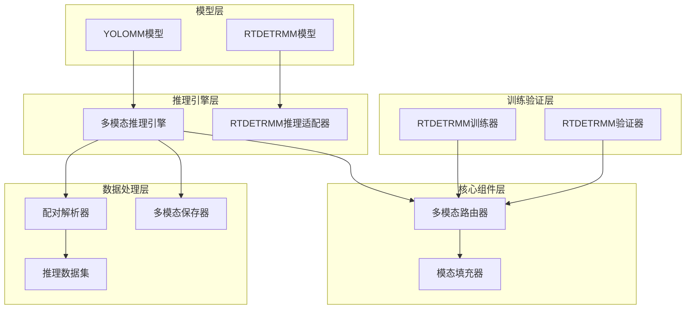
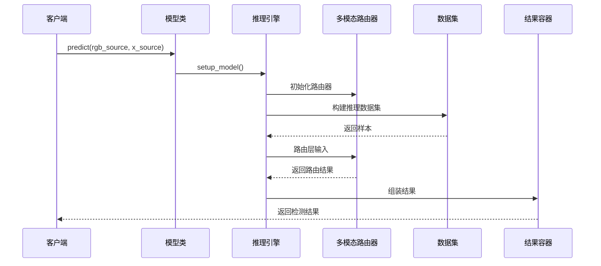
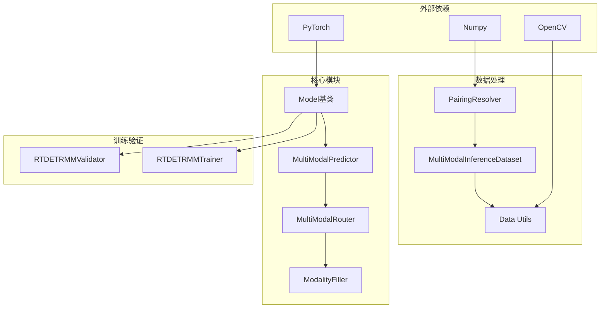

# API参考文档

<cite>
**本文档引用的文件**
- [ultralytics/models/rtdetrmm/model.py](file://ultralytics/models/rtdetrmm/model.py)
- [ultralytics/models/yolo/model.py](file://ultralytics/models/yolo/model.py)
- [ultralytics/engine/multimodal/predictor.py](file://ultralytics/engine/multimodal/predictor.py)
- [ultralytics/engine/multimodal/results.py](file://ultralytics/engine/multimodal/results.py)
- [ultralytics/nn/mm/router.py](file://ultralytics/nn/mm/router.py)
- [ultralytics/nn/mm/filling.py](file://ultralytics/nn/mm/filling.py)
- [ultralytics/models/rtdetrmm/mm_predictor.py](file://ultralytics/models/rtdetrmm/mm_predictor.py)
- [ultralytics/engine/multimodal/saver.py](file://ultralytics/engine/multimodal/saver.py)
- [ultralytics/data/multimodal/inference_dataset.py](file://ultralytics/data/multimodal/inference_dataset.py)
- [ultralytics/models/rtdetrmm/train.py](file://ultralytics/models/rtdetrmm/train.py)
- [ultralytics/models/rtdetrmm/val.py](file://ultralytics/models/rtdetrmm/val.py)
- [ultralytics/data/multimodal/pairing.py](file://ultralytics/data/multimodal/pairing.py)
- [ultralytics/data/multimodal/utils.py](file://ultralytics/data/multimodal/utils.py)
- [ultralytics/engine/model.py](file://ultralytics/engine/model.py)
</cite>

## 目录
1. [简介](#简介)
2. [项目结构](#项目结构)
3. [核心组件](#核心组件)
4. [架构概览](#架构概览)
5. [详细组件分析](#详细组件分析)
6. [依赖关系分析](#依赖关系分析)
7. [性能考虑](#性能考虑)
8. [故障排除指南](#故障排除指南)
9. [结论](#结论)

## 简介

本API参考文档为多模态检测系统提供了完整的接口说明，涵盖了YOLOMM和RTDETRMM模型类的全部公共API，包括模型初始化、训练接口、推理接口和结果处理方法。文档还详细介绍了MultiModalRouter、ModalityFiller等核心组件的API规范，包含了参数验证规则、异常处理机制和使用示例。

该系统支持RGB和X模态的多模态融合检测，提供灵活的通道配置和自动模态路由功能，能够处理3通道RGB-only和6通道RGB+X的混合输入场景。

## 项目结构

多模态检测系统采用模块化架构设计，主要分为以下几个核心层次：



**图表来源**
- [ultralytics/models/rtdetrmm/model.py:25-57](file://ultralytics/models/rtdetrmm/model.py#L25-L57)
- [ultralytics/engine/multimodal/predictor.py:16-30](file://ultralytics/engine/multimodal/predictor.py#L16-L30)
- [ultralytics/nn/mm/router.py:11-24](file://ultralytics/nn/mm/router.py#L11-L24)

**章节来源**
- [ultralytics/models/rtdetrmm/model.py:1-269](file://ultralytics/models/rtdetrmm/model.py#L1-L269)
- [ultralytics/models/yolo/model.py:27-131](file://ultralytics/models/yolo/model.py#L27-L131)

## 核心组件

### YOLOMM模型类

YOLOMM是YOLO架构的多模态扩展，支持RGB+X模态的联合检测。

**主要特性：**
- 支持3通道RGB-only和6通道RGB+X输入
- 自动模态配置检测和验证
- 灵活的通道数配置
- 多模态路由器集成

**关键方法：**
- `__init__()`: 模型初始化，支持显式通道配置
- `_configure_multimodal_settings()`: 多模态设置配置
- `get_modality_info()`: 获取模态信息
- `cocoval()`: COCO评估接口

**章节来源**
- [ultralytics/models/yolo/model.py:456-658](file://ultralytics/models/yolo/model.py#L456-L658)

### RTDETRMM模型类

RTDETRMM是RT-DETR架构的多模态版本，专为多模态检测优化。

**主要特性：**
- 基于RT-DETR的多模态检测
- 独立的多模态家族实现
- 严格的多模态内容判据
- 可视化功能支持

**关键方法：**
- `__init__()`: 多模态RT-DETR初始化
- `vis()`: 可视化接口
- `val()`: 验证接口
- `cocoval()`: COCO评估接口

**章节来源**
- [ultralytics/models/rtdetrmm/model.py:25-269](file://ultralytics/models/rtdetrmm/model.py#L25-L269)

### MultiModalPredictor推理引擎

多模态推理引擎的核心组件，提供高效的多模态推理能力。

**主要功能：**
- RGB和X模态的显式输入处理
- 流式推理支持
- 自动模型类型检测
- 后处理和结果组装

**关键参数：**
- `model`: YOLOMM/RTDETRMM模型实例
- `imgsz`: 推理输入尺寸
- `conf`: 置信度阈值
- `iou`: NMS IoU阈值
- `max_det`: 最大检测框数量

**章节来源**
- [ultralytics/engine/multimodal/predictor.py:16-494](file://ultralytics/engine/multimodal/predictor.py#L16-L494)

### MultiModalRouter多模态路由器

通用的RGB+X多模态数据路由器，支持零拷贝张量路由。

**核心功能：**
- RGB、X、Dual模态支持
- 零拷贝张量视图路由
- 配置驱动的数据流
- 动态通道数支持

**关键方法：**
- `setup_multimodal_routing()`: 多模态路由设置
- `route_layer_input()`: 层输入路由
- `set_runtime_params()`: 运行时参数设置

**章节来源**
- [ultralytics/nn/mm/router.py:11-471](file://ultralytics/nn/mm/router.py#L11-L471)

## 架构概览

多模态检测系统采用分层架构设计，确保各组件职责清晰、耦合度低：



**图表来源**
- [ultralytics/engine/multimodal/predictor.py:99-142](file://ultralytics/engine/multimodal/predictor.py#L99-L142)
- [ultralytics/nn/mm/router.py:157-240](file://ultralytics/nn/mm/router.py#L157-L240)

## 详细组件分析

### YOLOMM模型API详解

#### 初始化方法
```python
def __init__(self, model: Union[str, Path] = "yolo11n-mm.yaml", 
             task: Optional[str] = None, ch: Optional[int] = None, verbose: bool = False)
```

**参数说明：**
- `model`: 模型文件路径或名称，支持.yaml和.pt格式
- `task`: 任务类型，自动从模型配置推断
- `ch`: 输入通道数，3表示RGB-only，6表示RGB+X
- `verbose`: 是否输出详细信息

**返回值：** 初始化的YOLOMM模型实例

**异常处理：**
- 不支持的输入通道数会抛出ValueError
- 模型配置解析失败会使用默认配置

#### 多模态配置方法
```python
def _configure_multimodal_settings(self, verbose: bool = False) -> None
```

**功能：** 基于模型配置检测多模态能力和通道数

**返回值：** None

#### 模态信息获取
```python
def get_modality_info(self) -> Dict[str, Any]
```

**返回值：** 包含输入通道数、模态配置、模型类型等信息的字典

**章节来源**
- [ultralytics/models/yolo/model.py:488-658](file://ultralytics/models/yolo/model.py#L488-L658)

### RTDETRMM模型API详解

#### 初始化方法
```python
def __init__(self, model: Union[str, Path] = "rtdetr-r18-mm.pt", 
             ch: Optional[int] = None, verbose: bool = False) -> None
```

**参数说明：**
- `model`: RTDETRMM模型文件路径
- `ch`: 输入通道数（3或6）
- `verbose`: 详细输出开关

**异常处理：** 使用Fail-Fast策略，严格验证多模态结构

#### 可视化方法
```python
def vis(self, rgb_source: Optional[Union[str, np.ndarray, list]] = None,
        x_source: Optional[Union[str, np.ndarray, list]] = None,
        method: str = "heat", layers: Optional[list[int]] = None,
        modality: Optional[str] = None, save: bool = True,
        overlay: Optional[str] = None, project: Optional[Union[str, Path]] = None,
        name: Optional[str] = None, out_dir: Optional[Union[str, Path]] = None,
        device: Optional[str] = None, **kwargs) -> Any
```

**功能：** 多模态可视化入口，委托给RTDETRMMVisualizationRunner

**章节来源**
- [ultralytics/models/rtdetrmm/model.py:190-222](file://ultralytics/models/rtdetrmm/model.py#L190-L222)

### MultiModalPredictor推理引擎API

#### 主要接口
```python
def __call__(self, rgb_source: Union[str, Path, List[Union[str, Path]]],
            x_source: Union[str, Path, List[Union[str, Path]]],
            stream: bool = False, save: bool = False,
            save_txt: bool = False, save_dir: Optional[Path] = None,
            **kwargs) -> Generator[MultiModalResults] | List[MultiModalResults]
```

**参数说明：**
- `rgb_source`: RGB图像源，支持单个或批量
- `x_source`: X模态图像源，支持单个或批量
- `stream`: 是否流式返回结果
- `save`: 是否保存结果
- `save_txt`: 是否保存txt标签
- `save_dir`: 保存目录

**返回值：** 流式生成器或结果列表

#### 后处理方法
```python
def _postprocess_rtdetr(self, preds: torch.Tensor, sample: Dict) -> torch.Tensor
```

**功能：** RTDETR专用后处理，包括坐标转换、NMS和缩放

**章节来源**
- [ultralytics/engine/multimodal/predictor.py:99-434](file://ultralytics/engine/multimodal/predictor.py#L99-L434)

### MultiModalRouter路由器API

#### 路由设置方法
```python
def setup_multimodal_routing(self, x: torch.Tensor, profile: bool = False) -> tuple[bool, dict]
```

**功能：** 设置多模态输入源和路由系统

**返回值：** (routing_enabled, input_sources_dict)

#### 层输入路由
```python
def route_layer_input(self, x: torch.Tensor, module: nn.Module,
                     input_sources: dict, profile: bool = False) -> torch.Tensor | None
```

**功能：** 基于模块属性路由输入数据

**章节来源**
- [ultralytics/nn/mm/router.py:157-317](file://ultralytics/nn/mm/router.py#L157-L317)

### ModalityFiller模态填充器API

#### 填充生成方法
```python
def generate(self, source_tensor: torch.Tensor,
            source_modality: str, target_modality: str,
            strategy: Optional[str] = None) -> torch.Tensor
```

**支持的策略：**
- `copy`: 复制填充
- `noise`: 噪声填充
- `channel_repeat`: 通道重复
- `edge_blur`: 边缘模糊
- `mixed`: 混合策略

**章节来源**
- [ultralytics/nn/mm/filling.py:141-175](file://ultralytics/nn/mm/filling.py#L141-L175)

## 依赖关系分析

多模态检测系统的依赖关系呈现清晰的分层结构：



**图表来源**
- [ultralytics/engine/model.py:29-80](file://ultralytics/engine/model.py#L29-L80)
- [ultralytics/nn/mm/router.py:5-8](file://ultralytics/nn/mm/router.py#L5-L8)

**章节来源**
- [ultralytics/engine/model.py:1-800](file://ultralytics/engine/model.py#L1-L800)

## 性能考虑

### 推理性能优化

1. **流式推理**：MultiModalPredictor支持真正的流式推理，边迭代边返回结果
2. **零拷贝路由**：MultiModalRouter实现零拷贝张量视图路由
3. **动态通道数**：支持3通道和6通道的动态切换
4. **批处理优化**：支持批量推理以提高吞吐量

### 训练性能优化

1. **模态消融**：支持单模态训练消融，提高训练效率
2. **智能填充**：ModalityFiller提供多种填充策略
3. **动态warmup**：RTDETRMMValidator支持动态通道数warmup

## 故障排除指南

### 常见问题及解决方案

#### 模型初始化失败
**症状：** 抛出ValueError，提示不支持的输入通道数
**解决：** 检查模型配置文件中的channels参数，确保支持3或6通道

#### 多模态配置检测失败
**症状：** 多模态设置配置失败，使用默认配置
**解决：** 检查模型文件的yaml配置，确保包含正确的多模态路由标记

#### 推理结果异常
**症状：** 检测框坐标异常或数量异常
**解决：** 检查输入图像的尺寸和通道数，确保RGB和X模态的对齐

#### 训练收敛问题
**症状：** 单模态训练效果不佳
**解决：** 调整填充策略参数，尝试不同的模态填充方法

**章节来源**
- [ultralytics/models/rtdetrmm/model.py:140-146](file://ultralytics/models/rtdetrmm/model.py#L140-L146)
- [ultralytics/nn/mm/router.py:266-317](file://ultralytics/nn/mm/router.py#L266-L317)

## 结论

多模态检测系统提供了完整的API接口，支持YOLOMM和RTDETRMM两种主流多模态检测框架。系统采用模块化设计，具有良好的扩展性和维护性。

**主要优势：**
1. **完整的API覆盖**：涵盖模型初始化、训练、推理、验证的全流程
2. **灵活的配置**：支持3通道和6通道的动态切换
3. **强大的路由系统**：MultiModalRouter提供高效的模态路由
4. **完善的错误处理**：严格的参数验证和异常处理机制
5. **丰富的使用示例**：提供多种使用场景的参考实现

开发者可以基于这些API快速集成和扩展多模态检测功能，支持RGB和X模态的各种组合场景。