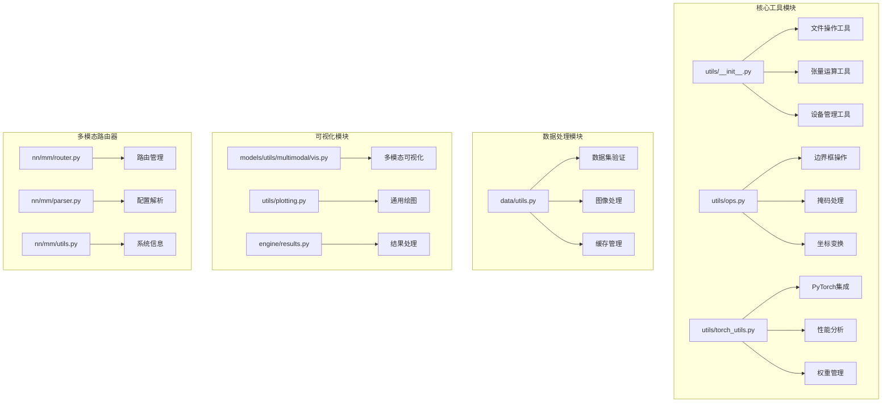
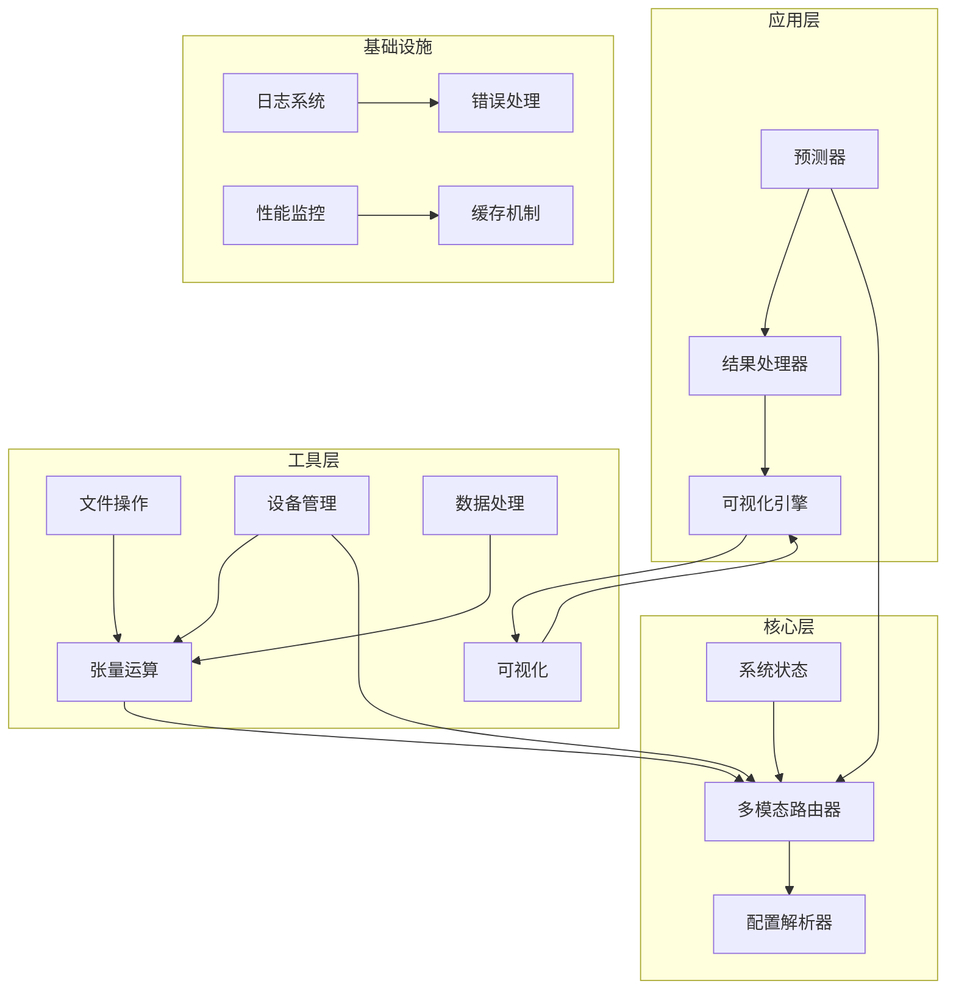
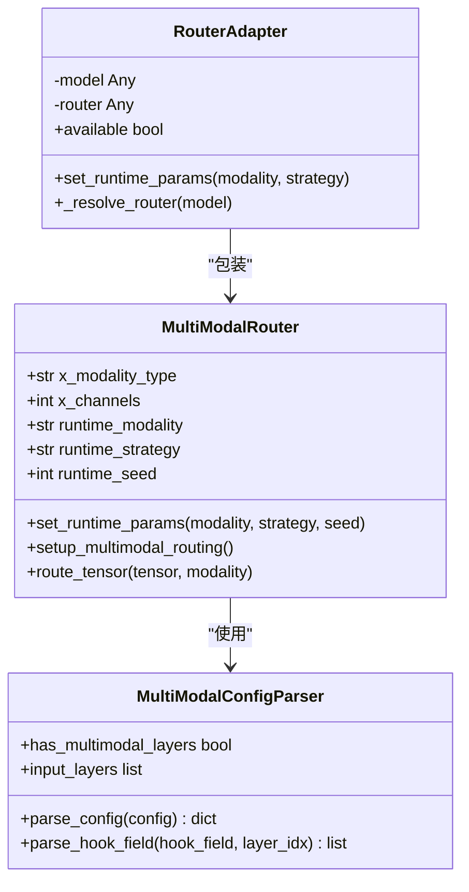
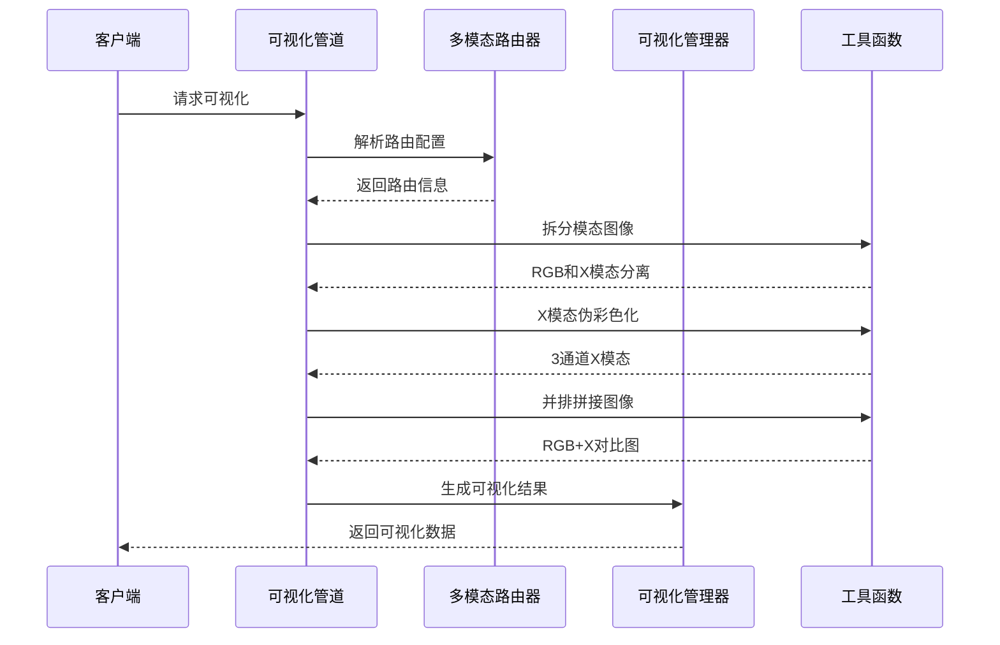
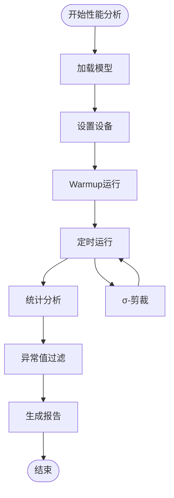
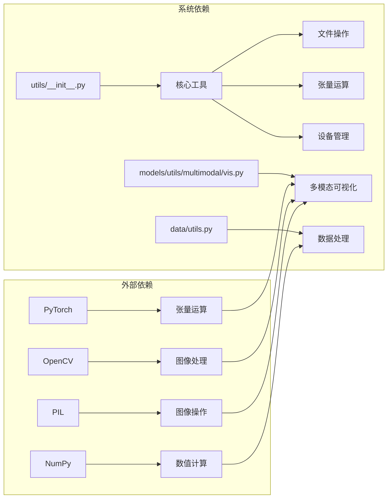

# 工具函数API

<cite>
**本文档引用的文件**
- [ultralytics/utils/__init__.py](file://ultralytics/utils/__init__.py)
- [ultralytics/utils/files.py](file://ultralytics/utils/files.py)
- [ultralytics/utils/ops.py](file://ultralytics/utils/ops.py)
- [ultralytics/utils/torch_utils.py](file://ultralytics/utils/torch_utils.py)
- [ultralytics/utils/plotting.py](file://ultralytics/utils/plotting.py)
- [ultralytics/utils/benchmarks.py](file://ultralytics/utils/benchmarks.py)
- [ultralytics/data/utils.py](file://ultralytics/data/utils.py)
- [ultralytics/models/utils/multimodal/vis.py](file://ultralytics/models/utils/multimodal/vis.py)
- [ultralytics/engine/results.py](file://ultralytics/engine/results.py)
- [ultralytics/models/yolo/multimodal/visualize/manager.py](file://ultralytics/models/yolo/multimodal/visualize/manager.py)
- [ultralytics/models/yolo/multimodal/visualize/pipeline.py](file://ultralytics/models/yolo/multimodal/visualize/pipeline.py)
- [ultralytics/nn/mm/router.py](file://ultralytics/nn/mm/router.py)
- [ultralytics/nn/mm/parser.py](file://ultralytics/nn/mm/parser.py)
- [ultralytics/nn/mm/utils.py](file://ultralytics/nn/mm/utils.py)
</cite>

## 目录
1. [简介](#简介)
2. [项目结构](#项目结构)
3. [核心组件](#核心组件)
4. [架构概览](#架构概览)
5. [详细组件分析](#详细组件分析)
6. [依赖分析](#依赖分析)
7. [性能考虑](#性能考虑)
8. [故障排除指南](#故障排除指南)
9. [结论](#结论)

## 简介

本文档为多模态检测系统的工具函数创建了详细的API文档。该系统提供了丰富的工具函数，涵盖文件操作、张量运算、设备管理、数据处理、可视化和调试等功能。这些工具函数专为多模态检测任务设计，支持RGB和X模态的联合处理。

系统的核心优势包括：
- **多模态支持**：专门针对RGB+X模态的统一处理框架
- **零拷贝张量路由**：高效的内存管理和数据传输
- **配置驱动的数据流**：灵活的路由策略和参数管理
- **完整的可视化工具链**：从基础绘图到高级热力图生成

## 项目结构

多模态检测系统的工具函数分布在多个核心模块中：

**图表来源**
- [ultralytics/utils/__init__.py:1-800](file://ultralytics/utils/__init__.py#L1-L800)
- [ultralytics/utils/ops.py:1-800](file://ultralytics/utils/ops.py#L1-L800)
- [ultralytics/utils/torch_utils.py:1-800](file://ultralytics/utils/torch_utils.py#L1-L800)
- [ultralytics/data/utils.py:1-800](file://ultralytics/data/utils.py#L1-L800)

**章节来源**
- [ultralytics/utils/__init__.py:1-800](file://ultralytics/utils/__init__.py#L1-L800)
- [ultralytics/utils/ops.py:1-800](file://ultralytics/utils/ops.py#L1-L800)
- [ultralytics/utils/torch_utils.py:1-800](file://ultralytics/utils/torch_utils.py#L1-L800)
- [ultralytics/data/utils.py:1-800](file://ultralytics/data/utils.py#L1-L800)

## 核心组件

### 文件操作工具

文件操作工具提供了多模态检测系统中常用的文件和目录管理功能：

**主要功能**：
- 工作目录切换和管理
- 路径处理和空间字符替换
- 文件名递增和日期查询
- 模型更新和重保存

**关键函数**：
- `WorkingDirectory`：上下文管理器，临时切换工作目录
- `spaces_in_path`：处理包含空格的路径
- `increment_path`：递增文件或目录路径
- `update_models`：批量更新和重新保存模型

### 张量运算工具

张量运算工具专注于多模态检测中的数学计算和数据转换：

**主要功能**：
- 边界框坐标转换和标准化
- 掩码处理和图像缩放
- 几何变换和裁剪
- NMS（非极大值抑制）算法

**关键函数**：
- `scale_boxes`：缩放边界框坐标
- `xyxy2xywh` / `xywh2xyxy`：坐标格式转换
- `process_mask`：应用掩码到边界框
- `non_max_suppression`：非极大值抑制

### 设备管理工具

设备管理工具负责PyTorch张量的设备选择和性能优化：

**主要功能**：
- 自动设备选择和验证
- 混合精度训练支持
- 模型信息统计和性能分析
- 权重初始化和复制

**关键函数**：
- `select_device`：智能选择可用设备
- `autocast`：自动混合精度上下文管理
- `model_info`：模型信息统计
- `get_flops`：计算模型FLOPs

### 可视化工具

可视化工具提供了多模态检测结果的可视化能力：

**主要功能**：
- 多模态图像拆分和拼接
- 坐标归一化和边界框处理
- 伪彩色映射和热力图生成
- 统一的绘图接口

**关键函数**：
- `split_modalities`：拆分RGB和X模态
- `visualize_x_to_3ch`：X模态伪彩色可视化
- `concat_side_by_side`：并排图像拼接
- `to_norm_xywh_for_plot`：坐标归一化

**章节来源**
- [ultralytics/utils/files.py:1-223](file://ultralytics/utils/files.py#L1-L223)
- [ultralytics/utils/ops.py:1-800](file://ultralytics/utils/ops.py#L1-L800)
- [ultralytics/utils/torch_utils.py:1-800](file://ultralytics/utils/torch_utils.py#L1-L800)
- [ultralytics/models/utils/multimodal/vis.py:1-537](file://ultralytics/models/utils/multimodal/vis.py#L1-L537)

## 架构概览

多模态检测系统的工具函数采用分层架构设计，确保功能模块的独立性和可扩展性：

**图表来源**
- [ultralytics/nn/mm/router.py:55-79](file://ultralytics/nn/mm/router.py#L55-L79)
- [ultralytics/nn/mm/parser.py:67-97](file://ultralytics/nn/mm/parser.py#L67-L97)
- [ultralytics/models/utils/multimodal/vis.py:1-537](file://ultralytics/models/utils/multimodal/vis.py#L1-L537)

## 详细组件分析

### 多模态路由器系统

多模态路由器是系统的核心组件，负责RGB和X模态之间的数据路由和转换。

**图表来源**
- [ultralytics/nn/mm/router.py:55-79](file://ultralytics/nn/mm/router.py#L55-L79)
- [ultralytics/nn/mm/parser.py:67-97](file://ultralytics/nn/mm/parser.py#L67-L97)
- [ultralytics/models/yolo/multimodal/visualize/pipeline.py:35-73](file://ultralytics/models/yolo/multimodal/visualize/pipeline.py#L35-L73)

#### 路由器参数管理

路由器支持动态参数设置，允许在运行时调整模态和策略：

**参数类型**：
- `modality`：指定运行时模态（rgb、x、depth等）
- `strategy`：路由策略（如随机、固定等）
- `seed`：随机种子，确保结果可重现

**使用场景**：
- A/B测试不同路由策略
- 动态模态切换
- 实验性功能测试

### 可视化管道系统

可视化管道提供了完整的多模态可视化解决方案：

**图表来源**
- [ultralytics/models/utils/multimodal/vis.py:60-170](file://ultralytics/models/utils/multimodal/vis.py#L60-L170)
- [ultralytics/models/yolo/multimodal/visualize/pipeline.py:108-123](file://ultralytics/models/yolo/multimodal/visualize/pipeline.py#L108-L123)

#### 可视化工具函数

**图像处理函数**：
- `split_modalities`：严格按RGB(3)、X(Xch)顺序拆分
- `visualize_x_to_3ch`：支持灰度复制和伪彩色映射
- `concat_side_by_side`：水平拼接RGB和X模态

**坐标处理函数**：
- `to_norm_xywh_for_plot`：像素坐标转归一化坐标
- `duplicate_bboxes_for_side_by_side`：边界框复制到并排视图
- `adjust_bboxes_for_side_by_side`：坐标半宽缩放

### 性能分析和基准测试

系统提供了全面的性能分析工具：

**图表来源**
- [ultralytics/utils/benchmarks.py:539-642](file://ultralytics/utils/benchmarks.py#L539-L642)
- [ultralytics/utils/benchmarks.py:436-489](file://ultralytics/utils/benchmarks.py#L436-L489)

**章节来源**
- [ultralytics/nn/mm/router.py:55-79](file://ultralytics/nn/mm/router.py#L55-L79)
- [ultralytics/models/utils/multimodal/vis.py:1-537](file://ultralytics/models/utils/multimodal/vis.py#L1-L537)
- [ultralytics/utils/benchmarks.py:1-721](file://ultralytics/utils/benchmarks.py#L1-L721)

## 依赖分析

多模态检测系统的工具函数具有清晰的依赖关系：

**图表来源**
- [ultralytics/utils/__init__.py:1-800](file://ultralytics/utils/__init__.py#L1-L800)
- [ultralytics/models/utils/multimodal/vis.py:1-537](file://ultralytics/models/utils/multimodal/vis.py#L1-L537)

**章节来源**
- [ultralytics/utils/__init__.py:1-800](file://ultralytics/utils/__init__.py#L1-L800)
- [ultralytics/models/utils/multimodal/vis.py:1-537](file://ultralytics/models/utils/multimodal/vis.py#L1-L537)

## 性能考虑

### 内存优化策略

1. **零拷贝张量路由**：通过视图操作避免不必要的数据复制
2. **设备间高效传输**：优化GPU和CPU之间的数据传输
3. **批处理优化**：合理设置批大小以平衡内存使用和吞吐量

### 计算效率提升

1. **混合精度训练**：自动混合精度减少内存占用和提高计算速度
2. **向量化操作**：利用NumPy和PyTorch的向量化特性
3. **缓存机制**：合理使用LRU缓存减少重复计算

### 最佳实践建议

1. **设备选择**：优先使用GPU进行张量运算
2. **数据类型**：在可能的情况下使用float32而非float64
3. **内存管理**：及时释放不需要的中间结果

## 故障排除指南

### 常见问题和解决方案

**设备相关问题**：
- 检查CUDA可用性和版本兼容性
- 验证GPU内存是否足够
- 确认多GPU环境下的正确配置

**数据处理问题**：
- 验证输入数据格式和范围
- 检查边界框坐标的有效性
- 确认模态通道数的正确性

**性能问题**：
- 使用性能分析工具识别瓶颈
- 调整批大小和并行度
- 优化数据加载和预处理流程

**章节来源**
- [ultralytics/utils/torch_utils.py:131-252](file://ultralytics/utils/torch_utils.py#L131-L252)
- [ultralytics/utils/benchmarks.py:52-211](file://ultralytics/utils/benchmarks.py#L52-L211)

## 结论

多模态检测系统的工具函数提供了完整而强大的功能集合，涵盖了现代计算机视觉应用的各种需求。系统的设计充分考虑了多模态检测的特殊要求，提供了高效的张量操作、灵活的设备管理、完善的可视化能力和全面的性能分析工具。

通过合理的使用这些工具函数，开发者可以：
- 快速实现复杂的多模态检测任务
- 优化系统性能和资源使用
- 简化调试和故障排除过程
- 提供直观的结果可视化

建议在实际项目中根据具体需求选择合适的工具函数组合，并遵循最佳实践来确保系统的稳定性和性能。