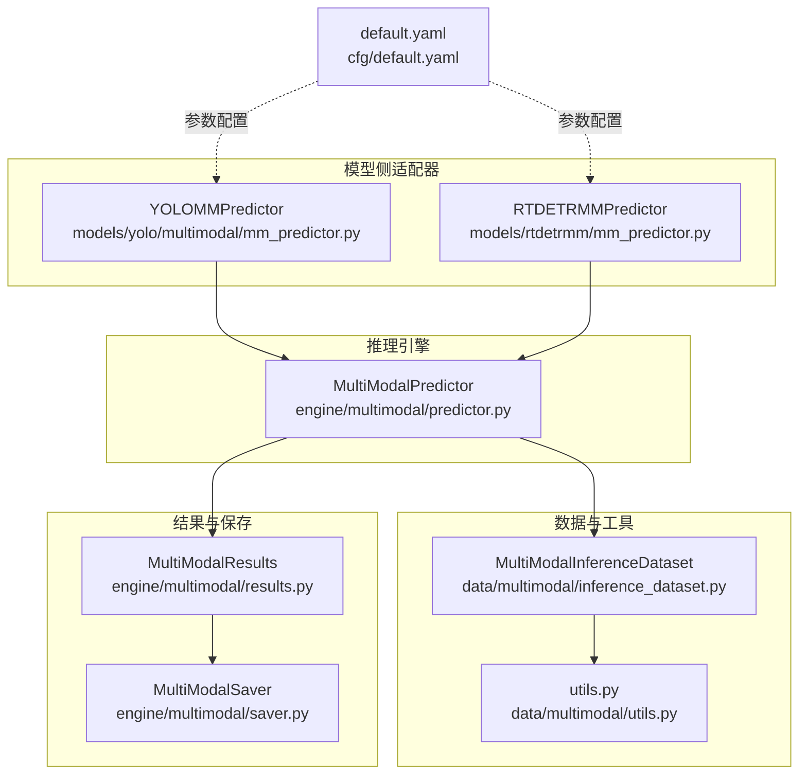
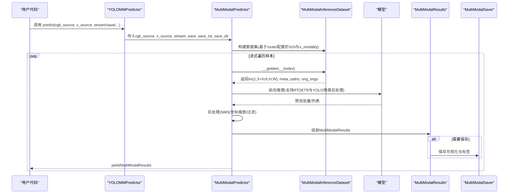
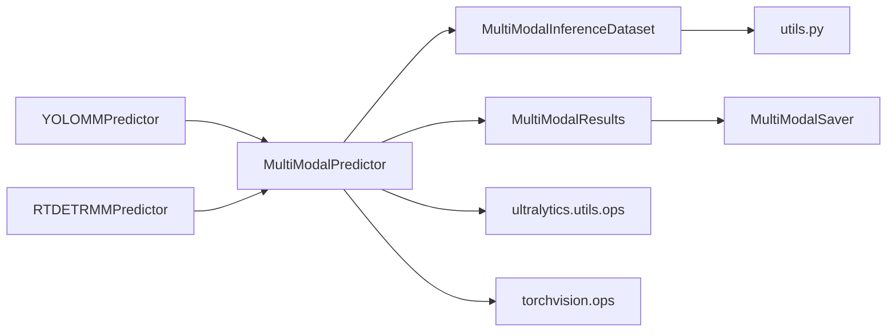

# 推理接口API

<cite>
**本文引用的文件**
- [predictor.py](file://ultralytics/engine/multimodal/predictor.py)
- [mm_predictor.py](file://ultralytics/models/yolo/multimodal/mm_predictor.py)
- [inference_dataset.py](file://ultralytics/data/multimodal/inference_dataset.py)
- [results.py](file://ultralytics/engine/multimodal/results.py)
- [saver.py](file://ultralytics/engine/multimodal/saver.py)
- [utils.py](file://ultralytics/data/multimodal/utils.py)
- [predict.py](file://ultralytics/models/yolo/multimodal/predict.py)
- [default.yaml](file://ultralytics/cfg/default.yaml)
- [predictMM.py](file://predictMM.py)
- [visMM.py](file://visMM.py)
</cite>

## 目录
1. [简介](#简介)
2. [项目结构](#项目结构)
3. [核心组件](#核心组件)
4. [架构总览](#架构总览)
5. [详细组件分析](#详细组件分析)
6. [依赖分析](#依赖分析)
7. [性能考虑](#性能考虑)
8. [故障排查指南](#故障排查指南)
9. [结论](#结论)
10. [附录](#附录)

## 简介
本文件为多模态检测系统的推理接口API参考，围绕 MultiModalDetectionPredictor 类及其相关推理组件，系统梳理以下内容：
- 推理接口方法签名、参数说明与返回值类型
- 推理数据预处理、模型推理执行、结果后处理与可视化输出的完整流程
- 不同模态组合（双模态、单RGB模态、单X模态）的推理接口使用示例
- 批量推理、实时推理与离线推理的场景接口说明
- 性能优化建议与内存管理策略

## 项目结构
多模态推理体系由“模型侧适配器 + 推理引擎 + 数据集 + 结果容器 + 保存器 + 工具函数”构成，核心文件如下：
- 模型侧适配器：YOLOMMPredictor、RTDETRMMPredictor
- 推理引擎：MultiModalPredictor
- 数据集：MultiModalInferenceDataset
- 结果容器：MultiModalResults
- 保存器：MultiModalSaver
- 工具函数：align_and_validate_x、letterbox_with_ratio_pad、to_tensor_rgb、to_tensor_x
- 配置：default.yaml
- 示例脚本：predictMM.py、visMM.py

**图表来源**
- [mm_predictor.py:18-136](file://ultralytics/models/yolo/multimodal/mm_predictor.py#L18-L136)
- [predictor.py:16-494](file://ultralytics/engine/multimodal/predictor.py#L16-L494)
- [inference_dataset.py:16-252](file://ultralytics/data/multimodal/inference_dataset.py#L16-L252)
- [utils.py:13-180](file://ultralytics/data/multimodal/utils.py#L13-L180)
- [results.py:14-357](file://ultralytics/engine/multimodal/results.py#L14-L357)
- [saver.py:12-112](file://ultralytics/engine/multimodal/saver.py#L12-L112)
- [default.yaml:1-168](file://ultralytics/cfg/default.yaml#L1-L168)

**章节来源**
- [mm_predictor.py:18-136](file://ultralytics/models/yolo/multimodal/mm_predictor.py#L18-L136)
- [predictor.py:16-494](file://ultralytics/engine/multimodal/predictor.py#L16-L494)
- [inference_dataset.py:16-252](file://ultralytics/data/multimodal/inference_dataset.py#L16-L252)
- [utils.py:13-180](file://ultralytics/data/multimodal/utils.py#L13-L180)
- [results.py:14-357](file://ultralytics/engine/multimodal/results.py#L14-L357)
- [saver.py:12-112](file://ultralytics/engine/multimodal/saver.py#L12-L112)
- [default.yaml:1-168](file://ultralytics/cfg/default.yaml#L1-L168)

## 核心组件
- MultiModalDetectionPredictor：面向 YOLOMM 的检测预测器，支持双模态与单模态推理，负责输入解析、路由注入与结果组织。
- MultiModalPredictor：独立的多模态推理引擎，负责数据集构建、流式推理、后处理与结果封装。
- MultiModalInferenceDataset：多模态推理专用数据集，提供严格的输入校验、空间对齐与张量化。
- MultiModalResults：多模态结果容器，支持绘制、合并与保存。
- MultiModalSaver：结果保存器，负责可视化图像与标签文件的落盘。
- 工具函数：对齐与校验 X 模态、LetterBox 与 ratio_pad 计算、RGB/X 张量化。

**章节来源**
- [predict.py:15-42](file://ultralytics/models/yolo/multimodal/predict.py#L15-L42)
- [predictor.py:16-98](file://ultralytics/engine/multimodal/predictor.py#L16-L98)
- [inference_dataset.py:16-89](file://ultralytics/data/multimodal/inference_dataset.py#L16-L89)
- [results.py:14-60](file://ultralytics/engine/multimodal/results.py#L14-L60)
- [saver.py:12-53](file://ultralytics/engine/multimodal/saver.py#L12-L53)
- [utils.py:13-84](file://ultralytics/data/multimodal/utils.py#L13-L84)

## 架构总览
下图展示从模型调用到最终结果输出的端到端流程，包括参数解析、数据准备、模型推理、后处理与保存。

**图表来源**
- [mm_predictor.py:71-111](file://ultralytics/models/yolo/multimodal/mm_predictor.py#L71-L111)
- [predictor.py:99-143](file://ultralytics/engine/multimodal/predictor.py#L99-L143)
- [inference_dataset.py:94-183](file://ultralytics/data/multimodal/inference_dataset.py#L94-L183)
- [results.py:436-464](file://ultralytics/engine/multimodal/results.py#L436-L464)
- [saver.py:54-112](file://ultralytics/engine/multimodal/saver.py#L54-L112)

## 详细组件分析

### MultiModalDetectionPredictor（YOLOMM）
- 角色与职责
  - 扩展 DetectionPredictor，支持双模态与单模态推理
  - 负责从 YOLOMM.predict() 接收输入，注入运行时模态参数至路由器，组织结果并进行可视化
- 关键方法与行为
  - 初始化：读取 modality 参数，区分双/单模态
  - 路由器获取与注入：在双模态时设置 runtime_modality=None，在单模态时注入具体模态与消融策略
  - 输入解析：支持字符串路径、列表（双模态）、PIL/ndarray、张量等多种输入
  - 预处理：通过 MultiModalRouter 完成输入路由与预处理
  - 可视化：支持双模态并排合并图
- 典型调用
  - 双模态：source 为 [rgb_path, x_path]
  - 单模态：source 为单一路径或数组，并设置 modality="rgb"/"depth"/"thermal"/"ir"

**章节来源**
- [predict.py:44-137](file://ultralytics/models/yolo/multimodal/predict.py#L44-L137)
- [predict.py:149-200](file://ultralytics/models/yolo/multimodal/predict.py#L149-L200)
- [predict.py:1554-1556](file://ultralytics/models/yolo/multimodal/predict.py#L1554-L1556)

### MultiModalPredictor（独立推理引擎）
- 初始化参数
  - model：YOLOMM/RTDETRMM 模型实例
  - imgsz：推理输入尺寸（int或(H,W)）
  - conf/iou/max_det：置信度阈值、NMS IoU阈值、最大检测数
  - device：设备（'cuda'/'cpu'/cuda:0）
  - verbose/debug：日志级别与调试开关
- 核心方法
  - __call__(rgb_source, x_source, stream, save, save_txt, save_dir, **kwargs)
    - 返回：stream=True 时为生成器，逐样本产出 MultiModalResult；否则为列表
  - _stream_inference(dataset, save, save_txt, save_dir)
    - 流式执行：逐样本前向、后处理、组装结果、可选保存
  - _postprocess_rtdetr(preds, sample)
    - RTDETR专用后处理：置信度过滤、NMS、坐标缩放与原图还原
  - _create_result(sample, pred)
    - 组装 MultiModalResults，包含 boxes、paths、orig_imgs、meta、names
  - _save_result(result, save_txt, save_dir)
    - 使用 MultiModalSaver 保存可视化与标签
- 设计要点
  - 严格区分 RTDETR 与 YOLO 后处理路径
  - 通过模型的 mm_router 读取 X 模态类型与通道数
  - 支持真正的流式（边迭代边 yield）

**章节来源**
- [predictor.py:32-98](file://ultralytics/engine/multimodal/predictor.py#L32-L98)
- [predictor.py:99-143](file://ultralytics/engine/multimodal/predictor.py#L99-L143)
- [predictor.py:144-244](file://ultralytics/engine/multimodal/predictor.py#L144-L244)
- [predictor.py:323-434](file://ultralytics/engine/multimodal/predictor.py#L323-L434)
- [predictor.py:436-464](file://ultralytics/engine/multimodal/predictor.py#L436-L464)
- [predictor.py:466-494](file://ultralytics/engine/multimodal/predictor.py#L466-L494)

### MultiModalInferenceDataset（推理数据集）
- 职责
  - 从 PairingResolver 提供的样本规格构建可迭代数据集
  - 加载 RGB 与 X 模态，进行 LetterBox、张量化与通道校验
  - 支持 RGB/X 缺失时的零填充策略
- 关键点
  - 严格校验：文件存在性、可读性、X 通道数一致性
  - X 模态支持 .npy/.npz/.tiff 等格式，必要时自动选择键
  - 空间对齐：以 RGB 为基准，将 X resize 到相同尺寸
- 输出样本
  - 包含 id、paths、orig_imgs、meta、im（张量）

**章节来源**
- [inference_dataset.py:32-89](file://ultralytics/data/multimodal/inference_dataset.py#L32-L89)
- [inference_dataset.py:94-183](file://ultralytics/data/multimodal/inference_dataset.py#L94-L183)
- [inference_dataset.py:185-246](file://ultralytics/data/multimodal/inference_dataset.py#L185-L246)

### MultiModalResults（结果容器）
- 字段
  - boxes：[N, 6] 检测框（x1,y1,x2,y2,conf,cls）
  - paths/orig_imgs/meta：路径、原图与元数据
  - names：类别名称映射
- 可视化
  - plot(conf, line_width, font_size, labels)：返回 {'rgb': annotated_rgb, 'x': annotated_x} 或仅 'rgb'
  - plot_merged(conf, line_width, font_size, labels)：双模态并排合并图（需满足条件）
- 保存
  - save_txt(save_path, save_conf)：YOLO格式文本标签
  - save_json(save_path)：JSON格式结果

**章节来源**
- [results.py:30-60](file://ultralytics/engine/multimodal/results.py#L30-L60)
- [results.py:61-131](file://ultralytics/engine/multimodal/results.py#L61-L131)
- [results.py:186-234](file://ultralytics/engine/multimodal/results.py#L186-L234)
- [results.py:235-272](file://ultralytics/engine/multimodal/results.py#L235-L272)
- [results.py:273-357](file://ultralytics/engine/multimodal/results.py#L273-L357)

### MultiModalSaver（结果保存器）
- 功能
  - 保存 RGB 可视化图（必出）
  - 保存 X 可视化图（仅当 xch∈{1,3}）
  - 保存双模态并排合并图（仅当 RGB 与 X 都可视化）
  - 可选保存 labels 文本与 JSON 结果
- 命名规则
  - {id}_rgb.jpg、{id}_{x_modality}.jpg、{id}_multimodal.jpg、labels/{id}.txt、json/{id}.json

**章节来源**
- [saver.py:12-53](file://ultralytics/engine/multimodal/saver.py#L12-L53)
- [saver.py:54-112](file://ultralytics/engine/multimodal/saver.py#L54-L112)

### 工具函数（预处理辅助）
- align_and_validate_x(x_img, rgb_img, expected_xch)
  - 空间对齐与通道校验，支持 1/3 通道间的显式转换
- letterbox_with_ratio_pad(letterbox_func, img)
  - 应用 LetterBox 并返回 (gain, (padw, padh))
- to_tensor_rgb(img) / to_tensor_x(img)
  - RGB：BGR->RGB + CHW + 归一化
  - X：CHW + 归一化（uint8/uint16 自适应）

**章节来源**
- [utils.py:13-84](file://ultralytics/data/multimodal/utils.py#L13-L84)
- [utils.py:86-128](file://ultralytics/data/multimodal/utils.py#L86-L128)
- [utils.py:130-180](file://ultralytics/data/multimodal/utils.py#L130-L180)

## 依赖分析
- 组件耦合
  - YOLOMMPredictor/RTDETRMMPredictor 通过 MultiModalPredictor 实现推理，遵循 BasePredictor 接口
  - MultiModalPredictor 依赖 MultiModalInferenceDataset 与 MultiModalResults
  - MultiModalResults 依赖 MultiModalSaver 进行持久化
- 外部依赖
  - torch/numpy/cv2/PIL
  - ultralytics.utils.ops（NMS、坐标缩放等）
  - torchvision.ops（RTDETR后处理中的 NMS）

**图表来源**
- [mm_predictor.py:18-136](file://ultralytics/models/yolo/multimodal/mm_predictor.py#L18-L136)
- [predictor.py:16-494](file://ultralytics/engine/multimodal/predictor.py#L16-L494)
- [inference_dataset.py:16-252](file://ultralytics/data/multimodal/inference_dataset.py#L16-L252)
- [results.py:14-357](file://ultralytics/engine/multimodal/results.py#L14-L357)
- [saver.py:12-112](file://ultralytics/engine/multimodal/saver.py#L12-L112)

**章节来源**
- [mm_predictor.py:18-136](file://ultralytics/models/yolo/multimodal/mm_predictor.py#L18-L136)
- [predictor.py:16-494](file://ultralytics/engine/multimodal/predictor.py#L16-L494)

## 性能考虑
- 设备与精度
  - 优先使用 GPU（device='cuda'），必要时启用混合精度（AMP）以提升吞吐
- 批量与流式
  - 流式推理（stream=True）适合实时/视频流场景，降低内存峰值
  - 批量推理（stream=False）适合离线评估，便于统计指标
- 输入尺寸与 LetterBox
  - imgsz 越大，精度越高但速度越慢；合理设置 stride 与 scale_fill/scaleup
- 后处理策略
  - RTDETR 使用 NMS 去重，适当提高 iou 阈值可减少冗余框
  - conf 阈值过高会漏检，过低会增加误检，需结合任务调优
- I/O 与保存
  - 保存标签与图像会引入磁盘 I/O，建议在离线场景开启，实时场景关闭
- 内存管理
  - 避免同时加载过多大图；使用生成器逐样本处理
  - 及时释放中间变量，避免缓存累积
  - X 模态为 uint16 时注意归一化范围，防止溢出

[本节为通用性能建议，不直接分析具体文件]

## 故障排查指南
- 常见错误与定位
  - 模型缺少 mm_router：初始化 MultiModalPredictor 时会抛出错误，确认使用 YOLOMM/RTDETRMM 模型
  - X 模态通道不匹配：align_and_validate_x 会在通道数不一致时报错，检查 Xch 与实际通道数
  - X 文件格式异常：_load_x_modality 对 .npz/.npy/.tiff 等格式有特定处理，确保键名或数据类型正确
  - 未初始化适配器：YOLOMMPredictor/RTDETRMMPredictor 需先调用 setup_model
- 日志与调试
  - 启用 debug 参数可打印模型输出形状、NMS前后框数、坐标缩放等关键信息
  - verbose 输出初始化与配置信息，便于核对 imgsz、Xch、阈值等
- 结果验证
  - plot()/plot_merged() 仅在满足条件时输出 X 可视化，确认 xch∈{1,3} 且 X 存在
  - save_txt 保存的坐标以 RGB 尺寸归一化，与原图尺寸一致

**章节来源**
- [predictor.py:60-69](file://ultralytics/engine/multimodal/predictor.py#L60-L69)
- [inference_dataset.py:132-158](file://ultralytics/data/multimodal/inference_dataset.py#L132-L158)
- [utils.py:13-84](file://ultralytics/data/multimodal/utils.py#L13-L84)
- [mm_predictor.py:91-92](file://ultralytics/models/yolo/multimodal/mm_predictor.py#L91-L92)

## 结论
MultiModalDetectionPredictor 与 MultiModalPredictor 构成了灵活高效的多模态推理体系，支持双模态与单模态场景，具备完善的预处理、推理、后处理与可视化能力。通过合理的参数配置与内存管理策略，可在不同场景（实时/离线/批量）下取得良好性能与稳定性。

[本节为总结性内容，不直接分析具体文件]

## 附录

### API 参考：MultiModalDetectionPredictor
- 初始化
  - 参数：cfg（配置对象）、overrides（覆盖参数）、_callbacks（回调）
  - 行为：读取 modality，区分双/单模态，跟踪输入源
- 关键方法
  - predict_cli(rgb_source=None, x_source=None)：CLI 模式推理
  - preprocess(im)：通过 MultiModalRouter 路由预处理
  - postprocess(...)：后处理（NMS/坐标缩放/过滤）
  - plot(...)：可视化（支持双模态并排）
- 注意事项
  - 单模态推理需提供有效路由器，否则抛错
  - 双模态输入时注入 runtime_modality=None

**章节来源**
- [predict.py:44-137](file://ultralytics/models/yolo/multimodal/predict.py#L44-L137)
- [predict.py:1554-1556](file://ultralytics/models/yolo/multimodal/predict.py#L1554-L1556)

### API 参考：MultiModalPredictor
- 初始化
  - 参数：model、imgsz、conf、iou、max_det、device、verbose、debug
  - 行为：读取 mm_router，检测模型类型（RTDETR/YOLO），设置设备与eval模式
- __call__
  - 参数：rgb_source、x_source、stream、save、save_txt、save_dir、**kwargs
  - 返回：Generator[MultiModalResult] 或 List[MultiModalResult]
- 内部流程
  - 构建 MultiModalInferenceDataset
  - 流式推理：前向 -> 后处理 -> 组装 -> 保存（可选）
  - RTDETR：置信度过滤 + NMS + 坐标缩放 + 原图还原
  - YOLO：NMS + 坐标缩放
- 结果封装
  - MultiModalResults（boxes、paths、orig_imgs、meta、names）

**章节来源**
- [predictor.py:32-98](file://ultralytics/engine/multimodal/predictor.py#L32-L98)
- [predictor.py:99-143](file://ultralytics/engine/multimodal/predictor.py#L99-L143)
- [predictor.py:144-244](file://ultralytics/engine/multimodal/predictor.py#L144-L244)
- [predictor.py:323-434](file://ultralytics/engine/multimodal/predictor.py#L323-L434)
- [predictor.py:436-464](file://ultralytics/engine/multimodal/predictor.py#L436-L464)

### 数据集与工具
- MultiModalInferenceDataset
  - __getitem__(index)：加载RGB/X、LetterBox、张量化、零填充、返回样本
  - _load_x_modality：支持 .npy/.npz/.tiff 等格式
- 工具函数
  - align_and_validate_x：空间对齐与通道校验
  - letterbox_with_ratio_pad：计算 ratio_pad
  - to_tensor_rgb/to_tensor_x：张量化与归一化

**章节来源**
- [inference_dataset.py:94-183](file://ultralytics/data/multimodal/inference_dataset.py#L94-L183)
- [inference_dataset.py:185-246](file://ultralytics/data/multimodal/inference_dataset.py#L185-L246)
- [utils.py:13-84](file://ultralytics/data/multimodal/utils.py#L13-L84)
- [utils.py:86-180](file://ultralytics/data/multimodal/utils.py#L86-L180)

### 结果与保存
- MultiModalResults
  - plot()/plot_merged()：可视化与合并
  - save_txt()/save_json()：标签与JSON保存
- MultiModalSaver
  - 保存策略：RGB必出，X可选，合并图可选，标签与JSON可选

**章节来源**
- [results.py:61-131](file://ultralytics/engine/multimodal/results.py#L61-L131)
- [results.py:186-234](file://ultralytics/engine/multimodal/results.py#L186-L234)
- [results.py:235-357](file://ultralytics/engine/multimodal/results.py#L235-L357)
- [saver.py:54-112](file://ultralytics/engine/multimodal/saver.py#L54-L112)

### 使用示例与场景
- 双模态推理（新API）
  - rgb_source 与 x_source 均提供，最佳性能
- 单模态RGB推理
  - x_source=None，使用零填充X模态
- 单模态X推理
  - rgb_source=None，使用零填充RGB模态
- 实时/离线/批量
  - stream=True：流式返回，适合实时/视频流
  - stream=False：一次性返回全部结果，适合离线/批量

**章节来源**
- [predictMM.py:9-18](file://predictMM.py#L9-L18)
- [predictMM.py:20-29](file://predictMM.py#L20-L29)
- [predictMM.py:31-40](file://predictMM.py#L31-L40)

### 配置项参考（default.yaml）
- 推理相关
  - imgsz：推理输入尺寸
  - conf/iou/max_det：置信度、NMS IoU、最大检测数
  - save/save_txt/save_conf：保存策略
  - debug：调试日志开关
- 多模态扩展
  - modality：多模态推理模式（rgb/depth/thermal/ir）
  - use_multimodal_aug/mm_async_geo_*：多模态增强与异步几何扰动

**章节来源**
- [default.yaml:17-57](file://ultralytics/cfg/default.yaml#L17-L57)
- [default.yaml:140-168](file://ultralytics/cfg/default.yaml#L140-L168)