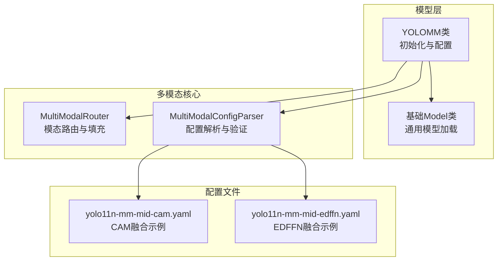
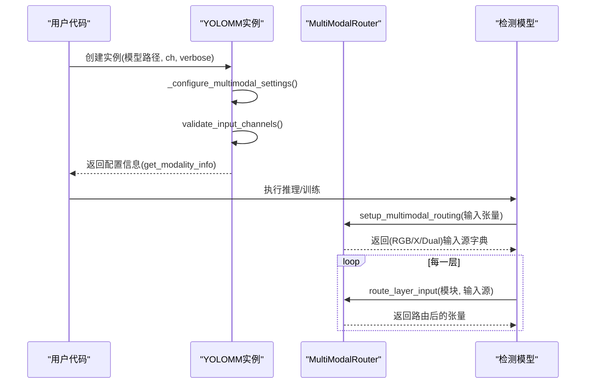
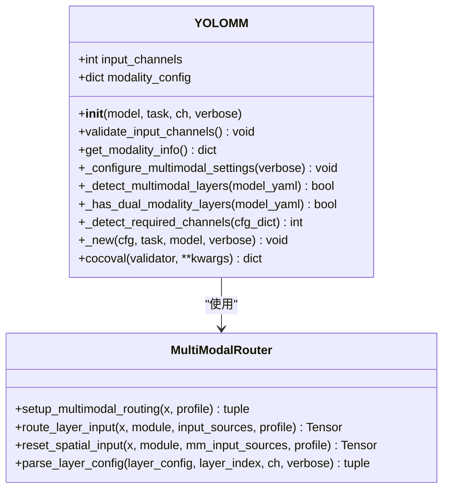
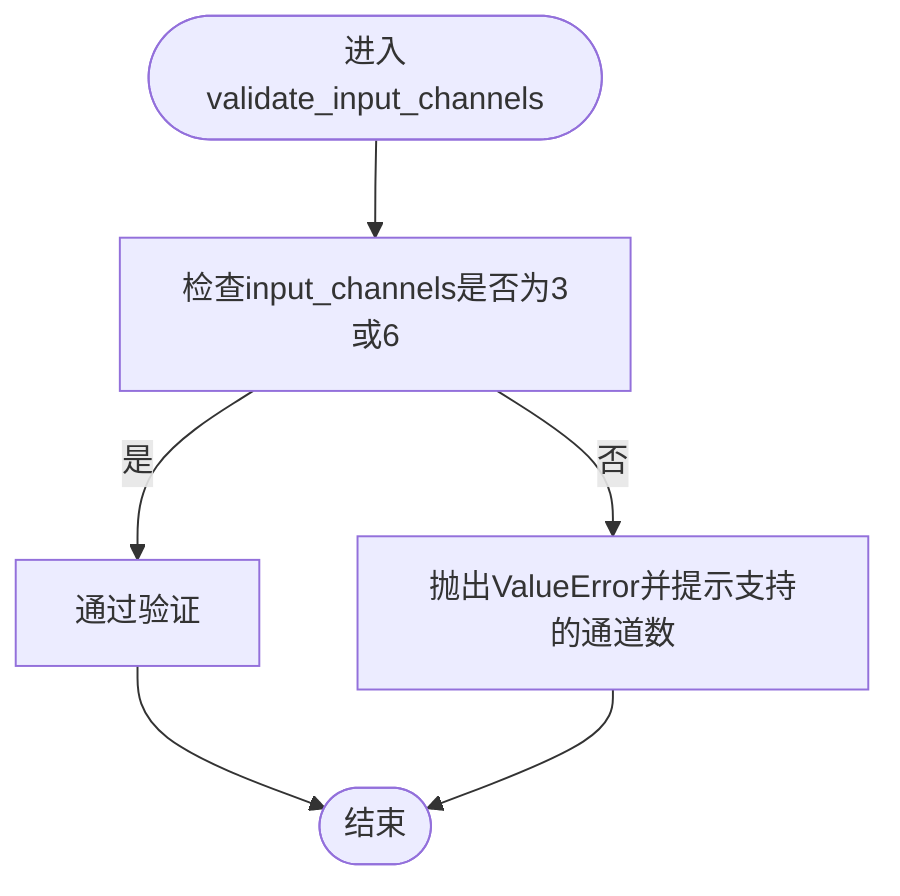
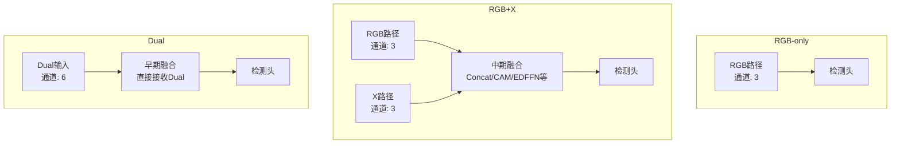
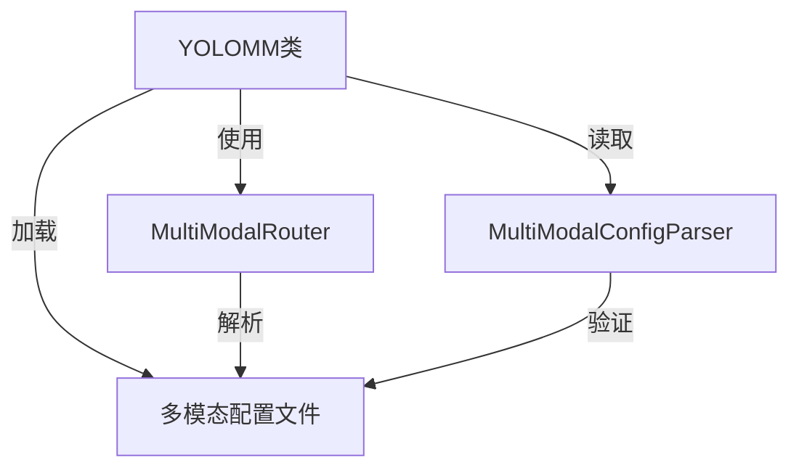

# YOLOMM多模态模型API

<cite>
**本文档引用的文件**
- [ultralytics/models/yolo/model.py](file://ultralytics/models/yolo/model.py)
- [ultralytics/nn/mm/router.py](file://ultralytics/nn/mm/router.py)
- [ultralytics/nn/mm/parser.py](file://ultralytics/nn/mm/parser.py)
- [ultralytics/cfg/models/mm/change/yolo11n-mm-mid-cam.yaml](file://ultralytics/cfg/models/mm/change/yolo11n-mm-mid-cam.yaml)
- [ultralytics/cfg/models/mm/change/yolo11n-mm-mid-edffn.yaml](file://ultralytics/cfg/models/mm/change/yolo11n-mm-mid-edffn.yaml)
- [ultralytics/models/rtdetrmm/model.py](file://ultralytics/models/rtdetrmm/model.py)
</cite>

## 目录
1. [简介](#简介)
2. [项目结构](#项目结构)
3. [核心组件](#核心组件)
4. [架构概览](#架构概览)
5. [详细组件分析](#详细组件分析)
6. [依赖关系分析](#依赖关系分析)
7. [性能考虑](#性能考虑)
8. [故障排除指南](#故障排除指南)
9. [结论](#结论)
10. [附录](#附录)

## 简介
本文件为YOLOMM多模态模型类的详细API文档，重点覆盖以下方面：
- 多模态初始化方法的完整接口说明
- 通道配置验证机制
- 模态信息获取与配置检测
- validate_input_channels、get_modality_info、_configure_multimodal_settings等关键方法的实现细节与使用方式
- 多模态输入通道配置策略（RGB-only、RGB+X、Dual）
- 模态路由检测与最佳实践建议
- 错误处理机制与常见问题排查

## 项目结构
YOLOMM作为YOLO系列的一个变体，位于ultralytics/models/yolo/model.py中，其核心特性通过多模态路由器（MultiModalRouter）在运行时进行模态路由与通道分配。关键文件与职责如下：
- ultralytics/models/yolo/model.py：YOLOMM类定义、初始化流程、通道配置与模态信息管理
- ultralytics/nn/mm/router.py：多模态路由器，负责RGB/X/Dual输入的零拷贝路由与空间重置
- ultralytics/nn/mm/parser.py：多模态配置解析器，验证与提取路由层信息
- 多模态配置示例：ultralytics/cfg/models/mm/change/*.yaml（展示不同融合策略）



**图示来源**
- [ultralytics/models/yolo/model.py:456-740](file://ultralytics/models/yolo/model.py#L456-L740)
- [ultralytics/nn/mm/router.py:11-471](file://ultralytics/nn/mm/router.py#L11-L471)
- [ultralytics/nn/mm/parser.py:9-198](file://ultralytics/nn/mm/parser.py#L9-L198)

**章节来源**
- [ultralytics/models/yolo/model.py:456-740](file://ultralytics/models/yolo/model.py#L456-L740)
- [ultralytics/nn/mm/router.py:11-471](file://ultralytics/nn/mm/router.py#L11-L471)
- [ultralytics/nn/mm/parser.py:9-198](file://ultralytics/nn/mm/parser.py#L9-L198)

## 核心组件
本节概述YOLOMM类的关键接口与职责：
- 多模态初始化：支持从YAML或权重文件加载，并自动检测通道数与模态能力
- 通道配置验证：确保输入通道为3（RGB-only）或6（RGB+X）
- 模态信息获取：返回当前模型的输入通道数、支持的模态列表与默认模态
- 配置检测：扫描配置中的路由标记，判断是否存在多模态层及是否为Dual模式
- 推理与训练：通过task_map映射到对应的模型、训练器、验证器与预测器

**章节来源**
- [ultralytics/models/yolo/model.py:488-658](file://ultralytics/models/yolo/model.py#L488-L658)

## 架构概览
YOLOMM的运行时架构围绕"配置驱动的模态路由"展开。初始化阶段通过_YOLOMM._configure_multimodal_settings()解析配置，确定输入通道数与支持的模态；推理阶段由MultiModalRouter根据每层的第5字段路由标记（RGB/X/Dual）进行零拷贝数据路由。



**图示来源**
- [ultralytics/models/yolo/model.py:516-592](file://ultralytics/models/yolo/model.py#L516-L592)
- [ultralytics/nn/mm/router.py:157-240](file://ultralytics/nn/mm/router.py#L157-L240)
- [ultralytics/nn/mm/router.py:242-317](file://ultralytics/nn/mm/router.py#L242-L317)

## 详细组件分析

### YOLOMM类与初始化流程
- 构造函数参数
  - model：模型名称或路径（支持.yaml/.pt）
  - task：任务类型（detect/segment/pose/obb），可为空由配置推断
  - ch：输入通道数（3或6），可为空由配置推断
  - verbose：是否打印详细信息
- 初始化步骤
  - 存储input_channels与空的modality_config
  - 调用父类Model.__init__完成模型加载
  - 调用_configure_multimodal_settings完成通道与模态配置



**图示来源**
- [ultralytics/models/yolo/model.py:488-740](file://ultralytics/models/yolo/model.py#L488-L740)
- [ultralytics/nn/mm/router.py:11-471](file://ultralytics/nn/mm/router.py#L11-L471)

**章节来源**
- [ultralytics/models/yolo/model.py:488-515](file://ultralytics/models/yolo/model.py#L488-L515)

### validate_input_channels方法
- 功能：验证输入通道数是否为3或6
- 行为：
  - 若不在支持列表，抛出ValueError
  - 支持的通道数：3（RGB-only）、6（RGB+X）
- 使用场景：初始化后自动调用，或手动在自定义输入前调用



**图示来源**
- [ultralytics/models/yolo/model.py:631-644](file://ultralytics/models/yolo/model.py#L631-L644)

**章节来源**
- [ultralytics/models/yolo/model.py:631-644](file://ultralytics/models/yolo/model.py#L631-L644)

### get_modality_info方法
- 功能：返回当前模型的模态配置信息
- 返回内容：
  - input_channels：当前输入通道数
  - modality_config：模态配置字典（包含rgb_channels、x_channels、supported_modalities、default_modality）
  - model_type：模型类型标识（YOLOMM）
  - task：任务类型（默认detect）
- 使用场景：调试、日志输出、UI展示

**章节来源**
- [ultralytics/models/yolo/model.py:646-658](file://ultralytics/models/yolo/model.py#L646-L658)

### _configure_multimodal_settings方法
- 功能：基于模型配置自动检测多模态能力并配置输入通道与模态信息
- 关键步骤：
  - 读取模型yaml配置
  - 检测是否存在多模态层（第5字段为RGB/X/Dual）
  - 若存在多模态层：
    - 检查是否包含Dual层，决定通道数为6或3
    - 若ch为None，则采用推断的通道数；否则与配置对比并给出警告
    - 调用validate_input_channels进行校验
    - 根据通道数与多模态层情况设置modality_config
  - 若不存在多模态层：默认RGB-only
  - 异常处理：捕获配置解析异常，回退到RGB-only默认配置

```mermaid
flowchart TD
Start(["进入_configure_multimodal_settings"]) --> LoadCfg["读取模型yaml配置"]
LoadCfg --> DetectMM["_detect_multimodal_layers检测多模态层"]
DetectMM --> HasMM{"存在多模态层？"}
HasMM --> |是| CheckDual["_has_dual_modality_layers检测Dual层"]
CheckDual --> IsDual{"包含Dual层？"}
IsDual --> |是| SetCh6["设置通道数为6"]
IsDual --> |否| SetCh3["设置通道数为3"]
HasMM --> |否| SetChDefault["设置通道数为3RGB-only"]
SetCh6 --> ResolveCh["解析ch参数：None则采用推断值，否则对比配置"]
SetCh3 --> ResolveCh
SetChDefault --> ResolveCh
ResolveCh --> Validate["validate_input_channels校验"]
Validate --> ConfigMM{"存在多模态层且通道数为6？"}
ConfigMM --> |是| SetDualCfg["设置RGB/X/Dual支持与默认Dual"]
ConfigMM --> |否| SetRGBXCfg["设置RGB/X支持与默认RGB"]
ConfigMM --> |否| SetRGBOnly["设置RGB-only支持与默认RGB"]
SetDualCfg --> Log["可选：打印配置信息"]
SetRGBXCfg --> Log
SetRGBOnly --> Log
Log --> End(["结束"])
```

**图示来源**
- [ultralytics/models/yolo/model.py:516-592](file://ultralytics/models/yolo/model.py#L516-L592)

**章节来源**
- [ultralytics/models/yolo/model.py:516-592](file://ultralytics/models/yolo/model.py#L516-L592)

### _detect_multimodal_layers与_has_dual_modality_layers
- _detect_multimodal_layers：遍历backbone与head的所有层，检查第5字段是否为RGB、X或Dual
- _has_dual_modality_layers：在上述基础上进一步判断是否存在Dual层
- 用途：辅助_configure_multimodal_settings决定通道数与模态支持范围

**章节来源**
- [ultralytics/models/yolo/model.py:593-629](file://ultralytics/models/yolo/model.py#L593-L629)

### _detect_required_channels
- 功能：从配置字典中检测所需的输入通道数
- 规则：
  - 若首层或任意层的第5字段为Dual，返回6
  - 否则返回3（RGB-only或RGB/X分离路径）
- 用途：在YOLOMM内部模型初始化时，确保模型构造时的ch参数正确

**章节来源**
- [ultralytics/models/yolo/model.py:716-740](file://ultralytics/models/yolo/model.py#L716-L740)

### 多模态配置示例与最佳实践
- RGB-only配置
  - 特征：所有层的第5字段不为RGB/X/Dual，通道数为3
  - 适用：仅可见光RGB输入的场景
- RGB+X配置
  - 特征：存在RGB与X路径的分离层，通道数为3；Dual层用于早期融合
  - 适用：需要将RGB与X分别处理后再融合的场景
- Dual配置
  - 特征：输入为6通道（RGB+X拼接），部分层直接接收Dual输入
  - 适用：早期融合策略，减少中间态转换开销



**图示来源**
- [ultralytics/cfg/models/mm/change/yolo11n-mm-mid-cam.yaml:14-47](file://ultralytics/cfg/models/mm/change/yolo11n-mm-mid-cam.yaml#L14-L47)
- [ultralytics/cfg/models/mm/change/yolo11n-mm-mid-edffn.yaml:51-59](file://ultralytics/cfg/models/mm/change/yolo11n-mm-mid-edffn.yaml#L51-L59)

**章节来源**
- [ultralytics/cfg/models/mm/change/yolo11n-mm-mid-cam.yaml:14-68](file://ultralytics/cfg/models/mm/change/yolo11n-mm-mid-cam.yaml#L14-L68)
- [ultralytics/cfg/models/mm/change/yolo11n-mm-mid-edffn.yaml:51-80](file://ultralytics/cfg/models/mm/change/yolo11n-mm-mid-edffn.yaml#L51-L80)

## 依赖关系分析
- YOLOMM依赖基础Model类完成模型加载与任务映射
- YOLOMM通过MultiModalRouter实现零拷贝的模态路由与空间重置
- MultiModalConfigParser负责配置格式验证与路由层统计
- 配置文件（YAML）通过第5字段声明模态路由标记，驱动运行时行为



**图示来源**
- [ultralytics/models/yolo/model.py:488-740](file://ultralytics/models/yolo/model.py#L488-L740)
- [ultralytics/nn/mm/router.py:11-471](file://ultralytics/nn/mm/router.py#L11-L471)
- [ultralytics/nn/mm/parser.py:9-198](file://ultralytics/nn/mm/parser.py#L9-L198)

**章节来源**
- [ultralytics/models/yolo/model.py:488-740](file://ultralytics/models/yolo/model.py#L488-L740)
- [ultralytics/nn/mm/router.py:11-471](file://ultralytics/nn/mm/router.py#L11-L471)
- [ultralytics/nn/mm/parser.py:9-198](file://ultralytics/nn/mm/parser.py#L9-L198)

## 性能考虑
- 零拷贝路由：MultiModalRouter通过视图操作实现RGB/X/Dual之间的零拷贝数据路由，降低内存与带宽开销
- 空间重置：在X模态新输入起点处，通过original_spatial_size缓存实现空间维度的正确重置，避免特征金字塔尺度错配
- 通道适配：当X模态通道数与配置不一致时，通过adapt_xch进行通道适配，保证下游模块输入维度一致
- 融合策略：CAM、EDFFN等融合模块在P4/P5层面进行，需注意输入分辨率与patch_size的整除关系，避免频域变换异常

[本节为通用性能讨论，无需特定文件来源]

## 故障排除指南
- 输入通道不支持
  - 现象：初始化时报错，提示不支持的输入通道数
  - 原因：ch参数不是3或6
  - 处理：调整ch参数或修改配置文件中的ch字段
  - 参考：validate_input_channels
- 配置解析失败
  - 现象：_configure_multimodal_settings捕获异常并回退到RGB-only
  - 原因：模型yaml缺失或格式不正确
  - 处理：检查yaml文件完整性与第5字段路由标记
  - 参考：_configure_multimodal_settings
- X模态通道不匹配
  - 现象：路由到X模态时通道数不一致
  - 原因：dataset_config中的Xch与实际输入不一致
  - 处理：更新dataset_config中的Xch或确保输入通道数正确
  - 参考：MultiModalRouter.update_dataset_config
- 空间维度不匹配
  - 现象：X模态新输入起点处尺寸不一致
  - 原因：上游预处理未对齐空间尺寸
  - 处理：在上游进行上采样/下采样对齐，或使用MultiModalRouter.reset_spatial_input
  - 参考：MultiModalRouter.reset_spatial_input

**章节来源**
- [ultralytics/models/yolo/model.py:631-644](file://ultralytics/models/yolo/model.py#L631-L644)
- [ultralytics/models/yolo/model.py:583-591](file://ultralytics/models/yolo/model.py#L583-L591)
- [ultralytics/nn/mm/router.py:406-423](file://ultralytics/nn/mm/router.py#L406-L423)
- [ultralytics/nn/mm/router.py:365-404](file://ultralytics/nn/mm/router.py#L365-L404)

## 结论
YOLOMM通过配置驱动的多模态路由机制，在不改变现有模型结构的前提下，实现了RGB与X模态的灵活组合与高效推理。其关键在于：
- 清晰的初始化与配置检测流程
- 严格的通道验证与容错回退
- 零拷贝的模态路由与空间重置
- 可扩展的融合策略与配置解析

对于使用者而言，正确理解通道配置、模态路由标记与融合策略，是获得稳定性能与良好效果的基础。

[本节为总结性内容，无需特定文件来源]

## 附录

### API参考摘要
- YOLOMM.__init__(model, task=None, ch=None, verbose=False)
  - 初始化YOLOMM模型，自动检测通道与模态能力
- YOLOMM.validate_input_channels()
  - 校验输入通道数（3或6）
- YOLOMM.get_modality_info()
  - 获取当前模型的模态配置信息
- YOLOMM._configure_multimodal_settings(verbose=False)
  - 基于配置解析多模态能力并设置modality_config
- YOLOMM._detect_multimodal_layers(model_yaml)
  - 检测是否存在多模态层
- YOLOMM._has_dual_modality_layers(model_yaml)
  - 检测是否存在Dual层
- YOLOMM._detect_required_channels(cfg_dict)
  - 从配置字典检测所需输入通道数
- MultiModalRouter.setup_multimodal_routing(x, profile=False)
  - 初始化多模态路由，返回RGB/X/Dual输入源
- MultiModalRouter.route_layer_input(x, module, input_sources, profile=False)
  - 按模块的路由标记进行输入路由
- MultiModalRouter.reset_spatial_input(x, module, mm_input_sources, profile=False)
  - 对X模态新输入起点进行空间维度重置
- MultiModalConfigParser.validate_config_format(config)
  - 验证多模态配置格式并统计路由层数量

**章节来源**
- [ultralytics/models/yolo/model.py:488-740](file://ultralytics/models/yolo/model.py#L488-L740)
- [ultralytics/nn/mm/router.py:157-317](file://ultralytics/nn/mm/router.py#L157-L317)
- [ultralytics/nn/mm/parser.py:20-65](file://ultralytics/nn/mm/parser.py#L20-L65)