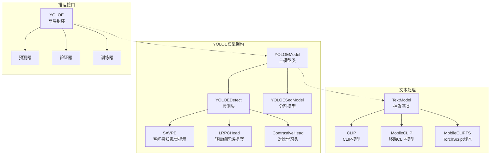
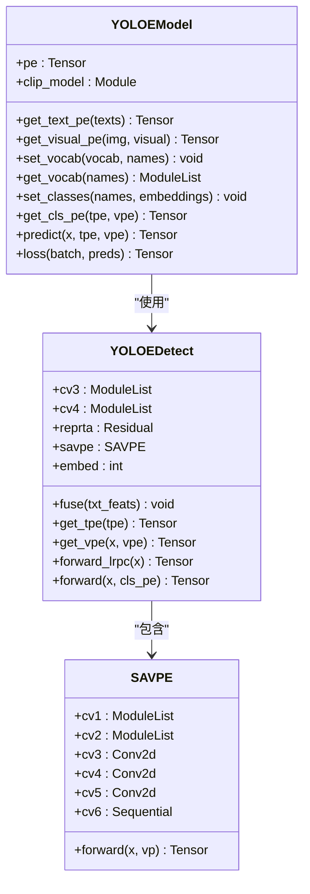
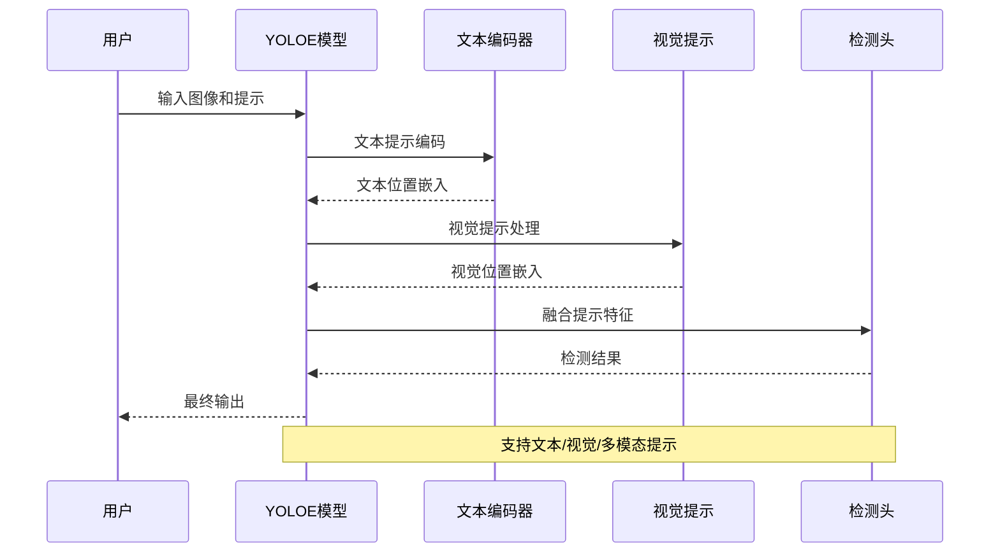
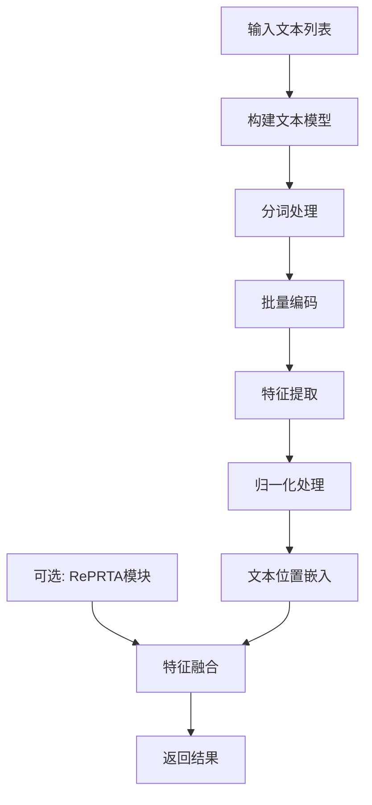
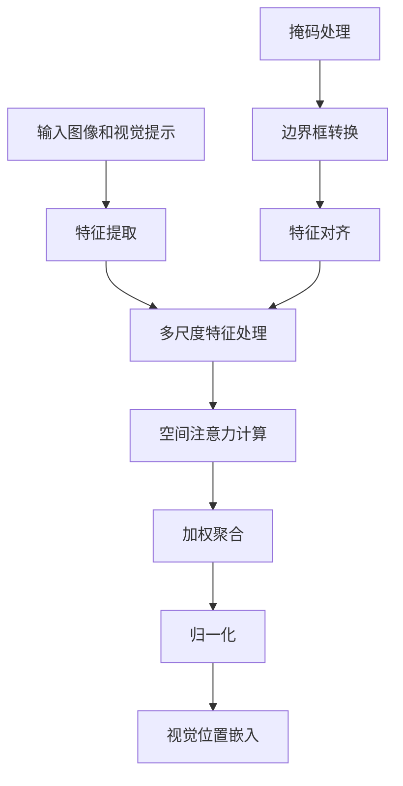
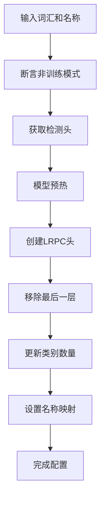
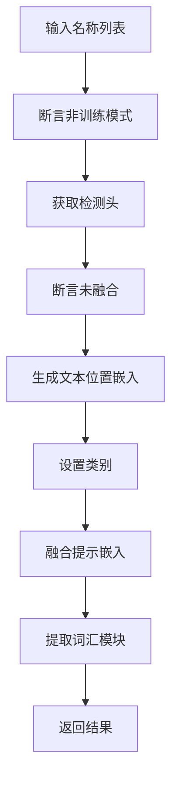
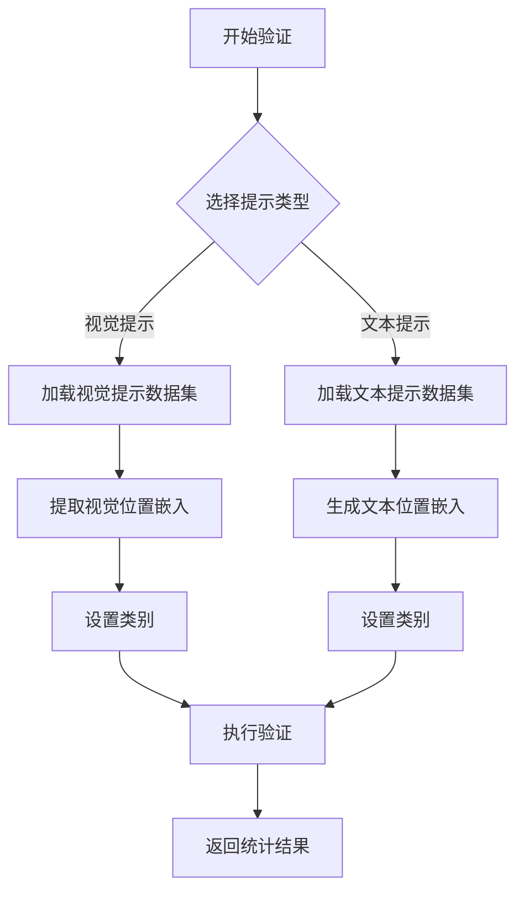
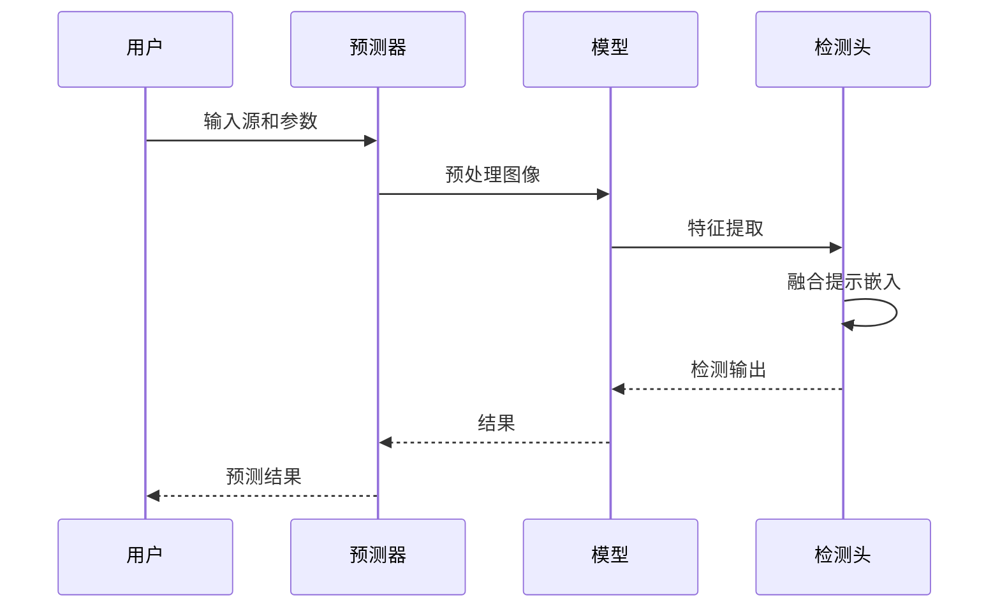
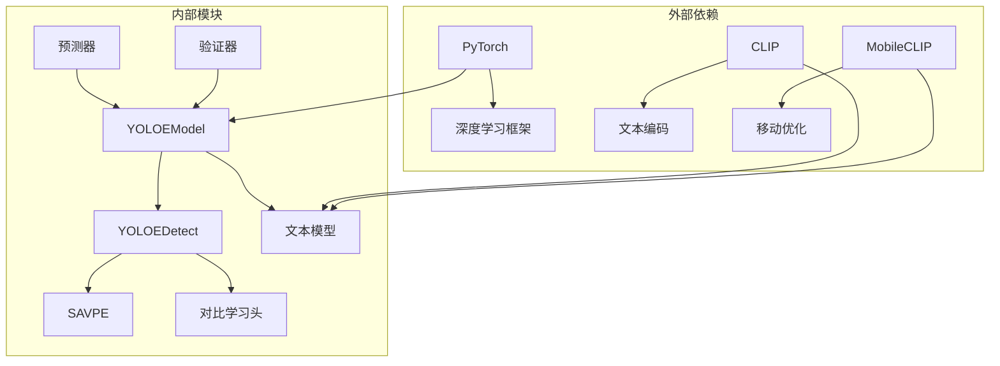

# YOLOE增强模型类

<cite>
**本文档引用的文件**
- [model.py](file://ultralytics/models/yolo/model.py)
- [tasks.py](file://ultralytics/nn/tasks.py)
- [head.py](file://ultralytics/nn/modules/head.py)
- [block.py](file://ultralytics/nn/modules/block.py)
- [text_model.py](file://ultralytics/nn/text_model.py)
- [predict.py](file://ultralytics/models/yolo/yoloe/predict.py)
- [val.py](file://ultralytics/models/yolo/yoloe/val.py)
</cite>

## 目录
1. [简介](#简介)
2. [项目结构](#项目结构)
3. [核心组件](#核心组件)
4. [架构概览](#架构概览)
5. [详细组件分析](#详细组件分析)
6. [依赖关系分析](#依赖关系分析)
7. [性能考虑](#性能考虑)
8. [故障排除指南](#故障排除指南)
9. [结论](#结论)

## 简介

YOLOE（You Only Look Once Enhanced）是Ultralytics框架中的一个增强型目标检测模型，专门设计用于支持多模态提示（文本和视觉）推理。该模型在标准YOLO架构的基础上增加了位置嵌入机制，能够处理文本描述和视觉区域提示，实现更精确的目标检测和实例分割。

YOLOE模型的核心创新包括：
- 文本位置嵌入提取：通过CLIP或MobileCLIP模型生成文本特征
- 视觉位置嵌入：利用空间感知模块处理视觉提示
- 词汇表管理：支持动态词汇表配置和离线推理
- 多模态融合：将文本和视觉提示进行有效融合

## 项目结构

YOLOE模型的实现分布在多个关键文件中：



**图表来源**
- [tasks.py:1876](file://ultralytics/nn/tasks.py#L1876-L2131)
- [head.py:614](file://ultralytics/nn/modules/head.py#L614-L850)
- [text_model.py:21](file://ultralytics/nn/text_model.py#L21-L383)

**章节来源**
- [model.py:207](file://ultralytics/models/yolo/model.py#L207-L405)
- [tasks.py:1876](file://ultralytics/nn/tasks.py#L1876-L2131)

## 核心组件

### YOLOEModel类

YOLOEModel是YOLOE架构的核心实现，继承自DetectionModel，提供了完整的多模态推理能力：



**图表来源**
- [tasks.py:1876](file://ultralytics/nn/tasks.py#L1876-L2131)
- [head.py:614](file://ultralytics/nn/modules/head.py#L614-L850)
- [block.py:2016](file://ultralytics/nn/modules/block.py#L2016-L2215)

### 文本编码器

YOLOE支持多种文本编码模型：

- **CLIP模型**：标准的OpenAI CLIP模型，适合高精度场景
- **MobileCLIP**：苹果的移动优化CLIP模型，适合移动端部署
- **MobileCLIPTS**：TorchScript优化版本，提供最佳推理性能

**章节来源**
- [text_model.py:48](file://ultralytics/nn/text_model.py#L48-L168)
- [text_model.py:170](file://ultralytics/nn/text_model.py#L170-L275)
- [text_model.py:277](file://ultralytics/nn/text_model.py#L277-L358)

## 架构概览

YOLOE的整体架构采用分层设计，从底层特征提取到高层决策形成完整的推理链路：



**图表来源**
- [tasks.py:2057](file://ultralytics/nn/tasks.py#L2057-L2105)
- [head.py:778](file://ultralytics/nn/modules/head.py#L778-L790)

## 详细组件分析

### 位置嵌入提取机制

#### 文本位置嵌入（get_text_pe）

文本位置嵌入是YOLOE的核心功能之一，通过以下流程实现：



**图表来源**
- [tasks.py:1917](file://ultralytics/nn/tasks.py#L1917-L1948)
- [text_model.py:361](file://ultralytics/nn/text_model.py#L361-L383)

#### 视觉位置嵌入（get_visual_pe）

视觉位置嵌入通过SAVPE模块实现空间感知：



**图表来源**
- [tasks.py:1951](file://ultralytics/nn/tasks.py#L1951-L1962)
- [block.py:2047](file://ultralytics/nn/modules/block.py#L2047-L2075)

**章节来源**
- [tasks.py:1917](file://ultralytics/nn/tasks.py#L1917-L1962)
- [block.py:2016](file://ultralytics/nn/modules/block.py#L2016-L2075)

### 词汇表管理

#### set_vocab方法

词汇表管理是YOLOE实现离线推理的关键：



**图表来源**
- [tasks.py:1964](file://ultralytics/nn/tasks.py#L1964-L1991)

#### get_vocab方法

词汇表获取过程：



**图表来源**
- [tasks.py:1993](file://ultralytics/nn/tasks.py#L1993-L2017)

**章节来源**
- [tasks.py:1964](file://ultralytics/nn/tasks.py#L1964-L2017)

### 多模态提示推理

#### validate方法

验证过程支持文本和视觉提示两种模式：



**图表来源**
- [model.py:349](file://ultralytics/models/yolo/model.py#L349-L374)
- [val.py:152](file://ultralytics/models/yolo/yoloe/val.py#L152-L210)

#### predict方法

预测过程支持多种输入源：



**图表来源**
- [model.py:376](file://ultralytics/models/yolo/model.py#L376-L405)
- [predict.py:133](file://ultralytics/models/yolo/yoloe/predict.py#L133-L145)

**章节来源**
- [model.py:349](file://ultralytics/models/yolo/model.py#L349-L405)
- [predict.py:11](file://ultralytics/models/yolo/yoloe/predict.py#L11-L169)

## 依赖关系分析

YOLOE模型的依赖关系体现了清晰的分层架构：



**图表来源**
- [tasks.py:1876](file://ultralytics/nn/tasks.py#L1876-L2131)
- [text_model.py:361](file://ultralytics/nn/text_model.py#L361-L383)

**章节来源**
- [tasks.py:1876](file://ultralytics/nn/tasks.py#L1876-L2131)
- [text_model.py:361](file://ultralytics/nn/text_model.py#L361-L383)

## 性能考虑

### 位置嵌入的数学原理

YOLOE的位置嵌入基于以下数学原理：

1. **归一化嵌入**：所有位置嵌入都经过L2归一化，确保特征向量长度一致
2. **对比学习**：使用对比学习头进行文本-图像对齐
3. **空间注意力**：SAVPE模块通过softmax注意力机制实现空间感知

### 词汇表管理最佳实践

1. **词汇表大小**：建议控制在合理范围内，避免内存溢出
2. **类别平衡**：确保各类别样本数量相对均衡
3. **缓存策略**：对于固定词汇表，启用CLIP模型缓存以提升性能

### 多模态提示使用示例

```python
# 文本提示示例
model = YOLOE("yoloe-11s-seg.pt")
texts = ["person", "car", "dog"]
tpe = model.get_text_pe(texts)
model.set_classes(texts, tpe)

# 视觉提示示例  
prompts = {"bboxes": [[10, 20, 100, 200]], "cls": ["person"]}
results = model.predict("image.jpg", visual_prompts=prompts)
```

## 故障排除指南

### 常见问题及解决方案

1. **模型初始化失败**
   - 检查模型权重文件完整性
   - 确认PyTorch版本兼容性

2. **位置嵌入维度不匹配**
   - 验证文本编码器输出维度
   - 检查检测头嵌入维度配置

3. **内存不足错误**
   - 减少批量大小
   - 启用模型量化

**章节来源**
- [tasks.py:1917](file://ultralytics/nn/tasks.py#L1917-L1948)
- [head.py:727](file://ultralytics/nn/modules/head.py#L727-L738)

## 结论

YOLOE模型通过引入位置嵌入机制和多模态提示支持，显著提升了目标检测的准确性和灵活性。其核心优势包括：

1. **灵活的提示机制**：支持文本、视觉和多模态提示
2. **高效的词汇表管理**：支持动态配置和离线推理
3. **强大的空间感知**：通过SAVPE模块实现精确的空间定位
4. **良好的性能表现**：在保持高精度的同时优化了推理速度

该模型为多模态目标检测任务提供了完整的解决方案，适用于各种实际应用场景。