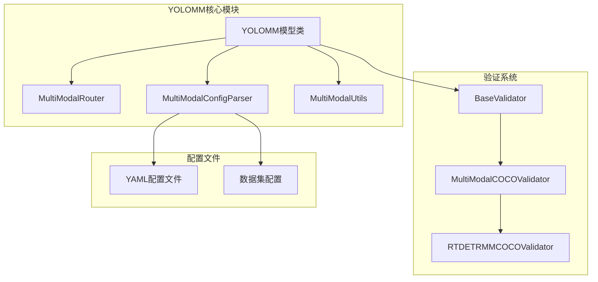
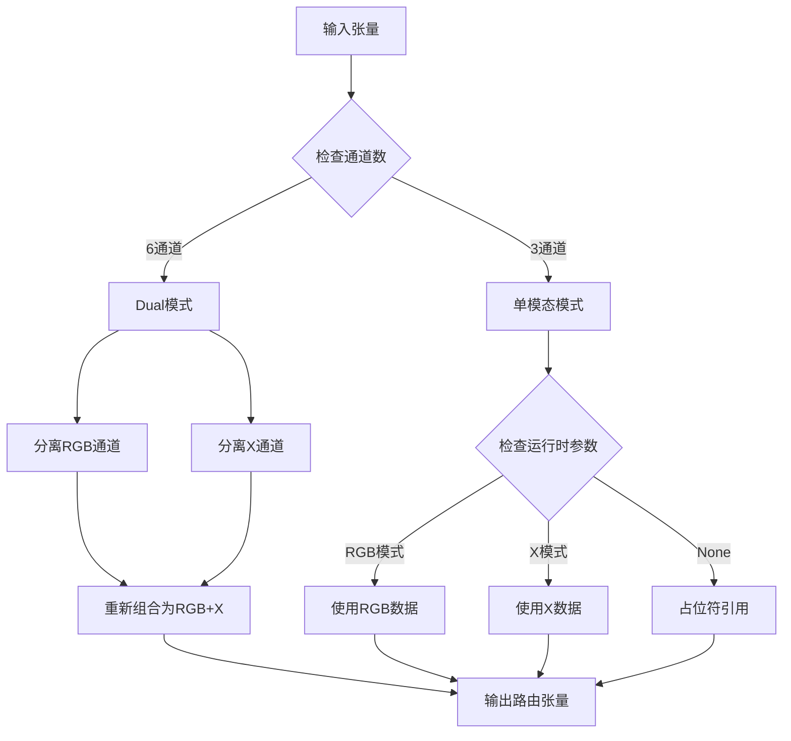
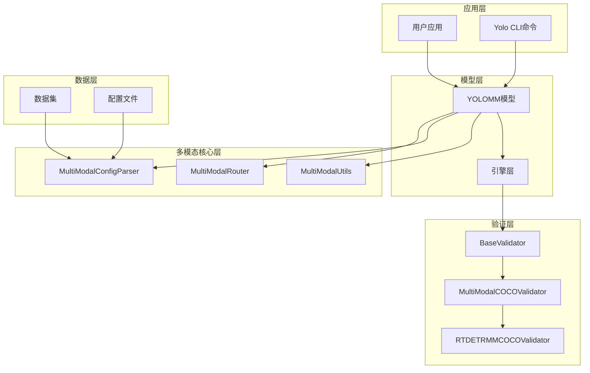
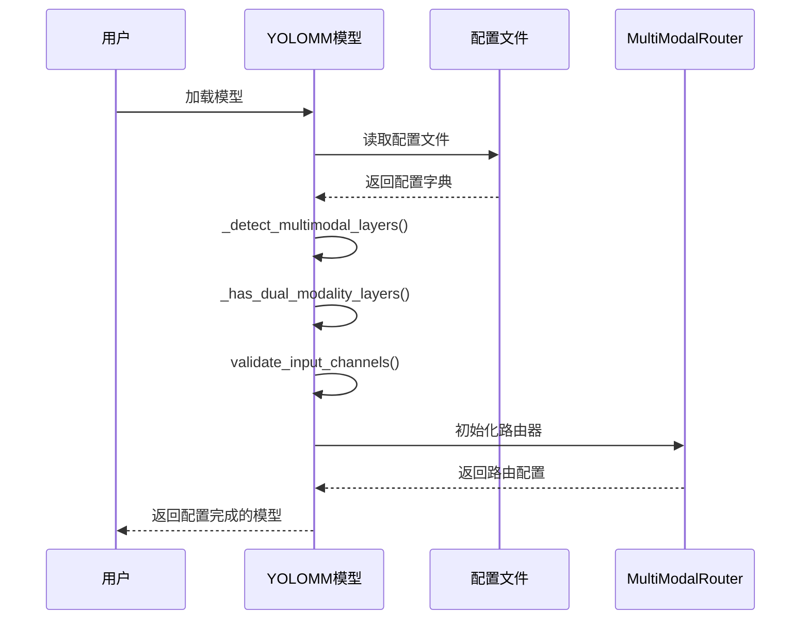
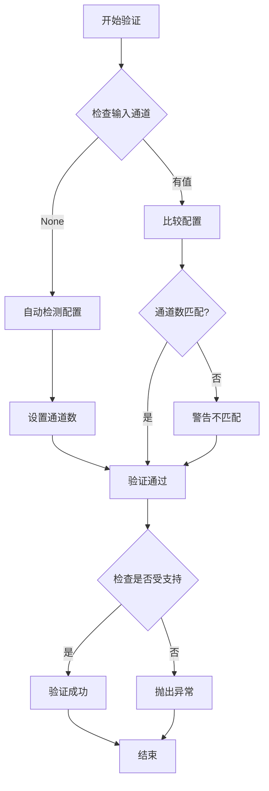
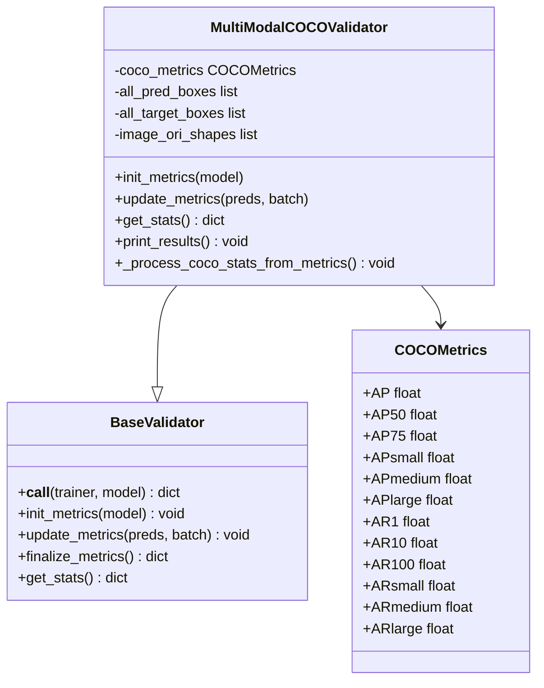
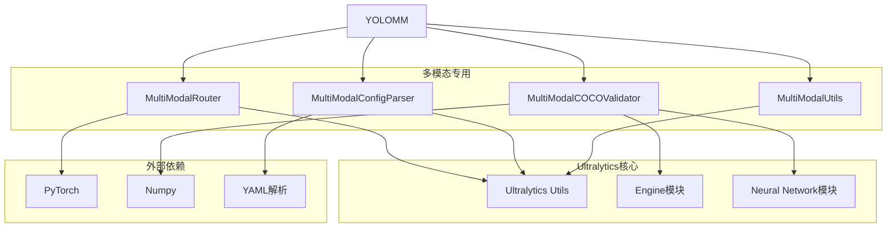

# YOLOMM多模态模型类

<cite>
**本文档引用的文件**
- [ultralytics/models/yolo/model.py](file://ultralytics/models/yolo/model.py)
- [ultralytics/nn/mm/router.py](file://ultralytics/nn/mm/router.py)
- [ultralytics/nn/mm/parser.py](file://ultralytics/nn/mm/parser.py)
- [ultralytics/nn/mm/utils.py](file://ultralytics/nn/mm/utils.py)
- [ultralytics/models/yolo/multimodal/cocoval.py](file://ultralytics/models/yolo/multimodal/cocoval.py)
- [ultralytics/engine/validator.py](file://ultralytics/engine/validator.py)
- [ultralytics/engine/model.py](file://ultralytics/engine/model.py)
</cite>

## 目录
1. [简介](#简介)
2. [项目结构](#项目结构)
3. [核心组件](#核心组件)
4. [架构概览](#架构概览)
5. [详细组件分析](#详细组件分析)
6. [依赖关系分析](#依赖关系分析)
7. [性能考虑](#性能考虑)
8. [故障排除指南](#故障排除指南)
9. [结论](#结论)

## 简介

YOLOMM（YOLO MultiModal）是Ultralytics框架中的多模态目标检测模型，专为RGB与其他模态（X）融合的场景设计。该模型支持灵活的通道配置和自动模态路由，能够在RGB-only、X-only和Dual（RGB+X）三种模式下运行。

YOLOMM的核心特性包括：
- **多模态配置管理**：支持RGB、X和Dual三种模态的自动检测和配置
- **智能模态路由**：通过MultiModalRouter实现零拷贝张量路由
- **输入通道验证**：严格的通道数验证机制
- **COCO验证功能**：提供完整的12项COCO指标计算

## 项目结构

YOLOMM多模态模型位于Ultralytics框架的多模态子系统中，主要涉及以下模块：



**图表来源**
- [ultralytics/models/yolo/model.py:456-800](file://ultralytics/models/yolo/model.py#L456-L800)
- [ultralytics/nn/mm/router.py:1-471](file://ultralytics/nn/mm/router.py#L1-L471)

**章节来源**
- [ultralytics/models/yolo/model.py:456-800](file://ultralytics/models/yolo/model.py#L456-L800)
- [ultralytics/nn/mm/router.py:1-471](file://ultralytics/nn/mm/router.py#L1-L471)

## 核心组件

### YOLOMM模型类

YOLOMM类是多模态目标检测的核心实现，继承自基础Model类，提供了完整的多模态支持。

**主要属性**：
- `input_channels`：输入通道数（3或6）
- `modality_config`：模态配置信息
- `model`：加载的模型实例
- `task`：任务类型（detect、segment、pose、obb）

**核心方法**：
- `_configure_multimodal_settings()`：配置多模态设置
- `validate_input_channels()`：验证输入通道
- `get_modality_info()`：获取模态信息
- `cocoval()`：COCO验证接口

**章节来源**
- [ultralytics/models/yolo/model.py:456-515](file://ultralytics/models/yolo/model.py#L456-L515)
- [ultralytics/models/yolo/model.py:631-658](file://ultralytics/models/yolo/model.py#L631-L658)

### MultiModalRouter智能路由系统

MultiModalRouter是YOLOMM的核心路由组件，实现了零拷贝张量路由和智能模态分发。

**核心功能**：
- **零拷贝路由**：通过张量视图实现高效的数据路由
- **模态检测**：自动识别RGB、X和Dual模态
- **空间重置**：支持X模态的新输入起点重定向
- **配置驱动**：基于配置文件的动态路由

**路由机制**：


**图表来源**
- [ultralytics/nn/mm/router.py:157-240](file://ultralytics/nn/mm/router.py#L157-L240)

**章节来源**
- [ultralytics/nn/mm/router.py:11-471](file://ultralytics/nn/mm/router.py#L11-L471)

### 多模态配置解析器

MultiModalConfigParser负责解析和验证多模态配置文件，提供配置格式验证和信息提取功能。

**主要功能**：
- **配置验证**：验证多模态配置格式的正确性
- **信息提取**：从配置中提取X模态类型和路由层信息
- **格式转换**：将配置转换为路由器可理解的格式

**配置格式**：
```
backbone:
  - [-1, 1, Conv, [64, 3, 2], 'RGB']  # RGB模态路由
  - [-1, 1, Conv, [128, 3, 2], 'X']   # X模态路由
  - [-1, 1, Conv, [256, 3, 2], 'Dual'] # Dual模态路由
```

**章节来源**
- [ultralytics/nn/mm/parser.py:9-198](file://ultralytics/nn/mm/parser.py#L9-L198)

## 架构概览

YOLOMM的整体架构采用分层设计，从底层的路由系统到上层的验证模块形成了完整的多模态处理流水线。



**图表来源**
- [ultralytics/models/yolo/model.py:456-800](file://ultralytics/models/yolo/model.py#L456-L800)
- [ultralytics/engine/validator.py:1-200](file://ultralytics/engine/validator.py#L1-L200)

## 详细组件分析

### 多模态配置管理

多模态配置管理是YOLOMM的核心功能之一，负责自动检测和配置多模态设置。



**图表来源**
- [ultralytics/models/yolo/model.py:516-592](file://ultralytics/models/yolo/model.py#L516-L592)
- [ultralytics/nn/mm/router.py:31-63](file://ultralytics/nn/mm/router.py#L31-L63)

**章节来源**
- [ultralytics/models/yolo/model.py:516-592](file://ultralytics/models/yolo/model.py#L516-L592)

### 输入通道验证机制

validate_input_channels方法实现了严格的输入通道验证，确保只支持3通道（RGB-only）和6通道（RGB+X）配置。



**图表来源**
- [ultralytics/models/yolo/model.py:631-644](file://ultralytics/models/yolo/model.py#L631-L644)

**章节来源**
- [ultralytics/models/yolo/model.py:631-644](file://ultralytics/models/yolo/model.py#L631-L644)

### 模态信息获取功能

get_modality_info方法提供了完整的模态信息查询功能，返回当前模型的模态配置和相关信息。

**返回信息包括**：
- `input_channels`：输入通道数
- `modality_config`：模态配置字典
- `model_type`：模型类型（YOLOMM）
- `task`：任务类型

**章节来源**
- [ultralytics/models/yolo/model.py:646-658](file://ultralytics/models/yolo/model.py#L646-L658)

### COCO验证功能

YOLOMM的cocoval方法提供了专门的COCO格式验证功能，支持完整的12项COCO指标计算。



**图表来源**
- [ultralytics/models/yolo/multimodal/cocoval.py:19-800](file://ultralytics/models/yolo/multimodal/cocoval.py#L19-L800)

**章节来源**
- [ultralytics/models/yolo/multimodal/cocoval.py:19-800](file://ultralytics/models/yolo/multimodal/cocoval.py#L19-L800)

## 依赖关系分析

YOLOMM多模态模型的依赖关系复杂而有序，形成了清晰的层次结构。



**图表来源**
- [ultralytics/models/yolo/model.py:456-800](file://ultralytics/models/yolo/model.py#L456-L800)
- [ultralytics/nn/mm/router.py:1-471](file://ultralytics/nn/mm/router.py#L1-L471)

**章节来源**
- [ultralytics/models/yolo/model.py:456-800](file://ultralytics/models/yolo/model.py#L456-L800)
- [ultralytics/nn/mm/router.py:1-471](file://ultralytics/nn/mm/router.py#L1-L471)

## 性能考虑

YOLOMM多模态模型在设计时充分考虑了性能优化：

### 零拷贝路由优化
- MultiModalRouter实现了张量视图的零拷贝路由
- 避免了不必要的数据复制，提高了内存使用效率
- 支持动态路由决策，减少计算开销

### 智能缓存机制
- `cache_original_inputs`方法缓存原始输入用于空间重置
- `original_spatial_size`属性跟踪原始空间尺寸
- 减少重复的空间变换操作

### 内存管理
- `check_mm_model_attributes`方法监控多模态层的状态
- 动态清理不需要的中间结果
- 支持大规模数据集的高效处理

## 故障排除指南

### 常见问题及解决方案

**问题1：多模态路由器未检测到**
```python
# 错误信息
"未检测到多模态路由器，无法自动推断 Dual 通道数"

# 解决方案
# 显式传入channels参数或修改模态类型
model = YOLOMM("model.yaml", ch=6)  # 显式指定6通道
# 或
model = YOLOMM("model.yaml", modality="RGB")  # 指定RGB模态
```

**问题2：输入通道验证失败**
```python
# 错误信息
"Unsupported input channels: 4. Supported channels: [3, 6]"

# 解决方案
# 使用支持的通道数：3（RGB-only）或6（RGB+X）
model = YOLOMM("model.yaml", ch=3)  # RGB-only
model = YOLOMM("model.yaml", ch=6)  # RGB+X
```

**问题3：COCO验证器导入错误**
```python
# 错误信息
"COCO validator is not available"

# 解决方案
# 确保安装了必要的依赖包
pip install ultralytics[multimodal]
```

**章节来源**
- [ultralytics/engine/model.py:1245-1274](file://ultralytics/engine/model.py#L1245-L1274)
- [ultralytics/models/yolo/model.py:631-644](file://ultralytics/models/yolo/model.py#L631-L644)

## 结论

YOLOMM多模态模型类是一个功能完整、设计精良的多模态目标检测解决方案。其核心优势包括：

1. **灵活的配置管理**：支持多种模态配置和自动检测机制
2. **高效的路由系统**：通过零拷贝技术实现高性能的多模态数据流
3. **完善的验证体系**：提供COCO标准的12项指标评估
4. **良好的扩展性**：支持多种架构和模态类型的扩展

该模型为多模态目标检测任务提供了强大的基础设施，适用于RGB与各种传感器模态（热成像、深度、LiDAR等）的融合应用场景。