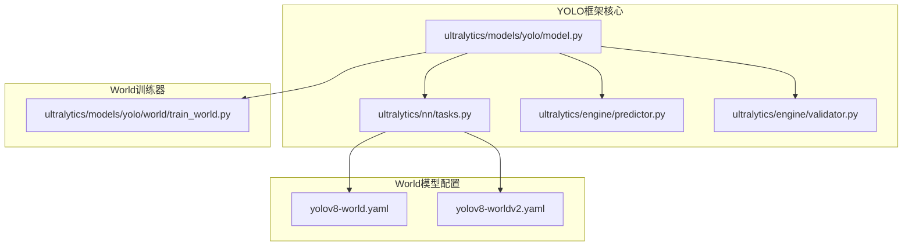
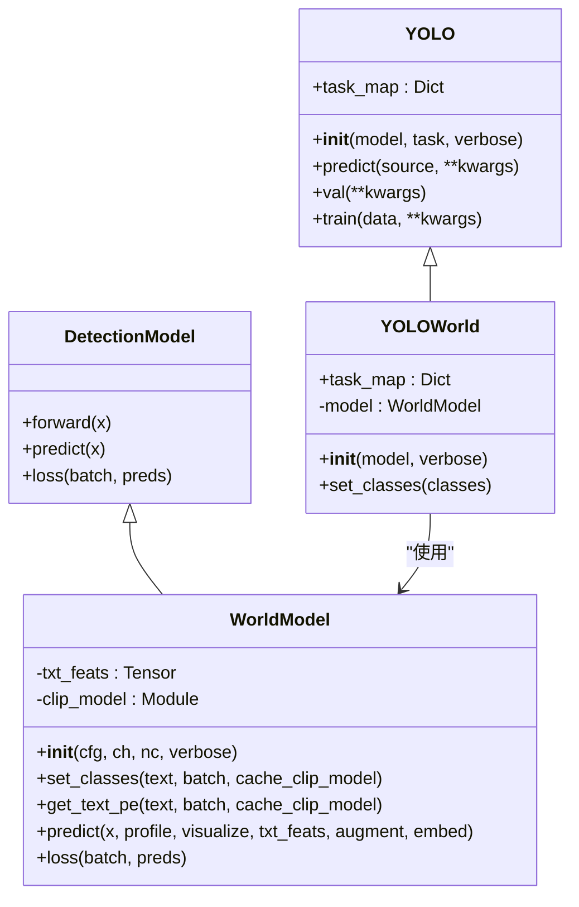
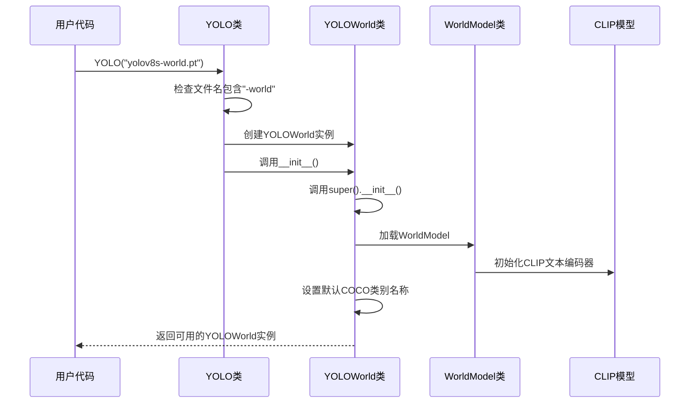
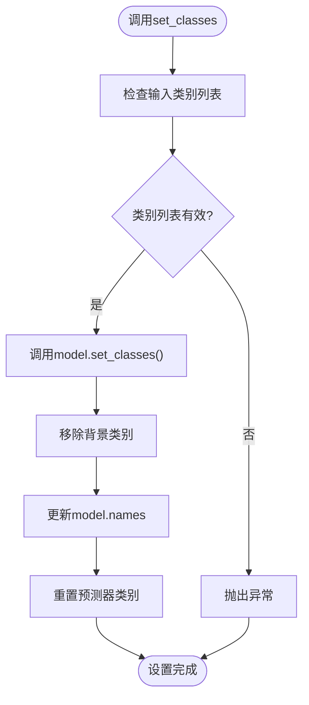
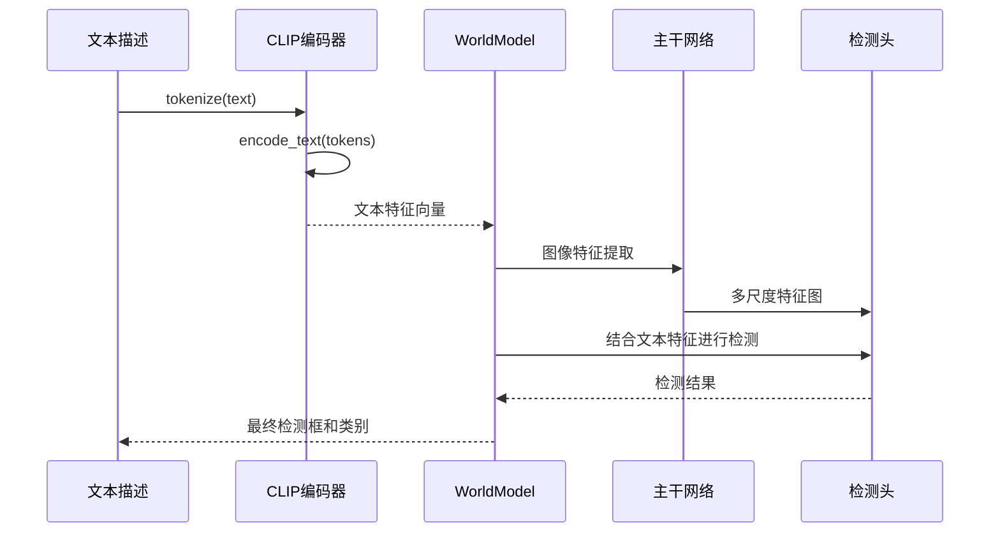
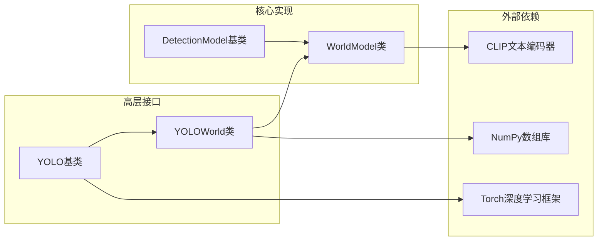

# YOLOWorld开放词汇检测类

<cite>
**本文档引用的文件**
- [ultralytics/models/yolo/model.py](file://ultralytics/models/yolo/model.py)
- [ultralytics/nn/tasks.py](file://ultralytics/nn/tasks.py)
- [ultralytics/models/yolo/world/train_world.py](file://ultralytics/models/yolo/world/train_world.py)
- [ultralytics/engine/predictor.py](file://ultralytics/engine/predictor.py)
- [ultralytics/engine/validator.py](file://ultralytics/engine/validator.py)
- [ultralytics/cfg/models/v8/yolov8-world.yaml](file://ultralytics/cfg/models/v8/yolov8-world.yaml)
- [ultralytics/cfg/models/v8/yolov8-worldv2.yaml](file://ultralytics/cfg/models/v8/yolov8-worldv2.yaml)
</cite>

## 目录
1. [简介](#简介)
2. [项目结构](#项目结构)
3. [核心组件](#核心组件)
4. [架构概览](#架构概览)
5. [详细组件分析](#详细组件分析)
6. [依赖关系分析](#依赖关系分析)
7. [性能考虑](#性能考虑)
8. [故障排除指南](#故障排除指南)
9. [结论](#结论)

## 简介

YOLOWorld是一个基于Ultralytics YOLO框架的开放词汇检测模型类，专为零样本目标检测而设计。该模型能够根据文本描述进行目标检测，无需针对特定类别的训练数据。YOLOWorld继承自通用的YOLO类，通过动态类型检测机制自动切换到专门的WorldModel实现。

该模型的核心特性包括：
- 开放词汇检测能力，支持任意文本描述的目标检测
- 基于CLIP模型的文本特征提取
- 实时推理性能优化
- 支持多种模型变体（YOLOv8-world、YOLOv8-worldv2）
- 完整的训练、验证和预测流程集成

## 项目结构

YOLOWorld相关的核心文件组织如下：

**图表来源**
- [ultralytics/models/yolo/model.py:133-200](file://ultralytics/models/yolo/model.py#L133-L200)
- [ultralytics/nn/tasks.py:1740-1767](file://ultralytics/nn/tasks.py#L1740-L1767)

**章节来源**
- [ultralytics/models/yolo/model.py:133-200](file://ultralytics/models/yolo/model.py#L133-L200)
- [ultralytics/nn/tasks.py:1740-1767](file://ultralytics/nn/tasks.py#L1740-L1767)

## 核心组件

### YOLOWorld类

YOLOWorld类是开放词汇检测的主要接口，继承自通用的YOLO类。其核心功能包括：

#### 初始化方法
- **自动类型检测**：根据模型文件名自动识别World模型
- **默认类名设置**：如果未提供自定义类名，自动加载COCO默认类别
- **任务映射配置**：为检测任务配置相应的模型、训练器、验证器和预测器

#### 关键方法
- `set_classes()`: 设置模型的类别名称列表
- `task_map`: 返回任务到相应组件的映射

### WorldModel类

WorldModel是YOLOWorld的实际实现，继承自DetectionModel：

#### 核心功能
- **文本特征提取**：使用CLIP模型编码文本描述
- **离线推理支持**：预计算文本特征以提高推理速度
- **多尺度检测**：支持P3-P5多尺度特征图检测
- **注意力机制**：集成文本注意力模块进行上下文交互

**章节来源**
- [ultralytics/models/yolo/model.py:133-200](file://ultralytics/models/yolo/model.py#L133-L200)
- [ultralytics/nn/tasks.py:1740-1874](file://ultralytics/nn/tasks.py#L1740-L1874)

## 架构概览

YOLOWorld采用分层架构设计，实现了从基础模型到高级功能的完整抽象：

**图表来源**
- [ultralytics/models/yolo/model.py:133-200](file://ultralytics/models/yolo/model.py#L133-L200)
- [ultralytics/nn/tasks.py:1740-1874](file://ultralytics/nn/tasks.py#L1740-L1874)

## 详细组件分析

### 模型加载过程

YOLOWorld的模型加载过程遵循以下流程：

**图表来源**
- [ultralytics/models/yolo/model.py:55-95](file://ultralytics/models/yolo/model.py#L55-L95)
- [ultralytics/models/yolo/model.py:159-175](file://ultralytics/models/yolo/model.py#L159-L175)

### 类别设置机制

set_classes方法实现了灵活的类别管理：

**图表来源**
- [ultralytics/models/yolo/model.py:188-205](file://ultralytics/models/yolo/model.py#L188-L205)

### 文本到目标检测转换机制

WorldModel实现了从文本描述到目标检测的完整转换流程：

**图表来源**
- [ultralytics/nn/tasks.py:1779-1813](file://ultralytics/nn/tasks.py#L1779-L1813)

### 预测器配置

YOLOWorld的预测器配置具有以下特点：

| 配置项 | 默认值 | 说明 |
|--------|--------|------|
| conf | 0.25 | 置信度阈值 |
| iou | 0.7 | NMS IoU阈值 |
| imgsz | 640 | 输入图像尺寸 |
| augment | False | 数据增强开关 |
| visualize | False | 特征可视化开关 |

**章节来源**
- [ultralytics/engine/predictor.py:109-148](file://ultralytics/engine/predictor.py#L109-L148)

## 依赖关系分析

### 组件耦合度

YOLOWorld系统展现了良好的模块化设计：

**图表来源**
- [ultralytics/models/yolo/model.py:133-200](file://ultralytics/models/yolo/model.py#L133-L200)
- [ultralytics/nn/tasks.py:1740-1767](file://ultralytics/nn/tasks.py#L1740-L1767)

### 训练器集成

WorldTrainerFromScratch提供了完整的训练流程：

| 功能特性 | 描述 | 支持状态 |
|----------|------|----------|
| 混合数据集训练 | 支持检测和接地数据集组合 | ✅ |
| 文本嵌入缓存 | 缓存文本特征以加速训练 | ✅ |
| 多尺度训练 | 支持P3-P5多尺度训练 | ✅ |
| 验证集管理 | 支持LVIS等验证数据集 | ✅ |

**章节来源**
- [ultralytics/models/yolo/world/train_world.py:89-122](file://ultralytics/models/yolo/world/train_world.py#L89-L122)

## 性能考虑

### 推理性能优化

YOLOWorld在多个层面进行了性能优化：

1. **文本特征缓存**：预计算并缓存文本特征向量
2. **批处理优化**：支持批量文本令牌处理
3. **设备适配**：自动选择最优计算设备
4. **内存管理**：合理的张量形状管理和设备同步

### 训练性能优化

- **数据集混合**：同时处理检测和接地数据集
- **文本嵌入预计算**：减少训练时的实时计算开销
- **多GPU支持**：充分利用硬件资源

## 故障排除指南

### 常见问题及解决方案

| 问题类型 | 症状 | 解决方案 |
|----------|------|----------|
| 模型加载失败 | 报告找不到模型文件 | 检查模型路径和文件权限 |
| 类别设置错误 | set_classes抛出异常 | 确保类别列表不为空且无重复 |
| 内存不足 | 训练过程中内存溢出 | 减少批大小或使用更小的模型变体 |
| 推理速度慢 | 检测时间过长 | 启用FP16推理或使用更小的模型 |

### 调试技巧

1. **启用详细日志**：设置verbose参数获取更多信息
2. **检查设备兼容性**：确保CUDA版本与模型匹配
3. **验证数据格式**：确认输入数据符合预期格式

**章节来源**
- [ultralytics/engine/validator.py:94-128](file://ultralytics/engine/validator.py#L94-L128)

## 结论

YOLOWorld模型类为开放词汇检测提供了完整的解决方案。通过精心设计的架构和优化策略，它实现了以下关键优势：

1. **灵活性**：支持任意文本描述的目标检测
2. **性能**：在保持高精度的同时优化了推理速度
3. **易用性**：简洁的API设计和完善的文档支持
4. **扩展性**：模块化的架构便于功能扩展和定制

该实现为计算机视觉领域的开放词汇检测任务提供了强大的工具，适用于各种实际应用场景，包括但不限于智能监控、工业检测和医疗影像分析等领域。