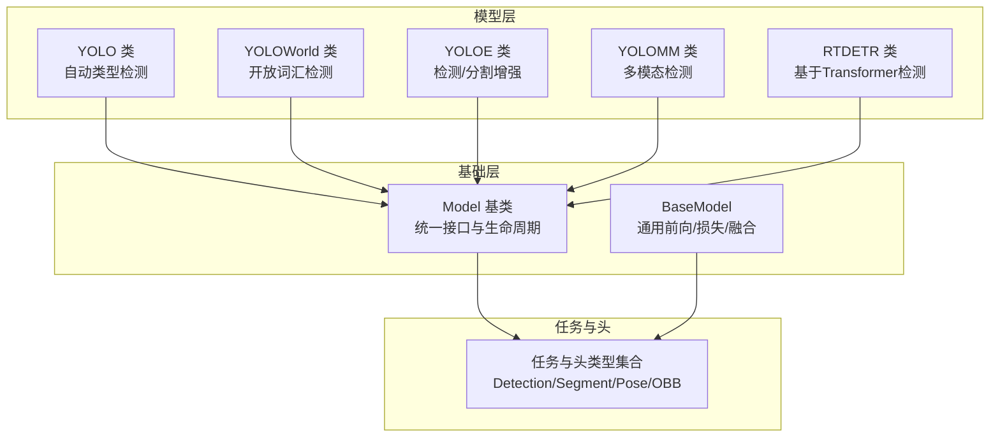
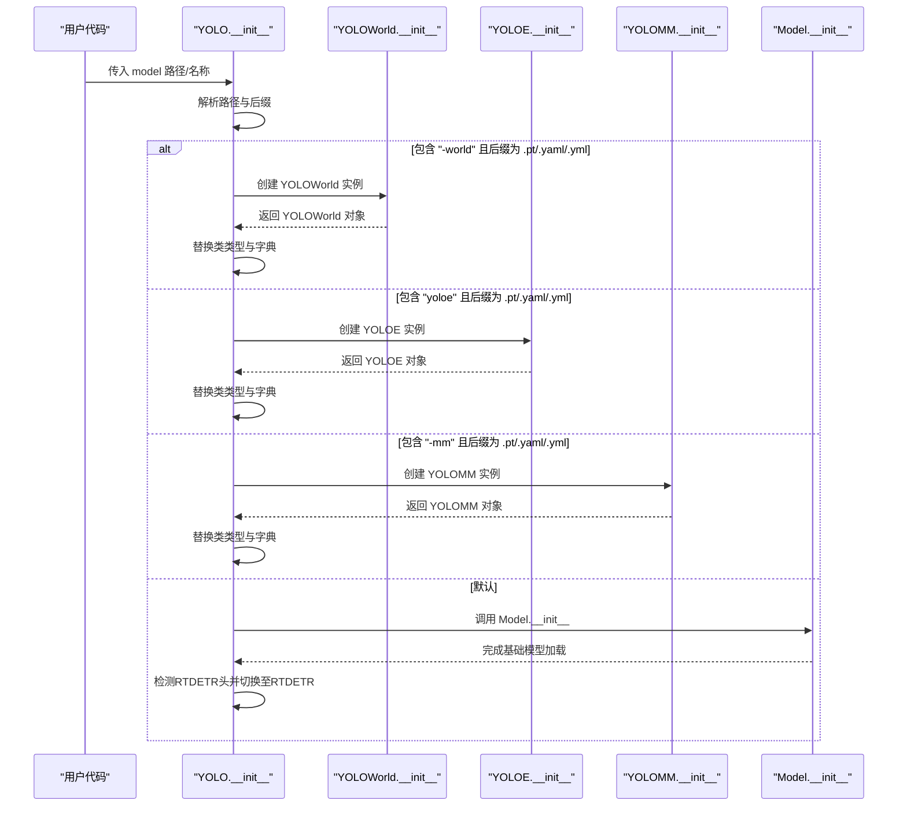
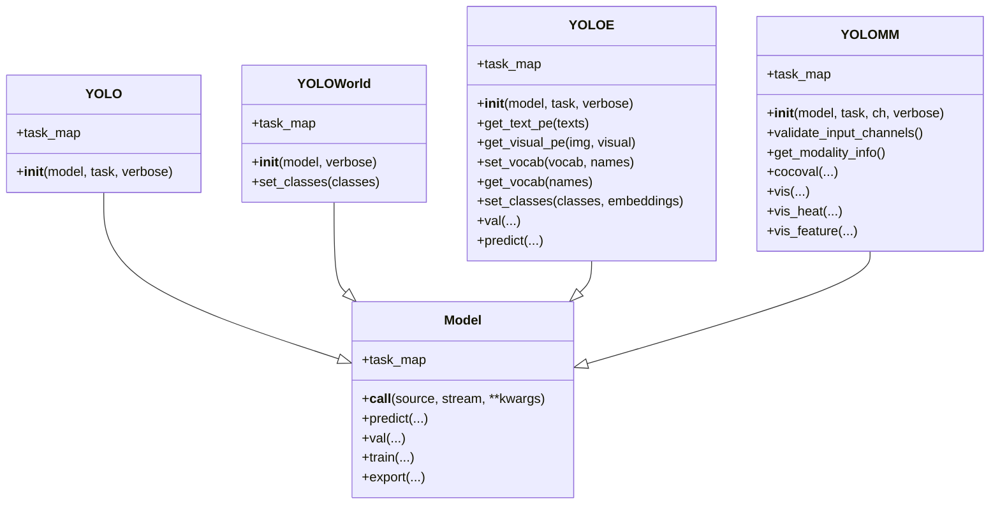
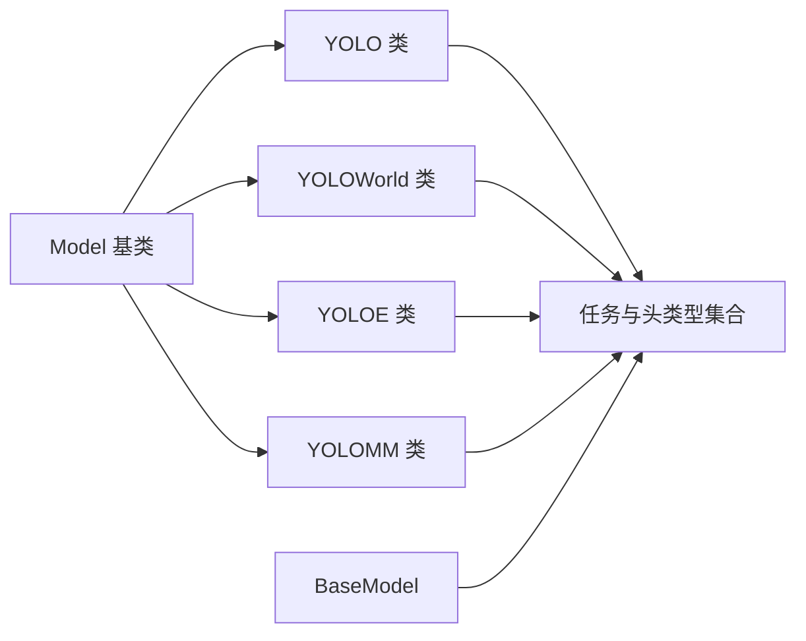

# YOLO基础模型类

<cite>
**本文档引用的文件**
- [ultralytics/models/yolo/model.py](file://ultralytics/models/yolo/model.py)
- [ultralytics/engine/model.py](file://ultralytics/engine/model.py)
- [ultralytics/nn/tasks.py](file://ultralytics/nn/tasks.py)
- [ultralytics/models/yolo/__init__.py](file://ultralytics/models/yolo/__init__.py)
</cite>

## 目录
1. [简介](#简介)
2. [项目结构](#项目结构)
3. [核心组件](#核心组件)
4. [架构总览](#架构总览)
5. [详细组件分析](#详细组件分析)
6. [依赖关系分析](#依赖关系分析)
7. [性能考虑](#性能考虑)
8. [故障排除指南](#故障排除指南)
9. [结论](#结论)

## 简介
本文件为YOLO基础模型类的详细API文档，聚焦于以下方面：
- YOLO类的构造函数与初始化流程
- 自动类型检测机制（YOLOWorld、YOLOE、YOLOMM、RTDETR头检测）
- 任务映射系统（task_map）及其在不同模型类型中的应用
- 继承关系与多态行为
- 文件名解析逻辑与特殊模型类型的识别
- 方法参数类型、返回值、异常处理与实际使用示例
- 任务类型映射表、模型类型自动切换机制与最佳实践建议

## 项目结构
该仓库采用模块化组织方式，YOLO相关的核心实现集中在以下位置：
- 基础模型与多形态模型：ultralytics/models/yolo/model.py
- 通用模型基类与通用操作：ultralytics/engine/model.py
- 模型任务与头类型定义：ultralytics/nn/tasks.py
- 模型包导出：ultralytics/models/yolo/__init__.py

**图表来源**
- [ultralytics/models/yolo/model.py:27-131](file://ultralytics/models/yolo/model.py#L27-L131)
- [ultralytics/engine/model.py:29-1205](file://ultralytics/engine/model.py#L29-L1205)
- [ultralytics/nn/tasks.py:626-840](file://ultralytics/nn/tasks.py#L626-L840)

**章节来源**
- [ultralytics/models/yolo/model.py:1-1118](file://ultralytics/models/yolo/model.py#L1-L1118)
- [ultralytics/engine/model.py:1-1366](file://ultralytics/engine/model.py#L1-L1366)
- [ultralytics/nn/tasks.py:1-1200](file://ultralytics/nn/tasks.py#L1-L1200)

## 核心组件
本节概述YOLO基础模型类的关键组件与其职责：
- YOLO类：统一入口，负责自动类型检测与模型实例切换
- YOLOWorld类：开放词汇检测专用，支持文本描述驱动的检测
- YOLOE类：检测/分割增强模型，支持文本/视觉提示
- YOLOMM类：多模态模型，支持RGB+X等多通道输入与模态路由
- Model基类：提供统一的生命周期管理、预测、训练、验证、导出等能力
- BaseModel：通用模型抽象，实现前向传播、损失计算、权重融合等

**章节来源**
- [ultralytics/models/yolo/model.py:27-131](file://ultralytics/models/yolo/model.py#L27-L131)
- [ultralytics/engine/model.py:29-1205](file://ultralytics/engine/model.py#L29-L1205)
- [ultralytics/nn/tasks.py:821-1172](file://ultralytics/nn/tasks.py#L821-L1172)

## 架构总览
YOLO类通过构造函数在初始化时根据文件名后缀与名称特征，自动选择并实例化具体的模型类型。随后，YOLO类将自身类类型动态替换为所选模型类型，从而实现多态行为。

**图表来源**
- [ultralytics/models/yolo/model.py:55-95](file://ultralytics/models/yolo/model.py#L55-L95)
- [ultralytics/engine/model.py:82-157](file://ultralytics/engine/model.py#L82-L157)

**章节来源**
- [ultralytics/models/yolo/model.py:55-95](file://ultralytics/models/yolo/model.py#L55-L95)
- [ultralytics/engine/model.py:82-157](file://ultralytics/engine/model.py#L82-L157)

## 详细组件分析

### YOLO类（自动类型检测与继承关系）
- 构造函数
  - 参数
    - model: 字符串或Path，模型名称或权重/配置文件路径
    - task: 可选字符串，任务类型（detect/segment/classify/pose/obb）
    - verbose: 布尔值，是否打印模型信息
  - 行为
    - 解析路径，判断文件名中是否包含"-world"、"yoloe"、"-mm"等特征
    - 根据特征动态创建对应模型实例并替换当前类类型与字典
    - 若未匹配，则调用Model基类初始化，并在检测到RTDETR头时切换至RTDETR
  - 返回值：无（构造函数）
  - 异常：当模型文件不存在或格式不支持时抛出相应异常
  - 示例：参见源码注释中的示例路径

- 任务映射
  - 提供task_map属性，将任务类型映射到对应的模型、训练器、验证器与预测器类
  - 支持detect、segment、classify、pose、obb五种任务

**图表来源**
- [ultralytics/models/yolo/model.py:27-131](file://ultralytics/models/yolo/model.py#L27-L131)
- [ultralytics/models/yolo/model.py:133-206](file://ultralytics/models/yolo/model.py#L133-L206)
- [ultralytics/models/yolo/model.py:207-454](file://ultralytics/models/yolo/model.py#L207-L454)
- [ultralytics/models/yolo/model.py:456-1106](file://ultralytics/models/yolo/model.py#L456-L1106)
- [ultralytics/engine/model.py:29-1205](file://ultralytics/engine/model.py#L29-L1205)

**章节来源**
- [ultralytics/models/yolo/model.py:55-131](file://ultralytics/models/yolo/model.py#L55-L131)

### YOLOWorld类（开放词汇检测）
- 构造函数
  - 参数：model（*.pt或*.yaml）、verbose
  - 行为：调用Model基类初始化，若未设置类别名则加载默认COCO类别
  - 返回值：无
  - 异常：无特定异常，但依赖模型文件存在性

- 任务映射
  - 仅支持detect任务，映射到WorldModel及相关训练/验证/预测器

- 关键方法
  - set_classes：设置检测类别，移除空格背景并同步预测器

**章节来源**
- [ultralytics/models/yolo/model.py:133-206](file://ultralytics/models/yolo/model.py#L133-L206)

### YOLOE类（检测/分割增强）
- 构造函数
  - 参数：model（*.pt或*.yaml）、task（可选）、verbose
  - 行为：调用Model基类初始化，设置默认COCO类别

- 任务映射
  - detect：映射到YOLOEModel与相应训练/验证/预测器
  - segment：映射到YOLOESegModel与相应训练/验证/预测器

- 关键方法
  - get_text_pe/get_visual_pe：获取文本/视觉位置嵌入
  - set_vocab/get_vocab：设置/获取词汇表
  - set_classes：设置类别与嵌入，断言无背景
  - val/predict：支持文本/视觉提示的验证与预测

**章节来源**
- [ultralytics/models/yolo/model.py:207-454](file://ultralytics/models/yolo/model.py#L207-L454)

### YOLOMM类（多模态检测）
- 构造函数
  - 参数：model（*.yaml或*.pt）、task（可选）、ch（输入通道，3或6）、verbose
  - 行为：调用Model基类初始化，配置多模态设置（RGB/X/Dual）

- 多模态配置
  - 自动检测配置中的多模态层，确定输入通道数
  - 支持RGB-only（3通道）与RGB+X（6通道）两种模式
  - 提供模态信息查询接口

- 关键方法
  - validate_input_channels：校验通道数
  - get_modality_info：返回模态配置信息
  - cocoval：使用COCO指标进行验证（支持多模态）
  - vis/vis_heat/vis_feature：可视化入口与便捷封装

**章节来源**
- [ultralytics/models/yolo/model.py:456-1106](file://ultralytics/models/yolo/model.py#L456-L1106)

### Model基类（通用模型接口）
- 生命周期与通用操作
  - 初始化：支持HUB模型、Triton服务模型、本地权重与配置文件
  - 加载：从.pt或其它权重格式加载
  - 预测：统一的predict接口，支持流式与CLI模式
  - 验证：支持标准验证与COCO验证
  - 训练：统一训练接口，支持HUB集成
  - 导出：统一导出接口，支持多种格式
  - 融合：Conv/BatchNorm融合优化推理

- 任务映射
  - 通过task_map动态加载对应的任务类（model/trainer/validator/predictor）

**章节来源**
- [ultralytics/engine/model.py:82-1366](file://ultralytics/engine/model.py#L82-L1366)

### BaseModel（通用模型抽象）
- 前向传播
  - 支持多模态路由（通过mm_router），在模块间进行模态输入路由与空间重置
  - 支持profile模式统计每层耗时与GFLOPs

- 损失与对比学习
  - 支持对比学习分支（在满足条件时启用）
  - 提供init_criterion抽象方法

- 权重融合
  - 支持Conv/BatchNorm等层融合，提升推理效率

**章节来源**
- [ultralytics/nn/tasks.py:821-1172](file://ultralytics/nn/tasks.py#L821-L1172)

## 依赖关系分析
- YOLO类依赖Model基类与各特化模型类（YOLOWorld、YOLOE、YOLOMM）
- 特化模型类共享相同的task_map结构，但映射到不同的任务实现
- BaseModel提供通用前向与损失框架，支撑多模态路由与对比学习

**图表来源**
- [ultralytics/models/yolo/model.py:27-131](file://ultralytics/models/yolo/model.py#L27-L131)
- [ultralytics/nn/tasks.py:626-840](file://ultralytics/nn/tasks.py#L626-L840)

**章节来源**
- [ultralytics/models/yolo/model.py:27-131](file://ultralytics/models/yolo/model.py#L27-L131)
- [ultralytics/nn/tasks.py:626-840](file://ultralytics/nn/tasks.py#L626-L840)

## 性能考虑
- 多模态路由与GFLOPs统计
  - YOLOMM提供profile接口，支持按模态（RGB/Dual/X）构造输入并统计单路与全路GFLOPs
  - 建议在部署前使用profile接口评估不同模态下的性能开销
- 层融合优化
  - BaseModel提供fuse接口，可在推理前融合Conv/BatchNorm层，减少算子数量
- 推理模式
  - 使用Model.eval()切换到评估模式，禁用dropout与BN的训练行为

[本节为通用指导，无需特定文件引用]

## 故障排除指南
- 模型文件不存在或格式不支持
  - 现象：初始化时报错
  - 处理：确认文件路径与后缀，支持.pt/.yaml/.yml
- 不支持的输入通道数（YOLOMM）
  - 现象：抛出ValueError
  - 处理：确保ch参数为3或6，或允许自动检测
- 多模态组件缺失
  - 现象：导入错误或回退到标准组件
  - 处理：安装多模态相关依赖，或使用标准任务

**章节来源**
- [ultralytics/models/yolo/model.py:638-644](file://ultralytics/models/yolo/model.py#L638-L644)
- [ultralytics/engine/model.py:103-107](file://ultralytics/engine/model.py#L103-L107)

## 结论
YOLO基础模型类通过构造函数实现了强大的自动类型检测与动态实例化能力，结合Model基类的统一接口与多模态支持，形成了灵活、可扩展的模型体系。开发者可通过文件名特征快速切换到YOLOWorld、YOLOE、YOLOMM或RTDETR等特化模型，并利用task_map实现任务级别的无缝适配。建议在生产环境中配合profile接口进行性能评估，并在多模态场景下合理配置输入通道与模态路由。