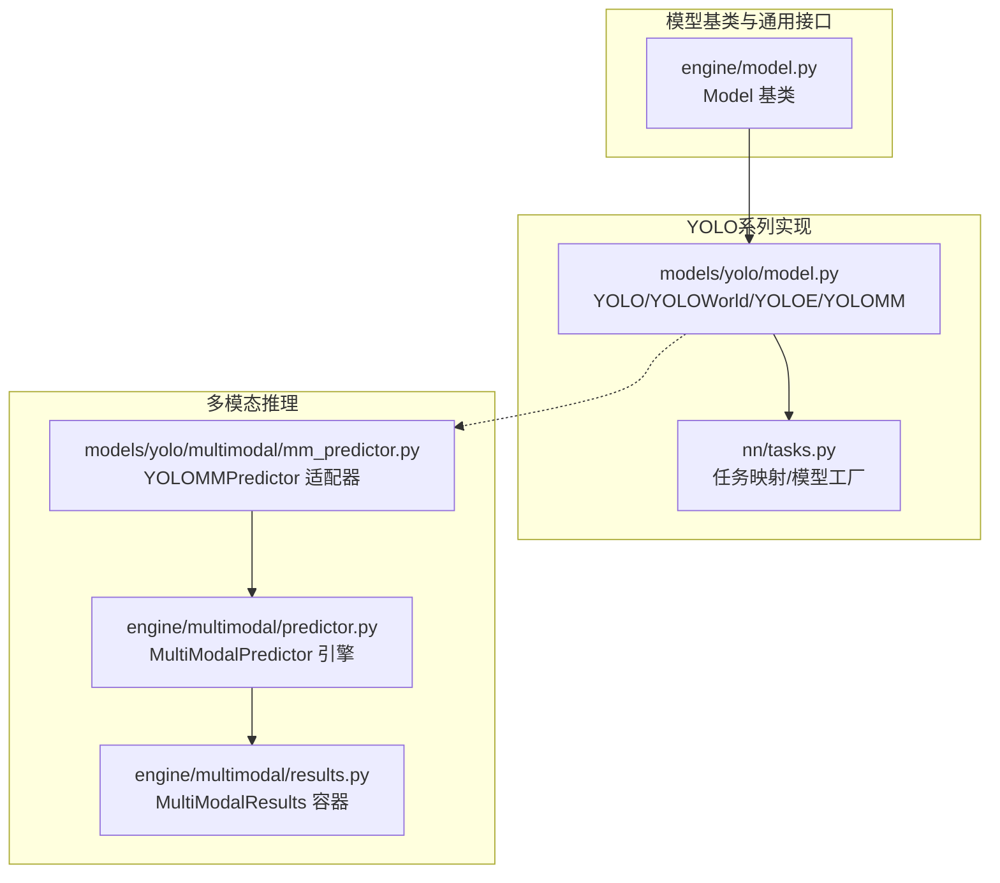
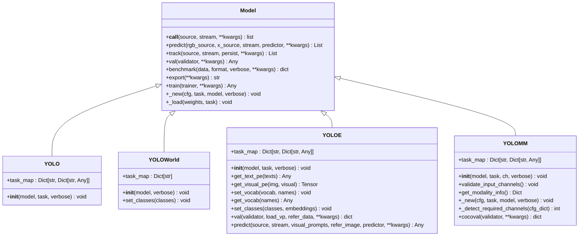
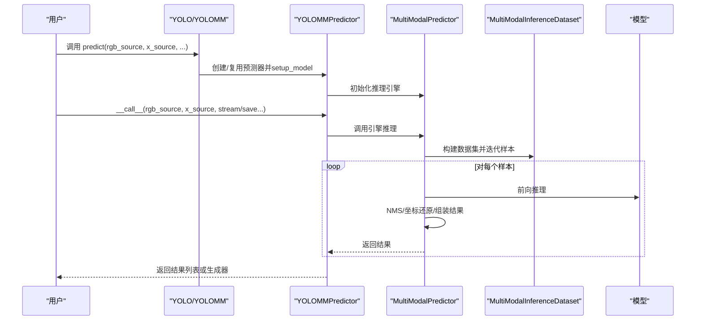
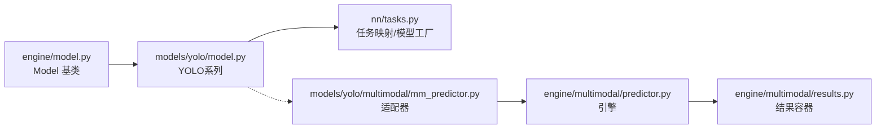

# YOLO模型类API

<cite>
**本文档引用的文件**
- [ultralytics/models/yolo/model.py](file://ultralytics/models/yolo/model.py)
- [ultralytics/engine/model.py](file://ultralytics/engine/model.py)
- [ultralytics/models/__init__.py](file://ultralytics/models/__init__.py)
- [ultralytics/models/yolo/multimodal/mm_predictor.py](file://ultralytics/models/yolo/multimodal/mm_predictor.py)
- [ultralytics/engine/multimodal/predictor.py](file://ultralytics/engine/multimodal/predictor.py)
- [ultralytics/engine/multimodal/results.py](file://ultralytics/engine/multimodal/results.py)
- [ultralytics/nn/tasks.py](file://ultralytics/nn/tasks.py)
</cite>

## 目录
1. [简介](#简介)
2. [项目结构](#项目结构)
3. [核心组件](#核心组件)
4. [架构总览](#架构总览)
5. [详细组件分析](#详细组件分析)
6. [依赖关系分析](#依赖关系分析)
7. [性能考虑](#性能考虑)
8. [故障排除指南](#故障排除指南)
9. [结论](#结论)

## 简介
本文件面向YOLO系列模型类的使用者与开发者，系统梳理YOLO、YOLOWorld、YOLOE以及YOLOMM等核心模型类的完整API，涵盖：
- 模型初始化方法与自动类型检测逻辑
- 任务映射机制与各任务对应的模型/训练器/验证器/预测器
- 配置参数验证与方法调用约定
- 属性访问与方法重写行为
- 实际使用示例与最佳实践建议

## 项目结构
围绕YOLO系列模型的核心文件组织如下：
- 基类与通用模型接口：ultralytics/engine/model.py
- YOLO系列模型实现：ultralytics/models/yolo/model.py
- 多模态推理适配层：ultralytics/models/yolo/multimodal/mm_predictor.py
- 多模态推理引擎：ultralytics/engine/multimodal/predictor.py
- 多模态结果容器：ultralytics/engine/multimodal/results.py
- 任务类型映射与模型工厂：ultralytics/nn/tasks.py
- 模块导出入口：ultralytics/models/__init__.py

**图表来源**
- [ultralytics/engine/model.py:1-1366](file://ultralytics/engine/model.py#L1-L1366)
- [ultralytics/models/yolo/model.py:1-1118](file://ultralytics/models/yolo/model.py#L1-L1118)
- [ultralytics/models/yolo/multimodal/mm_predictor.py:1-136](file://ultralytics/models/yolo/multimodal/mm_predictor.py#L1-L136)
- [ultralytics/engine/multimodal/predictor.py:1-494](file://ultralytics/engine/multimodal/predictor.py#L1-L494)
- [ultralytics/engine/multimodal/results.py:1-357](file://ultralytics/engine/multimodal/results.py#L1-L357)
- [ultralytics/nn/tasks.py:1-3919](file://ultralytics/nn/tasks.py#L1-L3919)

**章节来源**
- [ultralytics/models/yolo/model.py:1-1118](file://ultralytics/models/yolo/model.py#L1-L1118)
- [ultralytics/engine/model.py:1-1366](file://ultralytics/engine/model.py#L1-L1366)
- [ultralytics/models/__init__.py:1-30](file://ultralytics/models/__init__.py#L1-L30)

## 核心组件
本节聚焦YOLO系列模型类的关键接口与行为。

- YOLO类
  - 自动类型检测：根据模型文件名后缀与名称关键字切换到YOLOWorld、YOLOE或YOLOMM；否则走默认YOLO初始化。
  - 任务映射：提供detect、segment、classify、pose、obb等任务到对应模型/训练器/验证器/预测器的映射。
  - 示例：加载预训练模型、从YAML初始化等。

- YOLOWorld类
  - 专用于开放词汇检测，任务固定为detect。
  - 提供set_classes方法动态设置类别名称。
  - 任务映射：仅detect任务。

- YOLOE类
  - 支持检测与分割任务，增强文本/视觉位置嵌入与词汇管理。
  - 提供get_text_pe、get_visual_pe、set_vocab、get_vocab、set_classes等方法。
  - 提供val与predict扩展，支持视觉提示与参考图像。

- YOLOMM类
  - 多模态输入（RGB+X），支持3通道（RGB-only）与6通道（RGB+X）配置。
  - 提供模态信息查询、输入通道验证、配置检测与任务推断。
  - 提供cocoval方法进行COCO指标验证。

**章节来源**
- [ultralytics/models/yolo/model.py:27-131](file://ultralytics/models/yolo/model.py#L27-L131)
- [ultralytics/models/yolo/model.py:133-206](file://ultralytics/models/yolo/model.py#L133-L206)
- [ultralytics/models/yolo/model.py:207-454](file://ultralytics/models/yolo/model.py#L207-L454)
- [ultralytics/models/yolo/model.py:456-800](file://ultralytics/models/yolo/model.py#L456-L800)

## 架构总览
YOLO系列模型采用“基类 + 任务映射 + 多模态适配”的分层设计：
- Model基类负责通用生命周期（加载、训练、验证、预测、导出等）与参数覆盖。
- YOLO系列子类通过task_map将任务映射到具体模型实现与配套组件。
- 多模态场景通过适配器桥接到独立的推理引擎，保持与统一API的兼容。

**图表来源**
- [ultralytics/engine/model.py:29-800](file://ultralytics/engine/model.py#L29-L800)
- [ultralytics/models/yolo/model.py:27-800](file://ultralytics/models/yolo/model.py#L27-L800)

## 详细组件分析

### YOLO类
- 构造函数参数
  - model: 字符串或路径，支持.pt/.yaml/.yml等格式
  - task: 可选的任务字符串（detect/segment/classify/pose/obb）
  - verbose: 是否打印模型信息
- 关键行为
  - 自动类型检测：根据文件名包含"-world"、"yoloe"、"-mm"等关键字切换到相应子类
  - 默认回退：若非上述类型，则调用父类Model的初始化
  - 任务映射：提供detect/segment/classify/pose/obb到具体实现的映射
- 方法与属性
  - task_map：返回任务到模型/训练器/验证器/预测器的映射字典
- 异常与校验
  - 若传入非PyTorch模型或不支持的格式，将在后续操作中触发相应错误
- 使用示例
  - 加载预训练检测模型
  - 加载预训练分割模型
  - 从YAML配置初始化

**章节来源**
- [ultralytics/models/yolo/model.py:55-95](file://ultralytics/models/yolo/model.py#L55-L95)
- [ultralytics/models/yolo/model.py:96-131](file://ultralytics/models/yolo/model.py#L96-L131)

### YOLOWorld类
- 构造函数参数
  - model: 预训练权重或YAML路径
  - verbose: 是否打印信息
- 关键行为
  - 任务固定为detect
  - 若模型未设置names，自动加载默认COCO类别
- 方法与属性
  - task_map：仅包含detect任务
  - set_classes：设置检测类别名称，移除背景项并同步预测器
- 异常与校验
  - 无特殊异常，但需确保模型具备设置类别的能力
- 使用示例
  - 加载YOLOWorld模型
  - 动态设置自定义类别

**章节来源**
- [ultralytics/models/yolo/model.py:159-206](file://ultralytics/models/yolo/model.py#L159-L206)

### YOLOE类
- 构造函数参数
  - model: 预训练权重或YAML路径
  - task: 可选，自动检测
  - verbose: 是否打印信息
- 关键行为
  - 任务映射：detect与segment分别映射到不同模型/训练器/验证器/预测器
  - 文本/视觉位置嵌入：get_text_pe、get_visual_pe
  - 词汇管理：set_vocab、get_vocab
  - 类别设置：set_classes（需确保不含背景）
  - 验证：val支持文本/视觉提示
  - 预测：predict支持视觉提示与参考图像
- 方法与属性
  - task_map：detect/segment任务映射
  - set_classes：设置类别与嵌入，同步names与预测器
- 异常与校验
  - 断言模型类型必须为YOLOEModel
  - 视觉提示参数校验（bboxes与cls数量一致）
- 使用示例
  - 加载YOLOE检测/分割模型
  - 设置词汇与类别
  - 使用视觉提示进行预测

**章节来源**
- [ultralytics/models/yolo/model.py:242-348](file://ultralytics/models/yolo/model.py#L242-L348)
- [ultralytics/models/yolo/model.py:349-454](file://ultralytics/models/yolo/model.py#L349-L454)

### YOLOMM类
- 构造函数参数
  - model: YAML或权重路径
  - task: 可选，自动检测
  - ch: 输入通道数（3或6），可选
  - verbose: 是否打印信息
- 关键行为
  - 多模态配置检测：从配置中识别早期/中期融合与Dual模态
  - 输入通道验证：仅支持3或6通道
  - 任务映射：整合标准任务与多模态任务
  - 推理：提供cocoval方法进行COCO指标验证
- 方法与属性
  - _configure_multimodal_settings：配置多模态参数
  - _detect_multimodal_layers/_has_dual_modality_layers：检测多模态层
  - validate_input_channels：通道合法性校验
  - get_modality_info：返回模态配置信息
  - _new/_detect_required_channels：基于配置推断任务与通道
  - cocoval：COCO验证接口
- 异常与校验
  - 不支持的输入通道将抛出ValueError
- 使用示例
  - 从YAML加载多模态模型
  - 指定通道数（RGB-only或RGB+X）
  - 查询模态信息

**章节来源**
- [ultralytics/models/yolo/model.py:488-800](file://ultralytics/models/yolo/model.py#L488-L800)

### 多模态推理适配与引擎
- YOLOMMPredictor（适配器）
  - 作用：将Model.predict的BasePredictor风格参数转换为新推理引擎所需格式
  - 初始化：setup_model中创建MultiModalPredictor实例
  - 调用：__call__与predict_cli分别处理流式与CLI模式
- MultiModalPredictor（引擎）
  - 作用：独立的多模态推理引擎，支持真正的流式推理
  - 初始化：读取模型Router配置，检测RTDETR或YOLO类型
  - 推理：构建数据集、前向、NMS、坐标还原、组装结果
  - 保存：使用MultiModalSaver保存可视化与标签
- MultiModalResults（结果容器）
  - 作用：封装检测框、路径、原始图像、元数据与类别名称
  - 可视化：支持RGB与X模态标注，合并输出等

**图表来源**
- [ultralytics/models/yolo/multimodal/mm_predictor.py:33-136](file://ultralytics/models/yolo/multimodal/mm_predictor.py#L33-L136)
- [ultralytics/engine/multimodal/predictor.py:32-244](file://ultralytics/engine/multimodal/predictor.py#L32-L244)

**章节来源**
- [ultralytics/models/yolo/multimodal/mm_predictor.py:18-136](file://ultralytics/models/yolo/multimodal/mm_predictor.py#L18-L136)
- [ultralytics/engine/multimodal/predictor.py:16-494](file://ultralytics/engine/multimodal/predictor.py#L16-L494)
- [ultralytics/engine/multimodal/results.py:14-357](file://ultralytics/engine/multimodal/results.py#L14-L357)

## 依赖关系分析
- Model基类提供统一的生命周期管理与参数覆盖机制
- YOLO系列子类通过task_map解耦任务与具体实现
- 多模态场景通过适配器与独立引擎实现与统一API的兼容
- 任务映射与模型工厂位于nn/tasks.py，便于集中管理

**图表来源**
- [ultralytics/engine/model.py:29-800](file://ultralytics/engine/model.py#L29-L800)
- [ultralytics/models/yolo/model.py:27-800](file://ultralytics/models/yolo/model.py#L27-L800)
- [ultralytics/nn/tasks.py:1-3919](file://ultralytics/nn/tasks.py#L1-L3919)

**章节来源**
- [ultralytics/engine/model.py:29-800](file://ultralytics/engine/model.py#L29-L800)
- [ultralytics/models/yolo/model.py:27-800](file://ultralytics/models/yolo/model.py#L27-L800)
- [ultralytics/nn/tasks.py:1-3919](file://ultralytics/nn/tasks.py#L1-L3919)

## 性能考虑
- 推理优化
  - 使用fuse方法融合卷积与BN层以提升推理速度
  - 合理设置conf、iou、max_det等参数平衡精度与速度
- 多模态推理
  - 流式推理（stream=True）可边生成边消费，降低内存占用
  - 仅在必要时启用debug日志，避免额外开销
- 导出与部署
  - 使用export接口导出至ONNX/TensorRT等格式以获得更快部署性能
  - benchmark接口可用于不同格式的性能对比

[本节为通用指导，无需特定文件来源]

## 故障排除指南
- 模型类型不匹配
  - 症状：调用训练/验证等方法时报错
  - 处理：确认模型为PyTorch格式（*.pt），或使用正确的导出格式
- 输入通道不支持（YOLOMM）
  - 症状：抛出ValueError，提示不支持的输入通道
  - 处理：确保ch为3或6，或依据配置自动推断
- 视觉提示参数错误（YOLOE）
  - 症状：断言失败，提示缺少bboxes或cls或数量不一致
  - 处理：确保visual_prompts包含bboxes与cls，且长度相等
- 多模态推理未初始化
  - 症状：调用__call__时报RuntimeError
  - 处理：先调用setup_model初始化推理引擎

**章节来源**
- [ultralytics/engine/model.py:310-337](file://ultralytics/engine/model.py#L310-L337)
- [ultralytics/models/yolo/model.py:631-644](file://ultralytics/models/yolo/model.py#L631-L644)
- [ultralytics/models/yolo/model.py:410-418](file://ultralytics/models/yolo/model.py#L410-L418)
- [ultralytics/models/yolo/multimodal/mm_predictor.py:91-93](file://ultralytics/models/yolo/multimodal/mm_predictor.py#L91-L93)

## 结论
YOLO系列模型类通过清晰的层次设计与任务映射机制，实现了对多种任务与多模态场景的统一支持。YOLO类负责自动类型检测与任务映射，YOLOWorld与YOLOE分别面向开放词汇与增强检测/分割，YOLOMM则提供灵活的多模态输入与推理能力。配合独立的多模态推理引擎与适配器，既保证了与统一API的兼容性，又提升了推理效率与可维护性。建议在实际使用中遵循参数校验与异常处理的最佳实践，结合性能优化手段获得更佳效果。