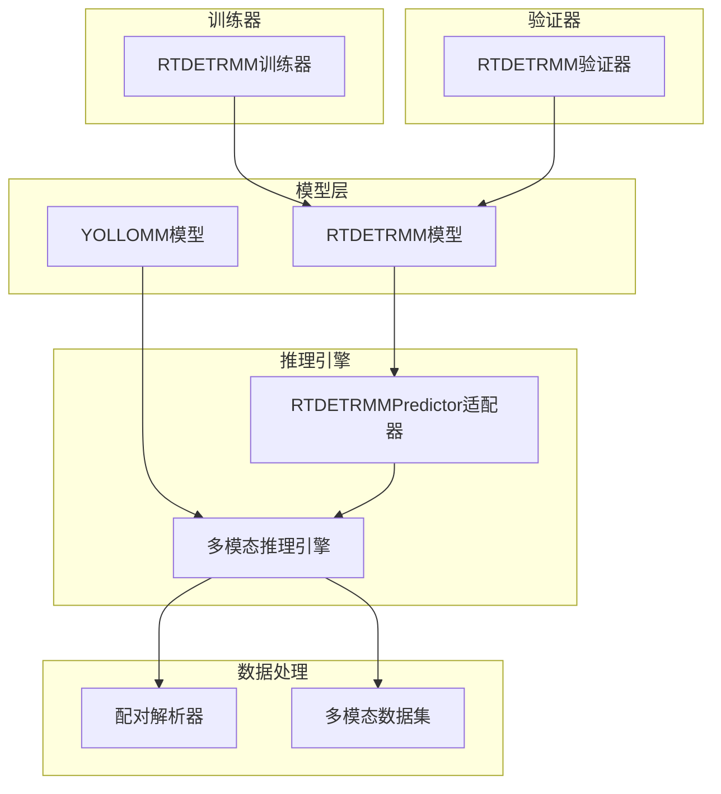
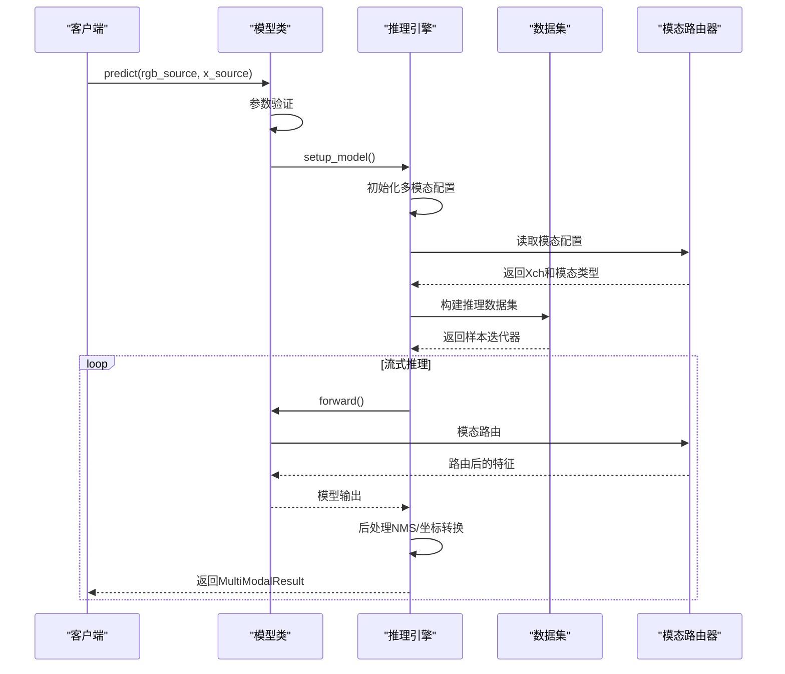
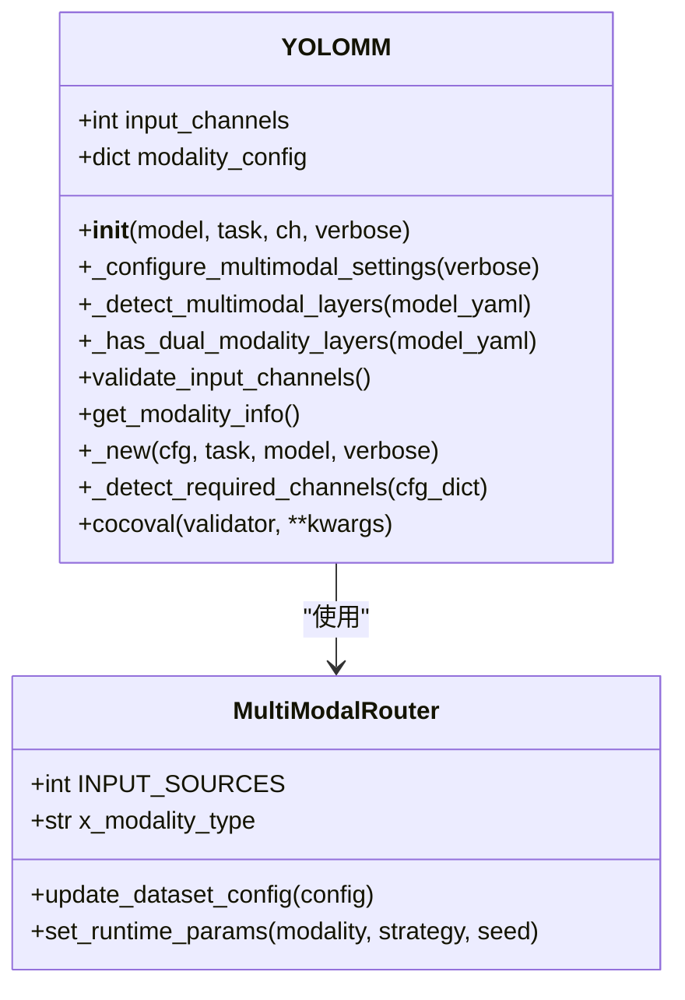
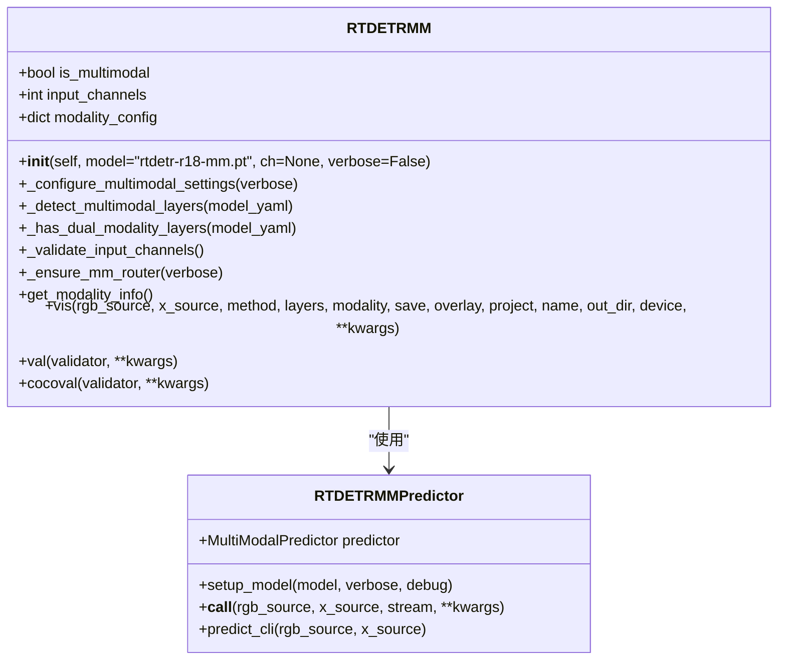
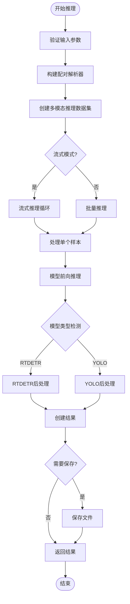
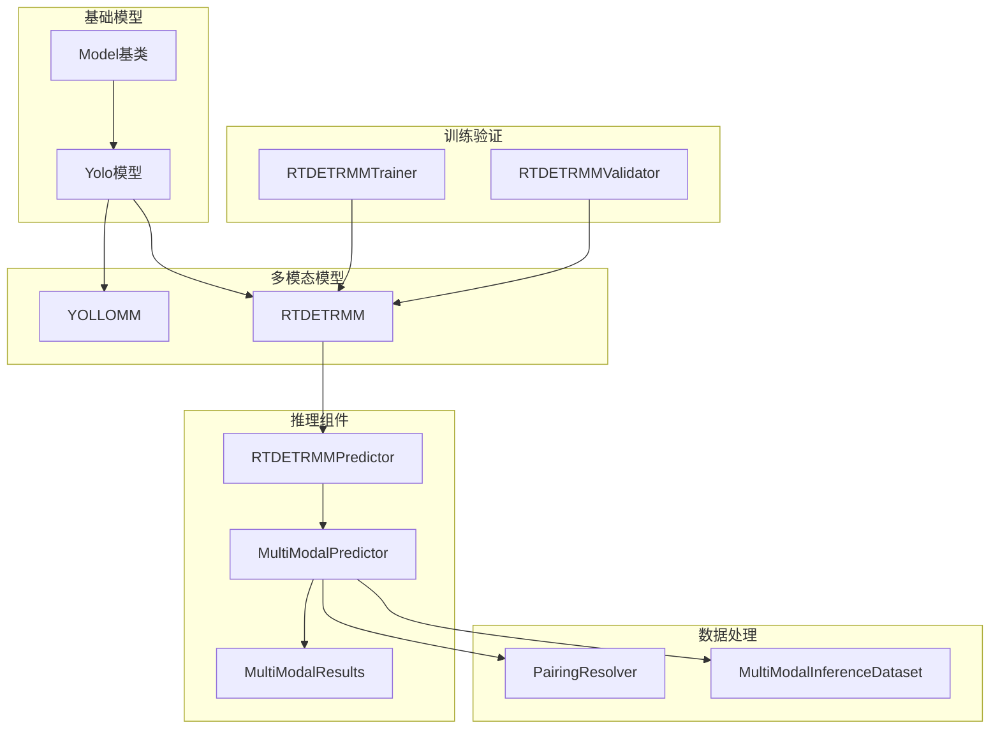

# 核心模型API

<cite>
**本文档引用的文件**
- [ultralytics/models/rtdetrmm/model.py](file://ultralytics/models/rtdetrmm/model.py)
- [ultralytics/engine/multimodal/predictor.py](file://ultralytics/engine/multimodal/predictor.py)
- [ultralytics/engine/model.py](file://ultralytics/engine/model.py)
- [ultralytics/models/rtdetrmm/mm_predictor.py](file://ultralytics/models/rtdetrmm/mm_predictor.py)
- [ultralytics/engine/multimodal/results.py](file://ultralytics/engine/multimodal/results.py)
- [ultralytics/models/rtdetrmm/train.py](file://ultralytics/models/rtdetrmm/train.py)
- [ultralytics/models/rtdetrmm/val.py](file://ultralytics/models/rtdetrmm/val.py)
- [ultralytics/models/yolo/model.py](file://ultralytics/models/yolo/model.py)
</cite>

## 目录
1. [简介](#简介)
2. [项目结构](#项目结构)
3. [核心组件](#核心组件)
4. [架构概览](#架构概览)
5. [详细组件分析](#详细组件分析)
6. [依赖关系分析](#依赖关系分析)
7. [性能考虑](#性能考虑)
8. [故障排除指南](#故障排除指南)
9. [结论](#结论)

## 简介

本文档为多模态检测系统的核心模型类提供详细的API文档。重点覆盖YOLOMM和RTDETRMM模型类的完整接口，包括模型初始化方法、配置参数、属性访问和方法调用。同时详细说明MultiModalDetectionTrainer和MultiModalDetectionPredictor类的所有公共方法，包括get_model、build_dataset、train、predict等关键接口。

该系统支持RGB和X模态的多模态输入，提供灵活的通道配置和自动模态路由功能。系统采用Fail-Fast设计原则，严格基于YAML/CKPT内容判据识别多模态结构，不依赖文件名后缀。

## 项目结构

多模态检测系统采用模块化架构，主要包含以下核心模块：

**图表来源**
- [ultralytics/models/rtdetrmm/model.py:25-57](file://ultralytics/models/rtdetrmm/model.py#L25-L57)
- [ultralytics/engine/multimodal/predictor.py:16-30](file://ultralytics/engine/multimodal/predictor.py#L16-L30)
- [ultralytics/models/rtdetrmm/mm_predictor.py:18-31](file://ultralytics/models/rtdetrmm/mm_predictor.py#L18-L31)

**章节来源**
- [ultralytics/models/rtdetrmm/model.py:1-269](file://ultralytics/models/rtdetrmm/model.py#L1-L269)
- [ultralytics/engine/multimodal/predictor.py:1-494](file://ultralytics/engine/multimodal/predictor.py#L1-L494)

## 核心组件

### YOLOMM模型类

YOLOMM扩展了YOLO架构以支持多模态输入（RGB + X模态），提供灵活的通道配置和自动模态路由功能。

**主要特性：**
- 支持3通道RGB-only和6通道RGB+X双模态输入
- 自动检测多模态层并配置输入通道数
- 智能模态路由和通道分配
- 完整的多模态配置管理

**关键属性：**
- `input_channels`: 输入通道数（3或6）
- `modality_config`: 模态配置字典
- `is_multimodal`: 是否为多模态模型标志

**章节来源**
- [ultralytics/models/yolo/model.py:456-658](file://ultralytics/models/yolo/model.py#L456-L658)

### RTDETRMM模型类

RTDETRMM是独立的多模态RT-DETR家族模型入口，设计目标是不继承RTDETR且严格基于内容判据识别多模态结构。

**主要特性：**
- Fail-Fast设计：基于YAML/CKPT内容严格识别多模态结构
- 独立家族：不依赖文件名包含"-mm"
- 多模态可视化支持
- COCO验证集成

**关键属性：**
- `input_channels`: 输入通道数
- `modality_config`: 多模态配置
- `is_multimodal`: 多模态标志

**章节来源**
- [ultralytics/models/rtdetrmm/model.py:25-188](file://ultralytics/models/rtdetrmm/model.py#L25-L188)

### MultiModalPredictor推理引擎

多模态推理引擎核心，完全独立于BasePredictor，提供高效的多模态推理能力。

**主要特性：**
- 从模型读取Router配置（Xch）
- 构建数据集并迭代样本
- 支持真正的流式推理（边迭代边yield）
- 自动检测模型类型（YOLO/RTDETR）

**关键参数：**
- `model`: YOLOMM/RTDETRMM模型实例
- `imgsz`: 推理输入尺寸
- `conf`: 置信度阈值
- `iou`: NMS IOU阈值
- `max_det`: 最大检测框数量
- `device`: 设备配置

**章节来源**
- [ultralytics/engine/multimodal/predictor.py:16-494](file://ultralytics/engine/multimodal/predictor.py#L16-L494)

## 架构概览

系统采用分层架构，各组件职责清晰：

**图表来源**
- [ultralytics/engine/model.py:498-580](file://ultralytics/engine/model.py#L498-L580)
- [ultralytics/engine/multimodal/predictor.py:99-243](file://ultralytics/engine/multimodal/predictor.py#L99-L243)

**章节来源**
- [ultralytics/engine/model.py:498-690](file://ultralytics/engine/model.py#L498-L690)

## 详细组件分析

### YOLOMM模型类详细分析

#### 初始化方法

**图表来源**
- [ultralytics/models/yolo/model.py:456-740](file://ultralytics/models/yolo/model.py#L456-L740)

**方法详细说明：**

1. **`__init__(self, model, task=None, ch=None, verbose=False)`**
   - 参数类型：`model` (str|Path), `task` (str|None), `ch` (int|None), `verbose` (bool)
   - 返回值：无
   - 功能：初始化YOLOMM模型，存储多模态特定属性，调用基类初始化
   - 异常：无

2. **`_configure_multimodal_settings(self, verbose=False)`**
   - 参数类型：`verbose` (bool)
   - 返回值：无
   - 功能：基于模型配置检测多模态层，配置输入通道数和模态信息
   - 异常：配置失败时使用默认RGB-only配置

3. **`validate_input_channels(self)`**
   - 参数类型：无
   - 返回值：无
   - 功能：验证输入通道数是否为支持的3或6
   - 异常：`ValueError` - 不支持的输入通道数

4. **`get_modality_info(self)`**
   - 参数类型：无
   - 返回值：`dict` - 包含输入通道数、模态配置、模型类型等信息
   - 功能：获取多模态配置信息
   - 异常：无

**章节来源**
- [ultralytics/models/yolo/model.py:488-658](file://ultralytics/models/yolo/model.py#L488-L658)

#### 模型配置字典结构

多模态配置字典包含以下关键字段：

| 字段名 | 类型 | 描述 | 示例值 |
|--------|------|------|--------|
| `input_channels` | int | 输入通道数 | 3或6 |
| `rgb_channels` | list[int] | RGB通道索引 | [0, 1, 2] |
| `x_channels` | list[int] | X模态通道索引 | [3, 4, 5] |
| `supported_modalities` | list[str] | 支持的模态列表 | ['RGB', 'X', 'Dual'] |
| `default_modality` | str | 默认模态 | 'Dual'或'RGB' |

**参数验证规则：**
- 输入通道数必须为3或6
- 模态配置自动从模型YAML配置中检测
- 双模态模型使用6通道输入，单模态模型使用3通道

**最佳实践建议：**
- 使用`get_modality_info()`方法获取当前配置
- 确保输入通道数与模型配置匹配
- 在训练和推理时保持一致的模态配置

### RTDETRMM模型类详细分析

#### 初始化方法

**图表来源**
- [ultralytics/models/rtdetrmm/model.py:25-269](file://ultralytics/models/rtdetrmm/model.py#L25-L269)

**方法详细说明：**

1. **`__init__(self, model="rtdetr-r18-mm.pt", ch=None, verbose=False)`**
   - 参数类型：`model` (str|Path), `ch` (int|None), `verbose` (bool)
   - 返回值：无
   - 功能：初始化RTDETRMM模型，执行Fail-Fast多模态检测
   - 异常：`ValueError` - 不支持的输入通道数

2. **`vis(self, rgb_source=None, x_source=None, method="heat", layers=None, modality=None, save=True, overlay=None, project=None, name=None, out_dir=None, device=None, **kwargs)`**
   - 参数类型：多种类型组合
   - 返回值：调用可视化运行器的结果
   - 功能：多模态可视化入口
   - 异常：无

3. **`val(self, validator=None, **kwargs)`**
   - 参数类型：`validator` (可选), `**kwargs` (其他参数)
   - 返回值：验证结果
   - 功能：多模态RT-DETR验证，设置默认rect=False
   - 异常：无

4. **`cocoval(self, validator=None, **kwargs)`**
   - 参数类型：`validator` (可选), `**kwargs` (其他参数)
   - 返回值：COCO验证指标字典
   - 功能：使用COCO评估指标进行验证
   - 异常：无

**章节来源**
- [ultralytics/models/rtdetrmm/model.py:28-269](file://ultralytics/models/rtdetrmm/model.py#L28-L269)

### MultiModalPredictor推理引擎详细分析

#### 核心方法

**图表来源**
- [ultralytics/engine/multimodal/predictor.py:139-243](file://ultralytics/engine/multimodal/predictor.py#L139-L243)

**方法详细说明：**

1. **`__init__(self, model, imgsz=640, conf=0.25, iou=0.45, max_det=300, device='', verbose=True, debug=False)`**
   - 参数类型：多种类型组合
   - 返回值：无
   - 功能：初始化多模态推理引擎，读取Router配置
   - 异常：`ValueError` - 模型缺少mm_router

2. **`__call__(self, rgb_source, x_source, stream=False, save=False, save_txt=False, save_dir=None, **kwargs)`**
   - 参数类型：`rgb_source` (str|Path|List), `x_source` (str|Path|List), `stream` (bool)
   - 返回值：`Generator[MultiModalResult]`或`List[MultiModalResult]`
   - 功能：执行多模态推理，支持流式和批量模式
   - 异常：无

3. **`_stream_inference(self, dataset, save=False, save_txt=False, save_dir=None)`**
   - 参数类型：`dataset` (MultiModalInferenceDataset), `save` (bool), `save_txt` (bool), `save_dir` (Path|None)
   - 返回值：`Generator` - 逐样本产生结果
   - 功能：流式推理实现
   - 异常：无

**章节来源**
- [ultralytics/engine/multimodal/predictor.py:32-243](file://ultralytics/engine/multimodal/predictor.py#L32-L243)

### MultiModalResults结果容器

MultiModalResults是多模态推理结果的容器，提供完整的可视化和保存功能。

**主要字段：**
- `boxes`: 检测框 [N, 6] (x1, y1, x2, y2, conf, cls)
- `paths`: 图像路径字典 {'rgb': Path, 'x': Path}
- `orig_imgs`: 原始图像字典 {'rgb': np.ndarray, 'x': np.ndarray}
- `meta`: 元数据字典 {id, x_modality, xch, ori_shape, imgsz}

**方法详细说明：**

1. **`plot(self, conf=True, line_width=None, font_size=None, labels=True)`**
   - 参数类型：多种类型组合
   - 返回值：`Dict[str, np.ndarray]` - {'rgb': annotated_rgb, 'x': annotated_x}
   - 功能：绘制检测结果，支持RGB和X模态可视化
   - 异常：`ValueError` - meta缺少ori_shape

2. **`save_txt(self, save_path, save_conf=False)`**
   - 参数类型：`save_path` (Path), `save_conf` (bool)
   - 返回值：无
   - 功能：保存YOLO格式的txt标签文件
   - 异常：无

3. **`save_json(self, save_path)`**
   - 参数类型：`save_path` (Path)
   - 返回值：无
   - 功能：保存JSON格式的推理结果
   - 异常：无

**章节来源**
- [ultralytics/engine/multimodal/results.py:14-357](file://ultralytics/engine/multimodal/results.py#L14-L357)

### RTDETRMM训练器详细分析

RTDETRMMTrainer扩展了DetectionTrainer以支持多模态输入的训练过程。

**关键特性：**
- 支持RGB+X双模态训练（6通道输入）
- 严格的Fail-Fast多模态结构识别
- 单模态消融训练支持
- 动态通道数warmup

**方法详细说明：**

1. **`build_dataset(self, img_path, mode="train", batch=None)`**
   - 参数类型：`img_path` (str), `mode` (str), `batch` (int|None)
   - 返回值：`Dataset` - YOLOMultiModalImageDataset
   - 功能：构建多模态数据集
   - 异常：`ValueError` - 非多模态模型

2. **`get_model(self, cfg=None, weights=None, verbose=True)`**
   - 参数类型：`cfg` (dict|None), `weights` (str|None), `verbose` (bool)
   - 返回值：`RTDETRDetectionModel` - 初始化的模型
   - 功能：初始化具有多模态支持的RT-DETR模型
   - 异常：无

3. **`preprocess_batch(self, batch)`**
   - 参数类型：`batch` (dict) - 批数据
   - 返回值：`dict` - 预处理后的批数据
   - 功能：多模态特定的批数据预处理
   - 异常：无

**章节来源**
- [ultralytics/models/rtdetrmm/train.py:24-315](file://ultralytics/models/rtdetrmm/train.py#L24-L315)

### RTDETRMM验证器详细分析

RTDETRMMValidator扩展了DetectionValidator以支持多模态输入的验证过程。

**关键特性：**
- 多模态验证模式（严格Fail-Fast）
- 单模态消融验证支持
- 动态通道数warmup
- 统一的复用组件实现

**方法详细说明：**

1. **`__call__(self, trainer=None, model=None)`**
   - 参数类型：`trainer` (训练实例|None), `model` (模型|None)
   - 返回值：`dict` - 验证指标
   - 功能：执行多模态RT-DETR验证过程
   - 异常：无

2. **`build_dataset(self, img_path, mode="val", batch=None)`**
   - 参数类型：`img_path` (str), `mode` (str), `batch` (int|None)
   - 返回值：`Dataset` - 多模态验证数据集
   - 功能：构建多模态验证数据集
   - 异常：无

3. **`postprocess(self, preds)`**
   - 参数类型：`preds` (torch.Tensor|list|tuple) - 原始预测输出
   - 返回值：`List[Dict[str, torch.Tensor]]` - 每张图像的预测字典
   - 功能：RT-DETR输出后处理
   - 异常：无

**章节来源**
- [ultralytics/models/rtdetrmm/val.py:24-264](file://ultralytics/models/rtdetrmm/val.py#L24-L264)

## 依赖关系分析

系统组件间的依赖关系如下：

**图表来源**
- [ultralytics/engine/model.py:29-80](file://ultralytics/engine/model.py#L29-L80)
- [ultralytics/models/yolo/model.py:27-131](file://ultralytics/models/yolo/model.py#L27-L131)

**章节来源**
- [ultralytics/engine/model.py:1-800](file://ultralytics/engine/model.py#L1-L800)
- [ultralytics/models/rtdetrmm/mm_predictor.py:18-136](file://ultralytics/models/rtdetrmm/mm_predictor.py#L18-L136)

## 性能考虑

### 推理性能优化

1. **流式推理**：MultiModalPredictor支持真正的流式推理，边迭代边yield，减少内存占用
2. **设备优化**：自动检测和使用GPU设备，支持混合精度训练
3. **批处理优化**：根据模型类型自动调整批处理大小
4. **缓存机制**：利用模型参数的requires_grad属性进行缓存

### 训练性能优化

1. **动态通道数**：支持动态Xch配置，避免固定通道数的性能损失
2. **单模态消融**：支持单模态训练，减少不必要的计算开销
3. **梯度裁剪**：防止梯度爆炸，提高训练稳定性
4. **学习率调度**：支持余弦退火和线性退火两种调度策略

### 内存管理

1. **垃圾回收**：定期清理GPU内存，防止内存泄漏
2. **混合精度**：使用AMP技术减少内存占用
3. **渐进式内存清理**：在训练过程中定期清理内存

## 故障排除指南

### 常见问题及解决方案

1. **模型类型检测失败**
   - 症状：`ValueError: 模型缺少mm_router`
   - 解决方案：确保使用YOLOMM或RTDETRMM模型实例

2. **输入通道数错误**
   - 症状：`ValueError: 不支持的输入通道数`
   - 解决方案：检查模型配置，确保通道数为3或6

3. **多模态配置解析失败**
   - 症状：配置信息为空或默认RGB-only
   - 解决方案：检查模型YAML配置文件中的多模态层定义

4. **推理结果为空**
   - 症状：检测结果数量为0
   - 解决方案：调整置信度阈值和NMS阈值参数

### 调试技巧

1. **启用调试模式**：在MultiModalPredictor中使用`debug=True`参数
2. **查看中间结果**：使用`LOGGER.info()`输出模型输出形状和类型
3. **逐步排查**：从数据加载、模型前向、后处理三个阶段逐一检查

**章节来源**
- [ultralytics/engine/multimodal/predictor.py:66-98](file://ultralytics/engine/multimodal/predictor.py#L66-L98)

## 结论

多模态检测系统提供了完整的多模态视觉检测解决方案，具有以下优势：

1. **模块化设计**：清晰的组件分离和职责划分
2. **灵活性**：支持多种模态组合和配置选项
3. **性能优化**：流式推理、动态通道数、混合精度等优化技术
4. **易用性**：简洁的API设计和完善的错误处理机制

系统采用Fail-Fast设计原则，严格基于内容判据识别多模态结构，确保系统的可靠性和一致性。通过MultiModalPredictor提供的高效推理引擎，用户可以轻松实现多模态目标检测任务。

建议在使用时：
- 仔细配置多模态参数和通道数
- 根据具体应用场景选择合适的模态组合
- 合理设置推理参数以平衡性能和精度
- 利用流式推理功能处理大规模数据集