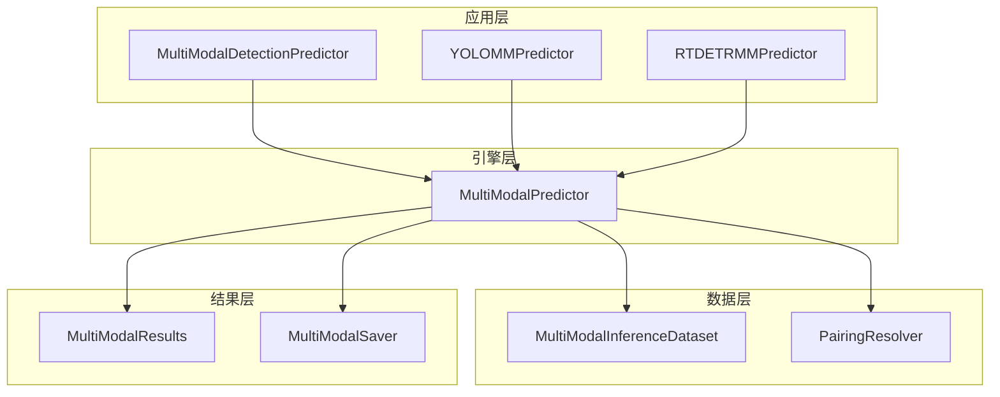
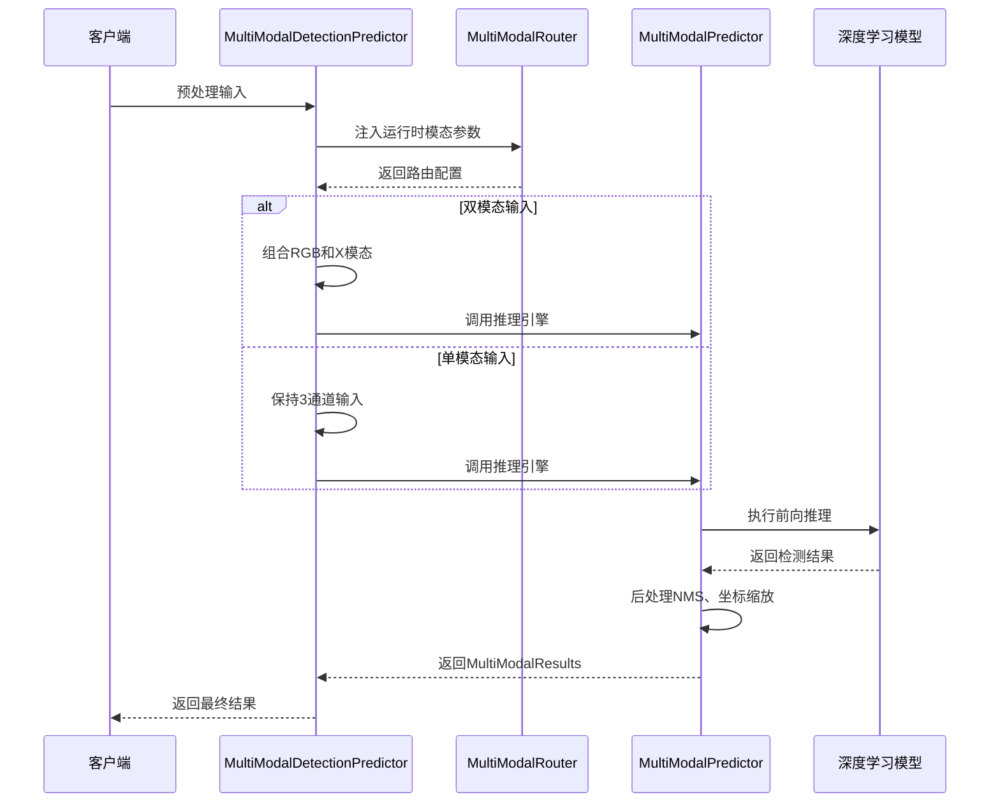
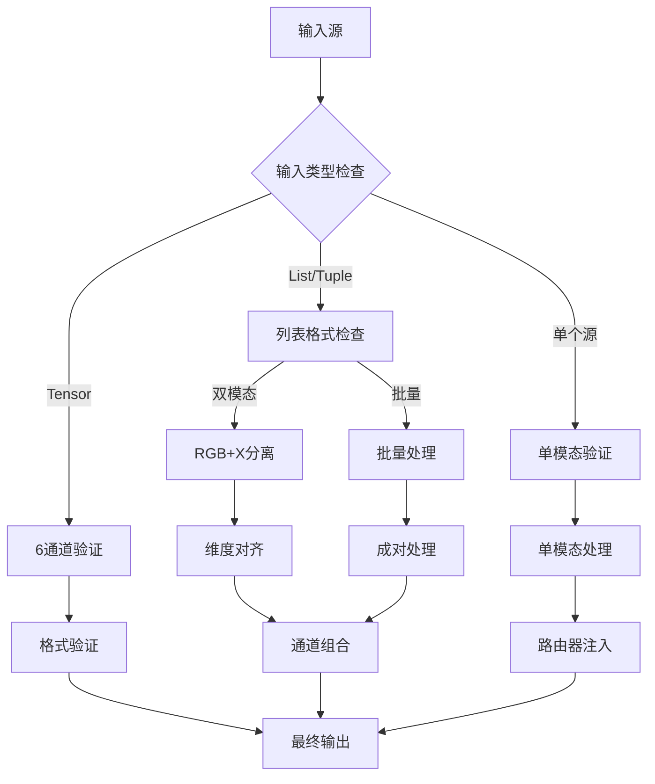
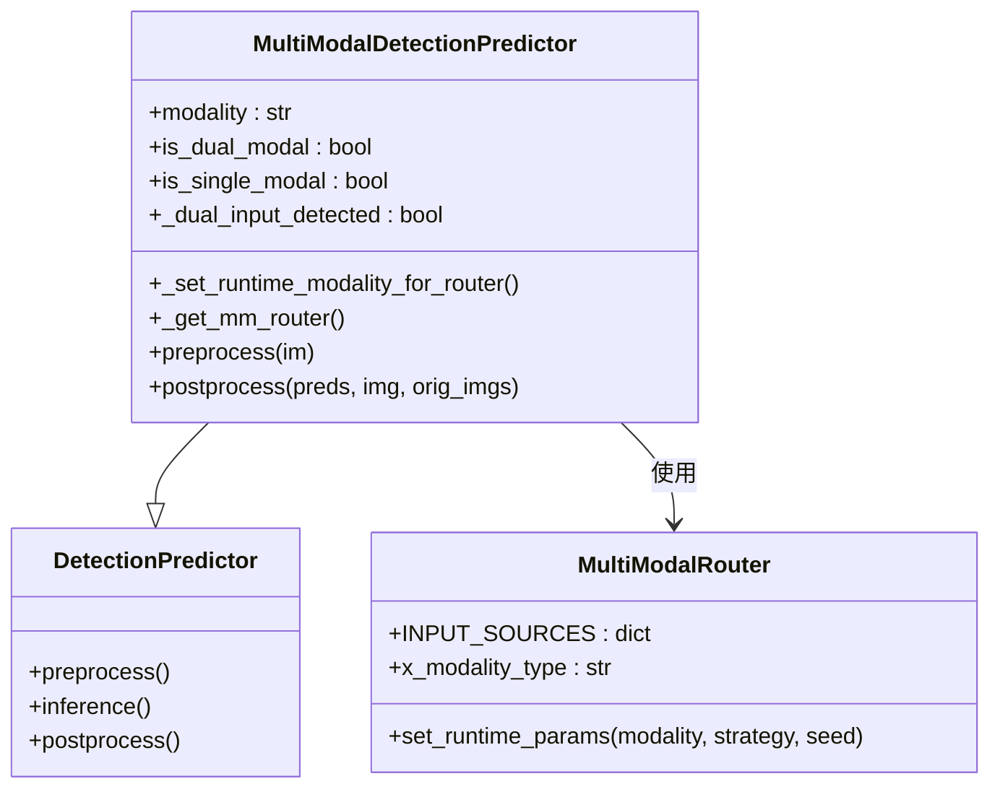
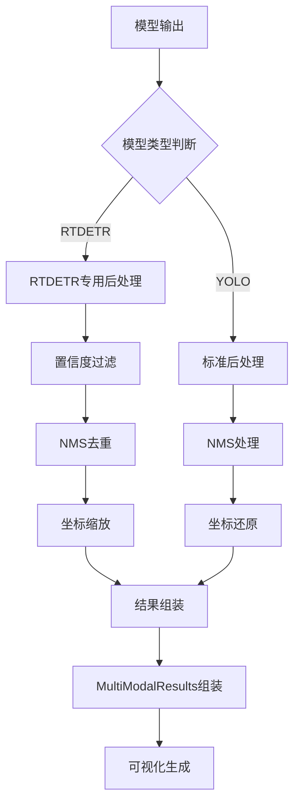
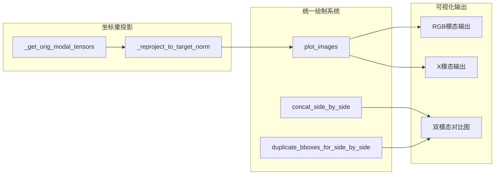
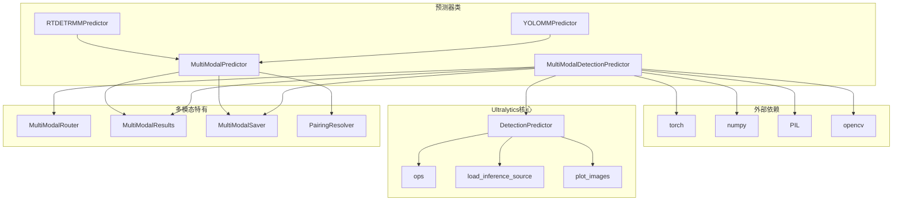

# MultiModalDetectionPredictor预测器API

<cite>
**本文档引用的文件**
- [predict.py](file://ultralytics/models/yolo/multimodal/predict.py)
- [predictor.py](file://ultralytics/engine/multimodal/predictor.py)
- [mm_predictor.py](file://ultralytics/models/yolo/multimodal/mm_predictor.py)
- [mm_predictor.py](file://ultralytics/models/rtdetrmm/mm_predictor.py)
</cite>

## 目录
1. [简介](#简介)
2. [项目结构](#项目结构)
3. [核心组件](#核心组件)
4. [架构概览](#架构概览)
5. [详细组件分析](#详细组件分析)
6. [依赖关系分析](#依赖关系分析)
7. [性能考虑](#性能考虑)
8. [故障排除指南](#故障排除指南)
9. [结论](#结论)

## 简介

MultiModalDetectionPredictor是一个专为多模态目标检测设计的预测器类，扩展了YOLO的DetectionPredictor基类。该预测器支持灵活的多模态推理模式，包括RGB+X双模态推理（最佳性能）、RGB单模态推理（带X模态填充）和X模态单模态推理（带RGB填充）。

该预测器的核心特性包括：
- 智能模态路由机制
- 动态输入解析和验证
- 多种推理模式支持
- 统一的可视化输出
- 流式推理支持

## 项目结构

多模态预测器系统由三个主要层次组成：

**图表来源**
- [predict.py:15-42](file://ultralytics/models/yolo/multimodal/predict.py#L15-L42)
- [predictor.py:16-30](file://ultralytics/engine/multimodal/predictor.py#L16-L30)

**章节来源**
- [predict.py:15-42](file://ultralytics/models/yolo/multimodal/predict.py#L15-L42)
- [predictor.py:16-30](file://ultralytics/engine/multimodal/predictor.py#L16-L30)

## 核心组件

### MultiModalDetectionPredictor类

MultiModalDetectionPredictor是多模态检测的核心预测器类，继承自YOLO的DetectionPredictor基类。

#### 主要职责
- 处理多模态输入数据（RGB+X）
- 实现智能模态路由机制
- 支持多种推理模式
- 提供统一的可视化输出

#### 关键属性
- `modality`: 模态类型（rgb或x）
- `is_dual_modal`: 是否为双模态模式
- `is_single_modal`: 是否为单模态模式
- `_dual_input_detected`: 是否检测到双模态输入
- `input_mode`: 当前输入模式

**章节来源**
- [predict.py:44-70](file://ultralytics/models/yolo/multimodal/predict.py#L44-L70)

### MultiModalPredictor引擎

MultiModalPredictor是独立的多模态推理引擎，不依赖BasePredictor。

#### 核心功能
- 从模型读取Router配置
- 构建数据集并迭代样本
- 执行前向推理、NMS和坐标缩放
- 支持真正的流式推理

#### 初始化参数
- `model`: YOLOMM/RTDETRMM模型实例
- `imgsz`: 推理输入尺寸（默认640）
- `conf`: 置信度阈值（默认0.25）
- `iou`: NMS IOU阈值（默认0.45）
- `max_det`: 最大检测框数量（默认300）
- `device`: 设备类型（默认自动检测）
- `verbose`: 是否输出详细日志（默认True）
- `debug`: 是否输出调试日志（默认False）

**章节来源**
- [predictor.py:32-98](file://ultralytics/engine/multimodal/predictor.py#L32-L98)

## 架构概览

多模态预测器采用分层架构设计，实现了清晰的关注点分离：

**图表来源**
- [predict.py:1554-1589](file://ultralytics/models/yolo/multimodal/predict.py#L1554-L1589)
- [predictor.py:99-143](file://ultralytics/engine/multimodal/predictor.py#L99-L143)

## 详细组件分析

### 输入处理机制

MultiModalDetectionPredictor实现了智能的输入解析和验证系统：

**图表来源**
- [predict.py:149-298](file://ultralytics/models/yolo/multimodal/predict.py#L149-L298)
- [predict.py:445-564](file://ultralytics/models/yolo/multimodal/predict.py#L445-L564)

#### 双模态处理流程

双模态输入处理遵循严格的验证和预处理流程：

1. **输入解析**: 验证输入格式和模态一致性
2. **图像加载**: 使用增强的load_inference_source机制
3. **维度对齐**: 确保RGB和X模态具有相同的空间维度
4. **通道组合**: 将RGB和X模态按正确顺序组合

#### 单模态处理流程

单模态输入处理采用不同的策略：

1. **路由器注入**: 为MultiModalRouter设置运行时参数
2. **自动填充禁用**: 在预处理阶段不进行自动填充
3. **路由器合成**: 依赖MultiModalRouter在前向过程中处理

**章节来源**
- [predict.py:445-564](file://ultralytics/models/yolo/multimodal/predict.py#L445-L564)
- [predict.py:877-887](file://ultralytics/models/yolo/multimodal/predict.py#L877-L887)

### 模态路由机制

MultiModalDetectionPredictor实现了灵活的模态路由系统：

**图表来源**
- [predict.py:74-137](file://ultralytics/models/yolo/multimodal/predict.py#L74-L137)
- [predict.py:15-42](file://ultralytics/models/yolo/multimodal/predict.py#L15-L42)

#### 路由器配置

路由器从模型配置中读取模态信息：

- **INPUT_SOURCES**: 定义不同模态的输入源配置
- **x_modality_type**: X模态的类型标识
- **runtime_params**: 运行时模态参数

**章节来源**
- [predict.py:74-137](file://ultralytics/models/yolo/multimodal/predict.py#L74-L137)

### 结果后处理

MultiModalDetectionPredictor提供了统一的结果后处理机制：

**图表来源**
- [predictor.py:144-244](file://ultralytics/engine/multimodal/predictor.py#L144-L244)

#### RTDETR后处理流程

RTDETR模型采用专门的后处理流程：

1. **置信度过滤**: 基于最大类别分数过滤低置信度检测
2. **NMS去重**: 使用torchvision的NMS算法去除重叠框
3. **坐标转换**: 将归一化坐标转换为像素坐标
4. **结果组装**: 创建最终的检测结果

#### YOLO后处理流程

YOLO模型遵循标准的后处理流程：

1. **NMS处理**: 应用非极大值抑制
2. **坐标还原**: 将检测框坐标还原到原始图像尺寸
3. **结果组装**: 创建MultiModalResults对象

**章节来源**
- [predictor.py:196-244](file://ultralytics/engine/multimodal/predictor.py#L196-L244)

### 可视化系统

MultiModalDetectionPredictor提供了统一的可视化输出系统：

**图表来源**
- [predict.py:1183-1343](file://ultralytics/models/yolo/multimodal/predict.py#L1183-L1343)

#### 可视化模式

系统支持三种可视化模式：

1. **双模态模式**: 生成RGB、X模态和对比图
2. **单模态消融模式**: 仅输出指定模态的结果
3. **统一绘制系统**: 使用可重用组件确保一致性

**章节来源**
- [predict.py:1154-1343](file://ultralytics/models/yolo/multimodal/predict.py#L1154-L1343)

## 依赖关系分析

多模态预测器系统的依赖关系如下：

**图表来源**
- [predict.py:1-12](file://ultralytics/models/yolo/multimodal/predict.py#L1-L12)
- [predictor.py:6-13](file://ultralytics/engine/multimodal/predictor.py#L6-L13)

**章节来源**
- [predict.py:1-12](file://ultralytics/models/yolo/multimodal/predict.py#L1-L12)
- [predictor.py:6-13](file://ultralytics/engine/multimodal/predictor.py#L6-L13)

## 性能考虑

### 推理优化

多模态预测器在性能方面采用了多项优化策略：

1. **流式推理**: 支持真正的流式处理，边处理边输出
2. **设备优化**: 自动检测和使用GPU加速
3. **内存管理**: 合理的张量管理和设备迁移
4. **批量处理**: 支持批量推理以提高吞吐量

### 内存优化

- **张量对齐**: 在预处理阶段确保张量维度一致
- **设备管理**: 自动将张量移动到合适的设备
- **数据类型**: 统一使用float32以平衡精度和性能

## 故障排除指南

### 常见问题及解决方案

#### 模态配置错误
**问题**: 单模态模式下接收双模态输入
**解决方案**: 移除modality参数或仅提供单个输入源

#### 路由器未找到
**问题**: 检测到单模态输入但未找到多模态路由器
**解决方案**: 确保使用多模态权重并在PyTorch/AutoBackend后端运行

#### 输入格式不匹配
**问题**: 输入张量维度不符合预期
**解决方案**: 确保输入为6通道张量或使用正确的输入格式

#### 设备不兼容
**问题**: 张量设备与模型不匹配
**解决方案**: 检查设备配置或让系统自动检测

**章节来源**
- [predict.py:127-131](file://ultralytics/models/yolo/multimodal/predict.py#L127-L131)
- [predict.py:884-887](file://ultralytics/models/yolo/multimodal/predict.py#L884-L887)

## 结论

MultiModalDetectionPredictor是一个功能强大且灵活的多模态目标检测预测器，它提供了：

1. **多模式支持**: 支持双模态、RGB单模态和X模态单模态推理
2. **智能路由**: 基于MultiModalRouter的动态模态处理
3. **统一接口**: 与YOLO生态系统无缝集成
4. **高效性能**: 优化的推理流程和内存管理
5. **丰富输出**: 支持多种可视化和保存选项

该预测器为多模态目标检测任务提供了完整的解决方案，既保持了与现有YOLO工具链的兼容性，又引入了先进的多模态处理能力。