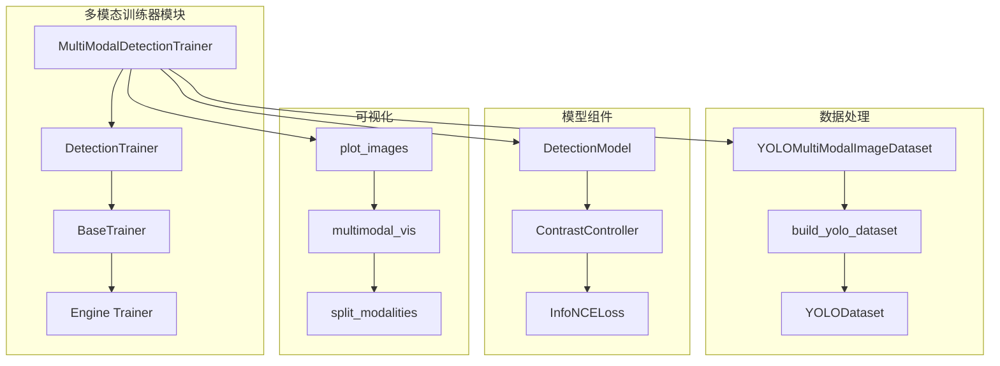
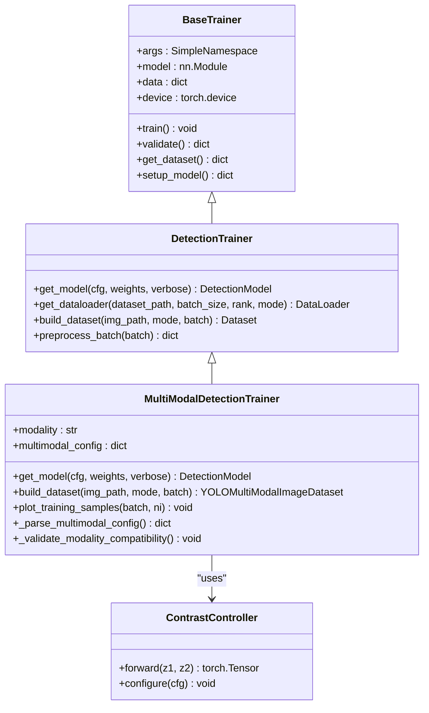
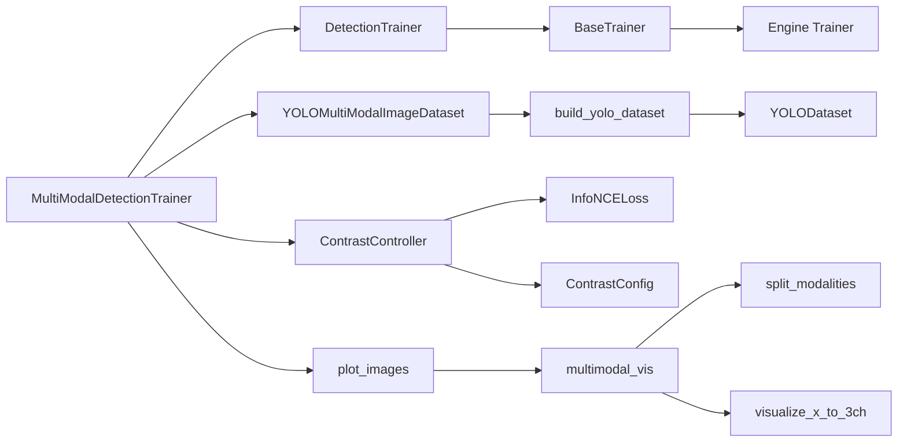

# MultiModalDetectionTrainer训练器API

<cite>
**本文档引用的文件**
- [ultralytics/models/yolo/multimodal/train.py](file://ultralytics/models/yolo/multimodal/train.py)
- [ultralytics/engine/trainer.py](file://ultralytics/engine/trainer.py)
- [ultralytics/data/build.py](file://ultralytics/data/build.py)
- [ultralytics/models/yolo/detect/train.py](file://ultralytics/models/yolo/detect/train.py)
- [ultralytics/models/yolo/detect/val.py](file://ultralytics/models/yolo/detect/val.py)
- [ultralytics/models/rtdetrmm/train.py](file://ultralytics/models/rtdetrmm/train.py)
- [ultralytics/models/yolo/multimodal/val.py](file://ultralytics/models/yolo/multimodal/val.py)
- [ultralytics/models/yolo/multimodal/predict.py](file://ultralytics/models/yolo/multimodal/predict.py)
- [ultralytics/nn/mm/contrast.py](file://ultralytics/nn/mm/contrast.py)
- [ultralytics/nn/tasks.py](file://ultralytics/nn/tasks.py)
- [ultralytics/models/yolo/model.py](file://ultralytics/models/yolo/model.py)
- [trainMM.py](file://trainMM.py)
</cite>

## 目录
1. [简介](#简介)
2. [项目结构](#项目结构)
3. [核心组件](#核心组件)
4. [架构概览](#架构概览)
5. [详细组件分析](#详细组件分析)
6. [依赖关系分析](#依赖关系分析)
7. [性能考虑](#性能考虑)
8. [故障排除指南](#故障排除指南)
9. [结论](#结论)
10. [附录](#附录)

## 简介

MultiModalDetectionTrainer是Ultralytics YOLO框架中的多模态目标检测训练器，专门设计用于处理RGB+X模态的联合训练场景。该训练器继承自DetectionTrainer，提供了完整的多模态训练、验证、推理支持，包括对比学习、模态消融训练、可视化等功能。

该训练器支持两种主要训练模式：
- **双模态训练模式**：同时使用RGB和X模态进行训练
- **单模态训练模式**：仅使用指定的模态进行训练（如RGB-only或X-only）

## 项目结构

MultiModalDetectionTrainer位于Ultralytics项目的多模态子模块中，与标准YOLO检测器共享相似的架构设计：



**图表来源**
- [ultralytics/models/yolo/multimodal/train.py:16-28](file://ultralytics/models/yolo/multimodal/train.py#L16-L28)
- [ultralytics/data/build.py:115-195](file://ultralytics/data/build.py#L115-L195)

**章节来源**
- [ultralytics/models/yolo/multimodal/train.py:16-28](file://ultralytics/models/yolo/multimodal/train.py#L16-L28)
- [ultralytics/data/build.py:115-195](file://ultralytics/data/build.py#L115-L195)

## 核心组件

MultiModalDetectionTrainer的核心功能围绕以下几个关键组件构建：

### 主要特性
- **配置驱动的多模态路由**：支持通过配置文件精确控制模态组合
- **对比学习集成**：内置InfoNCE损失函数，增强跨模态特征对齐
- **模态消融训练**：支持单模态训练模式，便于消融实验
- **统一可视化系统**：提供RGB、X模态和并排对比图的可视化输出
- **动态通道管理**：根据模态配置自动调整输入通道数

### 关键属性
- `modality`：当前训练的模态类型（None表示双模态）
- `is_dual_modal`：是否为双模态训练模式
- `is_single_modal`：是否为单模态训练模式
- `multimodal_config`：解析后的多模态配置
- `data`：数据配置字典，包含模态路径映射

**章节来源**
- [ultralytics/models/yolo/multimodal/train.py:30-60](file://ultralytics/models/yolo/multimodal/train.py#L30-L60)
- [ultralytics/models/yolo/multimodal/train.py:472-510](file://ultralytics/models/yolo/multimodal/train.py#L472-L510)

## 架构概览

MultiModalDetectionTrainer采用分层架构设计，确保了良好的模块化和可扩展性：



**图表来源**
- [ultralytics/engine/trainer.py:59-108](file://ultralytics/engine/trainer.py#L59-L108)
- [ultralytics/models/yolo/detect/train.py:1-50](file://ultralytics/models/yolo/detect/train.py#L1-L50)
- [ultralytics/models/yolo/multimodal/train.py:16-107](file://ultralytics/models/yolo/multimodal/train.py#L16-L107)

## 详细组件分析

### 构造函数 (__init__)

MultiModalDetectionTrainer的构造函数负责初始化多模态训练器的基本配置和属性。

**参数说明：**
- `cfg`：配置文件路径或配置字典，支持多种格式
- `overrides`：配置覆盖参数，允许动态修改训练参数
- `_callbacks`：回调函数列表，用于训练过程中的事件监听

**初始化流程：**
1. 设置任务类型为'detect'
2. 调用父类构造函数完成基础初始化
3. 解析模态参数（modality）
4. 初始化模态相关属性
5. 设置日志控制标志

**返回值：** MultiModalDetectionTrainer实例

**章节来源**
- [ultralytics/models/yolo/multimodal/train.py:30-60](file://ultralytics/models/yolo/multimodal/train.py#L30-L60)

### 模型获取方法 (get_model)

get_model方法负责构建和配置多模态检测模型，支持对比学习功能。

**参数说明：**
- `cfg`：模型配置文件路径或字典
- `weights`：预训练权重路径
- `verbose`：是否打印详细信息

**核心功能：**
1. 创建DetectionModel实例
2. 加载预训练权重（如有）
3. 检查并附加ContrastController（对比学习控制器）
4. 计算并打印GFLOPs统计信息
5. 返回配置好的模型

**对比学习集成：**
- 通过ContrastConfig配置对比学习参数
- 支持InfoNCE损失函数
- 可配置投影维度、温度参数等

**章节来源**
- [ultralytics/models/yolo/multimodal/train.py:69-107](file://ultralytics/models/yolo/multimodal/train.py#L69-L107)
- [ultralytics/nn/mm/contrast.py:139-150](file://ultralytics/nn/mm/contrast.py#L139-L150)

### 数据集构建方法 (build_dataset)

build_dataset方法构建多模态数据集，支持RGB+X模态的联合训练。

**参数说明：**
- `img_path`：RGB图像路径
- `mode`：数据集模式（'train'、'val'、'test'）
- `batch`：批次大小

**核心流程：**
1. 解析多模态配置
2. 验证模态兼容性
3. 获取X模态信息
4. 调用build_yolo_dataset创建数据集
5. 启用多模态图像支持

**数据集类型：**
- YOLOMultiModalImageDataset：支持RGB+X模态的图像数据集
- 支持自模态生成（enable_self_modal_generation）

**章节来源**
- [ultralytics/models/yolo/multimodal/train.py:472-510](file://ultralytics/models/yolo/multimodal/train.py#L472-L510)
- [ultralytics/data/build.py:115-195](file://ultralytics/data/build.py#L115-L195)

### 训练流程方法 (train)

MultiModalDetectionTrainer继承自DetectionTrainer，使用标准的训练流程，但针对多模态进行了优化。

**训练流程特点：**
1. **预处理优化**：移除本地通道置零操作，统一由MultiModalRouter处理
2. **模态路由**：通过mm_router.set_runtime_params设置运行时参数
3. **对比学习**：在模型前向过程中计算对比损失
4. **可视化集成**：支持多模态训练样本可视化

**章节来源**
- [ultralytics/models/rtdetrmm/train.py:260-289](file://ultralytics/models/rtdetrmm/train.py#L260-L289)

### 多模态配置解析 (_parse_multimodal_config)

_parse_multimodal_config方法解析和验证数据配置文件中的多模态设置。

**配置解析优先级：**
1. **用户指定的单模态参数**（最高优先级）
2. **data.yaml中的modality_used字段**
3. **data.yaml中的models字段**
4. **data.yaml中的modality字段**
5. **默认配置**（RGB+depth）

**配置验证：**
- 确保模态组合包含'rgb'
- 验证模态数量为2个
- 检查模态路径映射的完整性

**章节来源**
- [ultralytics/models/yolo/multimodal/train.py:109-263](file://ultralytics/models/yolo/multimodal/train.py#L109-L263)

### 模态兼容性验证 (_validate_modality_compatibility)

_validate_modality_compatibility方法验证用户指定的modality参数与数据配置的兼容性。

**验证规则：**
- 对于单模态训练，检查modality是否在可用模态列表中
- 对于'X'特殊标记，验证是否存在非RGB的X模态
- 提供详细的错误信息和警告

**章节来源**
- [ultralytics/models/yolo/multimodal/train.py:430-471](file://ultralytics/models/yolo/multimodal/train.py#L430-L471)

### 训练样本可视化 (plot_training_samples)

plot_training_samples方法提供多模态训练样本的可视化功能。

**可视化模式：**
1. **双模态训练**：输出RGB、X（伪彩可视化）与并排对比图
2. **单模态训练**：仅输出指定模态（rgb或X-only）

**可视化组件：**
- `split_modalities`：拆分RGB和X模态
- `visualize_x_to_3ch`：X模态灰度可视化
- `concat_side_by_side`：并排对比图合成
- `duplicate_bboxes_for_side_by_side`：边界框复制

**章节来源**
- [ultralytics/models/yolo/multimodal/train.py:530-633](file://ultralytics/models/yolo/multimodal/train.py#L530-L633)

## 依赖关系分析

MultiModalDetectionTrainer与多个组件存在紧密的依赖关系：



**图表来源**
- [ultralytics/models/yolo/multimodal/train.py:16-107](file://ultralytics/models/yolo/multimodal/train.py#L16-L107)
- [ultralytics/data/build.py:115-195](file://ultralytics/data/build.py#L115-L195)

**章节来源**
- [ultralytics/models/yolo/multimodal/train.py:16-107](file://ultralytics/models/yolo/multimodal/train.py#L16-L107)
- [ultralytics/data/build.py:115-195](file://ultralytics/data/build.py#L115-L195)

## 性能考虑

MultiModalDetectionTrainer在设计时充分考虑了性能优化：

### 计算效率
- **GFLOPs统计**：在模型初始化时计算架构级和路由感知的GFLOPs
- **内存管理**：使用ModelEMA和梯度缩放技术
- **混合精度训练**：支持AMP（Automatic Mixed Precision）

### 训练优化
- **对比学习开销**：仅在YAML实际注册Hook时才启用
- **动态通道配置**：根据X模态通道数动态调整输入
- **模态消融优化**：统一由路由器处理，减少预处理开销

### 可视化性能
- **批量处理**：支持批量可视化输出
- **缓存机制**：复用可视化组件结果

## 故障排除指南

### 常见问题及解决方案

**问题1：多模态配置错误**
- **症状**：抛出ValueError异常
- **原因**：data.yaml配置不正确或模态不兼容
- **解决**：检查modality_used、models、modality字段的格式和内容

**问题2：模态消融训练失败**
- **症状**：单模态训练时报错
- **原因**：未找到MultiModalRouter或路由器配置错误
- **解决**：确保使用多模态权重并在PyTorch后端运行

**问题3：可视化输出异常**
- **症状**：训练样本可视化不正确
- **原因**：X模态通道数配置错误
- **解决**：检查data.yaml中的Xch参数和模态路径

**问题4：对比学习不生效**
- **症状**：训练过程中无对比损失
- **原因**：YAML未注册Hook或配置参数错误
- **解决**：检查模型配置中的Hook设置

**章节来源**
- [ultralytics/models/yolo/multimodal/train.py:430-471](file://ultralytics/models/yolo/multimodal/train.py#L430-L471)
- [ultralytics/models/yolo/multimodal/train.py:530-633](file://ultralytics/models/yolo/multimodal/train.py#L530-L633)

## 结论

MultiModalDetectionTrainer是一个功能完整、设计精良的多模态目标检测训练器。它成功地将多模态能力集成到Ultralytics YOLO框架中，提供了：

1. **灵活的配置系统**：支持多种配置方式和优先级
2. **强大的模态管理**：支持双模态和单模态训练模式
3. **完善的可视化**：提供丰富的训练样本可视化选项
4. **高效的对比学习**：集成对比学习增强特征对齐
5. **良好的扩展性**：基于标准YOLO架构，易于扩展和定制

该训练器为多模态目标检测研究和应用提供了坚实的基础，支持从基础的RGB+深度学习到复杂的多模态融合场景。

## 附录

### 使用示例

以下是一个基本的多模态训练示例：

```python
from ultralytics import YOLOMM

# 双模态训练
model = YOLOMM('yolo11n-mm-mid.yaml')
model.train(
    data='path/to/data.yaml',
    epochs=100,
    batch=8,
    project='ResTest',
    name='Test/YOLOMM'
)

# 单模态训练（RGB-only）
model.train(
    data='path/to/data.yaml',
    epochs=100,
    batch=8,
    modality='rgb',
    project='ResTest',
    name='Test/RGB-only'
)
```

**章节来源**
- [trainMM.py:1-15](file://trainMM.py#L1-L15)

### 参数配置参考

**多模态配置字段：**
- `modality_used`：使用的模态组合（推荐）
- `models`：模态列表（向后兼容）
- `modality`：模态路径映射
- `Xch`：X模态通道数

**对比学习参数：**
- `contrast_tau`：温度参数（默认0.07）
- `contrast_dim`：投影维度（默认128）
- `contrast_lambda`：损失权重（默认0.1）
- `contrast_max_rois`：最大ROI数量（默认64）
- `contrast_share_head`：共享头（默认False）
- `contrast_stages`：偏好特征层（默认P4,P5,P3）