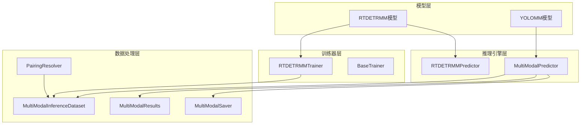
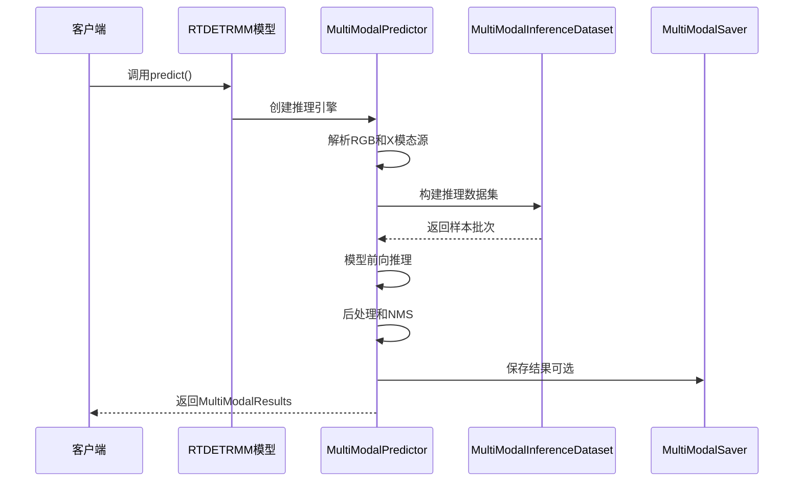
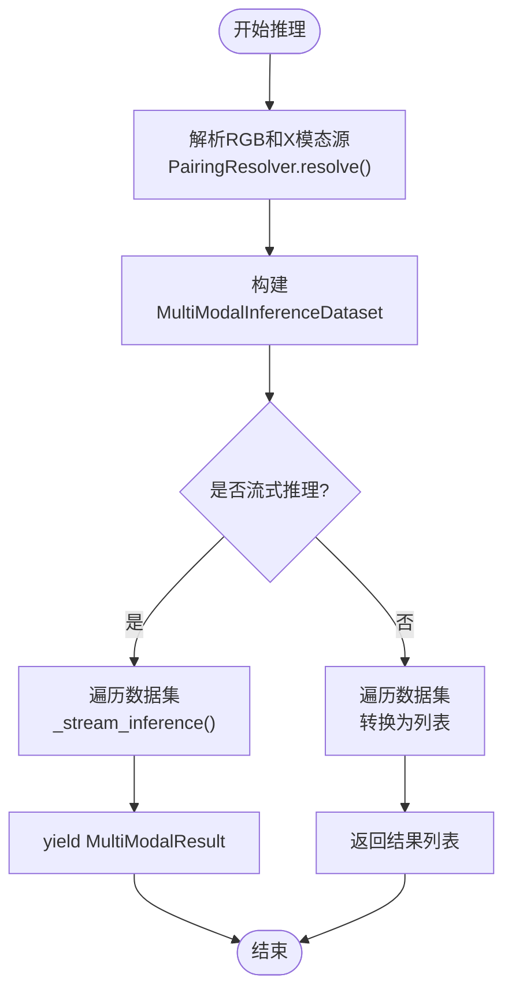
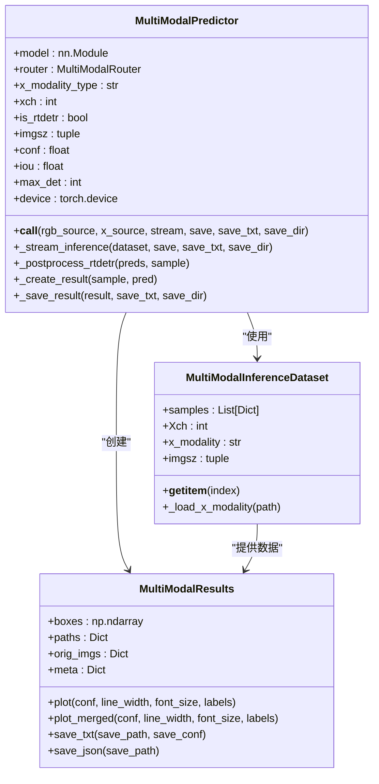
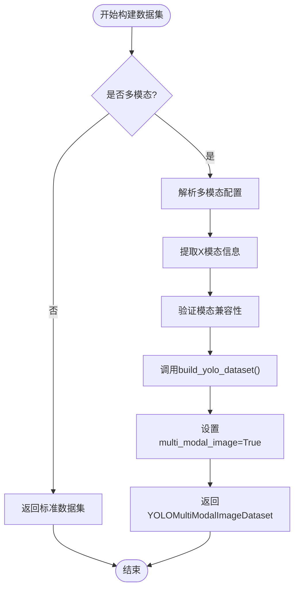
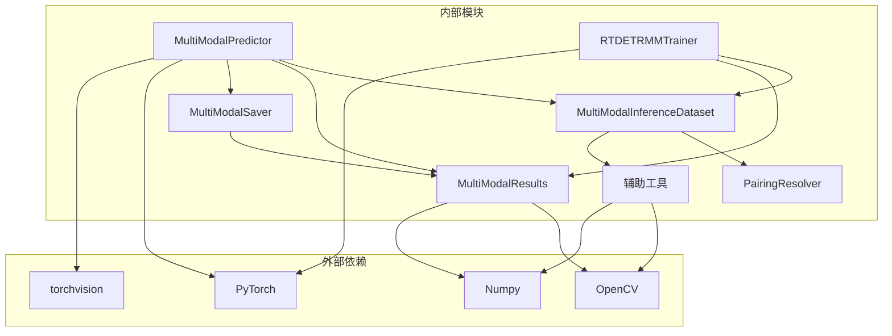

# 训练器与预测器API

<cite>
**本文档引用的文件**
- [predictor.py](file://ultralytics/engine/multimodal/predictor.py)
- [saver.py](file://ultralytics/engine/multimodal/saver.py)
- [mm_predictor.py](file://ultralytics/models/rtdetrmm/mm_predictor.py)
- [inference_dataset.py](file://ultralytics/data/multimodal/inference_dataset.py)
- [utils.py](file://ultralytics/data/multimodal/utils.py)
- [results.py](file://ultralytics/engine/multimodal/results.py)
- [pairing.py](file://ultralytics/data/multimodal/pairing.py)
- [train.py](file://ultralytics/models/rtdetrmm/train.py)
- [model.py](file://ultralytics/models/rtdetrmm/model.py)
- [trainer.py](file://ultralytics/engine/trainer.py)
- [predictMM.py](file://predictMM.py)
- [trainMM.py](file://trainMM.py)
</cite>

## 目录
1. [简介](#简介)
2. [项目结构](#项目结构)
3. [核心组件](#核心组件)
4. [架构概览](#架构概览)
5. [详细组件分析](#详细组件分析)
6. [依赖关系分析](#依赖关系分析)
7. [性能考虑](#性能考虑)
8. [故障排除指南](#故障排除指南)
9. [结论](#结论)
10. [附录](#附录)

## 简介
本文档详细介绍了多模态训练器和预测器类的API，重点关注MultiModalDetectionTrainer和MultiModalDetectionPredictor类的完整接口。该系统支持RGB和X模态的多模态目标检测，提供了完整的训练流程管理和推理预测功能。

## 项目结构
该项目采用模块化架构，主要包含以下核心模块：



**图表来源**
- [model.py:25-57](file://ultralytics/models/rtdetrmm/model.py#L25-L57)
- [train.py:24-60](file://ultralytics/models/rtdetrmm/train.py#L24-L60)
- [predictor.py:16-30](file://ultralytics/engine/multimodal/predictor.py#L16-L30)

**章节来源**
- [model.py:25-57](file://ultralytics/models/rtdetrmm/model.py#L25-L57)
- [train.py:24-60](file://ultralytics/models/rtdetrmm/train.py#L24-L60)
- [predictor.py:16-30](file://ultralytics/engine/multimodal/predictor.py#L16-L30)

## 核心组件
本系统的核心组件包括：

### MultiModalPredictor类
- **职责**: 多模态推理引擎核心，支持RGB和X模态的联合推理
- **特性**: 真正的流式推理、支持单模态和双模态推理、自动模型类型检测
- **关键方法**: `__call__()`, `_stream_inference()`, `_postprocess_rtdetr()`

### MultiModalSaver类
- **职责**: 多模态推理结果保存器
- **特性**: 支持多种输出格式、自动文件命名、批处理保存
- **关键方法**: `save()`, 文件命名规则

### RTDETRMMTrainer类
- **职责**: RT-DETR多模态训练器
- **特性**: 支持单模态和双模态训练、智能模态填充、严格的多模态验证
- **关键方法**: `build_dataset()`, `get_model()`, `preprocess_batch()`

**章节来源**
- [predictor.py:16-98](file://ultralytics/engine/multimodal/predictor.py#L16-L98)
- [saver.py:12-53](file://ultralytics/engine/multimodal/saver.py#L12-L53)
- [train.py:24-105](file://ultralytics/models/rtdetrmm/train.py#L24-L105)

## 架构概览
系统采用分层架构设计，确保各组件职责清晰分离：



**图表来源**
- [mm_predictor.py:71-111](file://ultralytics/models/rtdetrmm/mm_predictor.py#L71-L111)
- [predictor.py:99-142](file://ultralytics/engine/multimodal/predictor.py#L99-L142)

## 详细组件分析

### MultiModalPredictor类详细分析

#### 类定义和初始化
MultiModalPredictor是多模态推理的核心引擎，负责处理RGB和X模态的联合推理任务。

**关键参数配置**:
- `model`: YOLOMM/RTDETRMM模型实例
- `imgsz`: 推理输入尺寸，默认640
- `conf`: 置信度阈值，默认0.25
- `iou`: NMS IOU阈值，默认0.45
- `max_det`: 最大检测框数量，默认300
- `device`: 设备配置
- `verbose`: 详细日志输出
- `debug`: 调试模式

#### 核心方法详解

##### `__call__()` - 主要推理入口


**图表来源**
- [predictor.py:99-142](file://ultralytics/engine/multimodal/predictor.py#L99-L142)

##### `_stream_inference()` - 流式推理实现
该方法实现了真正的流式推理，支持边迭代边产出结果：

**处理流程**:
1. **数据加载**: 从MultiModalInferenceDataset获取样本
2. **模型推理**: 在指定设备上执行前向传播
3. **后处理**: 根据模型类型选择相应的后处理路径
4. **结果组装**: 创建MultiModalResults对象
5. **保存输出**: 可选的文件保存操作

##### `_postprocess_rtdetr()` - RTDETR专用后处理
针对RTDETR模型的特殊后处理逻辑：

**处理步骤**:
1. **坐标解码**: 将归一化的cxcywh坐标转换为像素坐标
2. **置信度过滤**: 应用置信度阈值
3. **NMS去重**: 使用torchvision的NMS算法
4. **坐标还原**: 将检测框缩放到原始图像尺寸
5. **结果格式化**: 组装为[N, 6]格式的最终结果

**章节来源**
- [predictor.py:99-243](file://ultralytics/engine/multimodal/predictor.py#L99-L243)
- [predictor.py:323-434](file://ultralytics/engine/multimodal/predictor.py#L323-L434)

#### MultiModalPredictor类图


**图表来源**
- [predictor.py:16-98](file://ultralytics/engine/multimodal/predictor.py#L16-L98)
- [inference_dataset.py:16-90](file://ultralytics/data/multimodal/inference_dataset.py#L16-L90)
- [results.py:14-60](file://ultralytics/engine/multimodal/results.py#L14-L60)

### MultiModalSaver类详细分析

#### 功能特性
MultiModalSaver负责将推理结果保存为多种格式，支持灵活的输出配置。

**支持的输出格式**:
- **可视化图像**: RGB、X模态、双模态并排
- **文本标签**: YOLO格式的txt文件
- **JSON结果**: 结构化的检测结果

#### 文件命名规则
基于RGB图像的ID生成标准化的文件命名：

| 文件类型 | 命名规则 | 示例 |
|---------|----------|------|
| RGB可视化 | `{id}_rgb.jpg` | `00001_rgb.jpg` |
| X模态可视化 | `{id}_{x_modality}.jpg` | `00001_thermal.jpg` |
| 双模态合并 | `{id}_multimodal.jpg` | `00001_multimodal.jpg` |
| 文本标签 | `labels/{id}.txt` | `labels/00001.txt` |
| JSON结果 | `json/{id}.json` | `json/00001.json` |

**章节来源**
- [saver.py:12-112](file://ultralytics/engine/multimodal/saver.py#L12-L112)

### RTDETRMMTrainer类详细分析

#### 训练配置和数据集构建
RTDETRMMTrainer扩展了DetectionTrainer，专门处理多模态RT-DETR模型的训练。

**关键配置参数**:
- `modality`: 单模态训练模式（None为双模态）
- `is_multimodal`: 多模态训练标志
- `multimodal_config`: 多模态配置信息

#### `build_dataset()` - 数据集构建


**图表来源**
- [train.py:116-170](file://ultralytics/models/rtdetrmm/train.py#L116-L170)

#### `get_model()` - 模型构建
根据训练模式动态调整模型的输入通道数：

**双模态训练**: 输入通道 = 3 + X_channels
**单模态训练**: 输入通道 = 3

**章节来源**
- [train.py:116-254](file://ultralytics/models/rtdetrmm/train.py#L116-L254)

### 数据处理组件

#### PairingResolver - 配对解析器
负责将显式的RGB和X模态输入解析为配对样本规格。

**支持的输入模式**:
- **双模态**: 同时提供RGB和X模态
- **单RGB模态**: 仅提供RGB，X模态使用零填充
- **单X模态**: 仅提供X模态，RGB使用零填充

#### MultiModalInferenceDataset - 推理数据集
专门为多模态推理设计的数据集类，支持灵活的模态组合。

**预处理流程**:
1. **RGB模态处理**: 加载、LetterBox、Tensor转换
2. **X模态处理**: 加载、空间对齐、通道校验、LetterBox
3. **模态拼接**: 将RGB和X模态按通道维度拼接
4. **结果封装**: 返回标准化的样本字典

**章节来源**
- [pairing.py:11-125](file://ultralytics/data/multimodal/pairing.py#L11-L125)
- [inference_dataset.py:16-183](file://ultralytics/data/multimodal/inference_dataset.py#L16-L183)

## 依赖关系分析



**图表来源**
- [predictor.py:6-13](file://ultralytics/engine/multimodal/predictor.py#L6-L13)
- [saver.py:6-9](file://ultralytics/engine/multimodal/saver.py#L6-L9)
- [inference_dataset.py:6-13](file://ultralytics/data/multimodal/inference_dataset.py#L6-L13)

**章节来源**
- [predictor.py:6-13](file://ultralytics/engine/multimodal/predictor.py#L6-L13)
- [saver.py:6-9](file://ultralytics/engine/multimodal/saver.py#L6-L9)
- [inference_dataset.py:6-13](file://ultralytics/data/multimodal/inference_dataset.py#L6-L13)

## 性能考虑
系统在设计时充分考虑了性能优化：

### 推理性能优化
- **流式处理**: 支持真正的流式推理，减少内存占用
- **设备优化**: 自动检测和使用GPU加速
- **批处理**: 支持批量推理提高吞吐量
- **内存管理**: 及时释放中间变量，防止内存泄漏

### 训练性能优化
- **混合精度**: 支持AMP自动混合精度训练
- **梯度累积**: 通过accumulate参数优化内存使用
- **学习率调度**: 支持余弦退火和线性退火
- **早停机制**: 防止过拟合，节省训练时间

## 故障排除指南

### 常见问题和解决方案

#### 模型类型检测失败
**问题**: MultiModalPredictor无法正确识别模型类型
**解决方案**: 确保使用YOLOMM或RTDETRMM模型实例

#### 模态通道数不匹配
**问题**: X模态通道数与模型配置不匹配
**解决方案**: 检查X模态图像的通道数，确保符合模型要求

#### 文件路径错误
**问题**: 无法找到RGB或X模态文件
**解决方案**: 验证文件路径是否存在，检查文件权限

#### 推理结果为空
**问题**: 检测结果为空列表
**解决方案**: 调整置信度阈值或检查输入图像质量

**章节来源**
- [predictor.py:66-68](file://ultralytics/engine/multimodal/predictor.py#L66-L68)
- [inference_dataset.py:146-148](file://ultralytics/data/multimodal/inference_dataset.py#L146-L148)

## 结论
本系统提供了完整的多模态目标检测解决方案，包括训练和推理两个方面。MultiModalPredictor类提供了灵活的推理能力，支持单模态和双模态场景；RTDETRMMTrainer类则专注于多模态训练，支持智能模态填充和严格的多模态验证。系统采用模块化设计，具有良好的扩展性和维护性。

## 附录

### API使用示例

#### 训练示例
```python
from ultralytics import YOLOMM

model = YOLOMM('yolo11n-mm-mid.yaml')
model.train(
    data='/path/to/data.yaml',
    epochs=100,
    batch=8,
    project='ResTest',
    name='Test/YOLOMM'
)
```

#### 推理示例
```python
from ultralytics import YOLOMM

model = YOLOMM('/path/to/weights.pt')

# 双模态推理
results = model.predict(
    rgb_source='/path/to/rgb.png',
    x_source='/path/to/thermal.png',
    save=True,
    debug=True
)
```

**章节来源**
- [trainMM.py:1-15](file://trainMM.py#L1-L15)
- [predictMM.py:1-40](file://predictMM.py#L1-L40)

### 配置参数说明

#### MultiModalPredictor参数
- `imgsz`: 推理输入尺寸，支持整数或元组
- `conf`: 置信度阈值，范围[0,1]
- `iou`: NMS IOU阈值，范围[0,1]
- `max_det`: 最大检测框数量
- `device`: 设备字符串，如'cuda'或'cpu'

#### RTDETRMMTrainer参数
- `modality`: 单模态训练模式，None为双模态
- `enable_self_modal_generation`: 自动模态生成开关
- `ablation_strategy`: 模态消融策略