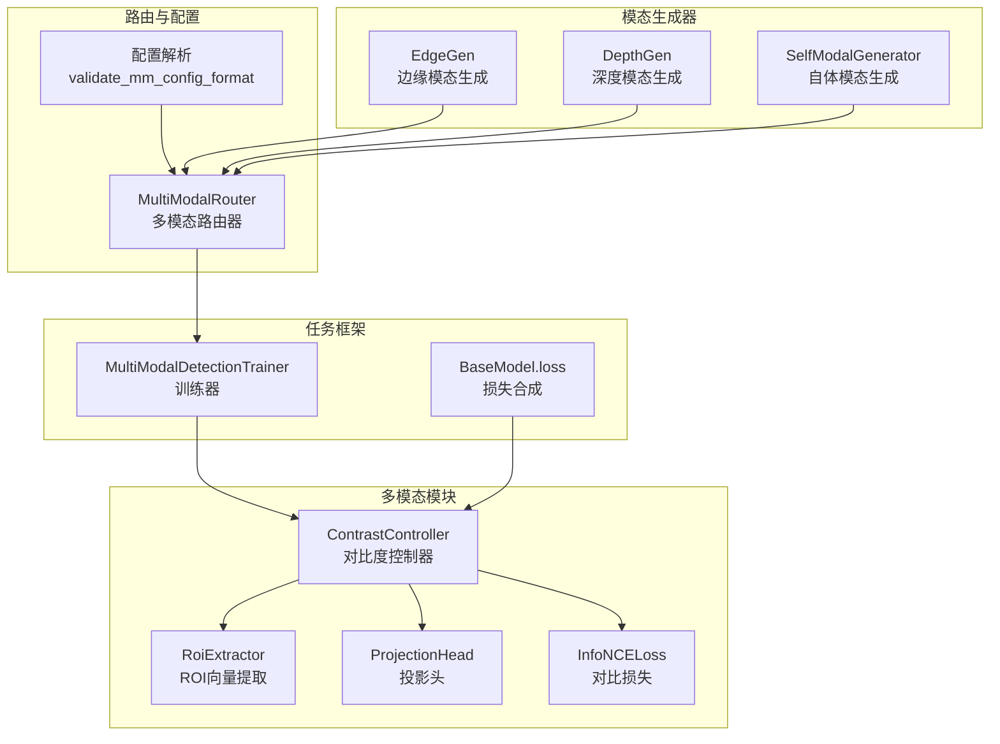
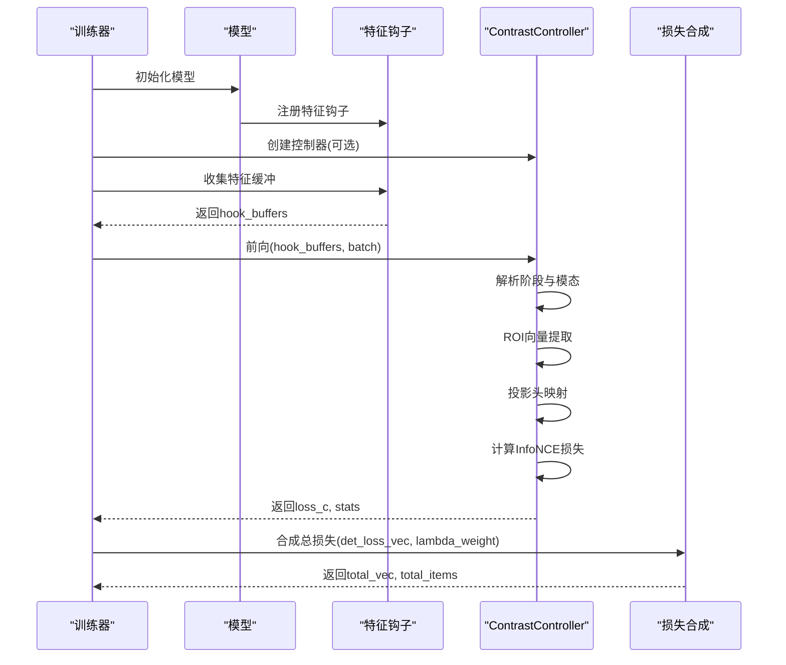
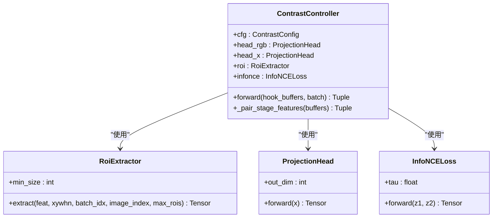
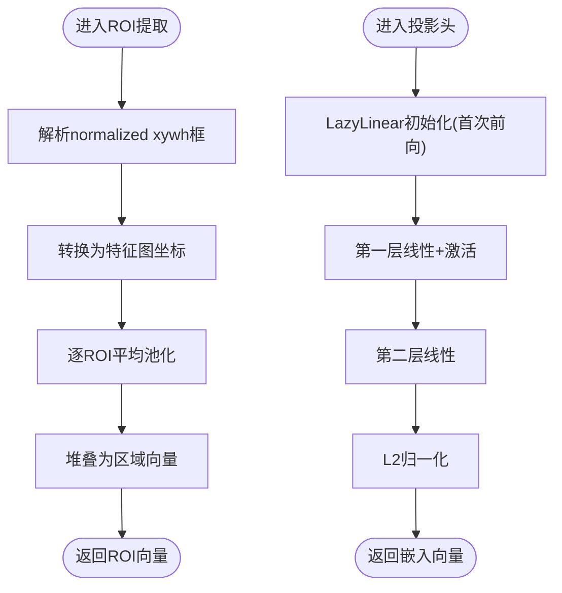
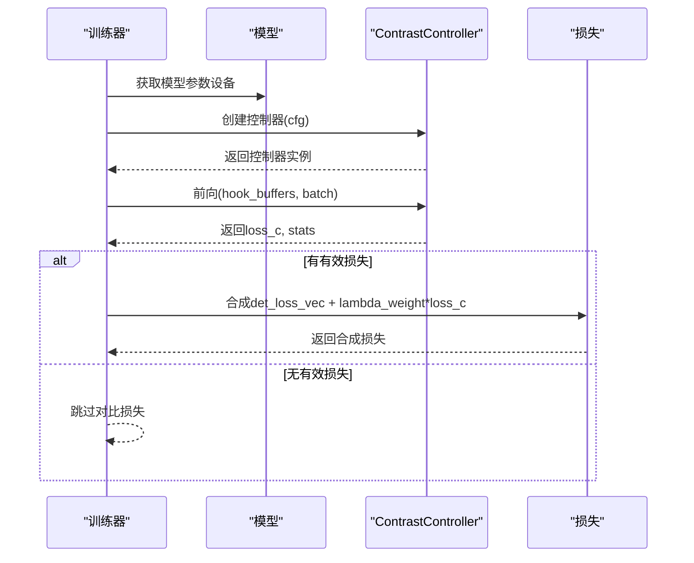
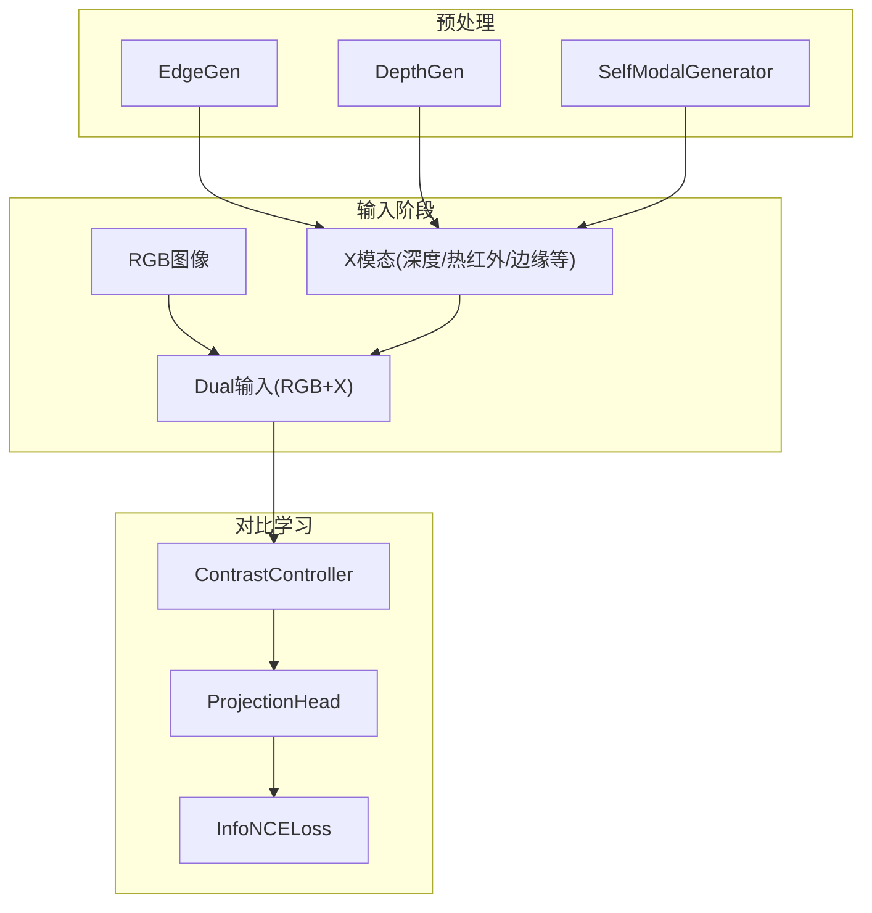
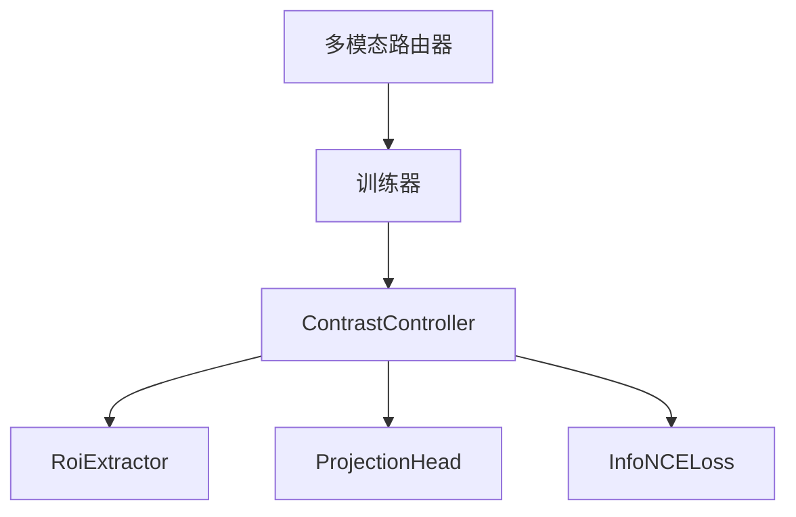

# ContrastController对比度控制器API

<cite>
**本文档引用的文件**
- [contrast.py](file://ultralytics/nn/mm/contrast.py)
- [tasks.py](file://ultralytics/nn/tasks.py)
- [train.py](file://ultralytics/models/yolo/multimodal/train.py)
- [__init__.py](file://ultralytics/nn/mm/__init__.py)
- [utils.py](file://ultralytics/nn/mm/utils.py)
- [edge.py](file://ultralytics/nn/mm/generators/edge.py)
- [depth_anything_v2.py](file://ultralytics/nn/mm/generators/depth_anything_v2.py)
- [self_modal_generator.py](file://ultralytics/models/yolo/multimodal/self_modal_generator.py)
- [multimodal_augment.py](file://ultralytics/data/multimodal_augment.py)
</cite>

## 目录
1. [简介](#简介)
2. [项目结构](#项目结构)
3. [核心组件](#核心组件)
4. [架构总览](#架构总览)
5. [详细组件分析](#详细组件分析)
6. [依赖关系分析](#依赖关系分析)
7. [性能考虑](#性能考虑)
8. [故障排查指南](#故障排查指南)
9. [结论](#结论)
10. [附录](#附录)

## 简介
ContrastController对比度控制器是多模态检测系统中用于RGB与X模态特征对齐与对比学习的关键组件。它通过钩取不同特征阶段（如P3/P4/P5）的RGB与X特征，基于ROI区域向量提取与投影头映射，计算InfoNCE对比损失，从而促进跨模态特征空间的一致性与判别性。该控制器不直接执行像素级对比度调节，而是通过对比学习机制间接实现模态间的对比度协调与一致性约束。

## 项目结构
ContrastController位于多模态模块中，与任务框架、路由系统、生成器等协同工作：
- 对比学习核心：ContrastController、RoiExtractor、ProjectionHead、InfoNCELoss
- 任务集成：在训练任务中按需挂载控制器并参与损失合成
- 路由与配置：多模态路由器负责RGB/X的输入拼接与通道适配
- 模态生成器：提供Edge/Depth等自体模态生成，间接影响对比学习输入质量

**图表来源**
- [contrast.py:149-289](file://ultralytics/nn/mm/contrast.py#L149-L289)
- [tasks.py:1134-1167](file://ultralytics/nn/tasks.py#L1134-L1167)
- [train.py:80-107](file://ultralytics/models/yolo/multimodal/train.py#L80-L107)
- [__init__.py:29-71](file://ultralytics/nn/mm/__init__.py#L29-L71)
- [utils.py:8-93](file://ultralytics/nn/mm/utils.py#L8-L93)
- [edge.py:190-506](file://ultralytics/nn/mm/generators/edge.py#L190-L506)
- [depth_anything_v2.py:72-520](file://ultralytics/nn/mm/generators/depth_anything_v2.py#L72-L520)
- [self_modal_generator.py:70-198](file://ultralytics/models/yolo/multimodal/self_modal_generator.py#L70-L198)

**章节来源**
- [contrast.py:1-290](file://ultralytics/nn/mm/contrast.py#L1-L290)
- [tasks.py:1130-1167](file://ultralytics/nn/tasks.py#L1130-L1167)
- [train.py:80-107](file://ultralytics/models/yolo/multimodal/train.py#L80-L107)
- [__init__.py:1-78](file://ultralytics/nn/mm/__init__.py#L1-L78)
- [utils.py:1-93](file://ultralytics/nn/mm/utils.py#L1-L93)

## 核心组件
- ContrastController：主控制器，负责从钩取缓冲区中配对RGB与X模态特征，提取ROI向量，经投影头映射至同一嵌入空间，计算InfoNCE损失并返回统计信息。
- RoiExtractor：基于GT框在特征图上进行平均池化，提取每个目标的区域向量。
- ProjectionHead：两层MLP投影头，输出L2归一化的嵌入，数值稳定采用FP32。
- InfoNCELoss：对称NT-Xent损失，使用温度系数tau，计算RGB与X模态嵌入之间的对比损失。

**章节来源**
- [contrast.py:149-289](file://ultralytics/nn/mm/contrast.py#L149-L289)

## 架构总览
ContrastController在训练流程中的位置与交互如下：

**图表来源**
- [tasks.py:1134-1167](file://ultralytics/nn/tasks.py#L1134-L1167)
- [contrast.py:189-289](file://ultralytics/nn/mm/contrast.py#L189-L289)

**章节来源**
- [tasks.py:1134-1167](file://ultralytics/nn/tasks.py#L1134-L1167)
- [contrast.py:149-289](file://ultralytics/nn/mm/contrast.py#L149-L289)

## 详细组件分析

### ContrastController类
- 主要职责
  - 从钩取缓冲区中按阶段与模态配对RGB与X特征
  - 提取ROI区域向量，拼接为跨模态样本对
  - 通过投影头映射到同一嵌入空间
  - 计算InfoNCE对比损失并返回统计信息
- 关键接口
  - forward(hook_buffers, batch)：主入口，返回对比损失与统计
  - _pair_stage_features(buffers)：解析阶段与模态，选择首选或可用的特征对
- 参数与配置
  - ContrastConfig：包含温度系数、投影维度、权重、最大ROI数量、是否共享投影头、首选特征阶段等
- 实时控制机制
  - 在前向过程中进行数值稳定性控制（FP32投影与损失计算）
  - 对非有限值进行警告与保护
  - 支持按阶段选择与自动降级（无有效正对时返回None）

**图表来源**
- [contrast.py:149-289](file://ultralytics/nn/mm/contrast.py#L149-L289)

**章节来源**
- [contrast.py:139-289](file://ultralytics/nn/mm/contrast.py#L139-L289)

### ROI区域提取与投影
- ROI提取
  - 将normalized xywh的GT框转换为特征图坐标
  - 对每个图像的ROI进行平均池化，得到区域向量
  - 支持最大ROI数量限制与空样本处理
- 投影头
  - 两层MLP，第一层LazyLinear确保首次前向时在正确设备/精度下初始化
  - 输出L2归一化嵌入，数值稳定采用FP32
- InfoNCE损失
  - 对称NT-Xent，使用温度系数tau
  - 输入为L2归一化嵌入，形状相同

**图表来源**
- [contrast.py:45-115](file://ultralytics/nn/mm/contrast.py#L45-L115)

**章节来源**
- [contrast.py:45-137](file://ultralytics/nn/mm/contrast.py#L45-L137)

### 训练集成与参数配置
- 训练器挂载
  - 在训练器初始化时根据配置创建ContrastController
  - 按模型设备放置控制器，避免设备不匹配
- 损失合成
  - 若控制器返回None（无有效正对），跳过对比损失
  - 否则按lambda权重合成对比损失与检测损失
- 配置项
  - contrast_tau：InfoNCE温度系数
  - contrast_dim：投影维度
  - contrast_lambda：对比损失权重
  - contrast_max_rois：每图像最大ROI数量
  - contrast_share_head：是否共享投影头
  - contrast_stages：首选特征阶段列表

**图表来源**
- [tasks.py:1134-1167](file://ultralytics/nn/tasks.py#L1134-L1167)
- [train.py:80-107](file://ultralytics/models/yolo/multimodal/train.py#L80-L107)

**章节来源**
- [tasks.py:1134-1167](file://ultralytics/nn/tasks.py#L1134-L1167)
- [train.py:80-107](file://ultralytics/models/yolo/multimodal/train.py#L80-L107)

### 多模态输入与对比度协调
- 输入拼接
  - 路由器将RGB与X模态按标准顺序拼接为Dual输入
  - 支持运行时消融（单模态验证时将非选定模态通道置零）
- 模态生成器
  - EdgeGen：边缘强度生成，支持单/三通道输出
  - DepthGen：深度模态生成，支持多种后处理与可视化
  - SelfModalGenerator：自体模态（边缘/纹理/梯度）生成，内置对比度增强与归一化
- 对比度协调策略
  - 通过对比学习强制RGB与X在嵌入空间对齐
  - ROI级别对齐减少像素级对比度差异带来的干扰
  - 模态生成器提供的预处理（如边缘增强、深度归一化）间接提升对比学习效果

**图表来源**
- [edge.py:190-506](file://ultralytics/nn/mm/generators/edge.py#L190-L506)
- [depth_anything_v2.py:72-520](file://ultralytics/nn/mm/generators/depth_anything_v2.py#L72-L520)
- [self_modal_generator.py:70-198](file://ultralytics/models/yolo/multimodal/self_modal_generator.py#L70-L198)
- [contrast.py:149-289](file://ultralytics/nn/mm/contrast.py#L149-L289)

**章节来源**
- [edge.py:190-506](file://ultralytics/nn/mm/generators/edge.py#L190-L506)
- [depth_anything_v2.py:72-520](file://ultralytics/nn/mm/generators/depth_anything_v2.py#L72-L520)
- [self_modal_generator.py:70-198](file://ultralytics/models/yolo/multimodal/self_modal_generator.py#L70-L198)
- [contrast.py:149-289](file://ultralytics/nn/mm/contrast.py#L149-L289)

## 依赖关系分析
- 组件耦合
  - ContrastController依赖RoiExtractor、ProjectionHead、InfoNCELoss
  - 训练器在loss阶段集成对比损失，与检测损失共同优化
  - 路由器负责输入拼接与通道适配，间接影响对比学习输入质量
- 外部依赖
  - PyTorch张量运算与函数库
  - 日志记录器用于调试与警告
- 潜在循环依赖
  - 无直接循环依赖，各模块职责清晰

**图表来源**
- [contrast.py:149-289](file://ultralytics/nn/mm/contrast.py#L149-L289)
- [tasks.py:1134-1167](file://ultralytics/nn/tasks.py#L1134-L1167)
- [__init__.py:29-71](file://ultralytics/nn/mm/__init__.py#L29-L71)

**章节来源**
- [contrast.py:149-289](file://ultralytics/nn/mm/contrast.py#L149-L289)
- [tasks.py:1134-1167](file://ultralytics/nn/tasks.py#L1134-L1167)
- [__init__.py:29-71](file://ultralytics/nn/mm/__init__.py#L29-L71)

## 性能考虑
- 数值稳定性
  - 投影头与InfoNCE损失在FP32下计算，避免AMP导致的数值不稳定
- 设备与内存
  - 控制器按模型参数所在设备创建，避免CPU/CUDA不匹配
  - ROI提取限制最大ROI数量，控制内存占用
- 计算复杂度
  - ROI池化与投影头计算随ROI数量线性增长
  - InfoNCE损失计算复杂度与样本对数量平方相关
- 实时性
  - 仅在训练阶段启用，推理阶段通常关闭
  - 通过钩取缓冲与惰性初始化减少推理开销

[本节为通用性能讨论，不直接分析具体文件]

## 故障排查指南
- 非有限值警告
  - 特征、ROI向量、嵌入或损失出现NaN/Inf时触发警告
  - 建议检查输入数据质量、模态通道数与预处理
- 无有效正对
  - 当钩取缓冲区中无RGB与X配对或形状不匹配时返回None
  - 检查特征钩子注册、阶段选择与批索引
- 设备不匹配
  - 控制器创建后需确保与模型参数在同一设备
  - 若模型无参数，回退到图像设备

**章节来源**
- [contrast.py:195-208](file://ultralytics/nn/mm/contrast.py#L195-L208)
- [contrast.py:240-253](file://ultralytics/nn/mm/contrast.py#L240-L253)
- [contrast.py:277-281](file://ultralytics/nn/mm/contrast.py#L277-L281)
- [tasks.py:1137-1143](file://ultralytics/nn/tasks.py#L1137-L1143)

## 结论
ContrastController通过对比学习在RGB与X模态之间建立一致的特征表示，间接实现模态间的对比度协调。其设计强调数值稳定性、设备一致性与可配置性，适用于多模态检测任务的训练阶段。配合路由系统与模态生成器，可在不同场景下灵活调整输入与预处理策略，以获得更稳健的对比学习效果。

[本节为总结性内容，不直接分析具体文件]

## 附录

### API参考摘要
- ContrastController.forward(hook_buffers, batch)
  - 输入：钩取特征字典、批次字典（含img、batch_idx、bboxes）
  - 输出：对比损失（可能为None）、统计字典（包含阶段、样本对数量、平均相似度）
- ContrastConfig
  - 参数：tau、proj_dim、lambda_weight、max_rois_per_image、share_head、preferred_stages
- RoiExtractor.extract(feat, xywhn, batch_idx, image_index, max_rois)
  - 输入：特征张量、normalized框、批索引、图像索引、最大ROI数
  - 输出：ROI区域向量
- ProjectionHead.forward(x)
  - 输入：向量张量
  - 输出：L2归一化嵌入
- InfoNCELoss.forward(z1, z2)
  - 输入：两个模态的L2归一化嵌入
  - 输出：对比损失标量

**章节来源**
- [contrast.py:189-289](file://ultralytics/nn/mm/contrast.py#L189-L289)
- [contrast.py:139-147](file://ultralytics/nn/mm/contrast.py#L139-L147)
- [contrast.py:80-97](file://ultralytics/nn/mm/contrast.py#L80-L97)
- [contrast.py:109-115](file://ultralytics/nn/mm/contrast.py#L109-L115)
- [contrast.py:123-136](file://ultralytics/nn/mm/contrast.py#L123-L136)

### 场景与示例
- 双模态训练
  - 使用RGB与深度模态，通过DepthGen生成深度模态，ContrastController在P4/P5/P3阶段提取ROI并计算对比损失
- 边缘增强场景
  - 使用EdgeGen生成边缘模态，SelfModalGenerator提供纹理/梯度增强，提升边缘对比度
- 单模态验证
  - 通过路由器将非选定模态通道置零，验证单一模态性能

**章节来源**
- [depth_anything_v2.py:72-520](file://ultralytics/nn/mm/generators/depth_anything_v2.py#L72-L520)
- [edge.py:190-506](file://ultralytics/nn/mm/generators/edge.py#L190-L506)
- [self_modal_generator.py:70-198](file://ultralytics/models/yolo/multimodal/self_modal_generator.py#L70-L198)
- [val.py:593-613](file://ultralytics/models/yolo/multimodal/val.py#L593-L613)

### 参数范围与优化建议
- 温度系数tau：典型范围[0.05, 0.15]，过大导致分布平滑，过小导致梯度消失
- 投影维度proj_dim：建议64-512，兼顾表达力与计算效率
- 对比损失权重lambda_weight：建议0.01-0.5，结合检测损失权重综合调优
- 最大ROI数量max_rois_per_image：建议32-128，平衡精度与速度
- 首选阶段preferred_stages：优先选择P4/P5/P3，依据骨干网络结构调整

**章节来源**
- [contrast.py:139-147](file://ultralytics/nn/mm/contrast.py#L139-L147)
- [tasks.py:1130-1132](file://ultralytics/nn/tasks.py#L1130-L1132)