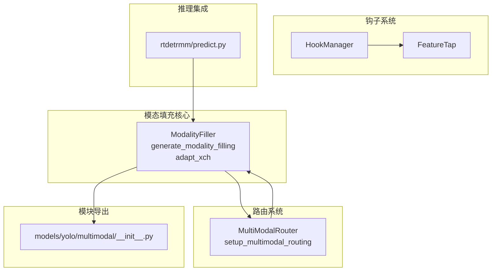
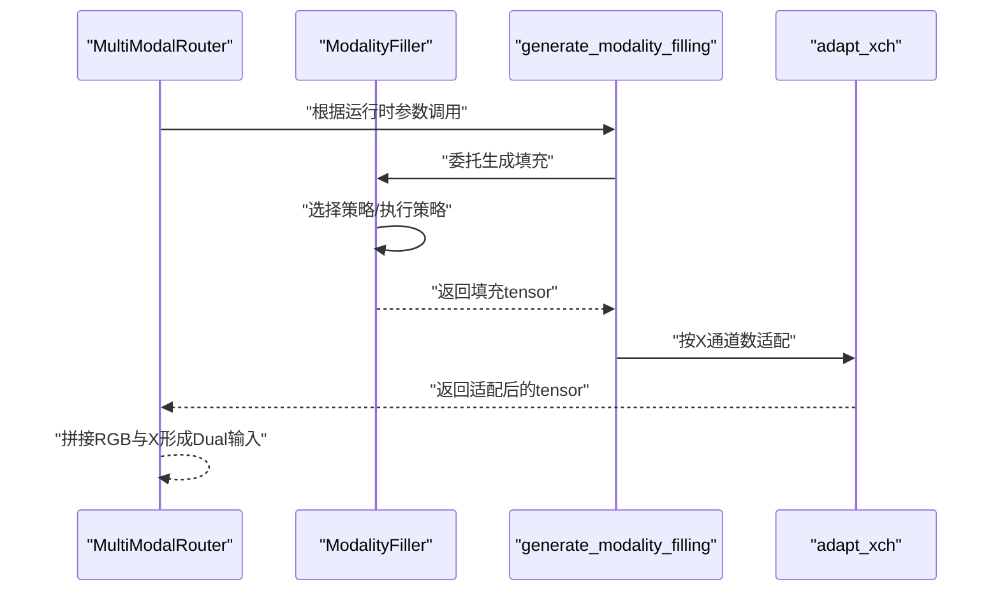
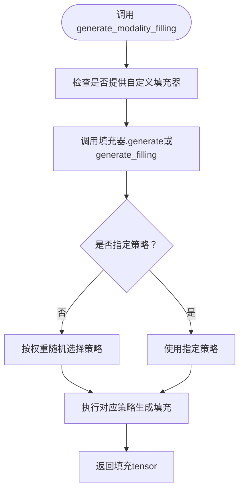
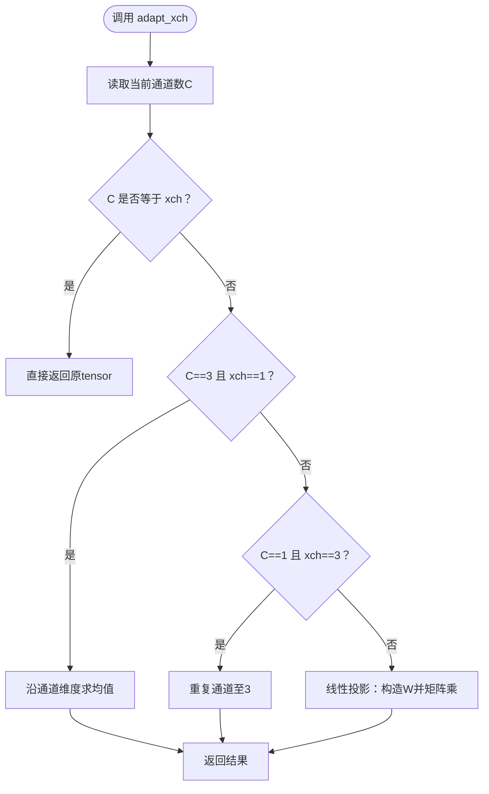
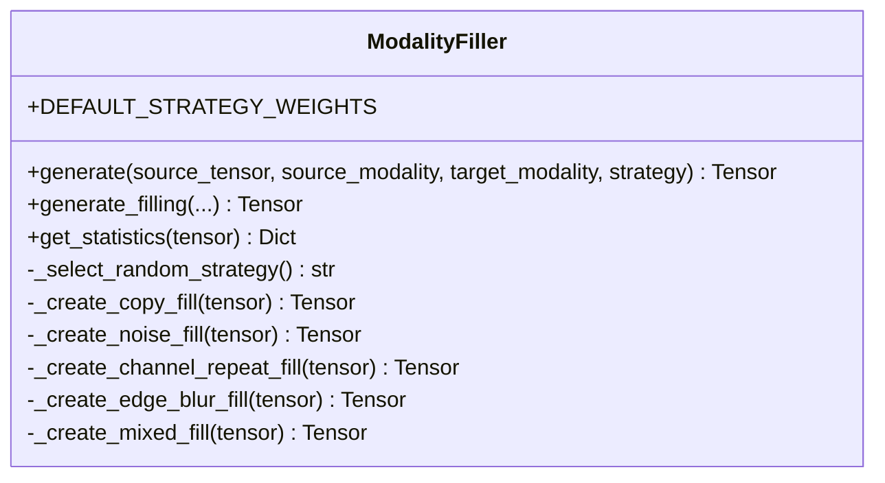
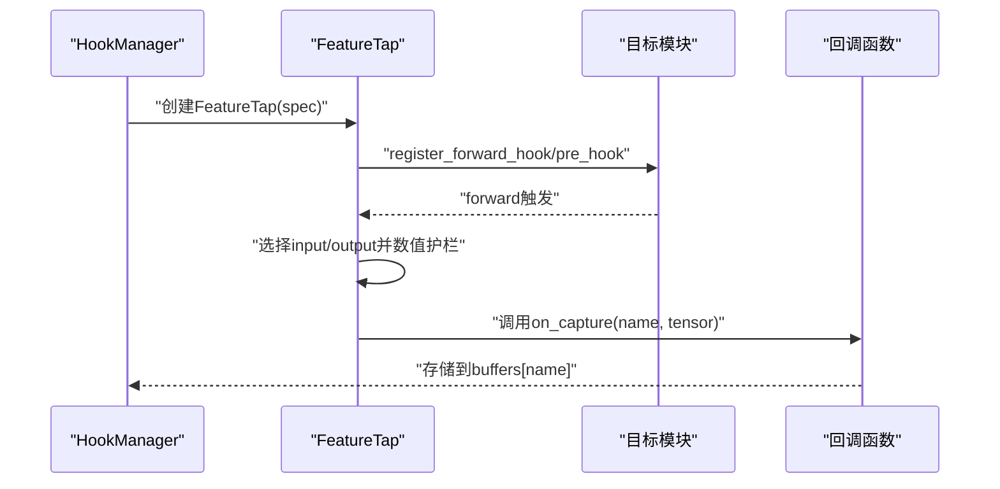
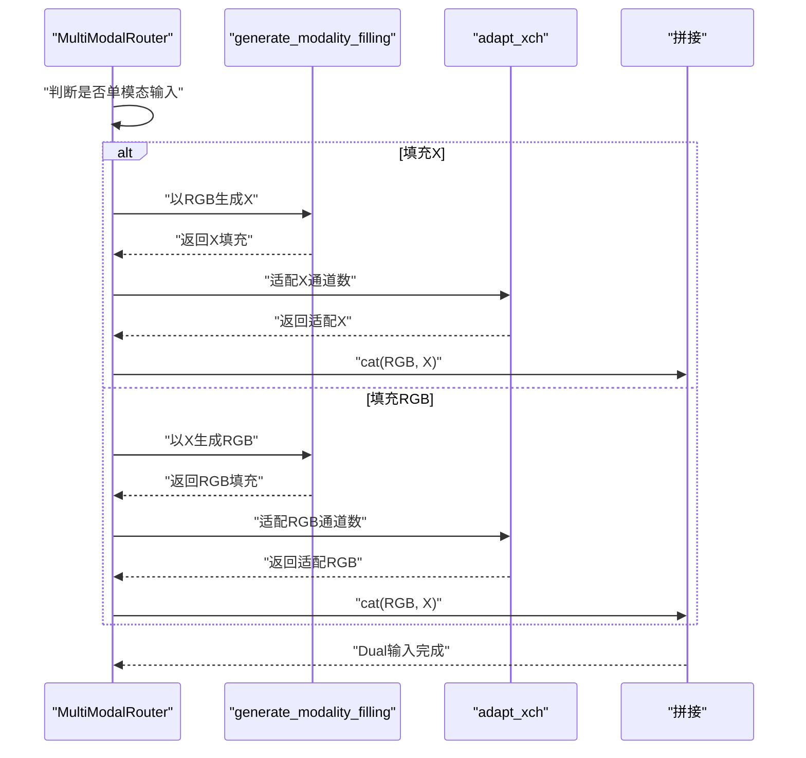
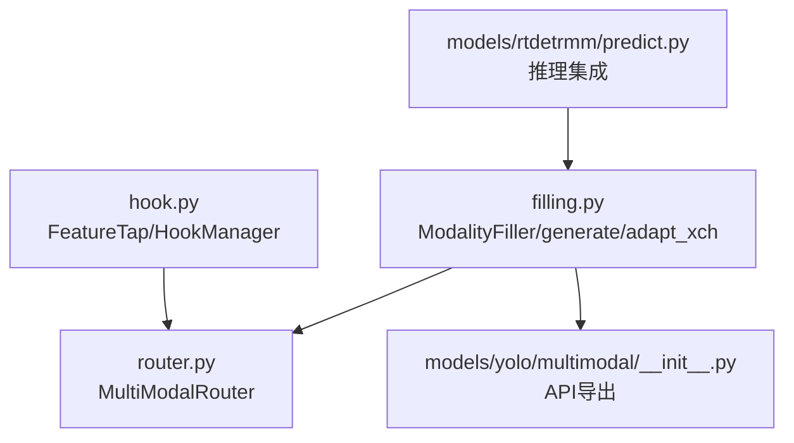

# ModalityFiller模态填充器API

<cite>
**本文档引用的文件**
- [ultralytics/nn/mm/filling.py](file://ultralytics/nn/mm/filling.py)
- [ultralytics/models/yolo/multimodal/modal_filling.py](file://ultralytics/models/yolo/multimodal/modal_filling.py)
- [ultralytics/nn/mm/router.py](file://ultralytics/nn/mm/router.py)
- [ultralytics/nn/mm/hook.py](file://ultralytics/nn/mm/hook.py)
- [ultralytics/models/yolo/multimodal/__init__.py](file://ultralytics/models/yolo/multimodal/__init__.py)
- [ultralytics/models/rtdetrmm/predict.py](file://ultralytics/models/rtdetrmm/predict.py)
</cite>

## 目录
1. [简介](#简介)
2. [项目结构](#项目结构)
3. [核心组件](#核心组件)
4. [架构概览](#架构概览)
5. [详细组件分析](#详细组件分析)
6. [依赖关系分析](#依赖关系分析)
7. [性能考虑](#性能考虑)
8. [故障排除指南](#故障排除指南)
9. [结论](#结论)
10. [附录](#附录)

## 简介
本文件为ModalityFiller模态填充器组件的完整API参考文档，重点覆盖以下内容：
- generate_modality_filling填充函数的参数、行为与使用方式
- adapt_xch通道适配函数的实现机制与适用场景
- 模态填充策略的实现机制：零填充、插值填充、模态转换等算法
- filling_hook钩子函数的工作原理与注册机制
- 填充策略的选择逻辑、性能优化技术与错误处理方案
- 不同模态组合下的填充示例、参数验证规则与常见问题解决方案

ModalityFiller旨在为RGB+X多模态路由系统提供轻量、快速且可配置的缺失模态合成能力，确保在单模态输入场景下也能保持模型的稳定推理。

## 项目结构
围绕ModalityFiller的相关文件分布如下：
- 核心实现：ultralytics/nn/mm/filling.py（通用实现）
- YOLO专用实现：ultralytics/models/yolo/multimodal/modal_filling.py（中文注释版）
- 路由集成：ultralytics/nn/mm/router.py（MultiModalRouter中调用generate_modality_filling与adapt_xch）
- 钩子管理：ultralytics/nn/mm/hook.py（FeatureTap/HookManager用于特征捕获）
- 模块导出：ultralytics/models/yolo/multimodal/__init__.py（公开API）
- 推理集成：ultralytics/models/rtdetrmm/predict.py（RT-DETRMM推理中对单模态场景的处理）

**图表来源**
- [ultralytics/nn/mm/filling.py:14-174](file://ultralytics/nn/mm/filling.py#L14-L174)
- [ultralytics/nn/mm/router.py:157-228](file://ultralytics/nn/mm/router.py#L157-L228)
- [ultralytics/nn/mm/hook.py:51-310](file://ultralytics/nn/mm/hook.py#L51-L310)
- [ultralytics/models/yolo/multimodal/__init__.py:45-77](file://ultralytics/models/yolo/multimodal/__init__.py#L45-L77)
- [ultralytics/models/rtdetrmm/predict.py:586-607](file://ultralytics/models/rtdetrmm/predict.py#L586-L607)

**章节来源**
- [ultralytics/nn/mm/filling.py:1-175](file://ultralytics/nn/mm/filling.py#L1-L175)
- [ultralytics/models/yolo/multimodal/modal_filling.py:1-295](file://ultralytics/models/yolo/multimodal/modal_filling.py#L1-L295)
- [ultralytics/nn/mm/router.py:1-200](file://ultralytics/nn/mm/router.py#L1-L200)
- [ultralytics/nn/mm/hook.py:1-310](file://ultralytics/nn/mm/hook.py#L1-L310)
- [ultralytics/models/yolo/multimodal/__init__.py:1-152](file://ultralytics/models/yolo/multimodal/__init__.py#L1-L152)
- [ultralytics/models/rtdetrmm/predict.py:586-607](file://ultralytics/models/rtdetrmm/predict.py#L586-L607)

## 核心组件
本节概述ModalityFiller的核心API与关键策略：

- ModalityFiller类
  - 默认策略权重：copy(0.3)、noise(0.25)、channel_repeat(0.2)、edge_blur(0.15)、mixed(0.1)
  - 关键方法：
    - generate：根据策略生成填充tensor
    - generate_filling：YOLO专用版本（中文注释）
    - get_statistics：统计tensor的均值、方差、最值与形状
    - 各策略私有方法：_create_copy_fill、_create_noise_fill、_create_channel_repeat_fill、_create_edge_blur_fill、_create_mixed_fill
- 便捷函数
  - generate_modality_filling：统一入口，返回与源tensor同形状的填充结果
  - adapt_xch：通道数适配，支持3通道与1通道互转及一般性线性投影

**章节来源**
- [ultralytics/nn/mm/filling.py:14-174](file://ultralytics/nn/mm/filling.py#L14-L174)
- [ultralytics/models/yolo/multimodal/modal_filling.py:12-244](file://ultralytics/models/yolo/multimodal/modal_filling.py#L12-L244)

## 架构概览
ModalityFiller在多模态路由中的位置与交互如下：

**图表来源**
- [ultralytics/nn/mm/router.py:157-228](file://ultralytics/nn/mm/router.py#L157-L228)
- [ultralytics/nn/mm/filling.py:141-148](file://ultralytics/nn/mm/filling.py#L141-L148)
- [ultralytics/nn/mm/filling.py:151-174](file://ultralytics/nn/mm/filling.py#L151-L174)

**章节来源**
- [ultralytics/nn/mm/router.py:157-228](file://ultralytics/nn/mm/router.py#L157-L228)
- [ultralytics/nn/mm/filling.py:141-174](file://ultralytics/nn/mm/filling.py#L141-L174)

## 详细组件分析

### generate_modality_filling API
- 函数签名与用途
  - 统一入口，返回与source_tensor同形状的填充tensor
  - 支持指定策略或使用默认随机策略
- 参数说明
  - source_tensor: 源模态tensor [B, C, H, W]
  - source_modality: 源模态类型（如'rgb'）
  - target_modality: 目标模态类型（如'x'）
  - strategy: 可选，策略名称；None时按权重随机选择
  - filler: 可选，自定义ModalityFiller实例
- 返回值
  - 与source_tensor形状相同的tensor
- 调用链
  - 通用实现：ultralytics/nn/mm/filling.py
  - YOLO专用实现：ultralytics/models/yolo/multimodal/modal_filling.py

**图表来源**
- [ultralytics/nn/mm/filling.py:141-148](file://ultralytics/nn/mm/filling.py#L141-L148)
- [ultralytics/models/yolo/multimodal/modal_filling.py:252-273](file://ultralytics/models/yolo/multimodal/modal_filling.py#L252-L273)

**章节来源**
- [ultralytics/nn/mm/filling.py:141-148](file://ultralytics/nn/mm/filling.py#L141-L148)
- [ultralytics/models/yolo/multimodal/modal_filling.py:252-273](file://ultralytics/models/yolo/multimodal/modal_filling.py#L252-L273)

### adapt_xch API
- 功能描述
  - 将输入tensor的通道数适配为目标通道数xch
  - 特殊处理：3通道→1通道（均值）、1通道→3通道（重复）
  - 一般性：通过线性投影实现C→xch映射
- 参数与返回
  - tensor: [B, C, H, W]
  - xch: 目标通道数
  - 返回：[B, xch, H, W]

**图表来源**
- [ultralytics/nn/mm/filling.py:151-174](file://ultralytics/nn/mm/filling.py#L151-L174)

**章节来源**
- [ultralytics/nn/mm/filling.py:151-174](file://ultralytics/nn/mm/filling.py#L151-L174)

### 模态填充策略实现机制
- 策略权重与默认值
  - copy: 0.3（复制原图）
  - noise: 0.25（加高斯噪声）
  - channel_repeat: 0.2（通道重复）
  - edge_blur: 0.15（边缘+模糊）
  - mixed: 0.1（混合策略）
- 策略选择逻辑
  - 若未指定策略，则按权重随机选择
  - 若权重之和不为1，会发出警告
- 策略算法要点
  - copy：直接clone
  - noise：添加高斯噪声并裁剪到[0,1]
  - channel_repeat：3通道→灰度再重复，1通道→重复3次
  - edge_blur：Sobel边缘检测后高斯模糊
  - mixed：随机选择2-3种策略，按softmax权重融合

**图表来源**
- [ultralytics/nn/mm/filling.py:14-118](file://ultralytics/nn/mm/filling.py#L14-L118)
- [ultralytics/models/yolo/multimodal/modal_filling.py:12-194](file://ultralytics/models/yolo/multimodal/modal_filling.py#L12-L194)

**章节来源**
- [ultralytics/nn/mm/filling.py:21-118](file://ultralytics/nn/mm/filling.py#L21-L118)
- [ultralytics/models/yolo/multimodal/modal_filling.py:20-194](file://ultralytics/models/yolo/multimodal/modal_filling.py#L20-L194)

### filling_hook钩子函数工作原理与注册机制
- FeatureTap
  - 封装PyTorch forward hook，支持捕获module的input或output
  - 可选detach与L2归一化
  - 捕获时进行数值护栏（NaN/Inf替换），并可触发回调
- HookManager
  - 自动生成稳定、人类可读的缓冲区标识符（如CL.RGB.P4.L6.output）
  - 支持同层多钩子的去重与编号（#1、#2…）
  - 提供register/spec校验、collect/get/summary/clear等管理能力

**图表来源**
- [ultralytics/nn/mm/hook.py:51-310](file://ultralytics/nn/mm/hook.py#L51-L310)

**章节来源**
- [ultralytics/nn/mm/hook.py:51-310](file://ultralytics/nn/mm/hook.py#L51-L310)

### MultiModalRouter中的填充与适配
- 在setup_multimodal_routing中：
  - 当检测到单模态输入时，根据runtime_modality决定填充哪一侧（RGB或X）
  - 调用generate_modality_filling生成缺失模态，并通过adapt_xch适配通道数
  - 最终拼接为RGB+X的Dual输入

**图表来源**
- [ultralytics/nn/mm/router.py:157-228](file://ultralytics/nn/mm/router.py#L157-L228)

**章节来源**
- [ultralytics/nn/mm/router.py:157-228](file://ultralytics/nn/mm/router.py#L157-L228)

## 依赖关系分析
- 内部依赖
  - ModalityFiller依赖torch与torch.nn.functional进行张量运算
  - HookManager依赖torch.nn与autocast进行数值稳定处理
- 外部集成
  - MultiModalRouter在setup_multimodal_routing中直接调用generate_modality_filling与adapt_xch
  - RT-DETRMM推理中对单模态场景禁用预处理阶段的自动填充，强调通过路由系统在前向中处理

**图表来源**
- [ultralytics/nn/mm/filling.py:14-174](file://ultralytics/nn/mm/filling.py#L14-L174)
- [ultralytics/nn/mm/router.py:7-8](file://ultralytics/nn/mm/router.py#L7-L8)
- [ultralytics/nn/mm/hook.py:24-27](file://ultralytics/nn/mm/hook.py#L24-L27)
- [ultralytics/models/yolo/multimodal/__init__.py:45-77](file://ultralytics/models/yolo/multimodal/__init__.py#L45-L77)
- [ultralytics/models/rtdetrmm/predict.py:586-607](file://ultralytics/models/rtdetrmm/predict.py#L586-L607)

**章节来源**
- [ultralytics/nn/mm/filling.py:14-174](file://ultralytics/nn/mm/filling.py#L14-L174)
- [ultralytics/nn/mm/router.py:7-8](file://ultralytics/nn/mm/router.py#L7-L8)
- [ultralytics/nn/mm/hook.py:24-27](file://ultralytics/nn/mm/hook.py#L24-L27)
- [ultralytics/models/yolo/multimodal/__init__.py:45-77](file://ultralytics/models/yolo/multimodal/__init__.py#L45-L77)
- [ultralytics/models/rtdetrmm/predict.py:586-607](file://ultralytics/models/rtdetrmm/predict.py#L586-L607)

## 性能考虑
- 策略选择
  - 策略权重偏向copy与noise，减少复杂计算开销
  - mixed策略在精度与速度之间折衷，适合对鲁棒性要求更高的场景
- 数值稳定性
  - noise策略对结果进行裁剪，避免越界
  - edge_blur与gaussian_blur使用逐通道卷积，避免跨通道依赖
- 设备与dtype
  - 所有张量运算保持与输入相同的device与dtype，减少设备迁移
- 线性投影
  - adapt_xch采用矩阵乘法实现通道映射，时间复杂度O(B*H*W*C*xch)，在小C与xch时开销可控

[本节为通用性能讨论，无需具体文件分析]

## 故障排除指南
- 策略权重总和不为1
  - 现象：出现权重总和警告
  - 处理：确保传入的strategy_weights之和为1.0
- NaN/Inf数值异常
  - 现象：钩子捕获时记录warning
  - 处理：检查输入tensor的数值范围，必要时在上游数据预处理阶段进行清洗
- 单模态预处理阶段禁用自动填充
  - 现象：RT-DETRMM推理中抛出RuntimeError
  - 处理：仅传入3通道输入，通过MultiModalRouter在前向中进行填充与适配

**章节来源**
- [ultralytics/models/yolo/multimodal/modal_filling.py:44-45](file://ultralytics/models/yolo/multimodal/modal_filling.py#L44-L45)
- [ultralytics/nn/mm/hook.py:120-126](file://ultralytics/nn/mm/hook.py#L120-L126)
- [ultralytics/models/rtdetrmm/predict.py:586-596](file://ultralytics/models/rtdetrmm/predict.py#L586-L596)

## 结论
ModalityFiller提供了轻量、可配置且与路由系统深度集成的模态填充能力。通过generate_modality_filling与adapt_xch，系统能够在单模态输入场景下生成高质量的缺失模态数据，并保证通道一致性与数值稳定性。配合HookManager，可实现对特征流的灵活捕获与分析，满足多模态系统的训练与推理需求。

[本节为总结性内容，无需具体文件分析]

## 附录

### API速查表
- ModalityFiller
  - 属性：strategy_weights, noise_std, blur_kernel_size
  - 方法：generate, generate_filling, get_statistics
- 便捷函数
  - generate_modality_filling：统一入口
  - adapt_xch：通道适配

**章节来源**
- [ultralytics/nn/mm/filling.py:14-174](file://ultralytics/nn/mm/filling.py#L14-L174)
- [ultralytics/models/yolo/multimodal/modal_filling.py:12-244](file://ultralytics/models/yolo/multimodal/modal_filling.py#L12-L244)

### 常见模态组合与示例
- RGB→X：以RGB为源，生成X模态并适配通道数
- X→RGB：以X为源，生成RGB模态并适配通道数
- 注意：在预处理阶段不进行自动填充，推荐通过MultiModalRouter在前向中处理

**章节来源**
- [ultralytics/nn/mm/router.py:157-228](file://ultralytics/nn/mm/router.py#L157-L228)
- [ultralytics/models/rtdetrmm/predict.py:586-596](file://ultralytics/models/rtdetrmm/predict.py#L586-L596)