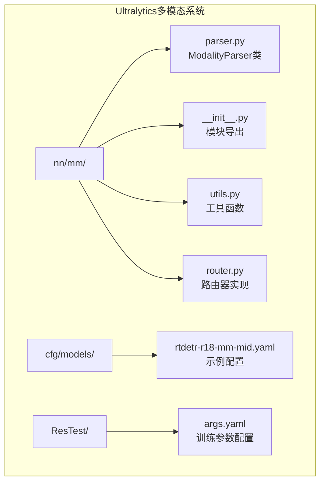
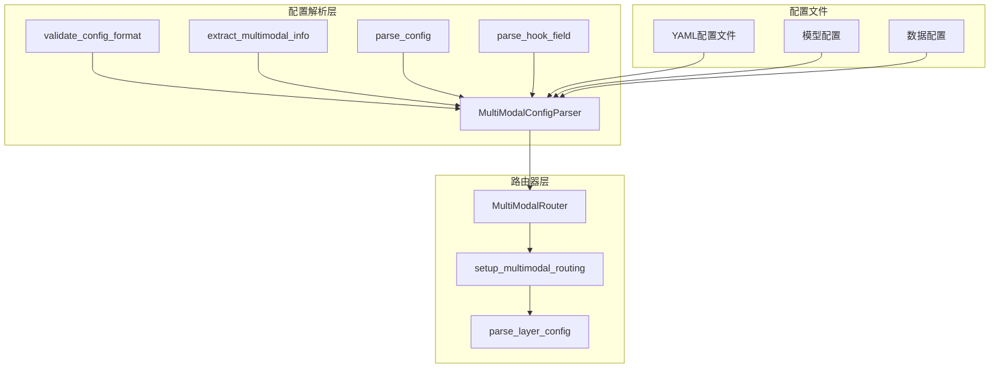
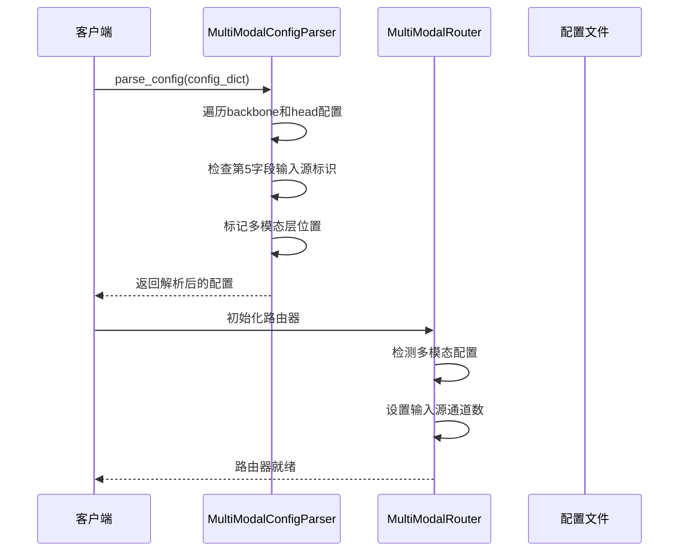
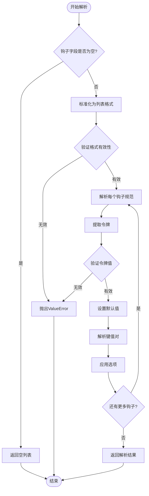
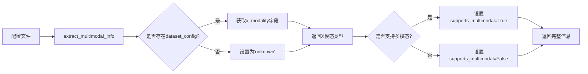
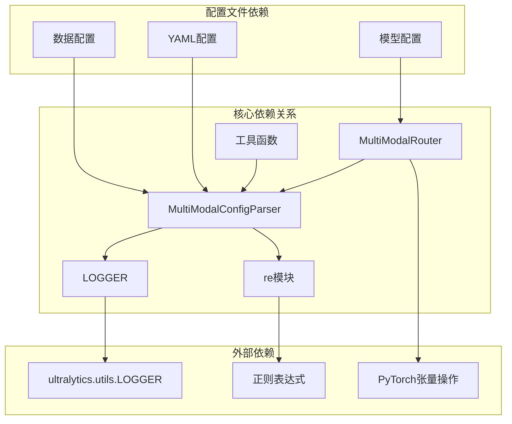
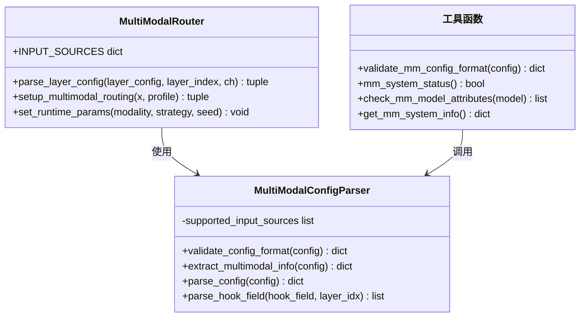

# ModalityParser模态解析器API

<cite>
**本文档引用的文件**
- [parser.py](file://ultralytics/nn/mm/parser.py)
- [__init__.py](file://ultralytics/nn/mm/__init__.py)
- [utils.py](file://ultralytics/nn/mm/utils.py)
- [router.py](file://ultralytics/nn/mm/router.py)
- [rtdetr-r18-mm-mid.yaml](file://ultralytics/cfg/models/rt-detr/rtdetr-r18-mm-mid.yaml)
- [args.yaml](file://ResTest/RTDETR-mid/args.yaml)
</cite>

## 目录
1. [简介](#简介)
2. [项目结构](#项目结构)
3. [核心组件](#核心组件)
4. [架构概览](#架构概览)
5. [详细组件分析](#详细组件分析)
6. [依赖关系分析](#依赖关系分析)
7. [性能考虑](#性能考虑)
8. [故障排除指南](#故障排除指南)
9. [结论](#结论)

## 简介

ModalityParser模态解析器是Ultralytics多模态系统中的核心组件，专门负责解析和验证YAML配置文件中的多模态信息。该解析器支持RGB+X模态架构，能够智能识别和处理多模态路由配置，为多模态路由器提供准确的配置信息。

该组件的主要功能包括：
- YAML配置文件解析
- 多模态配置验证
- 路由策略提取
- 默认值设置
- 错误处理和兼容性检查

## 项目结构

多模态解析器位于Ultralytics项目的神经网络模块中，具体位置如下：



**图表来源**
- [parser.py:1-198](file://ultralytics/nn/mm/parser.py#L1-L198)
- [__init__.py:1-78](file://ultralytics/nn/mm/__init__.py#L1-L78)

**章节来源**
- [parser.py:1-198](file://ultralytics/nn/mm/parser.py#L1-L198)
- [__init__.py:1-78](file://ultralytics/nn/mm/__init__.py#L1-L78)

## 核心组件

### MultiModalConfigParser类

MultiModalConfigParser是多模态配置解析器的核心类，提供了完整的配置解析和验证功能。

#### 主要特性
- **配置格式验证**：验证YAML配置文件的格式正确性
- **多模态信息提取**：从配置中提取X模态类型和路由信息
- **路由策略解析**：解析5字段和6字段配置格式
- **钩子DSL解析**：支持复杂的特征提取钩子配置

#### 支持的输入源
- **RGB**：3通道可见光图像
- **X**：3通道统一其他模态（深度/热成像/激光雷达等）
- **Dual**：6通道RGB+X拼接输入

**章节来源**
- [parser.py:9-198](file://ultralytics/nn/mm/parser.py#L9-L198)

## 架构概览

多模态解析器在整个系统中的位置和交互关系如下：



**图表来源**
- [parser.py:67-198](file://ultralytics/nn/mm/parser.py#L67-L198)
- [router.py:11-200](file://ultralytics/nn/mm/router.py#L11-L200)

## 详细组件分析

### 配置解析流程

#### 基础配置解析



**图表来源**
- [parser.py:67-86](file://ultralytics/nn/mm/parser.py#L67-L86)
- [router.py:31-63](file://ultralytics/nn/mm/router.py#L31-L63)

#### 钩子DSL解析流程



**图表来源**
- [parser.py:91-197](file://ultralytics/nn/mm/parser.py#L91-L197)

### 配置验证机制

#### 格式验证规则

MultiModalConfigParser提供了多层次的配置验证机制：

1. **基本格式验证**：检查配置文件的基本结构
2. **路由层识别**：自动识别RGB、X、Dual类型的路由层
3. **通道数验证**：验证输入通道数的合理性
4. **兼容性检查**：确保配置与当前架构兼容

#### 验证输出结构

```python
{
    'rgb_layers': [0, 3, 8],      # RGB路由层索引列表
    'x_layers': [1, 4, 10],       # X路由层索引列表  
    'dual_layers': [12, 15],      # Dual路由层索引列表
    'total_routing_layers': 6     # 路由层总数
}
```

**章节来源**
- [parser.py:20-46](file://ultralytics/nn/mm/parser.py#L20-L46)
- [utils.py:8-34](file://ultralytics/nn/mm/utils.py#L8-L34)

### 多模态信息提取

#### X模态类型检测

解析器能够从数据配置中自动检测X模态类型：



**图表来源**
- [parser.py:48-65](file://ultralytics/nn/mm/parser.py#L48-L65)

#### 模态层计数

解析器会统计不同类型的模态路由层数量，为后续的路由决策提供依据。

**章节来源**
- [parser.py:48-65](file://ultralytics/nn/mm/parser.py#L48-L65)

## 依赖关系分析

### 组件间依赖



**图表来源**
- [parser.py:5-6](file://ultralytics/nn/mm/parser.py#L5-L6)
- [__init__.py:30-43](file://ultralytics/nn/mm/__init__.py#L30-L43)

### 模块导出关系



**图表来源**
- [parser.py:9-198](file://ultralytics/nn/mm/parser.py#L9-L198)
- [router.py:11-200](file://ultralytics/nn/mm/router.py#L11-L200)
- [utils.py:8-93](file://ultralytics/nn/mm/utils.py#L8-L93)

**章节来源**
- [__init__.py:29-78](file://ultralytics/nn/mm/__init__.py#L29-L78)

## 性能考虑

### 解析性能优化

1. **延迟解析**：只在需要时解析配置，避免不必要的计算
2. **缓存机制**：利用路由器的缓存机制减少重复解析
3. **向量化操作**：使用PyTorch张量操作进行高效的多模态数据处理

### 内存使用优化

- **零拷贝路由**：通过张量视图实现零拷贝数据传输
- **按需分配**：根据实际需要动态分配内存空间
- **垃圾回收**：及时释放不再使用的中间结果

## 故障排除指南

### 常见配置错误

#### YAML格式错误

**问题症状**：
- 解析器抛出ValueError异常
- 配置验证失败

**解决方案**：
1. 检查YAML缩进是否正确
2. 验证所有必需字段都存在
3. 确认数据类型匹配

#### 路由层配置错误

**问题症状**：
- 路由层识别失败
- 输入通道数不匹配

**解决方案**：
1. 确保第5字段包含有效的输入源标识
2. 验证X模态的通道数配置
3. 检查Dual模态的通道拼接顺序

#### 钩子配置错误

**问题症状**：
- 钩子解析失败
- 特征提取异常

**解决方案**：
1. 验证钩子DSL语法
2. 检查工具名称是否正确
3. 确认阶段名称格式（P数字）

### 调试技巧

#### 启用详细日志

```python
# 在初始化时启用详细日志
router = MultiModalRouter(config_dict, verbose=True)
```

#### 配置验证

使用工具函数验证配置格式：

```python
from ultralytics.nn.mm import validate_mm_config_format
validation_result = validate_mm_config_format(config)
print(f"RGB层数量: {validation_result['rgb_layers']}")
```

**章节来源**
- [parser.py:115-197](file://ultralytics/nn/mm/parser.py#L115-L197)
- [utils.py:37-47](file://ultralytics/nn/mm/utils.py#L37-L47)

## 结论

ModalityParser模态解析器是一个功能完整、设计合理的多模态配置解析组件。它提供了：

1. **全面的配置解析能力**：支持复杂的YAML配置格式
2. **强大的验证机制**：多层次的配置验证确保系统稳定性
3. **灵活的路由策略**：支持多种模态组合和路由方式
4. **完善的错误处理**：提供详细的错误信息和恢复机制

该解析器为Ultralytics多模态系统的稳定运行提供了坚实的基础，能够有效支持RGB+X模态的各种应用场景。