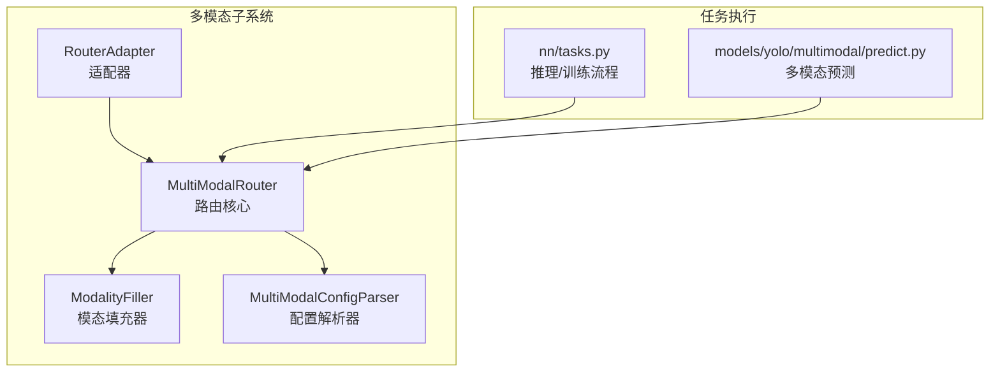
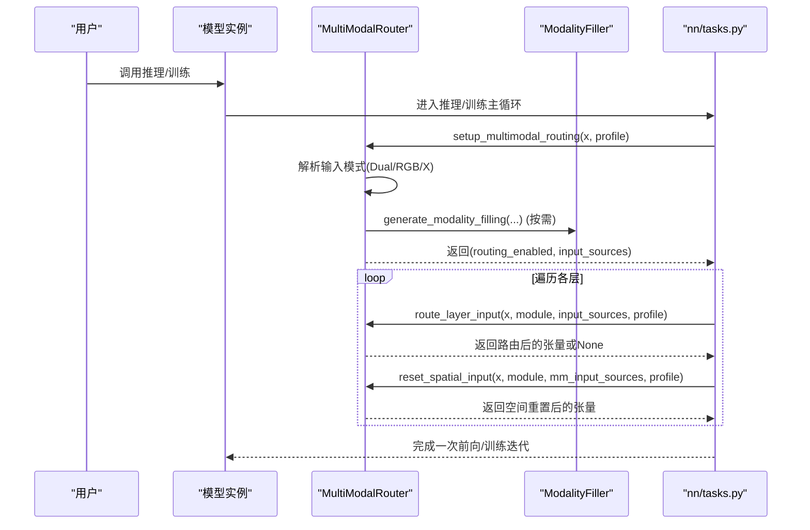
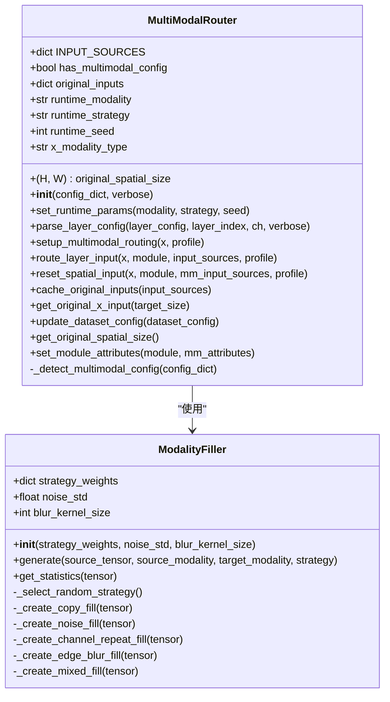
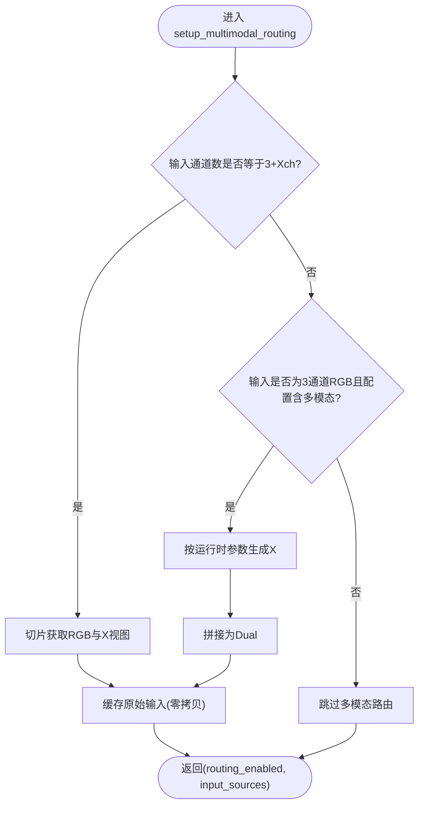
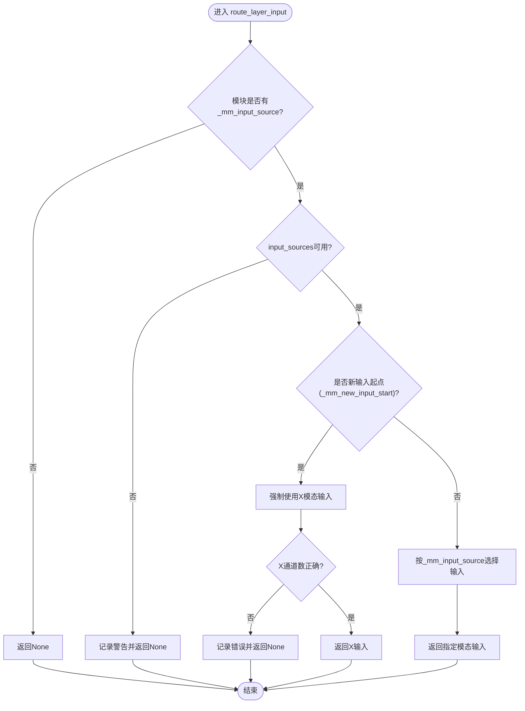
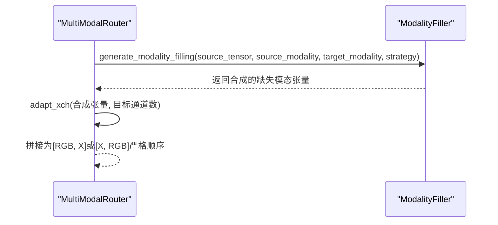
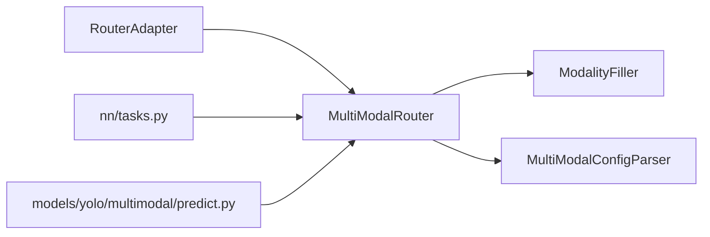

# MultiModalRouter路由器API

<cite>
**本文档引用的文件**
- [router.py](file://ultralytics/nn/mm/router.py)
- [filling.py](file://ultralytics/nn/mm/filling.py)
- [router_adapter.py](file://ultralytics/models/utils/multimodal/visualize_core/router_adapter.py)
- [tasks.py](file://ultralytics/nn/tasks.py)
- [predict.py](file://ultralytics/models/yolo/multimodal/predict.py)
- [parser.py](file://ultralytics/nn/mm/parser.py)
</cite>

## 目录
1. [简介](#简介)
2. [项目结构](#项目结构)
3. [核心组件](#核心组件)
4. [架构总览](#架构总览)
5. [详细组件分析](#详细组件分析)
6. [依赖关系分析](#依赖关系分析)
7. [性能考虑](#性能考虑)
8. [故障排查指南](#故障排查指南)
9. [结论](#结论)
10. [附录](#附录)

## 简介
MultiModalRouter是Ultralytics多模态系统中的核心路由器组件，负责在RGB与X（深度、热红外、激光雷达等）模态之间进行数据路由与融合。其主要特性包括：
- 零拷贝张量视图路由：通过切片与缓存实现高效的数据复用，避免不必要的内存复制
- 配置驱动的数据流：基于模型配置与层定义的5字段路由标识实现灵活的路由策略
- 支持YOLO与RTDETR架构：统一的RGB+X输入与路由机制
- 运行时参数控制：支持在推理阶段动态选择模态或进行缺失模态合成
- 空间重置：对特定层进行空间维度恢复，确保特征提取一致性

## 项目结构
MultiModalRouter位于Ultralytics的多模态子系统中，与模态填充器、配置解析器、任务执行器协同工作。

**图表来源**
- [router.py:10-471](file://ultralytics/nn/mm/router.py#L10-L471)
- [filling.py:14-175](file://ultralytics/nn/mm/filling.py#L14-L175)
- [router_adapter.py:18-103](file://ultralytics/models/utils/multimodal/visualize_core/router_adapter.py#L18-L103)
- [tasks.py:904-940](file://ultralytics/nn/tasks.py#L904-L940)
- [predict.py:1554-1556](file://ultralytics/models/yolo/multimodal/predict.py#L1554-L1556)

**章节来源**
- [router.py:10-471](file://ultralytics/nn/mm/router.py#L10-L471)
- [filling.py:14-175](file://ultralytics/nn/mm/filling.py#L14-L175)
- [router_adapter.py:18-103](file://ultralytics/models/utils/multimodal/visualize_core/router_adapter.py#L18-L103)
- [tasks.py:904-940](file://ultralytics/nn/tasks.py#L904-L940)
- [predict.py:1554-1556](file://ultralytics/models/yolo/multimodal/predict.py#L1554-L1556)

## 核心组件
- MultiModalRouter：多模态路由器核心类，提供初始化、运行时参数设置、层配置解析、多模态路由设置、层输入路由、空间重置等功能
- ModalityFiller：模态填充器，提供多种轻量级策略生成缺失模态数据
- MultiModalConfigParser：配置解析器，识别并标记含有多模态路由标记的层
- RouterAdapter：安全访问适配器，提供对模型中路由器的探针式访问

**章节来源**
- [router.py:10-471](file://ultralytics/nn/mm/router.py#L10-L471)
- [filling.py:14-175](file://ultralytics/nn/mm/filling.py#L14-L175)
- [router_adapter.py:18-103](file://ultralytics/models/utils/multimodal/visualize_core/router_adapter.py#L18-L103)

## 架构总览
MultiModalRouter在推理/训练流程中的位置如下：

**图表来源**
- [tasks.py:904-940](file://ultralytics/nn/tasks.py#L904-L940)
- [router.py:157-240](file://ultralytics/nn/mm/router.py#L157-L240)
- [router.py:242-317](file://ultralytics/nn/mm/router.py#L242-L317)
- [router.py:365-404](file://ultralytics/nn/mm/router.py#L365-L404)
- [filling.py:141-148](file://ultralytics/nn/mm/filling.py#L141-L148)

## 详细组件分析

### MultiModalRouter 类
MultiModalRouter是多模态数据路由的核心，支持以下公共方法与属性：

- 属性
  - INPUT_SOURCES: 字典，定义RGB、X、Dual三种输入源的通道数映射
  - has_multimodal_config: 布尔值，指示配置中是否存在多模态层
  - original_spatial_size: 元组，记录原始空间尺寸，用于空间重置
  - original_inputs: 字典，缓存原始RGB、X、Dual输入，支持零拷贝
  - runtime_modality: 运行时模态选择（None/rgb/x）
  - runtime_strategy: 运行时填充策略（可选）
  - runtime_seed: 运行时种子（可选）
  - x_modality_type: X模态类型字符串（如depth/ir等）

- 方法
  - __init__(config_dict=None, verbose=True)
    - 功能：根据配置初始化INPUT_SOURCES、检测多模态配置、设置运行时参数默认值
    - 参数：
      - config_dict: 模型配置字典，包含dataset_config（可选）
      - verbose: 是否打印详细日志
    - 返回：无
    - 异常：无显式抛出，日志警告用于调试
    - 使用场景：模型加载后初始化路由器
    - 复杂度：O(1)
    - 注意：legacy对象反序列化时会通过__setstate__补齐运行时字段

  - set_runtime_params(modality: str | None, strategy: str | None = None, seed: int | None = None)
    - 功能：设置运行时参数，控制推理阶段的模态选择与填充策略
    - 参数：
      - modality: 'rgb' | 'x' | None；None表示不进行模态消融
      - strategy: 填充策略名称（可选）
      - seed: 随机种子（可选）
    - 返回：无
    - 异常：无
    - 使用场景：在推理前设置运行时参数，影响setup_multimodal_routing的行为
    - 复杂度：O(1)

  - parse_layer_config(layer_config, layer_index, ch, verbose=True)
    - 功能：解析层配置，识别第5字段的多模态输入源标识，返回输入通道数与MM属性
    - 参数：
      - layer_config: 层配置列表，格式为[from, repeats, module, args, input_source?]
      - layer_index: 当前层索引
      - ch: 通道信息数组
      - verbose: 是否打印日志
    - 返回：三元组(输入通道数, mm_input_source, mm_attributes)
    - 异常：无
    - 使用场景：构建网络时为模块注入多模态属性
    - 复杂度：O(1)
    - 重要逻辑：
      - 若第5字段为RGB/X/Dual，则更新mm_attributes并特殊处理X模态from=-1的情况（标记新输入起点与空间重置）

  - setup_multimodal_routing(x, profile=False)
    - 功能：根据输入张量与运行时参数，建立RGB/X/Dual三路输入源
    - 参数：
      - x: 输入张量
      - profile: 是否打印性能/调试信息
    - 返回：二元组(routing_enabled, input_sources)
    - 异常：无
    - 使用场景：每次前向开始时调用，决定是否启用多模态路由及如何拆分/合成输入
    - 复杂度：O(1)，零拷贝切片
    - 关键分支：
      - 双通道输入（3+Xch==通道数）：直接切片为RGB与X
      - 单通道RGB输入且配置含多模态：按运行时参数生成缺失模态，拼接为Dual
    - 注意：严格保证通道顺序为[RGB, X]，避免训练/推理不一致

  - route_layer_input(x, module, input_sources, profile=False)
    - 功能：根据模块的MM属性，将当前输入路由到指定模态
    - 参数：
      - x: 当前输入张量
      - module: 当前模块（需具备_mm_input_source等属性）
      - input_sources: RGB/X/Dual输入源字典
      - profile: 是否打印日志
    - 返回：路由后的张量或None
    - 异常：无
    - 使用场景：在前向过程中为特定层选择输入
    - 复杂度：O(1)
    - 重要逻辑：
      - 若模块标记为新输入起点（_mm_new_input_start），强制使用X模态输入
      - 否则按_mm_input_source选择对应输入
      - 最终进行有效性检查（通道数、存在性）

  - reset_spatial_input(x, module, mm_input_sources, profile=False)
    - 功能：对标记为新输入起点的层，将其空间维度重置为原始尺寸
    - 参数：
      - x: 当前输入张量
      - module: 当前模块（需具备_mm_new_input_start等属性）
      - mm_input_sources: RGB/X/Dual输入源字典
      - profile: 是否打印日志
    - 返回：重置后的张量
    - 异常：无
    - 使用场景：当X模态作为新输入起点时，确保后续层使用原始分辨率
    - 复杂度：O(1)
    - 注意：若缺少必要输入或原始尺寸未知，将回退为原输入

  - cache_original_inputs(input_sources)
    - 功能：缓存原始输入源，支持零拷贝
    - 参数：input_sources（RGB/X/Dual）
    - 返回：无
    - 异常：无
    - 使用场景：setup_multimodal_routing后调用，供reset_spatial_input使用

  - get_original_x_input(target_size=None)
    - 功能：获取原始X模态输入（可选目标尺寸）
    - 参数：target_size（可选，H,W）
    - 返回：X模态张量或None
    - 异常：无
    - 使用场景：可视化或后处理阶段获取原始X输入

  - update_dataset_config(dataset_config)
    - 功能：动态更新X模态通道数与类型
    - 参数：dataset_config（字典）
    - 返回：无
    - 异常：无
    - 使用场景：训练/推理过程中动态调整X模态配置

  - get_original_spatial_size()
    - 功能：获取原始空间尺寸
    - 参数：无
    - 返回：(H, W)或None
    - 异常：无
    - 使用场景：空间重置逻辑中验证尺寸

  - set_module_attributes(module, mm_attributes)
    - 功能：为模块设置多模态属性
    - 参数：module与mm_attributes字典
    - 返回：无
    - 异常：无
    - 使用场景：parse_layer_config后调用

  - _detect_multimodal_config(config_dict)
    - 功能：检测配置中是否存在多模态层
    - 参数：config_dict
    - 返回：布尔值
    - 异常：无
    - 使用场景：初始化时判断是否启用多模态

- 零拷贝张量视图路由机制
  - 通过切片操作获取RGB与X的视图，避免复制
  - 在cache_original_inputs中缓存引用，支持后续空间重置
  - 在setup_multimodal_routing中按运行时参数生成缺失模态，仍保持零拷贝切片

- 模态路由决策逻辑
  - 双通道输入：直接按通道边界切分为RGB与X
  - 单通道RGB输入：根据运行时参数生成X，拼接为Dual
  - 单通道X输入：根据运行时参数生成RGB，拼接为Dual
  - 新输入起点：强制使用X模态输入，确保特征提取一致性

- 与ModalityFiller协作关系
  - 通过generate_modality_filling与adapt_xch实现缺失模态合成与通道适配
  - ModalityFiller提供多种策略（copy/noise/channel_repeat/edge_blur/mixed），默认策略权重可配置

**章节来源**
- [router.py:31-63](file://ultralytics/nn/mm/router.py#L31-L63)
- [router.py:64-89](file://ultralytics/nn/mm/router.py#L64-L89)
- [router.py:90-155](file://ultralytics/nn/mm/router.py#L90-L155)
- [router.py:157-240](file://ultralytics/nn/mm/router.py#L157-L240)
- [router.py:242-317](file://ultralytics/nn/mm/router.py#L242-L317)
- [router.py:319-364](file://ultralytics/nn/mm/router.py#L319-L364)
- [router.py:365-404](file://ultralytics/nn/mm/router.py#L365-L404)
- [router.py:406-447](file://ultralytics/nn/mm/router.py#L406-L447)
- [router.py:448-471](file://ultralytics/nn/mm/router.py#L448-L471)
- [filling.py:14-175](file://ultralytics/nn/mm/filling.py#L14-L175)

### 类关系图

**图表来源**
- [router.py:10-471](file://ultralytics/nn/mm/router.py#L10-L471)
- [filling.py:14-175](file://ultralytics/nn/mm/filling.py#L14-L175)

### 零拷贝张量视图路由流程

**图表来源**
- [router.py:157-240](file://ultralytics/nn/mm/router.py#L157-L240)

### 模态路由决策流程

**图表来源**
- [router.py:242-317](file://ultralytics/nn/mm/router.py#L242-L317)

### 与ModalityFiller协作流程

**图表来源**
- [router.py:189-200](file://ultralytics/nn/mm/router.py#L189-L200)
- [router.py:218-231](file://ultralytics/nn/mm/router.py#L218-L231)
- [filling.py:141-148](file://ultralytics/nn/mm/filling.py#L141-L148)
- [filling.py:151-174](file://ultralytics/nn/mm/filling.py#L151-L174)

## 依赖关系分析
- MultiModalRouter依赖ModalityFiller进行缺失模态合成与通道适配
- MultiModalRouter与配置解析器配合，识别多模态层并注入属性
- RouterAdapter提供安全访问模型中路由器的能力，避免硬依赖
- 在nn/tasks.py与多模态预测流程中被调用，贯穿前向过程

**图表来源**
- [router.py:10-471](file://ultralytics/nn/mm/router.py#L10-L471)
- [filling.py:14-175](file://ultralytics/nn/mm/filling.py#L14-L175)
- [router_adapter.py:18-103](file://ultralytics/models/utils/multimodal/visualize_core/router_adapter.py#L18-L103)
- [tasks.py:904-940](file://ultralytics/nn/tasks.py#L904-L940)
- [predict.py:1554-1556](file://ultralytics/models/yolo/multimodal/predict.py#L1554-L1556)

**章节来源**
- [router.py:10-471](file://ultralytics/nn/mm/router.py#L10-L471)
- [filling.py:14-175](file://ultralytics/nn/mm/filling.py#L14-L175)
- [router_adapter.py:18-103](file://ultralytics/models/utils/multimodal/visualize_core/router_adapter.py#L18-L103)
- [tasks.py:904-940](file://ultralytics/nn/tasks.py#L904-L940)
- [predict.py:1554-1556](file://ultralytics/models/yolo/multimodal/predict.py#L1554-L1556)

## 性能考虑
- 零拷贝切片：通过张量切片获取RGB与X视图，避免复制，降低内存与带宽开销
- 缓存原始输入：original_inputs缓存引用，reset_spatial_input直接复用，减少额外分配
- 轻量填充策略：ModalityFiller策略均为轻量实现，避免引入重型依赖
- 运行时参数短路：当runtime_modality为None时，直接使用现有输入，减少不必要的合成

[本节为通用性能讨论，无需具体文件分析]

## 故障排查指南
- 日志与警告
  - setup_multimodal_routing与route_layer_input在profile模式下会输出详细日志，便于定位问题
  - 常见问题：输入通道数不匹配、缺少X输入源、原始空间尺寸未知
- 常见错误场景
  - X模态新输入起点但缺少X输入源：返回None并记录警告
  - 通道数不匹配：记录错误并输出当前输入源状态
  - 原始空间尺寸为空：空间重置失败，回退为原输入
- 建议
  - 确保配置中正确标注多模态层的第5字段
  - 在推理前调用set_runtime_params设置合适的运行时参数
  - 使用RouterAdapter的安全访问接口，避免硬依赖

**章节来源**
- [router.py:157-240](file://ultralytics/nn/mm/router.py#L157-L240)
- [router.py:242-317](file://ultralytics/nn/mm/router.py#L242-L317)
- [router.py:365-404](file://ultralytics/nn/mm/router.py#L365-L404)

## 结论
MultiModalRouter提供了统一、高效的RGB+X多模态数据路由能力，结合零拷贝张量视图与轻量填充策略，在保证性能的同时实现了灵活的运行时控制。通过与配置解析器、适配器及任务执行器的协作，能够无缝集成到YOLO与RTDETR等架构中，满足多样化的多模态应用需求。

[本节为总结性内容，无需具体文件分析]

## 附录

### 使用示例与最佳实践
- 初始化与运行时参数设置
  - 在模型加载后调用set_runtime_params设置运行时参数
  - 例如：设置runtime_modality为'rgb'或'x'以进行模态消融
- 配置多模态层
  - 在模型配置中为相关层添加第5字段标识（RGB/X/Dual）
  - 使用MultiModalConfigParser解析配置，自动标记多模态层
- 前向过程集成
  - 在nn/tasks.py的推理/训练主循环中调用setup_multimodal_routing
  - 对每一层调用route_layer_input进行路由
  - 对标记为新输入起点的层调用reset_spatial_input
- 可视化与调试
  - 使用RouterAdapter探测模型中的路由器并设置运行时参数
  - 在profile模式下观察每层的路由行为与性能指标

**章节来源**
- [router.py:64-89](file://ultralytics/nn/mm/router.py#L64-L89)
- [router.py:90-155](file://ultralytics/nn/mm/router.py#L90-L155)
- [router.py:157-240](file://ultralytics/nn/mm/router.py#L157-L240)
- [router.py:242-317](file://ultralytics/nn/mm/router.py#L242-L317)
- [router.py:365-404](file://ultralytics/nn/mm/router.py#L365-L404)
- [router_adapter.py:18-103](file://ultralytics/models/utils/multimodal/visualize_core/router_adapter.py#L18-L103)
- [tasks.py:904-940](file://ultralytics/nn/tasks.py#L904-L940)
- [predict.py:1554-1556](file://ultralytics/models/yolo/multimodal/predict.py#L1554-L1556)