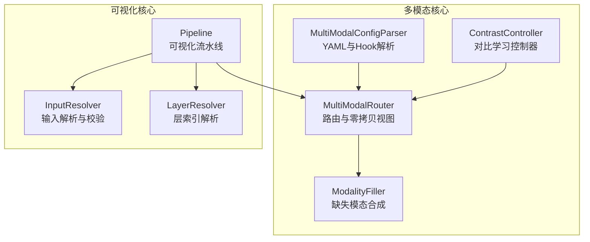
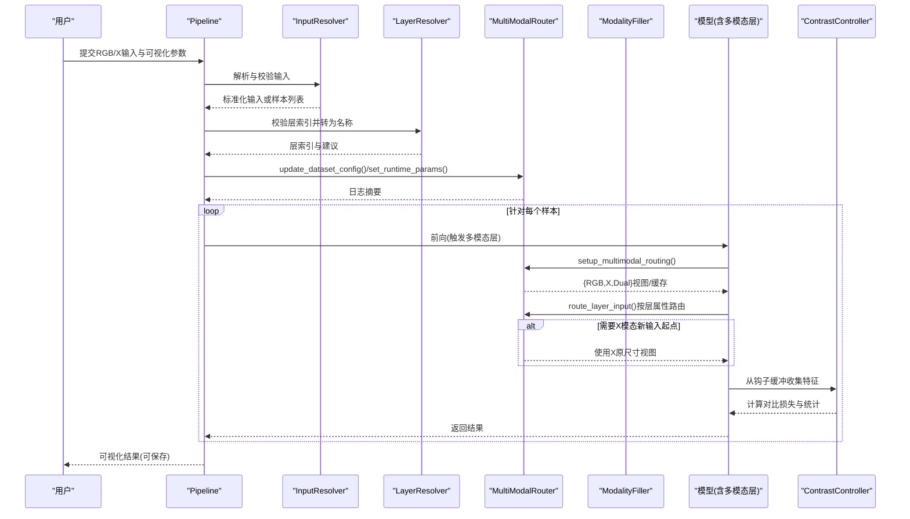
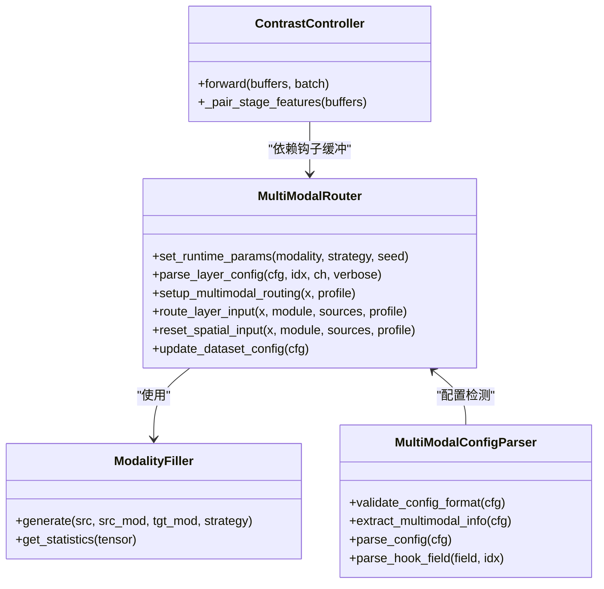

# 核心组件API

<cite>
**本文引用的文件**
- [router.py](file://ultralytics/nn/mm/router.py)
- [parser.py](file://ultralytics/nn/mm/parser.py)
- [filling.py](file://ultralytics/nn/mm/filling.py)
- [contrast.py](file://ultralytics/nn/mm/contrast.py)
- [pipeline.py](file://ultralytics/models/utils/multimodal/visualize_core/pipeline.py)
- [input_resolver.py](file://ultralytics/models/utils/multimodal/visualize_core/input_resolver.py)
- [layer_resolver.py](file://ultralytics/models/utils/multimodal/visualize_core/layer_resolver.py)
</cite>

## 目录
1. [简介](#简介)
2. [项目结构](#项目结构)
3. [核心组件](#核心组件)
4. [架构总览](#架构总览)
5. [组件详解](#组件详解)
6. [依赖关系分析](#依赖关系分析)
7. [性能考量](#性能考量)
8. [故障排查指南](#故障排查指南)
9. [结论](#结论)
10. [附录](#附录)

## 简介
本文件为多模态检测系统的核心组件API参考，聚焦以下组件：
- MultiModalRouter：RGB+X多模态数据路由与零拷贝张量视图管理
- ModalityFiller：缺失模态合成策略（占位/噪声/边缘模糊等）
- ModalityParser：YAML配置解析与Hook DSL解析（6th字段）
- ContrastController：对比学习ROI提取、投影与InfoNCE损失计算

文档涵盖初始化参数、配置选项、方法签名与返回值类型，以及组件间交互、数据流控制机制与配置解析流程。并提供使用示例、参数验证规则与常见问题解决方案。

## 项目结构
围绕多模态路由与对比学习的关键模块分布如下：
- 路由与填充：ultralytics/nn/mm/router.py、ultralytics/nn/mm/filling.py
- 配置解析：ultralytics/nn/mm/parser.py
- 对比学习：ultralytics/nn/mm/contrast.py
- 可视化流水线与输入/层解析：ultralytics/models/utils/multimodal/visualize_core/*

图表来源
- [router.py:11-471](file://ultralytics/nn/mm/router.py#L11-L471)
- [filling.py:14-175](file://ultralytics/nn/mm/filling.py#L14-L175)
- [parser.py:9-198](file://ultralytics/nn/mm/parser.py#L9-L198)
- [contrast.py:149-290](file://ultralytics/nn/mm/contrast.py#L149-L290)
- [pipeline.py:24-239](file://ultralytics/models/utils/multimodal/visualize_core/pipeline.py#L24-L239)
- [input_resolver.py:14-180](file://ultralytics/models/utils/multimodal/visualize_core/input_resolver.py#L14-L180)
- [layer_resolver.py:10-68](file://ultralytics/models/utils/multimodal/visualize_core/layer_resolver.py#L10-L68)

章节来源
- [router.py:11-471](file://ultralytics/nn/mm/router.py#L11-L471)
- [parser.py:9-198](file://ultralytics/nn/mm/parser.py#L9-L198)
- [filling.py:14-175](file://ultralytics/nn/mm/filling.py#L14-L175)
- [contrast.py:149-290](file://ultralytics/nn/mm/contrast.py#L149-L290)
- [pipeline.py:24-239](file://ultralytics/models/utils/multimodal/visualize_core/pipeline.py#L24-L239)
- [input_resolver.py:14-180](file://ultralytics/models/utils/multimodal/visualize_core/input_resolver.py#L14-L180)
- [layer_resolver.py:10-68](file://ultralytics/models/utils/multimodal/visualize_core/layer_resolver.py#L10-L68)

## 核心组件
本节概述四个核心组件的职责与对外接口要点。

- MultiModalRouter
  - 职责：根据配置与运行时参数，对输入张量进行RGB/X/Dual三路路由；支持零拷贝视图；提供空间重置能力；维护原始输入缓存。
  - 关键方法：setup_multimodal_routing、route_layer_input、reset_spatial_input、set_runtime_params、update_dataset_config。
  - 返回值：布尔标志与字典；路由张量或None；空间尺寸元组。

- ModalityFiller
  - 职责：在缺少某模态时，基于策略生成占位/合成张量；支持复制、加噪、通道重复、边缘模糊、混合策略。
  - 关键方法：generate、get_statistics；辅助函数：adapt_xch、generate_modality_filling。
  - 返回值：与源张量同形状的合成张量；统计字典。

- MultiModalConfigParser
  - 职责：验证YAML配置格式；提取多模态信息；解析Hook DSL（6th字段）为规范规格。
  - 关键方法：validate_config_format、extract_multimodal_info、parse_config、parse_hook_field。
  - 返回值：统计字典；规范化Hook规范列表。

- ContrastController
  - 职责：从钩子缓冲中配对RGB/X特征，提取ROI向量，经投影头得到嵌入，计算InfoNCE损失。
  - 关键方法：forward、_pair_stage_features。
  - 返回值：损失标量与统计字典；若无有效配对则返回None与空字典。

章节来源
- [router.py:11-471](file://ultralytics/nn/mm/router.py#L11-L471)
- [filling.py:14-175](file://ultralytics/nn/mm/filling.py#L14-L175)
- [parser.py:9-198](file://ultralytics/nn/mm/parser.py#L9-L198)
- [contrast.py:149-290](file://ultralytics/nn/mm/contrast.py#L149-L290)

## 架构总览
多模态系统通过“配置解析—路由—填充—对比学习”形成闭环。可视化流水线通过InputResolver与LayerResolver确保输入与层索引合法，Pipeline协调RouterAdapter更新数据集配置与运行时参数，最终驱动模型前向与损失计算。

图表来源
- [pipeline.py:107-239](file://ultralytics/models/utils/multimodal/visualize_core/pipeline.py#L107-L239)
- [input_resolver.py:66-180](file://ultralytics/models/utils/multimodal/visualize_core/input_resolver.py#L66-L180)
- [layer_resolver.py:13-68](file://ultralytics/models/utils/multimodal/visualize_core/layer_resolver.py#L13-L68)
- [router.py:157-404](file://ultralytics/nn/mm/router.py#L157-L404)
- [filling.py:141-175](file://ultralytics/nn/mm/filling.py#L141-L175)
- [contrast.py:189-290](file://ultralytics/nn/mm/contrast.py#L189-L290)

## 组件详解

### MultiModalRouter 类接口
- 初始化参数
  - config_dict: dict，可包含dataset_config（含Xch、x_modality、modality_used等）
  - verbose: bool，是否打印日志
- 运行时参数
  - set_runtime_params(modality, strategy, seed)
    - modality: str，可选'rgb'/'x'或None
    - strategy: str，填充策略（见ModalityFiller）
    - seed: int，随机种子（影响策略选择）
- 关键属性
  - INPUT_SOURCES: dict，键为'RGB'/'X'/'Dual'，值为通道数
  - has_multimodal_config: bool，是否检测到多模态层
  - original_spatial_size: 元组，原始空间尺寸
  - original_inputs: dict，缓存RGB/X/Dual视图
  - runtime_modality/runtime_strategy/runtime_seed: 运行时消融/填充参数
- 关键方法
  - parse_layer_config(layer_config, layer_index, ch, verbose)
    - 返回: (输入通道数, 模态标识, 属性字典)
  - setup_multimodal_routing(x, profile)
    - 返回: (是否启用路由, 输入源字典)
  - route_layer_input(x, module, input_sources, profile)
    - 返回: 路由后的张量或None
  - reset_spatial_input(x, module, mm_input_sources, profile)
    - 返回: 重置为原始空间尺寸的张量
  - set_module_attributes(module, mm_attributes)
  - get_original_spatial_size()
  - cache_original_inputs(input_sources)
  - get_original_x_input(target_size)
  - update_dataset_config(dataset_config)
  - _detect_multimodal_config(config_dict)
- 返回值类型
  - parse_layer_config: (int, str|None, dict)
  - setup_multimodal_routing: (bool, dict[str, Tensor|None])
  - route_layer_input/reset_spatial_input: Tensor|None
  - get_original_spatial_size: tuple[int,int]|None
  - update_dataset_config: void
- 数据流控制
  - 根据输入通道数判断Dual或单模态场景
  - 根据runtime_modality决定是否进行填充与拼接
  - 通过module属性携带路由信息（_mm_input_source/_mm_layer_index/_mm_x_modality等）
  - X模态新输入起点时，强制使用X输入并进行空间重置
- 使用示例（路径）
  - [router.py:31-63](file://ultralytics/nn/mm/router.py#L31-L63)
  - [router.py:157-240](file://ultralytics/nn/mm/router.py#L157-L240)
  - [router.py:242-317](file://ultralytics/nn/mm/router.py#L242-L317)
  - [router.py:365-404](file://ultralytics/nn/mm/router.py#L365-L404)

章节来源
- [router.py:11-471](file://ultralytics/nn/mm/router.py#L11-L471)

### ModalityFiller 类接口
- 初始化参数
  - strategy_weights: dict[str,float]，策略权重，默认包含copy/noise/channel_repeat/edge_blur/mixed
  - noise_std: float，加噪标准差
  - blur_kernel_size: int，边缘模糊核大小
- 关键方法
  - generate(source_tensor, source_modality, target_modality, strategy)
    - 返回: 与源张量同形状的合成张量
  - get_statistics(tensor)
    - 返回: 包含mean/std/max/min/shape的字典
  - adapt_xch(tensor, xch)
    - 返回: 通道数适配后的张量
  - generate_modality_filling(source_tensor, source_modality, target_modality, strategy, filler)
    - 返回: 同形状合成张量（默认使用内部填充器）
- 返回值类型
  - generate/get_statistics/adapt_xch/generate_modality_filling: Tensor/dict/None
- 策略说明
  - copy：直接复制
  - noise：高斯噪声叠加并裁剪至[0,1]
  - channel_repeat：将3通道灰度重复为3通道，或将1通道重复为3通道
  - edge_blur：提取边缘并高斯模糊
  - mixed：随机组合多种策略并加权融合
- 使用示例（路径）
  - [filling.py:29-58](file://ultralytics/nn/mm/filling.py#L29-L58)
  - [filling.py:35-118](file://ultralytics/nn/mm/filling.py#L35-L118)
  - [filling.py:151-175](file://ultralytics/nn/mm/filling.py#L151-L175)

章节来源
- [filling.py:14-175](file://ultralytics/nn/mm/filling.py#L14-L175)

### MultiModalConfigParser 类接口
- 初始化参数
  - 无外部参数
- 关键方法
  - validate_config_format(config)
    - 返回: dict，包含RGB/X/Dual路由层数与总数
  - extract_multimodal_info(config)
    - 返回: dict，包含x_modality_type、mm_layer_count、supports_multimodal
  - parse_config(config)
    - 返回: 原配置副本，新增has_multimodal_layers与input_layers
  - parse_hook_field(hook_field, layer_idx)
    - 返回: 规范化的Hook规范列表
- 返回值类型
  - validate_config_format/extract_multimodal_info/parse_config: dict
  - parse_hook_field: list[dict]
- Hook DSL（6th字段）规范
  - 形如[CL, <模态>, <阶段>, key=value, ...]
  - 模态：'RGB'/'X'/'Dual'(可写'Fused'映射)
  - 阶段：'P3'/'P4'/'P5'等
  - 支持键：tap('output'|'input')、action('capture')、buffer(字符串)、detach/normalize(布尔)
- 使用示例（路径）
  - [parser.py:20-46](file://ultralytics/nn/mm/parser.py#L20-L46)
  - [parser.py:48-65](file://ultralytics/nn/mm/parser.py#L48-L65)
  - [parser.py:67-86](file://ultralytics/nn/mm/parser.py#L67-L86)
  - [parser.py:91-197](file://ultralytics/nn/mm/parser.py#L91-L197)

章节来源
- [parser.py:9-198](file://ultralytics/nn/mm/parser.py#L9-L198)

### ContrastController 类接口
- 初始化参数
  - cfg: ContrastConfig，包含tau、proj_dim、lambda_weight、max_rois_per_image、share_head、preferred_stages
- 关键方法
  - forward(hook_buffers, batch)
    - 返回: (loss_c, stats)，若无有效配对则(loss_c=None, {})
  - _pair_stage_features(buffers)
    - 返回: (chosen_stage, feat_rgb, feat_x)或None
- ROI与投影
  - RoiExtractor：按GT框在特征图上平均池化提取ROI向量
  - ProjectionHead：两层MLP，输出L2归一化嵌入
  - InfoNCELoss：对称NT-Xent损失
- 返回值类型
  - forward: (Tensor|None, dict)
  - _pair_stage_features: (str,Tensor,Tensor)|None
- 使用示例（路径）
  - [contrast.py:149-290](file://ultralytics/nn/mm/contrast.py#L149-L290)
  - [contrast.py:189-290](file://ultralytics/nn/mm/contrast.py#L189-L290)

章节来源
- [contrast.py:149-290](file://ultralytics/nn/mm/contrast.py#L149-L290)

### 可视化流水线与输入/层解析
- Pipeline.run
  - 负责设备一致性校验、输入解析、层索引校验、方法插件查找、Router协调、缓存与保存
  - 支持单样本与批量样本两种模式
- InputResolver.resolve
  - 自动推断单/双模态输入，严格校验数组形状、dtype、NaN/Inf、通道数
  - 不做自动填充/伪造/降级
- LayerResolver.validate_indices
  - 校验层索引合法性，提供建议与概览
- 使用示例（路径）
  - [pipeline.py:107-239](file://ultralytics/models/utils/multimodal/visualize_core/pipeline.py#L107-L239)
  - [input_resolver.py:66-180](file://ultralytics/models/utils/multimodal/visualize_core/input_resolver.py#L66-L180)
  - [layer_resolver.py:13-68](file://ultralytics/models/utils/multimodal/visualize_core/layer_resolver.py#L13-L68)

章节来源
- [pipeline.py:24-239](file://ultralytics/models/utils/multimodal/visualize_core/pipeline.py#L24-L239)
- [input_resolver.py:14-180](file://ultralytics/models/utils/multimodal/visualize_core/input_resolver.py#L14-L180)
- [layer_resolver.py:10-68](file://ultralytics/models/utils/multimodal/visualize_core/layer_resolver.py#L10-L68)

## 依赖关系分析
- 组件耦合
  - MultiModalRouter依赖ModalityFiller与filling工具函数进行占位合成与通道适配
  - MultiModalConfigParser为Router提供配置检测与Hook解析能力
  - ContrastController依赖Router提供的钩子缓冲与模型批注信息
  - Pipeline协调Router与可视化插件，确保输入与层解析合法
- 外部依赖
  - PyTorch张量操作与函数式卷积
  - OpenCV与NumPy用于可视化输入加载与校验
- 循环依赖
  - 未发现循环导入；模块边界清晰

图表来源
- [router.py:11-471](file://ultralytics/nn/mm/router.py#L11-L471)
- [filling.py:14-175](file://ultralytics/nn/mm/filling.py#L14-L175)
- [parser.py:9-198](file://ultralytics/nn/mm/parser.py#L9-L198)
- [contrast.py:149-290](file://ultralytics/nn/mm/contrast.py#L149-L290)

## 性能考量
- 零拷贝视图
  - Router通过切片与cat拼接维持视图，避免不必要的数据复制
- 填充策略
  - ModalityFiller策略轻量化，尽量减少额外计算；通道适配采用线性投影，复杂度低
- AMP与数值稳定
  - 投影头与InfoNCE在FP32内计算，避免精度问题
- 可视化缓存
  - Pipeline使用缓存键避免重复计算，提升批量处理效率

## 故障排查指南
- 配置格式错误
  - 症状：路由层数量统计异常或Hook解析失败
  - 处理：使用validate_config_format与parse_hook_field进行诊断
  - 参考：[parser.py:20-46](file://ultralytics/nn/mm/parser.py#L20-L46)、[parser.py:91-197](file://ultralytics/nn/mm/parser.py#L91-L197)
- 输入校验失败
  - 症状：输入为空、dtype非数值、含NaN/Inf、维度不符、通道数异常
  - 处理：依据错误提示修正数据类型与形状
  - 参考：[input_resolver.py:43-64](file://ultralytics/models/utils/multimodal/visualize_core/input_resolver.py#L43-L64)
- 层索引越界
  - 症状：LayerResolutionError
  - 处理：使用suggest_layers与enumerate_layers获取建议与概览
  - 参考：[layer_resolver.py:13-33](file://ultralytics/models/utils/multimodal/visualize_core/layer_resolver.py#L13-L33)
- 路由失败
  - 症状：模块无输入源、X模态新输入起点通道不匹配、空间重置失败
  - 处理：检查INPUT_SOURCES与original_spatial_size，确认X通道数与尺寸
  - 参考：[router.py:255-317](file://ultralytics/nn/mm/router.py#L255-L317)、[router.py:378-404](file://ultralytics/nn/mm/router.py#L378-L404)
- 对比学习无效
  - 症状：无有效配对或非有限特征/嵌入
  - 处理：检查preferred_stages、Hook命名与buffers内容
  - 参考：[contrast.py:189-290](file://ultralytics/nn/mm/contrast.py#L189-L290)

章节来源
- [parser.py:20-46](file://ultralytics/nn/mm/parser.py#L20-L46)
- [parser.py:91-197](file://ultralytics/nn/mm/parser.py#L91-L197)
- [input_resolver.py:43-64](file://ultralytics/models/utils/multimodal/visualize_core/input_resolver.py#L43-L64)
- [layer_resolver.py:13-33](file://ultralytics/models/utils/multimodal/visualize_core/layer_resolver.py#L13-L33)
- [router.py:255-317](file://ultralytics/nn/mm/router.py#L255-L317)
- [router.py:378-404](file://ultralytics/nn/mm/router.py#L378-L404)
- [contrast.py:189-290](file://ultralytics/nn/mm/contrast.py#L189-L290)

## 结论
MultiModalRouter、ModalityFiller、MultiModalConfigParser与ContrastController构成多模态检测系统的核心。前者负责零拷贝路由与空间重置，后者提供缺失模态合成策略，中间层解析配置与Hook DSL，最后通过对比学习增强跨模态表示。配合Pipeline与输入/层解析模块，系统实现了从配置到可视化的端到端工作流。

## 附录
- 使用示例（路径）
  - 路由初始化与运行时参数设置：[router.py:31-68](file://ultralytics/nn/mm/router.py#L31-L68)
  - 路由配置解析与Hook解析：[parser.py:67-86](file://ultralytics/nn/mm/parser.py#L67-L86)、[parser.py:91-197](file://ultralytics/nn/mm/parser.py#L91-L197)
  - 填充策略与通道适配：[filling.py:35-118](file://ultralytics/nn/mm/filling.py#L35-L118)、[filling.py:151-175](file://ultralytics/nn/mm/filling.py#L151-L175)
  - 对比学习损失计算：[contrast.py:189-290](file://ultralytics/nn/mm/contrast.py#L189-L290)
  - 可视化流水线运行：[pipeline.py:107-239](file://ultralytics/models/utils/multimodal/visualize_core/pipeline.py#L107-L239)