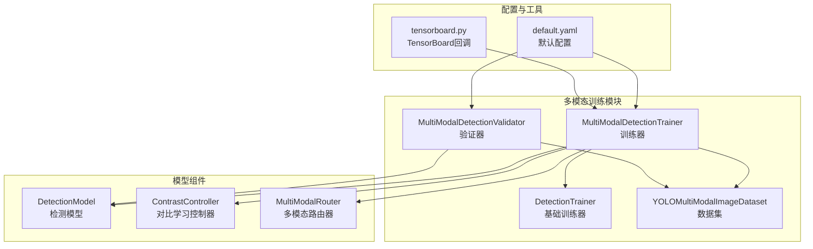
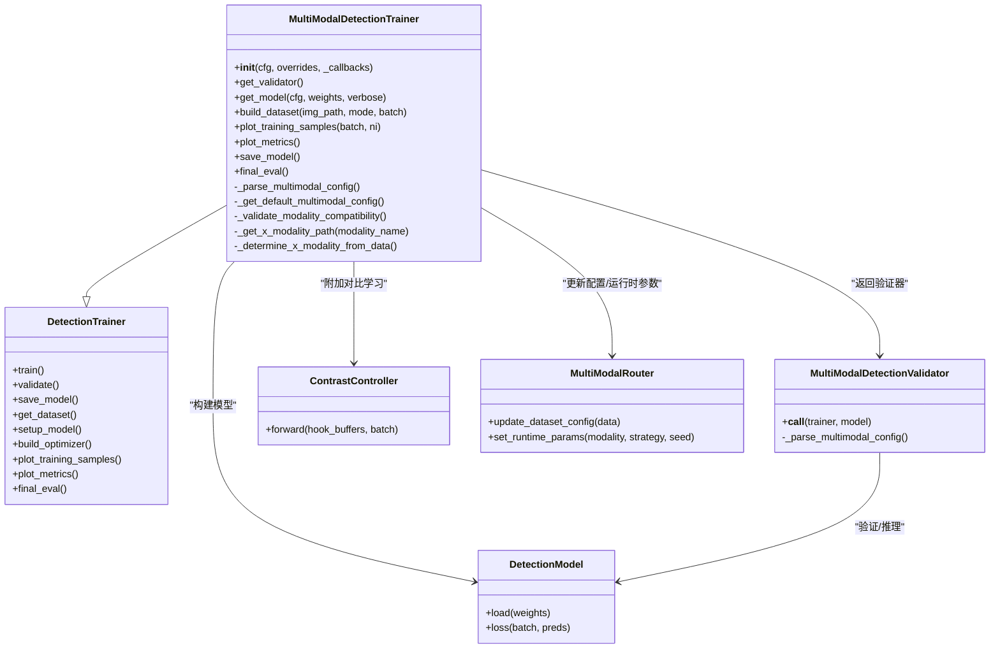
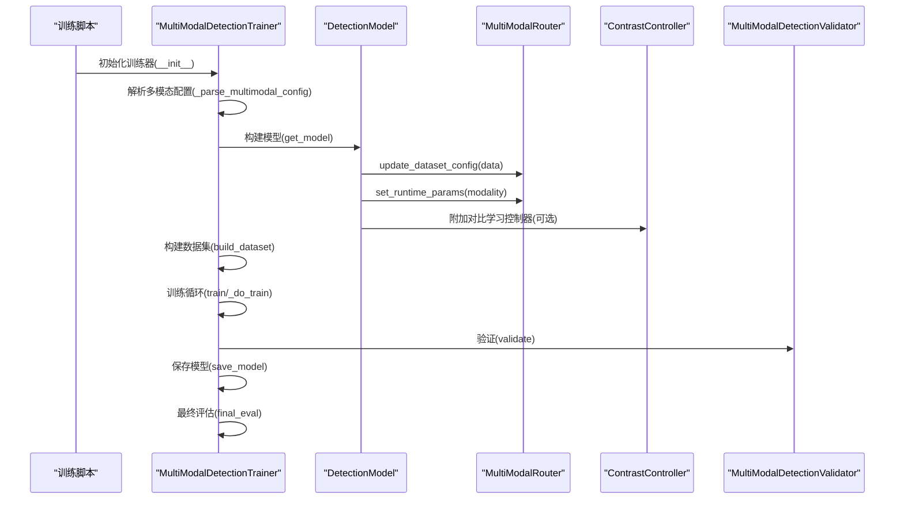
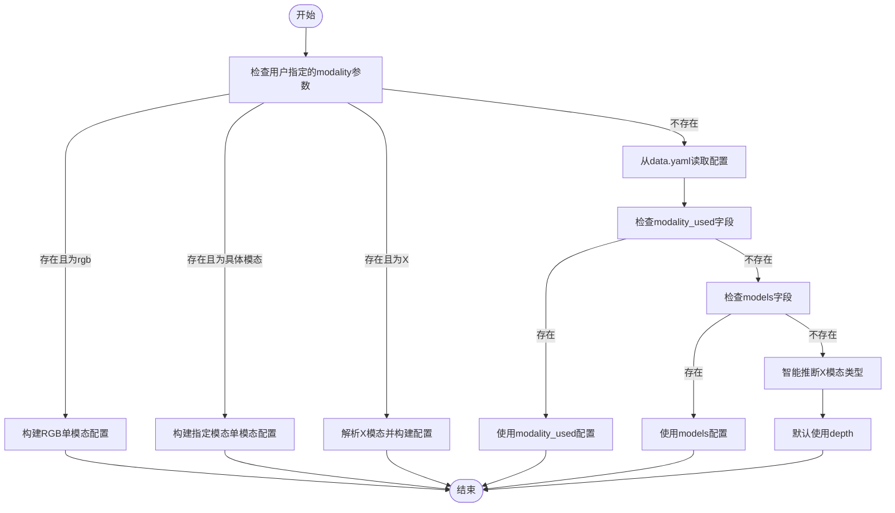
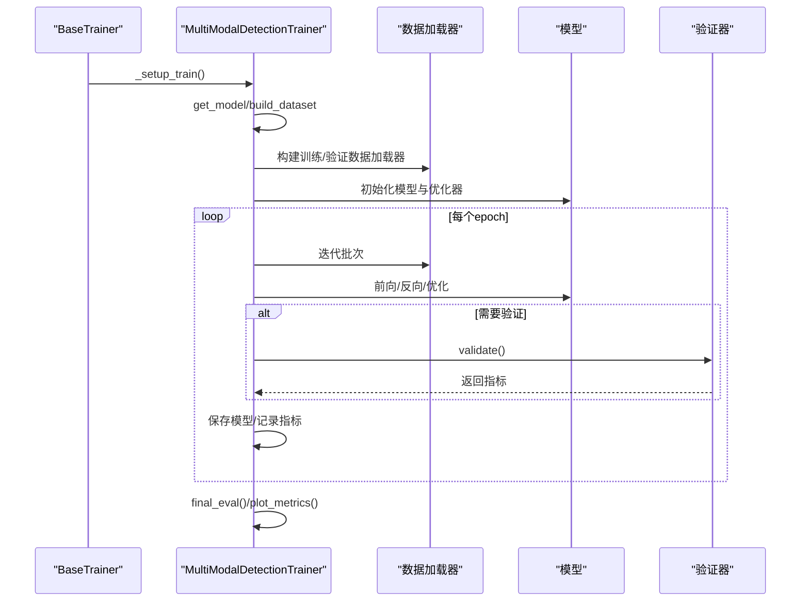
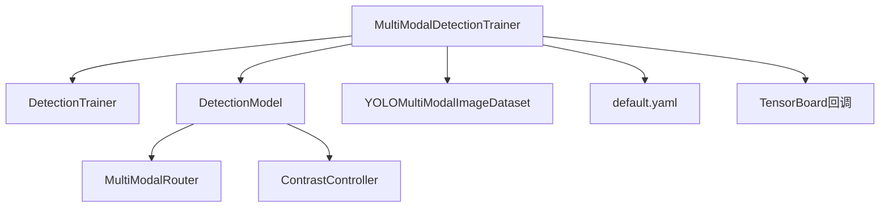

# 训练接口API

<cite>
**本文档引用的文件**
- [ultralytics/models/yolo/multimodal/train.py](file://ultralytics/models/yolo/multimodal/train.py)
- [ultralytics/engine/trainer.py](file://ultralytics/engine/trainer.py)
- [ultralytics/models/yolo/multimodal/val.py](file://ultralytics/models/yolo/multimodal/val.py)
- [ultralytics/notebook/trainMM.py](file://trainMM.py)
- [ultralytics/cfg/default.yaml](file://ultralytics/cfg/default.yaml)
- [ultralytics/nn/mm/contrast.py](file://ultralytics/nn/mm/contrast.py)
- [ultralytics/nn/mm/router.py](file://ultralytics/nn/mm/router.py)
- [ultralytics/utils/callbacks/tensorboard.py](file://ultralytics/utils/callbacks/tensorboard.py)
</cite>

## 目录
1. [简介](#简介)
2. [项目结构](#项目结构)
3. [核心组件](#核心组件)
4. [架构概览](#架构概览)
5. [详细组件分析](#详细组件分析)
6. [依赖关系分析](#依赖关系分析)
7. [性能考虑](#性能考虑)
8. [故障排除指南](#故障排除指南)
9. [结论](#结论)
10. [附录](#附录)

## 简介
本文件为多模态检测系统的训练接口API文档，重点围绕MultiModalDetectionTrainer类展开，涵盖训练流程控制、数据集构建、模型保存与加载、训练参数配置、回调函数机制、损失函数计算与优化器设置、日志记录、进度跟踪与性能监控等。文档同时提供训练脚本使用示例、参数调优建议以及常见问题排查指南，帮助开发者高效地进行多模态目标检测模型的训练与部署。

## 项目结构
多模态训练接口位于YOLO框架的多模态模块中，核心文件组织如下：
- 训练器实现：ultralytics/models/yolo/multimodal/train.py
- 基础训练器：ultralytics/engine/trainer.py
- 验证器实现：ultralytics/models/yolo/multimodal/val.py
- 训练脚本示例：ultralytics/notebook/trainMM.py
- 默认配置：ultralytics/cfg/default.yaml
- 对比学习组件：ultralytics/nn/mm/contrast.py
- 多模态路由器：ultralytics/nn/mm/router.py
- TensorBoard回调：ultralytics/utils/callbacks/tensorboard.py

**图表来源**
- [ultralytics/models/yolo/multimodal/train.py:16-757](file://ultralytics/models/yolo/multimodal/train.py#L16-L757)
- [ultralytics/engine/trainer.py:59-901](file://ultralytics/engine/trainer.py#L59-L901)
- [ultralytics/models/yolo/multimodal/val.py:20-852](file://ultralytics/models/yolo/multimodal/val.py#L20-L852)

**章节来源**
- [ultralytics/models/yolo/multimodal/train.py:16-757](file://ultralytics/models/yolo/multimodal/train.py#L16-L757)
- [ultralytics/engine/trainer.py:59-901](file://ultralytics/engine/trainer.py#L59-L901)
- [ultralytics/models/yolo/multimodal/val.py:20-852](file://ultralytics/models/yolo/multimodal/val.py#L20-L852)

## 核心组件
本节概述MultiModalDetectionTrainer的关键接口与职责：
- 训练流程控制：继承自DetectionTrainer，提供完整的训练生命周期管理（初始化、数据准备、训练循环、验证、保存、最终评估）。
- 数据集构建：支持RGB+X模态的多模态数据集构建，自动解析data.yaml中的多模态配置，支持单模态与双模态训练。
- 模型保存与加载：在保存检查点时附加多模态配置信息，便于后续加载与推理。
- 参数配置：通过default.yaml提供丰富的训练超参，支持学习率调度、优化器选择、早停策略、混合精度等。
- 回调函数机制：集成TensorBoard等回调，支持训练过程中的指标记录与可视化。
- 损失函数与优化器：支持对比学习损失（contrast_loss），优化器支持多种选择（Adam、SGD等）。
- 日志与监控：提供内存使用、损失曲线、学习率变化等训练过程监控。

**章节来源**
- [ultralytics/models/yolo/multimodal/train.py:30-107](file://ultralytics/models/yolo/multimodal/train.py#L30-L107)
- [ultralytics/engine/trainer.py:110-503](file://ultralytics/engine/trainer.py#L110-L503)
- [ultralytics/cfg/default.yaml:1-168](file://ultralytics/cfg/default.yaml#L1-L168)

## 架构概览
下图展示MultiModalDetectionTrainer与相关组件的交互关系：

**图表来源**
- [ultralytics/models/yolo/multimodal/train.py:16-757](file://ultralytics/models/yolo/multimodal/train.py#L16-L757)
- [ultralytics/models/yolo/multimodal/val.py:20-200](file://ultralytics/models/yolo/multimodal/val.py#L20-L200)
- [ultralytics/nn/mm/contrast.py:149-200](file://ultralytics/nn/mm/contrast.py#L149-L200)
- [ultralytics/nn/mm/router.py:31-56](file://ultralytics/nn/mm/router.py#L31-L56)

## 详细组件分析

### MultiModalDetectionTrainer类
该类继承自DetectionTrainer，专门用于多模态检测训练，支持RGB+X模态的灵活配置与训练流程。

- 初始化与模态配置
  - 通过构造函数设置任务类型为detect，并从args中读取modality参数，支持单模态与双模态训练。
  - 内部维护is_dual_modal与is_single_modal标志位，用于区分训练模式。
  - 提供多模态配置解析方法，优先使用用户指定的modality参数，其次从data.yaml读取配置。

- 模型构建
  - get_model方法根据训练模式动态计算输入通道数（双模态：RGB(3)+X(Xch)，单模态：3通道）。
  - 在模型构建前将数据集配置注入到模型YAML中，确保路由器在解析阶段即可识别X模态。
  - 若模型注册了Hook，则自动附加ContrastController，启用对比学习损失。

- 数据集构建
  - build_dataset方法解析多模态配置，构建YOLOMultiModalImageDataset。
  - 支持单模态消融（rgb或X-only）与双模态训练，自动确定X模态类型与路径映射。

- 训练样本可视化
  - plot_training_samples方法支持多模态训练样本的RGB、X、并排对比图输出，支持模态消融模式下的单模态可视化。

- 指标绘制与最终评估
  - plot_metrics继承父类功能并可扩展多模态特定指标。
  - final_eval执行最终评估并记录多模态信息。

- 模型保存
  - save_model重写父类方法，在保存检查点时附加multimodal_config与modality信息。

**图表来源**
- [ultralytics/models/yolo/multimodal/train.py:30-107](file://ultralytics/models/yolo/multimodal/train.py#L30-L107)
- [ultralytics/models/yolo/multimodal/train.py:472-510](file://ultralytics/models/yolo/multimodal/train.py#L472-L510)
- [ultralytics/models/yolo/multimodal/train.py:647-713](file://ultralytics/models/yolo/multimodal/train.py#L647-L713)
- [ultralytics/models/yolo/multimodal/val.py:66-200](file://ultralytics/models/yolo/multimodal/val.py#L66-L200)

**章节来源**
- [ultralytics/models/yolo/multimodal/train.py:16-757](file://ultralytics/models/yolo/multimodal/train.py#L16-L757)

### 多模态配置解析流程
该流程负责从data.yaml中解析多模态配置，支持多种优先级与回退策略。

**图表来源**
- [ultralytics/models/yolo/multimodal/train.py:109-263](file://ultralytics/models/yolo/multimodal/train.py#L109-L263)

**章节来源**
- [ultralytics/models/yolo/multimodal/train.py:109-263](file://ultralytics/models/yolo/multimodal/train.py#L109-L263)

### 训练流程控制
训练流程遵循YOLO基础训练器的生命周期，MultiModalDetectionTrainer在此基础上增加了多模态特有步骤。

- 初始化阶段：解析配置、选择设备、设置保存目录、回调注册。
- 准备阶段：构建模型、冻结层、AMP检查、数据加载器、优化器与调度器初始化。
- 训练阶段：批量训练、梯度累积、学习率调度、验证与保存。
- 结束阶段：最终评估、指标绘制、清理资源。

**图表来源**
- [ultralytics/engine/trainer.py:250-503](file://ultralytics/engine/trainer.py#L250-L503)
- [ultralytics/models/yolo/multimodal/train.py:472-510](file://ultralytics/models/yolo/multimodal/train.py#L472-L510)

**章节来源**
- [ultralytics/engine/trainer.py:250-503](file://ultralytics/engine/trainer.py#L250-L503)

### 损失函数与优化器设置
- 损失函数
  - 基础损失：box_loss、cls_loss、dfl_loss。
  - 多模态增强：当模型注册Hook时，自动附加contrast_loss，通过ContrastController计算。
- 优化器
  - 支持Adam、AdamW、SGD等多种优化器，权重衰减按批大小与累积步数缩放。
  - 学习率调度：支持余弦退火与线性退火两种策略。

**章节来源**
- [ultralytics/models/yolo/multimodal/train.py:61-67](file://ultralytics/models/yolo/multimodal/train.py#L61-L67)
- [ultralytics/engine/trainer.py:869-892](file://ultralytics/engine/trainer.py#L869-L892)
- [ultralytics/notebook/trainMM.py:1-15](file://trainMM.py#L1-L15)

### 回调函数机制与日志记录
- 回调注册：通过add_callback/set_callback管理事件回调。
- TensorBoard集成：在训练开始、每个epoch结束、拟合结束时记录指标。
- 日志输出：训练过程中的损失、学习率、内存使用等信息实时输出。

**章节来源**
- [ultralytics/engine/trainer.py:178-189](file://ultralytics/engine/trainer.py#L178-L189)
- [ultralytics/utils/callbacks/tensorboard.py:94-131](file://ultralytics/utils/callbacks/tensorboard.py#L94-L131)

### 性能监控与可视化
- 内存监控：_get_memory方法提供GPU内存使用情况。
- 指标记录：CSV文件记录每轮训练指标，TensorBoard可视化训练曲线。
- 样本可视化：plot_training_samples输出RGB、X、并排对比图，支持模态消融。

**章节来源**
- [ultralytics/engine/trainer.py:515-526](file://ultralytics/engine/trainer.py#L515-L526)
- [ultralytics/models/yolo/multimodal/train.py:530-633](file://ultralytics/models/yolo/multimodal/train.py#L530-L633)

## 依赖关系分析
- MultiModalDetectionTrainer依赖DetectionTrainer提供的训练基础设施。
- 通过MultiModalRouter与DetectionModel协作，实现多模态输入通道与运行时消融。
- ContrastController在模型损失中引入对比学习，提升跨模态一致性。
- default.yaml提供全局超参，tensorboard.py提供可视化支持。

**图表来源**
- [ultralytics/models/yolo/multimodal/train.py:16-757](file://ultralytics/models/yolo/multimodal/train.py#L16-L757)
- [ultralytics/nn/mm/router.py:31-56](file://ultralytics/nn/mm/router.py#L31-L56)
- [ultralytics/nn/mm/contrast.py:149-200](file://ultralytics/nn/mm/contrast.py#L149-L200)
- [ultralytics/cfg/default.yaml:134-168](file://ultralytics/cfg/default.yaml#L134-L168)

**章节来源**
- [ultralytics/models/yolo/multimodal/train.py:16-757](file://ultralytics/models/yolo/multimodal/train.py#L16-L757)

## 性能考虑
- 混合精度训练：AMP可显著降低显存占用并提升吞吐量，建议在支持的硬件上启用。
- 批大小与累积步数：根据显存调整batch与nbs，合理设置accumulate减少显存峰值。
- 学习率调度：余弦退火通常优于线性退火，有助于稳定收敛。
- 数据增强：多模态异步几何扰动与模态擦除可提升模型鲁棒性，但需平衡训练稳定性。
- 早停策略：结合patience与验证指标，避免过拟合。

## 故障排除指南
- 多模态配置不匹配
  - 现象：指定modality与可用模态不一致。
  - 处理：检查data.yaml中的models/modality_used字段，确保包含所需模态。
- X模态自动推断失败
  - 现象：无法从目录结构推断X模态类型。
  - 处理：手动在data.yaml中配置modality字段或modality_used。
- 对比学习未生效
  - 现象：训练日志中无contrast_loss。
  - 处理：确认模型YAML中存在Hook定义，且ContrastController成功附加。
- 验证阶段通道数不匹配
  - 现象：验证时报错提示通道数不一致。
  - 处理：检查data.yaml中的Xch配置，确保与模型输入通道一致。

**章节来源**
- [ultralytics/models/yolo/multimodal/train.py:430-471](file://ultralytics/models/yolo/multimodal/train.py#L430-L471)
- [ultralytics/models/yolo/multimodal/val.py:138-146](file://ultralytics/models/yolo/multimodal/val.py#L138-L146)

## 结论
MultiModalDetectionTrainer提供了完整的多模态检测训练接口，具备灵活的模态配置、完善的训练流程与可观测性。通过合理的参数调优与故障排查，可在RGB+X等多模态场景中取得稳定的训练效果。建议结合TensorBoard进行训练监控，并根据数据特点调整数据增强与损失权重。

## 附录

### 训练脚本使用示例
以下为trainMM.py的使用方式，展示了如何启动多模态训练：
- 指定模型配置文件与数据集路径
- 设置训练轮数、批大小等超参
- 可选的模态消融参数（不建议随意开启）

**章节来源**
- [ultralytics/notebook/trainMM.py:1-15](file://trainMM.py#L1-L15)

### 训练参数配置要点
- 任务与模式：task=detect，mode=train
- 数据集：data指向YAML配置文件
- 超参：epochs、batch、imgsz、optimizer、lr0、weight_decay、warmup_epochs等
- 多模态扩展：modality、use_multimodal_aug、mm_*系列参数

**章节来源**
- [ultralytics/cfg/default.yaml:1-168](file://ultralytics/cfg/default.yaml#L1-L168)