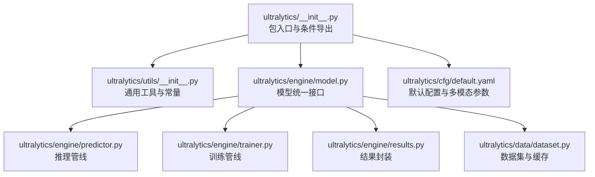
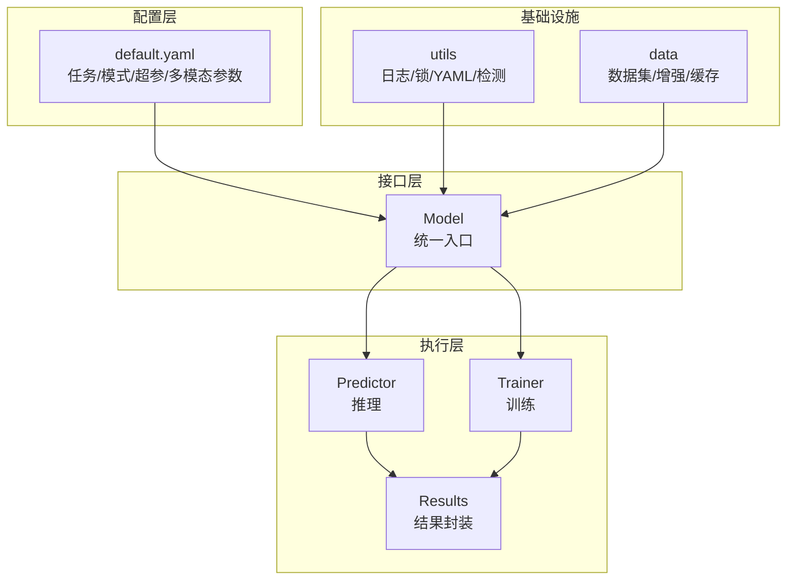
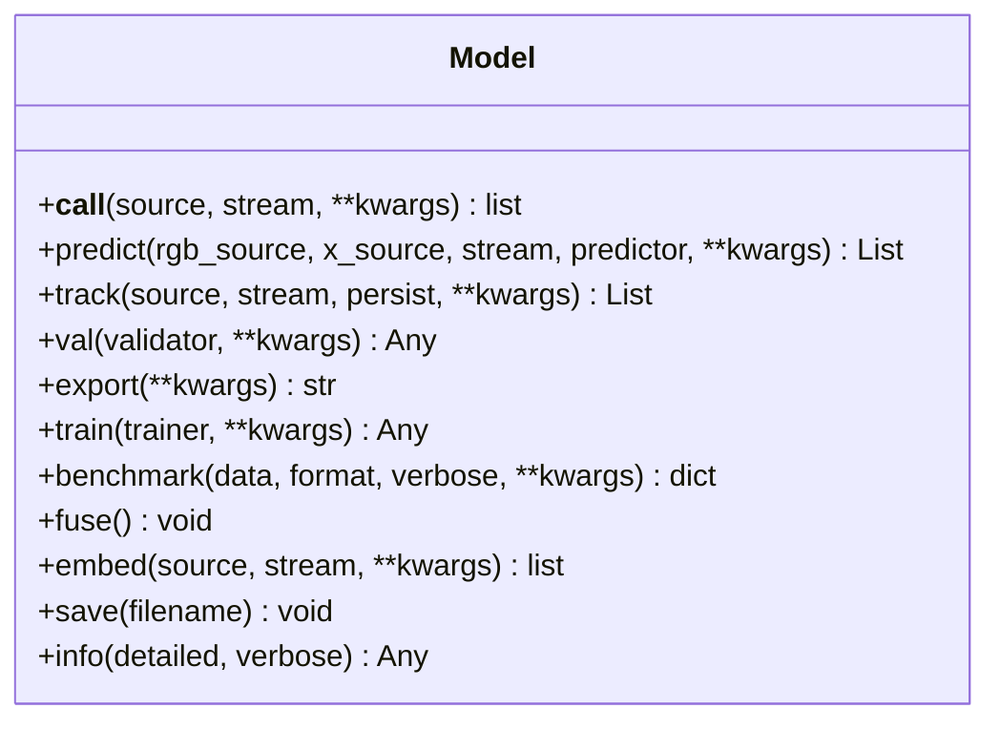
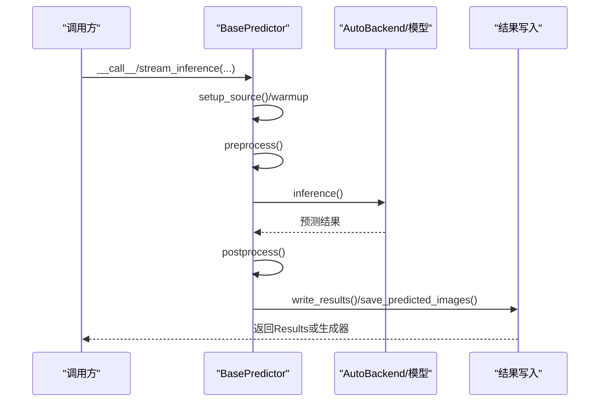
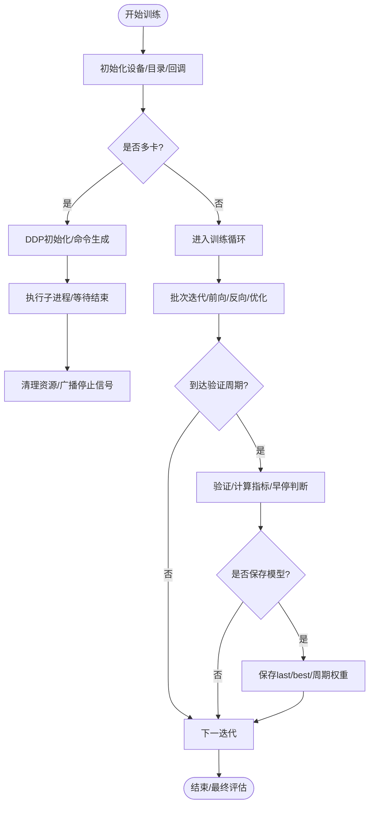
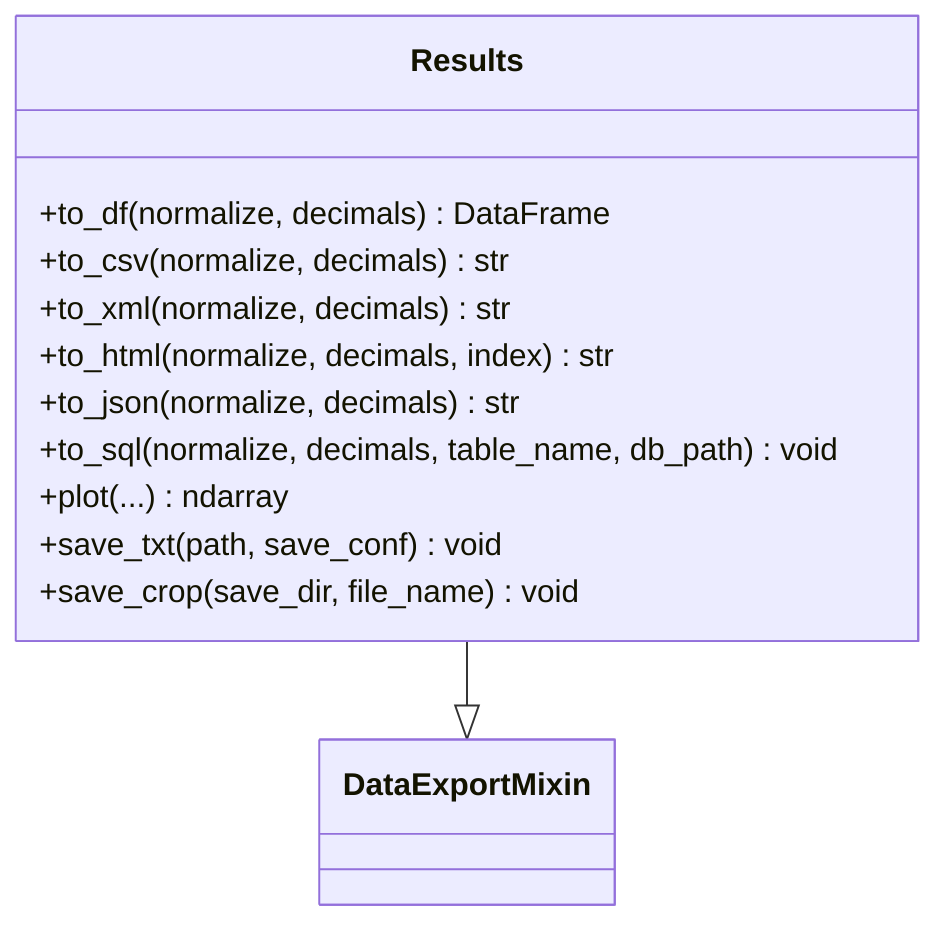
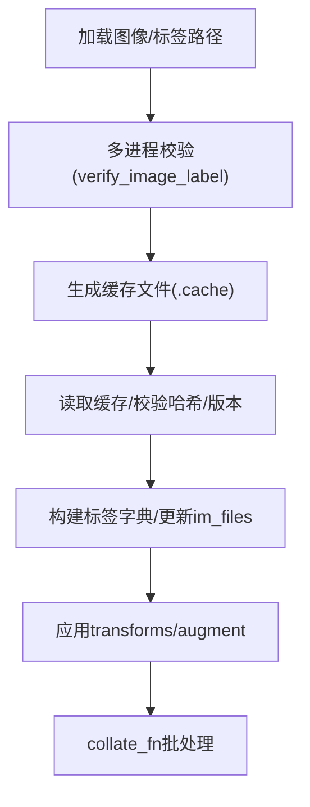
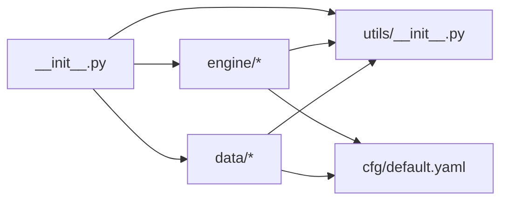

# 代码规范与约定

<cite>
**本文引用的文件**
- [ultralytics/__init__.py](file://ultralytics/__init__.py)
- [ultralytics/utils/__init__.py](file://ultralytics/utils/__init__.py)
- [ultralytics/utils/checks.py](file://ultralytics/utils/checks.py)
- [ultralytics/utils/errors.py](file://ultralytics/utils/errors.py)
- [ultralytics/engine/model.py](file://ultralytics/engine/model.py)
- [ultralytics/engine/predictor.py](file://ultralytics/engine/predictor.py)
- [ultralytics/engine/trainer.py](file://ultralytics/engine/trainer.py)
- [ultralytics/engine/results.py](file://ultralytics/engine/results.py)
- [ultralytics/data/dataset.py](file://ultralytics/data/dataset.py)
- [ultralytics/cfg/default.yaml](file://ultralytics/cfg/default.yaml)
</cite>

## 目录
1. [引言](#引言)
2. [项目结构](#项目结构)
3. [核心组件](#核心组件)
4. [架构总览](#架构总览)
5. [详细组件分析](#详细组件分析)
6. [依赖分析](#依赖分析)
7. [性能考虑](#性能考虑)
8. [故障排查指南](#故障排查指南)
9. [结论](#结论)
10. [附录](#附录)

## 引言
本指南面向多模态检测系统（基于Ultralytics YOLO框架扩展）的Python代码编写，旨在统一团队开发规范，提升代码一致性、可读性与可维护性。内容覆盖PEP8遵循要点、命名约定、注释与文档字符串规范、错误处理与异常使用、模块组织与导入顺序、以及代码审查清单与自动化质量工具配置建议。

## 项目结构
该多模态检测系统采用分层模块化设计：
- 引导与入口：顶层包初始化负责条件导入与动态导出清单
- 工具与通用能力：utils提供日志、线程锁、YAML、环境检测等基础能力
- 引擎层：engine封装训练、验证、预测、导出等核心流程
- 数据层：data提供数据集、增强、加载与转换
- 配置：cfg提供默认训练/推理参数与多模态扩展项
- 多模态扩展：在模型与数据层面引入RGB+X（热红外/深度等）融合与专用增强

**图示来源**
- [ultralytics/__init__.py:1-88](file://ultralytics/__init__.py#L1-L88)
- [ultralytics/utils/__init__.py:1-1600](file://ultralytics/utils/__init__.py#L1-L1600)
- [ultralytics/engine/model.py:1-1366](file://ultralytics/engine/model.py#L1-L1366)
- [ultralytics/engine/predictor.py:1-521](file://ultralytics/engine/predictor.py#L1-L521)
- [ultralytics/engine/trainer.py:1-901](file://ultralytics/engine/trainer.py#L1-L901)
- [ultralytics/engine/results.py:1-1664](file://ultralytics/engine/results.py#L1-L1664)
- [ultralytics/data/dataset.py:1-1535](file://ultralytics/data/dataset.py#L1-L1535)
- [ultralytics/cfg/default.yaml:1-168](file://ultralytics/cfg/default.yaml#L1-L168)

**章节来源**
- [ultralytics/__init__.py:1-88](file://ultralytics/__init__.py#L1-L88)
- [ultralytics/utils/__init__.py:1-1600](file://ultralytics/utils/__init__.py#L1-L1600)
- [ultralytics/cfg/default.yaml:1-168](file://ultralytics/cfg/default.yaml#L1-L168)

## 核心组件
- 包入口与条件导出：根据可用性动态导出YOLOMM/RTDETRMM/多模态生成器等模块，保证兼容性与最小暴露面
- 通用工具：日志、线程安全装饰器、YAML读写、环境检测、进度条封装等
- 模型统一接口：统一训练、验证、预测、导出、基准测试等入口，支持多模态输入
- 推理管线：预处理、模型推理、后处理、可视化与结果落盘
- 训练管线：分布式训练、AMP、早停、EMA、学习率调度、数据加载与验证
- 结果封装：统一Results对象，支持导出多种格式
- 数据集与缓存：标签缓存、校验、多进程扫描与批处理

**章节来源**
- [ultralytics/__init__.py:1-88](file://ultralytics/__init__.py#L1-L88)
- [ultralytics/utils/__init__.py:1-1600](file://ultralytics/utils/__init__.py#L1-L1600)
- [ultralytics/engine/model.py:1-1366](file://ultralytics/engine/model.py#L1-L1366)
- [ultralytics/engine/predictor.py:1-521](file://ultralytics/engine/predictor.py#L1-L521)
- [ultralytics/engine/trainer.py:1-901](file://ultralytics/engine/trainer.py#L1-L901)
- [ultralytics/engine/results.py:1-1664](file://ultralytics/engine/results.py#L1-L1664)
- [ultralytics/data/dataset.py:1-1535](file://ultralytics/data/dataset.py#L1-L1535)

## 架构总览
多模态检测系统遵循“配置驱动 + 统一接口 + 分层实现”的架构：
- 配置层：default.yaml集中管理任务、训练、验证、预测、导出、超参与多模态增强开关
- 接口层：Model统一对外API，内部路由到predictor/trainer/validator/exporter
- 执行层：predictor执行推理，trainer执行训练，results封装结果
- 基础设施：utils提供日志、线程锁、YAML、环境检测；data提供数据集与增强

**图示来源**
- [ultralytics/cfg/default.yaml:1-168](file://ultralytics/cfg/default.yaml#L1-L168)
- [ultralytics/engine/model.py:1-1366](file://ultralytics/engine/model.py#L1-L1366)
- [ultralytics/engine/predictor.py:1-521](file://ultralytics/engine/predictor.py#L1-L521)
- [ultralytics/engine/trainer.py:1-901](file://ultralytics/engine/trainer.py#L1-L901)
- [ultralytics/engine/results.py:1-1664](file://ultralytics/engine/results.py#L1-L1664)
- [ultralytics/utils/__init__.py:1-1600](file://ultralytics/utils/__init__.py#L1-L1600)
- [ultralytics/data/dataset.py:1-1535](file://ultralytics/data/dataset.py#L1-L1535)

## 详细组件分析

### 组件A：模型统一接口（Model）
职责与行为
- 支持从本地权重、HUB、Triton等多种来源加载模型
- 提供统一的训练、验证、预测、导出、基准测试、权重保存等接口
- 多模态推理支持显式RGB与X模态输入，参数校验与CLI适配
- 融合优化、嵌入提取、回调注册等高级功能

**图示来源**
- [ultralytics/engine/model.py:1-1366](file://ultralytics/engine/model.py#L1-L1366)

**章节来源**
- [ultralytics/engine/model.py:1-1366](file://ultralytics/engine/model.py#L1-L1366)

### 组件B：推理管线（BasePredictor）
职责与行为
- 输入源抽象与预处理（LetterBox、BGR转RGB、类型转换）
- 模型推理与后处理（可选可视化、嵌入提取）
- 流式推理与内存控制（长视频/大源需开启stream）
- 结果写入（文本框、裁剪、可视化、统计）

**图示来源**
- [ultralytics/engine/predictor.py:1-521](file://ultralytics/engine/predictor.py#L1-L521)

**章节来源**
- [ultralytics/engine/predictor.py:1-521](file://ultralytics/engine/predictor.py#L1-L521)

### 组件C：训练管线（BaseTrainer）
职责与行为
- 分布式训练初始化与命令生成
- AMP检查、梯度缩放、优化器与学习率调度
- 数据加载、验证、早停、EMA、断点续训
- 结果CSV记录、最佳/最后权重保存

**图示来源**
- [ultralytics/engine/trainer.py:1-901](file://ultralytics/engine/trainer.py#L1-L901)

**章节来源**
- [ultralytics/engine/trainer.py:1-901](file://ultralytics/engine/trainer.py#L1-L901)

### 组件D：结果封装（Results）
职责与行为
- 封装检测/分割/分类/姿态等结果
- 导出为DataFrame/CSV/XML/HTML/JSON/SQLite
- 可视化标注、坐标变换、设备迁移

**图示来源**
- [ultralytics/engine/results.py:1-1664](file://ultralytics/engine/results.py#L1-L1664)
- [ultralytics/utils/__init__.py:190-340](file://ultralytics/utils/__init__.py#L190-L340)

**章节来源**
- [ultralytics/engine/results.py:1-1664](file://ultralytics/engine/results.py#L1-L1664)
- [ultralytics/utils/__init__.py:190-340](file://ultralytics/utils/__init__.py#L190-L340)

### 组件E：数据集与缓存（YOLODataset）
职责与行为
- 标签缓存、完整性校验、多进程扫描
- 任务类型切换（检测/分割/姿态/OBB）
- 数据增强与格式化

**图示来源**
- [ultralytics/data/dataset.py:1-1535](file://ultralytics/data/dataset.py#L1-L1535)

**章节来源**
- [ultralytics/data/dataset.py:1-1535](file://ultralytics/data/dataset.py#L1-L1535)

## 依赖分析
- 包入口与条件导出：根据运行环境动态决定导出哪些模块，避免不必要的依赖
- 推理/训练/结果：均依赖utils中的日志、线程锁、YAML、环境检测等
- 数据层：依赖utils中的工具与ops，结合增强模块进行数据准备
- 配置：default.yaml集中管理所有参数，训练/推理/导出均以配置为驱动

**图示来源**
- [ultralytics/__init__.py:1-88](file://ultralytics/__init__.py#L1-L88)
- [ultralytics/utils/__init__.py:1-1600](file://ultralytics/utils/__init__.py#L1-L1600)
- [ultralytics/cfg/default.yaml:1-168](file://ultralytics/cfg/default.yaml#L1-L168)

**章节来源**
- [ultralytics/__init__.py:1-88](file://ultralytics/__init__.py#L1-L88)
- [ultralytics/utils/__init__.py:1-1600](file://ultralytics/utils/__init__.py#L1-L1600)
- [ultralytics/cfg/default.yaml:1-168](file://ultralytics/cfg/default.yaml#L1-L168)

## 性能考虑
- AMP与混合精度：训练阶段自动检查AMP兼容性，不兼容时禁用以避免NaN/零mAP
- 内存管理：训练中定期清理缓存，避免VRAM峰值过高
- 多尺度与矩形训练：通过配置启用以提升吞吐
- 线程与并行：NUM_THREADS与NUMEXPR_MAX_THREADS限制，避免OpenCV多线程冲突
- 推理加速：warmup、融合Conv/BN、半精度（可选）、设备选择

**章节来源**
- [ultralytics/utils/checks.py:727-800](file://ultralytics/utils/checks.py#L727-L800)
- [ultralytics/engine/trainer.py:505-541](file://ultralytics/engine/trainer.py#L505-L541)
- [ultralytics/utils/__init__.py:30-52](file://ultralytics/utils/__init__.py#L30-L52)
- [ultralytics/engine/predictor.py:276-391](file://ultralytics/engine/predictor.py#L276-L391)

## 故障排查指南
常见问题与定位
- 模型加载失败：检查模型路径、后缀、下载与缓存
- 环境不满足：Python版本、依赖版本、CUDA/TensorRT/OpenCV等
- AMP异常：某些GPU组合可能导致NaN/零mAP，系统会自动禁用AMP
- 多模态输入缺失：多模态推理需至少提供RGB或X其一，否则抛出参数错误
- 权重/配置不匹配：断点续训时禁止修改架构相关参数（如scale）

建议排查步骤
- 使用环境检查工具：打印系统信息、依赖版本、GPU/CPU/磁盘状态
- 启用调试日志：通过配置项开启DEBUG日志
- 逐步缩小范围：先单图/小批量验证，再扩大规模
- 核对配置：确认default.yaml中关键参数（imgsz、batch、device、amp等）

**章节来源**
- [ultralytics/utils/checks.py:632-724](file://ultralytics/utils/checks.py#L632-L724)
- [ultralytics/engine/model.py:540-548](file://ultralytics/engine/model.py#L540-L548)
- [ultralytics/utils/errors.py:1-44](file://ultralytics/utils/errors.py#L1-L44)

## 结论
本指南总结了多模态检测系统在Python编码方面的规范与约定，涵盖命名、注释、错误处理、模块组织与配置驱动等关键方面。遵循这些约定有助于提升代码一致性、可读性与可维护性，降低协作成本与回归风险。

## 附录

### A. Python编码规范与PEP8遵循要点
- 缩进与行宽：统一使用4空格缩进，行宽不超过100字符（必要时允许120）
- 空行：模块级函数/类之间留空行，方法内逻辑分组清晰
- 导入顺序：标准库、第三方库、项目内相对导入分组，每组内字母序排列
- 命名约定
  - 模块与包：全小写，必要时以下划线分隔
  - 类名：PascalCase
  - 函数/方法/属性：snake_case
  - 常量：UPPER_CASE
  - 私有成员：_private
- 行内注释：简要解释复杂表达式或边界条件
- 文档字符串：模块、类、函数均应提供中文文档字符串，描述用途、参数、返回值与异常

**章节来源**
- [ultralytics/engine/model.py:1-1366](file://ultralytics/engine/model.py#L1-L1366)
- [ultralytics/engine/predictor.py:1-521](file://ultralytics/engine/predictor.py#L1-L521)
- [ultralytics/engine/trainer.py:1-901](file://ultralytics/engine/trainer.py#L1-L901)
- [ultralytics/engine/results.py:1-1664](file://ultralytics/engine/results.py#L1-L1664)
- [ultralytics/data/dataset.py:1-1535](file://ultralytics/data/dataset.py#L1-L1535)

### B. 注释与文档字符串标准
- 模块注释：文件头部包含许可证与简要说明
- 类注释：描述职责、关键属性与方法用途
- 函数/方法注释：参数类型与含义、返回值、异常、使用示例
- 配置注释：default.yaml中每个键值提供用途说明与取值范围

**章节来源**
- [ultralytics/cfg/default.yaml:1-168](file://ultralytics/cfg/default.yaml#L1-L168)

### C. 错误处理与异常规范
- 自定义异常：使用语义明确的异常类（如HUBModelError），消息经emoji处理增强可读性
- 断言与警告：对非法输入与配置进行断言与警告，避免静默失败
- 环境检查：在训练/推理前进行依赖与硬件检查，失败时给出明确提示

**章节来源**
- [ultralytics/utils/errors.py:1-44](file://ultralytics/utils/errors.py#L1-L44)
- [ultralytics/utils/checks.py:1-950](file://ultralytics/utils/checks.py#L1-L950)

### D. 代码组织与模块划分最佳实践
- 文件命名：模块小写，类文件与功能模块分离
- 目录结构：按功能域分层（engine/data/utils/cfg），避免循环依赖
- 导入顺序：标准库→第三方→项目内相对导入，组间空行分隔
- 动态导出：通过__all__与条件导入控制公开接口，减少全局污染

**章节来源**
- [ultralytics/__init__.py:1-88](file://ultralytics/__init__.py#L1-L88)
- [ultralytics/utils/__init__.py:1-1600](file://ultralytics/utils/__init__.py#L1-L1600)

### E. 代码审查检查清单
- 规范性
  - 是否遵循PEP8与本指南命名/注释/导入顺序
  - 是否提供必要的文档字符串与类型注解
- 正确性
  - 参数校验与边界条件处理
  - 异常分支与错误消息是否清晰
- 可维护性
  - 模块职责单一，避免过深嵌套
  - 配置驱动，避免硬编码
- 性能与稳定性
  - 是否合理使用AMP、缓存与并行
  - 是否存在内存泄漏或资源未释放

### F. 自动化代码质量工具配置建议
- Lint：flake8/PyFlakes + pycodestyle（基于PEP8），配置忽略规则与最大行宽
- 格式化：black（或isort+autopep8）统一风格
- 类型检查：mypy（针对关键模块）
- 提交前钩子：pre-commit集成上述工具，确保提交质量
- CI：在CI中执行lint/format/typecheck，失败即阻断合并