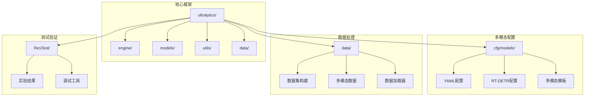
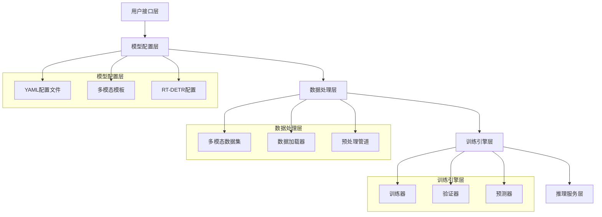
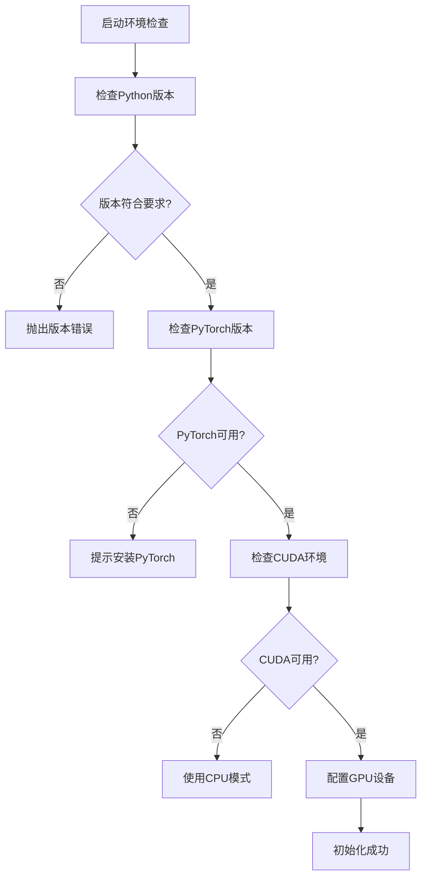
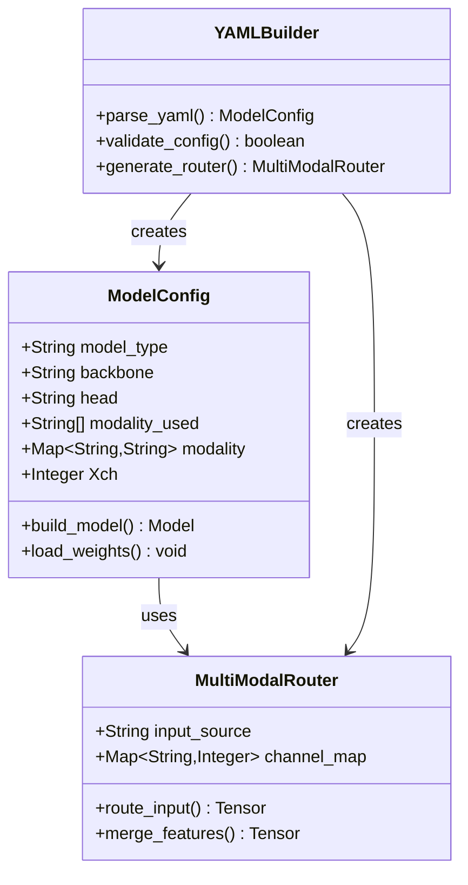
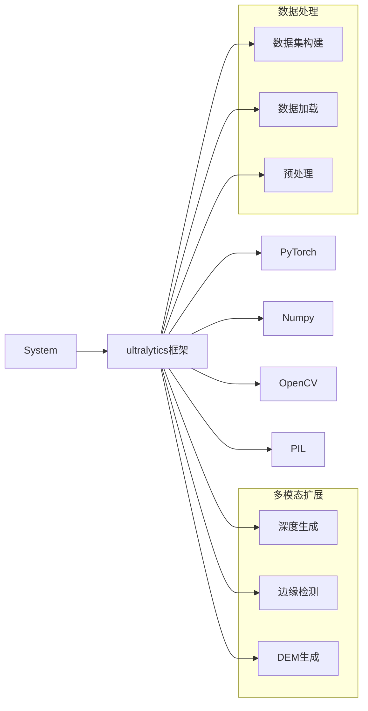
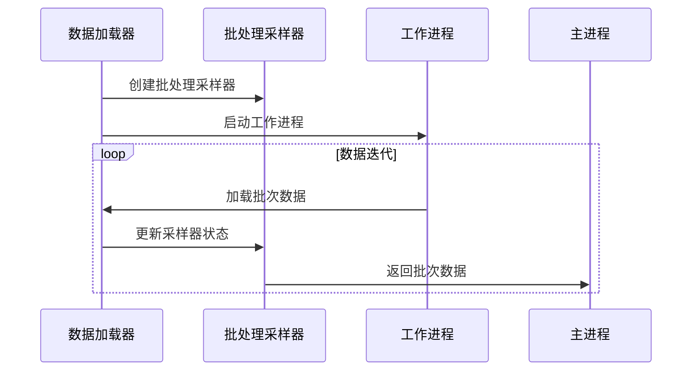

# 开发环境搭建

<cite>
**本文档引用的文件**
- [ultralytics/__init__.py](file://ultralytics/__init__.py)
- [ultralytics/utils/checks.py](file://ultralytics/utils/checks.py)
- [ultralytics/utils/torch_utils.py](file://ultralytics/utils/torch_utils.py)
- [ultralytics/utils/__init__.py](file://ultralytics/utils/__init__.py)
- [ultralytics/data/build.py](file://ultralytics/data/build.py)
- [ultralytics/cfg/models/README.md](file://ultralytics/cfg/models/README.md)
- [ultralytics/cfg/models/多模态YAML构建指点.md](file://ultralytics/cfg/models/多模态YAML构建指点.md)
- [ultralytics/cfg/models/rtmm/说明.md](file://ultralytics/cfg/models/rtmm/说明.md)
- [data(参考性质).yaml](file://data(参考性质).yaml)
</cite>

## 目录
1. [简介](#简介)
2. [项目结构](#项目结构)
3. [核心组件](#核心组件)
4. [架构概览](#架构概览)
5. [详细组件分析](#详细组件分析)
6. [依赖关系分析](#依赖关系分析)
7. [性能考虑](#性能考虑)
8. [故障排除指南](#故障排除指南)
9. [结论](#结论)

## 简介

本指南面向多模态检测系统的开发者，提供完整的开发环境搭建方案。该系统基于Ultralytics YOLO框架，支持RGB+红外多模态目标检测，包含丰富的模型配置和数据处理能力。

## 项目结构

多模态检测系统采用模块化架构设计：

**图表来源**
- [ultralytics/__init__.py:1-88](file://ultralytics/__init__.py#L1-L88)
- [ultralytics/cfg/models/README.md:1-66](file://ultralytics/cfg/models/README.md#L1-L66)

**章节来源**
- [ultralytics/__init__.py:1-88](file://ultralytics/__init__.py#L1-L88)
- [ultralytics/cfg/models/README.md:1-66](file://ultralytics/cfg/models/README.md#L1-L66)

## 核心组件

### 环境要求

系统对Python版本和PyTorch版本有严格要求：

- **Python版本**: ≥ 3.8.0（推荐3.8+）
- **PyTorch版本**: 支持多个版本，包括1.9.0+、2.0.0+、2.4.0+
- **CUDA环境**: 可选，用于GPU加速训练和推理

### 依赖管理

系统提供了多种依赖安装方式：

1. **requirements.txt文件**: 标准的pip依赖管理
2. **uv包管理器**: 现代化的Python包安装工具
3. **手动安装**: 针对特定版本的手动安装

**章节来源**
- [ultralytics/utils/checks.py:343-356](file://ultralytics/utils/checks.py#L343-L356)
- [ultralytics/utils/checks.py:359-436](file://ultralytics/utils/checks.py#L359-L436)
- [ultralytics/utils/checks.py:170-176](file://ultralytics/utils/checks.py#L170-L176)

## 架构概览

多模态检测系统的核心架构包括以下关键层次：

**图表来源**
- [ultralytics/cfg/models/多模态YAML构建指点.md:1-239](file://ultralytics/cfg/models/多模态YAML构建指点.md#L1-L239)
- [ultralytics/data/build.py:115-257](file://ultralytics/data/build.py#L115-L257)

## 详细组件分析

### 环境检查系统

系统内置了完善的环境检查机制，确保运行环境满足要求：

**图表来源**
- [ultralytics/utils/checks.py:343-356](file://ultralytics/utils/checks.py#L343-L356)
- [ultralytics/utils/torch_utils.py:131-252](file://ultralytics/utils/torch_utils.py#L131-L252)

### 多模态数据配置

系统支持灵活的多模态数据配置，主要特点包括：

- **模态组合**: 支持RGB+红外等多种模态组合
- **通道配置**: 可配置X模态的通道数量（Xch）
- **路径映射**: 灵活的数据路径配置
- **类别定义**: 自定义目标类别

**章节来源**
- [data(参考性质).yaml:1-28](file://data(参考性质).yaml#L1-L28)
- [ultralytics/cfg/models/多模态YAML构建指点.md:165-178](file://ultralytics/cfg/models/多模态YAML构建指点.md#L165-L178)

### 模型配置系统

系统提供完整的模型配置支持：

**图表来源**
- [ultralytics/cfg/models/多模态YAML构建指点.md:20-65](file://ultralytics/cfg/models/多模态YAML构建指点.md#L20-L65)
- [ultralytics/cfg/models/README.md:43-55](file://ultralytics/cfg/models/README.md#L43-L55)

**章节来源**
- [ultralytics/cfg/models/多模态YAML构建指点.md:1-239](file://ultralytics/cfg/models/多模态YAML构建指点.md#L1-L239)
- [ultralytics/cfg/models/rtmm/说明.md:1-28](file://ultralytics/cfg/models/rtmm/说明.md#L1-L28)

## 依赖关系分析

系统依赖关系呈现层次化结构：

**图表来源**
- [ultralytics/__init__.py:12-16](file://ultralytics/__init__.py#L12-L16)
- [ultralytics/utils/__init__.py:22-25](file://ultralytics/utils/__init__.py#L22-L25)

**章节来源**
- [ultralytics/__init__.py:1-88](file://ultralytics/__init__.py#L1-L88)
- [ultralytics/utils/__init__.py:1-800](file://ultralytics/utils/__init__.py#L1-L800)

## 性能考虑

### CUDA环境优化

系统提供了智能的CUDA设备选择和管理：

- **自动设备检测**: 智能检测可用的GPU设备
- **内存管理**: 动态内存分配和管理
- **多GPU支持**: 支持分布式训练
- **性能监控**: 实时监控GPU使用情况

### 数据加载优化

**图表来源**
- [ultralytics/data/build.py:291-328](file://ultralytics/data/build.py#L291-L328)

**章节来源**
- [ultralytics/utils/torch_utils.py:131-252](file://ultralytics/utils/torch_utils.py#L131-L252)
- [ultralytics/data/build.py:1-422](file://ultralytics/data/build.py#L1-L422)

## 故障排除指南

### 常见环境问题及解决方案

#### Python版本不兼容
- **问题**: Python版本低于3.8.0
- **解决方案**: 升级Python到3.8或更高版本
- **验证命令**: `python --version`

#### PyTorch安装问题
- **问题**: PyTorch无法正常导入
- **解决方案**: 
  1. 检查PyTorch版本兼容性
  2. 确认CUDA版本匹配
  3. 重新安装PyTorch

#### CUDA版本不匹配
- **问题**: CUDA版本与PyTorch不兼容
- **解决方案**:
  1. 查看PyTorch官方兼容性表
  2. 安装对应版本的CUDA
  3. 验证CUDA安装

#### 依赖冲突
- **问题**: 包依赖版本冲突
- **解决方案**:
  1. 使用uv包管理器替代pip
  2. 清理缓存重新安装
  3. 创建独立虚拟环境

#### 多模态配置错误
- **问题**: YAML配置文件格式错误
- **解决方案**:
  1. 检查第5字段路由标记
  2. 验证通道数配置
  3. 确认模态路径正确

**章节来源**
- [ultralytics/utils/checks.py:415-436](file://ultralytics/utils/checks.py#L415-L436)
- [ultralytics/utils/checks.py:849-887](file://ultralytics/utils/checks.py#L849-L887)
- [ultralytics/cfg/models/多模态YAML构建指点.md:206-217](file://ultralytics/cfg/models/多模态YAML构建指点.md#L206-L217)

## 结论

多模态检测系统的开发环境搭建相对复杂，但系统提供了完善的自动化检查和配置机制。通过遵循本指南的步骤，开发者可以快速搭建稳定可靠的开发环境。

关键要点总结：
1. 确保Python 3.8+和兼容的PyTorch版本
2. 合理配置CUDA环境（可选但推荐）
3. 使用uv包管理器提高安装效率
4. 仔细配置多模态数据和模型参数
5. 建立完善的测试和验证流程

系统的设计充分考虑了多模态场景的特殊需求，提供了灵活的配置选项和强大的扩展能力，能够满足各种复杂的多模态检测任务需求。