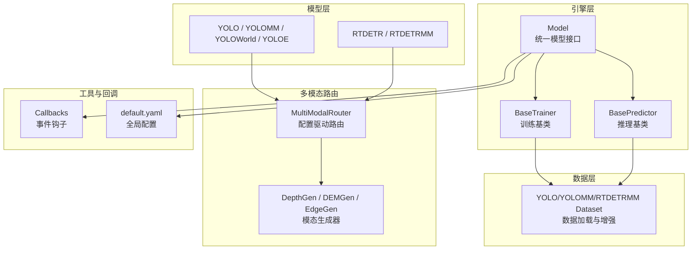
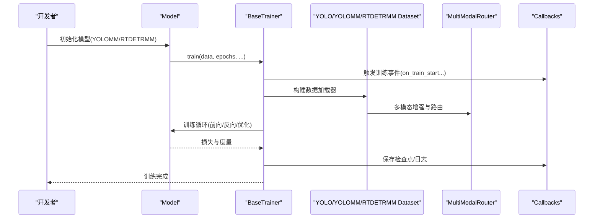
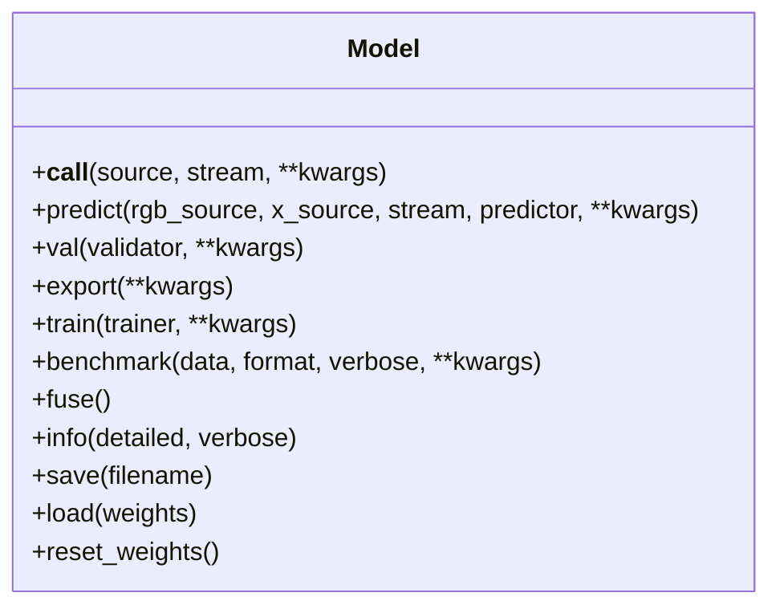
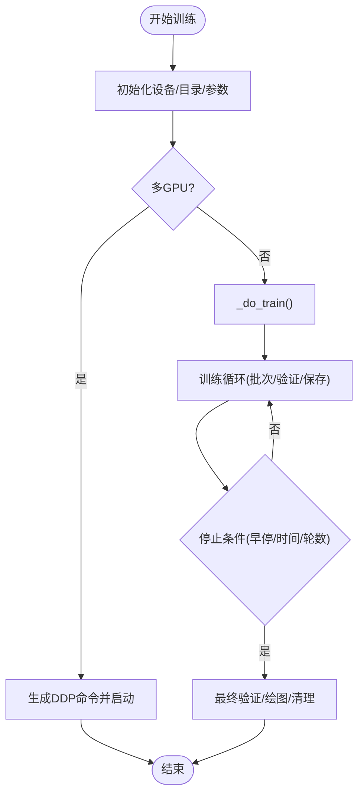
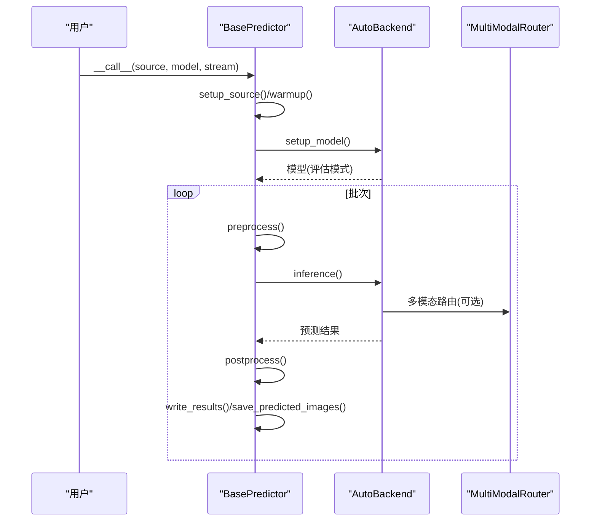
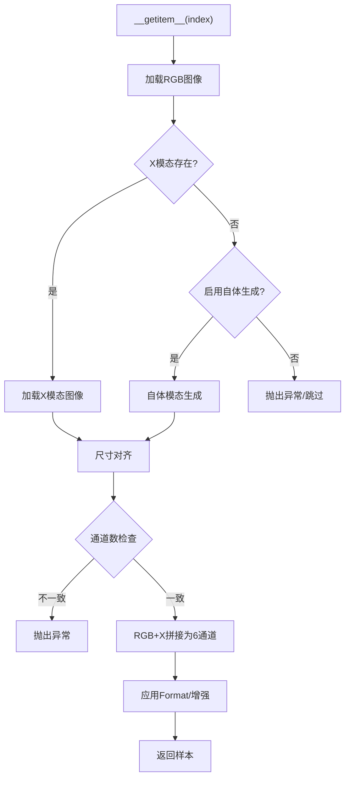
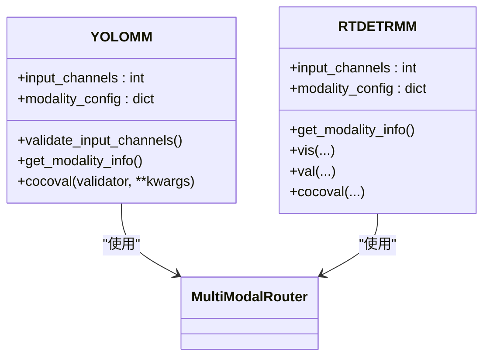
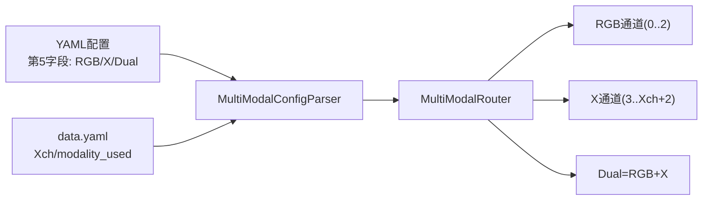
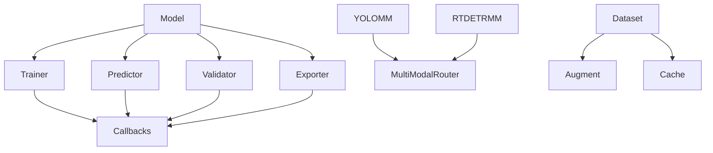

# 开发者指南

<cite>
**本文档引用的文件**
- [ultralytics/__init__.py](file://ultralytics/__init__.py)
- [ultralytics/engine/model.py](file://ultralytics/engine/model.py)
- [ultralytics/engine/trainer.py](file://ultralytics/engine/trainer.py)
- [ultralytics/engine/predictor.py](file://ultralytics/engine/predictor.py)
- [ultralytics/data/dataset.py](file://ultralytics/data/dataset.py)
- [ultralytics/models/yolo/model.py](file://ultralytics/models/yolo/model.py)
- [ultralytics/models/rtdetrmm/model.py](file://ultralytics/models/rtdetrmm/model.py)
- [ultralytics/nn/mm/__init__.py](file://ultralytics/nn/mm/__init__.py)
- [ultralytics/utils/callbacks/base.py](file://ultralytics/utils/callbacks/base.py)
- [ultralytics/utils/callbacks/__init__.py](file://ultralytics/utils/callbacks/__init__.py)
- [ultralytics/cfg/default.yaml](file://ultralytics/cfg/default.yaml)
- [ultralytics/cfg/models/多模态YAML构建指点.md](file://ultralytics/cfg/models/多模态YAML构建指点.md)
</cite>

## 目录
1. [简介](#简介)
2. [项目结构](#项目结构)
3. [核心组件](#核心组件)
4. [架构总览](#架构总览)
5. [详细组件分析](#详细组件分析)
6. [依赖关系分析](#依赖关系分析)
7. [性能考量](#性能考量)
8. [故障排除指南](#故障排除指南)
9. [结论](#结论)
10. [附录](#附录)

## 简介
本指南面向多模态检测系统的开发者，覆盖开发环境搭建、代码规范与约定、测试框架使用、新功能开发指导以及贡献与代码审查流程。系统基于 Ultralytics 生态，重点支持 YOLO 与 RT-DETR 的多模态扩展（RGB+X），并通过配置驱动的 MultiModalRouter 实现零拷贝路由与灵活的融合策略。

## 项目结构
项目采用模块化分层设计：
- 引擎层：统一的 Model、Trainer、Predictor 抽象，支持多任务与多模型族
- 数据层：YOLO/YOLOMM/RTDETRMM 数据集与增强流水线
- 模型层：YOLO、YOLOMM、YOLOWorld、YOLOE、RTDETR、RTDETRMM 等
- 多模态路由：MultiModalRouter、配置解析与生成器
- 工具与回调：默认回调、配置、日志与可视化

**图表来源**
- [ultralytics/engine/model.py:29-80](file://ultralytics/engine/model.py#L29-L80)
- [ultralytics/engine/trainer.py:59-108](file://ultralytics/engine/trainer.py#L59-L108)
- [ultralytics/engine/predictor.py:67-107](file://ultralytics/engine/predictor.py#L67-L107)
- [ultralytics/data/dataset.py:52-94](file://ultralytics/data/dataset.py#L52-L94)
- [ultralytics/models/yolo/model.py:27-53](file://ultralytics/models/yolo/model.py#L27-L53)
- [ultralytics/models/rtdetrmm/model.py:25-57](file://ultralytics/models/rtdetrmm/model.py#L25-L57)
- [ultralytics/nn/mm/__init__.py:1-78](file://ultralytics/nn/mm/__init__.py#L1-L78)
- [ultralytics/utils/callbacks/base.py:144-191](file://ultralytics/utils/callbacks/base.py#L144-L191)
- [ultralytics/cfg/default.yaml:1-168](file://ultralytics/cfg/default.yaml#L1-L168)

**章节来源**
- [ultralytics/engine/model.py:29-80](file://ultralytics/engine/model.py#L29-L80)
- [ultralytics/engine/trainer.py:59-108](file://ultralytics/engine/trainer.py#L59-L108)
- [ultralytics/engine/predictor.py:67-107](file://ultralytics/engine/predictor.py#L67-L107)
- [ultralytics/data/dataset.py:52-94](file://ultralytics/data/dataset.py#L52-L94)
- [ultralytics/models/yolo/model.py:27-53](file://ultralytics/models/yolo/model.py#L27-L53)
- [ultralytics/models/rtdetrmm/model.py:25-57](file://ultralytics/models/rtdetrmm/model.py#L25-L57)
- [ultralytics/nn/mm/__init__.py:1-78](file://ultralytics/nn/mm/__init__.py#L1-L78)
- [ultralytics/utils/callbacks/base.py:144-191](file://ultralytics/utils/callbacks/base.py#L144-L191)
- [ultralytics/cfg/default.yaml:1-168](file://ultralytics/cfg/default.yaml#L1-L168)

## 核心组件
- Model 统一入口：封装训练、验证、预测、导出、基准测试等能力，支持多模型族与多任务
- BaseTrainer 训练基类：分布式训练、优化器、学习率调度、早停、EMA、回调集成
- BasePredictor 推理基类：输入源抽象、预处理、推理、后处理、可视化与结果保存
- YOLO/YOLOMM/YOLOWorld/YOLOE/RTDETR/RTDETRMM：针对不同任务与架构的特化实现
- YOLOMultiModalImageDataset：RGB+X 双模态数据集，支持多模态增强、缓存与自体模态生成
- MultiModalRouter：配置驱动的零拷贝路由系统，支持 RGB/X/Dual 三种输入源
- 默认回调与配置：标准化事件钩子与全局参数，支持多模态扩展参数

**章节来源**
- [ultralytics/engine/model.py:29-80](file://ultralytics/engine/model.py#L29-L80)
- [ultralytics/engine/trainer.py:59-108](file://ultralytics/engine/trainer.py#L59-L108)
- [ultralytics/engine/predictor.py:67-107](file://ultralytics/engine/predictor.py#L67-L107)
- [ultralytics/data/dataset.py:423-470](file://ultralytics/data/dataset.py#L423-L470)
- [ultralytics/models/yolo/model.py:456-530](file://ultralytics/models/yolo/model.py#L456-L530)
- [ultralytics/models/rtdetrmm/model.py:25-57](file://ultralytics/models/rtdetrmm/model.py#L25-L57)
- [ultralytics/nn/mm/__init__.py:1-78](file://ultralytics/nn/mm/__init__.py#L1-L78)
- [ultralytics/utils/callbacks/base.py:144-191](file://ultralytics/utils/callbacks/base.py#L144-L191)
- [ultralytics/cfg/default.yaml:134-168](file://ultralytics/cfg/default.yaml#L134-L168)

## 架构总览
多模态检测系统通过配置驱动的路由机制实现 RGB 与 X 模态的灵活融合。训练与推理均通过统一的 Model 接口调用，数据层提供多模态增强与缓存，模型层支持 YOLO 与 RT-DETR 的多模态变体。

**图表来源**
- [ultralytics/engine/model.py:791-800](file://ultralytics/engine/model.py#L791-L800)
- [ultralytics/engine/trainer.py:191-228](file://ultralytics/engine/trainer.py#L191-L228)
- [ultralytics/data/dataset.py:595-629](file://ultralytics/data/dataset.py#L595-L629)
- [ultralytics/nn/mm/__init__.py:29-43](file://ultralytics/nn/mm/__init__.py#L29-L43)
- [ultralytics/utils/callbacks/base.py:144-191](file://ultralytics/utils/callbacks/base.py#L144-L191)

## 详细组件分析

### Model 统一模型接口
- 统一训练/验证/预测/导出/基准测试入口
- 条件导入 YOLOMM、RTDETRMM、DepthGen、DEMGen、EdgeGen
- 支持 HUB 模型与 Triton Server 模型识别

**图表来源**
- [ultralytics/engine/model.py:29-80](file://ultralytics/engine/model.py#L29-L80)
- [ultralytics/engine/model.py:498-580](file://ultralytics/engine/model.py#L498-L580)
- [ultralytics/engine/model.py:625-690](file://ultralytics/engine/model.py#L625-L690)
- [ultralytics/engine/model.py:743-790](file://ultralytics/engine/model.py#L743-L790)

**章节来源**
- [ultralytics/engine/model.py:29-80](file://ultralytics/engine/model.py#L29-L80)
- [ultralytics/engine/model.py:498-580](file://ultralytics/engine/model.py#L498-L580)
- [ultralytics/engine/model.py:625-690](file://ultralytics/engine/model.py#L625-L690)
- [ultralytics/engine/model.py:743-790](file://ultralytics/engine/model.py#L743-L790)
- [ultralytics/__init__.py:14-85](file://ultralytics/__init__.py#L14-L85)

### BaseTrainer 训练基类
- 分布式训练、自动批大小、AMP、EMA、早停
- 优化器与学习率调度、冻结层、验证与日志
- 回调系统与训练进度可视化

**图表来源**
- [ultralytics/engine/trainer.py:191-228](file://ultralytics/engine/trainer.py#L191-L228)
- [ultralytics/engine/trainer.py:344-503](file://ultralytics/engine/trainer.py#L344-L503)

**章节来源**
- [ultralytics/engine/trainer.py:59-108](file://ultralytics/engine/trainer.py#L59-L108)
- [ultralytics/engine/trainer.py:191-228](file://ultralytics/engine/trainer.py#L191-L228)
- [ultralytics/engine/trainer.py:344-503](file://ultralytics/engine/trainer.py#L344-L503)

### BasePredictor 推理基类
- 输入源抽象（图像/视频/目录/流）、预处理、推理、后处理
- 可视化、结果保存、线程安全与 Profiler

**图表来源**
- [ultralytics/engine/predictor.py:208-228](file://ultralytics/engine/predictor.py#L208-L228)
- [ultralytics/engine/predictor.py:276-390](file://ultralytics/engine/predictor.py#L276-L390)
- [ultralytics/engine/predictor.py:392-416](file://ultralytics/engine/predictor.py#L392-L416)

**章节来源**
- [ultralytics/engine/predictor.py:67-107](file://ultralytics/engine/predictor.py#L67-L107)
- [ultralytics/engine/predictor.py:208-228](file://ultralytics/engine/predictor.py#L208-L228)
- [ultralytics/engine/predictor.py:276-390](file://ultralytics/engine/predictor.py#L276-L390)
- [ultralytics/engine/predictor.py:392-416](file://ultralytics/engine/predictor.py#L392-L416)

### YOLOMultiModalImageDataset 多模态数据集
- 支持 RGB+X 双模态图像（6通道合成）
- 多模态增强、缓存与自体模态生成
- 严格通道一致性检查与有效索引扫描

**图表来源**
- [ultralytics/data/dataset.py:567-594](file://ultralytics/data/dataset.py#L567-L594)
- [ultralytics/data/dataset.py:693-780](file://ultralytics/data/dataset.py#L693-L780)

**章节来源**
- [ultralytics/data/dataset.py:423-470](file://ultralytics/data/dataset.py#L423-L470)
- [ultralytics/data/dataset.py:567-594](file://ultralytics/data/dataset.py#L567-L594)
- [ultralytics/data/dataset.py:693-780](file://ultralytics/data/dataset.py#L693-L780)

### YOLOMM 与 RTDETRMM 模型
- YOLOMM：支持 RGB-only(3) 与 RGB+X(6) 输入，自动检测配置中的多模态层
- RTDETRMM：独立家族，Fail-Fast 识别多模态结构，确保 mm_router 可用

**图表来源**
- [ultralytics/models/yolo/model.py:456-530](file://ultralytics/models/yolo/model.py#L456-L530)
- [ultralytics/models/rtdetrmm/model.py:25-57](file://ultralytics/models/rtdetrmm/model.py#L25-L57)
- [ultralytics/models/rtdetrmm/model.py:181-188](file://ultralytics/models/rtdetrmm/model.py#L181-L188)

**章节来源**
- [ultralytics/models/yolo/model.py:456-530](file://ultralytics/models/yolo/model.py#L456-L530)
- [ultralytics/models/rtdetrmm/model.py:25-57](file://ultralytics/models/rtdetrmm/model.py#L25-L57)
- [ultralytics/models/rtdetrmm/model.py:181-188](file://ultralytics/models/rtdetrmm/model.py#L181-L188)

### MultiModalRouter 与配置驱动
- 零拷贝路由、配置解析、模态信息查询
- 支持 RGB、X、Dual 三种输入源，通道数由 YAML 第5字段与 data.yaml 的 Xch 决定

**图表来源**
- [ultralytics/nn/mm/__init__.py:29-43](file://ultralytics/nn/mm/__init__.py#L29-L43)
- [ultralytics/cfg/models/多模态YAML构建指点.md:20-36](file://ultralytics/cfg/models/多模态YAML构建指点.md#L20-L36)
- [ultralytics/cfg/default.yaml:165-168](file://ultralytics/cfg/default.yaml#L165-L168)

**章节来源**
- [ultralytics/nn/mm/__init__.py:1-78](file://ultralytics/nn/mm/__init__.py#L1-L78)
- [ultralytics/cfg/models/多模态YAML构建指点.md:1-239](file://ultralytics/cfg/models/多模态YAML构建指点.md#L1-L239)
- [ultralytics/cfg/default.yaml:134-168](file://ultralytics/cfg/default.yaml#L134-L168)

## 依赖关系分析
- Model 依赖 Trainer/Predictor/Validator/Exporter 的动态加载
- YOLOMM/RTDETRMM 依赖 MultiModalRouter 与多模态增强
- 数据集依赖增强流水线与缓存系统
- 回调系统贯穿训练/验证/推理/导出生命周期

**图表来源**
- [ultralytics/engine/model.py:11-26](file://ultralytics/engine/model.py#L11-L26)
- [ultralytics/models/yolo/model.py:82-88](file://ultralytics/models/yolo/model.py#L82-L88)
- [ultralytics/models/rtdetrmm/model.py:16-22](file://ultralytics/models/rtdetrmm/model.py#L16-L22)
- [ultralytics/data/dataset.py:26-46](file://ultralytics/data/dataset.py#L26-L46)
- [ultralytics/utils/callbacks/base.py:144-191](file://ultralytics/utils/callbacks/base.py#L144-L191)

**章节来源**
- [ultralytics/engine/model.py:11-26](file://ultralytics/engine/model.py#L11-L26)
- [ultralytics/models/yolo/model.py:82-88](file://ultralytics/models/yolo/model.py#L82-L88)
- [ultralytics/models/rtdetrmm/model.py:16-22](file://ultralytics/models/rtdetrmm/model.py#L16-L22)
- [ultralytics/data/dataset.py:26-46](file://ultralytics/data/dataset.py#L26-L46)
- [ultralytics/utils/callbacks/base.py:144-191](file://ultralytics/utils/callbacks/base.py#L144-L191)

## 性能考量
- 混合精度训练（AMP）与 EMA 提升收敛稳定性
- 分布式训练与梯度累积减少显存占用
- 多模态增强中的异步几何扰动与模态擦除需权衡速度与鲁棒性
- 推理阶段 warmup 与 profiler 有助于定位瓶颈

[本节为通用指导，无需特定文件引用]

## 故障排除指南
- 通道不匹配：检查 data.yaml 的 Xch 与 YAML 第5字段标注，确保仅在输入起点使用 Dual
- 模块未导入：确认模块在相应 __init__.py 中导出
- 多模态验证：RTDETRMM 默认 rect=False，避免非方形输入导致 mAP 异常
- 回调与日志：通过 debug 与 profile 参数开启诊断输出

**章节来源**
- [ultralytics/cfg/models/多模态YAML构建指点.md:206-217](file://ultralytics/cfg/models/多模态YAML构建指点.md#L206-L217)
- [ultralytics/models/rtdetrmm/model.py:234-235](file://ultralytics/models/rtdetrmm/model.py#L234-L235)
- [ultralytics/cfg/default.yaml:29-29](file://ultralytics/cfg/default.yaml#L29-L29)

## 结论
本指南提供了多模态检测系统从环境搭建到开发实践的完整路径。通过统一的 Model 接口、配置驱动的 MultiModalRouter 与完善的训练/推理管线，开发者可以高效地扩展与优化多模态模型。建议在新功能开发中遵循模块化、可配置与可验证的原则，确保向后兼容与可维护性。

[本节为总结性内容，无需特定文件引用]

## 附录

### 开发环境搭建
- Python 与依赖：安装 PyTorch、OpenCV、NumPy、PIL 等
- IDE 设置：启用类型检查与格式化（如 pyright/black/isort）
- 调试环境：设置 OMP_NUM_THREADS=1 降低训练时 CPU 占用
- 多模态数据：准备 RGB 与 X 模态目录，配置 data.yaml 的 modality_used 与 Xch

**章节来源**
- [ultralytics/__init__.py:8-9](file://ultralytics/__init__.py#L8-L9)
- [ultralytics/cfg/default.yaml:1-168](file://ultralytics/cfg/default.yaml#L1-L168)

### 代码规范与约定
- 命名规范：类名使用 PascalCase，函数与变量使用 snake_case
- 注释标准：公共接口提供 docstring，关键流程添加简要注释
- 错误处理：使用明确的异常类型与错误消息，避免静默失败
- 日志与回调：统一使用 LOGGER 输出，利用回调系统扩展功能

**章节来源**
- [ultralytics/utils/callbacks/base.py:144-191](file://ultralytics/utils/callbacks/base.py#L144-L191)
- [ultralytics/engine/model.py:310-337](file://ultralytics/engine/model.py#L310-L337)

### 测试框架使用
- 单元测试：针对关键函数与模块（如 MultiModalRouter）编写测试
- 集成测试：端到端训练/验证/推理流程，覆盖多模态场景
- 性能测试：使用 benchmark 与 profiler 分析推理与导出性能

**章节来源**
- [ultralytics/engine/model.py:692-742](file://ultralytics/engine/model.py#L692-L742)
- [ultralytics/engine/trainer.py:505-514](file://ultralytics/engine/trainer.py#L505-L514)

### 新功能开发指导
- 模块设计：遵循分层与解耦原则，尽量通过配置而非硬编码
- 接口定义：保持与 Model/Predictor/Trainer 的接口一致性
- 向后兼容：避免破坏现有 YAML 与 API，必要时提供迁移指南
- 多模态增强：在 mm_transforms 中扩展，确保与 Router 协同工作

**章节来源**
- [ultralytics/cfg/models/多模态YAML构建指点.md:1-239](file://ultralytics/cfg/models/多模态YAML构建指点.md#L1-L239)
- [ultralytics/data/dataset.py:595-629](file://ultralytics/data/dataset.py#L595-L629)

### 贡献指南与代码审查流程
- 提交前检查：通过 lint、格式化与单元测试
- 提交信息：使用清晰的标题与变更摘要
- 代码审查：至少一名维护者审查，关注可读性、性能与安全性
- 回归测试：确保现有功能不受影响

[本节为通用流程说明，无需特定文件引用]