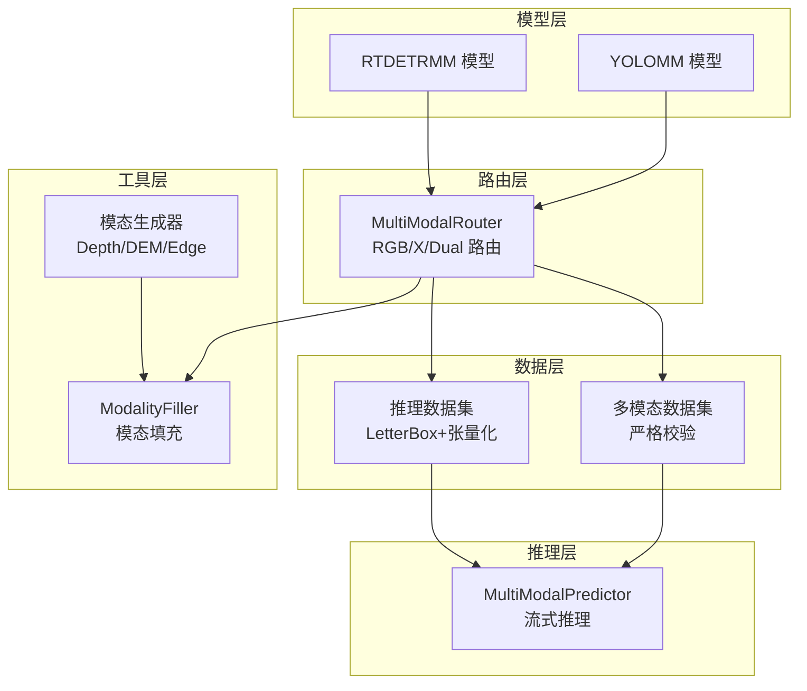
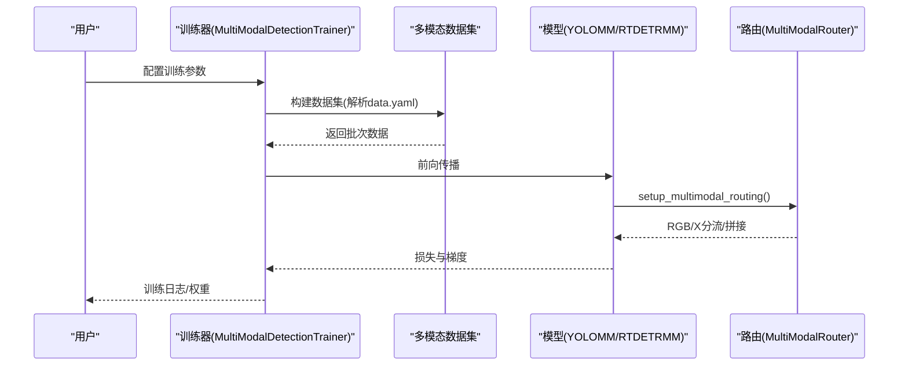
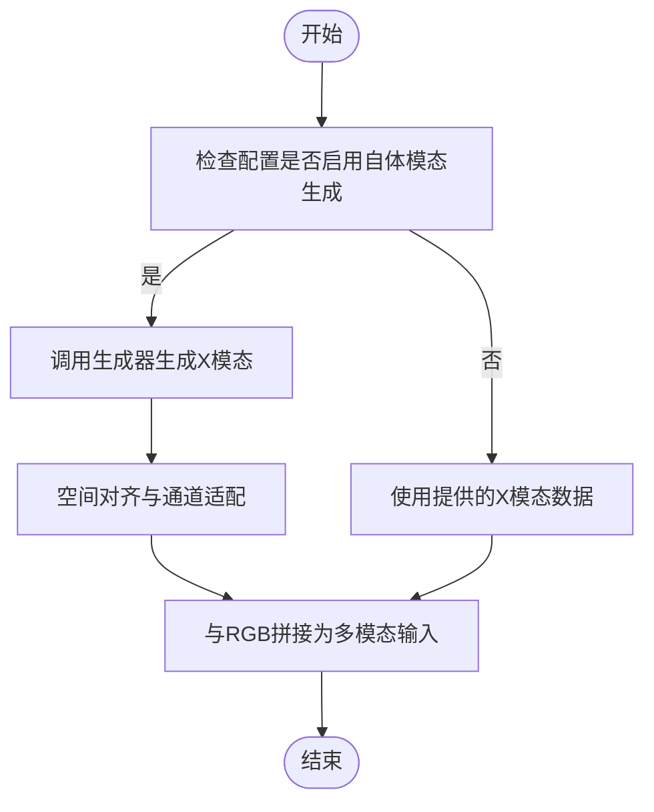
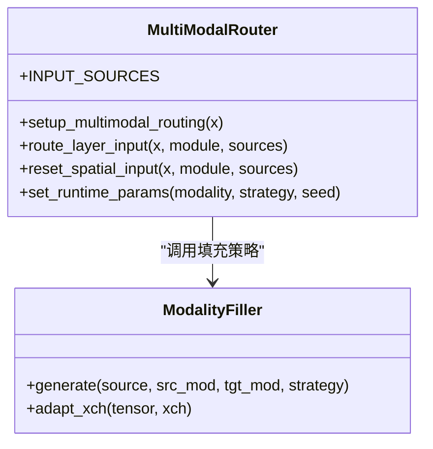
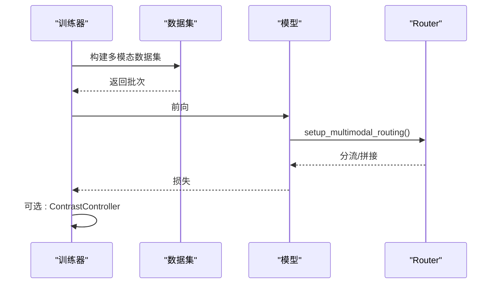
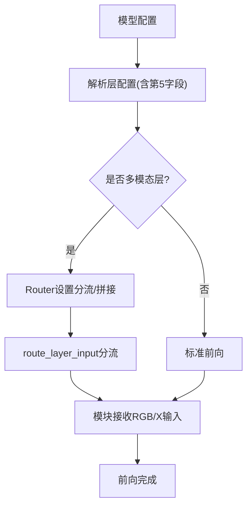
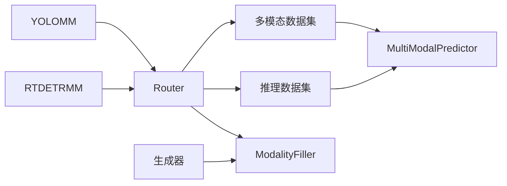

# 新功能开发指导

<cite>
**本文档引用的文件**
- [ultralytics/__init__.py](file://ultralytics/__init__.py)
- [ultralytics/cfg/default.yaml](file://ultralytics/cfg/default.yaml)
- [ultralytics/models/yolo/model.py](file://ultralytics/models/yolo/model.py)
- [ultralytics/engine/multimodal/predictor.py](file://ultralytics/engine/multimodal/predictor.py)
- [ultralytics/data/multimodal/__init__.py](file://ultralytics/data/multimodal/__init__.py)
- [ultralytics/nn/mm/router.py](file://ultralytics/nn/mm/router.py)
- [ultralytics/nn/mm/generators/__init__.py](file://ultralytics/nn/mm/generators/__init__.py)
- [ultralytics/models/yolo/multimodal/__init__.py](file://ultralytics/models/yolo/multimodal/__init__.py)
- [ultralytics/data/build.py](file://ultralytics/data/build.py)
- [ultralytics/nn/mm/filling.py](file://ultralytics/nn/mm/filling.py)
- [ultralytics/data/multimodal/inference_dataset.py](file://ultralytics/data/multimodal/inference_dataset.py)
- [ultralytics/models/yolo/multimodal/train.py](file://ultralytics/models/yolo/multimodal/train.py)
</cite>

## 目录
1. [简介](#简介)
2. [项目结构](#项目结构)
3. [核心组件](#核心组件)
4. [架构总览](#架构总览)
5. [详细组件分析](#详细组件分析)
6. [依赖关系分析](#依赖关系分析)
7. [性能考虑](#性能考虑)
8. [故障排查指南](#故障排查指南)
9. [结论](#结论)
10. [附录](#附录)

## 简介
本指导面向多模态检测系统的功能扩展，围绕“新模态支持”“新融合算法”“新模型架构”三大方向，提供从底层实现到上层应用的全栈开发指南。内容涵盖：
- 模态生成器的实现与接入
- 模态路由策略的扩展与配置
- 融合模块的实现与参数配置
- 新模型架构的定义与前向传播
- 向后兼容性设计（API、配置、权重）
- 功能测试与验证方法

## 项目结构
多模态系统采用“配置驱动 + 路由感知”的架构，核心由以下层次组成：
- 模型层：YOLOMM/RTDETRMM模型与任务适配
- 路由层：MultiModalRouter负责RGB/X/Dual的零拷贝路由
- 数据层：多模态数据集与推理数据集，支持严格校验与动态适配
- 推理层：独立的MultiModalPredictor，支持流式推理与后处理
- 工具层：模态填充、生成器、可视化与评估组件

**图表来源**
- [ultralytics/models/yolo/model.py](file://ultralytics/models/yolo/model.py)
- [ultralytics/nn/mm/router.py](file://ultralytics/nn/mm/router.py)
- [ultralytics/data/multimodal/inference_dataset.py](file://ultralytics/data/multimodal/inference_dataset.py)
- [ultralytics/engine/multimodal/predictor.py](file://ultralytics/engine/multimodal/predictor.py)
- [ultralytics/nn/mm/filling.py](file://ultralytics/nn/mm/filling.py)
- [ultralytics/nn/mm/generators/__init__.py](file://ultralytics/nn/mm/generators/__init__.py)

**章节来源**
- [ultralytics/models/yolo/model.py](file://ultralytics/models/yolo/model.py)
- [ultralytics/nn/mm/router.py](file://ultralytics/nn/mm/router.py)
- [ultralytics/data/multimodal/inference_dataset.py](file://ultralytics/data/multimodal/inference_dataset.py)
- [ultralytics/engine/multimodal/predictor.py](file://ultralytics/engine/multimodal/predictor.py)
- [ultralytics/nn/mm/filling.py](file://ultralytics/nn/mm/filling.py)
- [ultralytics/nn/mm/generators/__init__.py](file://ultralytics/nn/mm/generators/__init__.py)

## 核心组件
- YOLOMM/RTDETRMM模型：支持RGB+X多模态输入，自动识别任务类型并配置通道数
- MultiModalRouter：零拷贝路由，支持RGB/X/Dual三种输入模式，动态适配X通道数
- MultiModalPredictor：独立推理引擎，支持流式推理、YOLO/RTDETR后处理
- 多模态数据集：严格校验RGB/X路径与通道数，LetterBox预处理
- 模态填充与生成器：统一的模态合成策略，支持深度/DEM/边缘等生成器

**章节来源**
- [ultralytics/models/yolo/model.py](file://ultralytics/models/yolo/model.py)
- [ultralytics/nn/mm/router.py](file://ultralytics/nn/mm/router.py)
- [ultralytics/engine/multimodal/predictor.py](file://ultralytics/engine/multimodal/predictor.py)
- [ultralytics/data/multimodal/inference_dataset.py](file://ultralytics/data/multimodal/inference_dataset.py)
- [ultralytics/nn/mm/filling.py](file://ultralytics/nn/mm/filling.py)
- [ultralytics/nn/mm/generators/__init__.py](file://ultralytics/nn/mm/generators/__init__.py)

## 架构总览
多模态系统的关键流程：
- 训练阶段：通过数据配置解析多模态组合，构建多模态数据集，路由层在模型内部完成RGB/X分流
- 推理阶段：MultiModalPredictor读取Router配置，构建推理数据集，逐样本执行前向、NMS、坐标还原与结果封装

**图表来源**
- [ultralytics/models/yolo/multimodal/train.py](file://ultralytics/models/yolo/multimodal/train.py)
- [ultralytics/data/build.py](file://ultralytics/data/build.py)
- [ultralytics/nn/mm/router.py](file://ultralytics/nn/mm/router.py)

**章节来源**
- [ultralytics/models/yolo/multimodal/train.py](file://ultralytics/models/yolo/multimodal/train.py)
- [ultralytics/data/build.py](file://ultralytics/data/build.py)
- [ultralytics/nn/mm/router.py](file://ultralytics/nn/mm/router.py)

## 详细组件分析

### 模态生成器实现指南
- 目标：为缺失的X模态提供合成数据，提升鲁棒性
- 实现要点：
  - 生成器需遵循统一入口，便于在推理/训练中按需启用
  - 生成器应支持多模态类型（深度/DEM/边缘等），并与Router的X通道数对接
  - 生成器输出需与RGB空间对齐，满足LetterBox与张量化要求
- 接入步骤：
  1) 在生成器模块中实现生成函数，返回与目标通道数一致的张量
  2) 在数据集侧调用生成器，或在Router中通过填充策略触发
  3) 通过配置文件启用自动生成（如启用self-modal generation）

**图表来源**
- [ultralytics/nn/mm/generators/__init__.py](file://ultralytics/nn/mm/generators/__init__.py)
- [ultralytics/data/multimodal/inference_dataset.py](file://ultralytics/data/multimodal/inference_dataset.py)
- [ultralytics/nn/mm/filling.py](file://ultralytics/nn/mm/filling.py)

**章节来源**
- [ultralytics/nn/mm/generators/__init__.py](file://ultralytics/nn/mm/generators/__init__.py)
- [ultralytics/data/multimodal/inference_dataset.py](file://ultralytics/data/multimodal/inference_dataset.py)
- [ultralytics/nn/mm/filling.py](file://ultralytics/nn/mm/filling.py)

### 模态路由策略扩展
- 路由机制：
  - 通过模型配置的第5字段标识模态来源（RGB/X/Dual），Router据此分流
  - 支持“X模态新输入起点”标记，实现空间重置与通道校验
  - 支持运行时参数（如单模态训练）动态切换RGB/X填充策略
- 扩展方式：
  - 在模型配置中新增层并设置第5字段为RGB/X/Dual
  - 如需空间重置，可在对应层标注“新输入起点”
  - 通过Router的运行时参数控制填充策略与模态类型

**图表来源**
- [ultralytics/nn/mm/router.py](file://ultralytics/nn/mm/router.py)
- [ultralytics/nn/mm/filling.py](file://ultralytics/nn/mm/filling.py)

**章节来源**
- [ultralytics/nn/mm/router.py](file://ultralytics/nn/mm/router.py)
- [ultralytics/nn/mm/filling.py](file://ultralytics/nn/mm/filling.py)

### 融合算法开发步骤
- 融合位置选择：
  - 早期融合：在骨干网络之前将RGB与X拼接，适合跨模态互补特征
  - 中期融合：分别提取RGB与X特征后再融合，适合细粒度特征对齐
  - 晚期融合：高层语义特征融合，适合多模态决策
- 实现要点：
  - 在模型配置中明确融合层的第5字段为RGB/X/Dual
  - 融合模块需支持通道适配与空间对齐
  - 通过ContrastController等组件增强对比学习（可选）
- 参数配置：
  - 通过训练器解析data.yaml中的模态组合与路径映射
  - 支持单模态训练（如rgb-only或x-only），自动推断X模态类型

**图表来源**
- [ultralytics/models/yolo/multimodal/train.py](file://ultralytics/models/yolo/multimodal/train.py)
- [ultralytics/data/build.py](file://ultralytics/data/build.py)
- [ultralytics/nn/mm/router.py](file://ultralytics/nn/mm/router.py)

**章节来源**
- [ultralytics/models/yolo/multimodal/train.py](file://ultralytics/models/yolo/multimodal/train.py)
- [ultralytics/data/build.py](file://ultralytics/data/build.py)
- [ultralytics/nn/mm/router.py](file://ultralytics/nn/mm/router.py)

### 新模型架构开发指南
- 网络层定义：
  - 在模型配置中使用四元组[from, repeats, module, args]，并在第五字段声明模态来源
  - 对于需要空间重置的层，添加“新输入起点”标记
- 前向传播：
  - Router在setup_multimodal_routing中根据输入通道数与配置决定分流策略
  - route_layer_input按模块属性将RGB/X分流到对应层
- 损失函数：
  - 可选加入对比学习损失（ContrastController），通过训练器注入
  - 支持多任务头（检测/分割/姿态等），通过任务映射自动选择

**图表来源**
- [ultralytics/nn/mm/router.py](file://ultralytics/nn/mm/router.py)
- [ultralytics/models/yolo/model.py](file://ultralytics/models/yolo/model.py)

**章节来源**
- [ultralytics/nn/mm/router.py](file://ultralytics/nn/mm/router.py)
- [ultralytics/models/yolo/model.py](file://ultralytics/models/yolo/model.py)

### 向后兼容性设计
- API设计：
  - 通过ultralytics/__init__.py条件导入YOLOMM/RTDETRMM与模态生成器，避免环境差异导致的导入失败
  - 推理接口保持RGB/X显式输入，兼容历史脚本
- 配置文件兼容：
  - default.yaml中提供多模态相关参数（如模态类型、异步几何扰动、模态擦除等）
  - data.yaml支持modality_used/models等字段，兼容旧版配置
- 权重文件迁移：
  - 模型通道数变化时，通过Router的通道适配函数自动投影
  - 对于新增融合层，建议在配置中显式声明，避免自动推断导致的不一致

**章节来源**
- [ultralytics/__init__.py](file://ultralytics/__init__.py)
- [ultralytics/cfg/default.yaml](file://ultralytics/cfg/default.yaml)
- [ultralytics/data/build.py](file://ultralytics/data/build.py)
- [ultralytics/nn/mm/filling.py](file://ultralytics/nn/mm/filling.py)

### 功能测试与验证
- 单元测试：
  - 路由器：验证setup_multimodal_routing在Dual/RGB-only场景的行为
  - 填充器：验证不同策略（copy/noise/channel_repeat/edge_blur/mixed）输出形状与范围
- 集成测试：
  - 推理：使用MultiModalPredictor对RGB+X样本进行流式推理，验证坐标还原与NMS
  - 训练：在单模态与双模态下训练，检查损失曲线与收敛行为
- 性能回归：
  - 对比不同融合策略的FPS与内存占用
  - 验证LetterBox与拼接操作的零拷贝特性

**章节来源**
- [ultralytics/engine/multimodal/predictor.py](file://ultralytics/engine/multimodal/predictor.py)
- [ultralytics/data/multimodal/inference_dataset.py](file://ultralytics/data/multimodal/inference_dataset.py)
- [ultralytics/nn/mm/filling.py](file://ultralytics/nn/mm/filling.py)

## 依赖关系分析
- 组件耦合：
  - 模型层与路由层强耦合（通过配置字段驱动），但运行时通过Router解耦
  - 数据层与推理层通过Dataset接口解耦，支持严格校验与动态适配
- 外部依赖：
  - 生成器依赖OpenCV/NumPy等基础库
  - 推理依赖torch与torchvision的NMS

**图表来源**
- [ultralytics/models/yolo/model.py](file://ultralytics/models/yolo/model.py)
- [ultralytics/nn/mm/router.py](file://ultralytics/nn/mm/router.py)
- [ultralytics/data/multimodal/inference_dataset.py](file://ultralytics/data/multimodal/inference_dataset.py)
- [ultralytics/engine/multimodal/predictor.py](file://ultralytics/engine/multimodal/predictor.py)
- [ultralytics/nn/mm/filling.py](file://ultralytics/nn/mm/filling.py)
- [ultralytics/nn/mm/generators/__init__.py](file://ultralytics/nn/mm/generators/__init__.py)

**章节来源**
- [ultralytics/models/yolo/model.py](file://ultralytics/models/yolo/model.py)
- [ultralytics/nn/mm/router.py](file://ultralytics/nn/mm/router.py)
- [ultralytics/data/multimodal/inference_dataset.py](file://ultralytics/data/multimodal/inference_dataset.py)
- [ultralytics/engine/multimodal/predictor.py](file://ultralytics/engine/multimodal/predictor.py)
- [ultralytics/nn/mm/filling.py](file://ultralytics/nn/mm/filling.py)
- [ultralytics/nn/mm/generators/__init__.py](file://ultralytics/nn/mm/generators/__init__.py)

## 性能考虑
- 零拷贝路由：Router通过切片与缓存原始输入，避免重复分配
- LetterBox与张量化：统一预处理减少数据搬运
- 模态填充策略：轻量策略（copy/noise/channel_repeat/edge_blur/mixed）避免额外依赖
- 对比学习：可选开启，注意增加的计算与显存开销

## 故障排查指南
- 常见问题：
  - X通道数不匹配：检查data.yaml中的X通道数与生成器输出
  - 模态类型不一致：确认Router的x_modality_type与实际模态一致
  - 路由失败：检查模型配置第5字段是否正确，是否存在“新输入起点”标记
- 定位方法：
  - 启用debug模式，观察MultiModalPredictor的后处理分支与Router的日志
  - 使用推理数据集的严格校验，快速发现路径或格式问题

**章节来源**
- [ultralytics/engine/multimodal/predictor.py](file://ultralytics/engine/multimodal/predictor.py)
- [ultralytics/data/multimodal/inference_dataset.py](file://ultralytics/data/multimodal/inference_dataset.py)
- [ultralytics/nn/mm/router.py](file://ultralytics/nn/mm/router.py)

## 结论
通过配置驱动与路由感知的架构，系统实现了对新模态、新融合算法与新模型架构的平滑扩展。开发者只需在配置中声明模态来源、在数据侧提供严格校验与动态适配，并在推理侧保持统一的后处理流程，即可快速集成新能力并保证向后兼容。

## 附录
- 关键配置项参考：
  - default.yaml中的多模态相关参数（模态类型、异步几何扰动、模态擦除等）
  - data.yaml中的模态组合与路径映射（modality_used/models/modalities）
- 推荐实践：
  - 新模态：先实现生成器/填充策略，再在配置中声明第5字段
  - 新融合：优先在中期融合验证效果，再扩展到早期/晚期
  - 新模型：保持与现有任务映射一致，确保训练/验证/推理链路贯通

**章节来源**
- [ultralytics/cfg/default.yaml](file://ultralytics/cfg/default.yaml)
- [ultralytics/data/build.py](file://ultralytics/data/build.py)
- [ultralytics/models/yolo/multimodal/train.py](file://ultralytics/models/yolo/multimodal/train.py)