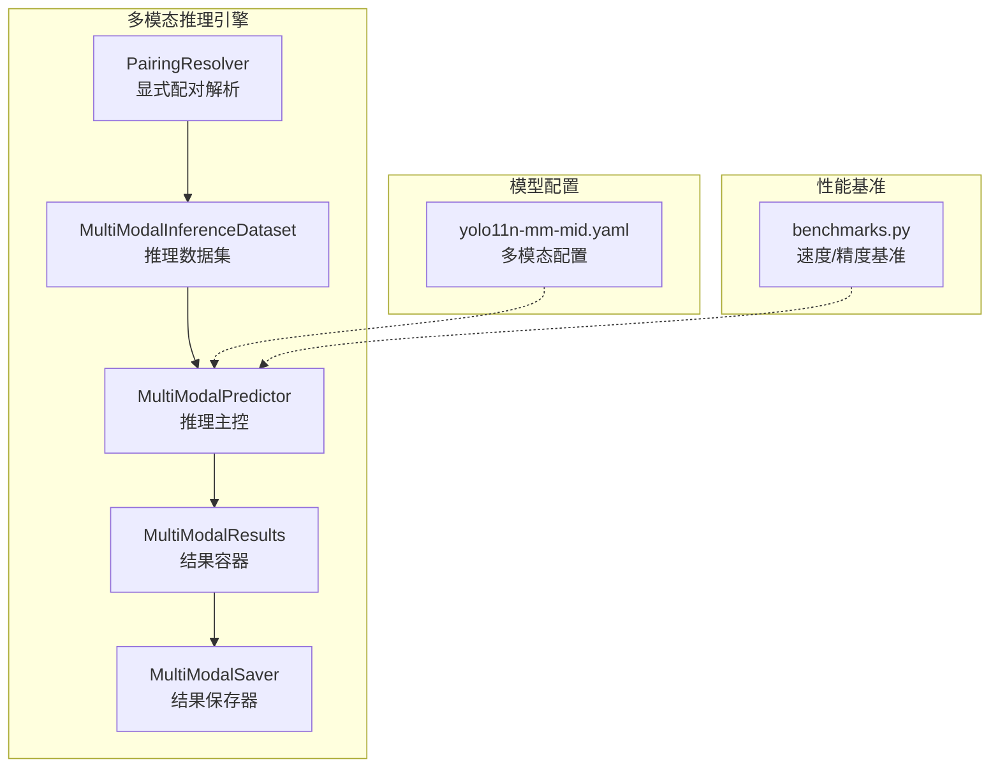
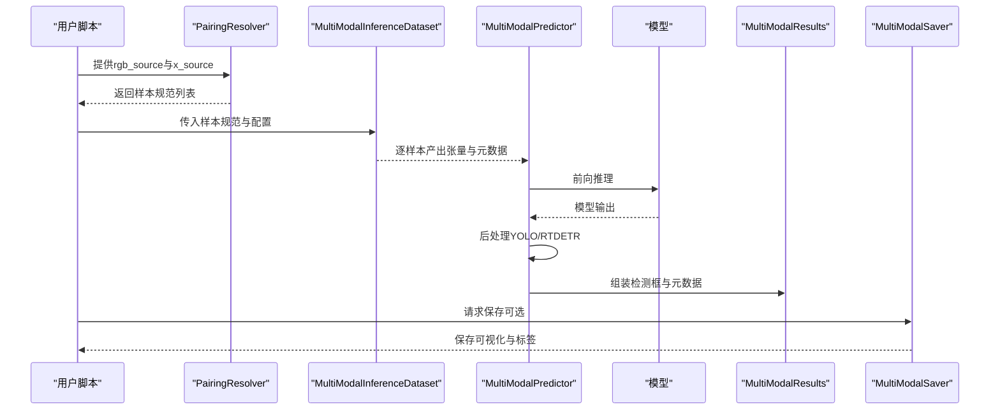
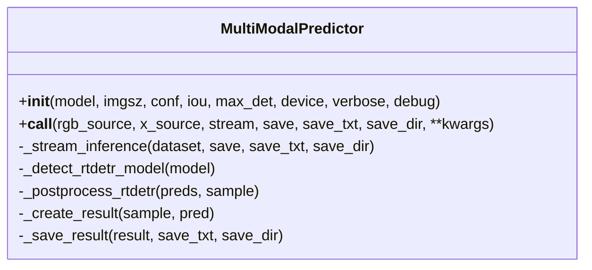
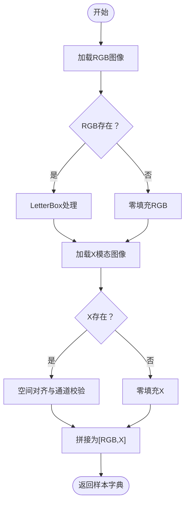
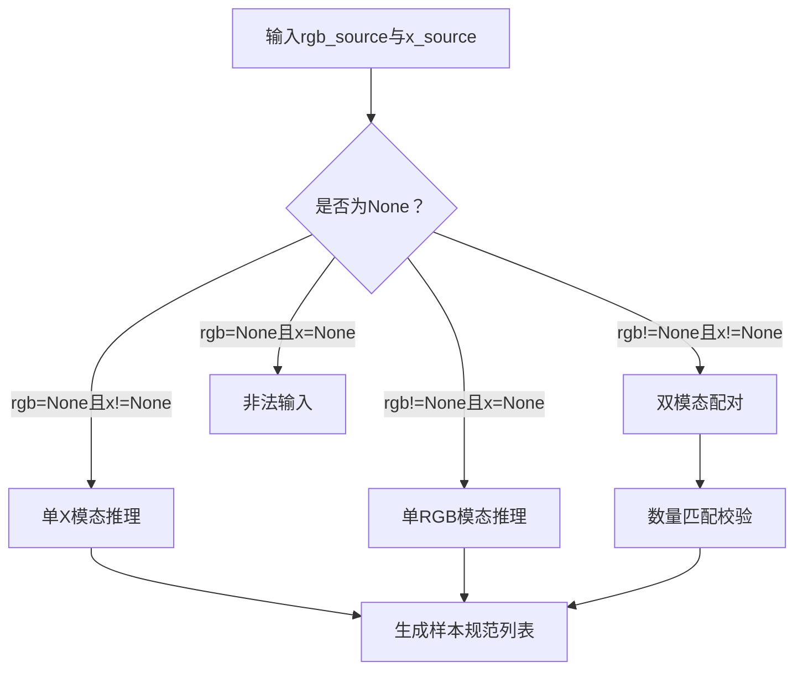
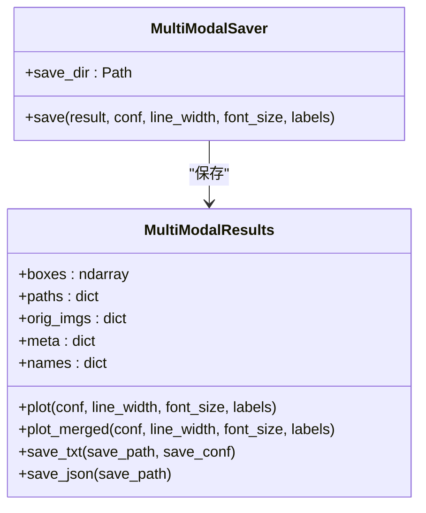
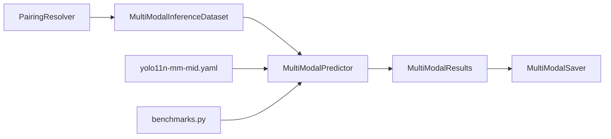
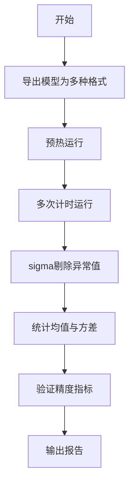

# 测试框架使用

<cite>
**本文引用的文件**
- [test.py](file://test.py)
- [trainMM.py](file://trainMM.py)
- [valMM.py](file://valMM.py)
- [predictMM.py](file://predictMM.py)
- [predictor.py](file://ultralytics/engine/multimodal/predictor.py)
- [inference_dataset.py](file://ultralytics/data/multimodal/inference_dataset.py)
- [pairing.py](file://ultralytics/data/multimodal/pairing.py)
- [results.py](file://ultralytics/engine/multimodal/results.py)
- [saver.py](file://ultralytics/engine/multimodal/saver.py)
- [utils.py](file://ultralytics/data/multimodal/utils.py)
- [yolo11n-mm-mid.yaml](file://ultralytics/cfg/models/mm/yolo11n-mm-mid.yaml)
- [benchmarks.py](file://ultralytics/utils/benchmarks.py)
</cite>

## 目录
1. [简介](#简介)
2. [项目结构](#项目结构)
3. [核心组件](#核心组件)
4. [架构总览](#架构总览)
5. [详细组件分析](#详细组件分析)
6. [依赖分析](#依赖分析)
7. [性能测试](#性能测试)
8. [测试数据准备与管理](#测试数据准备与管理)
9. [持续集成与自动化测试](#持续集成与自动化测试)
10. [故障排查指南](#故障排查指南)
11. [结论](#结论)

## 简介
本指南面向多模态检测系统，提供一套完整的测试框架使用方法，覆盖单元测试、集成测试、性能测试与持续集成实践。文档基于仓库中的多模态推理引擎与配套工具，给出可操作的测试策略与最佳实践，帮助开发者在不同阶段快速定位问题、验证功能正确性并评估系统性能。

## 项目结构
围绕多模态检测的测试与验证，项目主要包含以下与测试相关的关键模块：
- 多模态推理引擎：负责从模型读取路由配置、构建数据集、执行推理、后处理与结果保存
- 多模态数据集与配对解析：负责将显式RGB与X模态输入解析为样本规范，并进行空间与通道校验
- 结果容器与保存器：封装检测框、元数据与可视化能力，并按约定规则保存结果
- 模型配置：提供多模态骨干与融合结构的基准配置
- 性能基准工具：提供跨格式的推理速度与精度对比能力

**图表来源**
- [predictor.py:16-494](file://ultralytics/engine/multimodal/predictor.py#L16-L494)
- [inference_dataset.py:16-252](file://ultralytics/data/multimodal/inference_dataset.py#L16-L252)
- [pairing.py:11-203](file://ultralytics/data/multimodal/pairing.py#L11-L203)
- [results.py:14-357](file://ultralytics/engine/multimodal/results.py#L14-L357)
- [saver.py:12-112](file://ultralytics/engine/multimodal/saver.py#L12-L112)
- [yolo11n-mm-mid.yaml:1-75](file://ultralytics/cfg/models/mm/yolo11n-mm-mid.yaml#L1-L75)
- [benchmarks.py:52-211](file://ultralytics/utils/benchmarks.py#L52-L211)

**章节来源**
- [predictor.py:16-494](file://ultralytics/engine/multimodal/predictor.py#L16-L494)
- [inference_dataset.py:16-252](file://ultralytics/data/multimodal/inference_dataset.py#L16-L252)
- [pairing.py:11-203](file://ultralytics/data/multimodal/pairing.py#L11-L203)
- [results.py:14-357](file://ultralytics/engine/multimodal/results.py#L14-L357)
- [saver.py:12-112](file://ultralytics/engine/multimodal/saver.py#L12-L112)
- [yolo11n-mm-mid.yaml:1-75](file://ultralytics/cfg/models/mm/yolo11n-mm-mid.yaml#L1-L75)
- [benchmarks.py:52-211](file://ultralytics/utils/benchmarks.py#L52-L211)

## 核心组件
- 多模态推理引擎（MultiModalPredictor）
  - 负责从模型读取路由配置，构建数据集，执行推理与后处理，组装结果并可选保存
  - 支持RTDETR与YOLO两类模型的后处理分支，具备流式推理能力
- 多模态推理数据集（MultiModalInferenceDataset）
  - 严格校验输入合法性，进行LetterBox预处理与张量化，支持单模态零填充
- 显式配对解析器（PairingResolver）
  - 接收显式rgb_source与x_source，生成统一样本规范，支持单模态与双模态推理
- 结果容器与保存器（MultiModalResults/MultiModalSaver）
  - 封装检测框、路径、元数据与可视化；按约定规则保存可视化图像、标签与JSON
- 模型配置（yolo11n-mm-mid.yaml）
  - 提供多模态骨干与融合结构的基准配置，便于复现实验与对比
- 性能基准工具（benchmarks.py）
  - 提供跨格式导出与评测流程，输出速度与精度指标

**章节来源**
- [predictor.py:16-494](file://ultralytics/engine/multimodal/predictor.py#L16-L494)
- [inference_dataset.py:16-252](file://ultralytics/data/multimodal/inference_dataset.py#L16-L252)
- [pairing.py:11-203](file://ultralytics/data/multimodal/pairing.py#L11-L203)
- [results.py:14-357](file://ultralytics/engine/multimodal/results.py#L14-L357)
- [saver.py:12-112](file://ultralytics/engine/multimodal/saver.py#L12-L112)
- [yolo11n-mm-mid.yaml:1-75](file://ultralytics/cfg/models/mm/yolo11n-mm-mid.yaml#L1-L75)
- [benchmarks.py:52-211](file://ultralytics/utils/benchmarks.py#L52-L211)

## 架构总览
下图展示多模态推理从输入到输出的端到端流程，以及关键组件之间的交互关系。

**图表来源**
- [pairing.py:37-125](file://ultralytics/data/multimodal/pairing.py#L37-L125)
- [inference_dataset.py:94-183](file://ultralytics/data/multimodal/inference_dataset.py#L94-L183)
- [predictor.py:99-243](file://ultralytics/engine/multimodal/predictor.py#L99-L243)
- [results.py:30-60](file://ultralytics/engine/multimodal/results.py#L30-L60)
- [saver.py:54-111](file://ultralytics/engine/multimodal/saver.py#L54-L111)

## 详细组件分析

### 多模态推理引擎（MultiModalPredictor）
- 关键职责
  - 从模型读取路由配置，识别X模态类型与通道数
  - 构建数据集并迭代样本，执行前向推理
  - 根据模型类型选择后处理路径（RTDETR与YOLO）
  - 组装MultiModalResults并可选保存
- 设计要点
  - 流式推理：边迭代边yield，适合大规模数据
  - 调试开关：支持debug模式输出中间张量形状与关键步骤日志
  - 设备与参数：支持设备选择、置信度与NMS阈值、最大检测数等

**图表来源**
- [predictor.py:16-494](file://ultralytics/engine/multimodal/predictor.py#L16-L494)

**章节来源**
- [predictor.py:16-494](file://ultralytics/engine/multimodal/predictor.py#L16-L494)

### 多模态推理数据集（MultiModalInferenceDataset）
- 关键职责
  - 从样本规范加载RGB与X模态图像
  - 进行LetterBox预处理与张量化，支持单模态零填充
  - 校验X模态通道数与空间尺寸，必要时进行对齐与转换
- 设计要点
  - 严格输入契约：不做自动降级，缺失模态使用零填充
  - 支持多种X模态格式（图像、npy、npz、tiff等）

**图表来源**
- [inference_dataset.py:94-183](file://ultralytics/data/multimodal/inference_dataset.py#L94-L183)
- [utils.py:13-83](file://ultralytics/data/multimodal/utils.py#L13-L83)

**章节来源**
- [inference_dataset.py:16-252](file://ultralytics/data/multimodal/inference_dataset.py#L16-L252)
- [utils.py:13-180](file://ultralytics/data/multimodal/utils.py#L13-L180)

### 显式配对解析器（PairingResolver）
- 关键职责
  - 接收显式rgb_source与x_source，统一为列表并进行数量与存在性校验
  - 生成样本规范，支持单模态与双模态推理
- 设计要点
  - 新API强制显式输入，废弃隐式列表格式
  - 支持None占位，实现单模态零填充推理

**图表来源**
- [pairing.py:37-125](file://ultralytics/data/multimodal/pairing.py#L37-L125)

**章节来源**
- [pairing.py:11-203](file://ultralytics/data/multimodal/pairing.py#L11-L203)

### 结果容器与保存器（MultiModalResults/MultiModalSaver）
- MultiModalResults
  - 封装boxes、paths、orig_imgs、meta与names
  - 提供plot与plot_merged可视化，支持YOLO格式标签与JSON保存
- MultiModalSaver
  - 按约定规则保存RGB可视化、X模态可视化、并排合并图、标签与JSON

**图表来源**
- [results.py:14-357](file://ultralytics/engine/multimodal/results.py#L14-L357)
- [saver.py:12-112](file://ultralytics/engine/multimodal/saver.py#L12-L112)

**章节来源**
- [results.py:14-357](file://ultralytics/engine/multimodal/results.py#L14-L357)
- [saver.py:12-112](file://ultralytics/engine/multimodal/saver.py#L12-L112)

### 模型配置（yolo11n-mm-mid.yaml）
- 提供多模态骨干与融合结构的基准配置，便于在训练与推理中复现
- 包含尺度参数、骨干网络、融合层与检测头定义

**章节来源**
- [yolo11n-mm-mid.yaml:1-75](file://ultralytics/cfg/models/mm/yolo11n-mm-mid.yaml#L1-L75)

## 依赖分析
- 组件耦合
  - PairingResolver与MultiModalInferenceDataset强关联，前者提供样本规范，后者负责加载与预处理
  - MultiModalPredictor依赖模型的mm_router配置，以确定X模态类型与通道数
  - MultiModalResults与MultiModalSaver解耦，便于替换保存策略
- 外部依赖
  - OpenCV、NumPy、PyTorch、torchvision等基础库
  - 性能基准工具依赖ONNXRuntime、TensorRT等推理后端

**图表来源**
- [pairing.py:11-203](file://ultralytics/data/multimodal/pairing.py#L11-L203)
- [inference_dataset.py:16-252](file://ultralytics/data/multimodal/inference_dataset.py#L16-L252)
- [predictor.py:16-494](file://ultralytics/engine/multimodal/predictor.py#L16-L494)
- [results.py:14-357](file://ultralytics/engine/multimodal/results.py#L14-L357)
- [saver.py:12-112](file://ultralytics/engine/multimodal/saver.py#L12-L112)
- [yolo11n-mm-mid.yaml:1-75](file://ultralytics/cfg/models/mm/yolo11n-mm-mid.yaml#L1-L75)
- [benchmarks.py:52-211](file://ultralytics/utils/benchmarks.py#L52-L211)

**章节来源**
- [pairing.py:11-203](file://ultralytics/data/multimodal/pairing.py#L11-L203)
- [inference_dataset.py:16-252](file://ultralytics/data/multimodal/inference_dataset.py#L16-L252)
- [predictor.py:16-494](file://ultralytics/engine/multimodal/predictor.py#L16-L494)
- [results.py:14-357](file://ultralytics/engine/multimodal/results.py#L14-L357)
- [saver.py:12-112](file://ultralytics/engine/multimodal/saver.py#L12-L112)
- [yolo11n-mm-mid.yaml:1-75](file://ultralytics/cfg/models/mm/yolo11n-mm-mid.yaml#L1-L75)
- [benchmarks.py:52-211](file://ultralytics/utils/benchmarks.py#L52-L211)

## 性能测试
- 推荐流程
  - 使用性能基准工具对导出格式（ONNX/TensorRT等）进行速度与精度评测
  - 通过迭代sigma剔除异常值，统计平均推理时间与标准差
  - 对比不同模型规模与导出格式的FPS与mAP
- 关键参数
  - 图像尺寸、半精度/整数量化、设备选择（CPU/GPU）
  - 预热轮次与计时轮次，确保稳定测量
- 工具入口
  - benchmark：评测单个模型在多种格式下的速度与精度
  - ProfileModels：针对ONNX与TensorRT进行更细粒度的性能剖析

**图表来源**
- [benchmarks.py:52-211](file://ultralytics/utils/benchmarks.py#L52-L211)
- [benchmarks.py:360-721](file://ultralytics/utils/benchmarks.py#L360-L721)

**章节来源**
- [benchmarks.py:52-211](file://ultralytics/utils/benchmarks.py#L52-L211)
- [benchmarks.py:360-721](file://ultralytics/utils/benchmarks.py#L360-L721)

## 测试数据准备与管理
- 合成数据生成
  - 可使用深度/边缘/频率域等生成器脚本创建多模态合成数据，用于单元测试与回归测试
  - 注意保持RGB与X模态的空间一致性与通道数匹配
- 测试集划分
  - 建议采用随机划分或按场景/时间序列划分，确保训练/验证/测试集分布均衡
- 基准数据维护
  - 统一管理数据集的路径、类别映射与评估指标，便于持续回归
- 多模态数据加载
  - 使用推理数据集加载器支持的格式（图像、npy、npz、tiff），并确保LetterBox预处理一致

**章节来源**
- [inference_dataset.py:185-246](file://ultralytics/data/multimodal/inference_dataset.py#L185-L246)
- [utils.py:86-179](file://ultralytics/data/multimodal/utils.py#L86-L179)

## 持续集成与自动化测试
- 单元测试
  - 使用pytest组织测试用例，按功能模块拆分（配对解析、数据集加载、结果保存）
  - 使用unittest.mock或pytest-mock模拟外部依赖（如文件系统、模型前向）
  - 为关键函数编写边界条件与异常路径测试（如文件不存在、通道数不匹配）
- 集成测试
  - 以最小配置启动推理流程，验证从输入到输出的端到端正确性
  - 针对模态路由与特征融合效果，比较不同融合策略下的检测框数量与置信度分布
- 性能回归
  - 在CI中固定图像尺寸与设备，记录FPS与mAP，设置阈值告警
  - 对关键模型导出格式（ONNX/TensorRT）进行回归对比
- 自动化流程建议
  - 分阶段流水线：单元测试 → 集成测试 → 性能回归 → 文档与报告
  - 使用缓存与并行加速（如并行运行不同导出格式）

[本节为通用实践指导，不直接分析具体文件，故无“章节来源”]

## 故障排查指南
- 常见问题与定位
  - 模型缺少mm_router：确认使用YOLOMM/RTDETRMM模型实例
  - X模态通道数不匹配：检查预期通道数与实际通道数，必要时进行1/3通道转换
  - 文件不存在或非文件：核对路径与权限
  - LetterBox缩放与还原坐标：确认ratio_pad格式与scale_boxes调用参数
- 调试建议
  - 启用debug模式，观察模型输出形状与后处理关键步骤
  - 对比RTDETR与YOLO的后处理差异，关注NMS与坐标还原
- 日志与保存
  - 通过保存器输出可视化与标签，辅助人工核查

**章节来源**
- [predictor.py:60-98](file://ultralytics/engine/multimodal/predictor.py#L60-L98)
- [inference_dataset.py:185-246](file://ultralytics/data/multimodal/inference_dataset.py#L185-L246)
- [utils.py:13-83](file://ultralytics/data/multimodal/utils.py#L13-L83)
- [results.py:61-130](file://ultralytics/engine/multimodal/results.py#L61-L130)

## 结论
本测试框架以多模态推理引擎为核心，结合严格的配对解析、数据集加载与结果保存机制，形成从单元到集成再到性能的完整测试闭环。配合性能基准工具与持续集成流程，可有效保障多模态检测系统在不同模态组合与融合策略下的稳定性与效率。