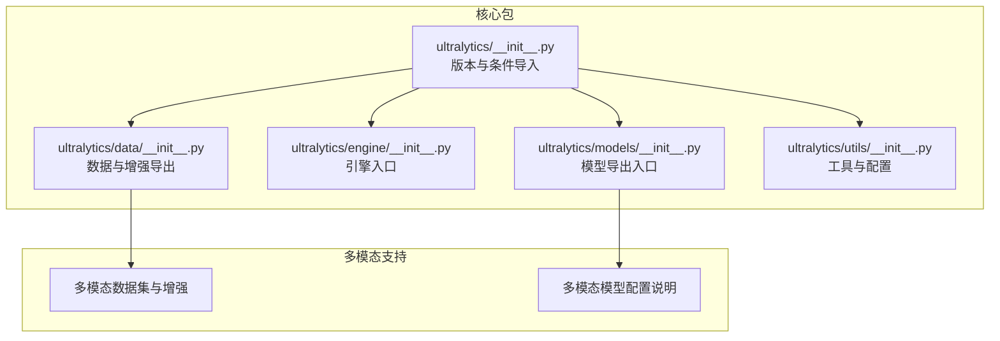
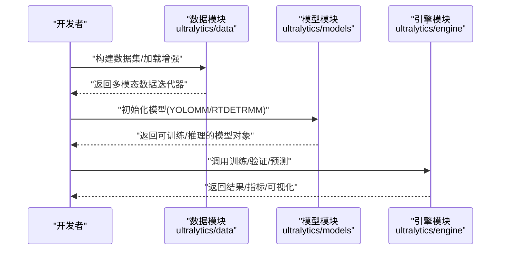
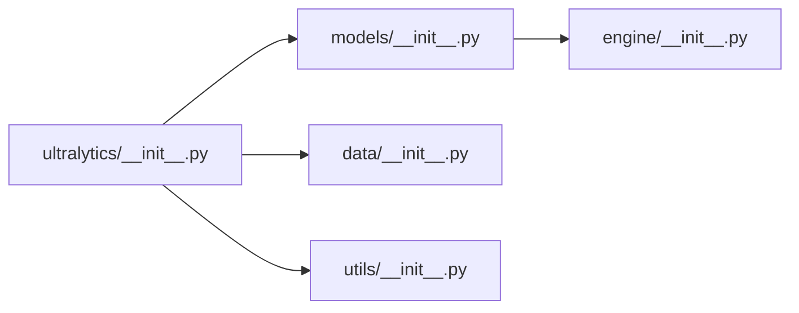

# 贡献指南

<cite>
**本文引用的文件**   
- [ultralytics/__init__.py](file://ultralytics/__init__.py)
- [ultralytics/utils/__init__.py](file://ultralytics/utils/__init__.py)
- [.gitignore](file://.gitignore)
- [ultralytics/data/__init__.py](file://ultralytics/data/__init__.py)
- [ultralytics/engine/__init__.py](file://ultralytics/engine/__init__.py)
- [ultralytics/models/__init__.py](file://ultralytics/models/__init__.py)
- [ultralytics/cfg/models/README.md](file://ultralytics/cfg/models/README.md)
- [ultralytics/trackers/README.md](file://ultralytics/trackers/README.md)
</cite>

## 目录
1. [简介](#简介)
2. [项目结构](#项目结构)
3. [核心组件](#核心组件)
4. [架构总览](#架构总览)
5. [详细组件分析](#详细组件分析)
6. [依赖关系分析](#依赖关系分析)
7. [性能与质量考量](#性能与质量考量)
8. [故障排查指南](#故障排查指南)
9. [结论](#结论)
10. [附录](#附录)

## 简介
本指南面向多模态检测项目的贡献者，系统化说明代码贡献流程（Fork、分支、提交、PR）、代码审查标准与流程（审查清单、反馈处理、修改完善）、文档贡献方法（编写规范、格式要求、发布流程）、Bug 报告与功能请求提交方式（Issue 模板、问题描述、复现步骤），以及社区行为准则与沟通规范、维护者职责与决策流程。目标是帮助不同背景的贡献者高效、高质量地参与项目。

## 项目结构
该项目以 Python 包形式组织，核心模块围绕“模型”“引擎”“数据”“工具”等维度划分；同时提供多模态数据集与增强、推理与训练引擎、导出与验证工具等能力。下图给出与贡献相关的关键模块关系概览：

图表来源
- [ultralytics/__init__.py:1-88](file://ultralytics/__init__.py#L1-L88)
- [ultralytics/models/__init__.py:1-30](file://ultralytics/models/__init__.py#L1-L30)
- [ultralytics/engine/__init__.py:1-2](file://ultralytics/engine/__init__.py#L1-L2)
- [ultralytics/data/__init__.py:1-62](file://ultralytics/data/__init__.py#L1-L62)
- [ultralytics/utils/__init__.py:1-1600](file://ultralytics/utils/__init__.py#L1-L1600)

章节来源
- [ultralytics/__init__.py:1-88](file://ultralytics/__init__.py#L1-L88)
- [ultralytics/models/__init__.py:1-30](file://ultralytics/models/__init__.py#L1-L30)
- [ultralytics/data/__init__.py:1-62](file://ultralytics/data/__init__.py#L1-L62)
- [ultralytics/utils/__init__.py:1-1600](file://ultralytics/utils/__init__.py#L1-L1600)

## 核心组件
- 版本与条件导入：统一版本号、运行时环境变量设置、按可用性动态导出多模态组件（如 YOLOMM、RTDETRMM、DepthGen、DEMGen、EdgeGen）。
- 模型导出入口：聚合各类模型（YOLO、RTDETR、SAM、FastSAM、NAS、YOLOWorld 等），并有条件导出多模态模型类。
- 数据与增强导出：提供基础数据集、多模态数据集、多模态增强变换及其工厂函数，支撑训练与推理的数据管线。
- 工具与配置：默认配置加载、日志、进度条、YAML 工具、平台检测、导出结果序列化等通用能力。

章节来源
- [ultralytics/__init__.py:1-88](file://ultralytics/__init__.py#L1-L88)
- [ultralytics/models/__init__.py:1-30](file://ultralytics/models/__init__.py#L1-L30)
- [ultralytics/data/__init__.py:1-62](file://ultralytics/data/__init__.py#L1-L62)
- [ultralytics/utils/__init__.py:1-1600](file://ultralytics/utils/__init__.py#L1-L1600)

## 架构总览
下图展示从用户调用到模型训练/推理的关键路径，体现多模态数据与增强在数据层的接入点，以及模型与引擎的交互关系。

图表来源
- [ultralytics/data/__init__.py:1-62](file://ultralytics/data/__init__.py#L1-L62)
- [ultralytics/models/__init__.py:1-30](file://ultralytics/models/__init__.py#L1-L30)
- [ultralytics/engine/__init__.py:1-2](file://ultralytics/engine/__init__.py#L1-L2)

## 详细组件分析

### 组件A：多模态数据与增强（贡献要点）
- 多模态数据集与增强：提供文本多模态、RGB+X 图像多模态数据集，以及多种增强变换（随机翻转、Mosaic、MixUp、异步扰动、模态 Dropout、非几何增强等）。
- 建议贡献方向：
  - 新增多模态数据集类型或增强策略时，遵循现有工厂函数与基类接口，确保与训练/验证流水线兼容。
  - 提供最小可运行示例与测试用例，覆盖常见场景与边界情况。
  - 在 PR 描述中明确数据格式、增强组合效果与性能影响。

章节来源
- [ultralytics/data/__init__.py:1-62](file://ultralytics/data/__init__.py#L1-L62)

### 组件B：模型与多模态模型（贡献要点）
- 模型导出入口：集中管理模型类的公开导入，支持条件导入多模态模型类，便于外部使用。
- 建议贡献方向：
  - 新增模型变体或多模态融合模块时，保持与现有 YAML 配置体系一致，确保 CLI/Python API 可直接使用。
  - 在 PR 中附带配置文件与简要使用说明，便于集成与回归测试。

章节来源
- [ultralytics/models/__init__.py:1-30](file://ultralytics/models/__init__.py#L1-L30)
- [ultralytics/cfg/models/README.md:57-66](file://ultralytics/cfg/models/README.md#L57-L66)

### 组件C：工具与配置（贡献要点）
- 默认配置与 YAML 工具：提供默认配置加载、YAML 文件读写与打印、日志与进度条等通用能力。
- 建议贡献方向：
  - 修改默认配置或新增配置项时，确保向后兼容或提供迁移说明。
  - 对 YAML 工具的变更需考虑跨平台编码与字符集问题，保证稳定性。

章节来源
- [ultralytics/utils/__init__.py:1-1600](file://ultralytics/utils/__init__.py#L1-L1600)

### 组件D：版本与条件导入（贡献要点）
- 条件导入：根据运行环境动态启用/禁用多模态组件，避免不必要的依赖。
- 建议贡献方向：
  - 新增组件时，采用条件导入模式，确保主包在无依赖环境下仍可正常导入。

章节来源
- [ultralytics/__init__.py:1-88](file://ultralytics/__init__.py#L1-L88)

## 依赖关系分析
- 模块内聚与耦合：核心包通过统一入口导出关键能力，降低外部依赖复杂度；数据与模型模块相对独立，通过引擎模块衔接。
- 外部依赖：项目使用 PyTorch、OpenCV、NumPy、tqdm 等主流库；工具模块对平台特性进行适配。
- 建议：新增功能尽量复用现有工具模块，减少重复实现与维护成本。

图表来源
- [ultralytics/__init__.py:1-88](file://ultralytics/__init__.py#L1-L88)
- [ultralytics/models/__init__.py:1-30](file://ultralytics/models/__init__.py#L1-L30)
- [ultralytics/data/__init__.py:1-62](file://ultralytics/data/__init__.py#L1-L62)
- [ultralytics/engine/__init__.py:1-2](file://ultralytics/engine/__init__.py#L1-L2)
- [ultralytics/utils/__init__.py:1-1600](file://ultralytics/utils/__init__.py#L1-L1600)

## 性能与质量考量
- 性能：优先使用现有工具模块（如 YAML、日志、进度条）以获得稳定的性能表现；新增功能应提供性能对比数据。
- 质量：遵循现有代码风格与命名约定；为新增模块补充单元测试与端到端示例；在 PR 中提供变更动机、测试结果与潜在风险评估。

## 故障排查指南
- 环境与依赖：确认 Python 版本与依赖安装；若出现平台相关问题，检查工具模块中的平台检测与编码处理逻辑。
- 日志与调试：利用工具模块提供的日志配置与进度条，定位训练/推理过程中的异常；必要时开启详细日志输出。
- 配置问题：当遇到配置项缺失或不兼容时，参考默认配置加载与错误提示，更新配置文件或升级包版本。

章节来源
- [ultralytics/utils/__init__.py:508-581](file://ultralytics/utils/__init__.py#L508-L581)
- [ultralytics/utils/__init__.py:760-762](file://ultralytics/utils/__init__.py#L760-L762)

## 结论
本指南提供了从流程、审查、文档、问题反馈到社区规范与维护者职责的完整贡献框架。建议贡献者在提交前充分阅读相关模块文档与示例，确保变更与项目整体设计一致，并通过充分测试与清晰的 PR 描述提升评审效率。

## 附录

### 代码贡献流程（Fork/分支/提交/PR）
- Fork 仓库至个人账号，创建功能分支（建议以 issue 编号命名），在分支上完成修改。
- 提交前执行代码风格检查与单元测试；提交信息清晰描述变更目的与影响范围。
- 创建 Pull Request，填写 PR 模板（如存在），并在讨论区响应评审意见，及时更新提交。

### 代码审查标准与流程
- 审查清单
  - 功能正确性：是否满足需求，边界条件与异常处理是否完备。
  - 兼容性：是否破坏现有 API 或默认行为，是否需要版本标注。
  - 性能：是否存在性能退化，是否提供基准数据。
  - 文档：是否同步更新注释、README 或配置说明。
  - 测试：是否新增/更新测试用例，覆盖率是否达标。
- 反馈处理：逐条回复评审意见，必要时补充说明或修改；保持沟通礼貌与专业。
- 合并：待至少一名维护者批准后合并；合并前确保 CI 通过且无冲突。

### 文档贡献方法
- 编写规范：使用清晰标题层级与简洁语言；提供最小可运行示例与预期输出。
- 格式要求：遵循现有文档风格；图片与代码片段使用一致的标注方式。
- 发布流程：在 PR 中附带文档变更摘要；维护者审核后合并。

### Bug 报告与功能请求
- Bug 报告
  - 使用 Issue 模板（如存在），提供：环境信息、复现步骤、期望结果与实际结果、日志与截图。
- 功能请求
  - 描述背景与痛点、期望行为、可能的实现方案；提供验收标准与测试建议。

### 社区行为准则与沟通规范
- 尊重与包容：保持友善、尊重不同观点；禁止歧视、骚扰与攻击性言论。
- 建设性沟通：基于事实与数据讨论技术方案；避免人身攻击与情绪化表达。
- 透明与协作：公开讨论问题与决策；积极协助他人解决问题。

### 维护者职责与决策流程
- 职责
  - 审核 PR 与 Issue，确保质量与一致性；推动社区协作与知识共享。
- 决策流程
  - 技术方案由维护者与贡献者共同讨论决定；重大变更需在社区范围内征求意见并形成共识。