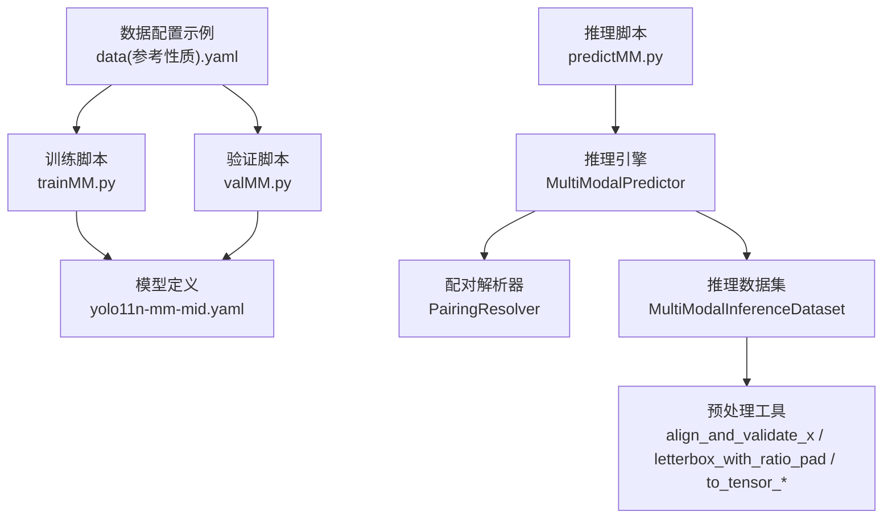
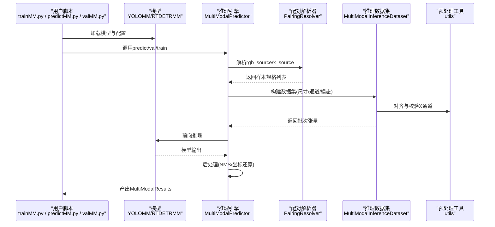
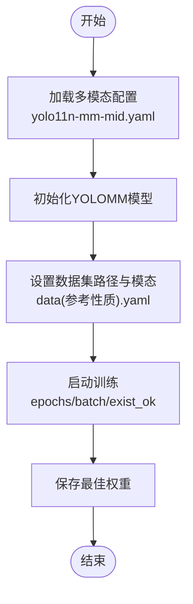
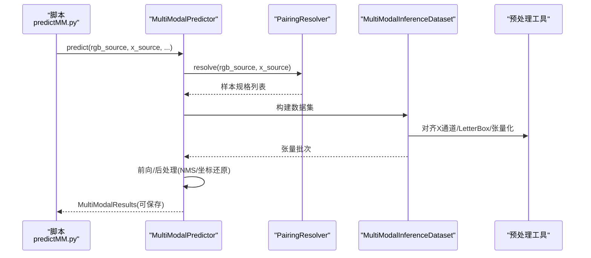
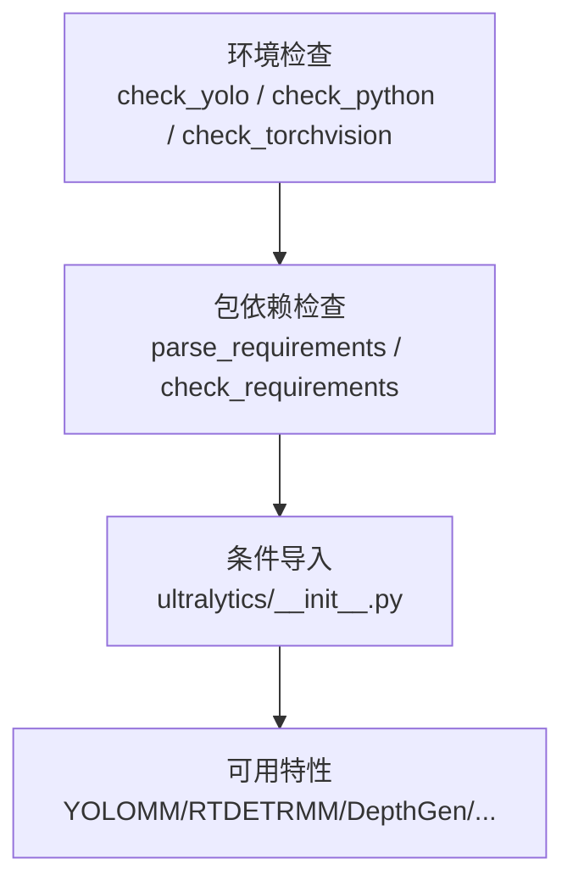

# 快速开始

<cite>
**本文引用的文件**
- [ultralytics/__init__.py](file://ultralytics/__init__.py)
- [ultralytics/utils/checks.py](file://ultralytics/utils/checks.py)
- [ultralytics/cfg/models/mm/yolo11n-mm-mid.yaml](file://ultralytics/cfg/models/mm/yolo11n-mm-mid.yaml)
- [ultralytics/data/multimodal/inference_dataset.py](file://ultralytics/data/multimodal/inference_dataset.py)
- [ultralytics/engine/multimodal/predictor.py](file://ultralytics/engine/multimodal/predictor.py)
- [ultralytics/data/multimodal/utils.py](file://ultralytics/data/multimodal/utils.py)
- [ultralytics/data/multimodal/pairing.py](file://ultralytics/data/multimodal/pairing.py)
- [trainMM.py](file://trainMM.py)
- [predictMM.py](file://predictMM.py)
- [valMM.py](file://valMM.py)
- [data(参考性质).yaml](file://data(参考性质).yaml)
</cite>

## 目录
1. [简介](#简介)
2. [项目结构](#项目结构)
3. [核心组件](#核心组件)
4. [架构总览](#架构总览)
5. [详细组件分析](#详细组件分析)
6. [依赖分析](#依赖分析)
7. [性能考虑](#性能考虑)
8. [故障排除指南](#故障排除指南)
9. [结论](#结论)
10. [附录](#附录)

## 简介
本指南面向希望在30分钟内完成多模态检测系统环境搭建与首次运行的用户。内容覆盖：
- 环境配置与依赖安装
- Python版本与GPU配置建议
- 安装验证与环境检查
- 最简使用流程：数据准备、模型训练、推理预测
- 常见问题与排障

## 项目结构
该仓库围绕多模态检测（RGB+X）提供完整的训练、验证与推理能力，核心模块包括：
- 模型定义与配置：多模态骨干与融合头配置
- 数据与预处理：多模态推理数据集、配对解析、预处理工具
- 推理引擎：独立的多模态推理器
- 示例脚本：训练、推理、验证入口

**图表来源**
- [trainMM.py:1-15](file://trainMM.py#L1-L15)
- [predictMM.py:1-40](file://predictMM.py#L1-L40)
- [valMM.py:1-22](file://valMM.py#L1-L22)
- [ultralytics/cfg/models/mm/yolo11n-mm-mid.yaml:1-75](file://ultralytics/cfg/models/mm/yolo11n-mm-mid.yaml#L1-L75)
- [ultralytics/engine/multimodal/predictor.py:16-494](file://ultralytics/engine/multimodal/predictor.py#L16-L494)
- [ultralytics/data/multimodal/pairing.py:11-203](file://ultralytics/data/multimodal/pairing.py#L11-L203)
- [ultralytics/data/multimodal/inference_dataset.py:16-252](file://ultralytics/data/multimodal/inference_dataset.py#L16-L252)
- [ultralytics/data/multimodal/utils.py:13-180](file://ultralytics/data/multimodal/utils.py#L13-L180)
- [data(参考性质).yaml:1-28](file://data(参考性质).yaml#L1-L28)

**章节来源**
- [trainMM.py:1-15](file://trainMM.py#L1-L15)
- [predictMM.py:1-40](file://predictMM.py#L1-L40)
- [valMM.py:1-22](file://valMM.py#L1-L22)
- [ultralytics/cfg/models/mm/yolo11n-mm-mid.yaml:1-75](file://ultralytics/cfg/models/mm/yolo11n-mm-mid.yaml#L1-L75)
- [ultralytics/engine/multimodal/predictor.py:16-494](file://ultralytics/engine/multimodal/predictor.py#L16-L494)
- [ultralytics/data/multimodal/pairing.py:11-203](file://ultralytics/data/multimodal/pairing.py#L11-L203)
- [ultralytics/data/multimodal/inference_dataset.py:16-252](file://ultralytics/data/multimodal/inference_dataset.py#L16-L252)
- [ultralytics/data/multimodal/utils.py:13-180](file://ultralytics/data/multimodal/utils.py#L13-L180)
- [data(参考性质).yaml:1-28](file://data(参考性质).yaml#L1-L28)

## 核心组件
- 多模态模型定义：提供RGB与X模态双路骨干、P4/P5双层融合与标准检测头的配置模板，便于快速复现实验。
- 多模态推理引擎：独立于基础预测器，负责从模型读取路由配置、构建数据集、执行前向与后处理、流式产出结果。
- 推理数据集与预处理：严格校验输入、空间对齐与通道数一致性、LetterBox与张量化。
- 配对解析器：显式解析RGB与X模态输入，支持单模态与双模态推理。

**章节来源**
- [ultralytics/cfg/models/mm/yolo11n-mm-mid.yaml:1-75](file://ultralytics/cfg/models/mm/yolo11n-mm-mid.yaml#L1-L75)
- [ultralytics/engine/multimodal/predictor.py:16-494](file://ultralytics/engine/multimodal/predictor.py#L16-L494)
- [ultralytics/data/multimodal/inference_dataset.py:16-252](file://ultralytics/data/multimodal/inference_dataset.py#L16-L252)
- [ultralytics/data/multimodal/utils.py:13-180](file://ultralytics/data/multimodal/utils.py#L13-L180)
- [ultralytics/data/multimodal/pairing.py:11-203](file://ultralytics/data/multimodal/pairing.py#L11-L203)

## 架构总览
下图展示了从脚本调用到模型推理的关键交互：

**图表来源**
- [trainMM.py:1-15](file://trainMM.py#L1-L15)
- [predictMM.py:1-40](file://predictMM.py#L1-L40)
- [valMM.py:1-22](file://valMM.py#L1-L22)
- [ultralytics/engine/multimodal/predictor.py:99-244](file://ultralytics/engine/multimodal/predictor.py#L99-L244)
- [ultralytics/data/multimodal/pairing.py:37-125](file://ultralytics/data/multimodal/pairing.py#L37-L125)
- [ultralytics/data/multimodal/inference_dataset.py:94-183](file://ultralytics/data/multimodal/inference_dataset.py#L94-L183)
- [ultralytics/data/multimodal/utils.py:13-180](file://ultralytics/data/multimodal/utils.py#L13-L180)

## 详细组件分析

### 训练流程（YOLOMM）
- 使用示例脚本加载多模态模型配置，指定数据集路径、训练轮次与批大小，即可启动训练。
- 关键要点：确保数据集配置文件中的路径与模态映射正确；若需消融实验可调整模态开关参数。

**图表来源**
- [trainMM.py:6-15](file://trainMM.py#L6-L15)
- [ultralytics/cfg/models/mm/yolo11n-mm-mid.yaml:1-75](file://ultralytics/cfg/models/mm/yolo11n-mm-mid.yaml#L1-L75)
- [data(参考性质).yaml:1-28](file://data(参考性质).yaml#L1-L28)

**章节来源**
- [trainMM.py:1-15](file://trainMM.py#L1-L15)
- [ultralytics/cfg/models/mm/yolo11n-mm-mid.yaml:1-75](file://ultralytics/cfg/models/mm/yolo11n-mm-mid.yaml#L1-L75)
- [data(参考性质).yaml:1-28](file://data(参考性质).yaml#L1-L28)

### 推理流程（双模态/单模态）
- 支持显式rgb_source与x_source输入，可进行双模态、仅RGB或仅X模态推理。
- 引擎自动识别模型类型（YOLO/RTDETR），执行对应后处理与坐标还原，并可流式返回结果。

**图表来源**
- [predictMM.py:5-40](file://predictMM.py#L5-L40)
- [ultralytics/engine/multimodal/predictor.py:99-244](file://ultralytics/engine/multimodal/predictor.py#L99-L244)
- [ultralytics/data/multimodal/pairing.py:37-125](file://ultralytics/data/multimodal/pairing.py#L37-L125)
- [ultralytics/data/multimodal/inference_dataset.py:94-183](file://ultralytics/data/multimodal/inference_dataset.py#L94-L183)
- [ultralytics/data/multimodal/utils.py:13-180](file://ultralytics/data/multimodal/utils.py#L13-L180)

**章节来源**
- [predictMM.py:1-40](file://predictMM.py#L1-L40)
- [ultralytics/engine/multimodal/predictor.py:16-494](file://ultralytics/engine/multimodal/predictor.py#L16-L494)
- [ultralytics/data/multimodal/pairing.py:11-203](file://ultralytics/data/multimodal/pairing.py#L11-L203)
- [ultralytics/data/multimodal/inference_dataset.py:16-252](file://ultralytics/data/multimodal/inference_dataset.py#L16-L252)
- [ultralytics/data/multimodal/utils.py:13-180](file://ultralytics/data/multimodal/utils.py#L13-L180)

### 验证流程（可选）
- 通过验证脚本加载已训练权重，对指定数据集进行评估，可切换设备（CPU/GPU）与模态组合。

**章节来源**
- [valMM.py:1-22](file://valMM.py#L1-L22)

## 依赖分析
- 版本与环境检查：提供Python版本、PyTorch/Torchvision兼容性、CUDA可用性、磁盘与内存信息等检查工具。
- 包依赖：通过解析requirements或包元数据，自动检测并提示缺失或不兼容的依赖。
- 条件导入：多模态相关组件（如YOLOMM、RTDETRMM、DepthGen等）在可用时才加入导出清单。

**图表来源**
- [ultralytics/utils/checks.py:343-471](file://ultralytics/utils/checks.py#L343-L471)
- [ultralytics/utils/checks.py:53-81](file://ultralytics/utils/checks.py#L53-L81)
- [ultralytics/__init__.py:14-85](file://ultralytics/__init__.py#L14-L85)

**章节来源**
- [ultralytics/utils/checks.py:343-471](file://ultralytics/utils/checks.py#L343-L471)
- [ultralytics/utils/checks.py:53-81](file://ultralytics/utils/checks.py#L53-L81)
- [ultralytics/__init__.py:14-85](file://ultralytics/__init__.py#L14-L85)

## 性能考虑
- 推理尺寸与步长：确保输入尺寸为模型步长的倍数，避免额外缩放开销。
- 设备选择：优先使用GPU；若显存不足，适当降低batch或imgsz。
- 后处理：YOLO与RTDETR采用不同后处理路径，注意NMS与坐标还原参数。
- 流式推理：启用流式可降低内存峰值，适合大批量推理。

[本节为通用指导，无需特定文件引用]

## 故障排除指南
- Python版本不满足：使用环境检查工具确认当前版本，升级至满足要求的版本。
- PyTorch/Torchvision不兼容：根据兼容表调整版本，确保与CUDA版本匹配。
- CUDA不可用或显存不足：切换至CPU或减小batch/imgsz；检查CUDA驱动与cuDNN版本。
- 模型未找到或权重损坏：确认权重路径与文件后缀，必要时重新下载。
- 数据路径或模态不匹配：核对数据配置文件中的路径与模态映射，确保通道数与空间尺寸一致。
- 预处理报错（通道数/尺寸）：使用配对解析器与预处理工具，确保X模态与RGB对齐且通道数符合预期。

**章节来源**
- [ultralytics/utils/checks.py:343-471](file://ultralytics/utils/checks.py#L343-L471)
- [ultralytics/data/multimodal/utils.py:13-83](file://ultralytics/data/multimodal/utils.py#L13-L83)
- [ultralytics/data/multimodal/pairing.py:37-125](file://ultralytics/data/multimodal/pairing.py#L37-L125)

## 结论
通过本指南，您可以在30分钟内完成多模态检测系统的环境准备、安装验证与首次运行。建议先从最小配置（单机CPU）开始，逐步迁移至GPU与更大规模数据集，结合示例脚本与配置文件快速复现实验。

[本节为总结，无需特定文件引用]

## 附录

### 环境配置与安装验证步骤
- 确认Python版本满足要求
- 安装依赖（可使用内置检查工具自动检测与提示）
- 验证PyTorch/Torchvision/CUDA兼容性
- 运行环境检查工具输出系统信息

**章节来源**
- [ultralytics/utils/checks.py:343-471](file://ultralytics/utils/checks.py#L343-L471)
- [ultralytics/utils/checks.py:666-724](file://ultralytics/utils/checks.py#L666-L724)

### 最简单使用示例（不含代码内容）
- 数据准备：准备RGB与X模态图像，配置数据集路径与模态映射
- 模型训练：加载多模态配置，设置数据路径与训练参数，启动训练
- 推理预测：指定rgb_source与x_source，执行推理并保存结果
- 验证评估：加载权重，对验证集进行评估

**章节来源**
- [data(参考性质).yaml:1-28](file://data(参考性质).yaml#L1-L28)
- [trainMM.py:6-15](file://trainMM.py#L6-L15)
- [predictMM.py:5-40](file://predictMM.py#L5-L40)
- [valMM.py:5-18](file://valMM.py#L5-L18)