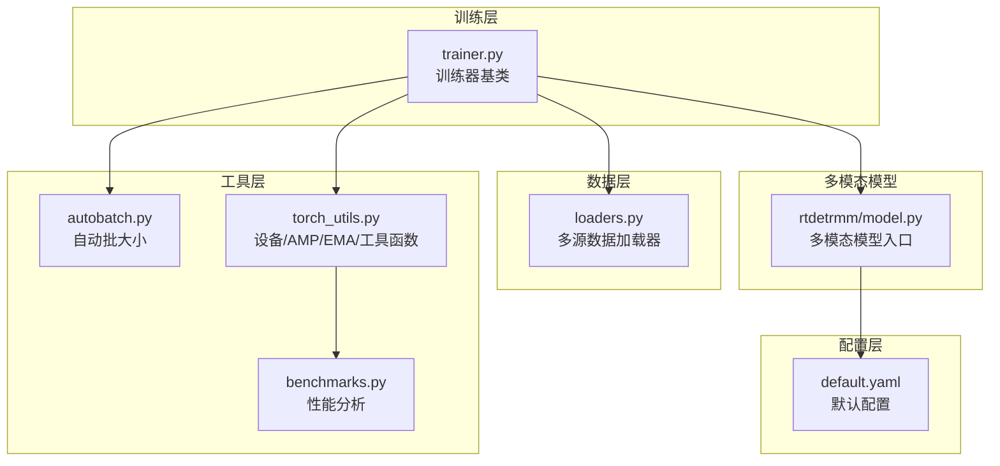
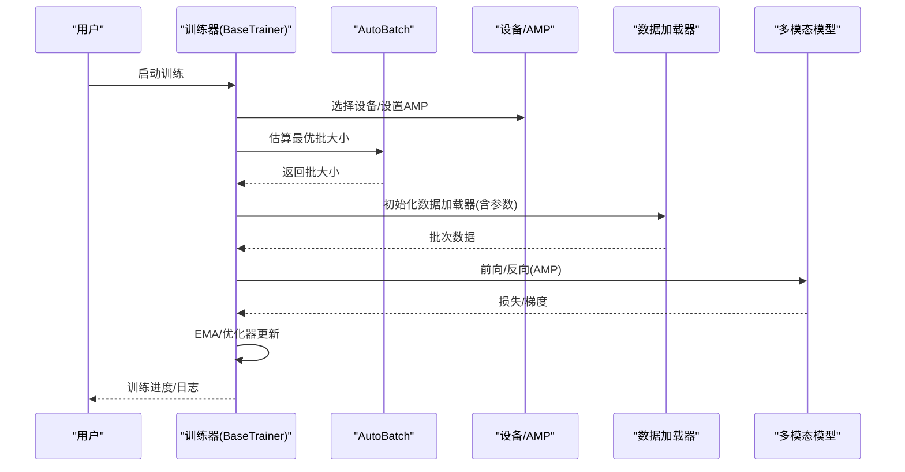
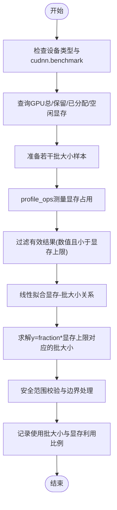
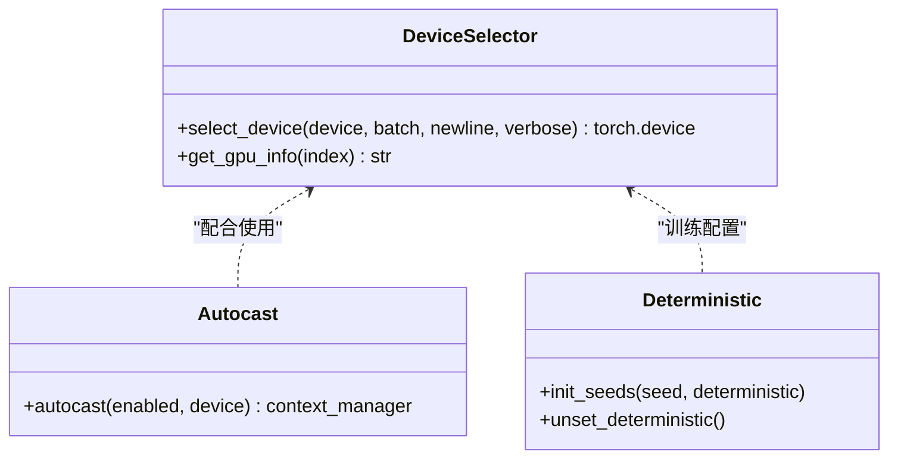
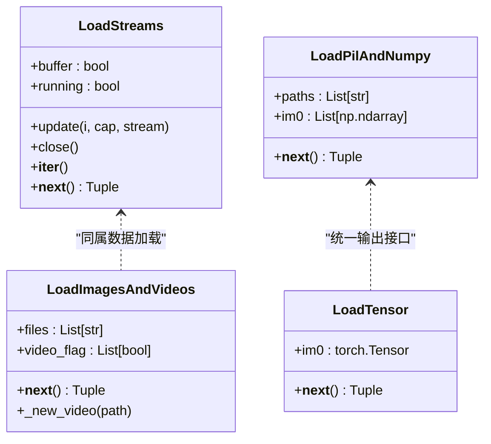
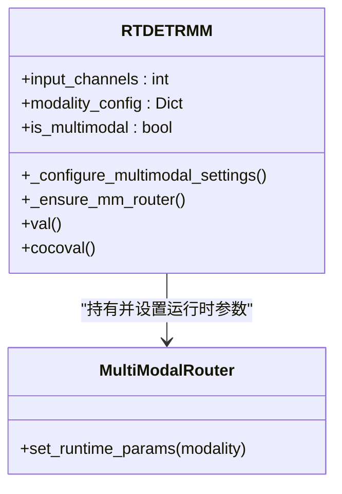
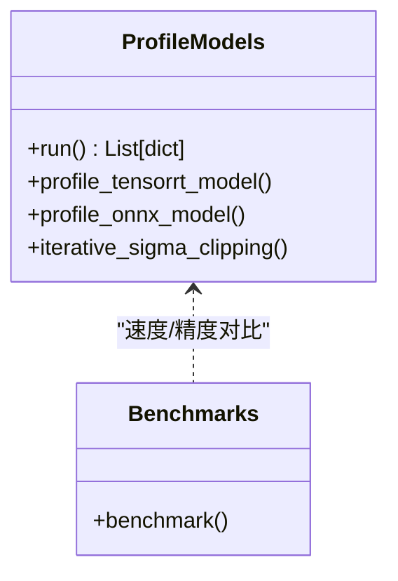
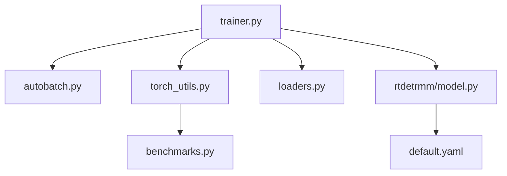

# 内存优化方法

<cite>
**本文档引用的文件**
- [ultralytics/utils/autobatch.py](file://ultralytics/utils/autobatch.py)
- [ultralytics/utils/torch_utils.py](file://ultralytics/utils/torch_utils.py)
- [ultralytics/data/loaders.py](file://ultralytics/data/loaders.py)
- [ultralytics/engine/trainer.py](file://ultralytics/engine/trainer.py)
- [ultralytics/models/rtdetrmm/model.py](file://ultralytics/models/rtdetrmm/model.py)
- [ultralytics/cfg/default.yaml](file://ultralytics/cfg/default.yaml)
- [ultralytics/utils/benchmarks.py](file://ultralytics/utils/benchmarks.py)
</cite>

## 目录
1. [简介](#简介)
2. [项目结构](#项目结构)
3. [核心组件](#核心组件)
4. [架构总览](#架构总览)
5. [详细组件分析](#详细组件分析)
6. [依赖关系分析](#依赖关系分析)
7. [性能考虑](#性能考虑)
8. [故障排查指南](#故障排查指南)
9. [结论](#结论)
10. [附录](#附录)

## 简介
本指南聚焦于多模态检测系统中的内存优化实践，围绕以下主题展开：
- 训练过程中的显存占用降低：梯度检查点、AMP、EMA、自动批大小（AutoBatch）、数据加载器参数优化
- 数据加载与缓存：prefetch_factor、persistent_workers、buffer 策略
- 张量操作与内存释放：in-place 操作、及时释放中间变量、empty_cache
- 显存碎片整理与峰值控制：torch.cuda.empty_cache、cudnn.benchmark 设置
- 监控与分析：GPU 内存统计、批大小估计流程、速度与精度权衡
- 实战配置示例与性能提升建议

## 项目结构
该仓库采用模块化组织，内存优化相关能力主要分布在如下模块：
- 工具层：自动批大小、设备选择、AMP 上下文、模型信息与性能分析
- 数据层：多源数据加载器（视频流、截图、图像/视频目录、PIL/Numpy/Tensor）
- 训练层：训练器基类、回调、优化器状态转换、EMA
- 多模态模型：RTDETRMM 的多模态路由与推理适配
- 配置层：默认配置文件，包含多模态增强与训练参数



**图表来源**
- [ultralytics/engine/trainer.py:191-200](file://ultralytics/engine/trainer.py#L191-L200)
- [ultralytics/utils/autobatch.py:15-42](file://ultralytics/utils/autobatch.py#L15-L42)
- [ultralytics/utils/torch_utils.py:77-104](file://ultralytics/utils/torch_utils.py#L77-L104)
- [ultralytics/data/loaders.py:52-92](file://ultralytics/data/loaders.py#L52-L92)
- [ultralytics/models/rtdetrmm/model.py:25-57](file://ultralytics/models/rtdetrmm/model.py#L25-L57)
- [ultralytics/cfg/default.yaml:134-168](file://ultralytics/cfg/default.yaml#L134-L168)

**章节来源**
- [ultralytics/engine/trainer.py:191-200](file://ultralytics/engine/trainer.py#L191-L200)
- [ultralytics/utils/autobatch.py:15-42](file://ultralytics/utils/autobatch.py#L15-L42)
- [ultralytics/utils/torch_utils.py:77-104](file://ultralytics/utils/torch_utils.py#L77-L104)
- [ultralytics/data/loaders.py:52-92](file://ultralytics/data/loaders.py#L52-L92)
- [ultralytics/models/rtdetrmm/model.py:25-57](file://ultralytics/models/rtdetrmm/model.py#L25-L57)
- [ultralytics/cfg/default.yaml:134-168](file://ultralytics/cfg/default.yaml#L134-L168)

## 核心组件
- 自动批大小（AutoBatch）：根据 GPU 显存占用曲线估计最优批大小，避免 OOM 并最大化吞吐
- 设备与 AMP：统一的 autocast 上下文、设备选择、确定性训练开关
- 数据加载器：多源输入适配、缓冲策略、线程安全与资源释放
- 训练器基类：训练循环、回调、EMA、优化器状态管理
- 多模态路由：RTDETRMM 的模态配置与推理适配，支持 RGB/X 双模态输入
- 性能分析：模型信息、FLOPs、ONNX/TensorRT 推理速度对比

**章节来源**
- [ultralytics/utils/autobatch.py:45-120](file://ultralytics/utils/autobatch.py#L45-L120)
- [ultralytics/utils/torch_utils.py:77-104](file://ultralytics/utils/torch_utils.py#L77-L104)
- [ultralytics/data/loaders.py:307-487](file://ultralytics/data/loaders.py#L307-L487)
- [ultralytics/engine/trainer.py:59-108](file://ultralytics/engine/trainer.py#L59-L108)
- [ultralytics/models/rtdetrmm/model.py:25-57](file://ultralytics/models/rtdetrmm/model.py#L25-L57)
- [ultralytics/utils/benchmarks.py:360-490](file://ultralytics/utils/benchmarks.py#L360-L490)

## 架构总览
训练与推理路径中，内存优化的关键节点如下：
- 训练前：AutoBatch 估算批大小，AMP 启用，设备选择
- 训练中：EMA 减少过拟合并稳定训练，in-place 操作与及时释放中间变量
- 数据加载：prefetch_factor、persistent_workers、buffer 控制内存与吞吐
- 推理/验证：多模态路由按需切换，避免不必要的模态计算



**图表来源**
- [ultralytics/engine/trainer.py:191-200](file://ultralytics/engine/trainer.py#L191-L200)
- [ultralytics/utils/autobatch.py:45-120](file://ultralytics/utils/autobatch.py#L45-L120)
- [ultralytics/utils/torch_utils.py:77-104](file://ultralytics/utils/torch_utils.py#L77-L104)
- [ultralytics/data/loaders.py:307-487](file://ultralytics/data/loaders.py#L307-L487)
- [ultralytics/models/rtdetrmm/model.py:25-57](file://ultralytics/models/rtdetrmm/model.py#L25-L57)

## 详细组件分析

### 自动批大小（AutoBatch）实现与内存优化
AutoBatch 通过在不同批大小下测量显存占用，拟合线性回归并预测在目标显存利用率下的最优批大小，同时处理失败点与边界情况，并在最后调用显存清理。



**图表来源**
- [ultralytics/utils/autobatch.py:45-120](file://ultralytics/utils/autobatch.py#L45-L120)

**章节来源**
- [ultralytics/utils/autobatch.py:15-120](file://ultralytics/utils/autobatch.py#L15-L120)

### 设备选择与自动混合精度（AMP）
- 设备选择：支持 CPU/MPS/CUDA，多 GPU 时校验批大小整除性，打印设备信息
- AMP 上下文：兼容不同 PyTorch 版本的 autocast API，统一在训练/推理中使用
- 确定性训练：可选的确定性模式与 cudnn 设置，避免 AutoBatch 问题



**图表来源**
- [ultralytics/utils/torch_utils.py:131-252](file://ultralytics/utils/torch_utils.py#L131-L252)
- [ultralytics/utils/torch_utils.py:77-104](file://ultralytics/utils/torch_utils.py#L77-L104)
- [ultralytics/utils/torch_utils.py:673-705](file://ultralytics/utils/torch_utils.py#L673-L705)

**章节来源**
- [ultralytics/utils/torch_utils.py:131-252](file://ultralytics/utils/torch_utils.py#L131-L252)
- [ultralytics/utils/torch_utils.py:77-104](file://ultralytics/utils/torch_utils.py#L77-L104)
- [ultralytics/utils/torch_utils.py:673-705](file://ultralytics/utils/torch_utils.py#L673-L705)

### 数据加载器内存优化
- 多源适配：视频流、截图、图像/视频目录、PIL/Numpy/Tensor
- 缓冲策略：LoadStreams 支持 buffer 开关，避免长时间等待与内存堆积
- 线程与资源：后台线程读取帧，退出时释放 VideoCapture，避免句柄泄漏
- 图像预处理：统一通道数与格式，保证连续内存布局



**图表来源**
- [ultralytics/data/loaders.py:52-225](file://ultralytics/data/loaders.py#L52-L225)
- [ultralytics/data/loaders.py:307-487](file://ultralytics/data/loaders.py#L307-L487)
- [ultralytics/data/loaders.py:489-636](file://ultralytics/data/loaders.py#L489-L636)

**章节来源**
- [ultralytics/data/loaders.py:52-225](file://ultralytics/data/loaders.py#L52-L225)
- [ultralytics/data/loaders.py:307-487](file://ultralytics/data/loaders.py#L307-L487)
- [ultralytics/data/loaders.py:489-636](file://ultralytics/data/loaders.py#L489-L636)

### 训练器基类与内存管理
- 训练循环：初始化设备、数据集、模型、EMA、优化器与调度器
- 回调与保存：定期保存权重，支持断点续训
- EMA：指数滑动平均，减少过拟合并稳定训练
- 优化器状态：支持半精度优化器状态转换与剥离

```mermaid
sequenceDiagram
participant TR as "BaseTrainer"
participant EMA as "EMA"
participant OPT as "优化器"
participant CKPT as "检查点"
TR->>TR : 初始化参数/设备/数据集
TR->>EMA : 更新EMA参数
EMA-->>TR : EMA模型
TR->>OPT : 优化器step/zero_grad
TR->>CKPT : 保存last.pt/best.pt
CKPT-->>TR : 断点续训
```

**图表来源**
- [ultralytics/engine/trainer.py:59-108](file://ultralytics/engine/trainer.py#L59-L108)
- [ultralytics/utils/torch_utils.py:707-773](file://ultralytics/utils/torch_utils.py#L707-L773)

**章节来源**
- [ultralytics/engine/trainer.py:59-108](file://ultralytics/engine/trainer.py#L59-L108)
- [ultralytics/utils/torch_utils.py:707-773](file://ultralytics/utils/torch_utils.py#L707-L773)

### 多模态模型与内存优化
- 模态配置：根据 YAML 识别多模态层，推断输入通道（3 或 6），支持 RGB/X/Dual
- 路由保障：确保底层模型持有 mm_router，避免运行时缺失
- 验证与 COCO 评估：默认 rect=False，避免非方形输入导致的缩放误差与指标异常



**图表来源**
- [ultralytics/models/rtdetrmm/model.py:25-189](file://ultralytics/models/rtdetrmm/model.py#L25-L189)

**章节来源**
- [ultralytics/models/rtdetrmm/model.py:25-189](file://ultralytics/models/rtdetrmm/model.py#L25-L189)

### 性能分析与监控
- 模型信息：参数量、梯度数、FLOPs（thop 或 torch profiler）
- ONNX/TensorRT 速度对比：提供统一的 ProfileModels 类，支持 sigma 截断统计
- 基准测试：benchmark 函数，跨格式评估速度与精度



**图表来源**
- [ultralytics/utils/benchmarks.py:360-490](file://ultralytics/utils/benchmarks.py#L360-L490)
- [ultralytics/utils/benchmarks.py:52-212](file://ultralytics/utils/benchmarks.py#L52-L212)

**章节来源**
- [ultralytics/utils/benchmarks.py:360-490](file://ultralytics/utils/benchmarks.py#L360-L490)
- [ultralytics/utils/benchmarks.py:52-212](file://ultralytics/utils/benchmarks.py#L52-L212)

## 依赖关系分析
- 训练器依赖 AutoBatch 与 torch_utils，确保设备与 AMP 正确配置
- 数据加载器提供统一接口，支持多源输入与缓冲策略
- 多模态模型依赖配置文件中的多模态增强参数，影响训练与推理内存占用
- 性能分析模块为内存优化提供量化依据



**图表来源**
- [ultralytics/engine/trainer.py:40-56](file://ultralytics/engine/trainer.py#L40-L56)
- [ultralytics/utils/autobatch.py:15-42](file://ultralytics/utils/autobatch.py#L15-L42)
- [ultralytics/utils/torch_utils.py:21-33](file://ultralytics/utils/torch_utils.py#L21-L33)
- [ultralytics/data/loaders.py:1-22](file://ultralytics/data/loaders.py#L1-L22)
- [ultralytics/models/rtdetrmm/model.py:16-23](file://ultralytics/models/rtdetrmm/model.py#L16-L23)
- [ultralytics/cfg/default.yaml:134-168](file://ultralytics/cfg/default.yaml#L134-L168)
- [ultralytics/utils/benchmarks.py:42-49](file://ultralytics/utils/benchmarks.py#L42-L49)

**章节来源**
- [ultralytics/engine/trainer.py:40-56](file://ultralytics/engine/trainer.py#L40-L56)
- [ultralytics/utils/autobatch.py:15-42](file://ultralytics/utils/autobatch.py#L15-L42)
- [ultralytics/utils/torch_utils.py:21-33](file://ultralytics/utils/torch_utils.py#L21-L33)
- [ultralytics/data/loaders.py:1-22](file://ultralytics/data/loaders.py#L1-L22)
- [ultralytics/models/rtdetrmm/model.py:16-23](file://ultralytics/models/rtdetrmm/model.py#L16-L23)
- [ultralytics/cfg/default.yaml:134-168](file://ultralytics/cfg/default.yaml#L134-L168)
- [ultralytics/utils/benchmarks.py:42-49](file://ultralytics/utils/benchmarks.py#L42-L49)

## 性能考虑
- 显存峰值控制
  - 使用 AutoBatch 动态确定批大小，避免 OOM
  - 在训练循环末尾调用显存清理，减少碎片化
  - 关闭 cudnn.benchmark 或在固定输入尺寸时启用以获得稳定性能
- 数据加载优化
  - 合理设置 workers 与 persistent_workers，平衡吞吐与内存
  - 对视频流启用 buffer，减少频繁分配与释放
- 张量操作
  - 优先使用 in-place 操作（如激活函数 inplace=True）
  - 及时释放不需要的中间变量，避免累积
- 多模态内存
  - 仅在需要时加载对应模态数据，避免同时持有 RGB+X
  - 使用路由按需切换模态，减少冗余计算

[本节为通用指导，无需特定文件引用]

## 故障排查指南
- AutoBatch 报错或批大小异常
  - 检查 cudnn.benchmark 是否为 False，否则回退到默认批大小
  - 确认 GPU 显存查询正常，避免环境变量 CUDA_VISIBLE_DEVICES 设置错误
- 数据加载卡顿或内存飙升
  - 适当降低 workers，或启用 persistent_workers
  - 对视频流启用 buffer，避免无限增长的帧队列
- 训练不稳定或 OOM
  - 启用 AMP，适当降低批大小
  - 使用 EMA 平滑损失，减少过拟合
- 多模态推理错误
  - 确认输入通道数与 YAML 配置一致（3 或 6）
  - 验证 mm_router 是否存在并正确设置运行时模态

**章节来源**
- [ultralytics/utils/autobatch.py:65-75](file://ultralytics/utils/autobatch.py#L65-L75)
- [ultralytics/utils/autobatch.py:86-84](file://ultralytics/utils/autobatch.py#L86-L84)
- [ultralytics/data/loaders.py:155-177](file://ultralytics/data/loaders.py#L155-L177)
- [ultralytics/utils/torch_utils.py:707-773](file://ultralytics/utils/torch_utils.py#L707-L773)
- [ultralytics/models/rtdetrmm/model.py:148-180](file://ultralytics/models/rtdetrmm/model.py#L148-L180)

## 结论
通过 AutoBatch、AMP、EMA、合理的数据加载器参数与多模态路由控制，可以在多模态检测系统中显著降低显存占用并提升稳定性。结合性能分析工具，可以量化优化效果并在不同硬件上实现可重复的内存优化策略。

[本节为总结，无需特定文件引用]

## 附录

### 配置示例与建议
- 自动批大小
  - 在训练配置中设置 batch=-1，启用 AutoBatch；或直接传入 fraction 参数控制显存利用率
  - 参考路径：[ultralytics/utils/autobatch.py:15-42](file://ultralytics/utils/autobatch.py#L15-L42)
- 设备与 AMP
  - 使用 select_device 指定设备；AMP 通过 autocast 上下文启用
  - 参考路径：[ultralytics/utils/torch_utils.py:131-252](file://ultralytics/utils/torch_utils.py#L131-L252)
- 数据加载器参数
  - workers、persistent_workers、buffer 等参数在数据加载器初始化时生效
  - 参考路径：[ultralytics/data/loaders.py:94-153](file://ultralytics/data/loaders.py#L94-L153)
- 多模态增强
  - 在默认配置中启用多模态增强与异步几何扰动、模态擦除等策略
  - 参考路径：[ultralytics/cfg/default.yaml:143-168](file://ultralytics/cfg/default.yaml#L143-L168)

**章节来源**
- [ultralytics/utils/autobatch.py:15-42](file://ultralytics/utils/autobatch.py#L15-L42)
- [ultralytics/utils/torch_utils.py:131-252](file://ultralytics/utils/torch_utils.py#L131-L252)
- [ultralytics/data/loaders.py:94-153](file://ultralytics/data/loaders.py#L94-L153)
- [ultralytics/cfg/default.yaml:143-168](file://ultralytics/cfg/default.yaml#L143-L168)