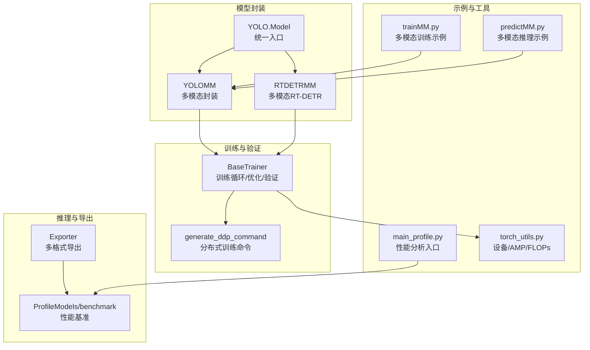
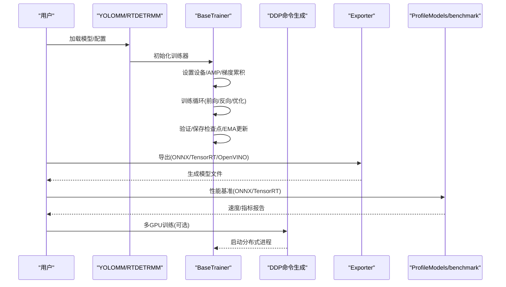
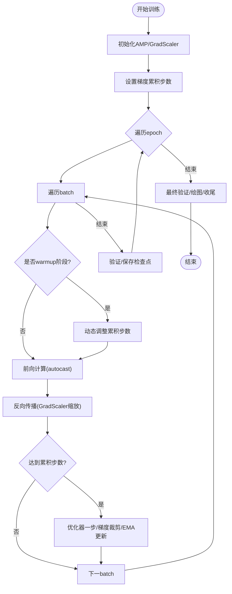
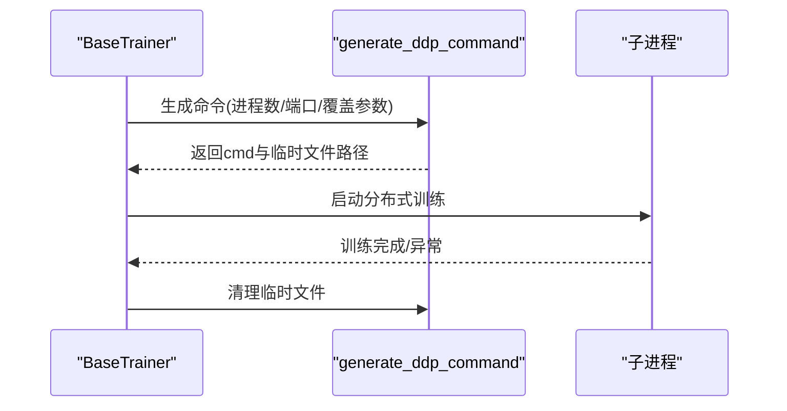
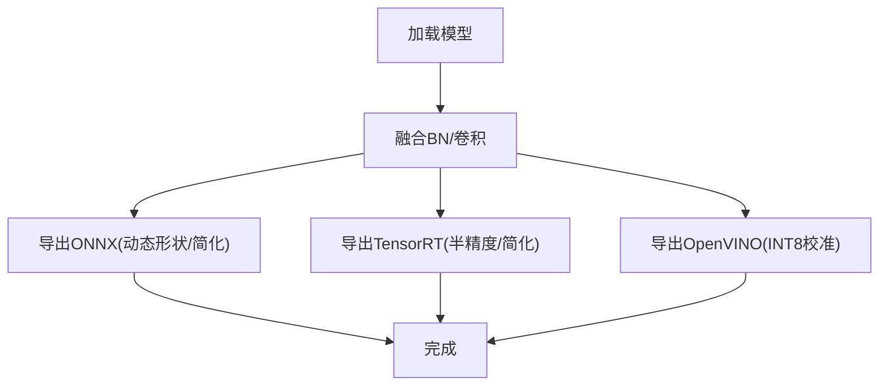
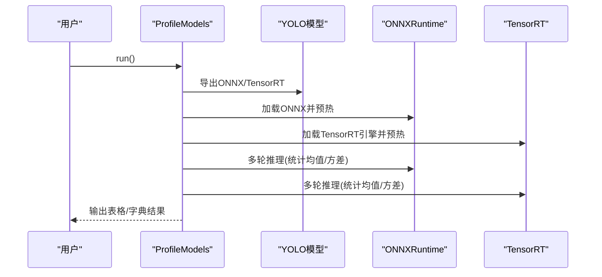
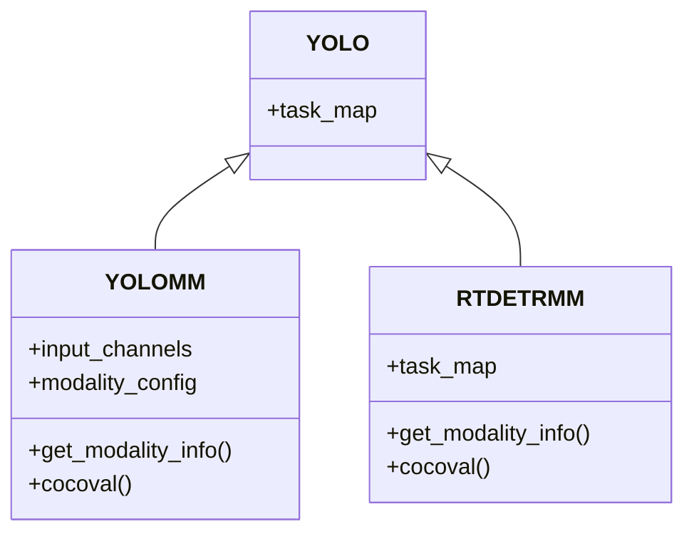
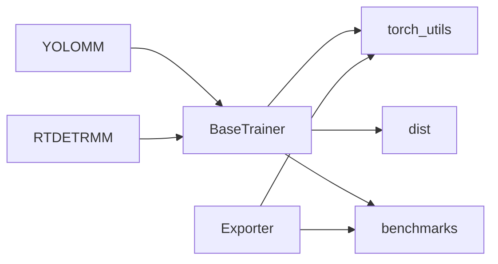

# 性能优化与调试

<cite>
**本文档引用的文件**
- [ultralytics/engine/trainer.py](file://ultralytics/engine/trainer.py)
- [ultralytics/utils/torch_utils.py](file://ultralytics/utils/torch_utils.py)
- [ultralytics/utils/benchmarks.py](file://ultralytics/utils/benchmarks.py)
- [ultralytics/utils/dist.py](file://ultralytics/utils/dist.py)
- [ultralytics/engine/exporter.py](file://ultralytics/engine/exporter.py)
- [ultralytics/models/yolo/model.py](file://ultralytics/models/yolo/model.py)
- [ultralytics/models/rtdetrmm/model.py](file://ultralytics/models/rtdetrmm/model.py)
- [trainMM.py](file://trainMM.py)
- [predictMM.py](file://predictMM.py)
- [main_profile.py](file://main_profile.py)
</cite>

## 目录
1. [简介](#简介)
2. [项目结构](#项目结构)
3. [核心组件](#核心组件)
4. [架构总览](#架构总览)
5. [详细组件分析](#详细组件分析)
6. [依赖关系分析](#依赖关系分析)
7. [性能考虑](#性能考虑)
8. [故障排除指南](#故障排除指南)
9. [结论](#结论)
10. [附录](#附录)

## 简介
本指南面向多模态检测系统的性能优化与调试，围绕训练加速（混合精度、梯度累积、分布式训练）、推理优化（量化、蒸馏、导出部署）、内存优化（梯度检查点、内存池管理、批大小优化）以及调试与故障排除（瓶颈定位、日志分析、基准测试与监控）展开。文档结合代码库中的训练器、工具函数、导出器与示例脚本，提供可操作的策略与最佳实践。

## 项目结构
该仓库包含多模态检测模型（YOLOMM、RTDETRMM）的训练、验证、导出与可视化能力，配套基准测试与分布式训练工具。关键目录与文件如下：
- 训练与验证：ultralytics/engine/trainer.py、ultralytics/utils/dist.py
- 推理与导出：ultralytics/engine/exporter.py、ultralytics/utils/benchmarks.py
- 模型封装：ultralytics/models/yolo/model.py、ultralytics/models/rtdetrmm/model.py
- 示例脚本：trainMM.py、predictMM.py、main_profile.py
- 工具函数：ultralytics/utils/torch_utils.py

图示来源
- [ultralytics/engine/trainer.py:191-504](file://ultralytics/engine/trainer.py#L191-L504)
- [ultralytics/utils/dist.py:79-99](file://ultralytics/utils/dist.py#L79-L99)
- [ultralytics/engine/exporter.py:267-534](file://ultralytics/engine/exporter.py#L267-L534)
- [ultralytics/utils/benchmarks.py:436-489](file://ultralytics/utils/benchmarks.py#L436-L489)
- [ultralytics/models/yolo/model.py:456-741](file://ultralytics/models/yolo/model.py#L456-L741)
- [ultralytics/models/rtdetrmm/model.py:25-189](file://ultralytics/models/rtdetrmm/model.py#L25-L189)
- [trainMM.py:1-15](file://trainMM.py#L1-L15)
- [predictMM.py:1-40](file://predictMM.py#L1-L40)
- [main_profile.py](file://main_profile.py)

章节来源
- [ultralytics/engine/trainer.py:191-504](file://ultralytics/engine/trainer.py#L191-L504)
- [ultralytics/utils/dist.py:79-99](file://ultralytics/utils/dist.py#L79-L99)
- [ultralytics/engine/exporter.py:267-534](file://ultralytics/engine/exporter.py#L267-L534)
- [ultralytics/utils/benchmarks.py:436-489](file://ultralytics/utils/benchmarks.py#L436-L489)
- [ultralytics/models/yolo/model.py:456-741](file://ultralytics/models/yolo/model.py#L456-L741)
- [ultralytics/models/rtdetrmm/model.py:25-189](file://ultralytics/models/rtdetrmm/model.py#L25-L189)
- [trainMM.py:1-15](file://trainMM.py#L1-L15)
- [predictMM.py:1-40](file://predictMM.py#L1-L40)
- [main_profile.py](file://main_profile.py)

## 核心组件
- 训练器（BaseTrainer）：负责训练循环、梯度累积、学习率调度、早停、EMA、验证与检查点保存、混合精度与自动批大小估算。
- 分布式训练（DDP）：自动生成多进程命令、端口分配、临时文件清理。
- 推理与导出（Exporter）：统一导出到多种格式（ONNX/TensorRT/OpenVINO等），支持量化与简化。
- 基准测试（ProfileModels/benchmark）：跨格式性能对比、TensorRT/ONNX速度分析、FLOPs统计。
- 模型封装（YOLOMM/RTDETRMM）：多模态输入通道配置、模态路由、COCO指标验证。
- 工具函数（torch_utils）：设备选择、AMP上下文、FLOPs统计、模型信息汇总。

章节来源
- [ultralytics/engine/trainer.py:191-504](file://ultralytics/engine/trainer.py#L191-L504)
- [ultralytics/utils/dist.py:29-77](file://ultralytics/utils/dist.py#L29-L77)
- [ultralytics/engine/exporter.py:203-252](file://ultralytics/engine/exporter.py#L203-L252)
- [ultralytics/utils/benchmarks.py:360-490](file://ultralytics/utils/benchmarks.py#L360-L490)
- [ultralytics/models/yolo/model.py:456-741](file://ultralytics/models/yolo/model.py#L456-L741)
- [ultralytics/models/rtdetrmm/model.py:25-189](file://ultralytics/models/rtdetrmm/model.py#L25-L189)
- [ultralytics/utils/torch_utils.py:77-104](file://ultralytics/utils/torch_utils.py#L77-L104)

## 架构总览
多模态检测系统采用“模型封装 + 训练器 + 导出/基准”的分层架构。训练器统一处理优化、验证与日志；导出器负责跨平台部署；基准工具提供性能对比与调优依据；模型封装负责多模态输入与路由。

图示来源
- [ultralytics/models/yolo/model.py:456-741](file://ultralytics/models/yolo/model.py#L456-L741)
- [ultralytics/models/rtdetrmm/model.py:25-189](file://ultralytics/models/rtdetrmm/model.py#L25-L189)
- [ultralytics/engine/trainer.py:191-504](file://ultralytics/engine/trainer.py#L191-L504)
- [ultralytics/utils/dist.py:79-99](file://ultralytics/utils/dist.py#L79-L99)
- [ultralytics/engine/exporter.py:267-534](file://ultralytics/engine/exporter.py#L267-L534)
- [ultralytics/utils/benchmarks.py:436-489](file://ultralytics/utils/benchmarks.py#L436-L489)

## 详细组件分析

### 训练器（BaseTrainer）与混合精度、梯度累积
- 混合精度（AMP）：通过自动上下文管理器启用AMP，GradScaler缩放梯度，减少显存占用并提升吞吐。
- 梯度累积：通过累计步数控制优化器更新频率，模拟更大批次效果。
- 学习率调度：支持余弦退火与线性衰减，warmup阶段动态调整累积步数。
- 早停与EMA：EarlyStopping与指数滑动平均模型，提升泛化与稳定性。
- 内存管理：周期性清空缓存与垃圾回收，防止显存碎片化。

图示来源
- [ultralytics/engine/trainer.py:344-492](file://ultralytics/engine/trainer.py#L344-L492)
- [ultralytics/utils/torch_utils.py:77-104](file://ultralytics/utils/torch_utils.py#L77-L104)

章节来源
- [ultralytics/engine/trainer.py:281-342](file://ultralytics/engine/trainer.py#L281-L342)
- [ultralytics/engine/trainer.py:390-421](file://ultralytics/engine/trainer.py#L390-L421)
- [ultralytics/engine/trainer.py:457-470](file://ultralytics/engine/trainer.py#L457-L470)
- [ultralytics/utils/torch_utils.py:77-104](file://ultralytics/utils/torch_utils.py#L77-L104)

### 分布式训练（DDP）
- 自动生成多进程命令，分配空闲端口，创建临时文件，结束后清理。
- 支持多GPU训练，自动广播AMP开关与权重初始化。

图示来源
- [ultralytics/utils/dist.py:79-99](file://ultralytics/utils/dist.py#L79-L99)
- [ultralytics/utils/dist.py:102-120](file://ultralytics/utils/dist.py#L102-L120)
- [ultralytics/engine/trainer.py:204-227](file://ultralytics/engine/trainer.py#L204-L227)

章节来源
- [ultralytics/utils/dist.py:29-77](file://ultralytics/utils/dist.py#L29-L77)
- [ultralytics/utils/dist.py:79-99](file://ultralytics/utils/dist.py#L79-L99)
- [ultralytics/engine/trainer.py:204-227](file://ultralytics/engine/trainer.py#L204-L227)

### 推理优化与导出（Exporter）
- 支持ONNX/TensorRT/OpenVINO/CoreML/TensorFlow等格式导出。
- 支持INT8校准（OpenVINO NNCF量化）、ONNX简化、TensorRT引擎构建。
- 自动融合BN/卷积，冻结参数，导出前模型准备。

图示来源
- [ultralytics/engine/exporter.py:387-431](file://ultralytics/engine/exporter.py#L387-L431)
- [ultralytics/engine/exporter.py:576-633](file://ultralytics/engine/exporter.py#L576-L633)
- [ultralytics/engine/exporter.py:709-732](file://ultralytics/engine/exporter.py#L709-L732)
- [ultralytics/engine/exporter.py:635-708](file://ultralytics/engine/exporter.py#L635-L708)

章节来源
- [ultralytics/engine/exporter.py:114-148](file://ultralytics/engine/exporter.py#L114-L148)
- [ultralytics/engine/exporter.py:267-534](file://ultralytics/engine/exporter.py#L267-L534)
- [ultralytics/engine/exporter.py:536-558](file://ultralytics/engine/exporter.py#L536-L558)

### 基准测试（ProfileModels/benchmark）
- 对比不同格式（ONNX/TensorRT）的推理速度与指标，支持sigma截断去除异常值。
- 可选TensorRT/ONNXRuntime性能分析，输出表格与字典结果。

图示来源
- [ultralytics/utils/benchmarks.py:436-489](file://ultralytics/utils/benchmarks.py#L436-L489)
- [ultralytics/utils/benchmarks.py:578-641](file://ultralytics/utils/benchmarks.py#L578-L641)
- [ultralytics/utils/benchmarks.py:539-577](file://ultralytics/utils/benchmarks.py#L539-L577)

章节来源
- [ultralytics/utils/benchmarks.py:360-490](file://ultralytics/utils/benchmarks.py#L360-L490)
- [ultralytics/utils/benchmarks.py:518-537](file://ultralytics/utils/benchmarks.py#L518-L537)

### 多模态模型封装（YOLOMM/RTDETRMM）
- YOLOMM：根据配置自动识别RGB/X/Dual模态，设置输入通道数，提供COCO验证接口。
- RTDETRMM：独立多模态RT-DETR家族，支持可视化与COCO指标验证。

图示来源
- [ultralytics/models/yolo/model.py:456-741](file://ultralytics/models/yolo/model.py#L456-L741)
- [ultralytics/models/rtdetrmm/model.py:25-189](file://ultralytics/models/rtdetrmm/model.py#L25-L189)

章节来源
- [ultralytics/models/yolo/model.py:456-741](file://ultralytics/models/yolo/model.py#L456-L741)
- [ultralytics/models/rtdetrmm/model.py:25-189](file://ultralytics/models/rtdetrmm/model.py#L25-L189)

### 示例脚本（trainMM.py/predictMM.py/main_profile.py）
- trainMM.py：演示多模态训练流程（数据路径、epoch、batch、项目命名）。
- predictMM.py：演示双模态/单模态推理（RGB/IR），支持debug模式。
- main_profile.py：性能分析入口（与基准工具配合）。

章节来源
- [trainMM.py:1-15](file://trainMM.py#L1-L15)
- [predictMM.py:1-40](file://predictMM.py#L1-L40)
- [main_profile.py](file://main_profile.py)

## 依赖关系分析
- 训练器依赖torch_utils（AMP/设备选择/FLOPs）、dist（DDP命令）、benchmarks（模型信息）。
- 导出器依赖torch_utils（设备选择/OPSET）、export（ONNX/TensorRT导出）、ONNXRuntime/OpenVINO等第三方库。
- 模型封装依赖任务映射（Detection/Segmentation/Pose/OBB）与具体模型类。

图示来源
- [ultralytics/engine/trainer.py:28-56](file://ultralytics/engine/trainer.py#L28-L56)
- [ultralytics/utils/torch_utils.py:1-33](file://ultralytics/utils/torch_utils.py#L1-L33)
- [ultralytics/utils/dist.py:1-9](file://ultralytics/utils/dist.py#L1-L9)
- [ultralytics/engine/exporter.py:72-111](file://ultralytics/engine/exporter.py#L72-L111)
- [ultralytics/models/yolo/model.py:96-130](file://ultralytics/models/yolo/model.py#L96-L130)
- [ultralytics/models/rtdetrmm/model.py:48-57](file://ultralytics/models/rtdetrmm/model.py#L48-L57)

章节来源
- [ultralytics/engine/trainer.py:28-56](file://ultralytics/engine/trainer.py#L28-L56)
- [ultralytics/utils/torch_utils.py:1-33](file://ultralytics/utils/torch_utils.py#L1-L33)
- [ultralytics/utils/dist.py:1-9](file://ultralytics/utils/dist.py#L1-L9)
- [ultralytics/engine/exporter.py:72-111](file://ultralytics/engine/exporter.py#L72-L111)
- [ultralytics/models/yolo/model.py:96-130](file://ultralytics/models/yolo/model.py#L96-L130)
- [ultralytics/models/rtdetrmm/model.py:48-57](file://ultralytics/models/rtdetrmm/model.py#L48-L57)

## 性能考虑
- 训练加速
  - 混合精度：在支持的设备上启用AMP，显著降低显存占用并提升吞吐。
  - 梯度累积：通过增大有效batch提升稳定性，同时控制显存峰值。
  - 分布式训练：多GPU并行，合理设置batch与world_size，避免非方形输入导致的缩放误差。
  - 自动批大小：利用自动批大小估算，平衡显存与吞吐。
- 推理优化
  - 导出TensorRT/ONNX：针对部署场景选择合适精度（半精度/整型量化）。
  - OpenVINO量化：使用NNCF进行INT8校准，提升CPU端推理速度。
  - 模型简化：ONNX简化与NMS融合，减少推理开销。
- 内存优化
  - 定期清空缓存与垃圾回收，避免显存碎片。
  - 梯度检查点：在大模型中可考虑梯度检查点以降低峰值显存。
  - 批大小优化：结合硬件资源与数据集规模，选择合适的batch与accumulate。

## 故障排除指南
- 训练卡顿/OOM
  - 检查AMP是否启用、是否使用了过大batch或accumulate。
  - 启用定期内存清理，关注验证前后显存峰值。
- 分布式训练异常
  - 确认端口可用、环境变量CUDA_VISIBLE_DEVICES正确设置。
  - 检查world_size与batch一致性，避免非整除。
- 导出失败/量化异常
  - 校准数据集不足或格式不匹配会导致INT8校准失败。
  - ONNX简化失败时回退至未简化的ONNX。
- 推理速度慢
  - 使用ProfileModels对比ONNX/TensorRT速度，选择最优部署方案。
  - 检查NMS/动态形状/输入尺寸是否合理。

章节来源
- [ultralytics/engine/trainer.py:528-541](file://ultralytics/engine/trainer.py#L528-L541)
- [ultralytics/utils/dist.py:12-26](file://ultralytics/utils/dist.py#L12-L26)
- [ultralytics/engine/exporter.py:371-377](file://ultralytics/engine/exporter.py#L371-L377)
- [ultralytics/utils/benchmarks.py:518-537](file://ultralytics/utils/benchmarks.py#L518-L537)

## 结论
通过AMP、梯度累积、DDP、导出量化与简化、以及定期内存管理，多模态检测系统可在保证精度的前提下显著提升训练与推理效率。建议以基准测试为依据，结合硬件特性选择最优部署方案，并建立完善的日志与监控体系以持续优化性能。

## 附录
- 性能基准测试与监控配置
  - 使用ProfileModels/benchmark进行跨格式对比，记录速度与指标。
  - 结合模型信息（参数量、FLOPs）与速度统计，形成性能基线。
- 最佳实践清单
  - 训练：AMP开启、合理accumulate、早停与EMA、定期验证。
  - 推理：优先TensorRT/ONNXRuntime，CPU端优先OpenVINO INT8。
  - 内存：周期性清空缓存、批大小与accumulate协同调参。
  - 调试：利用debug模式与可视化，定位瓶颈与异常。