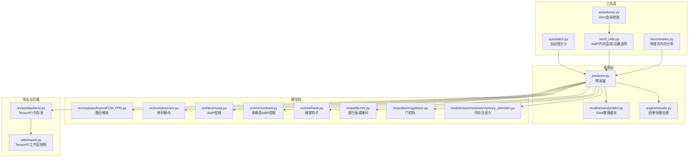
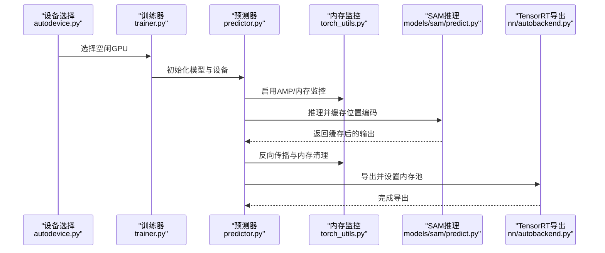
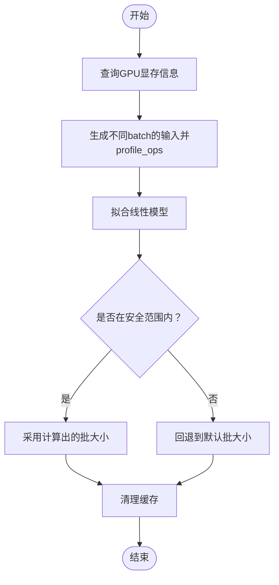
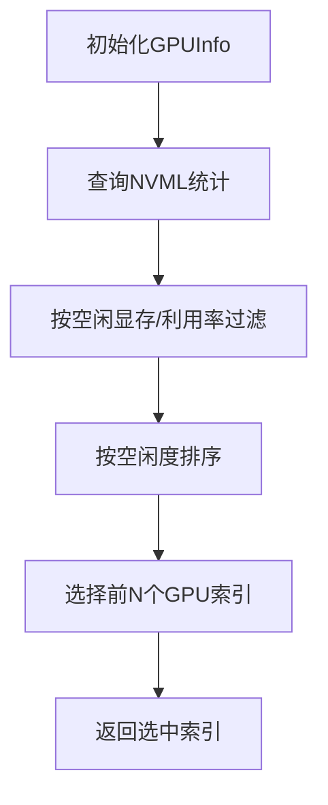
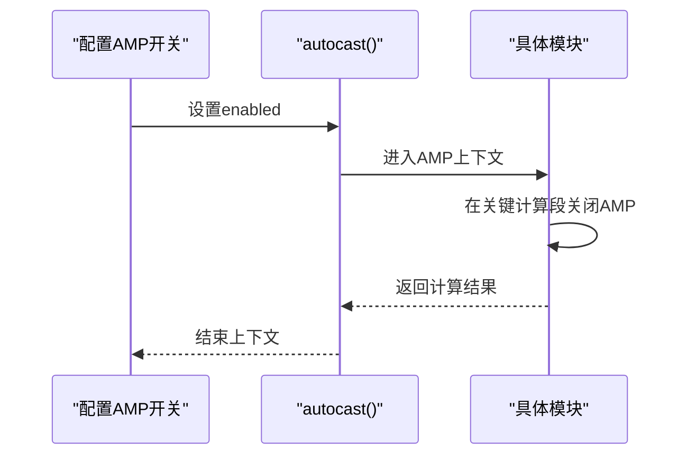
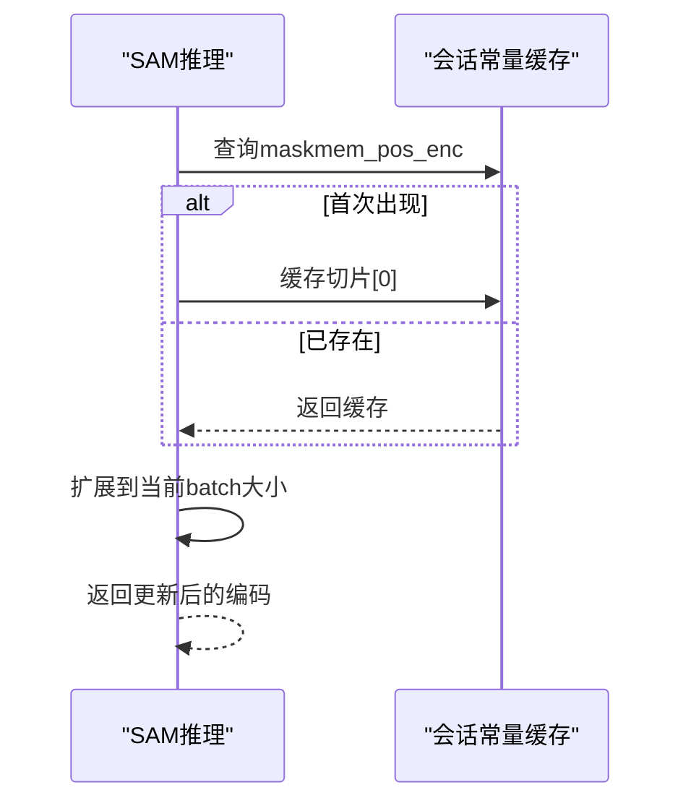
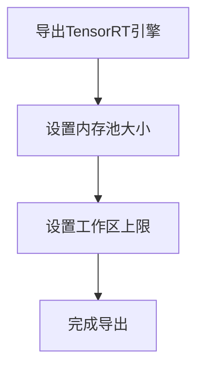
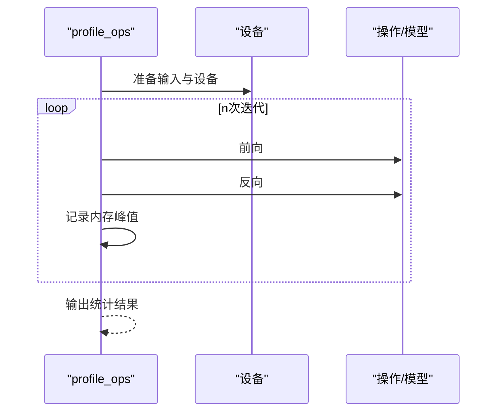
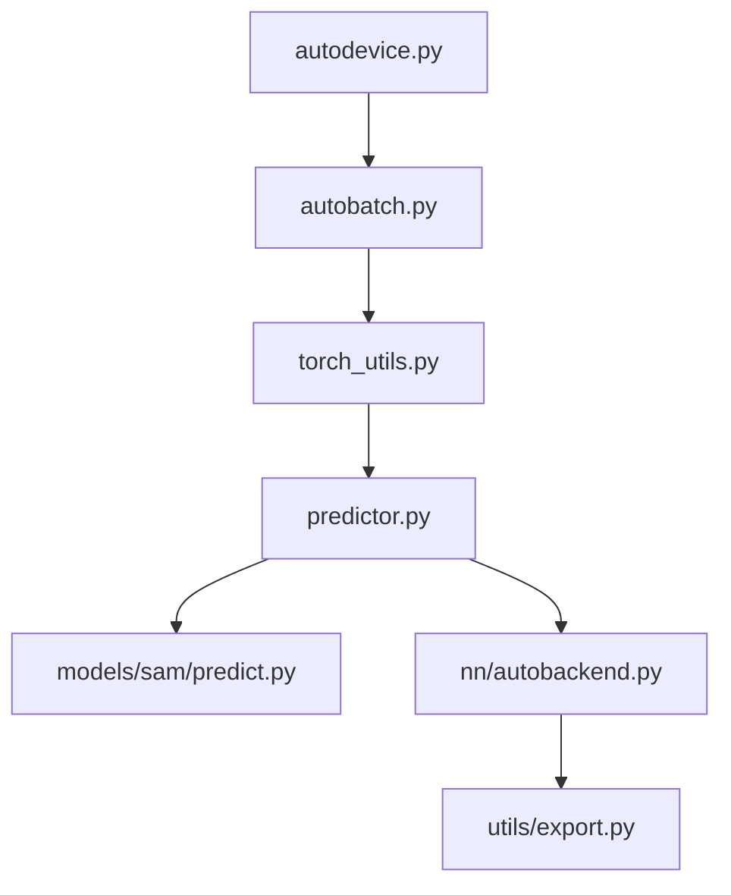

# 内存优化技术

<cite>
**本文档引用的文件**
- [ultralytics/utils/torch_utils.py](file://ultralytics/utils/torch_utils.py)
- [ultralytics/utils/autobatch.py](file://ultralytics/utils/autobatch.py)
- [ultralytics/utils/autodevice.py](file://ultralytics/utils/autodevice.py)
- [ultralytics/engine/trainer.py](file://ultralytics/engine/trainer.py)
- [ultralytics/engine/predictor.py](file://ultralytics/engine/predictor.py)
- [ultralytics/models/sam/predict.py](file://ultralytics/models/sam/predict.py)
- [ultralytics/models/sam/modules/memory_attention.py](file://ultralytics/models/sam/modules/memory_attention.py)
- [ultralytics/utils/benchmarks.py](file://ultralytics/utils/benchmarks.py)
- [ultralytics/nn/modules/fusion/FCM_FFN.py](file://ultralytics/nn/modules/fusion/FCM_FFN.py)
- [ultralytics/nn/modules/conv.py](file://ultralytics/nn/modules/conv.py)
- [ultralytics/nn/mm/contrast.py](file://ultralytics/nn/mm/contrast.py)
- [ultralytics/nn/mm/hook.py](file://ultralytics/nn/mm/hook.py)
- [ultralytics/nn/Neck/soep.py](file://ultralytics/nn/Neck/soep.py)
- [ultralytics/nn/public/rmt.py](file://ultralytics/nn/public/rmt.py)
- [ultralytics/nn/public/mogablock.py](file://ultralytics/nn/public/mogablock.py)
- [ultralytics/engine/results.py](file://ultralytics/engine/results.py)
- [ultralytics/nn/autobackend.py](file://ultralytics/nn/autobackend.py)
- [ultralytics/utils/export.py](file://ultralytics/utils/export.py)
</cite>

## 目录
1. [简介](#简介)
2. [项目结构](#项目结构)
3. [核心组件](#核心组件)
4. [架构总览](#架构总览)
5. [详细组件分析](#详细组件分析)
6. [依赖分析](#依赖分析)
7. [性能考虑](#性能考虑)
8. [故障排除指南](#故障排除指南)
9. [结论](#结论)
10. [附录](#附录)

## 简介
本指南聚焦于内存优化技术在深度学习与多模态模型中的系统化应用，围绕以下主题展开：
- 梯度检查点（Gradient Checkpointing）原理与实现路径
- 内存池与张量重用策略
- PyTorch内存管理工具（如torch.cuda.empty_cache）与AMP混合精度的协同
- 大模型推理的内存管理策略（分片推理、流水线并行思路）
- 内存使用监控与分析方法
- 配置示例与性能对比建议
- 不同硬件平台的最佳实践

本指南基于仓库中已实现的工具与模块，提供可操作的优化建议与可视化流程图。

## 项目结构
该仓库提供了完整的训练、推理、导出与基准测试框架，并内置了大量与内存优化相关的工具与模块：
- 工具层：设备选择、自动批大小、内存监控、自动混合精度等
- 推理层：预测器、结果处理、SAM推理状态缓存
- 模型层：多模态融合、注意力与内存管理模块
- 导出与基准：TensorRT/ONNX等格式导出与性能分析

图表来源
- [ultralytics/utils/autobatch.py:76-120](file://ultralytics/utils/autobatch.py#L76-L120)
- [ultralytics/utils/autodevice.py:136-188](file://ultralytics/utils/autodevice.py#L136-L188)
- [ultralytics/utils/torch_utils.py:854-963](file://ultralytics/utils/torch_utils.py#L854-L963)
- [ultralytics/utils/benchmarks.py:360-490](file://ultralytics/utils/benchmarks.py#L360-L490)
- [ultralytics/engine/predictor.py:150-200](file://ultralytics/engine/predictor.py#L150-L200)
- [ultralytics/models/sam/predict.py:1362-1400](file://ultralytics/models/sam/predict.py#L1362-L1400)
- [ultralytics/engine/results.py:72-175](file://ultralytics/engine/results.py#L72-L175)
- [ultralytics/nn/modules/fusion/FCM_FFN.py:773-786](file://ultralytics/nn/modules/fusion/FCM_FFN.py#L773-L786)
- [ultralytics/nn/modules/conv.py:800-807](file://ultralytics/nn/modules/conv.py#L800-L807)
- [ultralytics/nn/Neck/soep.py:75-142](file://ultralytics/nn/Neck/soep.py#L75-L142)
- [ultralytics/nn/mm/contrast.py:110-143](file://ultralytics/nn/mm/contrast.py#L110-L143)
- [ultralytics/nn/mm/hook.py:110-143](file://ultralytics/nn/mm/hook.py#L110-L143)
- [ultralytics/nn/public/rmt.py:245-256](file://ultralytics/nn/public/rmt.py#L245-L256)
- [ultralytics/nn/public/mogablock.py:105-115](file://ultralytics/nn/public/mogablock.py#L105-L115)
- [ultralytics/models/sam/modules/memory_attention.py:214-239](file://ultralytics/models/sam/modules/memory_attention.py#L214-L239)
- [ultralytics/nn/autobackend.py:512](file://ultralytics/nn/autobackend.py#L512)
- [ultralytics/utils/export.py:102](file://ultralytics/utils/export.py#L102)

章节来源
- [ultralytics/utils/autobatch.py:76-120](file://ultralytics/utils/autobatch.py#L76-L120)
- [ultralytics/utils/autodevice.py:136-188](file://ultralytics/utils/autodevice.py#L136-L188)
- [ultralytics/utils/torch_utils.py:854-963](file://ultralytics/utils/torch_utils.py#L854-L963)
- [ultralytics/utils/benchmarks.py:360-490](file://ultralytics/utils/benchmarks.py#L360-L490)
- [ultralytics/engine/predictor.py:150-200](file://ultralytics/engine/predictor.py#L150-L200)

## 核心组件
- 自动批大小与内存监控：通过测量不同batch下的GPU内存占用，拟合线性模型以确定安全批大小，并在过程中调用内存清理工具。
- 设备选择与空闲GPU筛选：根据显存与利用率阈值自动选择空闲GPU，减少争用。
- AMP与混合精度：统一的自动混合精度上下文管理器，兼容不同PyTorch版本；在特定模块中显式关闭AMP以保证数值稳定性。
- 内存监控上下文：提供CUDA内存使用监控上下文，记录前向/反向阶段峰值保留内存。
- 推理缓存与张量重用：SAM推理中对位置编码进行切片缓存与按需扩展，避免重复存储。
- 导出与内存池：TensorRT导出时设置内存池与工作区上限，避免推理阶段内存溢出。

章节来源
- [ultralytics/utils/autobatch.py:76-120](file://ultralytics/utils/autobatch.py#L76-L120)
- [ultralytics/utils/autodevice.py:136-188](file://ultralytics/utils/autodevice.py#L136-L188)
- [ultralytics/utils/torch_utils.py:77-104](file://ultralytics/utils/torch_utils.py#L77-L104)
- [ultralytics/utils/torch_utils.py:854-963](file://ultralytics/utils/torch_utils.py#L854-L963)
- [ultralytics/models/sam/predict.py:1362-1400](file://ultralytics/models/sam/predict.py#L1362-L1400)
- [ultralytics/nn/autobackend.py:512](file://ultralytics/nn/autobackend.py#L512)
- [ultralytics/utils/export.py:102](file://ultralytics/utils/export.py#L102)

## 架构总览
下图展示了内存优化相关的关键交互路径：从设备选择与批大小自适应，到推理阶段的缓存与AMP控制，再到导出阶段的内存池配置。

图表来源
- [ultralytics/utils/autodevice.py:136-188](file://ultralytics/utils/autodevice.py#L136-L188)
- [ultralytics/engine/trainer.py:191-200](file://ultralytics/engine/trainer.py#L191-L200)
- [ultralytics/engine/predictor.py:150-200](file://ultralytics/engine/predictor.py#L150-L200)
- [ultralytics/utils/torch_utils.py:854-963](file://ultralytics/utils/torch_utils.py#L854-L963)
- [ultralytics/models/sam/predict.py:1362-1400](file://ultralytics/models/sam/predict.py#L1362-L1400)
- [ultralytics/nn/autobackend.py:512](file://ultralytics/nn/autobackend.py#L512)

## 详细组件分析

### 组件A：自动批大小与内存监控（autobatch + cuda_memory_usage）
- 自动批大小：遍历候选batch，调用profile_ops测量GPU内存占用，拟合线性模型，结合显存总量与预留/已分配内存，确定安全批大小。
- 内存监控上下文：在每次迭代前后清空缓存并记录保留内存，用于统计峰值内存。
- 关键路径：
  - [autobatch.py:76-120](file://ultralytics/utils/autobatch.py#L76-L120)
  - [torch_utils.py:854-963](file://ultralytics/utils/torch_utils.py#L854-L963)

图表来源
- [ultralytics/utils/autobatch.py:76-120](file://ultralytics/utils/autobatch.py#L76-L120)
- [ultralytics/utils/torch_utils.py:854-963](file://ultralytics/utils/torch_utils.py#L854-L963)

章节来源
- [ultralytics/utils/autobatch.py:76-120](file://ultralytics/utils/autobatch.py#L76-L120)
- [ultralytics/utils/torch_utils.py:854-963](file://ultralytics/utils/torch_utils.py#L854-L963)

### 组件B：设备选择与空闲GPU筛选（autodevice）
- 功能：通过NVML查询GPU利用率与显存，筛选满足空闲显存与空闲利用率阈值的GPU索引，支持降级到基础统计。
- 关键路径：
  - [autodevice.py:136-188](file://ultralytics/utils/autodevice.py#L136-L188)

图表来源
- [ultralytics/utils/autodevice.py:136-188](file://ultralytics/utils/autodevice.py#L136-L188)

章节来源
- [ultralytics/utils/autodevice.py:136-188](file://ultralytics/utils/autodevice.py#L136-L188)

### 组件C：AMP与混合精度（torch_utils.autocast）
- 统一AMP上下文管理器，兼容不同PyTorch版本；在部分模块中显式关闭AMP以保证数值稳定性。
- 关键路径：
  - [torch_utils.py:77-104](file://ultralytics/utils/torch_utils.py#L77-L104)
  - [nn/modules/conv.py:800-807](file://ultralytics/nn/modules/conv.py#L800-L807)
  - [nn/modules/fusion/FCM_FFN.py:773-786](file://ultralytics/nn/modules/fusion/FCM_FFN.py#L773-L786)
  - [nn/Neck/soep.py:75-142](file://ultralytics/nn/Neck/soep.py#L75-L142)
  - [nn/mm/contrast.py:110-143](file://ultralytics/nn/mm/contrast.py#L110-L143)
  - [nn/mm/hook.py:110-143](file://ultralytics/nn/mm/hook.py#L110-L143)

图表来源
- [ultralytics/utils/torch_utils.py:77-104](file://ultralytics/utils/torch_utils.py#L77-L104)
- [ultralytics/nn/modules/conv.py:800-807](file://ultralytics/nn/modules/conv.py#L800-L807)
- [ultralytics/nn/modules/fusion/FCM_FFN.py:773-786](file://ultralytics/nn/modules/fusion/FCM_FFN.py#L773-L786)
- [ultralytics/nn/Neck/soep.py:75-142](file://ultralytics/nn/Neck/soep.py#L75-L142)
- [ultralytics/nn/mm/contrast.py:110-143](file://ultralytics/nn/mm/contrast.py#L110-L143)
- [ultralytics/nn/mm/hook.py:110-143](file://ultralytics/nn/mm/hook.py#L110-L143)

章节来源
- [ultralytics/utils/torch_utils.py:77-104](file://ultralytics/utils/torch_utils.py#L77-L104)
- [ultralytics/nn/modules/conv.py:800-807](file://ultralytics/nn/modules/conv.py#L800-L807)
- [ultralytics/nn/modules/fusion/FCM_FFN.py:773-786](file://ultralytics/nn/modules/fusion/FCM_FFN.py#L773-L786)
- [ultralytics/nn/Neck/soep.py:75-142](file://ultralytics/nn/Neck/soep.py#L75-L142)
- [ultralytics/nn/mm/contrast.py:110-143](file://ultralytics/nn/mm/contrast.py#L110-L143)
- [ultralytics/nn/mm/hook.py:110-143](file://ultralytics/nn/mm/hook.py#L110-L143)

### 组件D：推理缓存与张量重用（SAM）
- 位置编码缓存：对跨帧/跨对象不变的位置编码只缓存一份，按需扩展到当前batch大小，避免重复存储。
- 关键路径：
  - [models/sam/predict.py:1362-1400](file://ultralytics/models/sam/predict.py#L1362-L1400)

图表来源
- [ultralytics/models/sam/predict.py:1362-1400](file://ultralytics/models/sam/predict.py#L1362-L1400)

章节来源
- [ultralytics/models/sam/predict.py:1362-1400](file://ultralytics/models/sam/predict.py#L1362-L1400)

### 组件E：内存池与导出配置（TensorRT）
- 内存池：在TensorRT后端启用GPU内存池初始化大小，降低频繁分配开销。
- 工作区限制：导出时设置TensorRT工作区上限，防止推理阶段内存溢出。
- 关键路径：
  - [nn/autobackend.py:512](file://ultralytics/nn/autobackend.py#L512)
  - [utils/export.py:102](file://ultralytics/utils/export.py#L102)

图表来源
- [ultralytics/nn/autobackend.py:512](file://ultralytics/nn/autobackend.py#L512)
- [ultralytics/utils/export.py:102](file://ultralytics/utils/export.py#L102)

章节来源
- [ultralytics/nn/autobackend.py:512](file://ultralytics/nn/autobackend.py#L512)
- [ultralytics/utils/export.py:102](file://ultralytics/utils/export.py#L102)

### 组件F：梯度检查点（Checkpointing）与内存权衡
- 原理概述：在前向计算中不保存中间激活，而是在反向时重新计算，从而显著降低峰值内存；代价是增加计算时间。
- 实现路径建议（基于现有模块模式）：
  - 将大型子模块的前向包装为可检查点的子图，仅在需要时重建中间激活。
  - 在训练循环中按需启用/禁用检查点，平衡内存与吞吐。
  - 与AMP配合：在检查点重建阶段关闭AMP以保证数值稳定。
- 与现有模块的关联：
  - AMP控制与数值稳定性：参考AMP上下文与模块内显式关闭AMP的做法。
  - 模型结构适配：参考注意力与门控模块的结构设计，便于拆分为可检查点单元。

章节来源
- [ultralytics/utils/torch_utils.py:77-104](file://ultralytics/utils/torch_utils.py#L77-L104)
- [ultralytics/nn/modules/conv.py:800-807](file://ultralytics/nn/modules/conv.py#L800-L807)

### 组件G：内存监控与分析（profile_ops）
- 功能：对给定操作或模型进行多次前向/反向运行，统计参数量、FLOPs、GPU内存占用、耗时等指标。
- 应用：用于评估不同批大小、精度策略、模块替换对内存的影响。
- 关键路径：
  - [torch_utils.py:880-963](file://ultralytics/utils/torch_utils.py#L880-L963)

图表来源
- [ultralytics/utils/torch_utils.py:880-963](file://ultralytics/utils/torch_utils.py#L880-L963)

章节来源
- [ultralytics/utils/torch_utils.py:880-963](file://ultralytics/utils/torch_utils.py#L880-L963)

## 依赖分析
- 组件耦合与协作：
  - 设备选择与批大小：autodevice为autobatch提供GPU可用性前提，autobatch在推理/训练中决定批大小。
  - AMP与模块：torch_utils.autocast贯穿各模块，部分模块在关键路径显式关闭AMP。
  - 推理缓存：SAM推理依赖会话常量缓存，减少重复张量存储。
  - 导出与内存池：nn/autobackend与utils/export共同保障TensorRT导出阶段的内存约束。
- 潜在风险：
  - NVML不可用时，autodevice降级为基础统计，可能影响GPU选择准确性。
  - AMP与检查点的组合需要谨慎处理数值稳定性。

图表来源
- [ultralytics/utils/autodevice.py:136-188](file://ultralytics/utils/autodevice.py#L136-L188)
- [ultralytics/utils/autobatch.py:76-120](file://ultralytics/utils/autobatch.py#L76-L120)
- [ultralytics/utils/torch_utils.py:854-963](file://ultralytics/utils/torch_utils.py#L854-L963)
- [ultralytics/engine/predictor.py:150-200](file://ultralytics/engine/predictor.py#L150-L200)
- [ultralytics/models/sam/predict.py:1362-1400](file://ultralytics/models/sam/predict.py#L1362-L1400)
- [ultralytics/nn/autobackend.py:512](file://ultralytics/nn/autobackend.py#L512)
- [ultralytics/utils/export.py:102](file://ultralytics/utils/export.py#L102)

章节来源
- [ultralytics/utils/autodevice.py:136-188](file://ultralytics/utils/autodevice.py#L136-L188)
- [ultralytics/utils/autobatch.py:76-120](file://ultralytics/utils/autobatch.py#L76-L120)
- [ultralytics/utils/torch_utils.py:854-963](file://ultralytics/utils/torch_utils.py#L854-L963)
- [ultralytics/engine/predictor.py:150-200](file://ultralytics/engine/predictor.py#L150-L200)
- [ultralytics/models/sam/predict.py:1362-1400](file://ultralytics/models/sam/predict.py#L1362-L1400)
- [ultralytics/nn/autobackend.py:512](file://ultralytics/nn/autobackend.py#L512)
- [ultralytics/utils/export.py:102](file://ultralytics/utils/export.py#L102)

## 性能考虑
- 内存与计算权衡：梯度检查点可显著降低峰值内存，但会增加计算时间；应结合任务吞吐目标与硬件资源进行权衡。
- AMP与精度：在支持的模块中启用AMP可降低显存占用并提升速度，但在数值敏感路径需谨慎关闭AMP。
- 批大小策略：基于profile_ops与autobatch的线性拟合，动态选择接近显存上限的安全批大小。
- 导出阶段内存约束：TensorRT内存池与工作区限制有助于稳定推理阶段内存使用。
- 张量重用：通过缓存不变量（如位置编码）减少重复分配与拷贝。

## 故障排除指南
- 显存不足（OOM）：
  - 使用autobatch自动确定安全批大小，必要时降低批大小。
  - 在推理/训练关键阶段调用内存清理工具，释放未使用缓存。
  - 在TensorRT导出时设置内存池与工作区上限。
- GPU争用：
  - 使用autodevice选择空闲GPU，设定空闲显存与利用率阈值。
- 数值不稳定：
  - 在数值敏感模块中显式关闭AMP，确保FP32计算。
- 监控与定位：
  - 使用profile_ops输出的内存占用与耗时指标，定位内存热点模块。

章节来源
- [ultralytics/utils/autobatch.py:76-120](file://ultralytics/utils/autobatch.py#L76-L120)
- [ultralytics/utils/torch_utils.py:854-963](file://ultralytics/utils/torch_utils.py#L854-L963)
- [ultralytics/nn/autobackend.py:512](file://ultralytics/nn/autobackend.py#L512)
- [ultralytics/utils/export.py:102](file://ultralytics/utils/export.py#L102)
- [ultralytics/utils/autodevice.py:136-188](file://ultralytics/utils/autodevice.py#L136-L188)
- [ultralytics/nn/modules/conv.py:800-807](file://ultralytics/nn/modules/conv.py#L800-L807)

## 结论
本指南梳理了仓库中与内存优化直接相关的工具与模块，给出了自动批大小、设备选择、AMP控制、推理缓存与导出内存池等关键能力的应用路径。对于梯度检查点，建议结合现有AMP与模块化结构，在需要时对子模块进行可检查点化改造，并在重建阶段关闭AMP以保证数值稳定。通过profile_ops与autobatch的组合，可在不同硬件平台上实现更稳健的内存与性能平衡。

## 附录
- 配置示例与性能对比建议（概念性指导，非具体数值）：
  - AMP开关：在支持的模块中启用AMP，对数值敏感模块显式关闭AMP。
  - 批大小：使用autobatch与profile_ops评估不同批大小的内存与吞吐，选择接近显存上限的安全值。
  - 导出内存池：在TensorRT导出时设置合理的内存池与工作区上限。
  - 推理缓存：对跨帧/跨对象不变的中间表示进行缓存与按需扩展。
- 不同硬件平台最佳实践：
  - NVIDIA GPU：利用NVML进行空闲GPU选择；合理设置TensorRT内存池与工作区；在AMP与检查点间权衡。
  - Apple M1/M2：关注MPS可用性与AMP行为差异；必要时回退至CPU路径。
  - 多模态与大模型：优先采用模块化结构与缓存策略，结合自动批大小与AMP动态调整。