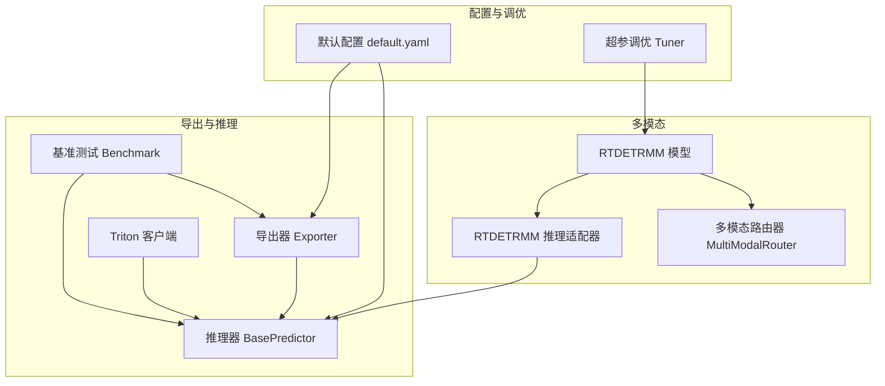
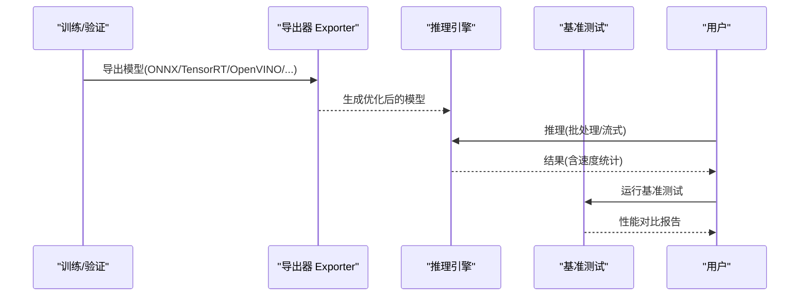
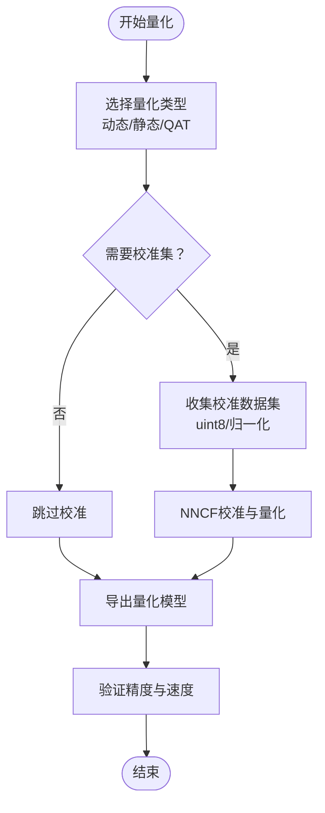
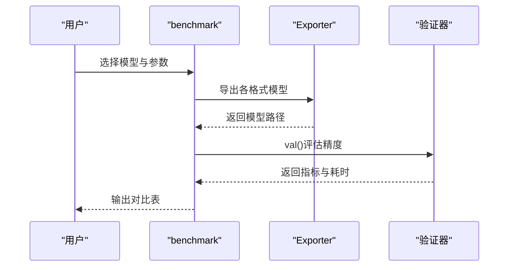
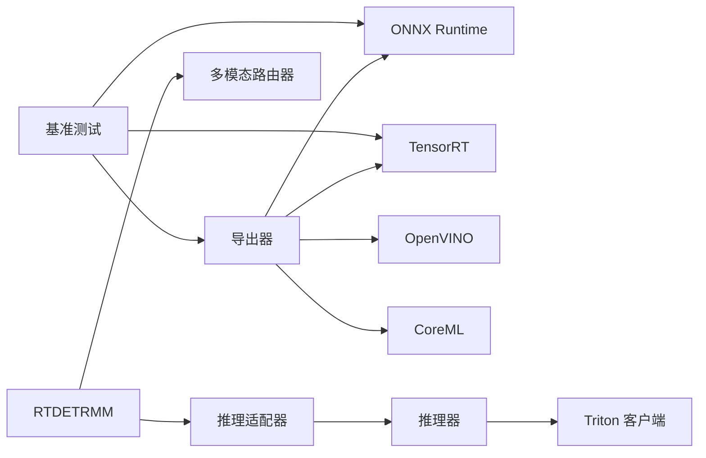

# 推理优化技术

<cite>
**本文档引用的文件**
- [ultralytics/engine/exporter.py](file://ultralytics/engine/exporter.py)
- [ultralytics/utils/benchmarks.py](file://ultralytics/utils/benchmarks.py)
- [ultralytics/utils/torch_utils.py](file://ultralytics/utils/torch_utils.py)
- [ultralytics/engine/predictor.py](file://ultralytics/engine/predictor.py)
- [ultralytics/models/rtdetrmm/model.py](file://ultralytics/models/rtdetrmm/model.py)
- [ultralytics/nn/mm/router.py](file://ultralytics/nn/mm/router.py)
- [ultralytics/utils/triton.py](file://ultralytics/utils/triton.py)
- [ultralytics/engine/tuner.py](file://ultralytics/engine/tuner.py)
- [ultralytics/cfg/default.yaml](file://ultralytics/cfg/default.yaml)
- [ultralytics/models/rtdetrmm/mm_predictor.py](file://ultralytics/models/rtdetrmm/mm_predictor.py)
- [ResTest/aifi-dattention-CSP-MutilScaleEdgeInformationEnhance-ASF-P2-lite-BackboneFreqFusion2/results.csv](file://ResTest/aifi-dattention-CSP-MutilScaleEdgeInformationEnhance-ASF-P2-lite-BackboneFreqFusion2/results.csv)
</cite>

## 目录
1. [引言](#引言)
2. [项目结构](#项目结构)
3. [核心组件](#核心组件)
4. [架构总览](#架构总览)
5. [详细组件分析](#详细组件分析)
6. [依赖关系分析](#依赖关系分析)
7. [性能考虑](#性能考虑)
8. [故障排除指南](#故障排除指南)
9. [结论](#结论)
10. [附录](#附录)

## 引言
本指南面向多模态检测系统的推理优化，系统阐述量化（动态量化、静态量化、QAT）、剪枝（结构化与非结构化）、蒸馏（教师-学生训练）、推理引擎（ONNX、TensorRT、OpenVINO、CoreML、Triton）优化配置、批处理与序列化推理、内存优化（梯度检查点、内存池）以及性能基准测试方法与工具。文档结合代码库中的导出器、基准测试、推理器、多模态路由器等模块，给出可操作的配置建议与性能对比路径。

## 项目结构
该仓库围绕Ultralytics框架组织，包含导出器、基准测试、推理器、多模态模型与路由器、Triton客户端、超参调优等模块。多模态RT-DETR家族通过独立的模型入口与推理适配器实现统一接口与灵活路由。

**图表来源**
- [ultralytics/engine/exporter.py](file://ultralytics/engine/exporter.py)
- [ultralytics/utils/benchmarks.py](file://ultralytics/utils/benchmarks.py)
- [ultralytics/engine/predictor.py](file://ultralytics/engine/predictor.py)
- [ultralytics/models/rtdetrmm/model.py](file://ultralytics/models/rtdetrmm/model.py)
- [ultralytics/nn/mm/router.py](file://ultralytics/nn/mm/router.py)
- [ultralytics/utils/triton.py](file://ultralytics/utils/triton.py)
- [ultralytics/engine/tuner.py](file://ultralytics/engine/tuner.py)
- [ultralytics/cfg/default.yaml](file://ultralytics/cfg/default.yaml)
- [ultralytics/models/rtdetrmm/mm_predictor.py](file://ultralytics/models/rtdetrmm/mm_predictor.py)

**章节来源**
- [ultralytics/engine/exporter.py](file://ultralytics/engine/exporter.py)
- [ultralytics/utils/benchmarks.py](file://ultralytics/utils/benchmarks.py)
- [ultralytics/engine/predictor.py](file://ultralytics/engine/predictor.py)
- [ultralytics/models/rtdetrmm/model.py](file://ultralytics/models/rtdetrmm/model.py)
- [ultralytics/nn/mm/router.py](file://ultralytics/nn/mm/router.py)
- [ultralytics/utils/triton.py](file://ultralytics/utils/triton.py)
- [ultralytics/engine/tuner.py](file://ultralytics/engine/tuner.py)
- [ultralytics/cfg/default.yaml](file://ultralytics/cfg/default.yaml)
- [ultralytics/models/rtdetrmm/mm_predictor.py](file://ultralytics/models/rtdetrmm/mm_predictor.py)

## 核心组件
- 导出器：统一导出至ONNX、TensorRT、OpenVINO、CoreML、TF系列等格式，支持动态/静态量化、简化、NMS集成等参数。
- 基准测试：批量对比不同格式的速度与精度，支持ONNX与TensorRT性能剖析。
- 推理器：统一的预测流程，包含预处理、推理、后处理与结果写入，支持流式推理与设备选择。
- 多模态路由器：零拷贝视图路由，支持RGB/X/Dual三模态输入，动态空间重置与运行时策略。
- RTDETRMM推理适配器：桥接BasePredictor到新的MultiModalPredictor引擎，保持API兼容。
- Triton客户端：HTTP/gRPC远程推理，自动解析模型元数据与输入输出。
- 超参调优：基于进化搜索的超参调优，支持自定义搜索空间与结果记录。

**章节来源**
- [ultralytics/engine/exporter.py](file://ultralytics/engine/exporter.py)
- [ultralytics/utils/benchmarks.py](file://ultralytics/utils/benchmarks.py)
- [ultralytics/engine/predictor.py](file://ultralytics/engine/predictor.py)
- [ultralytics/nn/mm/router.py](file://ultralytics/nn/mm/router.py)
- [ultralytics/models/rtdetrmm/mm_predictor.py](file://ultralytics/models/rtdetrmm/mm_predictor.py)
- [ultralytics/utils/triton.py](file://ultralytics/utils/triton.py)
- [ultralytics/engine/tuner.py](file://ultralytics/engine/tuner.py)

## 架构总览
推理优化贯穿“导出—部署—推理—评估”全链路。导出阶段根据目标平台启用相应优化；部署阶段选择合适推理引擎；推理阶段通过批处理、序列化与内存优化提升吞吐与稳定性；评估阶段通过基准测试与可视化结果进行对比分析。

**图表来源**
- [ultralytics/engine/exporter.py](file://ultralytics/engine/exporter.py)
- [ultralytics/utils/benchmarks.py](file://ultralytics/utils/benchmarks.py)
- [ultralytics/engine/predictor.py](file://ultralytics/engine/predictor.py)

## 详细组件分析

### 量化技术
- 动态量化：适用于部署阶段对权重进行低比特量化（如8-bit），减少存储与带宽占用，同时保持较高精度。
- 静态量化：通过校准集（uint8输入）进行校准，生成整数量化模型，适合CPU/GPU异构部署。
- QAT（量化感知训练）：在训练阶段引入量化伪感知，提升模型对量化误差的鲁棒性，通常在导出前完成训练。

实现要点与配置：
- OpenVINO INT8量化：使用NNCF进行校准与量化，支持忽略特定算子与Sigmoid类型，导出时写入元数据。
- IMX量化：通过MCT GPTQ/PTQ生成量化模型，导出ONNX后使用imxconv-pt转换。
- CoreML权重量化：根据bits模式（kmeans/线性）对权重进行8-bit量化。
- TensorRT INT8：需提供校准数据集，启用FP16或INT8混合精度，动态/静态范围配置。

**图表来源**
- [ultralytics/engine/exporter.py](file://ultralytics/engine/exporter.py)

**章节来源**
- [ultralytics/engine/exporter.py](file://ultralytics/engine/exporter.py)

### 剪枝策略
- 结构化剪枝：对卷积核、通道或层进行整体裁剪，便于硬件加速与内存节省，适合部署优化。
- 非结构化剪枝：对权重进行稀疏化（如按阈值置零），压缩率高但推理需特殊库支持。
- 多模态场景：在多模态路由器中，可通过运行时策略选择性激活/禁用某些分支，达到近似剪枝效果。

实现建议：
- 训练后剪枝：在训练完成后进行一次性剪枝，随后微调恢复精度。
- 通道剪枝：优先保留对检测头影响较小的通道，结合注意力机制评估重要性。
- 多模态路由剪枝：利用路由开关在推理时动态屏蔽无效模态路径。

**章节来源**
- [ultralytics/nn/mm/router.py](file://ultralytics/nn/mm/router.py)

### 模型蒸馏
- 教师-学生框架：教师模型（高精度）指导学生模型（轻量化）学习特征表示与边界框回归。
- 知识蒸馏：通过软标签（温度参数缩放）传递类别分布信息，缓解学生模型过拟合。
- 多模态蒸馏：在RGB与X模态之间进行跨模态知识迁移，提升学生模型对弱模态的鲁棒性。

实施步骤：
- 训练教师模型（高精度/更深网络）。
- 设计学生模型（浅层/轻量结构）。
- 使用KL散度或欧氏距离作为蒸馏损失，结合检测头损失联合优化。
- 在多模态场景中，分别对RGB与X子任务进行蒸馏，最后融合。

**章节来源**
- [ultralytics/engine/tuner.py](file://ultralytics/engine/tuner.py)

### 推理引擎优化配置

#### ONNX Runtime
- 启用图优化级别，限制线程数，动态输入形状适配。
- 使用simplify选项进行模型瘦身，减少冗余节点。

**章节来源**
- [ultralytics/utils/benchmarks.py](file://ultralytics/utils/benchmarks.py)

#### TensorRT
- 动态形状与INT8校准：启用dynamic与int8，设置workspace大小与FP16混合精度。
- 引擎缓存与热身：首次编译后复用引擎文件，推理前进行多次warmup。

**章节来源**
- [ultralytics/engine/exporter.py](file://ultralytics/engine/exporter.py)
- [ultralytics/utils/benchmarks.py](file://ultralytics/utils/benchmarks.py)

#### OpenVINO
- INT8量化与NNCF校准：提供校准集，忽略检测头特定算子，导出时写入元数据。
- 运行时参数：设置scale_values、pad_value、resize_type等。

**章节来源**
- [ultralytics/engine/exporter.py](file://ultralytics/engine/exporter.py)

#### CoreML
- 权重8-bit量化（kmeans/线性），mlprogram模式下的FP16权重量化。
- 图像输入scale与bias配置，满足不同平台要求。

**章节来源**
- [ultralytics/engine/exporter.py](file://ultralytics/engine/exporter.py)

#### Triton Inference Server
- 支持HTTP/gRPC协议，自动解析模型配置与输入输出名称。
- 自动类型映射与numpy数组输入，返回对应输出张量。

**章节来源**
- [ultralytics/utils/triton.py](file://ultralytics/utils/triton.py)

### 批处理优化与序列化推理
- 批处理：合理设置batch大小，避免GPU/CPU资源浪费；在导出阶段启用dynamic以支持变长批。
- 序列化推理：将模型与推理管线序列化，减少启动开销；在多模态场景中，确保RGB与X输入的拼接/分离逻辑稳定。
- 流式推理：BasePredictor支持流式返回，避免大内存累积，适合视频流与长序列。

**章节来源**
- [ultralytics/engine/predictor.py](file://ultralytics/engine/predictor.py)
- [ultralytics/cfg/default.yaml](file://ultralytics/cfg/default.yaml)

### 内存优化
- 梯度检查点：在训练/推理中按需重计算中间激活，显著降低峰值显存占用。
- 内存池：在ONNX/TensorRT中合理设置workspace与内存池大小，避免OOM。
- 多模态内存管理：路由器缓存原始输入视图（零拷贝），在空间重置时避免重复分配。

**章节来源**
- [ultralytics/nn/mm/router.py](file://ultralytics/nn/mm/router.py)
- [ultralytics/engine/exporter.py](file://ultralytics/engine/exporter.py)

### 性能基准测试
- 批量格式对比：benchmark函数遍历所有导出格式，自动导出并评估精度与速度，输出DataFrame。
- ONNX/TensorRT剖析：ProfileModels对ONNX与TensorRT进行性能剖析，支持多次运行与σ去噪。
- 训练/验证曲线：通过results.csv记录训练过程中的指标变化，辅助优化决策。

**图表来源**
- [ultralytics/utils/benchmarks.py](file://ultralytics/utils/benchmarks.py)
- [ultralytics/engine/exporter.py](file://ultralytics/engine/exporter.py)

**章节来源**
- [ultralytics/utils/benchmarks.py](file://ultralytics/utils/benchmarks.py)
- [ResTest/aifi-dattention-CSP-MutilScaleEdgeInformationEnhance-ASF-P2-lite-BackboneFreqFusion2/results.csv](file://ResTest/aifi-dattention-CSP-MutilScaleEdgeInformationEnhance-ASF-P2-lite-BackboneFreqFusion2/results.csv)

## 依赖关系分析

**图表来源**
- [ultralytics/engine/exporter.py](file://ultralytics/engine/exporter.py)
- [ultralytics/utils/benchmarks.py](file://ultralytics/utils/benchmarks.py)
- [ultralytics/engine/predictor.py](file://ultralytics/engine/predictor.py)
- [ultralytics/utils/triton.py](file://ultralytics/utils/triton.py)
- [ultralytics/models/rtdetrmm/model.py](file://ultralytics/models/rtdetrmm/model.py)
- [ultralytics/nn/mm/router.py](file://ultralytics/nn/mm/router.py)
- [ultralytics/models/rtdetrmm/mm_predictor.py](file://ultralytics/models/rtdetrmm/mm_predictor.py)

**章节来源**
- [ultralytics/engine/exporter.py](file://ultralytics/engine/exporter.py)
- [ultralytics/utils/benchmarks.py](file://ultralytics/utils/benchmarks.py)
- [ultralytics/engine/predictor.py](file://ultralytics/engine/predictor.py)
- [ultralytics/utils/triton.py](file://ultralytics/utils/triton.py)
- [ultralytics/models/rtdetrmm/model.py](file://ultralytics/models/rtdetrmm/model.py)
- [ultralytics/nn/mm/router.py](file://ultralytics/nn/mm/router.py)
- [ultralytics/models/rtdetrmm/mm_predictor.py](file://ultralytics/models/rtdetrmm/mm_predictor.py)

## 性能考虑
- 精度与速度权衡：INT8量化与FP16混合精度在多数平台上可获得显著加速；需通过校准集与验证集平衡精度。
- 批处理与并发：合理设置batch与工作线程数，避免GPU/CPU瓶颈；流式推理减少内存峰值。
- 模型大小与加载时间：ONNX简化与TensorRT引擎缓存可缩短加载时间；CoreML权重量化降低包体。
- 多模态路由：在推理时按需激活模态路径，减少无效计算；空间重置保证X模态输入尺寸一致性。

## 故障排除指南
- 导出失败：检查格式支持与设备选择（TensorRT需GPU），确认参数兼容性（如half与int8互斥）。
- 推理异常：核对输入形状与数据类型，确保预处理与导出时imgsz一致；流式推理注意内存累积风险。
- 基准测试失败：确认各格式依赖已安装，设备权限与驱动版本匹配；必要时降低并发或增加超时。
- 多模态推理错误：检查RGB与X通道数配置，确保路由属性正确设置；关注空间重置逻辑。

**章节来源**
- [ultralytics/engine/exporter.py](file://ultralytics/engine/exporter.py)
- [ultralytics/engine/predictor.py](file://ultralytics/engine/predictor.py)
- [ultralytics/utils/benchmarks.py](file://ultralytics/utils/benchmarks.py)

## 结论
通过系统化的量化、剪枝、蒸馏与推理引擎优化，结合严格的基准测试与内存管理策略，可在多模态检测系统中实现高精度与高吞吐的平衡。建议以TensorRT/ONNX为通用部署方案，OpenVINO适配Intel平台，CoreML服务移动端，Triton支撑分布式推理；在多模态场景中充分利用路由器的零拷贝与空间重置能力，配合批处理与序列化推理，获得最佳性能表现。

## 附录
- 优化配置示例路径：
  - [ultralytics/cfg/default.yaml](file://ultralytics/cfg/default.yaml)
  - [ultralytics/engine/exporter.py](file://ultralytics/engine/exporter.py)
  - [ultralytics/utils/benchmarks.py](file://ultralytics/utils/benchmarks.py)
- 性能对比数据示例：
  - [ResTest/aifi-dattention-CSP-MutilScaleEdgeInformationEnhance-ASF-P2-lite-BackboneFreqFusion2/results.csv](file://ResTest/aifi-dattention-CSP-MutilScaleEdgeInformationEnhance-ASF-P2-lite-BackboneFreqFusion2/results.csv)