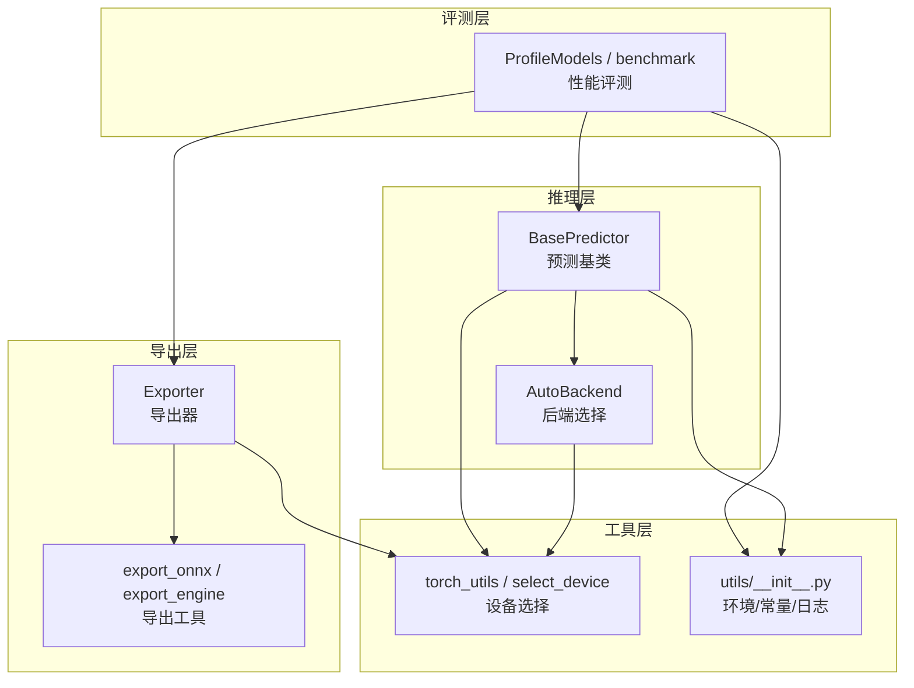
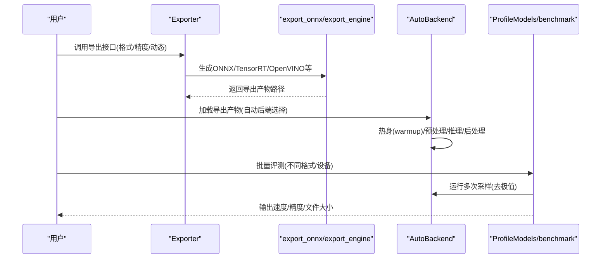
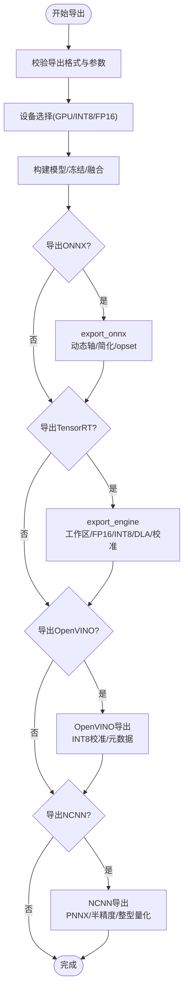
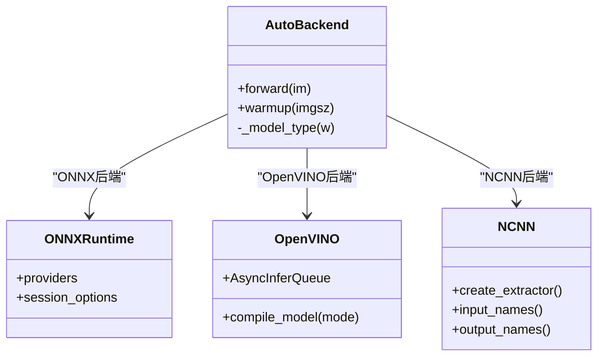
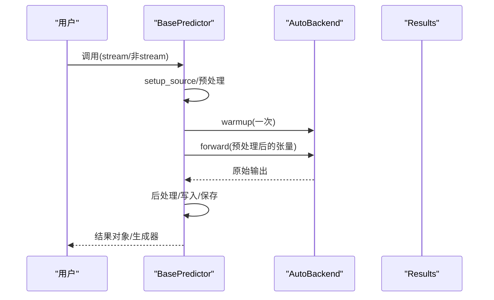
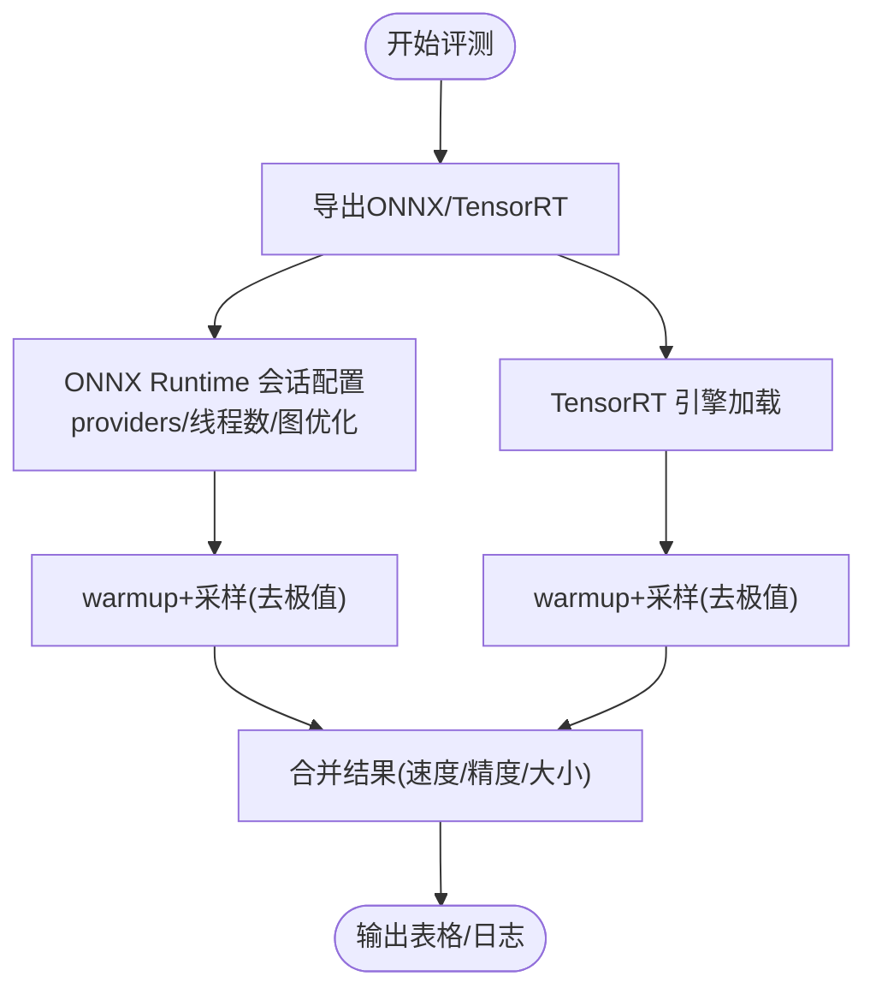
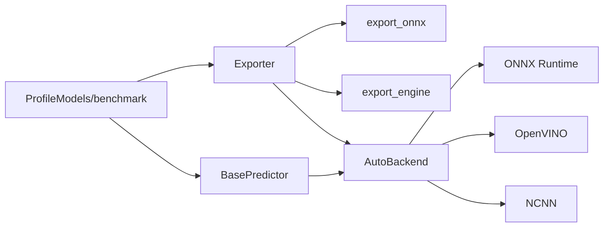

# 推理引擎优化

<cite>
**本文引用的文件**
- [ultralytics/utils/benchmarks.py](file://ultralytics/utils/benchmarks.py)
- [ultralytics/engine/predictor.py](file://ultralytics/engine/predictor.py)
- [ultralytics/engine/exporter.py](file://ultralytics/engine/exporter.py)
- [ultralytics/utils/export.py](file://ultralytics/utils/export.py)
- [ultralytics/nn/autobackend.py](file://ultralytics/nn/autobackend.py)
- [ultralytics/utils/torch_utils.py](file://ultralytics/utils/torch_utils.py)
- [ultralytics/utils/__init__.py](file://ultralytics/utils/__init__.py)
</cite>

## 目录
1. [简介](#简介)
2. [项目结构](#项目结构)
3. [核心组件](#核心组件)
4. [架构总览](#架构总览)
5. [详细组件分析](#详细组件分析)
6. [依赖分析](#依赖分析)
7. [性能考量](#性能考量)
8. [故障排查指南](#故障排查指南)
9. [结论](#结论)
10. [附录](#附录)

## 简介
本指南面向需要在多硬件平台（CPU、GPU、NPU）上进行高性能推理的工程师，系统讲解如何基于该代码库中的工具链完成以下目标：
- 针对不同推理引擎（ONNX Runtime、TensorRT、OpenVINO、NCNN 等）进行导出与推理配置
- 基于内置基准工具进行延迟与吞吐对比
- 在不同硬件平台选择合适的执行提供者（Execution Provider）与优化参数
- 完成模型格式转换的最佳实践与兼容性注意事项
- 提供可复用的性能测试方法与优化建议

## 项目结构
该仓库围绕“导出—推理—评测”闭环组织，关键模块职责如下：
- 导出模块：负责将 PyTorch 模型导出为多种格式（ONNX、TensorRT、OpenVINO、NCNN 等）
- 推理模块：统一入口，自动选择后端（ONNX Runtime、OpenVINO、NCNN 等），并支持热身与性能计时
- 基准模块：批量评估不同格式的速度与精度，并输出表格化结果
- 工具模块：设备选择、线程与日志、环境检测等基础设施

图示来源
- [ultralytics/engine/exporter.py:114-148](file://ultralytics/engine/exporter.py#L114-L148)
- [ultralytics/utils/export.py:12-47](file://ultralytics/utils/export.py#L12-L47)
- [ultralytics/engine/predictor.py:392-416](file://ultralytics/engine/predictor.py#L392-L416)
- [ultralytics/nn/autobackend.py:70-132](file://ultralytics/nn/autobackend.py#L70-L132)
- [ultralytics/utils/benchmarks.py:52-211](file://ultralytics/utils/benchmarks.py#L52-L211)
- [ultralytics/utils/torch_utils.py:131-200](file://ultralytics/utils/torch_utils.py#L131-L200)
- [ultralytics/utils/__init__.py:34-66](file://ultralytics/utils/__init__.py#L34-L66)

章节来源
- [ultralytics/engine/exporter.py:114-148](file://ultralytics/engine/exporter.py#L114-L148)
- [ultralytics/engine/predictor.py:392-416](file://ultralytics/engine/predictor.py#L392-L416)
- [ultralytics/utils/benchmarks.py:52-211](file://ultralytics/utils/benchmarks.py#L52-L211)
- [ultralytics/utils/torch_utils.py:131-200](file://ultralytics/utils/torch_utils.py#L131-L200)
- [ultralytics/utils/__init__.py:34-66](file://ultralytics/utils/__init__.py#L34-L66)

## 核心组件
- 导出器（Exporter）：统一管理各格式导出，含参数校验、设备选择、格式兼容性检查、元数据写入等
- 导出工具（export_onnx / export_engine）：封装 ONNX 与 TensorRT 的导出细节
- 自动后端（AutoBackend）：根据权重路径后缀自动选择推理后端（ONNX Runtime、OpenVINO、NCNN 等）
- 预测基类（BasePredictor）：统一预处理、推理、后处理流程，支持热身与分段耗时统计
- 性能评测（ProfileModels / benchmark）：批量导出与评测不同格式，输出速度与精度对比表
- 设备选择（select_device）：跨平台设备选择与可用性检测
- 环境与常量（utils/__init__.py）：平台信息、线程数、日志、环境变量等

章节来源
- [ultralytics/engine/exporter.py:203-534](file://ultralytics/engine/exporter.py#L203-L534)
- [ultralytics/utils/export.py:12-200](file://ultralytics/utils/export.py#L12-L200)
- [ultralytics/nn/autobackend.py:70-132](file://ultralytics/nn/autobackend.py#L70-L132)
- [ultralytics/engine/predictor.py:67-107](file://ultralytics/engine/predictor.py#L67-L107)
- [ultralytics/utils/benchmarks.py:360-721](file://ultralytics/utils/benchmarks.py#L360-L721)
- [ultralytics/utils/torch_utils.py:131-200](file://ultralytics/utils/torch_utils.py#L131-L200)
- [ultralytics/utils/__init__.py:34-66](file://ultralytics/utils/__init__.py#L34-L66)

## 架构总览
下图展示从模型到推理的整体流程，以及关键优化点（执行提供者、动态形状、量化、批大小等）。

图示来源
- [ultralytics/engine/exporter.py:267-534](file://ultralytics/engine/exporter.py#L267-L534)
- [ultralytics/utils/export.py:12-200](file://ultralytics/utils/export.py#L12-L200)
- [ultralytics/nn/autobackend.py:298-327](file://ultralytics/nn/autobackend.py#L298-L327)
- [ultralytics/utils/benchmarks.py:436-721](file://ultralytics/utils/benchmarks.py#L436-L721)

## 详细组件分析

### 组件A：导出器（Exporter）
- 功能要点
  - 支持格式：ONNX、TensorRT、OpenVINO、NCNN、MNN、CoreML、TensorFlow 系列、PaddlePaddle、IMX、RKNN 等
  - 参数校验：确保导出参数与目标格式兼容；对 INT8、NMS、动态形状、批大小等进行约束
  - 设备选择：自动为 TensorRT 强制 GPU 导出；为 IMX 推荐 GPU 导出以提升速度
  - 元数据写入：导出文件中嵌入模型描述、任务类型、输入尺寸、类别名等
- 关键优化
  - ONNX 导出：支持动态轴、简化（可选）、opset 版本控制
  - TensorRT 导出：工作区大小、FP16/INT8、DLA（Jetson）、校准缓存、优化配置文件
  - OpenVINO 导出：INT8 校准数据集、NNCF 量化、元数据 YAML
  - NCNN 导出：依赖 PNNX，支持半精度/整型量化开关

图示来源
- [ultralytics/engine/exporter.py:267-534](file://ultralytics/engine/exporter.py#L267-L534)
- [ultralytics/utils/export.py:12-200](file://ultralytics/utils/export.py#L12-L200)

章节来源
- [ultralytics/engine/exporter.py:114-148](file://ultralytics/engine/exporter.py#L114-L148)
- [ultralytics/engine/exporter.py:267-534](file://ultralytics/engine/exporter.py#L267-L534)
- [ultralytics/utils/export.py:12-200](file://ultralytics/utils/export.py#L12-L200)

### 组件B：自动后端（AutoBackend）
- 功能要点
  - 后端选择：依据权重路径后缀自动识别 ONNX、OpenVINO、NCNN、TensorRT 等
  - OpenVINO 推理模式：根据批大小选择延迟或吞吐模式；支持异步队列
  - ONNX Runtime：通过会话选项设置图优化级别、线程数、执行提供者
  - NCNN：使用 PNNX 导出后的模型，绑定输入/输出名称
- 关键优化
  - 执行提供者：ONNX Runtime 支持 CPU、CUDA、TensorRT；可通过 providers 参数切换
  - 输入布局：部分格式期望 NHWC，需注意输入维度顺序
  - 热身：首次调用前进行 warmup，避免冷启动影响测量

图示来源
- [ultralytics/nn/autobackend.py:70-132](file://ultralytics/nn/autobackend.py#L70-L132)
- [ultralytics/nn/autobackend.py:298-327](file://ultralytics/nn/autobackend.py#L298-L327)
- [ultralytics/nn/autobackend.py:680-702](file://ultralytics/nn/autobackend.py#L680-L702)
- [ultralytics/nn/autobackend.py:753-776](file://ultralytics/nn/autobackend.py#L753-L776)

章节来源
- [ultralytics/nn/autobackend.py:70-132](file://ultralytics/nn/autobackend.py#L70-L132)
- [ultralytics/nn/autobackend.py:298-327](file://ultralytics/nn/autobackend.py#L298-L327)
- [ultralytics/nn/autobackend.py:680-702](file://ultralytics/nn/autobackend.py#L680-L702)
- [ultralytics/nn/autobackend.py:753-776](file://ultralytics/nn/autobackend.py#L753-L776)

### 组件C：预测基类（BasePredictor）
- 功能要点
  - 预处理：BGR/RGB 转换、LetterBox 缩放、张量格式转换
  - 推理：调用 AutoBackend.forward，支持增强、可视化、嵌入输出
  - 后处理：将原始输出转为结构化结果对象
  - 流式推理：支持摄像头/视频流，带性能分段统计
- 关键优化
  - 线程安全：内部使用锁保证并发推理安全
  - 热身：首次调用前执行 warmup，减少首帧抖动
  - 分段计时：分别统计预处理、推理、后处理耗时

图示来源
- [ultralytics/engine/predictor.py:276-390](file://ultralytics/engine/predictor.py#L276-L390)

章节来源
- [ultralytics/engine/predictor.py:67-107](file://ultralytics/engine/predictor.py#L67-L107)
- [ultralytics/engine/predictor.py:276-390](file://ultralytics/engine/predictor.py#L276-L390)

### 组件D：性能评测（ProfileModels / benchmark）
- 功能要点
  - 批量导出：对给定模型列表导出 ONNX 与 TensorRT
  - ONNX Runtime 评测：设置会话选项（图优化、线程数），随机输入运行多次，去极值统计均值与方差
  - TensorRT 评测：加载 engine 文件，warmup 后采样，统计耗时
  - 基准对比：输出不同格式的速度、精度、文件大小等指标
- 关键优化
  - 热身轮次：先进行若干 warmup，再统计有效采样
  - 采样策略：按最小时间或固定次数计算采样数量，保证统计稳定性
  - 去极值：使用 sigma 切割去除异常值

图示来源
- [ultralytics/utils/benchmarks.py:360-721](file://ultralytics/utils/benchmarks.py#L360-L721)
- [ultralytics/utils/benchmarks.py:539-641](file://ultralytics/utils/benchmarks.py#L539-L641)

章节来源
- [ultralytics/utils/benchmarks.py:52-211](file://ultralytics/utils/benchmarks.py#L52-L211)
- [ultralytics/utils/benchmarks.py:360-721](file://ultralytics/utils/benchmarks.py#L360-L721)

## 依赖分析
- 导出器依赖导出工具（ONNX/TensorRT）与各后端库（OpenVINO、NCNN 等）
- 自动后端依赖 ONNX Runtime、OpenVINO、NCNN 等第三方库
- 预测基类依赖自动后端与数据加载器
- 基准模块依赖导出器与自动后端

图示来源
- [ultralytics/engine/exporter.py:267-534](file://ultralytics/engine/exporter.py#L267-L534)
- [ultralytics/nn/autobackend.py:70-132](file://ultralytics/nn/autobackend.py#L70-L132)
- [ultralytics/utils/benchmarks.py:360-721](file://ultralytics/utils/benchmarks.py#L360-L721)

章节来源
- [ultralytics/engine/exporter.py:267-534](file://ultralytics/engine/exporter.py#L267-L534)
- [ultralytics/nn/autobackend.py:70-132](file://ultralytics/nn/autobackend.py#L70-L132)
- [ultralytics/utils/benchmarks.py:360-721](file://ultralytics/utils/benchmarks.py#L360-L721)

## 性能考量
- 执行提供者（EP）选择
  - ONNX Runtime：优先使用 CUDAExecutionProvider 或 TensorrtExecutionProvider；若仅 CPU，使用 CPUExecutionProvider 并限制线程数
  - OpenVINO：根据批大小选择 LATENCY 或 CUMULATIVE_THROUGHPUT 模式；Intel 设备可指定具体设备
  - NCNN：使用 PNNX 导出，启用半精度/整型量化可显著降低内存占用
- 动态形状与批大小
  - 动态输入：ONNX/TensorRT 支持动态形状，需设置优化配置文件；INT8 校准需与优化配置一致
  - 批大小：大批次更利于吞吐，小批次更利于延迟；OpenVINO 的 THROUGHPUT/CUMULATIVE_THROUGHPUT 模式适合大批次
- 精度与量化
  - FP16：在具备 FP16 硬件的 GPU 上开启，可提升吞吐并降低显存占用
  - INT8：OpenVINO 使用 NNCF 量化，TensorRT 使用校准缓存；需准备校准数据集
- 线程与内存
  - ONNX Runtime：限制 intra_op_num_threads，避免过度并行导致上下文切换开销
  - TensorRT：合理设置工作区大小，避免频繁分配/释放导致性能抖动
- 热身与采样
  - 所有评测前先 warmup，采样时采用去极值策略，提高统计稳健性

## 故障排查指南
- 设备选择错误
  - 症状：TensorRT 导出报错或推理失败
  - 处理：确认导出设备为 GPU；Jetson 设备使用 DLA 时需同时启用 FP16 或 INT8
- 格式不兼容
  - 症状：导出时报参数不支持或推理报错
  - 处理：核对导出器对格式的参数白名单；确保任务类型与格式匹配（如分类模型不支持 NMS）
- INT8 校准问题
  - 症状：OpenVINO/NCNN/TensorRT INT8 推理精度异常
  - 处理：准备足够样本的校准数据集；TensorRT 校准缓存路径正确；OpenVINO 使用 NNCF 量化
- 动态形状不一致
  - 症状：ONNX/TensorRT 动态输入推理失败
  - 处理：确保导出与推理时动态配置一致；优化配置文件与校准配置一致
- 线程与内存
  - 症状：ONNX Runtime 占用过多 CPU 或显存不足
  - 处理：限制线程数；减小工作区；在 GPU 上启用 FP16/INT8

章节来源
- [ultralytics/engine/exporter.py:295-386](file://ultralytics/engine/exporter.py#L295-L386)
- [ultralytics/utils/export.py:49-200](file://ultralytics/utils/export.py#L49-L200)
- [ultralytics/nn/autobackend.py:298-327](file://ultralytics/nn/autobackend.py#L298-L327)

## 结论
通过该代码库提供的导出、推理与评测工具，可以在多硬件平台上系统地完成模型格式转换与性能优化。建议遵循以下流程：
- 明确目标平台与硬件能力，选择合适格式（ONNX/TensorRT/OpenVINO/NCNN）
- 合理设置精度（FP16/INT8）、动态形状与批大小
- 使用内置基准工具进行对比评测，结合热身与去极值策略获得稳定结果
- 针对不同后端调整执行提供者与会话配置，最大化吞吐与延迟表现

## 附录
- 常用命令与参数
  - 导出：yolo mode=export model=... format=onnx/tensorrt/openvino/ncnn
  - 推理：yolo mode=predict model=... device=cpu/gpu
  - 基准：python -m ultralytics.utils.benchmarks --model ... --imgsz ...
- 推荐配置示例（路径引用）
  - ONNX Runtime 会话选项与 providers 设置：[ultralytics/utils/benchmarks.py:594-597](file://ultralytics/utils/benchmarks.py#L594-L597)
  - TensorRT 导出与 INT8 校准：[ultralytics/utils/export.py:49-200](file://ultralytics/utils/export.py#L49-L200)
  - OpenVINO INT8 校准数据集与量化：[ultralytics/engine/exporter.py:664-702](file://ultralytics/engine/exporter.py#L664-L702)
  - 设备选择与线程控制：[ultralytics/utils/torch_utils.py:131-200](file://ultralytics/utils/torch_utils.py#L131-L200)
  - 自动后端选择与推理模式：[ultralytics/nn/autobackend.py:298-327](file://ultralytics/nn/autobackend.py#L298-L327)