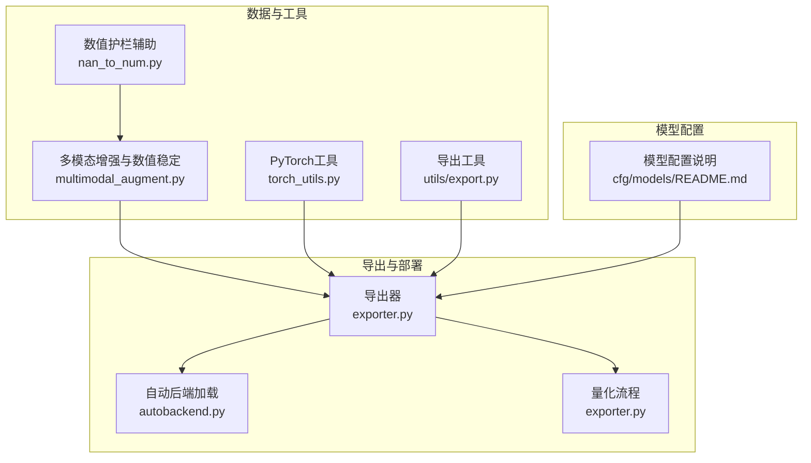
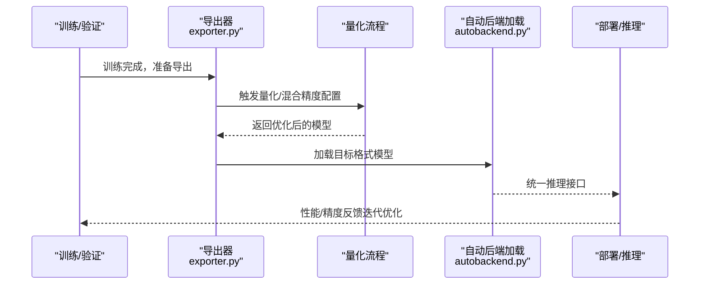
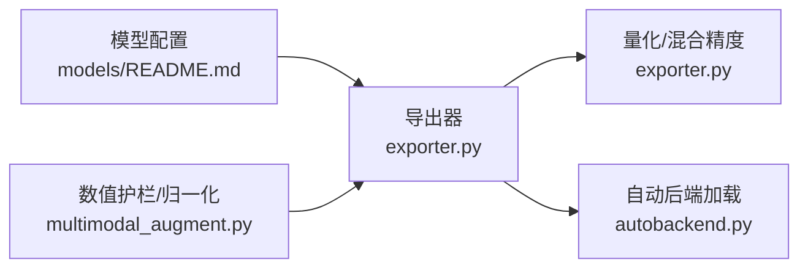

# 模型剪枝技术

<cite>
**本文引用的文件**
- [ultralytics/engine/exporter.py](file://ultralytics/engine/exporter.py)
- [ultralytics/nn/autobackend.py](file://ultralytics/nn/autobackend.py)
- [ultralytics/nan_to_num.py](file://ultralytics/nan_to_num.py)
- [ultralytics/utils/torch_utils.py](file://ultralytics/utils/torch_utils.py)
- [ultralytics/utils/export.py](file://ultralytics/utils/export.py)
- [ultralytics/data/multimodal_augment.py](file://ultralytics/data/multimodal_augment.py)
- [ultralytics/cfg/models/README.md](file://ultralytics/cfg/models/README.md)
</cite>

## 目录
1. [引言](#引言)
2. [项目结构](#项目结构)
3. [核心组件](#核心组件)
4. [架构总览](#架构总览)
5. [详细组件分析](#详细组件分析)
6. [依赖关系分析](#依赖关系分析)
7. [性能考量](#性能考量)
8. [故障排查指南](#故障排查指南)
9. [结论](#结论)
10. [附录](#附录)

## 引言
本指南围绕“模型剪枝”展开，系统阐述结构化剪枝与非结构化剪枝的区别、适用场景与实现原理；结合仓库中已有的量化与导出能力，给出剪枝后模型的再训练与部署建议，并说明剪枝对参数量、计算复杂度与推理性能的影响。同时提供可操作的配置思路与最佳实践，帮助在不同硬件与精度约束下取得更优的部署表现。

## 项目结构
本仓库以“模型训练、验证、导出与多后端推理”为主线组织代码。与剪枝主题直接相关的能力主要体现在以下方面：
- 导出器与量化：提供多种格式导出与量化流程，便于在剪枝后进行进一步优化与部署。
- 自动后端加载：统一加载与推理入口，支持多后端部署，为剪枝后的模型提供一致的推理体验。
- 数据增强与数值稳定性：在数据侧提供数值护栏与归一化等处理，有助于提升模型在低比特或稀疏条件下的鲁棒性。
- 模型配置与信息：提供模型结构与参数信息的查询接口，便于评估剪枝前后变化。

图示来源
- [ultralytics/engine/exporter.py:1-200](file://ultralytics/engine/exporter.py#L1-L200)
- [ultralytics/nn/autobackend.py:610-620](file://ultralytics/nn/autobackend.py#L610-L620)
- [ultralytics/data/multimodal_augment.py:888-917](file://ultralytics/data/multimodal_augment.py#L888-L917)
- [ultralytics/utils/torch_utils.py](file://ultralytics/utils/torch_utils.py)
- [ultralytics/utils/export.py](file://ultralytics/utils/export.py)
- [ultralytics/cfg/models/README.md:1-66](file://ultralytics/cfg/models/README.md#L1-L66)

章节来源
- [ultralytics/engine/exporter.py:1-200](file://ultralytics/engine/exporter.py#L1-L200)
- [ultralytics/nn/autobackend.py:610-620](file://ultralytics/nn/autobackend.py#L610-L620)
- [ultralytics/data/multimodal_augment.py:888-917](file://ultralytics/data/multimodal_augment.py#L888-L917)
- [ultralytics/utils/torch_utils.py](file://ultralytics/utils/torch_utils.py)
- [ultralytics/utils/export.py](file://ultralytics/utils/export.py)
- [ultralytics/cfg/models/README.md:1-66](file://ultralytics/cfg/models/README.md#L1-L66)

## 核心组件
- 导出器与量化：提供多格式导出与量化流程，支持在剪枝后进行进一步优化（如混合精度、GPTQ/PTQ量化），并生成目标平台可用的中间表示。
- 自动后端加载：统一加载不同格式模型，屏蔽后端差异，便于在剪枝后进行部署与推理。
- 数值护栏与归一化：在数据处理阶段对张量进行有限值处理与归一化，有助于提升稀疏或低比特模型的稳定性。
- 模型信息与配置：提供模型结构与参数信息查询，便于评估剪枝效果与选择合适配置。

章节来源
- [ultralytics/engine/exporter.py:114-148](file://ultralytics/engine/exporter.py#L114-L148)
- [ultralytics/nn/autobackend.py:610-620](file://ultralytics/nn/autobackend.py#L610-L620)
- [ultralytics/data/multimodal_augment.py:888-917](file://ultralytics/data/multimodal_augment.py#L888-L917)
- [ultralytics/cfg/models/README.md:1-66](file://ultralytics/cfg/models/README.md#L1-L66)

## 架构总览
下图展示从训练到部署的关键路径，以及与剪枝相关的优化节点：

图示来源
- [ultralytics/engine/exporter.py:117-148](file://ultralytics/engine/exporter.py#L117-L148)
- [ultralytics/engine/exporter.py:1198-1243](file://ultralytics/engine/exporter.py#L1198-L1243)
- [ultralytics/nn/autobackend.py:610-620](file://ultralytics/nn/autobackend.py#L610-L620)

## 详细组件分析

### 结构化剪枝 vs 非结构化剪枝
- 定义与区别
  - 结构化剪枝：按层或通道维度整体置零，保留连续的权重块，有利于硬件加速与内存访问效率。
  - 非结构化剪枝：按权重幅值独立置零，形成高密度稀疏矩阵，压缩比更高但对硬件友好性较低。
- 适用场景
  - 结构化剪枝：移动端、嵌入式、边缘设备等对内存与访存带宽敏感的场景。
  - 非结构化剪枝：服务器侧或具备高效稀疏内核的平台，追求更高的压缩比。
- 在本仓库中的落地
  - 本仓库未直接提供基于权重阈值或重要性的剪枝API，但可通过导出与量化流程配合实现“结构化裁剪”（例如通过通道裁剪、层裁剪）与“权重稀疏化”（通过低比特量化/混合精度）相结合的策略。

章节来源
- [ultralytics/engine/exporter.py:114-148](file://ultralytics/engine/exporter.py#L114-L148)
- [ultralytics/engine/exporter.py:1198-1243](file://ultralytics/engine/exporter.py#L1198-L1243)

### 剪枝算法实现原理（概念性说明）
- 基于权重阈值的剪枝
  - 步骤：统计权重分布，设定阈值，低于阈值的权重置零；随后进行微调恢复精度。
  - 优点：实现简单、可解释性强。
  - 缺点：可能破坏局部结构一致性，需配合结构化策略。
- 基于重要性的剪枝
  - 步骤：使用梯度、二阶信息或注意力权重衡量重要性，优先剪除低重要性连接；再进行再训练。
  - 优点：通常能获得更好的精度-压缩权衡。
  - 缺点：计算成本较高，需要额外的评估过程。
- 在本仓库中的映射
  - 虽未直接实现上述两类剪枝，但可借助导出器中的量化配置与混合精度设置，达到类似“重要性驱动”的稀疏化效果（例如对激活或权重进行位宽控制）。

章节来源
- [ultralytics/engine/exporter.py:1198-1243](file://ultralytics/engine/exporter.py#L1198-L1243)
- [ultralytics/engine/exporter.py:1215-1222](file://ultralytics/engine/exporter.py#L1215-L1222)

### PyTorch 模型剪枝工具使用（概念性说明）
- torch.nn.utils.prune 模块常用能力
  - 全局/层级阈值剪枝：按全局或层内权重幅值排序，设定阈值进行置零。
  - 稀疏性控制：通过设置目标稀疏率，动态调整阈值。
  - 结构化约束：支持按通道/滤波器进行结构化剪枝，提升硬件友好性。
  - 迭代剪枝：分步降低稀疏率，逐步逼近目标压缩比。
- 在本仓库中的协同
  - 可在导出前对模型应用结构化剪枝，再通过导出器的量化与混合精度配置进一步压缩与加速。

章节来源
- [ultralytics/engine/exporter.py:114-148](file://ultralytics/engine/exporter.py#L114-L148)
- [ultralytics/engine/exporter.py:1198-1243](file://ultralytics/engine/exporter.py#L1198-L1243)

### 剪枝后的模型微调与再训练
- 微调策略
  - 学习率调度：采用较小学习率，延长训练周期，避免破坏已学特征。
  - 正则化：增加权重衰减或梯度裁剪，抑制过拟合。
  - 渐进式稀疏：先剪枝再微调，再逐步提高稀疏度，保持精度稳定。
- 在本仓库中的落地
  - 导出器支持混合精度与量化配置，可在导出阶段即引入“稀疏感知”的权重位宽控制，减少后续微调成本。

章节来源
- [ultralytics/engine/exporter.py:1215-1222](file://ultralytics/engine/exporter.py#L1215-L1222)
- [ultralytics/engine/exporter.py:1224-1243](file://ultralytics/engine/exporter.py#L1224-L1243)

### 对参数量、计算复杂度与推理性能的影响
- 参数量
  - 结构化剪枝：按通道/层裁剪，参数量线性下降，易于估算。
  - 非结构化剪枝：高密度稀疏，压缩比更高，但需额外存储稀疏模式。
- 计算复杂度
  - 结构化剪枝：卷积/线性层的通道数减少，FLOPs显著下降。
  - 非结构化剪枝：若无专用稀疏内核，FLOPs下降有限，但内存带宽压力可能降低。
- 推理性能
  - 硬件友好性：结构化剪枝更易被现代推理引擎优化（如TensorRT、OpenVINO）。
  - 内存占用：稀疏存储与模式表会带来额外开销，需权衡。

章节来源
- [ultralytics/engine/exporter.py:114-148](file://ultralytics/engine/exporter.py#L114-L148)

### 剪枝效果评估与性能对比
- 评估指标
  - 精度：mAP、IoU、类别精度等（取决于任务）。
  - 压缩比：参数量/存储大小压缩倍数。
  - 推理指标：吞吐量（FPS）、延迟、功耗。
- 对比方法
  - 同一批测试集上对比原模型与不同稀疏度/结构化程度的模型。
  - 使用导出器生成多版本模型，统一在相同后端与硬件上评测。

章节来源
- [ultralytics/engine/exporter.py:114-148](file://ultralytics/engine/exporter.py#L114-L148)

### 实际配置示例与最佳实践
- 配置示例（概念性）
  - 结构化剪枝：按通道裁剪，目标稀疏率 50%-70%，随后微调若干轮。
  - 非结构化剪枝：设定全局阈值，逐步提升稀疏率，结合混合精度。
- 最佳实践
  - 先结构化后非结构化：优先结构化剪枝获得稳定收益，再用非结构化精细化。
  - 量化先行：在导出阶段启用混合精度/量化，减少微调工作量。
  - 数值护栏：在数据侧进行数值稳定处理，提升低比特/稀疏模型鲁棒性。

章节来源
- [ultralytics/engine/exporter.py:1198-1243](file://ultralytics/engine/exporter.py#L1198-L1243)
- [ultralytics/data/multimodal_augment.py:888-917](file://ultralytics/data/multimodal_augment.py#L888-L917)

## 依赖关系分析
- 导出器依赖
  - 模型配置与信息：用于确定导出目标与参数规模。
  - 量化与混合精度：在导出阶段集成，实现“剪枝+量化”的联合优化。
  - 自动后端加载：统一加载不同格式模型，便于部署。
- 数据侧依赖
  - 数值护栏与归一化：在数据预处理阶段提升稳定性，间接改善剪枝后模型鲁棒性。

图示来源
- [ultralytics/cfg/models/README.md:1-66](file://ultralytics/cfg/models/README.md#L1-L66)
- [ultralytics/engine/exporter.py:114-148](file://ultralytics/engine/exporter.py#L114-L148)
- [ultralytics/nn/autobackend.py:610-620](file://ultralytics/nn/autobackend.py#L610-L620)
- [ultralytics/data/multimodal_augment.py:888-917](file://ultralytics/data/multimodal_augment.py#L888-L917)

章节来源
- [ultralytics/cfg/models/README.md:1-66](file://ultralytics/cfg/models/README.md#L1-L66)
- [ultralytics/engine/exporter.py:114-148](file://ultralytics/engine/exporter.py#L114-L148)
- [ultralytics/nn/autobackend.py:610-620](file://ultralytics/nn/autobackend.py#L610-L620)
- [ultralytics/data/multimodal_augment.py:888-917](file://ultralytics/data/multimodal_augment.py#L888-L917)

## 性能考量
- 压缩与精度权衡：结构化剪枝通常更易维持精度，非结构化剪枝压缩比更高但需更强的工程化支持。
- 硬件适配：优先选择具备稀疏内核或通道裁剪优化的推理引擎，以发挥结构化剪枝优势。
- 数值稳定性：在数据侧与模型侧均实施数值护栏，有助于提升低比特/稀疏模型的鲁棒性。

## 故障排查指南
- 推理结果异常
  - 检查是否正确禁用梯度（在加载阶段对参数requires_grad进行控制）。
  - 确认后端加载的元数据与模型格式匹配。
- 数值不稳定
  - 在数据预处理阶段启用数值护栏与归一化，避免NaN/Inf传播。
- 量化/稀疏导致精度下降
  - 适当降低稀疏度或提高微调轮次；在导出阶段启用混合精度/量化配置以缓解影响。

章节来源
- [ultralytics/nn/autobackend.py:610-620](file://ultralytics/nn/autobackend.py#L610-L620)
- [ultralytics/data/multimodal_augment.py:888-917](file://ultralytics/data/multimodal_augment.py#L888-L917)

## 结论
本仓库虽未直接提供基于权重阈值或重要性的剪枝API，但其导出器与量化能力为“结构化+稀疏化”的联合优化提供了良好基础。结合自动后端加载与数据侧数值护栏，可在不同硬件平台上实现更高效的剪枝后模型部署。建议在工程实践中采用“先结构化、后非结构化、再量化/混合精度”的渐进式策略，并以统一的评估体系持续迭代。

## 附录
- 模型配置与信息查询：用于评估剪枝前后模型规模与结构变化。
- 导出与量化：作为剪枝后的关键优化环节，建议在导出阶段即启用混合精度/量化配置。

章节来源
- [ultralytics/cfg/models/README.md:1-66](file://ultralytics/cfg/models/README.md#L1-L66)
- [ultralytics/engine/exporter.py:114-148](file://ultralytics/engine/exporter.py#L114-L148)