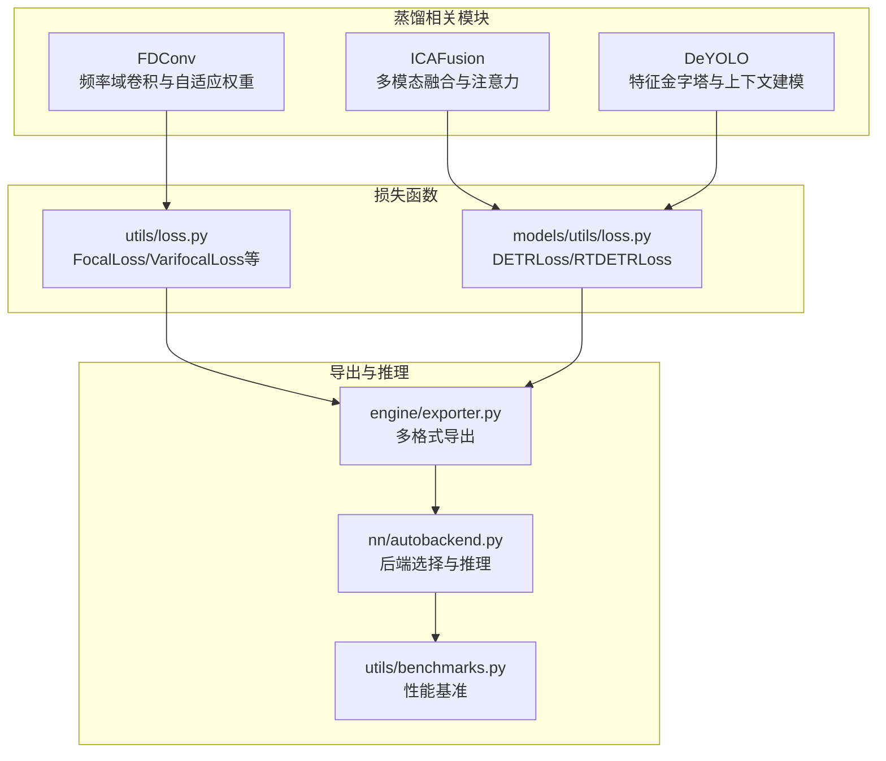
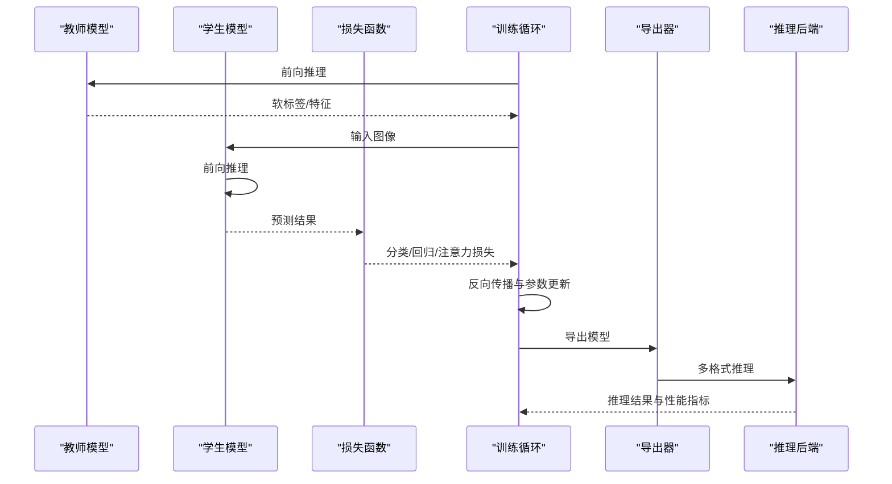
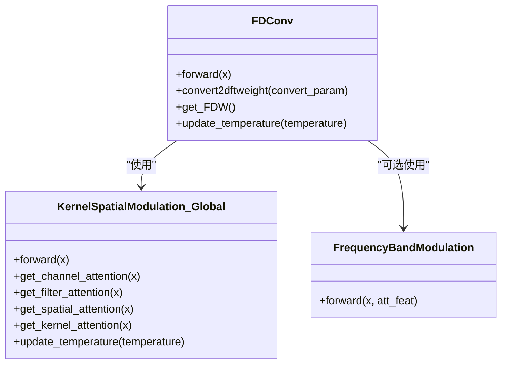
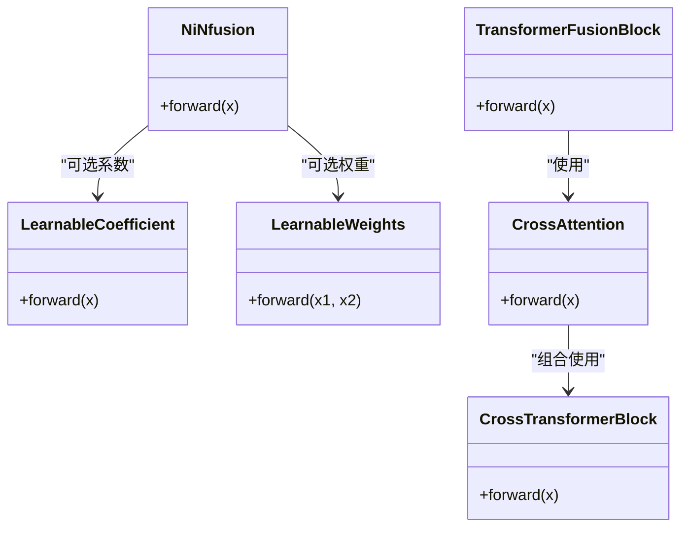
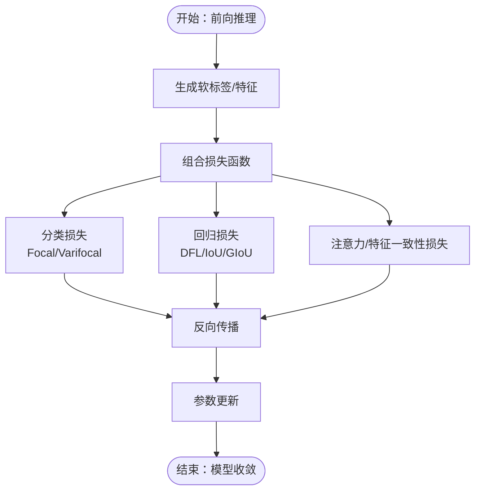
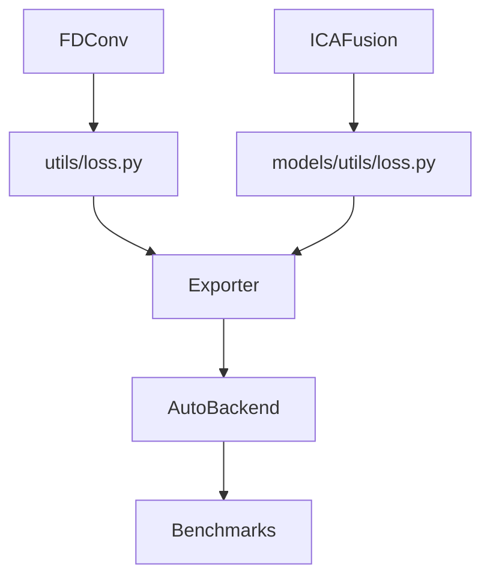

# 模型蒸馏技术

<cite>
**本文档引用的文件**
- [fdconv.py](file://ultralytics/nn/public/fdconv.py)
- [icafusion.py](file://ultralytics/nn/modules/fusion/icafusion.py)
- [deyolo.py](file://ultralytics/nn/modules/fusion/deyolo.py)
- [loss.py](file://ultralytics/utils/loss.py)
- [loss.py](file://ultralytics/models/utils/loss.py)
- [exporter.py](file://ultralytics/engine/exporter.py)
- [autobackend.py](file://ultralytics/nn/autobackend.py)
- [benchmarks.py](file://ultralytics/utils/benchmarks.py)
</cite>

## 目录
1. [引言](#引言)
2. [项目结构](#项目结构)
3. [核心组件](#核心组件)
4. [架构总览](#架构总览)
5. [详细组件分析](#详细组件分析)
6. [依赖关系分析](#依赖关系分析)
7. [性能考虑](#性能考虑)
8. [故障排除指南](#故障排除指南)
9. [结论](#结论)
10. [附录](#附录)

## 引言
本文件系统性阐述模型蒸馏技术在该代码库中的实现与应用，重点覆盖以下方面：
- 知识蒸馏基本原理与Teacher-Student模型架构
- 软标签蒸馏、特征蒸馏、注意力蒸馏等不同蒸馏方式的实现要点
- PyTorch蒸馏训练的损失函数设计与优化策略
- 温度参数调节与损失权重平衡
- 蒸馏对模型压缩与性能提升的评估方法
- 不同蒸馏策略的适用场景与性能对比
- 蒸馏模型的部署与推理优化建议

## 项目结构
该仓库围绕YOLO系列模型提供多格式导出、推理后端选择、损失函数与蒸馏相关模块。与蒸馏密切相关的模块主要分布在以下路径：
- 模型公共模块与蒸馏相关组件：ultralytics/nn/public/fdconv.py、ultralytics/nn/modules/fusion/icafusion.py、ultralytics/nn/modules/fusion/deyolo.py
- 损失函数与蒸馏损失：ultralytics/utils/loss.py、ultralytics/models/utils/loss.py
- 导出与部署：ultralytics/engine/exporter.py、ultralytics/nn/autobackend.py
- 性能基准与评估：ultralytics/utils/benchmarks.py

**图表来源**
- [fdconv.py:334-566](file://ultralytics/nn/public/fdconv.py#L334-L566)
- [icafusion.py:1-450](file://ultralytics/nn/modules/fusion/icafusion.py#L1-L450)
- [deyolo.py:101-137](file://ultralytics/nn/modules/fusion/deyolo.py#L101-L137)
- [loss.py:18-84](file://ultralytics/utils/loss.py#L18-L84)
- [loss.py:15-397](file://ultralytics/models/utils/loss.py#L15-L397)
- [exporter.py:114-148](file://ultralytics/engine/exporter.py#L114-L148)
- [autobackend.py:70-132](file://ultralytics/nn/autobackend.py#L70-L132)
- [benchmarks.py:52-211](file://ultralytics/utils/benchmarks.py#L52-L211)

**章节来源**
- [fdconv.py:1-566](file://ultralytics/nn/public/fdconv.py#L1-L566)
- [icafusion.py:1-450](file://ultralytics/nn/modules/fusion/icafusion.py#L1-L450)
- [deyolo.py:101-137](file://ultralytics/nn/modules/fusion/deyolo.py#L101-L137)
- [loss.py:1-864](file://ultralytics/utils/loss.py#L1-L864)
- [loss.py:1-477](file://ultralytics/models/utils/loss.py#L1-L477)
- [exporter.py:1-800](file://ultralytics/engine/exporter.py#L1-L800)
- [autobackend.py:1-800](file://ultralytics/nn/autobackend.py#L1-L800)
- [benchmarks.py:1-721](file://ultralytics/utils/benchmarks.py#L1-L721)

## 核心组件
- FDConv（频率域卷积）：通过频域权重聚合与温度参数调节实现自适应卷积核生成，支持软标签蒸馏与特征蒸馏的频率域建模。
- ICAFusion（多模态融合）：提供NiN融合、可学习系数、可学习权重与交叉注意力等模块，支撑注意力蒸馏与特征融合。
- DeYOLO（特征金字塔模块）：通过全局上下文卷积金字塔与通道/空间注意力，辅助教师模型特征的提取与蒸馏。
- 损失函数：FocalLoss、VarifocalLoss、DFL、DETRLoss等，为蒸馏训练提供分类、回归与注意力损失的组合。

**章节来源**
- [fdconv.py:334-566](file://ultralytics/nn/public/fdconv.py#L334-L566)
- [icafusion.py:12-425](file://ultralytics/nn/modules/fusion/icafusion.py#L12-L425)
- [deyolo.py:101-137](file://ultralytics/nn/modules/fusion/deyolo.py#L101-L137)
- [loss.py:18-84](file://ultralytics/utils/loss.py#L18-L84)
- [loss.py:15-397](file://ultralytics/models/utils/loss.py#L15-L397)

## 架构总览
蒸馏训练的整体流程包括：教师模型（Teacher）输出软标签/特征，学生模型（Student）通过组合损失函数（分类+回归+注意力/特征一致性）进行学习；训练过程中通过温度参数与损失权重平衡软标签与硬标签的贡献；训练完成后通过导出器转换为多种推理后端，并在不同硬件平台进行性能评估。

**图表来源**
- [loss.py:194-310](file://ultralytics/utils/loss.py#L194-L310)
- [loss.py:357-397](file://ultralytics/models/utils/loss.py#L357-L397)
- [exporter.py:267-534](file://ultralytics/engine/exporter.py#L267-L534)
- [autobackend.py:617-800](file://ultralytics/nn/autobackend.py#L617-L800)

## 详细组件分析

### FDConv（频率域卷积与温度调节）
- 功能概述：将标准卷积分解为频域权重集合，通过温度参数控制注意力分布的平滑程度，实现自适应卷积核生成，支持软标签蒸馏与特征蒸馏。
- 关键机制：
  - KSM（Kernel-Spatial Modulation）：全局/局部注意力模块，输出通道、滤波器、空间与核的注意力权重。
  - FrequencyBandModulation（频带调制）：对输入特征进行频域分解，按频带加权融合，增强频率域特征表达。
  - 温度参数更新：通过update_temperature接口动态调整注意力分布的锐利度。
- 适用场景：需要在卷积层内嵌入频率域先验与自适应权重的蒸馏场景。

**图表来源**
- [fdconv.py:334-566](file://ultralytics/nn/public/fdconv.py#L334-L566)
- [fdconv.py:402-427](file://ultralytics/nn/public/fdconv.py#L402-L427)
- [fdconv.py:233-320](file://ultralytics/nn/public/fdconv.py#L233-L320)

**章节来源**
- [fdconv.py:334-566](file://ultralytics/nn/public/fdconv.py#L334-L566)

### ICAFusion（多模态融合与注意力蒸馏）
- 功能概述：提供NiN融合、可学习系数、可学习权重与交叉注意力等模块，支撑跨模态特征融合与注意力蒸馏。
- 关键机制：
  - NiNfusion：拼接后经1x1卷积投影，实现轻量级多模态融合。
  - LearnableCoefficient/LearnableWeights：对特征或分支进行可学习缩放与加权，实现自适应融合。
  - CrossAttention/CrossTransformerBlock：RGB与红外模态间的交叉注意力，实现跨模态深度交互。
  - TransformerFusionBlock：下采样-交叉注意力-上采样-融合的完整流程，结合位置编码与残差连接。
- 适用场景：多模态蒸馏（如RGB->红外）、跨模态特征对齐与注意力一致性学习。

**图表来源**
- [icafusion.py:12-425](file://ultralytics/nn/modules/fusion/icafusion.py#L12-L425)

**章节来源**
- [icafusion.py:12-425](file://ultralytics/nn/modules/fusion/icafusion.py#L12-L425)

### DeYOLO（特征金字塔与上下文建模）
- 功能概述：通过全局上下文卷积金字塔与通道/空间注意力，增强特征表达，辅助教师模型的特征蒸馏。
- 关键机制：利用自适应平均池化与卷积金字塔生成多尺度上下文特征，结合注意力门控实现特征选择与融合。
- 适用场景：需要更强特征表达与上下文感知的蒸馏任务。

**章节来源**
- [deyolo.py:101-137](file://ultralytics/nn/modules/fusion/deyolo.py#L101-L137)

### 损失函数与蒸馏策略
- FocalLoss/VarifocalLoss：解决类别不平衡问题，聚焦难分类样本，适用于软标签蒸馏。
- DFL（Distribution Focal Loss）：对边界框分布进行建模，提升回归精度。
- DETRLoss/RTDETRLoss：提供分类、边界框、GIoU与可选辅助损失，支持注意力蒸馏与多层监督。
- 蒸馏损失组合：通常由分类损失（软标签）+回归损失（DFL/IoU/GIoU）+注意力/特征一致性损失构成。

**图表来源**
- [loss.py:18-84](file://ultralytics/utils/loss.py#L18-L84)
- [loss.py:87-173](file://ultralytics/utils/loss.py#L87-L173)
- [loss.py:15-397](file://ultralytics/models/utils/loss.py#L15-L397)

**章节来源**
- [loss.py:18-84](file://ultralytics/utils/loss.py#L18-L84)
- [loss.py:87-173](file://ultralytics/utils/loss.py#L87-L173)
- [loss.py:15-397](file://ultralytics/models/utils/loss.py#L15-L397)

## 依赖关系分析
- 模块耦合：
  - FDConv与频率域调制模块存在直接依赖，温度参数贯穿注意力生成。
  - ICAFusion的注意力模块与Transformer融合块相互配合，形成跨模态蒸馏闭环。
  - 损失函数模块与蒸馏策略紧密耦合，共同决定训练目标。
- 导出与推理：
  - 导出器支持多格式（ONNX、TensorRT、OpenVINO等），推理后端通过AutoBackend统一抽象。
  - 基准工具提供跨格式性能评估，便于蒸馏效果量化。

**图表来源**
- [fdconv.py:334-566](file://ultralytics/nn/public/fdconv.py#L334-L566)
- [icafusion.py:12-425](file://ultralytics/nn/modules/fusion/icafusion.py#L12-L425)
- [loss.py:18-84](file://ultralytics/utils/loss.py#L18-L84)
- [loss.py:15-397](file://ultralytics/models/utils/loss.py#L15-L397)
- [exporter.py:114-148](file://ultralytics/engine/exporter.py#L114-L148)
- [autobackend.py:70-132](file://ultralytics/nn/autobackend.py#L70-L132)
- [benchmarks.py:52-211](file://ultralytics/utils/benchmarks.py#L52-L211)

**章节来源**
- [exporter.py:114-148](file://ultralytics/engine/exporter.py#L114-L148)
- [autobackend.py:70-132](file://ultralytics/nn/autobackend.py#L70-L132)
- [benchmarks.py:52-211](file://ultralytics/utils/benchmarks.py#L52-L211)

## 性能考虑
- 温度参数调节：在软标签蒸馏中，温度越高，软标签越平滑，学生模型学习越稳定；温度过低可能导致信息丢失。可通过update_temperature接口动态调整。
- 损失权重平衡：分类损失、回归损失与注意力/特征一致性损失需根据任务特点进行加权，避免某一损失主导训练。
- 频率域建模：FDConv的参数减少与频域权重稀疏化有助于模型压缩，同时保留关键频率信息。
- 多模态蒸馏：ICAFusion的NiN融合与交叉注意力在保持轻量的同时提升跨模态对齐能力。
- 推理加速：通过导出器转换为TensorRT/ONNX/OpenVINO等格式，并在目标设备上进行性能基准测试。

[本节为通用指导，无需具体文件分析]

## 故障排除指南
- 导出失败：检查导出格式的有效性与设备兼容性，确认参数校验与依赖安装。
- 推理异常：确认推理后端与模型元数据匹配，检查输入形状与数据类型。
- 性能不达预期：评估不同导出格式与精度配置（半精度/整型量化），结合基准工具进行对比。

**章节来源**
- [exporter.py:151-172](file://ultralytics/engine/exporter.py#L151-L172)
- [autobackend.py:575-582](file://ultralytics/nn/autobackend.py#L575-L582)
- [benchmarks.py:105-152](file://ultralytics/utils/benchmarks.py#L105-L152)

## 结论
该代码库提供了从频率域建模、多模态融合到损失函数与导出推理的完整蒸馏技术栈。通过FDConv、ICAFusion与DETR系列损失函数，能够实现软标签、特征与注意力的多维度蒸馏；借助导出器与推理后端，可将蒸馏模型高效部署到多平台并进行性能评估。实际应用中应结合任务特点合理设置温度参数与损失权重，并通过基准工具进行系统性评估。

[本节为总结性内容，无需具体文件分析]

## 附录
- 适用场景建议：
  - 软标签蒸馏：类别不平衡严重、教师模型复杂的学生模型压缩。
  - 特征蒸馏：需要保留教师模型高层语义特征的场景。
  - 注意力蒸馏：跨模态对齐、长程依赖建模。
- 性能对比分析：建议以mAP、FPS、模型大小为指标，在相同硬件平台上对比不同蒸馏策略与导出格式的综合表现。

[本节为概念性内容，无需具体文件分析]