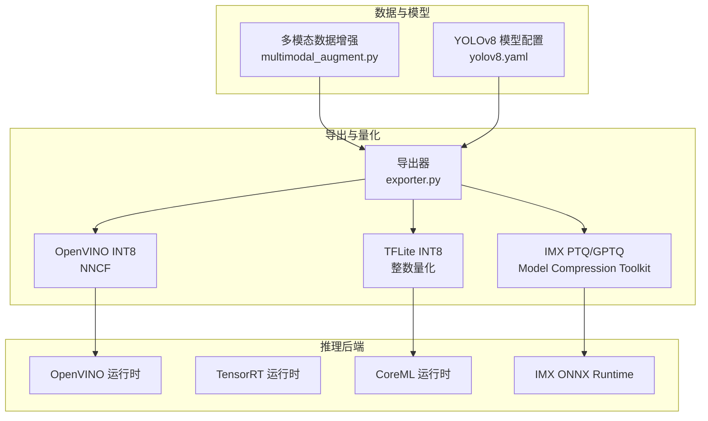
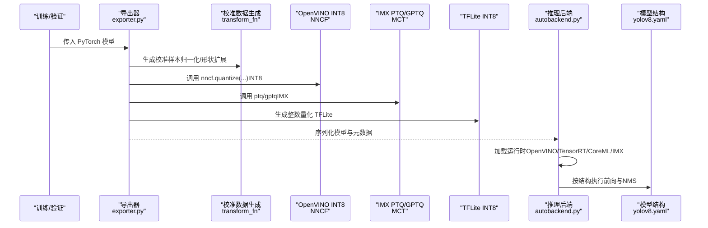
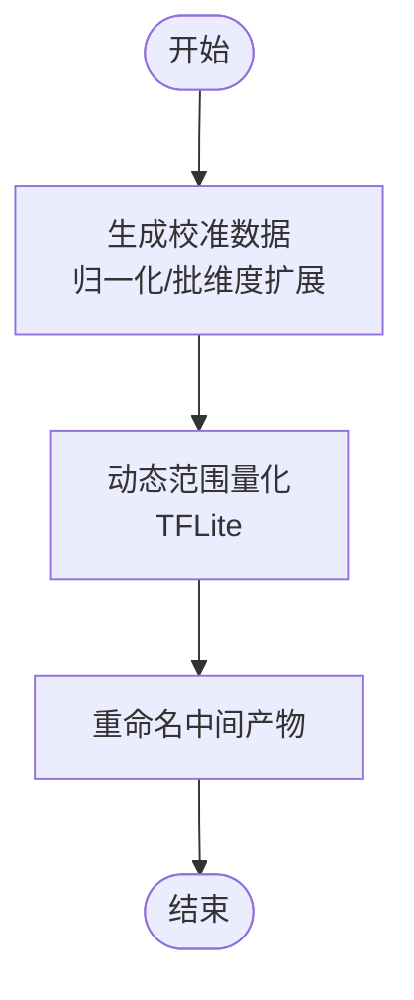
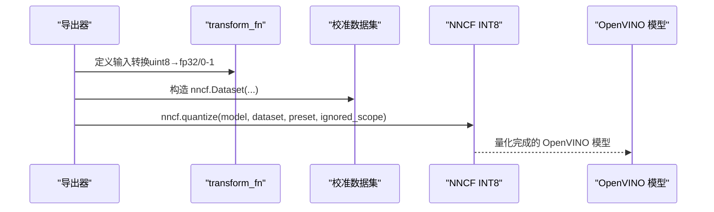
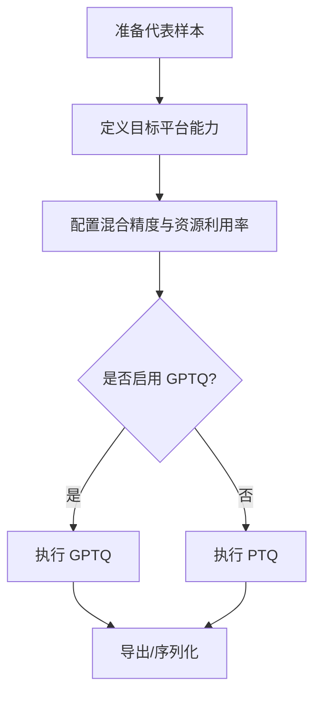
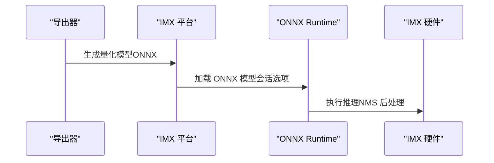
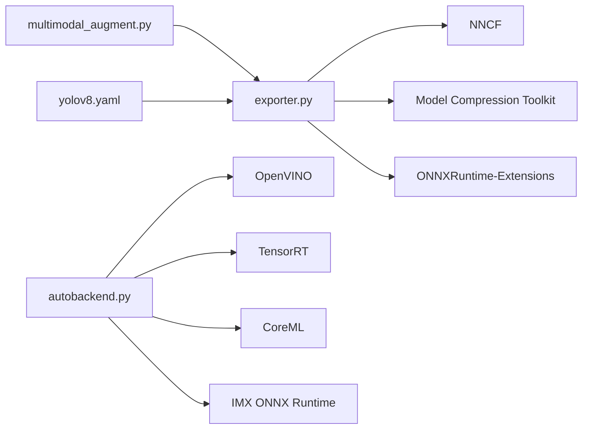

# 模型量化技术

<cite>
**本文引用的文件**
- [ultralytics/engine/exporter.py](file://ultralytics/engine/exporter.py)
- [ultralytics/data/multimodal_augment.py](file://ultralytics/data/multimodal_augment.py)
- [ultralytics/nn/autobackend.py](file://ultralytics/nn/autobackend.py)
- [ultralytics/cfg/models/v8/yolov8.yaml](file://ultralytics/cfg/models/v8/yolov8.yaml)
</cite>

## 目录
1. [引言](#引言)
2. [项目结构](#项目结构)
3. [核心组件](#核心组件)
4. [架构总览](#架构总览)
5. [详细组件分析](#详细组件分析)
6. [依赖关系分析](#依赖关系分析)
7. [性能考量](#性能考量)
8. [故障排查指南](#故障排查指南)
9. [结论](#结论)
10. [附录](#附录)

## 引言
本技术文档围绕模型量化展开，系统阐述动态量化、静态量化与量化感知训练（QAT）三类方法在该仓库中的实现思路与应用方式，并结合仓库内导出器与推理后端的实际调用路径，给出可操作的量化配置要点与部署建议。文档同时覆盖激活量化、权重量化与混合精度量化的设置策略，量化对精度与推理速度的影响权衡，以及在不同目标平台（如 OpenVINO、TensorRT、CoreML、IMX 等）上的部署与优化方法。

## 项目结构
该仓库以 Ultralytics YOLO 为核心，提供多任务检测、分割、姿态等模型的训练、验证、导出与推理能力。与量化相关的关键位置包括：
- 导出器：负责将 PyTorch 模型导出为多种格式，并在部分格式中集成量化流程（如 OpenVINO INT8、IMX 的 PTQ/GPTQ、TFLite INT8 等）
- 推理后端：加载导出后的模型并在对应运行时执行推理，支持 OpenVINO、TensorRT、CoreML、IMX 等
- 数据增强：包含图像级量化与噪声模拟逻辑，体现对数值精度与鲁棒性的控制手段
- 模型配置：提供 YOLOv8 网络结构定义，便于理解层间数据流与量化敏感度

图表来源
- [ultralytics/engine/exporter.py:636-708](file://ultralytics/engine/exporter.py#L636-L708)
- [ultralytics/engine/exporter.py:1170-1316](file://ultralytics/engine/exporter.py#L1170-L1316)
- [ultralytics/engine/exporter.py:1000-1030](file://ultralytics/engine/exporter.py#L1000-L1030)
- [ultralytics/nn/autobackend.py:260-459](file://ultralytics/nn/autobackend.py#L260-L459)
- [ultralytics/data/multimodal_augment.py:888-917](file://ultralytics/data/multimodal_augment.py#L888-L917)
- [ultralytics/cfg/models/v8/yolov8.yaml:1-50](file://ultralytics/cfg/models/v8/yolov8.yaml#L1-L50)

章节来源
- [ultralytics/engine/exporter.py:636-708](file://ultralytics/engine/exporter.py#L636-L708)
- [ultralytics/engine/exporter.py:1170-1316](file://ultralytics/engine/exporter.py#L1170-L1316)
- [ultralytics/engine/exporter.py:1000-1030](file://ultralytics/engine/exporter.py#L1000-L1030)
- [ultralytics/nn/autobackend.py:260-459](file://ultralytics/nn/autobackend.py#L260-L459)
- [ultralytics/data/multimodal_augment.py:888-917](file://ultralytics/data/multimodal_augment.py#L888-L917)
- [ultralytics/cfg/models/v8/yolov8.yaml:1-50](file://ultralytics/cfg/models/v8/yolov8.yaml#L1-L50)

## 核心组件
- 导出器（exporter.py）
  - 提供 OpenVINO INT8、IMX PTQ/GPTQ、TFLite INT8、CoreML 权重量化等导出路径
  - 内置校准数据生成与预处理函数，用于静态量化所需的统计信息
  - 针对不同后端的序列化与元数据写入流程
- 推理后端（autobackend.py）
  - 加载各后端模型并建立会话，支持动态输入形状、半精度、内存绑定等优化
  - IMX 后端通过 ONNX Runtime 执行量化模型，启用特定会话选项
- 数据增强（multimodal_augment.py）
  - 实现基于位深的图像量化与噪声注入，体现对数值范围与精度的控制
- 模型配置（yolov8.yaml）
  - 定义骨干与检测头的网络结构，为量化策略选择提供依据（例如哪些层对精度更敏感）

章节来源
- [ultralytics/engine/exporter.py:636-708](file://ultralytics/engine/exporter.py#L636-L708)
- [ultralytics/engine/exporter.py:1170-1316](file://ultralytics/engine/exporter.py#L1170-L1316)
- [ultralytics/engine/exporter.py:1000-1030](file://ultralytics/engine/exporter.py#L1000-L1030)
- [ultralytics/nn/autobackend.py:260-459](file://ultralytics/nn/autobackend.py#L260-L459)
- [ultralytics/data/multimodal_augment.py:888-917](file://ultralytics/data/multimodal_augment.py#L888-L917)
- [ultralytics/cfg/models/v8/yolov8.yaml:1-50](file://ultralytics/cfg/models/v8/yolov8.yaml#L1-L50)

## 架构总览
下图展示从导出到推理的关键路径，以及量化在其中的位置与影响面：

图表来源
- [ultralytics/engine/exporter.py:672-700](file://ultralytics/engine/exporter.py#L672-L700)
- [ultralytics/engine/exporter.py:1191-1243](file://ultralytics/engine/exporter.py#L1191-L1243)
- [ultralytics/engine/exporter.py:1000-1030](file://ultralytics/engine/exporter.py#L1000-L1030)
- [ultralytics/nn/autobackend.py:260-459](file://ultralytics/nn/autobackend.py#L260-L459)
- [ultralytics/cfg/models/v8/yolov8.yaml:1-50](file://ultralytics/cfg/models/v8/yolov8.yaml#L1-L50)

## 详细组件分析

### 动态量化（Post-Training Dynamic Quantization）
- 特点：在不重新训练的情况下，对推理时的激活进行动态量化；通常以“动态范围”或“KMeans”等方式进行激活量化。
- 在仓库中的体现：
  - 导出器对 CoreML 支持按位宽量化权重（8/16/32），并通过运行时参数控制激活量化策略
  - TFLite 导出支持动态范围量化与整数校准量化，后者需要校准集
- 关键流程（TFLite 动态范围量化）：
  - 生成代表样本（0-1 归一化）
  - 使用 TensorFlow Lite 工具链生成动态范围量化模型
  - 将生成的中间产物重命名与后处理

图表来源
- [ultralytics/engine/exporter.py:1000-1030](file://ultralytics/engine/exporter.py#L1000-L1030)

章节来源
- [ultralytics/engine/exporter.py:1000-1030](file://ultralytics/engine/exporter.py#L1000-L1030)

### 静态量化（Post-Training Static Quantization）
- 特点：通过少量代表性数据计算激活统计（均值/方差/范围），在推理时对激活进行定点量化；常与权重量化组合使用。
- 在仓库中的体现：
  - OpenVINO INT8：使用 NNCF 对模型进行量化，提供 IgnoredScope 以忽略头部算子与 Sigmoid 等
  - IMX PTQ：使用 Model Compression Toolkit 的 PTQ/GPTQ，配置混合精度与资源利用率
  - TFLite INT8：整数量化需要“整数校准”阶段，导出器中包含相应开关与重命名逻辑
- 关键流程（OpenVINO INT8）：
  - 定义 transform_fn（uint8 输入 → 浮点归一化）
  - 构造校准数据集（nncf.Dataset）
  - 调用 nncf.quantize(...) 并序列化

图表来源
- [ultralytics/engine/exporter.py:672-700](file://ultralytics/engine/exporter.py#L672-L700)

章节来源
- [ultralytics/engine/exporter.py:672-700](file://ultralytics/engine/exporter.py#L672-L700)
- [ultralytics/engine/exporter.py:1191-1243](file://ultralytics/engine/exporter.py#L1191-L1243)
- [ultralytics/engine/exporter.py:1000-1030](file://ultralytics/engine/exporter.py#L1000-L1030)

### 量化感知训练（Quantization Aware Training, QAT）
- 特点：在训练阶段引入量化伪操作（Quant/Dequant），使模型学习适应量化误差，从而在推理时获得更高精度。
- 在仓库中的体现：
  - 导出器未直接暴露 QAT 训练接口；但 IMX PTQ/GPTQ 的调用表明仓库具备 GPTQ/PTQ 的集成能力，可用于“训练后量化”的近似效果
  - 若需严格意义上的 QAT，可在外部框架中完成训练，再将权重导入导出器进行后续静态/动态量化
- 关键流程（GPTQ/PTQ）：
  - 定义目标平台能力（TPC）
  - 设置混合精度配置与资源利用率
  - 选择 GPTQ 或 PTQ 执行量化

图表来源
- [ultralytics/engine/exporter.py:1191-1243](file://ultralytics/engine/exporter.py#L1191-L1243)

章节来源
- [ultralytics/engine/exporter.py:1191-1243](file://ultralytics/engine/exporter.py#L1191-L1243)

### PyTorch 量化工具包使用要点（torch.quantization）
- 本仓库主要通过第三方库（NNCF、Model Compression Toolkit）实现量化，而非直接使用 torch.quantization 模块
- 若需在自定义流程中使用 torch.quantization，请参考以下通用实践（概念性说明）：
  - 使用 torch.quantization.prepare/convert 对模型进行静态量化准备与转换
  - 使用 torch.ao.quantization.prepare_qat/convert_qat 进行 QAT 准备与转换
  - 使用 calibrate 函数在代表性数据上收集激活统计
  - 保存/加载量化模型并进行推理

[本节为概念性说明，不直接分析具体文件]

### 量化配置示例（激活量化、权重量化、混合精度）
- 激活量化
  - OpenVINO INT8：通过 NNCF 的 QuantizationPreset 与 IgnoredScope 控制
  - TFLite 动态范围量化：导出器中已内置流程
  - CoreML 权重量化：根据位宽（8/16/32）进行量化
- 权重量化
  - MNN：支持 8bit 权重量化
  - CoreML：权重量化（8bit）
  - IMX：通过 MCT 的 BitWidthConfig 与 Mixed Precision 配置
- 混合精度量化
  - IMX：针对特定算子设置手动激活位宽（如 16bit），其余层采用自动策略
  - MCT：MixedPrecisionQuantizationConfig 控制混合精度搜索

章节来源
- [ultralytics/engine/exporter.py:672-700](file://ultralytics/engine/exporter.py#L672-L700)
- [ultralytics/engine/exporter.py:1000-1030](file://ultralytics/engine/exporter.py#L1000-L1030)
- [ultralytics/engine/exporter.py:866-873](file://ultralytics/engine/exporter.py#L866-L873)
- [ultralytics/engine/exporter.py:748-752](file://ultralytics/engine/exporter.py#L748-L752)
- [ultralytics/engine/exporter.py:1199-1220](file://ultralytics/engine/exporter.py#L1199-L1220)

### 量化对精度与推理速度的影响及权衡
- 精度影响
  - 权重/激活位宽越低，精度损失越大；头部算子（如 Sigmoid、NMS）对量化更敏感，需通过 IgnoredScope 等策略规避
  - 混合精度可在关键层保留更高位宽，降低整体精度损失
- 性能提升
  - 更低位宽带来更小的存储占用与更快的算子执行；IMX/NNIE 等硬件对 8bit/16bit 有专门加速
- 权衡策略
  - 先做静态量化评估，再对敏感层进行混合精度或 QAT 微调
  - 结合目标设备的硬件特性（如 IMX 的算力与内存预算）调整混合精度配置

章节来源
- [ultralytics/engine/exporter.py:684-693](file://ultralytics/engine/exporter.py#L684-L693)
- [ultralytics/engine/exporter.py:1199-1220](file://ultralytics/engine/exporter.py#L1199-L1220)

### 部署与推理优化
- OpenVINO
  - 支持 FP16 与 INT8；通过 IgnoredScope 忽略头部算子；序列化时写入元数据
- TensorRT
  - 支持 FP16；动态形状绑定；IO 绑定减少拷贝
- CoreML
  - 支持权重量化与整数量化；根据位宽选择量化模式
- IMX
  - 使用 MCT PTQ/GPTQ；导出 ONNX 后由 imxconv-pt 转换；ONNX 写入元数据；运行时通过 ONNX Runtime 执行

图表来源
- [ultralytics/engine/exporter.py:1296-1310](file://ultralytics/engine/exporter.py#L1296-L1310)
- [ultralytics/nn/autobackend.py:260-296](file://ultralytics/nn/autobackend.py#L260-L296)

章节来源
- [ultralytics/engine/exporter.py:636-708](file://ultralytics/engine/exporter.py#L636-L708)
- [ultralytics/engine/exporter.py:1296-1310](file://ultralytics/engine/exporter.py#L1296-L1310)
- [ultralytics/nn/autobackend.py:260-459](file://ultralytics/nn/autobackend.py#L260-L459)

## 依赖关系分析
- 导出器依赖第三方量化库（NNCF、Model Compression Toolkit、ONNXRuntime-Extensions 等）
- 推理后端按格式加载对应运行时（OpenVINO、TensorRT、CoreML、IMX ONNX Runtime）
- 数据增强模块提供图像级量化与噪声注入，辅助理解量化对数值分布的影响

图表来源
- [ultralytics/engine/exporter.py:666-700](file://ultralytics/engine/exporter.py#L666-L700)
- [ultralytics/engine/exporter.py:1173-1177](file://ultralytics/engine/exporter.py#L1173-L1177)
- [ultralytics/nn/autobackend.py:260-459](file://ultralytics/nn/autobackend.py#L260-L459)
- [ultralytics/data/multimodal_augment.py:888-917](file://ultralytics/data/multimodal_augment.py#L888-L917)
- [ultralytics/cfg/models/v8/yolov8.yaml:1-50](file://ultralytics/cfg/models/v8/yolov8.yaml#L1-L50)

章节来源
- [ultralytics/engine/exporter.py:666-700](file://ultralytics/engine/exporter.py#L666-L700)
- [ultralytics/engine/exporter.py:1173-1177](file://ultralytics/engine/exporter.py#L1173-L1177)
- [ultralytics/nn/autobackend.py:260-459](file://ultralytics/nn/autobackend.py#L260-L459)
- [ultralytics/data/multimodal_augment.py:888-917](file://ultralytics/data/multimodal_augment.py#L888-L917)
- [ultralytics/cfg/models/v8/yolov8.yaml:1-50](file://ultralytics/cfg/models/v8/yolov8.yaml#L1-L50)

## 性能考量
- 存储与带宽
  - 8bit/16bit 模型显著降低模型大小与传输开销
- 计算效率
  - 低比特乘加在专用硬件上具备更高吞吐；动态/静态量化对激活的量化策略直接影响算子吞吐
- 内存与缓存
  - IO 绑定与 FP16 可减少显存占用；IMX/NNIE 等平台对混合精度有专门优化
- 端到端延迟
  - 量化前后需进行端到端回归测试，确保在目标设备上的延迟满足需求

[本节提供通用指导，不直接分析具体文件]

## 故障排查指南
- OpenVINO INT8
  - 确认已安装满足版本要求的 NNCF 与 packaging；检查 transform_fn 输入类型与归一化范围
  - 如遇到头部算子导致精度异常，确认 IgnoredScope 是否正确匹配头部模块名
- IMX PTQ/GPTQ
  - 确保 Java ≥ 17；检查代表样本生成与 TPC 版本兼容性；核对 BitWidthConfig 与混合精度配置
- TFLite INT8
  - 确认导出参数包含整数校准；关注中间产物重命名与后处理
- CoreML 权重量化
  - 根据位宽选择合适的量化模式；注意 KMeans 量化依赖 scikit-learn

章节来源
- [ultralytics/engine/exporter.py:666-700](file://ultralytics/engine/exporter.py#L666-L700)
- [ultralytics/engine/exporter.py:1182-1189](file://ultralytics/engine/exporter.py#L1182-L1189)
- [ultralytics/engine/exporter.py:1000-1030](file://ultralytics/engine/exporter.py#L1000-L1030)
- [ultralytics/engine/exporter.py:866-873](file://ultralytics/engine/exporter.py#L866-L873)

## 结论
本仓库通过导出器与推理后端的协同，提供了从静态量化到混合精度量化的完整落地路径。OpenVINO INT8、IMX PTQ/GPTQ、TFLite INT8 与 CoreML 权重量化在不同平台上各有优势。实际工程中应结合目标设备的硬件特性与精度要求，采用“静态量化评估 + 混合精度 + QAT 微调”的策略，在精度与性能之间取得最佳平衡。

## 附录
- 数据增强中的图像级量化与噪声注入，有助于理解量化对数值分布与鲁棒性的影响，可作为量化策略设计的参考

章节来源
- [ultralytics/data/multimodal_augment.py:888-917](file://ultralytics/data/multimodal_augment.py#L888-L917)