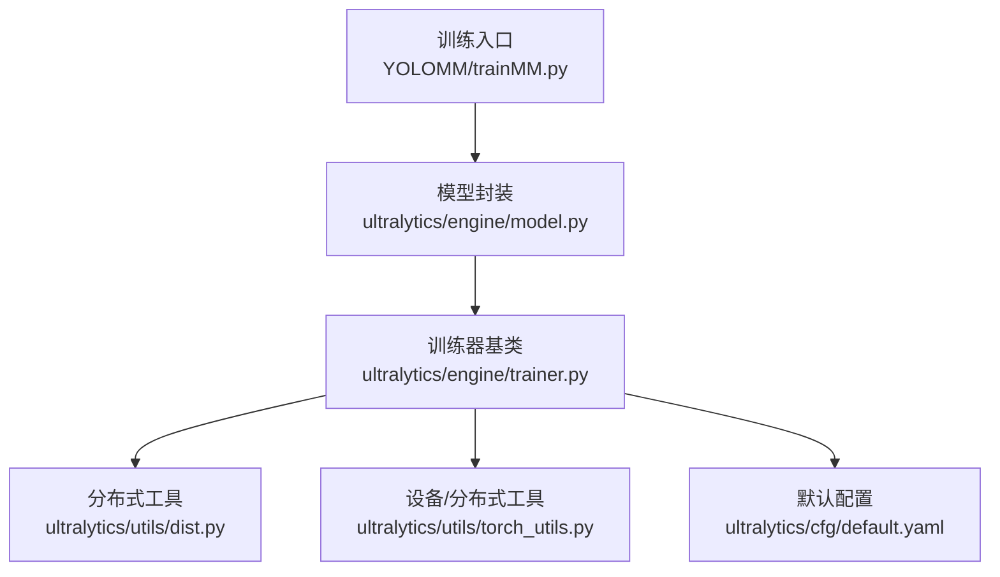
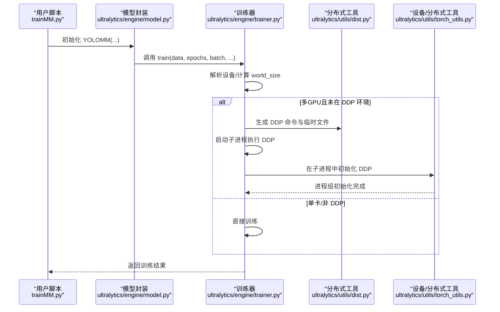
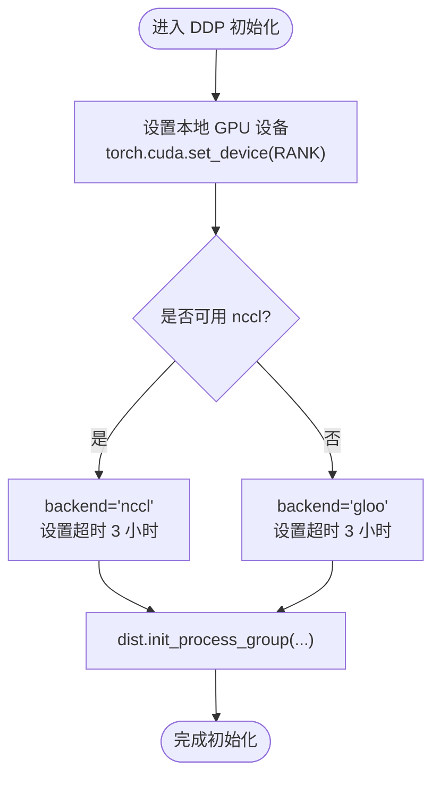
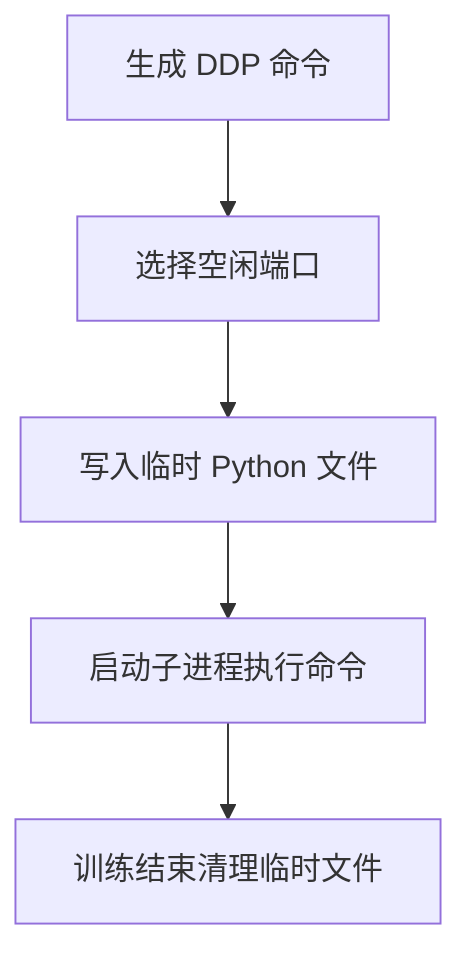
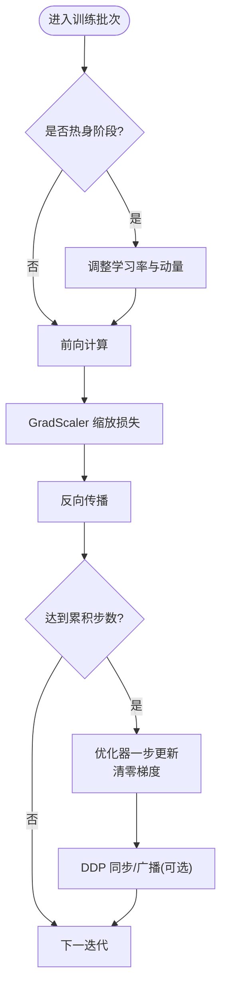
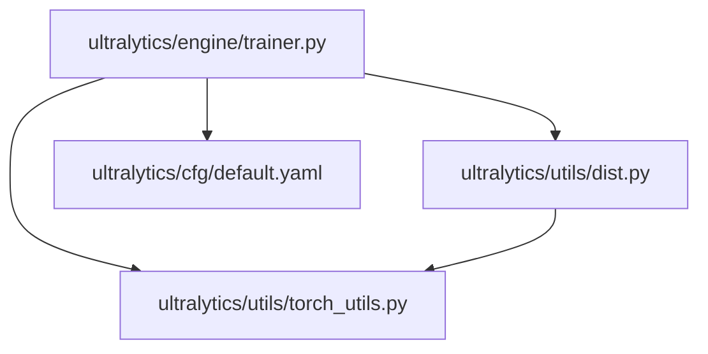

# 分布式训练

<cite>
**本文引用的文件**
- [ultralytics/engine/trainer.py](file://ultralytics/engine/trainer.py)
- [ultralytics/utils/dist.py](file://ultralytics/utils/dist.py)
- [ultralytics/utils/torch_utils.py](file://ultralytics/utils/torch_utils.py)
- [ultralytics/cfg/default.yaml](file://ultralytics/cfg/default.yaml)
- [trainMM.py](file://trainMM.py)
</cite>

## 目录
1. [引言](#引言)
2. [项目结构](#项目结构)
3. [核心组件](#核心组件)
4. [架构总览](#架构总览)
5. [详细组件分析](#详细组件分析)
6. [依赖分析](#依赖分析)
7. [性能考虑](#性能考虑)
8. [故障排除指南](#故障排除指南)
9. [结论](#结论)
10. [附录](#附录)

## 引言
本指南围绕分布式训练技术展开，结合代码库中 DDP（分布式数据并行）的实现与配置，系统讲解以下内容：
- DDP 工作原理与进程初始化、通信后端选择
- 数据并行与模型并行的区别与适用场景
- 多 GPU 与多节点训练的配置方法（含环境变量与启动命令）
- 同步机制与梯度聚合过程
- 性能优化技巧（梯度压缩、桶化等）
- 常见问题与故障排除

## 项目结构
该仓库提供了完整的 YOLO 训练框架，其中分布式训练能力由训练器与工具模块协同实现：
- 训练器负责训练流程、DDP 初始化、数据加载与优化器管理
- 工具模块负责生成 DDP 启动命令、临时文件与清理
- 配置文件提供默认训练参数与多模态扩展项
- 示例脚本展示如何调用多模态训练入口

**图示来源**
- [trainMM.py:1-15](file://trainMM.py#L1-L15)
- [ultralytics/engine/trainer.py:1-120](file://ultralytics/engine/trainer.py#L1-L120)
- [ultralytics/utils/dist.py:1-120](file://ultralytics/utils/dist.py#L1-L120)
- [ultralytics/utils/torch_utils.py:1-120](file://ultralytics/utils/torch_utils.py#L1-L120)
- [ultralytics/cfg/default.yaml:1-168](file://ultralytics/cfg/default.yaml#L1-L168)

**章节来源**
- [trainMM.py:1-15](file://trainMM.py#L1-L15)
- [ultralytics/engine/trainer.py:1-120](file://ultralytics/engine/trainer.py#L1-L120)
- [ultralytics/utils/dist.py:1-120](file://ultralytics/utils/dist.py#L1-L120)
- [ultralytics/utils/torch_utils.py:1-120](file://ultralytics/utils/torch_utils.py#L1-L120)
- [ultralytics/cfg/default.yaml:1-168](file://ultralytics/cfg/default.yaml#L1-L168)

## 核心组件
- 训练器（BaseTrainer）
  - 负责训练主循环、学习率调度、优化器与 EMA 更新、验证与保存
  - 支持 DDP 初始化与分布式同步
- 分布式工具（dist）
  - 生成 DDP 启动命令、临时文件，清理临时资源
- 设备/分布式工具（torch_utils）
  - 设备选择、自动混合精度上下文、分布式屏障等
- 默认配置（default.yaml）
  - 提供训练超参、设备与多模态增强开关等

**章节来源**
- [ultralytics/engine/trainer.py:191-248](file://ultralytics/engine/trainer.py#L191-L248)
- [ultralytics/utils/dist.py:79-120](file://ultralytics/utils/dist.py#L79-L120)
- [ultralytics/utils/torch_utils.py:131-246](file://ultralytics/utils/torch_utils.py#L131-L246)
- [ultralytics/cfg/default.yaml:1-168](file://ultralytics/cfg/default.yaml#L1-L168)

## 架构总览
下图展示了从训练入口到 DDP 启动的关键交互路径。

**图示来源**
- [trainMM.py:1-15](file://trainMM.py#L1-L15)
- [ultralytics/engine/trainer.py:191-248](file://ultralytics/engine/trainer.py#L191-L248)
- [ultralytics/utils/dist.py:79-120](file://ultralytics/utils/dist.py#L79-L120)
- [ultralytics/utils/torch_utils.py:237-248](file://ultralytics/utils/torch_utils.py#L237-L248)

## 详细组件分析

### DDP 初始化与进程组配置
- 进程初始化
  - 训练器根据设备字符串或列表推导 world_size，并在多 GPU 且未检测到 LOCAL_RANK 时触发 DDP 子进程
  - 子进程内通过 torch.cuda.set_device(RANK) 设置当前设备，并初始化进程组
- 通信后端
  - 若可用则优先 nccl，否则回退到 gloo；设置阻塞等待以强制超时控制
- 环境变量
  - 设置 TORCH_NCCL_BLOCKING_WAIT=1 以启用阻塞等待，便于超时控制

**图示来源**
- [ultralytics/engine/trainer.py:237-248](file://ultralytics/engine/trainer.py#L237-L248)
- [ultralytics/utils/torch_utils.py:237-248](file://ultralytics/utils/torch_utils.py#L237-L248)

**章节来源**
- [ultralytics/engine/trainer.py:191-248](file://ultralytics/engine/trainer.py#L191-L248)
- [ultralytics/utils/torch_utils.py:237-248](file://ultralytics/utils/torch_utils.py#L237-L248)

### 启动命令与临时文件
- 命令生成
  - 依据世界规模与训练器参数生成 torch.distributed.run 或 torch.distributed.launch 命令
  - 自动分配空闲端口作为 MASTER_PORT
- 临时文件
  - 写入包含 trainer 类导入、参数覆盖与训练入口的 Python 文件
  - 训练结束后清理临时文件

**图示来源**
- [ultralytics/utils/dist.py:79-120](file://ultralytics/utils/dist.py#L79-L120)

**章节来源**
- [ultralytics/utils/dist.py:29-120](file://ultralytics/utils/dist.py#L29-L120)

### 训练主循环与分布式同步
- 训练主循环
  - 支持热身、梯度累积、学习率调度、验证与保存
  - 在 DDP 下广播 AMP 标志、广播停止信号、设置 DataLoader 的 sampler epoch
- 梯度聚合
  - 使用 GradScaler 进行缩放反向传播
  - 达到累积步数后执行优化器一步更新，并清零梯度
  - 在 DDP 中，损失乘以 world_size 以补偿归约前的分片损失

**图示来源**
- [ultralytics/engine/trainer.py:344-491](file://ultralytics/engine/trainer.py#L344-L491)

**章节来源**
- [ultralytics/engine/trainer.py:344-491](file://ultralytics/engine/trainer.py#L344-L491)

### 数据并行与模型并行
- 数据并行（本项目采用）
  - 将批数据切分到各 GPU，每卡复制完整模型副本，独立前向/反向，梯度在后向完成后聚合
  - 适用于显存受限但可复制模型的场景
- 模型并行
  - 将模型按层或算子切分到不同设备，适合单卡显存不足的大模型
  - 本仓库未提供模型并行实现，建议结合外部框架或自定义策略

适用场景对比
- 数据并行：多卡显存充足、模型适中
- 模型并行：单卡显存紧张、模型巨大

[本节为概念性说明，不直接分析具体文件]

### 多 GPU 与多节点配置
- 多 GPU（单机多卡）
  - 通过 device 指定 GPU 列表或逗号分隔字符串，自动推导 world_size
  - 若 rect 或 batch<1，会进行兼容性处理
- 多节点
  - 通过 torch.distributed.run 启动，需保证网络连通与端口开放
  - MASTER_ADDR/MASTER_PORT 由工具模块自动选择或外部指定

环境变量与启动要点
- MASTER_PORT：动态分配空闲端口
- CUDA_VISIBLE_DEVICES：限制可见 GPU
- LOCAL_RANK/RANK：由 torch.distributed.run 注入

**章节来源**
- [ultralytics/engine/trainer.py:191-227](file://ultralytics/engine/trainer.py#L191-L227)
- [ultralytics/utils/dist.py:79-120](file://ultralytics/utils/dist.py#L79-L120)
- [ultralytics/utils/torch_utils.py:131-246](file://ultralytics/utils/torch_utils.py#L131-L246)

### 同步机制与梯度聚合
- 进程组同步
  - 初始化时设置阻塞等待，便于超时控制
  - 在需要跨进程共享状态（如停止标志）时使用广播
- 梯度聚合
  - 使用 GradScaler 缩放损失，反向传播后裁剪梯度，再执行优化器更新
  - DDP 下损失乘以 world_size 以补偿分片损失

**章节来源**
- [ultralytics/engine/trainer.py:237-248](file://ultralytics/engine/trainer.py#L237-L248)
- [ultralytics/engine/trainer.py:414-420](file://ultralytics/engine/trainer.py#L414-L420)

### 性能优化技巧
- 梯度压缩
  - 在高带宽受限场景可考虑梯度量化或稀疏化（需自定义实现）
- 桶化（Bucketing）
  - 将梯度按大小分桶并异步/分批归约，减少同步等待
- AMP（自动混合精度）
  - 默认启用 AMP，显著降低显存占用并提升吞吐
- 数据加载优化
  - 合理设置 workers、缓存策略与矩形训练（rect）以提升吞吐
- 早停与学习率调度
  - 使用余弦或线性调度，配合 patience 实现稳定收敛

**章节来源**
- [ultralytics/engine/trainer.py:229-235](file://ultralytics/engine/trainer.py#L229-L235)
- [ultralytics/cfg/default.yaml:37-47](file://ultralytics/cfg/default.yaml#L37-L47)

## 依赖分析
- 训练器依赖分布式工具与设备工具，用于命令生成、端口选择、设备设置与进程组初始化
- 分布式工具依赖默认配置字典与用户配置目录，用于生成临时文件与清理

**图示来源**
- [ultralytics/engine/trainer.py:1-120](file://ultralytics/engine/trainer.py#L1-L120)
- [ultralytics/utils/dist.py:1-120](file://ultralytics/utils/dist.py#L1-L120)
- [ultralytics/utils/torch_utils.py:1-120](file://ultralytics/utils/torch_utils.py#L1-L120)
- [ultralytics/cfg/default.yaml:1-168](file://ultralytics/cfg/default.yaml#L1-L168)

**章节来源**
- [ultralytics/engine/trainer.py:1-120](file://ultralytics/engine/trainer.py#L1-L120)
- [ultralytics/utils/dist.py:1-120](file://ultralytics/utils/dist.py#L1-L120)
- [ultralytics/utils/torch_utils.py:1-120](file://ultralytics/utils/torch_utils.py#L1-L120)
- [ultralytics/cfg/default.yaml:1-168](file://ultralytics/cfg/default.yaml#L1-L168)

## 性能考虑
- 显存与吞吐平衡
  - AMP 与梯度累积可提升吞吐并缓解显存压力
- 数据加载
  - 合理 workers 数量与缓存策略，避免成为瓶颈
- 通信开销
  - NCCL 在 NVLink/GDR 环境下表现更佳；尽量减少不必要的广播
- 训练稳定性
  - 早停与合适的 warmup、学习率调度有助于稳定收敛

[本节为通用指导，不直接分析具体文件]

## 故障排除指南
- 无法找到空闲端口
  - 端口冲突或权限不足，检查防火墙与端口占用
- NCCL 初始化失败
  - 检查 CUDA 驱动、NCCL 版本与 GPU 可见性；确认 MASTER_ADDR/MASTER_PORT 正确
- 训练异常退出
  - 查看日志中的 debug 命令与临时文件路径，定位子进程错误
- 批大小不合法
  - 多 GPU 训练时 batch 必须是 GPU 数目的整数倍；否则抛出异常
- rect 与 AutoBatch 兼容性
  - 多 GPU 训练时 rect 会被禁用，AutoBatch 会被重置为默认值

**章节来源**
- [ultralytics/utils/dist.py:79-120](file://ultralytics/utils/dist.py#L79-L120)
- [ultralytics/engine/trainer.py:191-227](file://ultralytics/engine/trainer.py#L191-L227)
- [ultralytics/utils/torch_utils.py:222-235](file://ultralytics/utils/torch_utils.py#L222-L235)

## 结论
本指南基于代码库中的 DDP 实现，系统阐述了分布式训练的原理、配置与实践要点。通过合理设置设备、通信后端与启动命令，并结合 AMP、桶化与数据加载优化，可在多 GPU 与多节点环境下获得稳定高效的训练体验。遇到问题时，可依据日志与临时文件快速定位根因并修复。

[本节为总结性内容，不直接分析具体文件]

## 附录
- 示例脚本
  - trainMM.py 展示了多模态训练入口的调用方式，可据此扩展为多 GPU/多节点训练

**章节来源**
- [trainMM.py:1-15](file://trainMM.py#L1-L15)