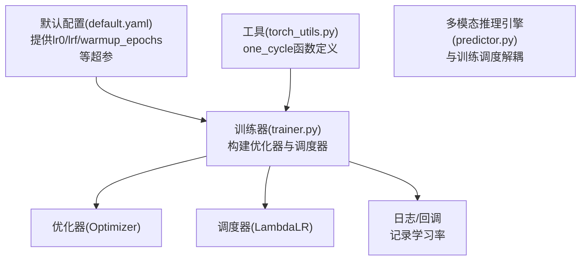
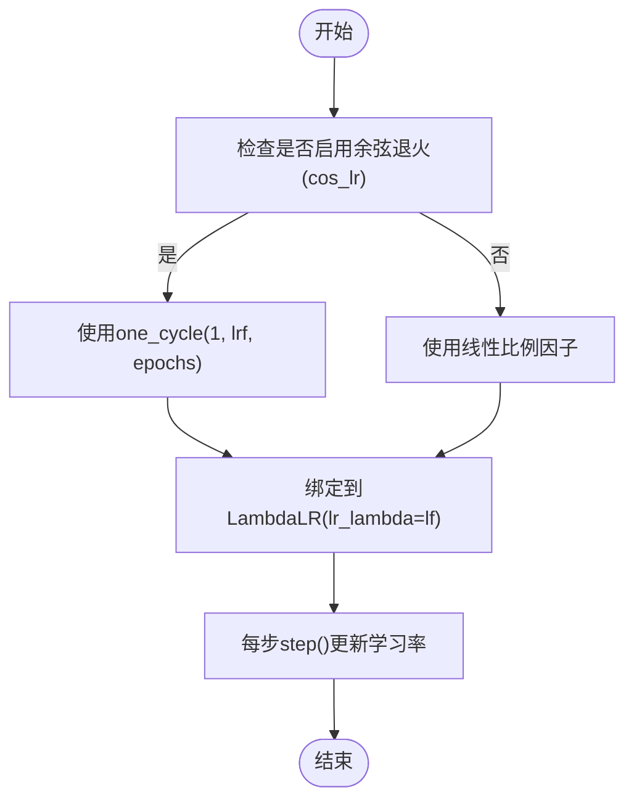
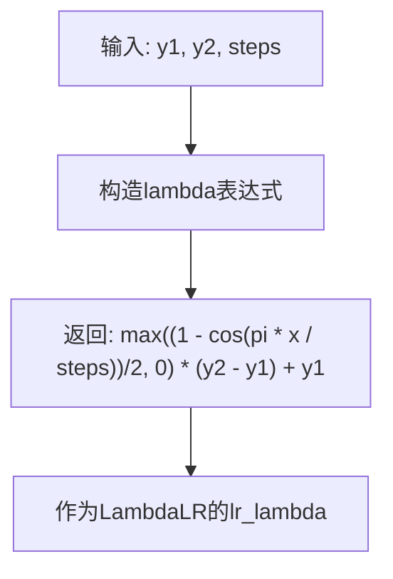
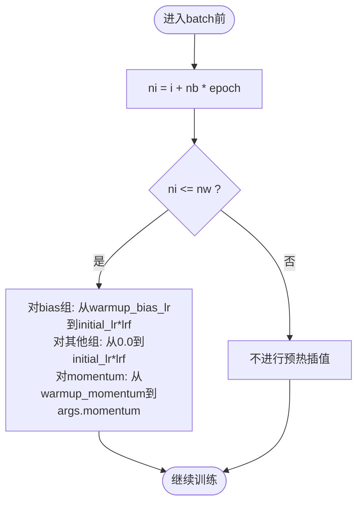
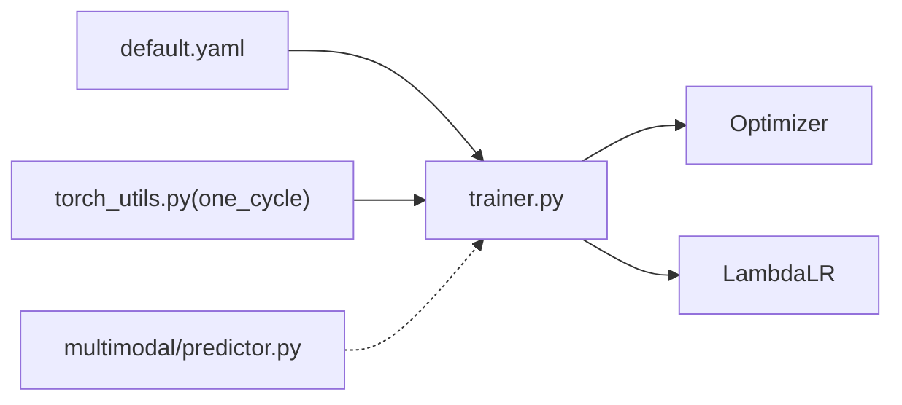

# 学习率调度策略

<cite>
**本文引用的文件**
- [ultralytics/utils/torch_utils.py](file://ultralytics/utils/torch_utils.py)
- [ultralytics/engine/trainer.py](file://ultralytics/engine/trainer.py)
- [ultralytics/cfg/default.yaml](file://ultralytics/cfg/default.yaml)
- [ultralytics/engine/multimodal/predictor.py](file://ultralytics/engine/multimodal/predictor.py)
- [ultralytics/utils/tuner.py](file://ultralytics/utils/tuner.py)
- [ultralytics/engine/tuner.py](file://ultralytics/engine/tuner.py)
- [ResTest/RTDETR-mid/args.yaml](file://ResTest/RTDETR-mid/args.yaml)
</cite>

## 目录
1. [简介](#简介)
2. [项目结构与定位](#项目结构与定位)
3. [核心组件](#核心组件)
4. [架构总览](#架构总览)
5. [详细组件分析](#详细组件分析)
6. [依赖关系分析](#依赖关系分析)
7. [性能考量](#性能考量)
8. [故障排查指南](#故障排查指南)
9. [结论](#结论)
10. [附录：配置与示例](#附录配置与示例)

## 简介
本文件系统性梳理并讲解多模态场景下的学习率调度策略，重点覆盖以下内容：
- 余弦退火与线性退火两类调度器的实现与差异
- one_cycle 学习率调度的数学原理、实现细节与优势
- 学习率预热（warmup）策略的实现与参数配置
- 在多模态训练中的特殊考虑与优化建议
- 结合仓库中默认配置、训练器与工具函数的实际落地方式

## 项目结构与定位
- 学习率调度的核心逻辑集中在训练器中，通过调度器接口与优化器配合，在每个 epoch 或 batch 步进时动态更新学习率。
- one_cycle 调度函数定义于通用工具模块，供训练器按需构造学习率曲线。
- 默认配置文件提供学习率相关超参的默认值与开关项，便于快速启用余弦退火或线性退火。
- 多模态推理引擎与调度策略解耦，但训练阶段会根据配置影响学习率曲线。



图表来源
- [ultralytics/cfg/default.yaml:92-126](file://ultralytics/cfg/default.yaml#L92-L126)
- [ultralytics/utils/torch_utils.py:658-670](file://ultralytics/utils/torch_utils.py#L658-L670)
- [ultralytics/engine/trainer.py:229-235](file://ultralytics/engine/trainer.py#L229-L235)

章节来源
- [ultralytics/cfg/default.yaml:92-126](file://ultralytics/cfg/default.yaml#L92-L126)
- [ultralytics/utils/torch_utils.py:658-670](file://ultralytics/utils/torch_utils.py#L658-L670)
- [ultralytics/engine/trainer.py:229-235](file://ultralytics/engine/trainer.py#L229-L235)

## 核心组件
- one_cycle 函数：提供余弦形式的单周期学习率曲线，用于余弦退火调度。
- 训练器调度初始化：根据配置选择余弦退火或线性退火，并绑定到 LambdaLR。
- 预热机制：在训练初期按线性插值提升学习率与动量，平滑优化器初始状态。
- 默认配置：提供 lr0、lrf、warmup_epochs 等关键超参的默认值与开关项。

章节来源
- [ultralytics/utils/torch_utils.py:658-670](file://ultralytics/utils/torch_utils.py#L658-L670)
- [ultralytics/engine/trainer.py:229-235](file://ultralytics/engine/trainer.py#L229-L235)
- [ultralytics/engine/trainer.py:390-402](file://ultralytics/engine/trainer.py#L390-L402)
- [ultralytics/cfg/default.yaml:92-126](file://ultralytics/cfg/default.yaml#L92-L126)

## 架构总览
下图展示了训练流程中学习率调度的关键交互：

```mermaid
sequenceDiagram
participant Trainer as "训练器(trainer.py)"
participant Utils as "工具(one_cycle)"
participant Opt as "优化器(Optimizer)"
participant Sched as "调度器(LambdaLR)"
participant Data as "数据加载器(DataLoader)"
Trainer->>Utils : 获取one_cycle函数(余弦退火)
Utils-->>Trainer : 返回lambda曲线
Trainer->>Opt : 构建优化器(lr0, momentum, weight_decay)
Trainer->>Sched : 绑定LambdaLR(lr_lambda=lf)
loop 每个epoch
Trainer->>Sched : step()
Sched-->>Trainer : 更新各参数组学习率
Trainer->>Data : 前向/反向/优化
Trainer->>Trainer : 预热插值更新学习率与动量
end
```

图表来源
- [ultralytics/engine/trainer.py:229-235](file://ultralytics/engine/trainer.py#L229-L235)
- [ultralytics/utils/torch_utils.py:658-670](file://ultralytics/utils/torch_utils.py#L658-L670)
- [ultralytics/engine/trainer.py:390-402](file://ultralytics/engine/trainer.py#L390-L402)

## 详细组件分析

### 余弦退火与线性退火调度
- 余弦退火：当开启余弦退火开关时，训练器使用 one_cycle 生成从 1 到 lrf 的余弦曲线作为学习率比例因子，使学习率在训练过程中平滑下降。
- 线性退火：未开启余弦退火时，采用线性比例因子，逐步从 1 下降到 lrf。
- 两者均通过 LambdaLR 将比例因子绑定到优化器的所有参数组。



图表来源
- [ultralytics/engine/trainer.py:229-235](file://ultralytics/engine/trainer.py#L229-L235)

章节来源
- [ultralytics/engine/trainer.py:229-235](file://ultralytics/engine/trainer.py#L229-L235)

### one_cycle 学习率调度原理与优势
- 数学形式：one_cycle 返回一个 lambda 函数，表示在给定总步数内从 y1 到 y2 的正弦上升过程，保证单调递增且在边界处平滑。
- 适用场景：适合需要在训练后期快速降低学习率以稳定收敛的场景；相比阶梯式衰减，能减少震荡。
- 实现要点：训练器将其作为 lr_lambda 传入 LambdaLR，从而在整个训练周期内动态变化。



图表来源
- [ultralytics/utils/torch_utils.py:658-670](file://ultralytics/utils/torch_utils.py#L658-L670)

章节来源
- [ultralytics/utils/torch_utils.py:658-670](file://ultralytics/utils/torch_utils.py#L658-L670)

### 学习率预热（Warmup）策略
- 预热目标：在训练初期以较小学习率与动量启动，缓解梯度突变带来的不稳定，提高早期收敛稳定性。
- 预热实现：在每个 batch 前根据当前累计步数与预热步数区间，对 bias 参数组与其余参数组分别进行线性插值，使其从 warmup 值平滑过渡到初始学习率乘以比例因子。
- 关键参数：warmup_epochs、warmup_momentum、warmup_bias_lr，均由默认配置提供。



图表来源
- [ultralytics/engine/trainer.py:390-402](file://ultralytics/engine/trainer.py#L390-L402)

章节来源
- [ultralytics/engine/trainer.py:390-402](file://ultralytics/engine/trainer.py#L390-L402)
- [ultralytics/cfg/default.yaml:97-99](file://ultralytics/cfg/default.yaml#L97-L99)

### 多模态训练中的特殊考虑与优化建议
- 模态路由与输入通道：多模态模型通常具有路由模块与不同模态的输入通道数，训练时应关注整体计算量与内存占用，合理设置批次大小与输入分辨率，避免显存溢出。
- 训练稳定性：多模态任务常伴随更复杂的特征融合与损失组合，建议优先采用余弦退火与充分的预热，以获得更稳定的收敛曲线。
- 超参搜索：可通过超参搜索工具对 lr0、lrf、warmup_epochs 等进行探索，结合验证指标选择最优组合。

章节来源
- [ultralytics/engine/multimodal/predictor.py:60-68](file://ultralytics/engine/multimodal/predictor.py#L60-L68)
- [ultralytics/utils/tuner.py:58-76](file://ultralytics/utils/tuner.py#L58-L76)
- [ultralytics/engine/tuner.py:70-86](file://ultralytics/engine/tuner.py#L70-L86)

## 依赖关系分析
- 训练器依赖默认配置提供超参，依赖工具模块提供 one_cycle 函数，最终通过 LambdaLR 将比例因子注入优化器。
- 多模态推理引擎与调度策略解耦，不影响训练阶段的学习率更新。



图表来源
- [ultralytics/cfg/default.yaml:92-126](file://ultralytics/cfg/default.yaml#L92-L126)
- [ultralytics/utils/torch_utils.py:658-670](file://ultralytics/utils/torch_utils.py#L658-L670)
- [ultralytics/engine/trainer.py:229-235](file://ultralytics/engine/trainer.py#L229-L235)
- [ultralytics/engine/multimodal/predictor.py:60-68](file://ultralytics/engine/multimodal/predictor.py#L60-L68)

章节来源
- [ultralytics/engine/trainer.py:229-235](file://ultralytics/engine/trainer.py#L229-L235)
- [ultralytics/utils/torch_utils.py:658-670](file://ultralytics/utils/torch_utils.py#L658-L670)
- [ultralytics/cfg/default.yaml:92-126](file://ultralytics/cfg/default.yaml#L92-L126)

## 性能考量
- 余弦退火通常能带来更平滑的收敛曲线，有助于在训练后期稳定收敛，适合大规模训练与长周期任务。
- 预热策略可显著改善早期训练的稳定性，减少因学习率过大导致的发散风险。
- 多模态训练中，建议结合显存与吞吐特性，适当调整 warmup_epochs 与 lrf，以平衡收敛速度与最终精度。

## 故障排查指南
- 学习率未随调度器更新：确认训练器在每个 epoch 中调用了调度器的 step 方法，且未在优化器之前调用 step 导致警告被抑制。
- 预热效果不明显：检查 warmup_epochs 是否大于 0，以及 nw 计算是否满足预期；同时核对 warmup_bias_lr 与 warmup_momentum 的设置。
- 余弦退火未生效：确认余弦退火开关已启用，且 lrf 设置合理；同时检查调度器绑定的 lr_lambda 是否为 one_cycle 返回的函数。

章节来源
- [ultralytics/engine/trainer.py:371-373](file://ultralytics/engine/trainer.py#L371-L373)
- [ultralytics/engine/trainer.py:350-351](file://ultralytics/engine/trainer.py#L350-L351)
- [ultralytics/engine/trainer.py:229-235](file://ultralytics/engine/trainer.py#L229-L235)

## 结论
- 余弦退火与线性退火在实现上均通过 LambdaLR 注入比例因子，区别在于曲线形态与收敛行为。
- one_cycle 提供平滑的单周期学习率曲线，适合追求稳定收敛的场景。
- 预热策略对早期训练稳定性至关重要，应结合任务复杂度与硬件条件合理设置。
- 多模态训练中，建议优先采用余弦退火与充分预热，并通过超参搜索进一步优化。

## 附录：配置与示例
- 启用余弦退火与设置学习率范围
  - 在默认配置中设置余弦退火开关与最终学习率比例因子，即可自动应用 one_cycle 调度。
  - 参考路径：[ultralytics/cfg/default.yaml:34](file://ultralytics/cfg/default.yaml#L34)，[ultralytics/cfg/default.yaml:94](file://ultralytics/cfg/default.yaml#L94)
- 预热参数配置
  - warmup_epochs、warmup_momentum、warmup_bias_lr 由默认配置提供，直接修改即可生效。
  - 参考路径：[ultralytics/cfg/default.yaml:97-99](file://ultralytics/cfg/default.yaml#L97-L99)
- 训练器中的调度初始化与预热逻辑
  - 训练器根据配置选择调度器类型，并在每个 batch 前执行预热插值。
  - 参考路径：[ultralytics/engine/trainer.py:229-235](file://ultralytics/engine/trainer.py#L229-L235)，[ultralytics/engine/trainer.py:390-402](file://ultralytics/engine/trainer.py#L390-L402)
- 多模态推理与训练解耦
  - 多模态推理引擎不参与训练调度，但可从模型中读取路由信息以支持不同模态输入。
  - 参考路径：[ultralytics/engine/multimodal/predictor.py:60-68](file://ultralytics/engine/multimodal/predictor.py#L60-L68)
- 超参搜索空间（含学习率与预热）
  - 超参搜索工具对 lr0、lrf、warmup_epochs 等进行探索，辅助选择最优调度策略。
  - 参考路径：[ultralytics/utils/tuner.py:58-76](file://ultralytics/utils/tuner.py#L58-L76)，[ultralytics/engine/tuner.py:70-86](file://ultralytics/engine/tuner.py#L70-L86)
- 示例配置文件（余弦退火关闭）
  - 可参考测试配置文件中的余弦退火开关与学习率设置，便于对比不同策略。
  - 参考路径：[ResTest/RTDETR-mid/args.yaml:26](file://ResTest/RTDETR-mid/args.yaml#L26)，[ResTest/RTDETR-mid/args.yaml:73-74](file://ResTest/RTDETR-mid/args.yaml#L73-L74)，[ResTest/RTDETR-mid/args.yaml:77](file://ResTest/RTDETR-mid/args.yaml#L77)