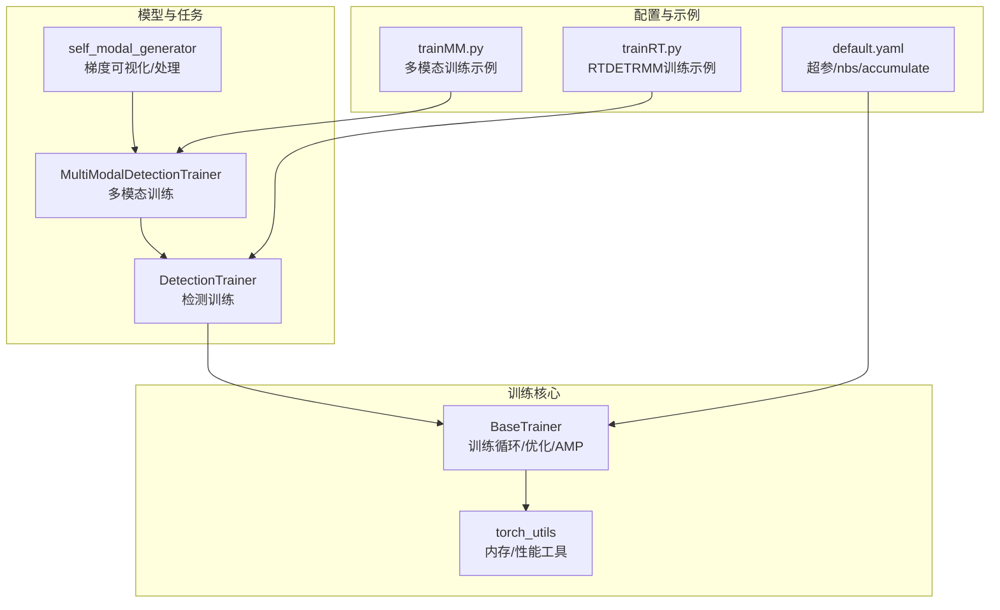
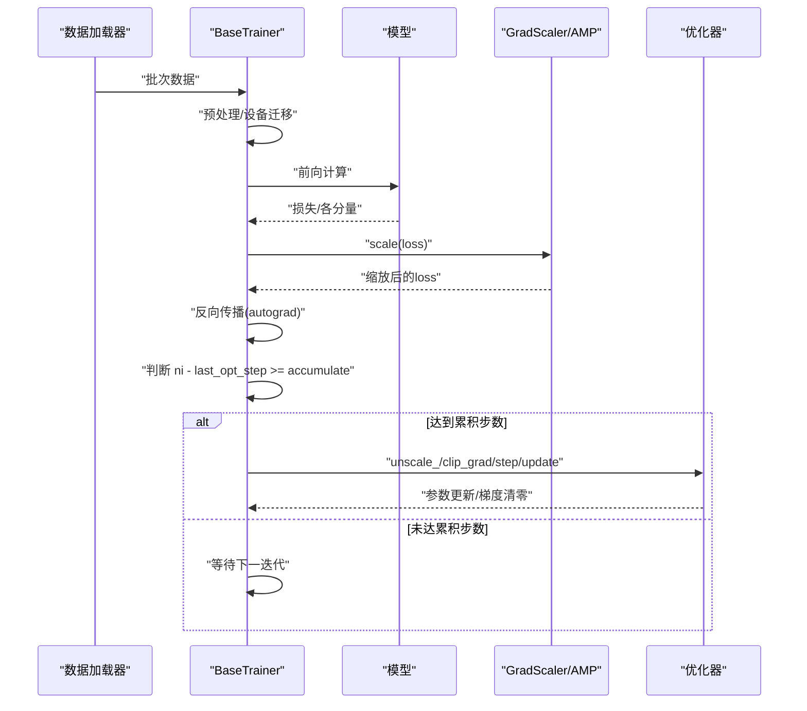
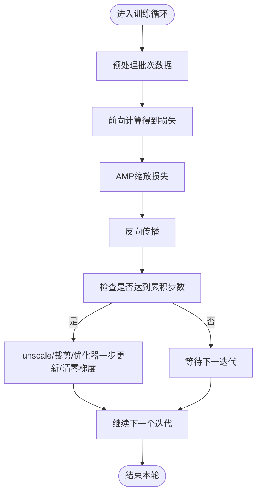
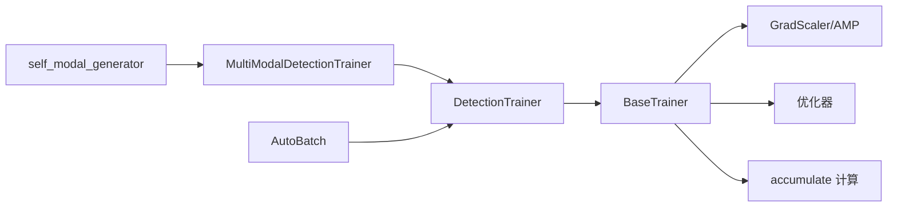

# 梯度累积

<cite>
**本文引用的文件**
- [ultralytics/engine/trainer.py](file://ultralytics/engine/trainer.py)
- [ultralytics/utils/torch_utils.py](file://ultralytics/utils/torch_utils.py)
- [ultralytics/models/yolo/multimodal/self_modal_generator.py](file://ultralytics/models/yolo/multimodal/self_modal_generator.py)
- [ultralytics/cfg/default.yaml](file://ultralytics/cfg/default.yaml)
- [ultralytics/models/yolo/detect/train.py](file://ultralytics/models/yolo/detect/train.py)
- [ultralytics/engine/model.py](file://ultralytics/engine/model.py)
- [trainMM.py](file://trainMM.py)
- [trainRT.py](file://trainRT.py)
</cite>

## 目录
1. [引言](#引言)
2. [项目结构](#项目结构)
3. [核心组件](#核心组件)
4. [架构总览](#架构总览)
5. [详细组件分析](#详细组件分析)
6. [依赖分析](#依赖分析)
7. [性能考量](#性能考量)
8. [故障排查指南](#故障排查指南)
9. [结论](#结论)
10. [附录](#附录)

## 引言
本技术文档围绕“梯度累积”展开，系统阐述其在显存受限场景下的作用机理、配置方法、实现细节、内存优化效果与性能影响评估，并给出学习率与累积步数的协同调整策略。文档结合代码库中的训练框架与多模态实现，提供可操作的实践建议与可视化流程，帮助读者在不牺牲训练稳定性的前提下最大化显存利用率。

## 项目结构
本仓库采用模块化组织，训练主干位于 engine 层，训练循环与优化器、混合精度、梯度累积等均在此实现；多模态相关在 models/yolo/multimodal 下；配置参数集中在 cfg/default.yaml；示例训练脚本位于根目录。

**图表来源**
- [ultralytics/engine/trainer.py](file://ultralytics/engine/trainer.py)
- [ultralytics/utils/torch_utils.py](file://ultralytics/utils/torch_utils.py)
- [ultralytics/models/yolo/detect/train.py](file://ultralytics/models/yolo/detect/train.py)
- [ultralytics/models/yolo/multimodal/self_modal_generator.py](file://ultralytics/models/yolo/multimodal/self_modal_generator.py)
- [ultralytics/cfg/default.yaml](file://ultralytics/cfg/default.yaml)
- [trainMM.py](file://trainMM.py)
- [trainRT.py](file://trainRT.py)

**章节来源**
- [ultralytics/engine/trainer.py](file://ultralytics/engine/trainer.py)
- [ultralytics/cfg/default.yaml](file://ultralytics/cfg/default.yaml)

## 核心组件
- 训练循环与梯度累积
  - 训练循环在每次前向后执行反向传播，随后根据累积步数决定是否执行优化器一步更新。
  - 混合精度配合 GradScaler 使用，提升吞吐同时降低显存占用。
- 累积步数计算
  - 累积步数 accumulate 由“名义批大小 nbs 与实际批大小 batch_size”的比值得出，并向上取整，保证有效批大小等于 nbs。
- 学习率与权重衰减
  - 权重衰减随 batch_size 与 accumulate 线性缩放，保持优化稳定性。
  - 学习率调度器按 epoch 或线性/余弦策略更新。
- 内存管理
  - 训练期间定期清理缓存与垃圾回收，防止碎片化与峰值溢出。
- 多模态与梯度处理
  - 多模态训练中可对梯度进行幅度/方向分析与阈值处理，辅助理解跨模态融合过程。

**章节来源**
- [ultralytics/engine/trainer.py](file://ultralytics/engine/trainer.py)
- [ultralytics/utils/torch_utils.py](file://ultralytics/utils/torch_utils.py)
- [ultralytics/models/yolo/multimodal/self_modal_generator.py](file://ultralytics/models/yolo/multimodal/self_modal_generator.py)

## 架构总览
下图展示了训练主循环中“前向—反向—累积—优化”的关键节点，以及 AMP 与累积步数的交互。

**图表来源**
- [ultralytics/engine/trainer.py](file://ultralytics/engine/trainer.py)

**章节来源**
- [ultralytics/engine/trainer.py](file://ultralytics/engine/trainer.py)

## 详细组件分析

### 组件A：训练循环与梯度累积
- 关键点
  - 每次迭代执行前向与反向，随后检查是否达到累积步数。
  - 达到累积步数时执行优化器一步更新，并重置计数器。
  - AMP 与 GradScaler 用于数值稳定与显存节省。
- 配置要点
  - nbs（名义批大小）与 batch（实际批大小）共同决定 accumulate。
  - 权重衰减按 batch_size 与 accumulate 线性缩放，保持优化器行为一致。
- 示例路径
  - 训练循环与累积条件判断：[ultralytics/engine/trainer.py](file://ultralytics/engine/trainer.py)
  - AMP/GradScaler 使用：[ultralytics/engine/trainer.py](file://ultralytics/engine/trainer.py)
  - 累积步数与权重衰减缩放：[ultralytics/engine/trainer.py](file://ultralytics/engine/trainer.py)

**图表来源**
- [ultralytics/engine/trainer.py](file://ultralytics/engine/trainer.py)

**章节来源**
- [ultralytics/engine/trainer.py](file://ultralytics/engine/trainer.py)

### 组件B：配置与有效批大小
- 有效批大小与累积步数
  - 有效批大小 = nbs，实际批大小 = batch，累积步数 = max(round(nbs/batch), 1)。
  - 通过增大 nbs 或减小 batch 可在显存受限时维持相同的有效批大小。
- 权重衰减缩放
  - weight_decay 与 batch_size、accumulate 成正比，确保优化器行为一致。
- 配置文件位置
  - nbs、lr0、momentum、weight_decay 等超参位于默认配置文件。
- 示例路径
  - 累积步数与权重衰减计算：[ultralytics/engine/trainer.py](file://ultralytics/engine/trainer.py)
  - 默认配置项：[ultralytics/cfg/default.yaml](file://ultralytics/cfg/default.yaml)

**章节来源**
- [ultralytics/engine/trainer.py](file://ultralytics/engine/trainer.py)
- [ultralytics/cfg/default.yaml](file://ultralytics/cfg/default.yaml)

### 组件C：学习率与累积步数的协同
- 学习率策略
  - 支持余弦退火与线性退火两种调度策略，按 epoch 更新。
- 与累积步数的关系
  - 累积步数增加会拉长“一次有效更新”的时间跨度，但不会改变学习率调度的周期性节奏。
  - 若学习率过高，累积步数增加可能放大梯度波动；应结合梯度裁剪与 AMP 使用。
- 示例路径
  - 学习率调度器初始化与更新：[ultralytics/engine/trainer.py](file://ultralytics/engine/trainer.py)

**章节来源**
- [ultralytics/engine/trainer.py](file://ultralytics/engine/trainer.py)

### 组件D：内存优化与性能影响
- 显存优化
  - AMP 与混合精度显著降低显存占用，适合大模型与多模态场景。
  - 梯度累积允许在较小 batch 下实现更大有效批大小，缓解显存压力。
- 性能影响
  - 增大累积步数会增加每步计算量，但减少优化器步数，整体吞吐取决于硬件与数据加载效率。
  - 建议结合 AutoBatch 与 warmup 策略，平衡显存与速度。
- 示例路径
  - AMP/GradScaler 使用与内存统计：[ultralytics/engine/trainer.py](file://ultralytics/engine/trainer.py)
  - 内存清理与缓存释放：[ultralytics/engine/trainer.py](file://ultralytics/engine/trainer.py)
  - AutoBatch 估算最优 batch：[ultralytics/models/yolo/detect/train.py](file://ultralytics/models/yolo/detect/train.py)

**章节来源**
- [ultralytics/engine/trainer.py](file://ultralytics/engine/trainer.py)
- [ultralytics/models/yolo/detect/train.py](file://ultralytics/models/yolo/detect/train.py)

### 组件E：多模态训练中的梯度处理
- 梯度幅度/方向分析
  - 对多模态输入的梯度进行幅度与方向计算，可辅助理解不同模态对损失的贡献。
  - 可设置阈值过滤弱梯度，减少噪声影响。
- 示例路径
  - 梯度幅度/方向计算与阈值处理：[ultralytics/models/yolo/multimodal/self_modal_generator.py](file://ultralytics/models/yolo/multimodal/self_modal_generator.py)

**章节来源**
- [ultralytics/models/yolo/multimodal/self_modal_generator.py](file://ultralytics/models/yolo/multimodal/self_modal_generator.py)

### 组件F：训练脚本示例与最佳实践
- 多模态训练示例
  - 使用 YOLOMM 训练接口，设置 data、epochs、batch 等参数。
- RTDETRMM 训练示例
  - 指定模型 YAML、数据集、设备、AMP 等，支持分批训练与显存回收。
- 示例路径
  - 多模态训练脚本：[trainMM.py](file://trainMM.py)
  - RTDETRMM 训练脚本：[trainRT.py](file://trainRT.py)

**章节来源**
- [trainMM.py](file://trainMM.py)
- [trainRT.py](file://trainRT.py)

## 依赖分析
- 训练主循环依赖 AMP/GradScaler 与优化器，AMP 与累积步数共同决定显存占用与数值稳定性。
- 多模态训练依赖数据集构建与路由配置，梯度处理模块提供额外的分析能力。
- AutoBatch 与 warmup 策略有助于在显存受限时稳定收敛。

**图表来源**
- [ultralytics/engine/trainer.py](file://ultralytics/engine/trainer.py)
- [ultralytics/models/yolo/detect/train.py](file://ultralytics/models/yolo/detect/train.py)
- [ultralytics/models/yolo/multimodal/self_modal_generator.py](file://ultralytics/models/yolo/multimodal/self_modal_generator.py)

**章节来源**
- [ultralytics/engine/trainer.py](file://ultralytics/engine/trainer.py)
- [ultralytics/models/yolo/detect/train.py](file://ultralytics/models/yolo/detect/train.py)

## 性能考量
- 显存与吞吐权衡
  - 增大累积步数可提升有效批大小，但会增加单步计算时间；需结合硬件能力与数据加载瓶颈综合评估。
- AMP 与梯度裁剪
  - AMP 与 unscale/clip_grad 结合使用，既能节省显存又能抑制梯度爆炸风险。
- AutoBatch 与 warmup
  - AutoBatch 估算最优 batch，warmup 平滑学习率与梯度，有助于稳定前期训练。
- 多模态输入
  - 多模态输入通道增加会提升显存占用，建议结合 AMP 与合理累积步数控制峰值显存。

[本节为通用指导，无需引用具体文件]

## 故障排查指南
- 显存不足（OOM）
  - 降低 batch 或增大 nbs，提高 accumulate；启用 AMP；在验证/评估间清理缓存。
- 训练不稳定/发散
  - 减小学习率或延长 warmup；启用梯度裁剪；检查累积步数是否过大导致梯度波动。
- 梯度异常（NaN/Inf）
  - 检查 AMP 与 unscale 流程；确认累积步数与学习率匹配；必要时降低学习率或增加裁剪阈值。
- 多模态训练异常
  - 检查 X 模态通道数与数据路径配置；确认路由与融合模块输入形状一致。

**章节来源**
- [ultralytics/engine/trainer.py](file://ultralytics/engine/trainer.py)
- [ultralytics/utils/torch_utils.py](file://ultralytics/utils/torch_utils.py)

## 结论
梯度累积是显存受限场景下的关键优化手段。通过合理设置 nbs 与 batch，结合 AMP、梯度裁剪与学习率调度，可在不牺牲收敛质量的前提下显著提升显存利用率。多模态训练中，配合梯度幅度/方向分析可进一步洞察跨模态融合效果。建议在实践中以 AutoBatch 与 warmup 为基础，逐步调整累积步数与学习率，获得最佳的稳定性与性能平衡。

[本节为总结性内容，无需引用具体文件]

## 附录
- 关键实现路径索引
  - 训练循环与累积步数：[ultralytics/engine/trainer.py](file://ultralytics/engine/trainer.py)
  - AMP/GradScaler 使用：[ultralytics/engine/trainer.py](file://ultralytics/engine/trainer.py)
  - 默认配置（nbs/lr0/weight_decay 等）：[ultralytics/cfg/default.yaml](file://ultralytics/cfg/default.yaml)
  - AutoBatch 估算：[ultralytics/models/yolo/detect/train.py](file://ultralytics/models/yolo/detect/train.py)
  - 多模态梯度处理：[ultralytics/models/yolo/multimodal/self_modal_generator.py](file://ultralytics/models/yolo/multimodal/self_modal_generator.py)
  - 多模态训练脚本示例：[trainMM.py](file://trainMM.py)
  - RTDETRMM 训练脚本示例：[trainRT.py](file://trainRT.py)

[本节为补充信息，无需引用具体文件]