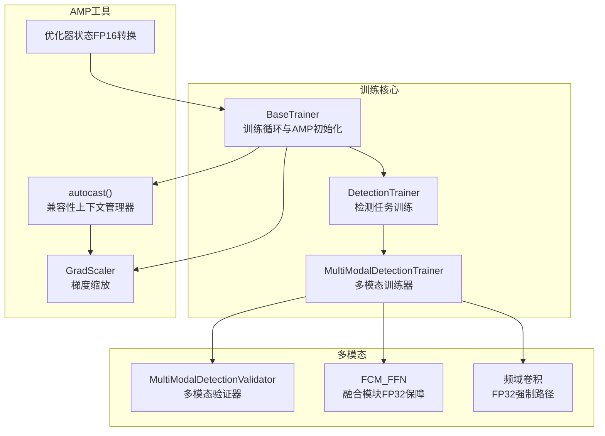
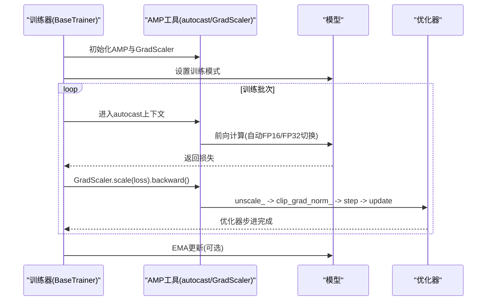
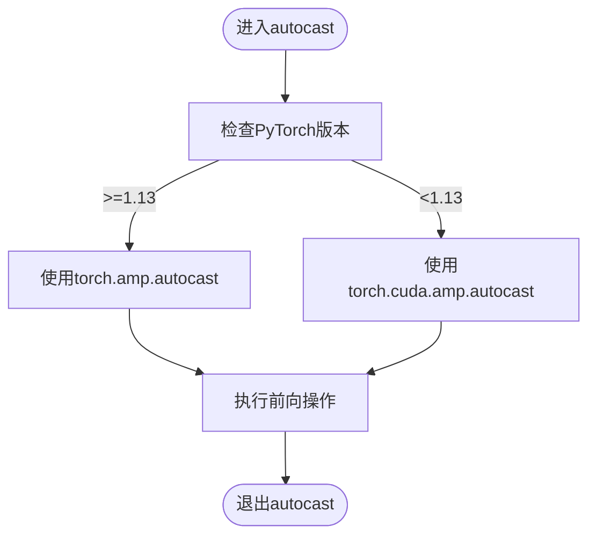
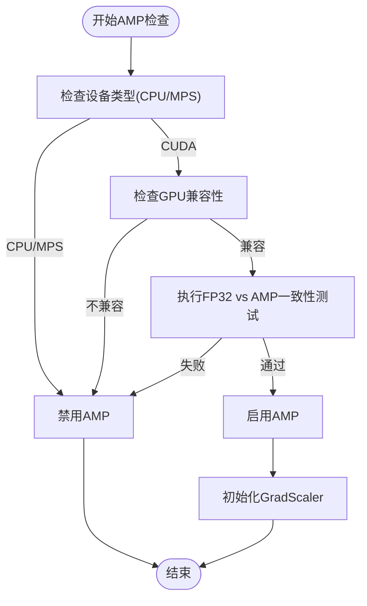
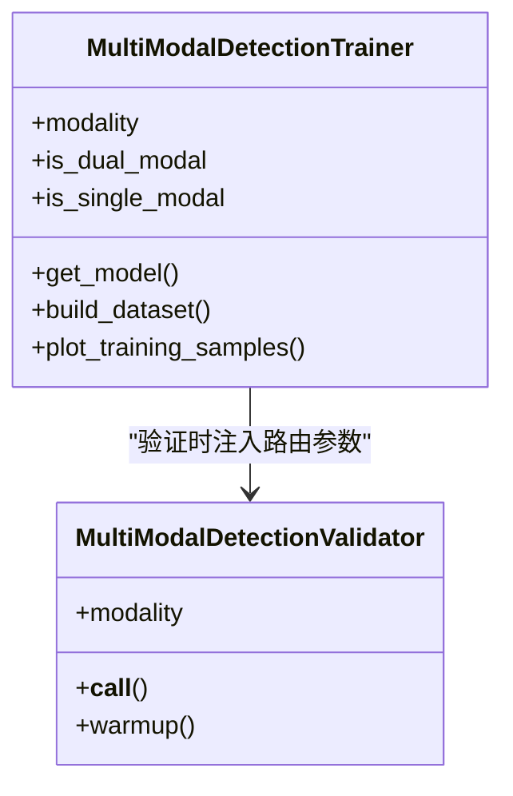
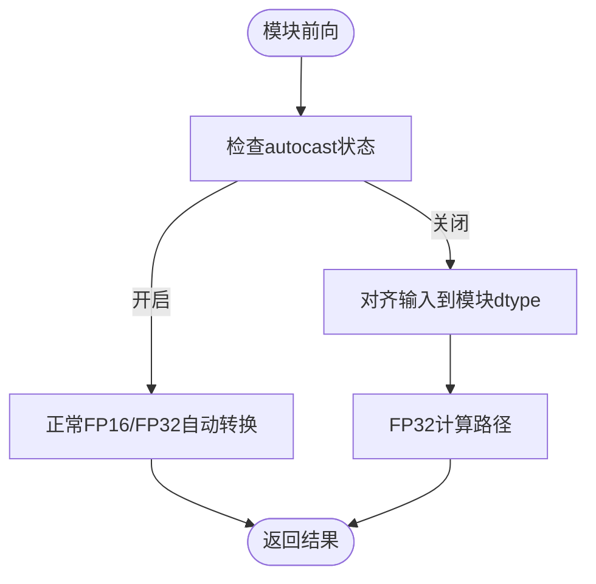
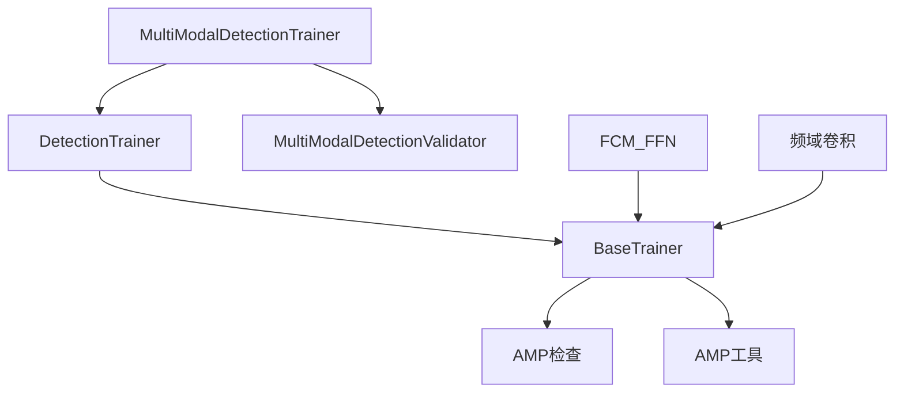

# 混合精度训练

<cite>
**本文档引用的文件**
- [ultralytics/engine/trainer.py](file://ultralytics/engine/trainer.py)
- [ultralytics/utils/torch_utils.py](file://ultralytics/utils/torch_utils.py)
- [ultralytics/utils/checks.py](file://ultralytics/utils/checks.py)
- [ultralytics/models/yolo/multimodal/train.py](file://ultralytics/models/yolo/multimodal/train.py)
- [ultralytics/models/yolo/multimodal/val.py](file://ultralytics/models/yolo/multimodal/val.py)
- [ultralytics/nn/modules/fusion/FCM_FFN.py](file://ultralytics/nn/modules/fusion/FCM_FFN.py)
- [ultralytics/nn/modules/conv.py](file://ultralytics/nn/modules/conv.py)
- [trainMM.py](file://trainMM.py)
</cite>

## 目录
1. [简介](#简介)
2. [项目结构](#项目结构)
3. [核心组件](#核心组件)
4. [架构概览](#架构概览)
5. [详细组件分析](#详细组件分析)
6. [依赖分析](#依赖分析)
7. [性能考虑](#性能考虑)
8. [故障排除指南](#故障排除指南)
9. [结论](#结论)
10. [附录](#附录)

## 简介
本指南深入讲解混合精度训练（AMP，Automatic Mixed Precision）在多模态视觉任务中的实现与最佳实践。内容涵盖：
- AMP 工作原理与 PyTorch 自动混合精度 API 的兼容性处理
- autocast 上下文管理器的使用与精度切换机制
- FP16 与 FP32 的自动转换策略及稳定性保障
- 梯度缩放（GradScaler）的必要性与实现细节
- 多模态训练场景下的 AMP 配置与使用示例
- 性能提升效果分析与最佳实践建议

## 项目结构
该项目围绕 Ultralytics YOLO 框架扩展了多模态训练能力，AMP 相关的核心实现集中在以下模块：
- 训练主流程：BaseTrainer 及 DetectionTrainer 的 AMP 初始化与训练循环
- AMP 工具：autocast 兼容性封装、GradScaler 初始化、优化器状态 FP16 转换
- 多模态训练：MultiModalDetectionTrainer 的多模态数据流与路由
- 稳定性保障：特定模块（如频域卷积、特征融合模块）的 FP32 强制路径
- 验证流程：MultiModalDetectionValidator 的 FP16 推理与 warmup



**图表来源**
- [ultralytics/engine/trainer.py](file://ultralytics/engine/trainer.py)
- [ultralytics/utils/torch_utils.py](file://ultralytics/utils/torch_utils.py)
- [ultralytics/models/yolo/multimodal/train.py](file://ultralytics/models/yolo/multimodal/train.py)
- [ultralytics/models/yolo/multimodal/val.py](file://ultralytics/models/yolo/multimodal/val.py)
- [ultralytics/nn/modules/fusion/FCM_FFN.py](file://ultralytics/nn/modules/fusion/FCM_FFN.py)
- [ultralytics/nn/modules/conv.py](file://ultralytics/nn/modules/conv.py)

**章节来源**
- [ultralytics/engine/trainer.py](file://ultralytics/engine/trainer.py)
- [ultralytics/utils/torch_utils.py](file://ultralytics/utils/torch_utils.py)
- [ultralytics/models/yolo/multimodal/train.py](file://ultralytics/models/yolo/multimodal/train.py)
- [ultralytics/models/yolo/multimodal/val.py](file://ultralytics/models/yolo/multimodal/val.py)
- [ultralytics/nn/modules/fusion/FCM_FFN.py](file://ultralytics/nn/modules/fusion/FCM_FFN.py)
- [ultralytics/nn/modules/conv.py](file://ultralytics/nn/modules/conv.py)

## 核心组件
- AMP 上下文管理器：根据 PyTorch 版本选择 torch.amp.autocast 或 torch.cuda.amp.autocast，确保跨版本兼容
- GradScaler：在 FP16 训练中缩放损失，防止梯度下溢
- 优化器状态 FP16 转换：将优化器状态从 FP32 转为 FP16，降低显存占用
- 多模态训练器：支持单模态/双模态路由，动态通道数，对比学习增强
- 稳定性保障：在易受精度影响的模块中强制使用 FP32，或在 autocast 外围执行关键运算

**章节来源**
- [ultralytics/utils/torch_utils.py](file://ultralytics/utils/torch_utils.py)
- [ultralytics/engine/trainer.py](file://ultralytics/engine/trainer.py)
- [ultralytics/models/yolo/multimodal/train.py](file://ultralytics/models/yolo/multimodal/train.py)
- [ultralytics/nn/modules/fusion/FCM_FFN.py](file://ultralytics/nn/modules/fusion/FCM_FFN.py)
- [ultralytics/nn/modules/conv.py](file://ultralytics/nn/modules/conv.py)

## 架构概览
AMP 在训练循环中的关键位置如下：
- AMP 检查与初始化：在训练开始前检测设备与 GPU 兼容性，决定是否启用 AMP，并初始化 GradScaler
- 前向传播：在 autocast 上下文中执行前向，自动在 FP16 和 FP32 间切换
- 反向传播：使用 GradScaler 缩放损失，反向传播后进行梯度裁剪与优化器步进
- 验证阶段：在训练态验证时强制 FP16 推理，确保与训练一致的内存占用



**图表来源**
- [ultralytics/engine/trainer.py](file://ultralytics/engine/trainer.py)
- [ultralytics/utils/torch_utils.py](file://ultralytics/utils/torch_utils.py)

**章节来源**
- [ultralytics/engine/trainer.py](file://ultralytics/engine/trainer.py)
- [ultralytics/utils/torch_utils.py](file://ultralytics/utils/torch_utils.py)

## 详细组件分析

### AMP 上下文管理器与兼容性
- 版本兼容：根据 PyTorch 版本选择 torch.amp.autocast 或 torch.cuda.amp.autocast
- 设备选择：仅在 CUDA 设备上启用 autocast，CPU/MPS 不启用
- 自动类型转换：在 autocast 内部，算子根据输入类型自动选择 FP16 或 FP32



**图表来源**
- [ultralytics/utils/torch_utils.py](file://ultralytics/utils/torch_utils.py)

**章节来源**
- [ultralytics/utils/torch_utils.py](file://ultralytics/utils/torch_utils.py)

### AMP 检查与初始化
- 设备与 GPU 兼容性检查：排除部分低端或特定型号 GPU，避免 NaN 或零 mAP
- 自动一致性检查：比较 FP32 与 AMP 推理结果，确保数值稳定性
- AMP 启用决策：根据检查结果与用户配置决定是否启用 AMP
- GradScaler 初始化：在 AMP 启用时创建 GradScaler，否则禁用



**图表来源**
- [ultralytics/utils/checks.py](file://ultralytics/utils/checks.py)
- [ultralytics/engine/trainer.py](file://ultralytics/engine/trainer.py)

**章节来源**
- [ultralytics/utils/checks.py](file://ultralytics/utils/checks.py)
- [ultralytics/engine/trainer.py](file://ultralytics/engine/trainer.py)

### 训练循环中的 AMP 使用
- autocast 包裹前向：在每个批次前向中使用 autocast，自动在 FP16/FP32 间切换
- 梯度缩放与反向：使用 GradScaler 缩放损失，反向传播后 unscale、梯度裁剪、优化器步进
- 优化器状态 FP16：保存检查点时将优化器状态转换为 FP16，减少存储与传输开销

```mermaid
sequenceDiagram
participant Loop as "训练循环"
participant AC as "autocast"
participant MS as "模型"
participant GS as "GradScaler"
participant OP as "优化器"
Loop->>AC : with autocast(enabled=amp)
AC->>MS : 前向计算
MS-->>Loop : 损失
Loop->>GS : scale(loss).backward()
GS->>OP : unscale_ -> clip_grad_norm_ -> step -> update
OP-->>Loop : 完成一步
```

**图表来源**
- [ultralytics/engine/trainer.py](file://ultralytics/engine/trainer.py)

**章节来源**
- [ultralytics/engine/trainer.py](file://ultralytics/engine/trainer.py)

### 多模态训练中的 AMP 配置
- 单模态/双模态路由：根据 modality 参数或数据配置决定输入通道数与路由策略
- 模态消融：支持仅使用 RGB 或仅使用 X 模态的训练，动态调整输入通道
- 验证阶段 FP16：在训练态验证时强制半精度推理，确保内存占用一致



**图表来源**
- [ultralytics/models/yolo/multimodal/train.py](file://ultralytics/models/yolo/multimodal/train.py)
- [ultralytics/models/yolo/multimodal/val.py](file://ultralytics/models/yolo/multimodal/val.py)

**章节来源**
- [ultralytics/models/yolo/multimodal/train.py](file://ultralytics/models/yolo/multimodal/train.py)
- [ultralytics/models/yolo/multimodal/val.py](file://ultralytics/models/yolo/multimodal/val.py)

### 稳定性保障：FP32 强制路径
- 特征融合模块：在 AMP 下保持参数为 FP32，避免数值不稳定
- 频域卷积：在 CUDA、FP16/BF16 时强制关闭 autocast，使用 FP32 计算 FFT，再转回原精度
- 输入对齐：当 autocast 关闭且输入与模块 dtype 不一致时，手动对齐到模块 dtype



**图表来源**
- [ultralytics/nn/modules/fusion/FCM_FFN.py](file://ultralytics/nn/modules/fusion/FCM_FFN.py)
- [ultralytics/nn/modules/conv.py](file://ultralytics/nn/modules/conv.py)

**章节来源**
- [ultralytics/nn/modules/fusion/FCM_FFN.py](file://ultralytics/nn/modules/fusion/FCM_FFN.py)
- [ultralytics/nn/modules/conv.py](file://ultralytics/nn/modules/conv.py)

### 多模态训练示例
- 使用 YOLOMM 训练器进行多模态检测训练，支持单模态/双模态配置
- 示例脚本展示了如何指定数据集、轮数、批大小与项目/实验名

**章节来源**
- [trainMM.py](file://trainMM.py)

## 依赖分析
- BaseTrainer 依赖 AMP 工具与检查模块，负责 AMP 初始化与训练循环
- MultiModalDetectionTrainer 依赖 DetectionTrainer 与多模态数据集构建，扩展路由与可视化
- 稳定性模块（FCM_FFN、频域卷积）在 AMP 下提供 FP32 保障路径
- 验证器在训练态验证时强制半精度推理，确保与训练一致



**图表来源**
- [ultralytics/engine/trainer.py](file://ultralytics/engine/trainer.py)
- [ultralytics/utils/checks.py](file://ultralytics/utils/checks.py)
- [ultralytics/utils/torch_utils.py](file://ultralytics/utils/torch_utils.py)
- [ultralytics/models/yolo/multimodal/train.py](file://ultralytics/models/yolo/multimodal/train.py)
- [ultralytics/models/yolo/multimodal/val.py](file://ultralytics/models/yolo/multimodal/val.py)
- [ultralytics/nn/modules/fusion/FCM_FFN.py](file://ultralytics/nn/modules/fusion/FCM_FFN.py)
- [ultralytics/nn/modules/conv.py](file://ultralytics/nn/modules/conv.py)

**章节来源**
- [ultralytics/engine/trainer.py](file://ultralytics/engine/trainer.py)
- [ultralytics/utils/checks.py](file://ultralytics/utils/checks.py)
- [ultralytics/utils/torch_utils.py](file://ultralytics/utils/torch_utils.py)
- [ultralytics/models/yolo/multimodal/train.py](file://ultralytics/models/yolo/multimodal/train.py)
- [ultralytics/models/yolo/multimodal/val.py](file://ultralytics/models/yolo/multimodal/val.py)
- [ultralytics/nn/modules/fusion/FCM_FFN.py](file://ultralytics/nn/modules/fusion/FCM_FFN.py)
- [ultralytics/nn/modules/conv.py](file://ultralytics/nn/modules/conv.py)

## 性能考虑
- 显存占用：AMP 在 CUDA 上显著降低显存占用，结合优化器状态 FP16 转换进一步节省
- 计算效率：FP16 在现代 GPU 上通常更快，但需注意某些算子（如 FFT）在 FP16 下的稳定性
- 梯度缩放：防止小梯度在 FP16 下下溢，提高训练稳定性
- 多模态输入：动态通道数与路由策略在保证精度的同时提升训练灵活性

[本节为通用指导，无需引用具体文件]

## 故障排除指南
- AMP 启用失败：检查设备类型与 GPU 兼容性，参考 AMP 检查逻辑
- NaN 损失或零 mAP：确认 AMP 检查通过，必要时禁用 AMP 或调整模型/数据
- 梯度异常：检查 GradScaler 使用是否正确，确保每步都执行 unscale、裁剪与 update
- 多模态推理不一致：在训练态验证时强制半精度推理，确保 warmup 与输入通道数匹配

**章节来源**
- [ultralytics/utils/checks.py](file://ultralytics/utils/checks.py)
- [ultralytics/engine/trainer.py](file://ultralytics/engine/trainer.py)
- [ultralytics/models/yolo/multimodal/val.py](file://ultralytics/models/yolo/multimodal/val.py)

## 结论
本项目在 Ultralytics 框架基础上完善了多模态训练的 AMP 实现，通过版本兼容的 autocast、GradScaler 的正确使用、以及关键模块的 FP32 保障路径，实现了在多模态场景下的高效与稳定训练。配合多模态路由与可视化，开发者可以灵活地进行单模态/双模态训练，并获得显著的性能收益。

[本节为总结性内容，无需引用具体文件]

## 附录
- AMP 配置建议：优先启用 AMP，结合 GradScaler 与优化器状态 FP16 转换；对易受精度影响的模块采用 FP32 强制路径
- 多模态最佳实践：合理设置输入通道数与路由策略，确保验证阶段与训练阶段的精度一致

[本节为通用指导，无需引用具体文件]