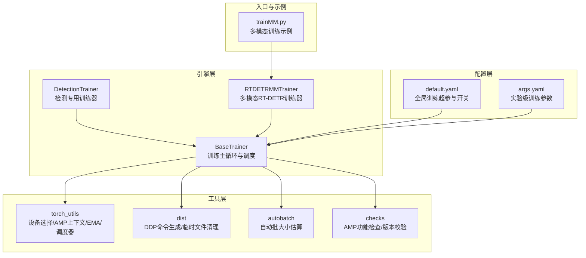
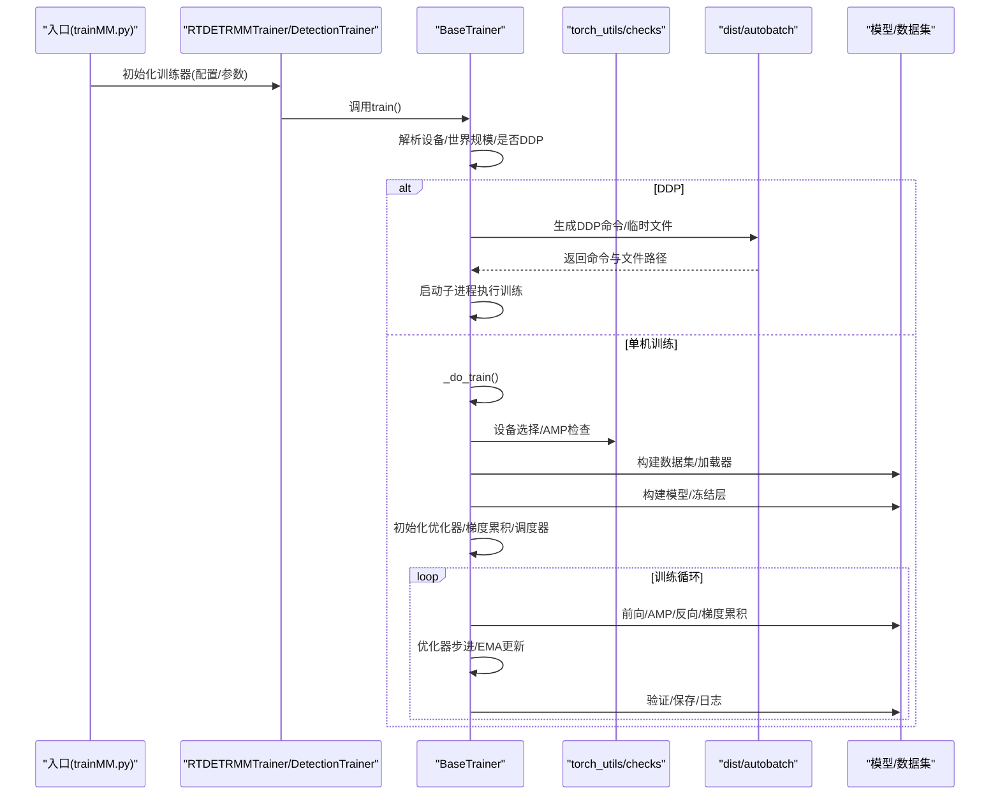
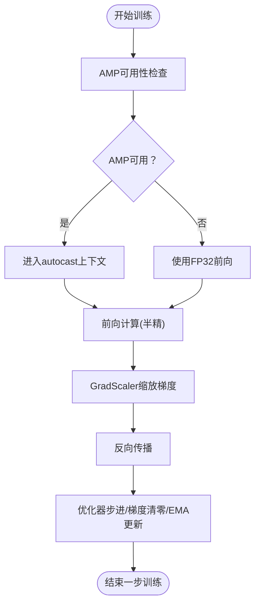
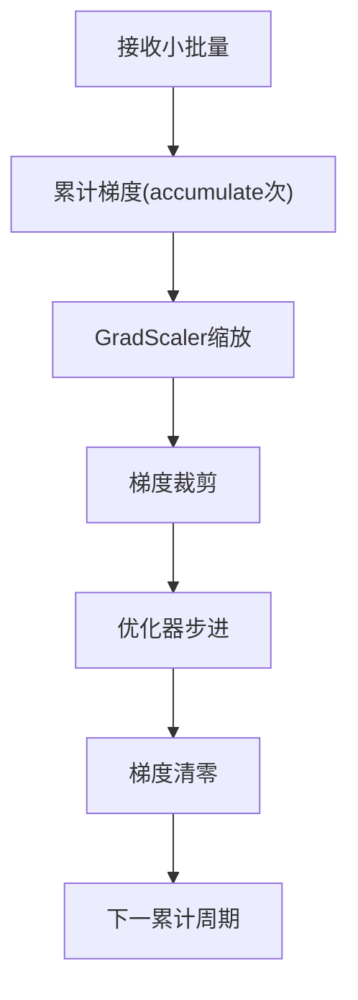
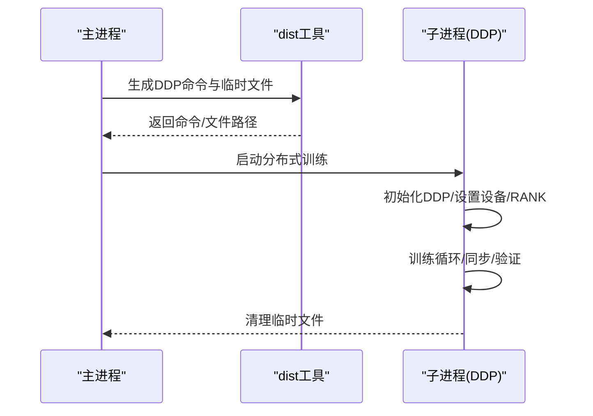
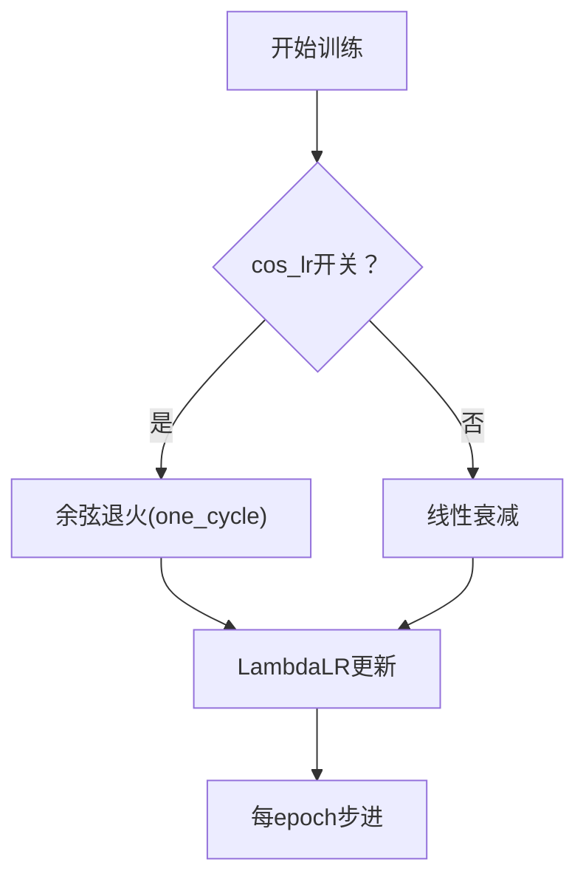
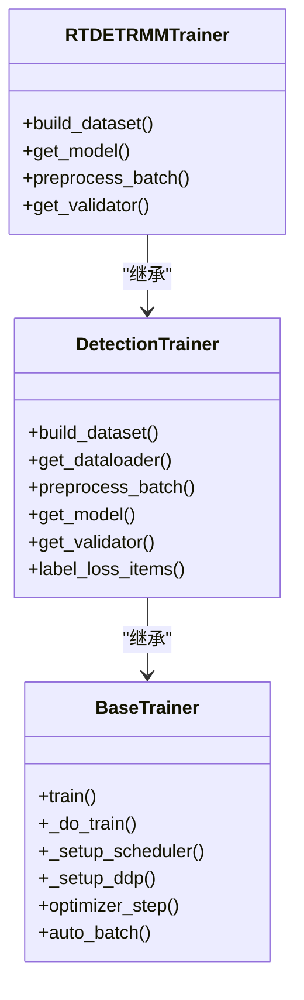

# 训练优化技术

<cite>
**本文引用的文件**
- [ultralytics/engine/trainer.py](file://ultralytics/engine/trainer.py)
- [ultralytics/utils/torch_utils.py](file://ultralytics/utils/torch_utils.py)
- [ultralytics/utils/dist.py](file://ultralytics/utils/dist.py)
- [ultralytics/utils/autobatch.py](file://ultralytics/utils/autobatch.py)
- [ultralytics/utils/checks.py](file://ultralytics/utils/checks.py)
- [ultralytics/cfg/default.yaml](file://ultralytics/cfg/default.yaml)
- [ultralytics/models/yolo/detect/train.py](file://ultralytics/models/yolo/detect/train.py)
- [ultralytics/models/rtdetrmm/train.py](file://ultralytics/models/rtdetrmm/train.py)
- [trainMM.py](file://trainMM.py)
- [ResTest/aifi-dattention-CSP-MutilScaleEdgeInformationEnhance-ASF-P2-lite-BackboneFreqFusion3/args.yaml](file://ResTest/aifi-dattention-CSP-MutilScaleEdgeInformationEnhance-ASF-P2-lite-BackboneFreqFusion3/args.yaml)
</cite>

## 目录
1. [简介](#简介)
2. [项目结构](#项目结构)
3. [核心组件](#核心组件)
4. [架构总览](#架构总览)
5. [详细组件分析](#详细组件分析)
6. [依赖分析](#依赖分析)
7. [性能考虑](#性能考虑)
8. [故障排查指南](#故障排查指南)
9. [结论](#结论)
10. [附录](#附录)

## 简介
本指南围绕多模态检测系统的训练优化技术展开，结合代码库中的实现细节，系统讲解以下主题：
- 混合精度训练（AMP）的原理与配置
- 梯度累积策略与有效批量大小提升
- 分布式训练（DDP）的配置与优化
- 学习率调度策略（余弦退火、阶梯衰减等）
- 模型并行与数据并行的区别与适用场景
- 训练加速最佳实践（预处理、数据加载等）
- 具体配置参数说明与示例路径

## 项目结构
该仓库采用模块化组织方式，训练流程主要由引擎层（engine）、工具层（utils）、模型层（models）协同完成。多模态检测训练入口位于多模态训练器与默认配置文件中。

图示来源
- [ultralytics/engine/trainer.py:191-348](file://ultralytics/engine/trainer.py#L191-L348)
- [ultralytics/models/yolo/detect/train.py:21-52](file://ultralytics/models/yolo/detect/train.py#L21-L52)
- [ultralytics/models/rtdetrmm/train.py:24-60](file://ultralytics/models/rtdetrmm/train.py#L24-L60)
- [ultralytics/utils/torch_utils.py:77-104](file://ultralytics/utils/torch_utils.py#L77-L104)
- [ultralytics/utils/dist.py:79-99](file://ultralytics/utils/dist.py#L79-L99)
- [ultralytics/utils/autobatch.py:15-43](file://ultralytics/utils/autobatch.py#L15-L43)
- [ultralytics/utils/checks.py:727-800](file://ultralytics/utils/checks.py#L727-L800)
- [ultralytics/cfg/default.yaml:1-168](file://ultralytics/cfg/default.yaml#L1-L168)
- [trainMM.py:1-15](file://trainMM.py#L1-L15)

章节来源
- [ultralytics/engine/trainer.py:191-348](file://ultralytics/engine/trainer.py#L191-L348)
- [ultralytics/models/yolo/detect/train.py:21-52](file://ultralytics/models/yolo/detect/train.py#L21-L52)
- [ultralytics/models/rtdetrmm/train.py:24-60](file://ultralytics/models/rtdetrmm/train.py#L24-L60)
- [ultralytics/utils/torch_utils.py:77-104](file://ultralytics/utils/torch_utils.py#L77-L104)
- [ultralytics/utils/dist.py:79-99](file://ultralytics/utils/dist.py#L79-L99)
- [ultralytics/utils/autobatch.py:15-43](file://ultralytics/utils/autobatch.py#L15-L43)
- [ultralytics/utils/checks.py:727-800](file://ultralytics/utils/checks.py#L727-L800)
- [ultralytics/cfg/default.yaml:1-168](file://ultralytics/cfg/default.yaml#L1-L168)
- [trainMM.py:1-15](file://trainMM.py#L1-L15)

## 核心组件
- 训练主循环与调度：BaseTrainer 提供训练主循环、验证、早停、断点续训、学习率调度、梯度累积、AMP、DDP 初始化等能力。
- 设备与AMP：torch_utils 提供设备选择、autocast 上下文、EMA、one_cycle 调度器等；checks 提供 AMP 功能检查。
- 自动批大小：autobatch 基于内存占用曲线拟合自动确定最优批大小。
- 分布式训练：dist 提供 DDP 命令生成与临时文件清理。
- 检测专用训练器：DetectionTrainer 定义检测任务的数据集构建、数据加载、预处理、损失命名等。
- 多模态RT-DETR训练器：RTDETRMMTrainer 支持RGB+X双模态与单模态消融训练，集成多模态数据集与通道数配置。

章节来源
- [ultralytics/engine/trainer.py:59-177](file://ultralytics/engine/trainer.py#L59-L177)
- [ultralytics/utils/torch_utils.py:77-104](file://ultralytics/utils/torch_utils.py#L77-L104)
- [ultralytics/utils/checks.py:727-800](file://ultralytics/utils/checks.py#L727-L800)
- [ultralytics/utils/autobatch.py:15-43](file://ultralytics/utils/autobatch.py#L15-L43)
- [ultralytics/utils/dist.py:79-99](file://ultralytics/utils/dist.py#L79-L99)
- [ultralytics/models/yolo/detect/train.py:21-52](file://ultralytics/models/yolo/detect/train.py#L21-L52)
- [ultralytics/models/rtdetrmm/train.py:24-60](file://ultralytics/models/rtdetrmm/train.py#L24-L60)

## 架构总览
训练流程自上而下分为：入口调用 → 训练器初始化 → 数据准备 → 模型构建 → AMP/梯度累积/优化器/调度器 → 训练主循环 → 验证与保存 → 结束清理。

图示来源
- [trainMM.py:1-15](file://trainMM.py#L1-L15)
- [ultralytics/engine/trainer.py:191-348](file://ultralytics/engine/trainer.py#L191-L348)
- [ultralytics/utils/dist.py:79-99](file://ultralytics/utils/dist.py#L79-L99)
- [ultralytics/utils/torch_utils.py:131-252](file://ultralytics/utils/torch_utils.py#L131-L252)
- [ultralytics/utils/checks.py:727-800](file://ultralytics/utils/checks.py#L727-L800)
- [ultralytics/utils/autobatch.py:15-43](file://ultralytics/utils/autobatch.py#L15-L43)

## 详细组件分析

### 混合精度训练（AMP）实现与配置
- 原理与上下文管理
  - 使用 autocast 上下文在前向计算中自动切换至半精度，降低显存占用并提升吞吐。
  - 在反向传播阶段使用 GradScaler 缩放梯度，防止数值下溢。
- 配置与检查
  - 默认启用 AMP，可通过配置项控制；系统会进行 AMP 功能检查，排除部分GPU异常情况。
  - DDP场景下，AMP布尔值会在进程间广播，保证一致性。
- 关键实现位置
  - AMP上下文：[autocast:77-104](file://ultralytics/utils/torch_utils.py#L77-L104)
  - GradScaler初始化与使用：[GradScaler初始化:290-294](file://ultralytics/engine/trainer.py#L290-L294)，[反向与优化:414-420](file://ultralytics/engine/trainer.py#L414-L420)
  - AMP检查：[AMP检查函数:727-800](file://ultralytics/utils/checks.py#L727-L800)
  - 默认AMP开关：[default.yaml](file://ultralytics/cfg/default.yaml#L37)

图示来源
- [ultralytics/utils/torch_utils.py:77-104](file://ultralytics/utils/torch_utils.py#L77-L104)
- [ultralytics/engine/trainer.py:290-294](file://ultralytics/engine/trainer.py#L290-L294)
- [ultralytics/engine/trainer.py:414-420](file://ultralytics/engine/trainer.py#L414-L420)
- [ultralytics/utils/checks.py:727-800](file://ultralytics/utils/checks.py#L727-L800)

章节来源
- [ultralytics/utils/torch_utils.py:77-104](file://ultralytics/utils/torch_utils.py#L77-L104)
- [ultralytics/engine/trainer.py:290-294](file://ultralytics/engine/trainer.py#L290-L294)
- [ultralytics/engine/trainer.py:414-420](file://ultralytics/engine/trainer.py#L414-L420)
- [ultralytics/utils/checks.py:727-800](file://ultralytics/utils/checks.py#L727-L800)
- [ultralytics/cfg/default.yaml](file://ultralytics/cfg/default.yaml#L37)

### 梯度累积策略与有效批量大小
- 梯度累积机制
  - 通过 accumulate 参数控制每n次小批量累计后再执行一次优化器步进，从而在有限显存下模拟更大批量。
  - 学习率与权重衰减会按有效批量进行缩放，保持训练稳定性与收敛速度。
- 有效批量与显存
  - 自动批大小估算基于不同批大小下的显存占用曲线拟合，推荐在单卡显存上限附近选择批大小。
- 关键实现位置
  - 梯度累积与权重衰减缩放：[accumulate与weight_decay缩放:325-336](file://ultralytics/engine/trainer.py#L325-L336)
  - 优化器步进与梯度裁剪：[optimizer_step:657-666](file://ultralytics/engine/trainer.py#L657-L666)
  - 自动批大小估算：[check_train_batch_size/autobatch:15-43](file://ultralytics/utils/autobatch.py#L15-L43)

图示来源
- [ultralytics/engine/trainer.py:325-336](file://ultralytics/engine/trainer.py#L325-L336)
- [ultralytics/engine/trainer.py:657-666](file://ultralytics/engine/trainer.py#L657-L666)
- [ultralytics/utils/autobatch.py:15-43](file://ultralytics/utils/autobatch.py#L15-L43)

章节来源
- [ultralytics/engine/trainer.py:325-336](file://ultralytics/engine/trainer.py#L325-L336)
- [ultralytics/engine/trainer.py:657-666](file://ultralytics/engine/trainer.py#L657-L666)
- [ultralytics/utils/autobatch.py:15-43](file://ultralytics/utils/autobatch.py#L15-L43)

### 分布式训练（DDP）配置与优化
- 训练启动与子进程
  - 当检测到多GPU或显式指定多设备时，BaseTrainer 会生成 DDP 命令并通过子进程执行训练，避免主线程阻塞。
- DDP初始化与同步
  - 根据RANK设置设备，初始化进程组（NCCL优先，否则Gloo），设置阻塞等待超时，保证通信稳定。
- 关键实现位置
  - DDP启动与命令生成：[train/DDP启动:191-227](file://ultralytics/engine/trainer.py#L191-L227)，[generate_ddp_command:79-99](file://ultralytics/utils/dist.py#L79-L99)
  - DDP初始化：[_setup_ddp:237-248](file://ultralytics/engine/trainer.py#L237-L248)
  - 临时文件清理：[ddp_cleanup:102-120](file://ultralytics/utils/dist.py#L102-L120)

图示来源
- [ultralytics/engine/trainer.py:191-227](file://ultralytics/engine/trainer.py#L191-L227)
- [ultralytics/utils/dist.py:79-99](file://ultralytics/utils/dist.py#L79-L99)
- [ultralytics/utils/dist.py:102-120](file://ultralytics/utils/dist.py#L102-L120)

章节来源
- [ultralytics/engine/trainer.py:191-227](file://ultralytics/engine/trainer.py#L191-L227)
- [ultralytics/utils/dist.py:79-99](file://ultralytics/utils/dist.py#L79-L99)
- [ultralytics/utils/dist.py:102-120](file://ultralytics/utils/dist.py#L102-L120)

### 学习率调度策略
- 余弦退火（cos_lr）
  - 使用 one_cycle 生成余弦上升/下降的学习率曲线，适合长程训练与稳定收敛。
- 阶梯衰减（线性）
  - 默认线性衰减策略，按epoch比例线性降低至最终学习率。
- 关键实现位置
  - 调度器初始化：[_setup_scheduler:229-236](file://ultralytics/engine/trainer.py#L229-L236)
  - one_cycle函数：[one_cycle:658-671](file://ultralytics/utils/torch_utils.py#L658-L671)
  - 超参开关：[default.yaml cos_lr/lrf:34-96](file://ultralytics/cfg/default.yaml#L34-L96)

图示来源
- [ultralytics/engine/trainer.py:229-236](file://ultralytics/engine/trainer.py#L229-L236)
- [ultralytics/utils/torch_utils.py:658-671](file://ultralytics/utils/torch_utils.py#L658-L671)
- [ultralytics/cfg/default.yaml:34-96](file://ultralytics/cfg/default.yaml#L34-L96)

章节来源
- [ultralytics/engine/trainer.py:229-236](file://ultralytics/engine/trainer.py#L229-L236)
- [ultralytics/utils/torch_utils.py:658-671](file://ultralytics/utils/torch_utils.py#L658-L671)
- [ultralytics/cfg/default.yaml:34-96](file://ultralytics/cfg/default.yaml#L34-L96)

### 模型并行与数据并行
- 数据并行（DDP）
  - 将同一模型复制到多个设备，每个设备处理不同批次数据，通过AllReduce聚合梯度，适合多GPU扩展。
  - 代码中通过 DistributedDataParallel 包装模型并在DDP初始化后广播AMP开关。
- 模型并行
  - 代码库未直接实现模型并行切分，通常用于超大模型跨多卡切分参数/激活。对于本项目，建议优先使用DDP数据并行。
- 关键实现位置
  - DDP包装与并行：[DDP包装](file://ultralytics/engine/trainer.py#L294)
  - DDP初始化与广播：[_setup_ddp/广播AMP:237-248](file://ultralytics/engine/trainer.py#L237-L248)

章节来源
- [ultralytics/engine/trainer.py:237-248](file://ultralytics/engine/trainer.py#L237-L248)
- [ultralytics/engine/trainer.py](file://ultralytics/engine/trainer.py#L294)

### 多模态训练入口与配置示例
- 多模态训练入口
  - 使用 YOLOMM 训练器，传入多模态配置文件与数据集路径，支持双模态与单模态消融。
- 关键实现位置
  - 训练入口示例：[trainMM.py:1-15](file://trainMM.py#L1-L15)
  - 多模态RT-DETR训练器：[RTDETRMMTrainer:24-60](file://ultralytics/models/rtdetrmm/train.py#L24-L60)
  - 实验级参数示例：[args.yaml:1-135](file://ResTest/aifi-dattention-CSP-MutilScaleEdgeInformationEnhance-ASF-P2-lite-BackboneFreqFusion3/args.yaml#L1-L135)

章节来源
- [trainMM.py:1-15](file://trainMM.py#L1-L15)
- [ultralytics/models/rtdetrmm/train.py:24-60](file://ultralytics/models/rtdetrmm/train.py#L24-L60)
- [ResTest/aifi-dattention-CSP-MutilScaleEdgeInformationEnhance-ASF-P2-lite-BackboneFreqFusion3/args.yaml:1-135](file://ResTest/aifi-dattention-CSP-MutilScaleEdgeInformationEnhance-ASF-P2-lite-BackboneFreqFusion3/args.yaml#L1-L135)

## 依赖分析
训练器之间的继承与协作关系如下：

图示来源
- [ultralytics/engine/trainer.py:59-177](file://ultralytics/engine/trainer.py#L59-L177)
- [ultralytics/models/yolo/detect/train.py:21-52](file://ultralytics/models/yolo/detect/train.py#L21-L52)
- [ultralytics/models/rtdetrmm/train.py:24-60](file://ultralytics/models/rtdetrmm/train.py#L24-L60)

章节来源
- [ultralytics/engine/trainer.py:59-177](file://ultralytics/engine/trainer.py#L59-L177)
- [ultralytics/models/yolo/detect/train.py:21-52](file://ultralytics/models/yolo/detect/train.py#L21-L52)
- [ultralytics/models/rtdetrmm/train.py:24-60](file://ultralytics/models/rtdetrmm/train.py#L24-L60)

## 性能考虑
- AMP与混合精度
  - 在支持的GPU上启用AMP可显著降低显存占用并提升吞吐；对特定旧款GPU需谨慎，系统内置检查。
- 梯度累积与批大小
  - 在显存受限时，优先通过梯度累积扩大有效批量，其次再考虑增大单卡批大小。
- 自动批大小估算
  - 使用 autobatch 基于显存曲线拟合自动选择合适批大小，避免手动试错。
- 数据加载与预处理
  - DetectionTrainer 对图像进行归一化与可选多尺度缩放，合理设置workers与缓存策略可减少I/O瓶颈。
- DDP通信优化
  - NCCL可用时优先使用，设置合理的超时与阻塞等待参数，避免死锁；确保各进程显存与网络环境一致。

## 故障排查指南
- AMP相关问题
  - 症状：NaN损失或mAP为0。
  - 排查：AMP检查会提示异常GPU型号或功能异常，建议关闭AMP或更换硬件。
  - 参考：[AMP检查:727-800](file://ultralytics/utils/checks.py#L727-L800)
- DDP启动失败
  - 症状：多GPU训练启动报错或卡住。
  - 排查：确认NCCL可用性、端口空闲、CUDA可见设备设置、进程组初始化超时设置。
  - 参考：[DDP命令生成/初始化:191-227](file://ultralytics/engine/trainer.py#L191-L227)，[dist工具:79-99](file://ultralytics/utils/dist.py#L79-L99)
- 批大小过大导致OOM
  - 症状：显存不足。
  - 处理：启用梯度累积或使用自动批大小估算；适当降低imgsz或workers。
  - 参考：[autobatch:15-43](file://ultralytics/utils/autobatch.py#L15-L43)，[accumulate:325-336](file://ultralytics/engine/trainer.py#L325-L336)
- 学习率调度异常
  - 症状：学习率不按预期变化。
  - 排查：确认cos_lr开关与lrf设置；确保每epoch调用scheduler.step()。
  - 参考：[调度器初始化:229-236](file://ultralytics/engine/trainer.py#L229-L236)，[default.yaml:34-96](file://ultralytics/cfg/default.yaml#L34-L96)

章节来源
- [ultralytics/utils/checks.py:727-800](file://ultralytics/utils/checks.py#L727-L800)
- [ultralytics/engine/trainer.py:191-227](file://ultralytics/engine/trainer.py#L191-L227)
- [ultralytics/utils/dist.py:79-99](file://ultralytics/utils/dist.py#L79-L99)
- [ultralytics/utils/autobatch.py:15-43](file://ultralytics/utils/autobatch.py#L15-L43)
- [ultralytics/engine/trainer.py:229-236](file://ultralytics/engine/trainer.py#L229-L236)
- [ultralytics/cfg/default.yaml:34-96](file://ultralytics/cfg/default.yaml#L34-L96)

## 结论
本指南基于代码库实现了对多模态检测系统训练优化技术的系统梳理，覆盖AMP、梯度累积、DDP、学习率调度、并行策略与加速实践。建议在实际部署中：
- 优先启用AMP并结合自动批大小估算；
- 在显存受限时采用梯度累积扩大有效批量；
- 多GPU场景使用DDP并确保通信与设备配置正确；
- 根据任务特性选择合适的调度策略；
- 结合数据加载与预处理优化进一步提升吞吐。

## 附录
- 关键参数速查
  - AMP开关：[default.yaml](file://ultralytics/cfg/default.yaml#L37)
  - 学习率策略：[default.yaml:34-96](file://ultralytics/cfg/default.yaml#L34-L96)
  - 梯度累积与有效批量：[trainer.py:325-336](file://ultralytics/engine/trainer.py#L325-L336)
  - 自动批大小：[autobatch.py:15-43](file://ultralytics/utils/autobatch.py#L15-L43)
  - DDP命令生成：[dist.py:79-99](file://ultralytics/utils/dist.py#L79-L99)
  - 多模态训练入口：[trainMM.py:1-15](file://trainMM.py#L1-L15)
  - 实验参数示例：[args.yaml:1-135](file://ResTest/aifi-dattention-CSP-MutilScaleEdgeInformationEnhance-ASF-P2-lite-BackboneFreqFusion3/args.yaml#L1-L135)