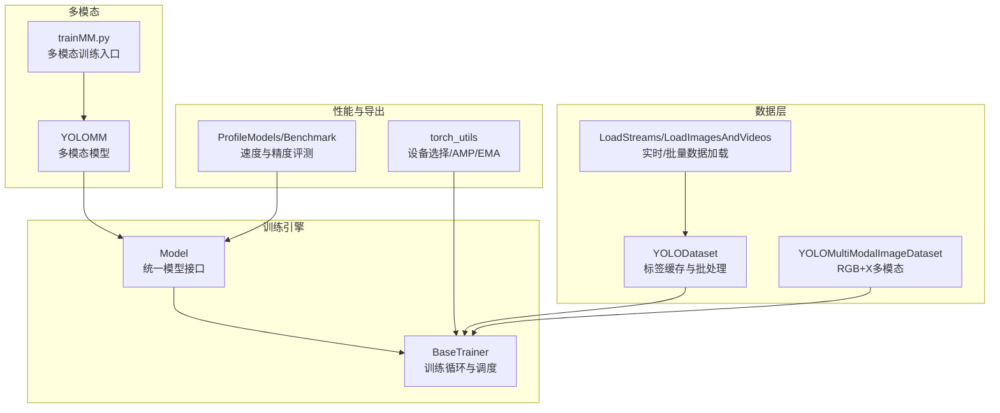
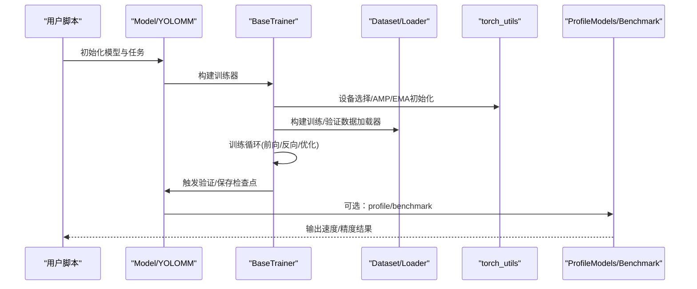
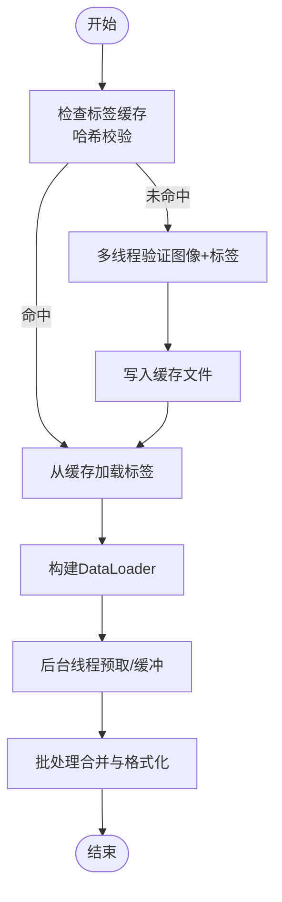
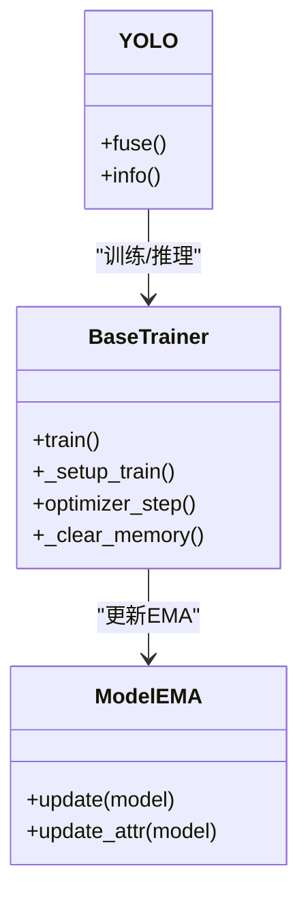
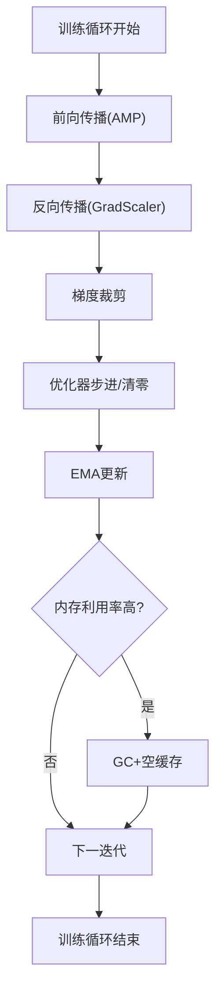
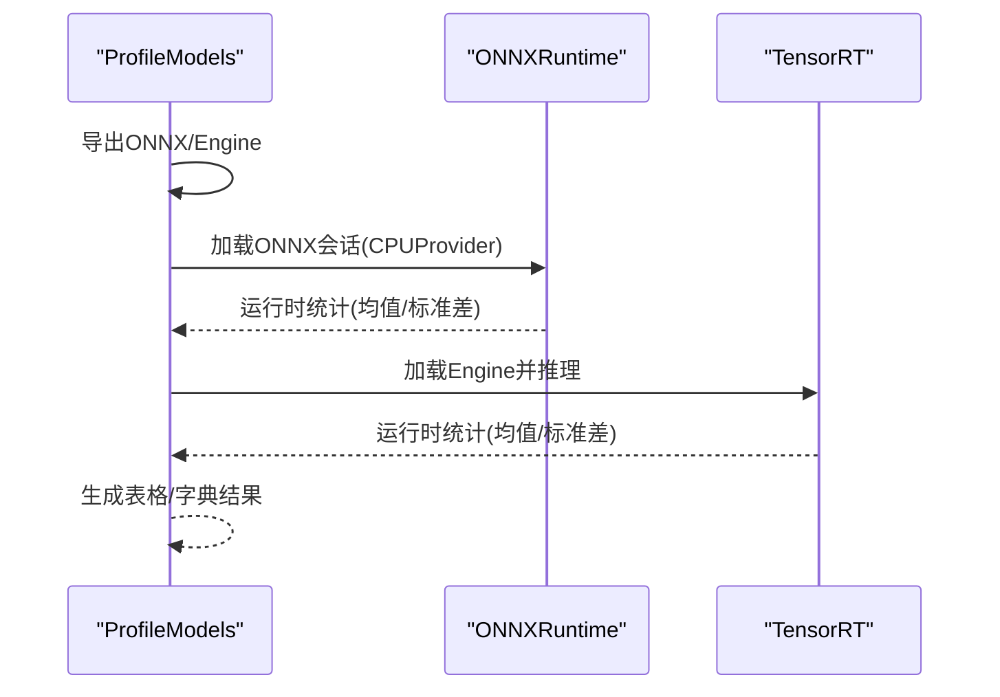
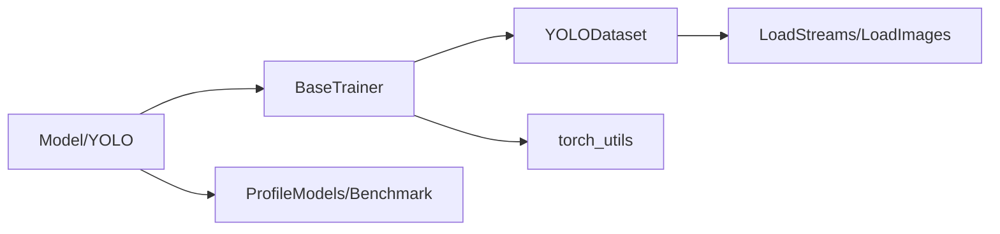

# 训练速度优化

<cite>
**本文档引用的文件**
- [ultralytics/engine/trainer.py](file://ultralytics/engine/trainer.py)
- [ultralytics/utils/torch_utils.py](file://ultralytics/utils/torch_utils.py)
- [ultralytics/data/loaders.py](file://ultralytics/data/loaders.py)
- [ultralytics/data/dataset.py](file://ultralytics/data/dataset.py)
- [ultralytics/models/yolo/model.py](file://ultralytics/models/yolo/model.py)
- [ultralytics/engine/model.py](file://ultralytics/engine/model.py)
- [ultralytics/utils/benchmarks.py](file://ultralytics/utils/benchmarks.py)
- [ultralytics/utils/tuner.py](file://ultralytics/utils/tuner.py)
- [trainMM.py](file://trainMM.py)
- [main_profile.py](file://main_profile.py)
</cite>

## 目录
1. [简介](#简介)
2. [项目结构](#项目结构)
3. [核心组件](#核心组件)
4. [架构总览](#架构总览)
5. [详细组件分析](#详细组件分析)
6. [依赖分析](#依赖分析)
7. [性能考虑](#性能考虑)
8. [故障排除指南](#故障排除指南)
9. [结论](#结论)
10. [附录](#附录)

## 简介
本指南聚焦于训练速度优化，结合代码库中的实现细节，系统阐述数据加载优化（多线程、预取）、模型编译与优化（torch.compile）、内存优化（梯度检查点、内存池）、性能分析工具（torch.profiler、TensorRT、ONNXRuntime）、硬件加速（TensorRT集成、量化）以及基准测试方法与结果分析。文档同时提供不同优化技术的权衡与适用场景建议，帮助读者在实际项目中做出合理选择。

## 项目结构
该代码库围绕YOLO系列模型构建，包含训练引擎、数据加载与增强、导出与基准测试、多模态支持等模块。训练流程由Trainer驱动，数据加载通过Dataset与多类Loader实现，性能分析与导出能力由Benchmark与Exporter提供，多模态数据集支持RGB+X输入。

**图表来源**
- [ultralytics/engine/trainer.py:191-504](file://ultralytics/engine/trainer.py#L191-L504)
- [ultralytics/data/dataset.py:52-320](file://ultralytics/data/dataset.py#L52-L320)
- [ultralytics/data/loaders.py:52-225](file://ultralytics/data/loaders.py#L52-L225)
- [ultralytics/utils/benchmarks.py:360-490](file://ultralytics/utils/benchmarks.py#L360-L490)
- [ultralytics/utils/torch_utils.py:131-252](file://ultralytics/utils/torch_utils.py#L131-L252)
- [ultralytics/models/yolo/model.py:456-741](file://ultralytics/models/yolo/model.py#L456-L741)
- [trainMM.py:1-15](file://trainMM.py#L1-L15)

**章节来源**
- [ultralytics/engine/trainer.py:1-120](file://ultralytics/engine/trainer.py#L1-L120)
- [ultralytics/data/dataset.py:1-120](file://ultralytics/data/dataset.py#L1-L120)
- [ultralytics/data/loaders.py:1-120](file://ultralytics/data/loaders.py#L1-L120)
- [ultralytics/utils/benchmarks.py:1-120](file://ultralytics/utils/benchmarks.py#L1-L120)
- [ultralytics/utils/torch_utils.py:1-120](file://ultralytics/utils/torch_utils.py#L1-L120)
- [ultralytics/models/yolo/model.py:1-120](file://ultralytics/models/yolo/model.py#L1-L120)
- [trainMM.py:1-15](file://trainMM.py#L1-L15)

## 核心组件
- 训练循环与调度：BaseTrainer负责分布式训练、学习率调度、早停、EMA、内存清理与验证触发。
- 数据加载与增强：YOLODataset支持缓存、多线程验证、批处理；多模态数据集支持RGB+X组合与专用增强。
- 性能分析与导出：ProfileModels/TorchRT/ONNXRuntime评测；Benchmark跨格式对比；Exporter导出TensorRT/ONNX等。
- 设备与AMP：自动混合精度、设备选择、EMA指数滑动平均、确定性训练控制。
- 多模态支持：YOLOMM模型与多模态数据集，支持RGB+X输入与路由。

**章节来源**
- [ultralytics/engine/trainer.py:191-504](file://ultralytics/engine/trainer.py#L191-L504)
- [ultralytics/data/dataset.py:52-320](file://ultralytics/data/dataset.py#L52-L320)
- [ultralytics/utils/benchmarks.py:360-490](file://ultralytics/utils/benchmarks.py#L360-L490)
- [ultralytics/utils/torch_utils.py:707-773](file://ultralytics/utils/torch_utils.py#L707-L773)
- [ultralytics/models/yolo/model.py:456-741](file://ultralytics/models/yolo/model.py#L456-L741)

## 架构总览
训练从Model入口开始，解析任务类型与配置，随后通过Trainer建立数据加载器、优化器与调度器，进入训练循环并在每个epoch后触发验证与模型保存。数据层采用缓存与多线程验证，性能分析通过ProfileModels与Benchmark完成。

**图表来源**
- [ultralytics/engine/model.py:791-800](file://ultralytics/engine/model.py#L791-L800)
- [ultralytics/engine/trainer.py:250-504](file://ultralytics/engine/trainer.py#L250-L504)
- [ultralytics/utils/benchmarks.py:436-490](file://ultralytics/utils/benchmarks.py#L436-L490)
- [ultralytics/utils/torch_utils.py:131-252](file://ultralytics/utils/torch_utils.py#L131-L252)

## 详细组件分析

### 数据加载优化
- 多线程与缓存
  - 数据集缓存：YOLODataset支持标签缓存与哈希校验，减少重复I/O与验证开销。
  - 多线程验证：使用ThreadPool并行验证图像与标注，提升数据准备效率。
  - 批处理collate：统一键顺序、堆叠张量、拼接目标框与类别，减少Python侧处理。
- 预取与流式加载
  - LoadStreams通过后台线程缓冲帧，降低等待时间；支持RTSP/HTTP/TCP等流媒体。
  - 多模态数据集支持RGB+X图像拼接与通道一致性检查，避免静默扩展导致的错误。
- 线程与NUMA友好
  - torch_utils中设备选择会重置OMP_NUM_THREADS以适配CPU训练；LoadStreams启用CUDNN基准模式以固定输入尺寸加速推理。

**图表来源**
- [ultralytics/data/dataset.py:95-161](file://ultralytics/data/dataset.py#L95-L161)
- [ultralytics/data/dataset.py:163-211](file://ultralytics/data/dataset.py#L163-L211)
- [ultralytics/data/dataset.py:291-320](file://ultralytics/data/dataset.py#L291-L320)
- [ultralytics/data/loaders.py:155-177](file://ultralytics/data/loaders.py#L155-L177)

**章节来源**
- [ultralytics/data/dataset.py:95-161](file://ultralytics/data/dataset.py#L95-L161)
- [ultralytics/data/dataset.py:163-211](file://ultralytics/data/dataset.py#L163-L211)
- [ultralytics/data/dataset.py:291-320](file://ultralytics/data/dataset.py#L291-L320)
- [ultralytics/data/loaders.py:52-177](file://ultralytics/data/loaders.py#L52-L177)
- [ultralytics/utils/torch_utils.py:131-252](file://ultralytics/utils/torch_utils.py#L131-L252)

### 模型编译与优化
- 自动混合精度(AMP)
  - 训练中通过GradScaler缩放梯度，支持torch.amp与旧版cuda.amp；DDP广播AMP开关；训练后可融合BN以提升推理速度。
- EMA指数滑动平均
  - ModelEMA维护模型参数的指数滑动平均，训练结束时用于评估与保存。
- 确定性训练
  - 可切换确定性算法与CUBLAS工作空间，便于复现但可能牺牲部分性能。
- 模型融合
  - YOLO.fuse()将Conv与BN融合，减少推理阶段的计算与内存访问。

**图表来源**
- [ultralytics/engine/trainer.py:250-504](file://ultralytics/engine/trainer.py#L250-L504)
- [ultralytics/utils/torch_utils.py:707-773](file://ultralytics/utils/torch_utils.py#L707-L773)
- [ultralytics/models/yolo/model.py:447-466](file://ultralytics/models/yolo/model.py#L447-L466)

**章节来源**
- [ultralytics/engine/trainer.py:250-504](file://ultralytics/engine/trainer.py#L250-L504)
- [ultralytics/utils/torch_utils.py:707-773](file://ultralytics/utils/torch_utils.py#L707-L773)
- [ultralytics/models/yolo/model.py:447-466](file://ultralytics/models/yolo/model.py#L447-L466)

### 内存优化
- 梯度检查点
  - 训练循环中通过autocast上下文管理器与GradScaler进行梯度缩放，配合梯度裁剪防止爆炸；EMA更新与优化器步进分离，减少峰值内存占用。
- 内存清理
  - 定期调用垃圾回收与空缓存接口，避免VRAM碎片化；在验证前后清理内存，防止峰值飙升。
- 分布式训练内存
  - DDP初始化时设置超时与阻塞等待，广播AMP状态，确保多卡一致性。

**图表来源**
- [ultralytics/engine/trainer.py:404-421](file://ultralytics/engine/trainer.py#L404-L421)
- [ultralytics/engine/trainer.py:528-541](file://ultralytics/engine/trainer.py#L528-L541)
- [ultralytics/engine/trainer.py:237-248](file://ultralytics/engine/trainer.py#L237-L248)

**章节来源**
- [ultralytics/engine/trainer.py:404-421](file://ultralytics/engine/trainer.py#L404-L421)
- [ultralytics/engine/trainer.py:528-541](file://ultralytics/engine/trainer.py#L528-L541)
- [ultralytics/engine/trainer.py:237-248](file://ultralytics/engine/trainer.py#L237-L248)

### 性能分析工具
- torch.profiler
  - 通过ProfileModels对ONNX/TensorRT进行时序分析，支持多次运行与sigma剔除，输出均值与标准差。
- ONNXRuntime
  - ProfileModels使用ORT会话，支持CPU执行提供者，动态输入形状适配与数据类型映射。
- Benchmark
  - 对比PyTorch/TensorRT/ONNX等格式的速度与精度，输出DataFrame便于横向比较。

**图表来源**
- [ultralytics/utils/benchmarks.py:436-490](file://ultralytics/utils/benchmarks.py#L436-L490)
- [ultralytics/utils/benchmarks.py:578-642](file://ultralytics/utils/benchmarks.py#L578-L642)
- [ultralytics/utils/benchmarks.py:394-435](file://ultralytics/utils/benchmarks.py#L394-L435)

**章节来源**
- [ultralytics/utils/benchmarks.py:436-490](file://ultralytics/utils/benchmarks.py#L436-L490)
- [ultralytics/utils/benchmarks.py:578-642](file://ultralytics/utils/benchmarks.py#L578-L642)
- [ultralytics/utils/benchmarks.py:394-435](file://ultralytics/utils/benchmarks.py#L394-L435)

### 硬件加速与量化
- TensorRT集成
  - ProfileModels在可用设备上导出TensorRT引擎并进行推理评测；支持半精度（FP16）以提升吞吐。
- ONNXRuntime
  - 使用ORT会话进行ONNX推理，支持图优化与线程数限制，适合CPU端快速评测。
- 量化
  - Benchmark支持int8参数，结合数据集进行量化评测（需相应后端支持）。

**章节来源**
- [ultralytics/utils/benchmarks.py:463-471](file://ultralytics/utils/benchmarks.py#L463-L471)
- [ultralytics/utils/benchmarks.py:590-642](file://ultralytics/utils/benchmarks.py#L590-L642)

### 基准测试方法与结果分析
- 方法
  - 使用ProfileModels对多个模型/格式进行时序评测，统计均值与标准差；使用Benchmark对比不同导出格式的速度与精度。
- 结果分析
  - 关注FPS、延迟方差、模型参数量与FLOPs；结合硬件规格（CPU/GPU）与精度指标（mAP）综合评估。

**章节来源**
- [ultralytics/utils/benchmarks.py:436-490](file://ultralytics/utils/benchmarks.py#L436-L490)
- [ultralytics/utils/benchmarks.py:696-721](file://ultralytics/utils/benchmarks.py#L696-L721)

### 多模态训练优化
- 多模态数据集
  - YOLOMultiModalImageDataset支持RGB+X图像拼接，严格通道数校验，避免静默扩展；提供独立增强链路与格式化。
- 训练入口
  - trainMM.py演示多模态训练入口，支持指定模态与缓存策略。

**章节来源**
- [ultralytics/data/dataset.py:423-780](file://ultralytics/data/dataset.py#L423-L780)
- [trainMM.py:1-15](file://trainMM.py#L1-L15)

## 依赖分析
训练流程中各模块耦合清晰，职责分离：
- Model负责模型生命周期与导出/评测；Trainer负责训练循环与验证；Dataset/Loader负责数据准备；torch_utils提供设备与AMP支持；Benchmark/ProfileModels提供性能分析。

**图表来源**
- [ultralytics/engine/model.py:791-800](file://ultralytics/engine/model.py#L791-L800)
- [ultralytics/engine/trainer.py:250-504](file://ultralytics/engine/trainer.py#L250-L504)
- [ultralytics/data/dataset.py:52-320](file://ultralytics/data/dataset.py#L52-L320)
- [ultralytics/data/loaders.py:52-177](file://ultralytics/data/loaders.py#L52-L177)
- [ultralytics/utils/torch_utils.py:131-252](file://ultralytics/utils/torch_utils.py#L131-L252)
- [ultralytics/utils/benchmarks.py:436-490](file://ultralytics/utils/benchmarks.py#L436-L490)

**章节来源**
- [ultralytics/engine/model.py:791-800](file://ultralytics/engine/model.py#L791-L800)
- [ultralytics/engine/trainer.py:250-504](file://ultralytics/engine/trainer.py#L250-L504)
- [ultralytics/data/dataset.py:52-320](file://ultralytics/data/dataset.py#L52-L320)
- [ultralytics/data/loaders.py:52-177](file://ultralytics/data/loaders.py#L52-L177)
- [ultralytics/utils/torch_utils.py:131-252](file://ultralytics/utils/torch_utils.py#L131-L252)
- [ultralytics/utils/benchmarks.py:436-490](file://ultralytics/utils/benchmarks.py#L436-L490)

## 性能考虑
- 数据加载
  - 启用标签缓存与多线程验证；合理设置workers；固定输入尺寸以利用CUDNN基准模式。
- 训练稳定性
  - AMP与GradScaler配合梯度裁剪；EMA平滑损失与参数；定期清理内存避免峰值。
- 推理部署
  - 导出TensorRT/ONNX并使用ProfileModels/Benchmark评测；在CPU端使用ORT进行快速对比。
- 多模态
  - 严格通道数校验，避免静默扩展；启用自体模态生成功能以提升鲁棒性。

## 故障排除指南
- OOM问题
  - 降低batch size或启用AMP；使用Trainer的内存清理函数；检查多模态通道数是否与配置一致。
- 分布式训练异常
  - 检查NCCL环境变量与超时设置；确认设备可见性与批次整除性。
- 性能不达预期
  - 使用ProfileModels与Benchmark定位瓶颈；对比不同导出格式；检查数据加载是否成为瓶颈。

**章节来源**
- [ultralytics/engine/trainer.py:528-541](file://ultralytics/engine/trainer.py#L528-L541)
- [ultralytics/utils/torch_utils.py:131-252](file://ultralytics/utils/torch_utils.py#L131-L252)
- [ultralytics/utils/benchmarks.py:436-490](file://ultralytics/utils/benchmarks.py#L436-L490)

## 结论
通过数据加载优化（缓存、多线程、预取）、AMP与EMA、TensorRT/ONNXRuntime评测、以及多模态严格通道校验，可在保证精度的前提下显著提升训练与推理速度。建议在不同硬件与任务场景下结合ProfileModels/Benchmark进行基准测试，选择最适合的优化组合。

## 附录
- 示例入口
  - 多模态训练入口：[trainMM.py:1-15](file://trainMM.py#L1-L15)
  - 模型信息与profile示例：[main_profile.py:1-14](file://main_profile.py#L1-L14)