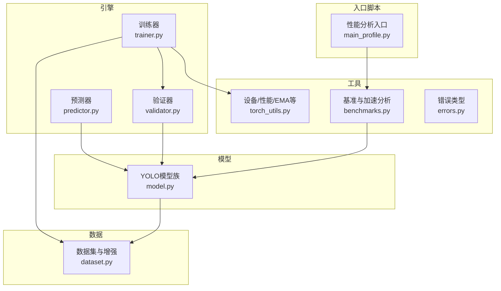
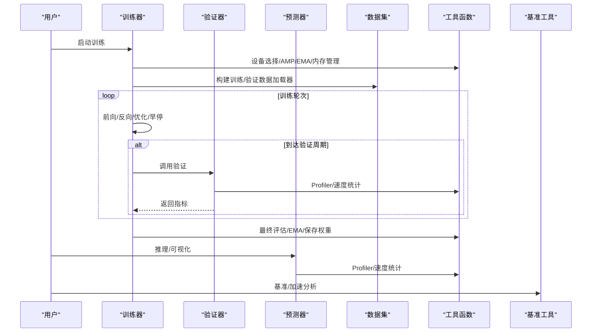
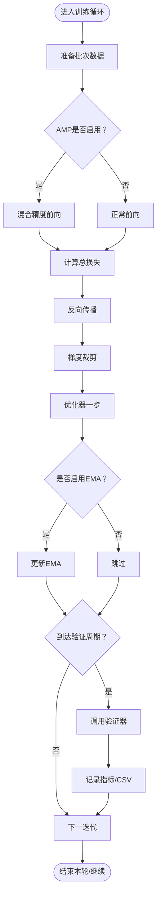
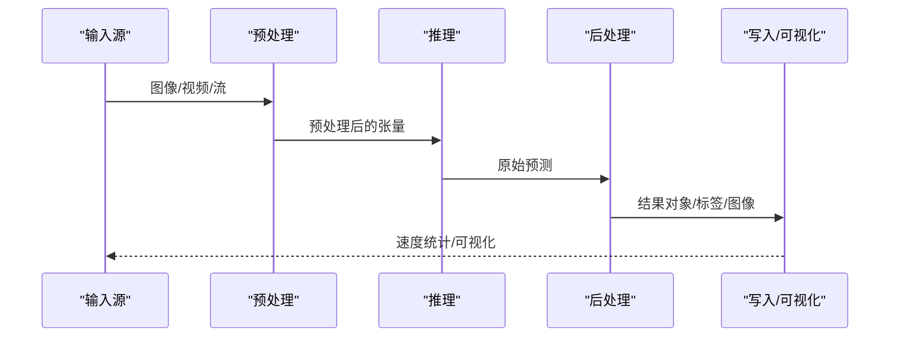
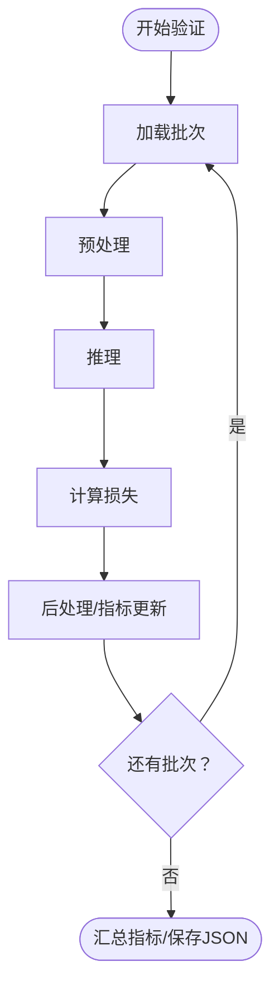
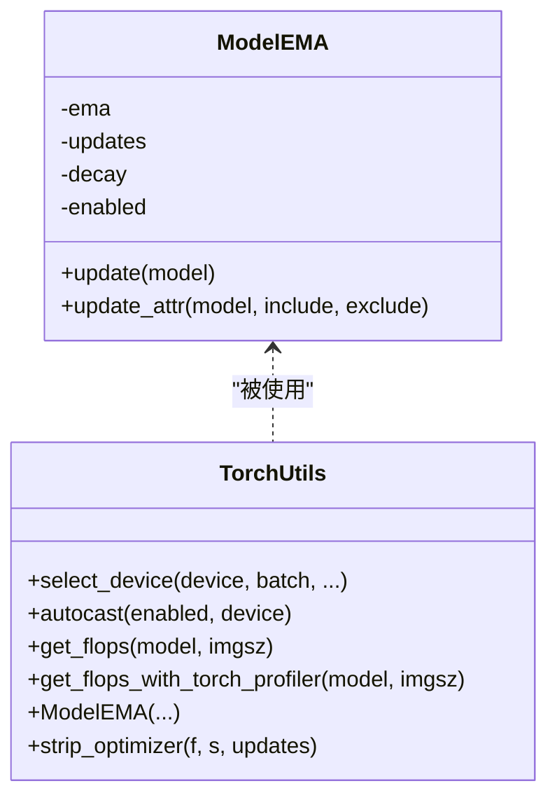
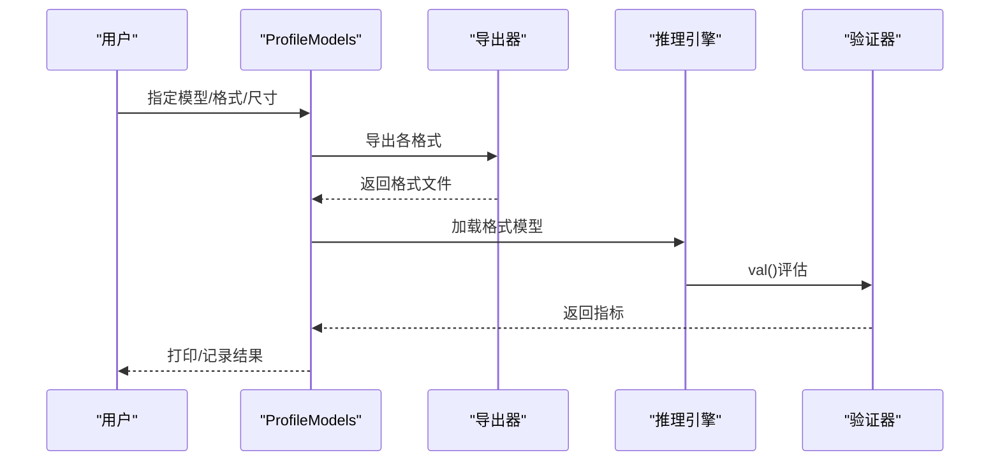
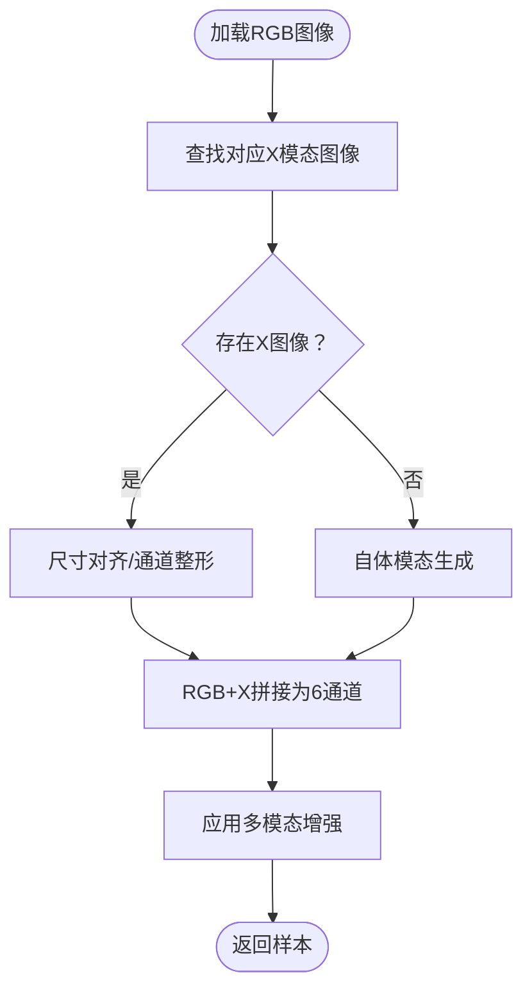
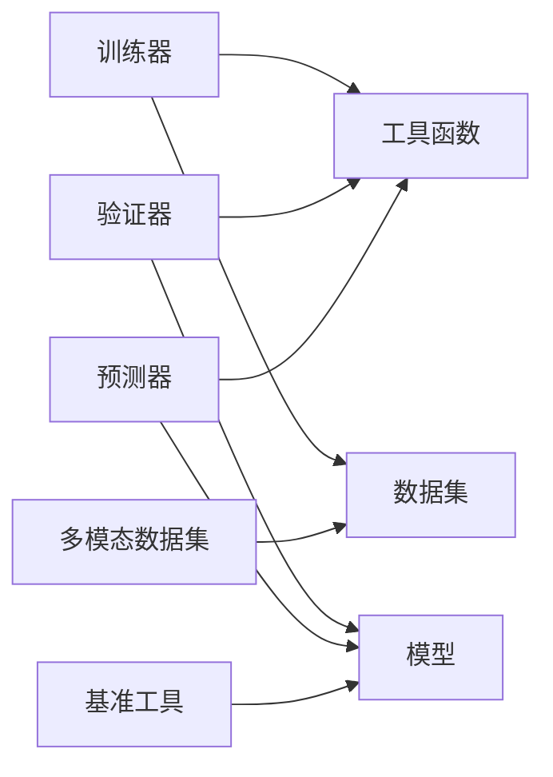
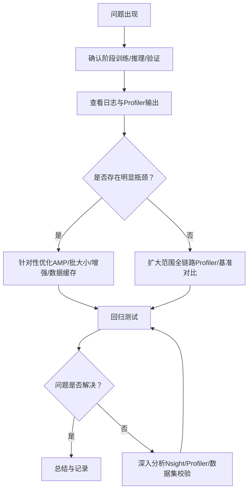

# 调试与故障排除

<cite>
**本文引用的文件**
- [ultralytics/engine/trainer.py](file://ultralytics/engine/trainer.py)
- [ultralytics/engine/predictor.py](file://ultralytics/engine/predictor.py)
- [ultralytics/engine/validator.py](file://ultralytics/engine/validator.py)
- [ultralytics/utils/torch_utils.py](file://ultralytics/utils/torch_utils.py)
- [ultralytics/utils/benchmarks.py](file://ultralytics/utils/benchmarks.py)
- [ultralytics/utils/errors.py](file://ultralytics/utils/errors.py)
- [ultralytics/data/dataset.py](file://ultralytics/data/dataset.py)
- [ultralytics/models/yolo/model.py](file://ultralytics/models/yolo/model.py)
- [main_profile.py](file://main_profile.py)
</cite>

## 目录
1. [简介](#简介)
2. [项目结构](#项目结构)
3. [核心组件](#核心组件)
4. [架构总览](#架构总览)
5. [详细组件分析](#详细组件分析)
6. [依赖分析](#依赖分析)
7. [性能考虑](#性能考虑)
8. [故障排除指南](#故障排除指南)
9. [结论](#结论)
10. [附录](#附录)

## 简介
本指南面向多模态检测系统的调试与故障排除，聚焦于训练与推理阶段的性能瓶颈定位、日志解读、常见问题诊断与修复、调试工具使用以及数据管道排查。文档基于仓库中训练、推理、验证、数据集与工具模块的实际实现，提供可操作的诊断流程与最佳实践。

## 项目结构
该仓库围绕 Ultralytics 的 Engine（训练/推理/验证）、Models（YOLO/YOLOWorld/YOLOE/YOLOMM）、Utils（工具函数/基准测试/错误处理）、Data（数据集与增强）等模块组织，形成完整的多模态检测系统闭环。

**图表来源**
- [ultralytics/engine/trainer.py](file://ultralytics/engine/trainer.py)
- [ultralytics/engine/predictor.py](file://ultralytics/engine/predictor.py)
- [ultralytics/engine/validator.py](file://ultralytics/engine/validator.py)
- [ultralytics/utils/torch_utils.py](file://ultralytics/utils/torch_utils.py)
- [ultralytics/utils/benchmarks.py](file://ultralytics/utils/benchmarks.py)
- [ultralytics/utils/errors.py](file://ultralytics/utils/errors.py)
- [ultralytics/data/dataset.py](file://ultralytics/data/dataset.py)
- [ultralytics/models/yolo/model.py](file://ultralytics/models/yolo/model.py)
- [main_profile.py](file://main_profile.py)

**章节来源**
- [ultralytics/engine/trainer.py](file://ultralytics/engine/trainer.py)
- [ultralytics/engine/predictor.py](file://ultralytics/engine/predictor.py)
- [ultralytics/engine/validator.py](file://ultralytics/engine/validator.py)
- [ultralytics/utils/torch_utils.py](file://ultralytics/utils/torch_utils.py)
- [ultralytics/utils/benchmarks.py](file://ultralytics/utils/benchmarks.py)
- [ultralytics/utils/errors.py](file://ultralytics/utils/errors.py)
- [ultralytics/data/dataset.py](file://ultralytics/data/dataset.py)
- [ultralytics/models/yolo/model.py](file://ultralytics/models/yolo/model.py)
- [main_profile.py](file://main_profile.py)

## 核心组件
- 训练器（BaseTrainer）：负责训练循环、验证、早停、学习率调度、AMP、梯度裁剪、EMA、断点续训、日志与CSV记录、内存清理等。
- 预测器（BasePredictor）：负责预处理、推理、后处理、可视化、结果保存、速度剖析（三段Profiler）。
- 验证器（BaseValidator）：负责验证流程、指标计算、损失统计、速度剖析（四段Profiler）。
- 工具函数（torch_utils）：设备选择、AMP上下文、FLOPs/参数统计、EMA、确定性训练开关、内存查询与清空。
- 基准与加速（benchmarks）：模型导出、ONNX/TensorRT速度剖析、格式对比、统计打印。
- 错误类型（errors）：HUB模型错误类型。
- 数据集（dataset）：多模态数据集（RGB+X）、缓存、变换、collate_fn、有效性校验。
- 模型族（model.py）：YOLO/YOLOWorld/YOLOE/YOLOMM 类型映射与任务切换。

**章节来源**
- [ultralytics/engine/trainer.py](file://ultralytics/engine/trainer.py)
- [ultralytics/engine/predictor.py](file://ultralytics/engine/predictor.py)
- [ultralytics/engine/validator.py](file://ultralytics/engine/validator.py)
- [ultralytics/utils/torch_utils.py](file://ultralytics/utils/torch_utils.py)
- [ultralytics/utils/benchmarks.py](file://ultralytics/utils/benchmarks.py)
- [ultralytics/utils/errors.py](file://ultralytics/utils/errors.py)
- [ultralytics/data/dataset.py](file://ultralytics/data/dataset.py)
- [ultralytics/models/yolo/model.py](file://ultralytics/models/yolo/model.py)

## 架构总览
训练/推理/验证通过统一的回调机制与日志系统串联，配合设备选择、AMP、EMA、Profiler等工具完成端到端的性能与稳定性保障。

**图表来源**
- [ultralytics/engine/trainer.py](file://ultralytics/engine/trainer.py)
- [ultralytics/engine/validator.py](file://ultralytics/engine/validator.py)
- [ultralytics/engine/predictor.py](file://ultralytics/engine/predictor.py)
- [ultralytics/utils/torch_utils.py](file://ultralytics/utils/torch_utils.py)
- [ultralytics/utils/benchmarks.py](file://ultralytics/utils/benchmarks.py)

## 详细组件分析

### 训练器（BaseTrainer）调试要点
- 性能瓶颈识别
  - 训练循环内包含每批次耗时统计与内存占用查询，结合进度条描述输出，便于定位慢环节（前向、反向、优化、验证）。
  - AMP/GradScaler、梯度裁剪、EMA更新、早停策略均在训练器中集中实现，便于统一开关与观测。
- 日志与CSV
  - 训练指标与速度写入CSV，便于后续绘图分析。
- 内存管理
  - 提供内存查询与清空接口，支持阈值触发清理，防止显存/内存碎片化导致的OOM。
- 断点续训与参数一致性
  - 支持从上次检查点恢复，参数覆盖与一致性检查，避免resume与scale冲突。

**图表来源**
- [ultralytics/engine/trainer.py](file://ultralytics/engine/trainer.py)

**章节来源**
- [ultralytics/engine/trainer.py](file://ultralytics/engine/trainer.py)

### 预测器（BasePredictor）调试要点
- 三段Profiler剖析
  - 预处理、推理、后处理分别计时，输出每张图耗时，快速定位瓶颈。
- 流式推理与内存控制
  - 支持流式生成器，避免大源/长视频累积在内存导致OOM。
- 多模态注意
  - 预处理可能将两路输入合成为单样本，结果长度与路径长度不一致时按结果长度迭代，避免越界与漏写。

**图表来源**
- [ultralytics/engine/predictor.py](file://ultralytics/engine/predictor.py)

**章节来源**
- [ultralytics/engine/predictor.py](file://ultralytics/engine/predictor.py)

### 验证器（BaseValidator）调试要点
- 四段Profiler剖析
  - 预处理、推理、损失、后处理分别计时，输出每张图耗时，便于验证阶段性能分析。
- 指标与JSON输出
  - 支持保存预测JSON，便于离线评估与对比。

**图表来源**
- [ultralytics/engine/validator.py](file://ultralytics/engine/validator.py)

**章节来源**
- [ultralytics/engine/validator.py](file://ultralytics/engine/validator.py)

### 工具函数（torch_utils）与性能分析
- 设备选择与环境变量
  - 支持CPU/MPS/CUDA自动选择，-1设备替换为可用GPU，设置CUDA_VISIBLE_DEVICES，保证多卡/单卡一致性。
- AMP与自动混合精度
  - 提供autocast上下文，兼容不同PyTorch版本；GradScaler用于AMP训练。
- FLOPs与参数统计
  - 提供thop与torch profiler两种方式的FLOPs统计，支持路由感知（多模态）计算。
- EMA与确定性训练
  - EMA类用于指数滑动平均；确定性训练开关用于复现实验。
- 内存查询与清空
  - 查询GPU/MPS/虚拟内存占用，阈值触发清空，缓解OOM风险。

**图表来源**
- [ultralytics/utils/torch_utils.py](file://ultralytics/utils/torch_utils.py)

**章节来源**
- [ultralytics/utils/torch_utils.py](file://ultralytics/utils/torch_utils.py)

### 基准与加速（benchmarks）
- 多格式导出与速度/精度对比
  - 支持ONNX/TensorRT/TF系列/Paddle/MNN/NCNN等格式，批量导出与验证，输出FPS、mAP、文件大小等。
- TensorRT/ONNXRuntime剖析
  - 统一的warmup与多次采样，sigma截断去噪，输出均值与方差。
- 输出日志与表格
  - 控制台打印与benchmarks.log文件记录，便于横向对比。

**图表来源**
- [ultralytics/utils/benchmarks.py](file://ultralytics/utils/benchmarks.py)

**章节来源**
- [ultralytics/utils/benchmarks.py](file://ultralytics/utils/benchmarks.py)

### 数据集与多模态（dataset）
- 多模态数据集（RGB+X）
  - 支持6通道（RGB3+X3）构建，严格通道数校验，自体模态生成，缓存与有效性索引扫描。
  - 增强链路独立于通用v8_transforms，确保X通道一致性。
- 缓存与校验
  - 标签缓存、完整性校验、缺失/损坏/空标注统计，避免训练中断。
- Collate与批处理
  - 对img/text_feats/visuals/masks/keypoints/bboxes/cls/segments/obb等字段采用拼接/填充策略，保证批处理一致性。

**图表来源**
- [ultralytics/data/dataset.py](file://ultralytics/data/dataset.py)

**章节来源**
- [ultralytics/data/dataset.py](file://ultralytics/data/dataset.py)

### 模型族（model.py）
- 类型映射与任务切换
  - YOLO/YOLOWorld/YOLOE/YOLOMM自动识别与任务映射，确保不同模型走正确的Trainer/Validator/Predictor。
- YOLOMM多模态配置
  - 依据配置自动识别输入通道（3或6），支持RGB-only、X-only、Dual三种模式，提供模态信息查询。

**章节来源**
- [ultralytics/models/yolo/model.py](file://ultralytics/models/yolo/model.py)

## 依赖分析
- 训练器依赖工具函数（设备/AMP/EMA/统计）与数据集；验证器依赖工具函数与模型；预测器依赖模型与工具函数。
- 基准工具贯穿模型导出、推理与验证，形成性能闭环。
- 多模态数据集与增强链路独立，避免与单模态路径耦合。

**图表来源**
- [ultralytics/engine/trainer.py](file://ultralytics/engine/trainer.py)
- [ultralytics/engine/validator.py](file://ultralytics/engine/validator.py)
- [ultralytics/engine/predictor.py](file://ultralytics/engine/predictor.py)
- [ultralytics/utils/torch_utils.py](file://ultralytics/utils/torch_utils.py)
- [ultralytics/utils/benchmarks.py](file://ultralytics/utils/benchmarks.py)
- [ultralytics/data/dataset.py](file://ultralytics/data/dataset.py)
- [ultralytics/models/yolo/model.py](file://ultralytics/models/yolo/model.py)

**章节来源**
- [ultralytics/engine/trainer.py](file://ultralytics/engine/trainer.py)
- [ultralytics/engine/validator.py](file://ultralytics/engine/validator.py)
- [ultralytics/engine/predictor.py](file://ultralytics/engine/predictor.py)
- [ultralytics/utils/torch_utils.py](file://ultralytics/utils/torch_utils.py)
- [ultralytics/utils/benchmarks.py](file://ultralytics/utils/benchmarks.py)
- [ultralytics/data/dataset.py](file://ultralytics/data/dataset.py)
- [ultralytics/models/yolo/model.py](file://ultralytics/models/yolo/model.py)

## 性能考虑
- CPU/GPU利用率与内存监控
  - 训练器/验证器/预测器均内置内存查询与清空逻辑；建议结合系统监控工具（如nvidia-smi、htop）观察整体资源占用。
- AMP与混合精度
  - 在支持设备上启用AMP可显著提升吞吐；注意梯度缩放与梯度裁剪的配合。
- 批大小与梯度累积
  - AutoBatch估算最优batch；梯度累积减少显存峰值，提高有效batch。
- 数据加载与增强
  - 多模态数据集的缓存与通道整形需谨慎，避免额外I/O与转换开销。
- 推理流式化
  - 长视频/流媒体建议开启流式生成器，避免累积在内存。

[本节为通用指导，无需特定文件引用]

## 故障排除指南

### 性能瓶颈识别
- 训练阶段
  - 查看训练日志中的每轮耗时与内存占用，定位慢环节（前向/反向/优化/验证）。
  - 若GPU利用率低，检查数据加载、CPU侧预处理、批大小与workers配置。
- 推理阶段
  - 使用预测器的三段Profiler，关注预处理/推理/后处理各自耗时占比。
- 验证阶段
  - 使用验证器的四段Profiler，定位验证耗时热点。

**章节来源**
- [ultralytics/engine/trainer.py](file://ultralytics/engine/trainer.py)
- [ultralytics/engine/predictor.py](file://ultralytics/engine/predictor.py)
- [ultralytics/engine/validator.py](file://ultralytics/engine/validator.py)

### 日志分析技术
- 训练日志
  - 关注损失曲线、指标CSV、早停触发条件、EMA更新频率。
- 预测/验证日志
  - 关注速度统计、每张图耗时、指标输出、JSON保存路径。
- 基准日志
  - 对比不同格式的FPS与mAP，定位导出/推理问题。

**章节来源**
- [ultralytics/engine/trainer.py](file://ultralytics/engine/trainer.py)
- [ultralytics/engine/predictor.py](file://ultralytics/engine/predictor.py)
- [ultralytics/engine/validator.py](file://ultralytics/engine/validator.py)
- [ultralytics/utils/benchmarks.py](file://ultralytics/utils/benchmarks.py)

### 常见问题与诊断
- 模型不收敛
  - 检查学习率调度、warmup、早停阈值、数据增强强度；逐步降低增强或增大学习率。
- 过拟合
  - 增大数据增强、正则化（weight_decay）、早停、EMA权重使用。
- 欠拟合
  - 增大模型容量、增加训练轮次、检查数据质量与标签一致性。
- OOM/显存不足
  - 降低batch、启用AMP、清理缓存、减少workers、检查多模态通道数与缓存策略。
- 数据加载异常
  - 检查数据集缓存版本、标签完整性、路径一致性；多模态数据集严格校验通道数与配对。

**章节来源**
- [ultralytics/engine/trainer.py](file://ultralytics/engine/trainer.py)
- [ultralytics/data/dataset.py](file://ultralytics/data/dataset.py)

### 调试工具使用
- PyTorch Profiler
  - 使用torch.profiler.profile进行算子级剖析，结合FLOPs统计定位热点。
- ONNXRuntime/TensorRT剖析
  - 使用基准工具对ONNX/TensorRT进行warmup与多次采样，sigma截断去噪，输出均值与方差。
- NVIDIA Nsight（可选）
  - 在GPU侧进行端到端时间线分析，定位核函数与内存带宽瓶颈。

**章节来源**
- [ultralytics/utils/benchmarks.py](file://ultralytics/utils/benchmarks.py)
- [ultralytics/utils/torch_utils.py](file://ultralytics/utils/torch_utils.py)
- [main_profile.py](file://main_profile.py)

### 错误处理与异常捕获
- HUB模型错误
  - 使用HUBModelError统一处理模型拉取失败，便于用户友好提示。
- 断点续训异常
  - 检查resume路径、数据yaml一致性、scale参数冲突。
- 多模态通道不一致
  - 严格校验X通道数，必要时抛出异常避免静默扩展导致的不一致。

**章节来源**
- [ultralytics/utils/errors.py](file://ultralytics/utils/errors.py)
- [ultralytics/engine/trainer.py](file://ultralytics/engine/trainer.py)
- [ultralytics/data/dataset.py](file://ultralytics/data/dataset.py)

### 数据管道问题排查
- 数据加载
  - 检查路径、权限、缓存版本、标签文件存在性。
- 预处理与增强
  - 多模态增强链路独立，确保X通道一致性；避免BGR翻转影响X通道。
- 批处理
  - 关注collate_fn对不同字段的处理策略，确保批内元素对齐。

**章节来源**
- [ultralytics/data/dataset.py](file://ultralytics/data/dataset.py)

### 系统性问题诊断流程

[本图为概念流程，无需图表来源]

## 结论
通过训练器/预测器/验证器的日志与Profiler、工具函数的设备/AMP/EMA/FLOPs能力、基准工具的多格式对比，以及多模态数据集的严格校验与缓存策略，可以系统地定位与解决多模态检测系统的性能与稳定性问题。建议在每次实验中保留日志、CSV与JSON结果，形成可追溯的性能档案。

[本节为总结，无需特定文件引用]

## 附录
- 调试入口脚本：main_profile.py（用于性能分析）
- 多模态数据组织与增强：dataset.py（RGB+X）
- 模型类型与任务映射：model.py（YOLO/YOLOWorld/YOLOE/YOLOMM）

**章节来源**
- [main_profile.py](file://main_profile.py)
- [ultralytics/data/dataset.py](file://ultralytics/data/dataset.py)
- [ultralytics/models/yolo/model.py](file://ultralytics/models/yolo/model.py)