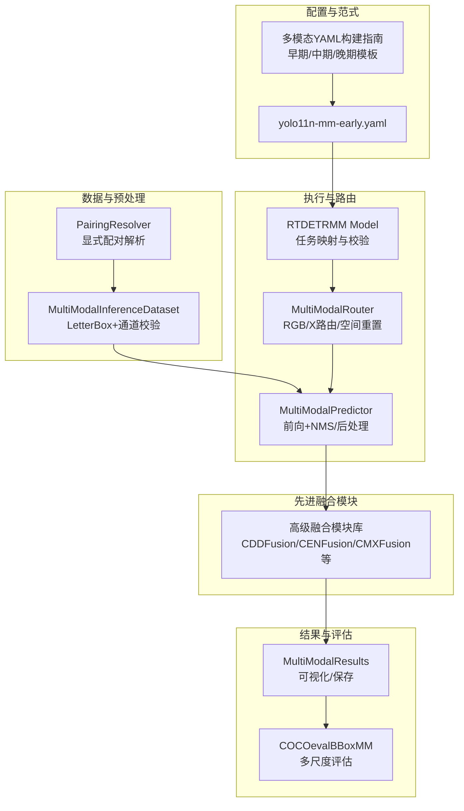
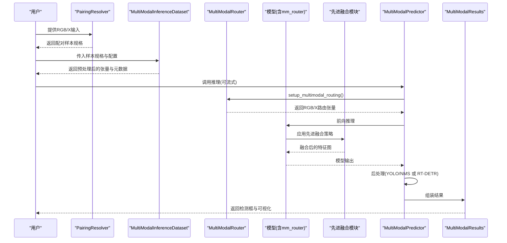
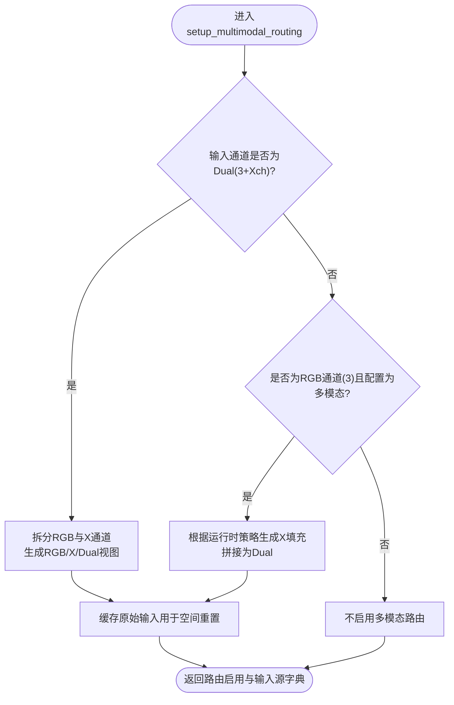
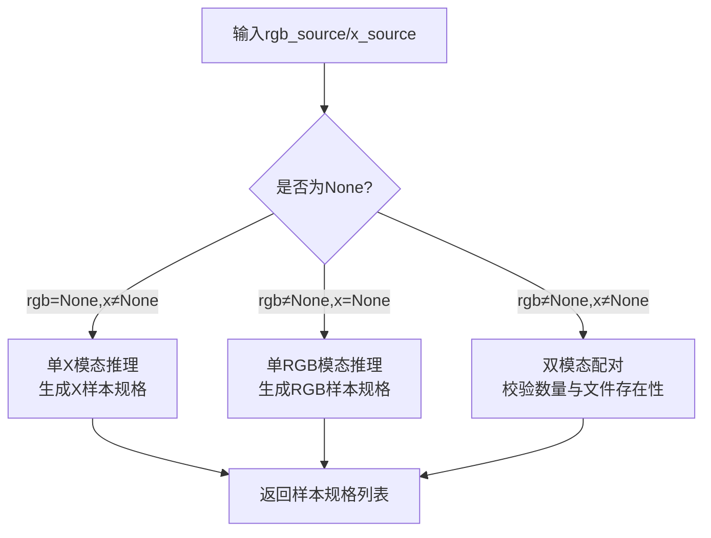
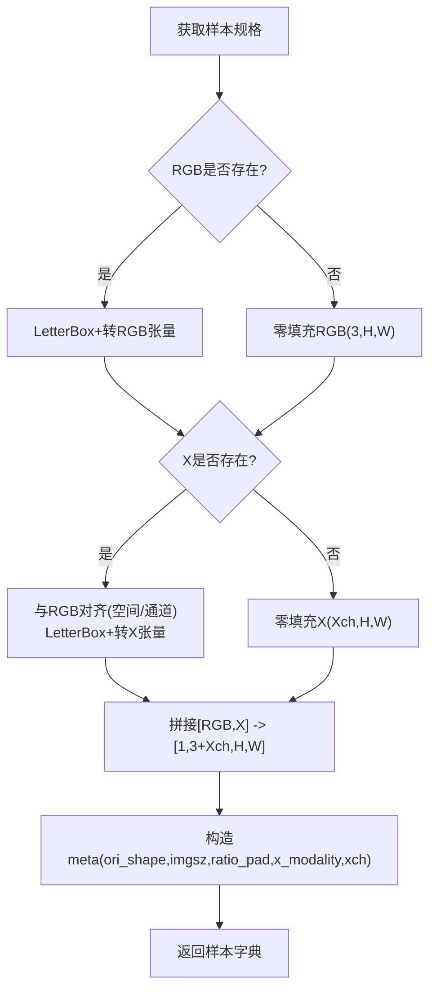
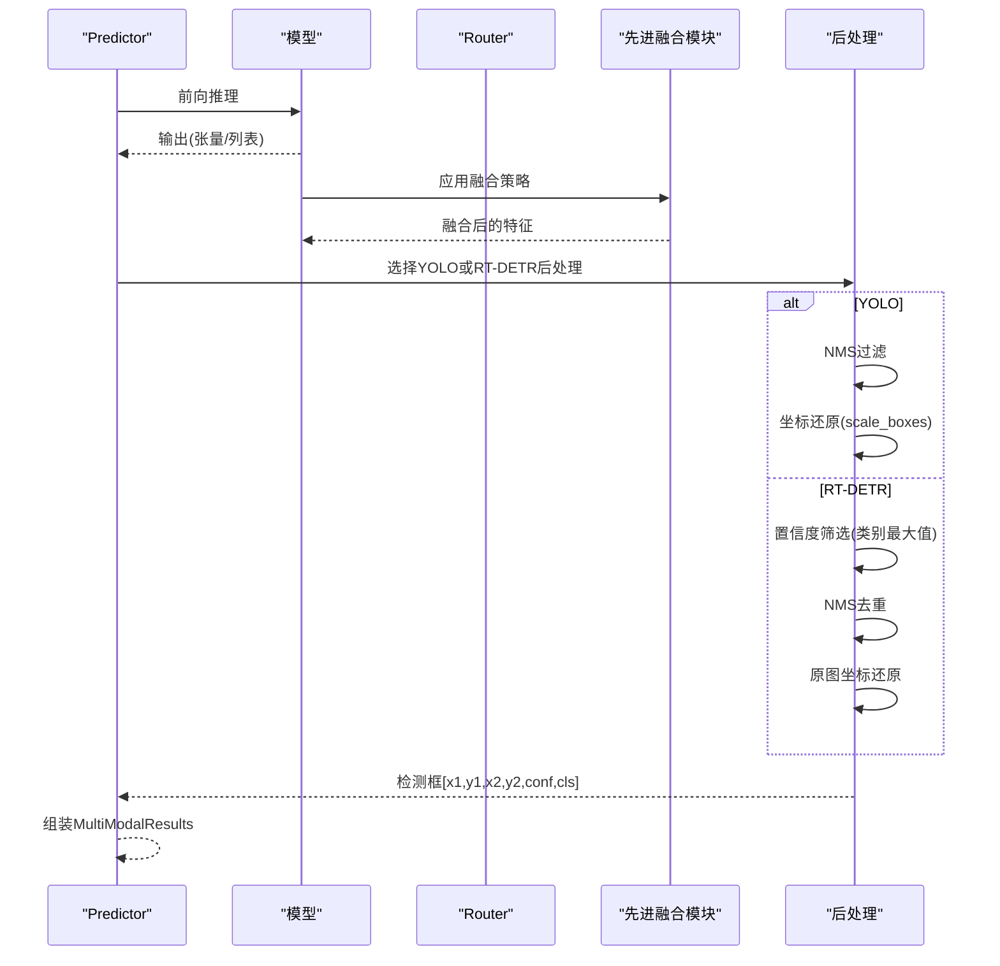
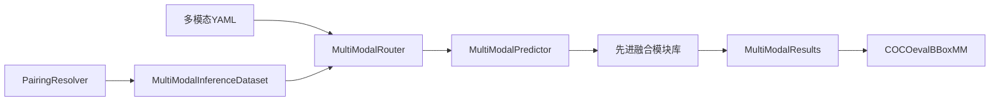

# 多模态融合理论基础

<cite>
**本文档引用的文件**
- [多模态YAML构建指点.md](file://ultralytics/cfg/models/多模态YAML构建指点.md)
- [router.py](file://ultralytics/nn/mm/router.py)
- [pairing.py](file://ultralytics/data/multimodal/pairing.py)
- [inference_dataset.py](file://ultralytics/data/multimodal/inference_dataset.py)
- [predictor.py](file://ultralytics/engine/multimodal/predictor.py)
- [results.py](file://ultralytics/engine/multimodal/results.py)
- [model.py](file://ultralytics/models/rtdetrmm/model.py)
- [yolo11n-mm-early.yaml](file://ultralytics/cfg/models/mm/yolo11n-mm-early.yaml)
- [coco_eval_bbox_mm.py](file://ultralytics/utils/coco_eval_bbox_mm.py)
- [__init__.py](file://ultralytics/nn/modules/__init__.py)
- [fusion.py](file://ultralytics/nn/modules/fusion/__init__.py)
- [tasks.py](file://ultralytics/nn/tasks.py)
- [cddfusion.py](file://ultralytics/nn/modules/fusion/cddfusion.py)
- [cen_fusion.py](file://ultralytics/nn/modules/fusion/cen_fusion.py)
- [cmxfusion.py](file://ultralytics/nn/modules/fusion/cmxfusion.py)
- [metafusion.py](file://ultralytics/nn/modules/fusion/metafusion.py)
- [mambadfuse.py](file://ultralytics/nn/modules/fusion/mambadfuse.py)
- [piafusion.py](file://ultralytics/nn/modules/fusion/piafusion.py)
- [sigmafusion.py](file://ultralytics/nn/modules/fusion/sigmafusion.py)
- [superyolofusion.py](file://ultralytics/nn/modules/fusion/superyolofusion.py)
- [tardal_fusion.py](file://ultralytics/nn/modules/fusion/tardal_fusion.py)
- [fusion_bifpn.py](file://ultralytics/nn/modules/fusion/fusion_bifpn.py)
</cite>

## 更新摘要
**所做更改**
- 新增对九种先进多模态融合理论的深入分析
- 增强了对特征分解融合、零参数融合、跨模态校准等新型融合机制的理论阐述
- 完善了融合策略分类体系，涵盖从传统到前沿的多种融合范式
- 更新了融合模块的数学原理和算法实现细节

## 目录
1. [引言](#引言)
2. [项目结构](#项目结构)
3. [核心组件](#核心组件)
4. [架构总览](#架构总览)
5. [详细组件分析](#详细组件分析)
6. [新型融合理论详解](#新型融合理论详解)
7. [依赖关系分析](#依赖关系分析)
8. [性能考量](#性能考量)
9. [故障排查指南](#故障排查指南)
10. [结论](#结论)
11. [附录](#附录)

## 引言
本文件面向多模态融合的理论与实践，围绕RGB可见光与X模态（深度、热成像、激光雷达等）数据的融合机制展开，系统阐述早期融合、中期融合、晚期融合三类技术范式的原理、适用场景与实现要点。随着多模态融合技术的快速发展，项目现已集成九种先进的融合理论，包括特征分解融合（CDDFusion）、零参数通道交换（CENFusion）、跨模态特征校准（CMXFusion）、元特征引导（MetaFeatureFusion）、双阶段融合（MambaDFuseBlock）、光照感知融合（PIAFusionBlock）、频率选择性融合（SigmaFusionBlock）、双向特征金字塔融合（FusionBiFPN）、超YOLO融合（SuperYOLOFusion）、目标感知融合（TarDALFusion）等。结合项目中的路由器（Router）、配对解析器（PairingResolver）、推理引擎（Predictor）与结果容器（Results）等核心组件，给出从数据输入、路由分发、特征提取到后处理的完整链路说明，并提供可操作的配置与验证方法，为后续工程实现提供坚实的理论支撑。

## 项目结构
该项目采用"配置驱动 + 路由器接管"的多模态统一范式，支持YOLO系列与RT-DETR系列的RGB+X融合。关键模块分布如下：
- 配置与范式：多模态YAML构建指南，定义早期/中期/晚期融合模板与字段约定
- 数据与预处理：配对解析器负责显式RGB/X输入配对与校验；推理数据集负责LetterBox预处理与通道一致性
- 路由与执行：路由器根据YAML第5字段进行模态路由与空间重置；推理引擎统一调度前向与后处理
- 结果与评估：结果容器封装可视化与保存；COCO评估器提供多尺度与面积桶评估能力
- **新增**：先进融合模块库，包含九种前沿融合理论的实现

**图表来源**
- [多模态YAML构建指点.md:1-239](file://ultralytics/cfg/models/多模态YAML构建指点.md#L1-L239)
- [yolo11n-mm-early.yaml:1-59](file://ultralytics/cfg/models/mm/yolo11n-mm-early.yaml#L1-L59)
- [pairing.py:1-203](file://ultralytics/data/multimodal/pairing.py#L1-L203)
- [inference_dataset.py:1-252](file://ultralytics/data/multimodal/inference_dataset.py#L1-L252)
- [router.py:1-471](file://ultralytics/nn/mm/router.py#L1-L471)
- [predictor.py:1-494](file://ultralytics/engine/multimodal/predictor.py#L1-L494)
- [model.py:1-269](file://ultralytics/models/rtdetrmm/model.py#L1-L269)
- [results.py:1-357](file://ultralytics/engine/multimodal/results.py#L1-L357)
- [coco_eval_bbox_mm.py:1-441](file://ultralytics/utils/coco_eval_bbox_mm.py#L1-L441)
- [__init__.py:142-195](file://ultralytics/nn/modules/__init__.py#L142-L195)
- [fusion.py:1-68](file://ultralytics/nn/modules/fusion/__init__.py#L1-L68)

**章节来源**
- [多模态YAML构建指点.md:1-239](file://ultralytics/cfg/models/多模态YAML构建指点.md#L1-L239)
- [yolo11n-mm-early.yaml:1-59](file://ultralytics/cfg/models/mm/yolo11n-mm-early.yaml#L1-L59)

## 核心组件
- 多模态路由器（MultiModalRouter）：基于YAML第5字段（RGB/X/Dual）进行输入源解析与路由，支持零拷贝张量视图、空间重置与运行时填充策略
- 配对解析器（PairingResolver）：接收显式RGB/X输入，生成配对样本规格，支持单模态与双模态推理
- 推理数据集（MultiModalInferenceDataset）：加载RGB/X图像，执行LetterBox预处理与通道校验，构造统一张量输入
- 推理引擎（MultiModalPredictor）：统一调度模型前向、YOLO/RT-DETR后处理与结果组装，支持流式推理
- 结果容器（MultiModalResults）：封装检测框、路径、原图与元数据，提供RGB/X可视化与合并图绘制
- RT-DETR多模态模型（RTDETRMM）：基于内容判据识别多模态结构，建立任务映射与路由保障
- **新增**：先进融合模块库（Advanced Fusion Modules）：集成九种前沿融合理论，提供多样化的融合策略选择

**章节来源**
- [router.py:1-471](file://ultralytics/nn/mm/router.py#L1-L471)
- [pairing.py:1-203](file://ultralytics/data/multimodal/pairing.py#L1-L203)
- [inference_dataset.py:1-252](file://ultralytics/data/multimodal/inference_dataset.py#L1-L252)
- [predictor.py:1-494](file://ultralytics/engine/multimodal/predictor.py#L1-L494)
- [results.py:1-357](file://ultralytics/engine/multimodal/results.py#L1-L357)
- [model.py:1-269](file://ultralytics/models/rtdetrmm/model.py#L1-L269)
- [__init__.py:142-195](file://ultralytics/nn/modules/__init__.py#L142-L195)
- [fusion.py:1-68](file://ultralytics/nn/modules/fusion/__init__.py#L1-L68)

## 架构总览
多模态融合的端到端流程如下：显式配对解析RGB/X输入，数据集进行LetterBox与通道校验，路由器依据YAML第5字段进行模态路由与空间重置，模型前向输出，推理引擎进行后处理（YOLO的NMS或RT-DETR的置信度筛选+NMS），最终封装为结果容器并可保存与可视化。**新增**的先进融合模块可在特征提取阶段提供更精细的融合策略。

**图表来源**
- [pairing.py:37-125](file://ultralytics/data/multimodal/pairing.py#L37-L125)
- [inference_dataset.py:94-183](file://ultralytics/data/multimodal/inference_dataset.py#L94-L183)
- [router.py:157-240](file://ultralytics/nn/mm/router.py#L157-L240)
- [predictor.py:163-243](file://ultralytics/engine/multimodal/predictor.py#L163-L243)
- [results.py:436-464](file://ultralytics/engine/multimodal/results.py#L436-L464)
- [__init__.py:142-195](file://ultralytics/nn/modules/__init__.py#L142-L195)

## 详细组件分析

### 多模态路由器（MultiModalRouter）
- 功能职责
  - 解析YAML第5字段，识别RGB/X/Dual输入源
  - 在早期融合（Dual=6ch）与中/晚期融合（RGB/X独立）之间进行路由
  - 支持X模态新输入起点的空间重置，保证不同模态在同尺度上进行特征提取
  - 提供运行时填充策略（如单模态推理时对缺失模态进行零填充或特定策略填充）
- 关键机制
  - setup_multimodal_routing：根据输入通道数判断是否为Dual或RGB/X独立模式，生成RGB/X/Dual视图
  - route_layer_input：依据模块属性将输入路由到对应模态
  - reset_spatial_input：在X模态新输入起点处重置空间尺寸
  - update_dataset_config：动态更新X通道数与X模态类型

**图表来源**
- [router.py:157-240](file://ultralytics/nn/mm/router.py#L157-L240)

**章节来源**
- [router.py:1-471](file://ultralytics/nn/mm/router.py#L1-L471)

### 配对解析器（PairingResolver）
- 功能职责
  - 接收显式RGB/X输入，统一转为列表格式
  - 校验数量匹配与文件存在性，生成样本规格（含id、路径、X模态类型）
  - 支持单RGB或单X模态推理（另一模态以None占位，推理时由数据集零填充）
- 关键点
  - 新API强制显式提供rgb_source与x_source，不支持隐式列表格式
  - 单模态推理时，仍生成配对规格，便于下游统一处理

**图表来源**
- [pairing.py:37-125](file://ultralytics/data/multimodal/pairing.py#L37-L125)

**章节来源**
- [pairing.py:1-203](file://ultralytics/data/multimodal/pairing.py#L1-L203)

### 推理数据集（MultiModalInferenceDataset）
- 功能职责
  - 加载RGB/X图像，执行LetterBox预处理与归一化
  - 对齐RGB与X的空间尺寸，校验X通道数（Xch）
  - 拼接为[RGB,X]张量，构造包含路径、原图、元数据与张量的样本
- 关键点
  - 推理模式不走标签缓存，不要求标签存在
  - Xch可任意，动态适配Router配置，支持单模态零填充

**图表来源**
- [inference_dataset.py:94-183](file://ultralytics/data/multimodal/inference_dataset.py#L94-L183)

**章节来源**
- [inference_dataset.py:1-252](file://ultralytics/data/multimodal/inference_dataset.py#L1-L252)

### 推理引擎（MultiModalPredictor）
- 功能职责
  - 从模型读取mm_router配置，识别X模态类型与通道数
  - 统一调度前向、YOLO/NMS或RT-DETR后处理、坐标还原与结果组装
  - 支持流式推理（边迭代边yield），可选保存可视化与文本标签
- 关键点
  - 自动识别模型类型（YOLO或RTDETR），分别进行后处理
  - RT-DETR后处理包含置信度筛选、NMS与原图坐标还原

**图表来源**
- [predictor.py:163-243](file://ultralytics/engine/multimodal/predictor.py#L163-L243)

**章节来源**
- [predictor.py:1-494](file://ultralytics/engine/multimodal/predictor.py#L1-L494)

### 结果容器（MultiModalResults）
- 功能职责
  - 封装检测框、路径、原图与元数据
  - 提供RGB标注与X标注（当xch∈{1,3}且X真实存在时）
  - 支持并排合并图绘制与YOLO格式文本保存
- 关键点
  - 单模态推理时，缺失模态不返回，但RGB占位图可用于保存流程
  - JSON保存包含模态标识与归一化坐标

**章节来源**
- [results.py:1-357](file://ultralytics/engine/multimodal/results.py#L1-L357)

### RT-DETR多模态模型（RTDETRMM）
- 功能职责
  - 基于内容判据识别多模态结构，确保输入通道与模态集合正确
  - 建立任务映射（predictor/validator/trainer/model），并确保mm_router可用
  - 提供可视化入口与验证入口（默认rect=False以避免RT-DETR在非方形输入下的缩放假设偏差）

**章节来源**
- [model.py:1-269](file://ultralytics/models/rtdetrmm/model.py#L1-L269)

## 新型融合理论详解

### 特征分解融合（CDDFusion）
**理论基础**：基于CVPR 2023论文《Correlation-Driven Dual-Branch Feature Decomposition for Multi-Modality Image Fusion》，将双分支特征分解为低频基础特征和高频细节特征，分别进行融合后重建。

**核心机制**：
- **SFE_Block**：简化的Restormer块，共享特征编码/解码，使用BN+ReLU替代GELU防止FP16溢出
- **BTE_Block**：基础Transformer编码器，通过自适应平均池化和MLP生成低频特征权重
- **DCE_Block**：细节CNN编码器，使用深度可分离卷积提取高频细节特征
- **特征分解**：将两路模态特征分解为低频（全局能量）和高频（局部细节）分量
- **跨模态融合**：模态间低频和高频特征分别融合，然后解码重建

**数学公式**：
- 低频特征提取：$φ_b = \text{BTE}(φ_s)$，其中$φ_s$为共享特征
- 高频特征提取：$φ_d = \text{DCE}(φ_s)$
- 跨模态融合：$φ_{b\_fused} = \text{BaseFuse}(φ_{b\_rgb} + φ_{b\_ir})$
- 输出重建：$out = \text{Decoder}([φ_{b\_fused}, φ_{d\_fused}])$

**适用场景**：模态互补性强、需要保留各自模态完整语义信息的任务

**章节来源**
- [cddfusion.py:1-139](file://ultralytics/nn/modules/fusion/cddfusion.py#L1-L139)

### 零参数通道交换（CENFusion）
**理论基础**：受TPAMI 2022 CEN启发的零参数融合模块，通过物理通道交换实现模态间信息交互。

**核心机制**：
- **零参数设计**：无需额外可训练参数，仅进行通道级别的物理交换
- **通道交换比例**：通过参数p控制交换的通道比例，默认0.5交换一半通道
- **融合策略**：将两路特征的部分通道进行交换后相加，实现模态间信息互补

**数学公式**：
- 通道交换：$out_1 = [x_2^{<p}, x_1^{≥p}]$，$out_2 = [x_1^{<p}, x_2^{≥p}]$
- 最终融合：$result = out_1 + out_2$
- 其中$p$为交换比例，$x^{<p}$表示前$p$部分通道

**优势特点**：
- 计算复杂度极低，无参数量
- 实现简单，易于部署
- 完美替代Concat+1×1Conv降维操作
- 保持通道数不变，便于与其他模块衔接

**适用场景**：资源受限环境、实时性要求高的应用

**章节来源**
- [cen_fusion.py:1-41](file://ultralytics/nn/modules/fusion/cen_fusion.py#L1-L41)

### 跨模态特征校准（CMXFusion）
**理论基础**：基于CMX（Cross-Modal Fusion Network）的双向跨模态特征校准机制，结合CM-FRM和轻量化FFM融合。

**核心机制**：
- **CM-FRM模块**：双向跨模态特征校准，同时进行通道和空间维度的校准
- **通道校准**：通过MLP网络对两路特征进行通道注意力加权
- **空间校准**：使用卷积网络生成空间权重图，实现像素级特征校准
- **轻量化融合**：FFM（Feature Fusion Module）进行混合通道融合

**数学公式**：
- 通道校准权重：$w_c = \sigma(\text{MLP}_c([avg_{RGB}, max_{RGB}, avg_X, max_X]))$
- 空间校准权重：$w_s = \sigma(\text{Conv}_s([x_{RGB}, x_X]))$
- 双向校准输出：$out_{RGB} = x_{RGB} + λ_c \cdot x_{RGB}^{rec} + λ_s \cdot x_{RGB}^{rec}$
- 轻量化融合：$out = \text{FFM}([rectified_{RGB}, rectified_X])$

**适用场景**：需要精确跨模态对齐和特征校准的应用

**章节来源**
- [cmxfusion.py:1-102](file://ultralytics/nn/modules/fusion/cmxfusion.py#L1-L102)

### 元特征引导（MetaFeatureFusion）
**理论基础**：使用检测分支语义特征生成元特征，引导融合分支进行语义增强融合。

**核心机制**：
- **元特征生成**：利用检测分支语义先验生成元特征
- **特征变换器**：通过多层卷积生成特征桥梁$F_{tj}$
- **残差融合**：$F_{out} = F_{uj} + F_{tj}$，实现语义信息无损注入

**数学公式**：
- 元特征生成：$MFG = \text{Conv}^3([F_{uj}, F_{ej}])$
- 特征变换：$FT = \text{Conv}^2(F_{uj})$
- 残差融合：$F_{out} = F_{uj} + FT(MFG)$

**优势特点**：
- 语义信息无损注入
- 残差连接保持特征完整性
- 适用于检测和分割任务

**章节来源**
- [metafusion.py:1-40](file://ultralytics/nn/modules/fusion/metafusion.py#L1-L40)

### 双阶段融合（MambaDFuseBlock）
**理论基础**：基于MambaDFuse的双阶段融合策略，结合浅层通道交换和深层多模态门控。

**核心机制**：
- **第一阶段（浅层）**：通道交换（Channel Exchange），零参数基础交互
- **第二阶段（深层）**：多模态门控（M3 Block简化版），利用原始模态特征生成SE门控信号
- **门控加权**：对浅层融合特征进行加权增强

**数学公式**：
- 通道交换：$out_{RGB} = [x_{IR}^{<p}, x_{RGB}^{≥p}]$，$out_{IR} = [x_{RGB}^{<p}, x_{IR}^{≥p}]$
- 浅层融合：$f_{shallow} = out_{RGB} + out_{IR}$
- 门控生成：$g_{RGB} = \sigma(\text{Conv}(x_{RGB}))$，$g_{IR} = \sigma(\text{Conv}(x_{IR}))$
- 深层融合：$f_{fused} = \text{Project}(f_{shallow}) \times (g_{RGB} + g_{IR})$

**适用场景**：需要多层次特征交互和自适应权重分配的任务

**章节来源**
- [mambadfuse.py:1-89](file://ultralytics/nn/modules/fusion/mambadfuse.py#L1-L89)

### 光照感知融合（PIAFusionBlock）
**理论基础**：基于光照感知的渐进式跨模态特征融合，结合光照感知权重和跨模态微分感知融合。

**核心机制**：
- **光照感知权重**：从可见光特征预测场景亮度，生成动态权重
- **CMDAF（跨模态微分感知）**：利用两模态差值特征引导通道注意力
- **加权拼接**：光照权重加权后进行通道拼接

**数学公式**：
- 光照权重预测：$illum\_weights = \text{Softmax}([w_{VI}, w_{IR}])$
- 差值感知注意力：$att_{IR} = \sigma(\text{Conv}(\text{GAP}(x_{IR} - x_{VI})))$
- 互补增强：$f_{IR} = x_{IR} + att_{IR} \times (x_{VI} - x_{IR})$
- 加权拼接：$out = [f_{VI} \times w_{VI}, f_{IR} \times w_{IR}]$

**适用场景**：光照条件变化较大、需要自适应权重分配的应用

**章节来源**
- [piafusion.py:1-89](file://ultralytics/nn/modules/fusion/piafusion.py#L1-L89)

### 频率选择性融合（SigmaFusionBlock）
**理论基础**：基于Sigma网络的跨模态选择性门控交互，结合频率解耦和空间门控机制。

**核心机制**：
- **频率解耦**：通过FFT将特征分解为低频（全局能量）和高频（细节边缘）分量
- **跨模态选择性门控**：用红外门控作用于可见光，用可见光门控作用于红外
- **空间门控**：利用两路特征差异生成像素级空间掩码

**数学公式**：
- 频率分解：$(low\_freq, high\_freq) = \text{FFT}^{-1}(\text{FFT}(x))$
- 低频门控：$w_{low} = \sigma(\text{Conv}(\text{GAP}_{avg}(low\_freq)))$
- 高频门控：$w_{high} = \sigma(\text{Conv}(high\_freq))$
- 跨模态门控：$f_{RGB} = f_{RGB} \times \sigma(\text{Conv}(\text{GAP}_{avg}(f_{IR})))$
- 空间门控：$spatial\_mask = \sigma(\text{Conv}_7(|f_{RGB} - f_{IR}|))$

**适用场景**：需要频率域特征分析和空间选择性融合的任务

**章节来源**
- [sigmafusion.py:1-160](file://ultralytics/nn/modules/fusion/sigmafusion.py#L1-L160)

### 双向特征金字塔融合（FusionBiFPN）
**理论基础**：基于BiFPN的可学习标量加权融合，对两路同尺寸特征图进行规范化加权求和。

**核心机制**：
- **可学习权重**：两个可学习融合权重参数，初始化为1
- **权重规范化**：使用ReLU激活和epsilon常数进行权重规范化
- **轻量化设计**：参数极少，训练稳定，适合轻量化多模态P3融合

**数学公式**：
- 权重规范化：$w = \frac{\max(0, w_{param})}{\sum w_{param} + ε}$
- 最终融合：$out = w_1 \times x_1 + w_2 \times x_2$

**适用场景**：需要轻量化特征融合、参数量受限的应用

**章节来源**
- [fusion_bifpn.py:1-41](file://ultralytics/nn/modules/fusion/fusion_bifpn.py#L1-L41)

### 超YOLO融合（SuperYOLOFusion）
**理论基础**：基于SuperYOLO的Multimodal Fusion（MF）模块，执行对称的双向像素级特征融合。

**核心机制**：
- **对称SE通道注意力**：独立提取各模态内部信息
- **跨模态空间掩码**：生成用于跨模态的权重图
- **跨模态逐元素矩阵乘法**：实现模态间的信息交互
- **全局SE降维**：最终通过SE校准和1×1Conv降维输出

**数学公式**：
- SE注意力：$f_{RGB} = x_{RGB} \times \sigma(\text{FC}(\text{GAP}(x_{RGB})))$
- 空间掩码：$m_{RGB} = \sigma(\text{Conv}(f_{RGB}))$
- 跨模态交互：$f_{in\_RGB} = f_{RGB} \times m_{IR}$
- 最终融合：$out = \text{SE}([f_{ful\_RGB}, f_{ful\_IR}]) \times \text{Conv}_{1×1}$

**适用场景**：需要像素级特征交互和自适应权重分配的任务

**章节来源**
- [superyolofusion.py:1-106](file://ultralytics/nn/modules/fusion/superyolofusion.py#L1-L106)

### 目标感知融合（TarDALFusion）
**理论基础**：基于TarDAL的目标感知双重对抗学习，通过拉普拉斯梯度增强和双权重解耦实现红外-可见光融合。

**核心机制**：
- **Laplacian梯度增强**：对可见光做拉普拉斯算子提取背景纹理梯度
- **双权重解耦**：为红外和可见光分别生成独立空间权重图
- **多尺度空洞卷积**：扩大感受野，更好捕捉小目标整体结构

**数学公式**：
- 拉普拉斯梯度：$vis\_grad = Laplacian(x_{VIS})$
- 梯度增强：$x_{VIS\_enh} = x_{VIS} + grad\_proj(|vis\_grad|)$
- 双权重生成：$w_{IR} = \sigma(\text{Conv}_{dilated}(x_{IR}, x_{VIS\_enh}))$
- $w_{VIS} = \sigma(\text{Conv}_{dilated}(x_{IR}, x_{VIS\_enh}))$
- 加权融合：$out = w_{IR} \times x_{IR} + w_{VIS} \times x_{VIS\_enh}$

**适用场景**：红外-可见光图像融合、目标检测和跟踪任务

**章节来源**
- [tardal_fusion.py:1-142](file://ultralytics/nn/modules/fusion/tardal_fusion.py#L1-L142)

## 依赖关系分析
- 配置驱动：多模态YAML通过第5字段（RGB/X/Dual）定义路由，路由器据此解析通道与输入起点
- 数据侧：PairingResolver与InferenceDataset保证输入合法性与一致性，LetterBox与通道校验确保空间与通道对齐
- 执行侧：Router在模型内部完成路由与空间重置，Predictor统一调度前后处理
- 评估侧：COCO评估器提供多尺度与面积桶评估，支持每类指标统计
- **新增**：先进融合模块通过模块导出接口集成到主模块系统中，支持在配置文件中灵活选择和组合

**图表来源**
- [多模态YAML构建指点.md:20-64](file://ultralytics/cfg/models/多模态YAML构建指点.md#L20-L64)
- [router.py:90-156](file://ultralytics/nn/mm/router.py#L90-L156)
- [pairing.py:37-125](file://ultralytics/data/multimodal/pairing.py#L37-L125)
- [inference_dataset.py:94-183](file://ultralytics/data/multimodal/inference_dataset.py#L94-L183)
- [predictor.py:163-243](file://ultralytics/engine/multimodal/predictor.py#L163-L243)
- [results.py:235-357](file://ultralytics/engine/multimodal/results.py#L235-L357)
- [coco_eval_bbox_mm.py:27-441](file://ultralytics/utils/coco_eval_bbox_mm.py#L27-L441)
- [__init__.py:142-195](file://ultralytics/nn/modules/__init__.py#L142-L195)
- [fusion.py:1-68](file://ultralytics/nn/modules/fusion/__init__.py#L1-L68)

**章节来源**
- [多模态YAML构建指点.md:1-239](file://ultralytics/cfg/models/多模态YAML构建指点.md#L1-L239)
- [router.py:1-471](file://ultralytics/nn/mm/router.py#L1-L471)
- [pairing.py:1-203](file://ultralytics/data/multimodal/pairing.py#L1-L203)
- [inference_dataset.py:1-252](file://ultralytics/data/multimodal/inference_dataset.py#L1-L252)
- [predictor.py:1-494](file://ultralytics/engine/multimodal/predictor.py#L1-L494)
- [results.py:1-357](file://ultralytics/engine/multimodal/results.py#L1-L357)
- [coco_eval_bbox_mm.py:1-441](file://ultralytics/utils/coco_eval_bbox_mm.py#L1-L441)
- [__init__.py:142-195](file://ultralytics/nn/modules/__init__.py#L142-L195)
- [fusion.py:1-68](file://ultralytics/nn/modules/fusion/__init__.py#L1-L68)

## 性能考量
- 早期融合（Dual=6ch）：输入层直接融合，结构最简，计算开销低，适合RGB与X模态空间/语义高度对齐的场景
- 中期融合（RGB/X双分支至P3/P4后Concat）：在中等尺度融合，兼顾细节与语义，适合互补但差异较大的模态
- 晚期融合（各自独立检测后推理阶段融合）：两路完全独立，鲁棒性最高，但需在后处理阶段自行合并结果
- **新增**：先进融合模块性能分析
  - **CENFusion**：零参数设计，计算开销最小，适合实时应用
  - **CDDFusion**：特征分解融合，计算复杂度中等，适合需要保留模态完整性的任务
  - **CMXFusion**：双向校准机制，计算开销适中，适合需要精确对齐的应用
  - **MambaDFuseBlock**：双阶段设计，浅层零参数，深层门控，平衡性能与效果
  - **SigmaFusionBlock**：频率域处理，计算开销较高，适合需要频率分析的任务
- 运行时策略：路由器支持运行时填充策略（如单模态推理时对缺失模态进行特定填充），以减少结构变更带来的开销
- LetterBox与通道校验：统一预处理与通道一致性，避免运行时形状不匹配导致的性能损耗

## 故障排查指南
- 通道不匹配
  - 现象：报错提示期望X通道但得到Y
  - 排查：检查data.yaml中的Xch与真实数据一致；确认Dual仅在输入起点使用；检查第5字段标注是否正确
- 模块未导入
  - 现象：ImportError提示模块在YAML中使用但未找到
  - 排查：确认模块在相应__init__.py或extra_modules中已正确导出；检查模块名称拼写
- **新增**：先进融合模块相关问题
  - **CENFusion**：检查输入特征形状是否相同；确认交换比例参数合理
  - **CDDFusion**：注意AMP FP16训练稳定性，模块已内置BN防止NaN
  - **CMXFusion**：检查通道数设置，确保两路输入通道数一致
  - **MambaDFuseBlock**：确认两路输入通道数相等，避免断言错误
  - **SigmaFusionBlock**：注意FFT计算的内存占用，大尺寸特征可能需要GPU内存
- 结果融合
  - 说明：示例中DecisionFusion为占位注释，需自行实现或替换为外部融合脚本
- 运行确认
  - 建议：使用profile=True查看Router路由日志（RGB/X/Dual形状、空间重置信息）

**章节来源**
- [多模态YAML构建指点.md:206-225](file://ultralytics/cfg/models/多模态YAML构建指点.md#L206-L225)
- [cen_fusion.py:24-41](file://ultralytics/nn/modules/fusion/cen_fusion.py#L24-L41)
- [cddfusion.py:78-139](file://ultralytics/nn/modules/fusion/cddfusion.py#L78-L139)
- [cmxfusion.py:76-102](file://ultralytics/nn/modules/fusion/cmxfusion.py#L76-L102)
- [mambadfuse.py:30-89](file://ultralytics/nn/modules/fusion/mambadfuse.py#L30-L89)
- [sigmafusion.py:112-160](file://ultralytics/nn/modules/fusion/sigmafusion.py#L112-L160)

## 结论
本项目以"配置驱动 + 路由器接管"为核心，实现了RGB+X多模态融合的统一范式。通过路由器在模型内部完成模态路由与空间重置，配合显式配对解析与统一预处理，形成从数据到推理再到评估的完整闭环。随着先进融合理论的引入，项目现已支持从传统到前沿的多样化融合策略，包括特征分解融合、零参数通道交换、跨模态特征校准、元特征引导、双阶段融合、光照感知融合、频率选择性融合、双向特征金字塔融合、超YOLO融合和目标感知融合等九种先进理论。这些融合模块在保持计算效率的同时提供了更强的表达能力和适应性，可根据具体任务需求和硬件约束选择合适的融合策略。建议在工程实践中遵循YAML第5字段规范、严格校验Xch与通道一致性，并结合运行时策略与评估指标持续优化融合效果。

## 附录

### 技术分类与应用场景
- 早期融合（Early Fusion）
  - 特点：输入直接为Dual(6ch)，后续走单路主干与头部
  - 适用：模态空间/语义高度对齐，期望最小改造与最快速度
  - 参考：早期融合模板与yolo11n-mm-early.yaml
- 中期融合（Mid Fusion）
  - 特点：RGB/X双分支分别至P3/P4再Concat融合
  - 适用：模态互补明显但仍希望共享部分高语义表征
- 晚期融合（Late Fusion）
  - 特点：RGB/X各自独立检测，最终在推理层面做决策融合
  - 适用：两路完全独立、鲁棒性最高；需在推理或后处理阶段自行合并结果
- **新增**：先进融合策略分类
  - **零参数融合**：CENFusion，适合实时和资源受限应用
  - **特征分解融合**：CDDFusion，适合需要保留模态完整性的任务
  - **双向校准融合**：CMXFusion，适合需要精确对齐的应用
  - **元特征引导**：MetaFeatureFusion，适合检测和分割任务
  - **双阶段融合**：MambaDFuseBlock，平衡性能与效果
  - **频率选择性融合**：SigmaFusionBlock，适合频率域分析任务
  - **目标感知融合**：TarDALFusion，适合红外-可见光融合

**章节来源**
- [多模态YAML构建指点.md:68-118](file://ultralytics/cfg/models/多模态YAML构建指点.md#L68-L118)
- [yolo11n-mm-early.yaml:19-59](file://ultralytics/cfg/models/mm/yolo11n-mm-early.yaml#L19-L59)
- [__init__.py:142-195](file://ultralytics/nn/modules/__init__.py#L142-L195)
- [fusion.py:1-68](file://ultralytics/nn/modules/fusion/__init__.py#L1-L68)

### 数学与算法要点（概念性说明）
- 融合策略选择
  - 互补性：不同模态在不同场景下提供互补信息，中期融合在中等尺度进行特征融合，兼顾细节与语义
  - 冗余性：同一模态在不同尺度或不同网络层可能携带冗余信息，可通过早期融合在底层整合，降低高层冗余
  - **新增**：先进融合的数学基础
    - **特征分解理论**：基于傅里叶变换的频率域分解，将信号分解为低频和高频分量
    - **注意力机制**：通过通道和空间注意力网络实现自适应特征选择和加权
    - **门控机制**：使用sigmoid函数生成门控信号，实现模态间的动态权重分配
- 后处理流程
  - YOLO：NMS过滤，坐标还原（scale_boxes）
  - RT-DETR：置信度筛选（类别最大值），NMS去重，原图坐标还原
- 评估指标
  - COCO评估器提供多尺度与面积桶评估，支持每类指标统计，便于分析不同尺寸与IoU阈值下的性能

**章节来源**
- [predictor.py:196-243](file://ultralytics/engine/multimodal/predictor.py#L196-L243)
- [coco_eval_bbox_mm.py:27-441](file://ultralytics/utils/coco_eval_bbox_mm.py#L27-L441)
- [cddfusion.py:67-139](file://ultralytics/nn/modules/fusion/cddfusion.py#L67-L139)
- [cmxfusion.py:66-102](file://ultralytics/nn/modules/fusion/cmxfusion.py#L66-L102)
- [mambadfuse.py:12-89](file://ultralytics/nn/modules/fusion/mambadfuse.py#L12-L89)
- [sigmafusion.py:14-160](file://ultralytics/nn/modules/fusion/sigmafusion.py#L14-L160)
- [superyolofusion.py:33-106](file://ultralytics/nn/modules/fusion/superyolofusion.py#L33-L106)
- [tardal_fusion.py:14-142](file://ultralytics/nn/modules/fusion/tardal_fusion.py#L14-L142)