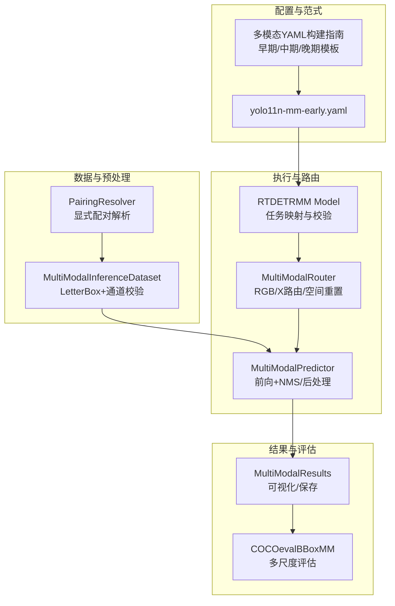
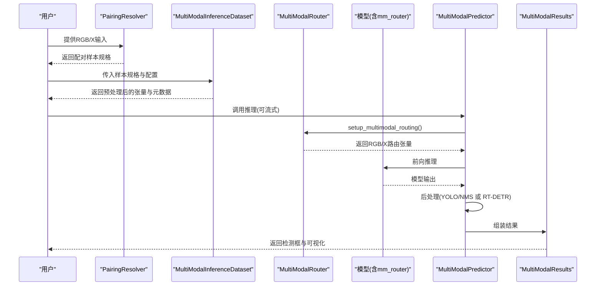
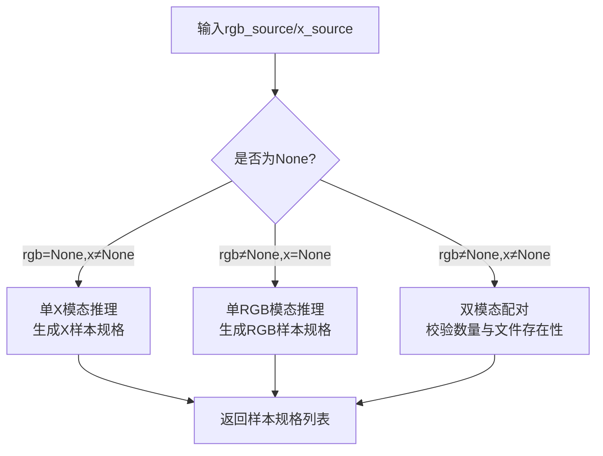
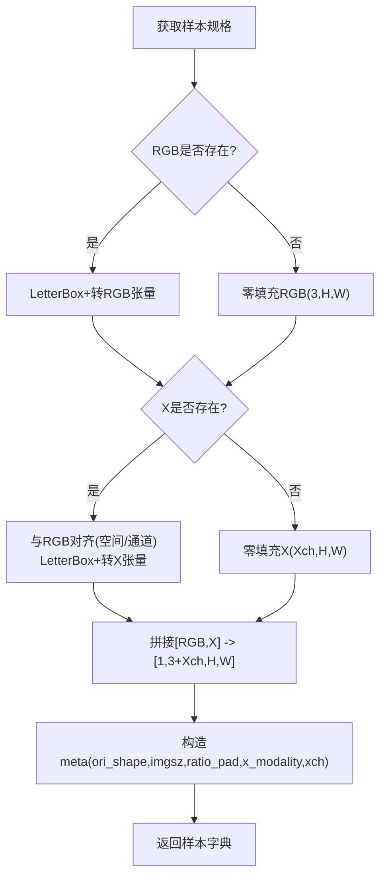
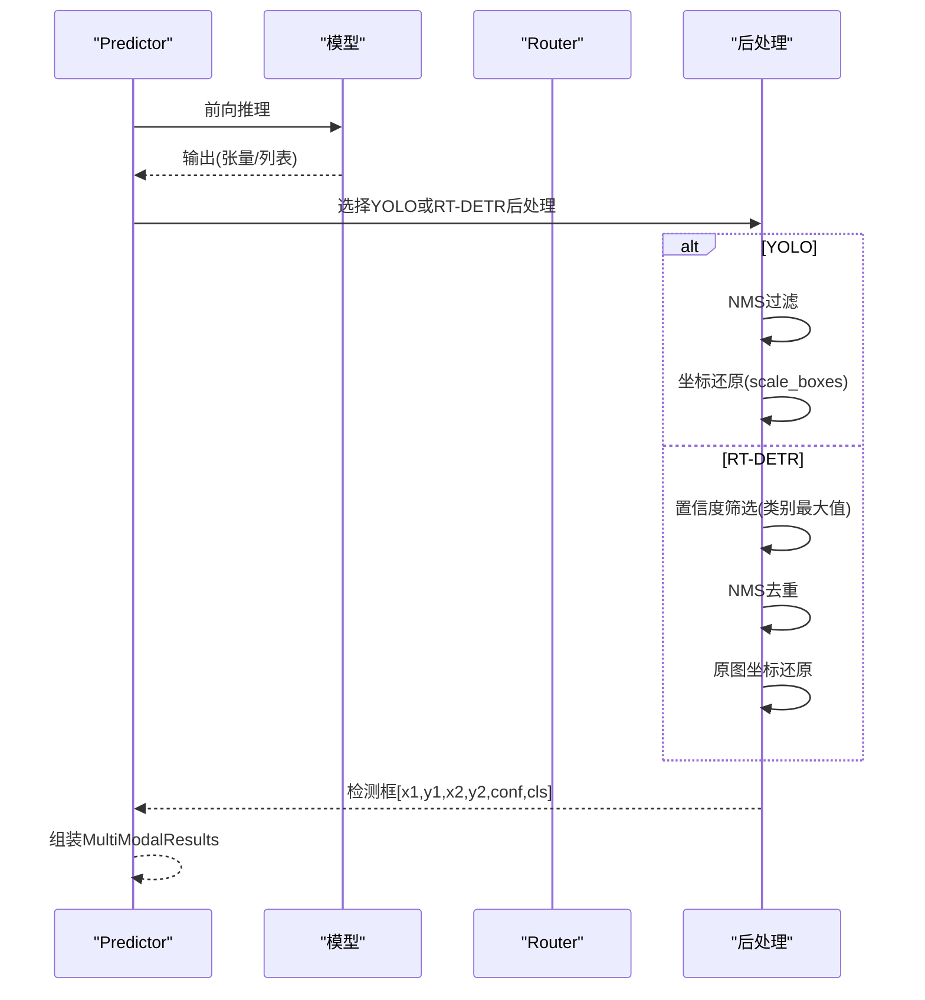
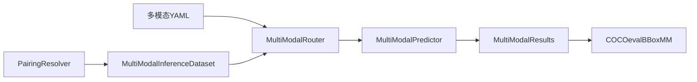

# 多模态融合理论基础

<cite>
**本文档引用的文件**
- [多模态YAML构建指点.md](file://ultralytics/cfg/models/多模态YAML构建指点.md)
- [router.py](file://ultralytics/nn/mm/router.py)
- [pairing.py](file://ultralytics/data/multimodal/pairing.py)
- [inference_dataset.py](file://ultralytics/data/multimodal/inference_dataset.py)
- [predictor.py](file://ultralytics/engine/multimodal/predictor.py)
- [results.py](file://ultralytics/engine/multimodal/results.py)
- [model.py](file://ultralytics/models/rtdetrmm/model.py)
- [yolo11n-mm-early.yaml](file://ultralytics/cfg/models/mm/yolo11n-mm-early.yaml)
- [coco_eval_bbox_mm.py](file://ultralytics/utils/coco_eval_bbox_mm.py)
</cite>

## 目录
1. [引言](#引言)
2. [项目结构](#项目结构)
3. [核心组件](#核心组件)
4. [架构总览](#架构总览)
5. [详细组件分析](#详细组件分析)
6. [依赖关系分析](#依赖关系分析)
7. [性能考量](#性能考量)
8. [故障排查指南](#故障排查指南)
9. [结论](#结论)
10. [附录](#附录)

## 引言
本文件面向多模态融合的理论与实践，围绕RGB可见光与X模态（深度、热成像、激光雷达等）数据的融合机制展开，系统阐述早期融合、中期融合、晚期融合三类技术范式的原理、适用场景与实现要点。结合项目中的路由器（Router）、配对解析器（PairingResolver）、推理引擎（Predictor）与结果容器（Results）等核心组件，给出从数据输入、路由分发、特征提取到后处理的完整链路说明，并提供可操作的配置与验证方法，为后续工程实现提供坚实的理论支撑。

## 项目结构
该项目采用“配置驱动 + 路由器接管”的多模态统一范式，支持YOLO系列与RT-DETR系列的RGB+X融合。关键模块分布如下：
- 配置与范式：多模态YAML构建指南，定义早期/中期/晚期融合模板与字段约定
- 数据与预处理：配对解析器负责显式RGB/X输入配对与校验；推理数据集负责LetterBox预处理与通道一致性
- 路由与执行：路由器根据YAML第5字段进行模态路由与空间重置；推理引擎统一调度前向与后处理
- 结果与评估：结果容器封装可视化与保存；COCO评估器提供多尺度与面积桶评估能力

**图表来源**
- [多模态YAML构建指点.md:1-239](file://ultralytics/cfg/models/多模态YAML构建指点.md#L1-L239)
- [yolo11n-mm-early.yaml:1-59](file://ultralytics/cfg/models/mm/yolo11n-mm-early.yaml#L1-L59)
- [pairing.py:1-203](file://ultralytics/data/multimodal/pairing.py#L1-L203)
- [inference_dataset.py:1-252](file://ultralytics/data/multimodal/inference_dataset.py#L1-L252)
- [router.py:1-471](file://ultralytics/nn/mm/router.py#L1-L471)
- [predictor.py:1-494](file://ultralytics/engine/multimodal/predictor.py#L1-L494)
- [model.py:1-269](file://ultralytics/models/rtdetrmm/model.py#L1-L269)
- [results.py:1-357](file://ultralytics/engine/multimodal/results.py#L1-L357)
- [coco_eval_bbox_mm.py:1-441](file://ultralytics/utils/coco_eval_bbox_mm.py#L1-L441)

**章节来源**
- [多模态YAML构建指点.md:1-239](file://ultralytics/cfg/models/多模态YAML构建指点.md#L1-L239)
- [yolo11n-mm-early.yaml:1-59](file://ultralytics/cfg/models/mm/yolo11n-mm-early.yaml#L1-L59)

## 核心组件
- 多模态路由器（MultiModalRouter）：基于YAML第5字段（RGB/X/Dual）进行输入源解析与路由，支持零拷贝张量视图、空间重置与运行时填充策略
- 配对解析器（PairingResolver）：接收显式RGB/X输入，生成配对样本规格，支持单模态与双模态推理
- 推理数据集（MultiModalInferenceDataset）：加载RGB/X图像，执行LetterBox预处理与通道校验，构造统一张量输入
- 推理引擎（MultiModalPredictor）：统一调度模型前向、YOLO/RT-DETR后处理与结果组装，支持流式推理
- 结果容器（MultiModalResults）：封装检测框、路径、原图与元数据，提供RGB/X可视化与合并图绘制
- RT-DETR多模态模型（RTDETRMM）：基于内容判据识别多模态结构，建立任务映射与路由保障

**章节来源**
- [router.py:1-471](file://ultralytics/nn/mm/router.py#L1-L471)
- [pairing.py:1-203](file://ultralytics/data/multimodal/pairing.py#L1-L203)
- [inference_dataset.py:1-252](file://ultralytics/data/multimodal/inference_dataset.py#L1-L252)
- [predictor.py:1-494](file://ultralytics/engine/multimodal/predictor.py#L1-L494)
- [results.py:1-357](file://ultralytics/engine/multimodal/results.py#L1-L357)
- [model.py:1-269](file://ultralytics/models/rtdetrmm/model.py#L1-L269)

## 架构总览
多模态融合的端到端流程如下：显式配对解析RGB/X输入，数据集进行LetterBox与通道校验，路由器依据YAML第5字段进行模态路由与空间重置，模型前向输出，推理引擎进行后处理（YOLO的NMS或RT-DETR的置信度筛选+NMS），最终封装为结果容器并可保存与可视化。

**图表来源**
- [pairing.py:37-125](file://ultralytics/data/multimodal/pairing.py#L37-L125)
- [inference_dataset.py:94-183](file://ultralytics/data/multimodal/inference_dataset.py#L94-L183)
- [router.py:157-240](file://ultralytics/nn/mm/router.py#L157-L240)
- [predictor.py:163-243](file://ultralytics/engine/multimodal/predictor.py#L163-L243)
- [results.py:436-464](file://ultralytics/engine/multimodal/results.py#L436-L464)

## 详细组件分析

### 多模态路由器（MultiModalRouter）
- 功能职责
  - 解析YAML第5字段，识别RGB/X/Dual输入源
  - 在早期融合（Dual=6ch）与中/晚期融合（RGB/X独立）之间进行路由
  - 支持X模态新输入起点的空间重置，保证不同模态在同尺度上进行特征提取
  - 提供运行时填充策略（如单模态推理时对缺失模态进行零填充或特定策略填充）
- 关键机制
  - setup_multimodal_routing：根据输入通道数判断是否为Dual或RGB/X独立模式，生成RGB/X/Dual视图
  - route_layer_input：依据模块属性将输入路由到对应模态
  - reset_spatial_input：在X模态新输入起点处重置空间尺寸
  - update_dataset_config：动态更新X通道数与X模态类型

**图表来源**
- [router.py:157-240](file://ultralytics/nn/mm/router.py#L157-L240)

**章节来源**
- [router.py:1-471](file://ultralytics/nn/mm/router.py#L1-L471)

### 配对解析器（PairingResolver）
- 功能职责
  - 接收显式RGB/X输入，统一转为列表格式
  - 校验数量匹配与文件存在性，生成样本规格（含id、路径、X模态类型）
  - 支持单RGB或单X模态推理（另一模态以None占位，推理时由数据集零填充）
- 关键点
  - 新API强制显式提供rgb_source与x_source，不支持隐式列表格式
  - 单模态推理时，仍生成配对规格，便于下游统一处理

**图表来源**
- [pairing.py:37-125](file://ultralytics/data/multimodal/pairing.py#L37-L125)

**章节来源**
- [pairing.py:1-203](file://ultralytics/data/multimodal/pairing.py#L1-L203)

### 推理数据集（MultiModalInferenceDataset）
- 功能职责
  - 加载RGB/X图像，执行LetterBox预处理与归一化
  - 对齐RGB与X的空间尺寸，校验X通道数（Xch）
  - 拼接为[RGB,X]张量，构造包含路径、原图、元数据与张量的样本
- 关键点
  - 推理模式不走标签缓存，不要求标签存在
  - Xch可任意，动态适配Router配置，支持单模态零填充

**图表来源**
- [inference_dataset.py:94-183](file://ultralytics/data/multimodal/inference_dataset.py#L94-L183)

**章节来源**
- [inference_dataset.py:1-252](file://ultralytics/data/multimodal/inference_dataset.py#L1-L252)

### 推理引擎（MultiModalPredictor）
- 功能职责
  - 从模型读取mm_router配置，识别X模态类型与通道数
  - 统一调度前向、YOLO/NMS或RT-DETR后处理、坐标还原与结果组装
  - 支持流式推理（边迭代边yield），可选保存可视化与文本标签
- 关键点
  - 自动识别模型类型（YOLO或RTDETR），分别进行后处理
  - RT-DETR后处理包含置信度筛选、NMS与原图坐标还原

**图表来源**
- [predictor.py:163-243](file://ultralytics/engine/multimodal/predictor.py#L163-L243)

**章节来源**
- [predictor.py:1-494](file://ultralytics/engine/multimodal/predictor.py#L1-L494)

### 结果容器（MultiModalResults）
- 功能职责
  - 封装检测框、路径、原图与元数据
  - 提供RGB标注与X标注（当xch∈{1,3}且X真实存在时）
  - 支持并排合并图绘制与YOLO格式文本保存
- 关键点
  - 单模态推理时，缺失模态不返回，但RGB占位图可用于保存流程
  - JSON保存包含模态标识与归一化坐标

**章节来源**
- [results.py:1-357](file://ultralytics/engine/multimodal/results.py#L1-L357)

### RT-DETR多模态模型（RTDETRMM）
- 功能职责
  - 基于内容判据识别多模态结构，确保输入通道与模态集合正确
  - 建立任务映射（predictor/validator/trainer/model），并确保mm_router可用
  - 提供可视化入口与验证入口（默认rect=False以避免RT-DETR在非方形输入下的缩放假设偏差）

**章节来源**
- [model.py:1-269](file://ultralytics/models/rtdetrmm/model.py#L1-L269)

## 依赖关系分析
- 配置驱动：多模态YAML通过第5字段（RGB/X/Dual）定义路由，路由器据此解析通道与输入起点
- 数据侧：PairingResolver与InferenceDataset保证输入合法性与一致性，LetterBox与通道校验确保空间与通道对齐
- 执行侧：Router在模型内部完成路由与空间重置，Predictor统一调度前后处理
- 评估侧：COCO评估器提供多尺度与面积桶评估，支持每类指标统计

**图表来源**
- [多模态YAML构建指点.md:20-64](file://ultralytics/cfg/models/多模态YAML构建指点.md#L20-L64)
- [router.py:90-156](file://ultralytics/nn/mm/router.py#L90-L156)
- [pairing.py:37-125](file://ultralytics/data/multimodal/pairing.py#L37-L125)
- [inference_dataset.py:94-183](file://ultralytics/data/multimodal/inference_dataset.py#L94-L183)
- [predictor.py:163-243](file://ultralytics/engine/multimodal/predictor.py#L163-L243)
- [results.py:235-357](file://ultralytics/engine/multimodal/results.py#L235-L357)
- [coco_eval_bbox_mm.py:27-441](file://ultralytics/utils/coco_eval_bbox_mm.py#L27-L441)

**章节来源**
- [多模态YAML构建指点.md:1-239](file://ultralytics/cfg/models/多模态YAML构建指点.md#L1-L239)
- [router.py:1-471](file://ultralytics/nn/mm/router.py#L1-L471)
- [pairing.py:1-203](file://ultralytics/data/multimodal/pairing.py#L1-L203)
- [inference_dataset.py:1-252](file://ultralytics/data/multimodal/inference_dataset.py#L1-L252)
- [predictor.py:1-494](file://ultralytics/engine/multimodal/predictor.py#L1-L494)
- [results.py:1-357](file://ultralytics/engine/multimodal/results.py#L1-L357)
- [coco_eval_bbox_mm.py:1-441](file://ultralytics/utils/coco_eval_bbox_mm.py#L1-L441)

## 性能考量
- 早期融合（Dual=6ch）：输入层直接融合，结构最简，计算开销低，适合RGB与X模态空间/语义高度对齐的场景
- 中期融合（RGB/X双分支至P3/P4后Concat）：在中等尺度融合，兼顾细节与语义，适合互补但差异较大的模态
- 晚期融合（各自独立检测后推理阶段融合）：两路完全独立，鲁棒性最高，但需在后处理阶段自行合并结果
- 运行时策略：路由器支持运行时填充策略（如单模态推理时对缺失模态进行特定填充），以减少结构变更带来的开销
- LetterBox与通道校验：统一预处理与通道一致性，避免运行时形状不匹配导致的性能损耗

[本节为通用性能讨论，不直接分析具体文件]

## 故障排查指南
- 通道不匹配
  - 现象：报错提示期望X通道但得到Y
  - 排查：检查data.yaml中的Xch与真实数据一致；确认Dual仅在输入起点使用；检查第5字段标注是否正确
- 模块未导入
  - 现象：ImportError提示模块在YAML中使用但未找到
  - 排查：确认模块在相应__init__.py或extra_modules中已正确导出
- 结果融合
  - 说明：示例中DecisionFusion为占位注释，需自行实现或替换为外部融合脚本
- 运行确认
  - 建议：使用profile=True查看Router路由日志（RGB/X/Dual形状、空间重置信息）

**章节来源**
- [多模态YAML构建指点.md:206-225](file://ultralytics/cfg/models/多模态YAML构建指点.md#L206-L225)

## 结论
本项目以“配置驱动 + 路由器接管”为核心，实现了RGB+X多模态融合的统一范式。通过路由器在模型内部完成模态路由与空间重置，配合显式配对解析与统一预处理，形成从数据到推理再到评估的完整闭环。早期/中期/晚期三种融合策略各有侧重，可根据模态互补性与任务需求灵活选择。建议在工程实践中遵循YAML第5字段规范、严格校验Xch与通道一致性，并结合运行时策略与评估指标持续优化融合效果。

[本节为总结性内容，不直接分析具体文件]

## 附录

### 技术分类与应用场景
- 早期融合（Early Fusion）
  - 特点：输入直接为Dual(6ch)，后续走单路主干与头部
  - 适用：模态空间/语义高度对齐，期望最小改造与最快速度
  - 参考：早期融合模板与yolo11n-mm-early.yaml
- 中期融合（Mid Fusion）
  - 特点：RGB/X双分支分别至P3/P4再Concat融合
  - 适用：模态互补明显但仍希望共享部分高语义表征
- 晚期融合（Late Fusion）
  - 特点：RGB/X各自独立检测，最终在推理层面做决策融合
  - 适用：两路完全独立、鲁棒性最高；需在推理或后处理阶段自行合并结果

**章节来源**
- [多模态YAML构建指点.md:68-118](file://ultralytics/cfg/models/多模态YAML构建指点.md#L68-L118)
- [yolo11n-mm-early.yaml:19-59](file://ultralytics/cfg/models/mm/yolo11n-mm-early.yaml#L19-L59)

### 数学与算法要点（概念性说明）
- 融合策略选择
  - 互补性：不同模态在不同场景下提供互补信息，中期融合在中等尺度进行特征融合，兼顾细节与语义
  - 冗余性：同一模态在不同尺度或不同网络层可能携带冗余信息，可通过早期融合在底层整合，降低高层冗余
- 后处理流程
  - YOLO：NMS过滤，坐标还原（scale_boxes）
  - RT-DETR：置信度筛选（类别最大值），NMS去重，原图坐标还原
- 评估指标
  - COCO评估器提供多尺度与面积桶评估，支持每类指标统计，便于分析不同尺寸与IoU阈值下的性能

**章节来源**
- [predictor.py:196-243](file://ultralytics/engine/multimodal/predictor.py#L196-L243)
- [coco_eval_bbox_mm.py:27-441](file://ultralytics/utils/coco_eval_bbox_mm.py#L27-L441)