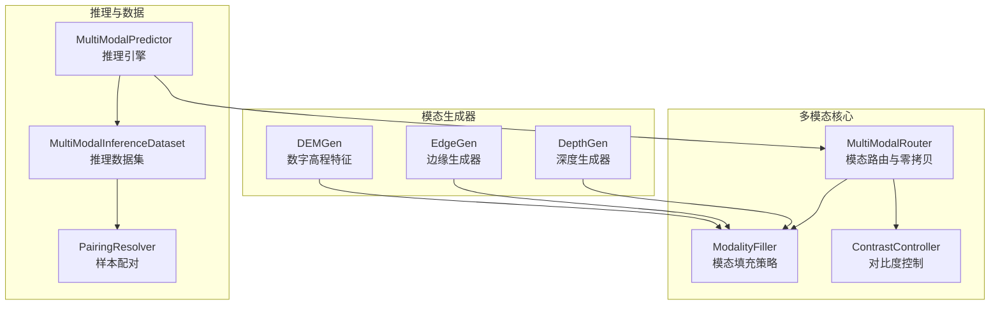
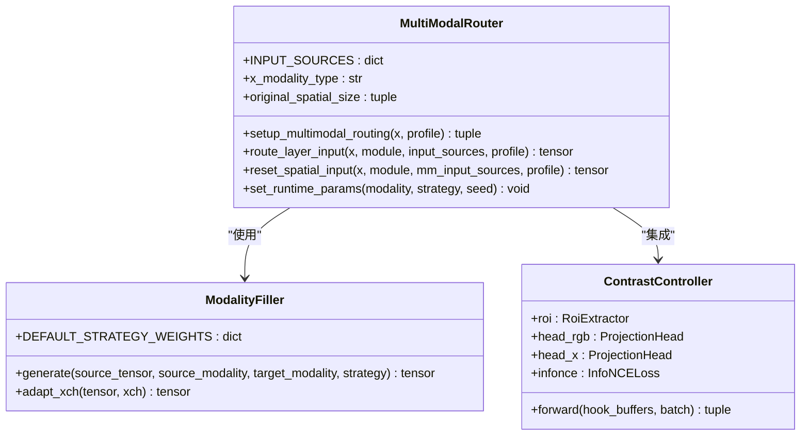
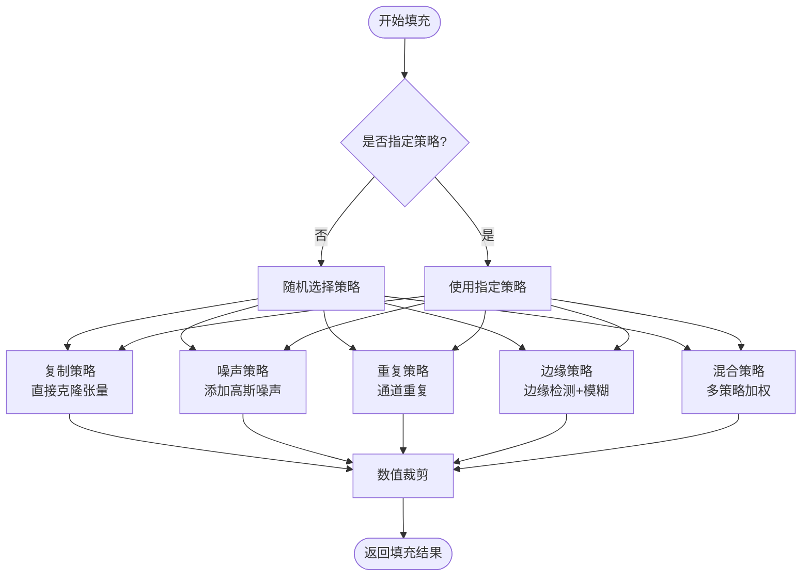
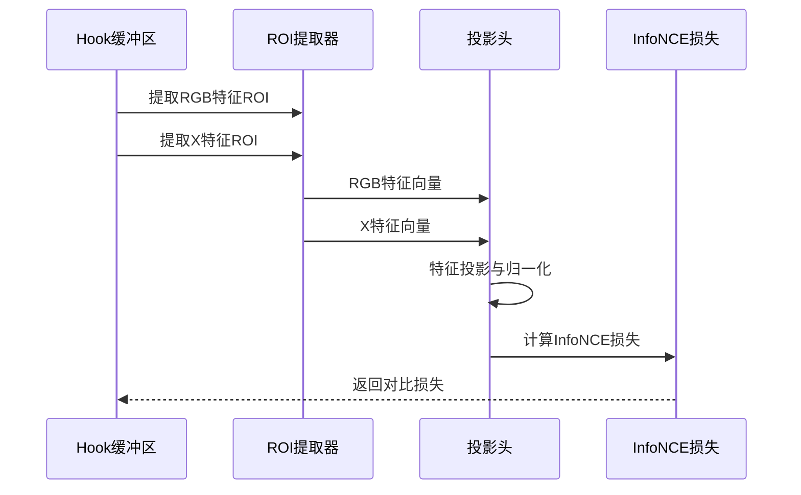
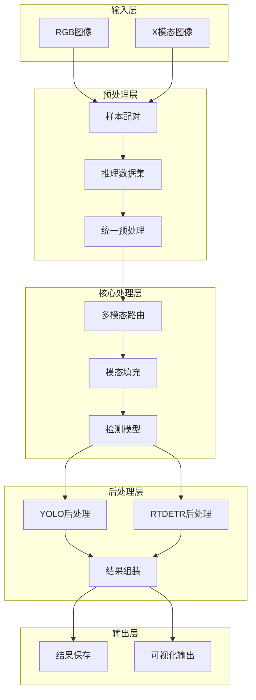
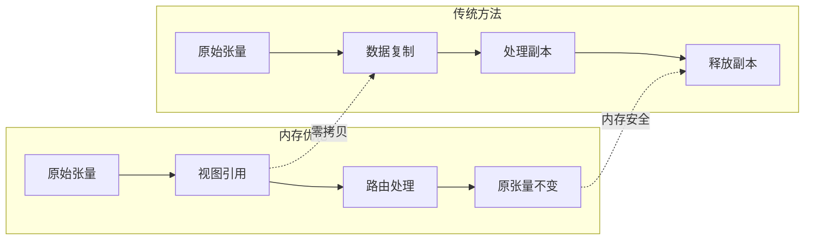
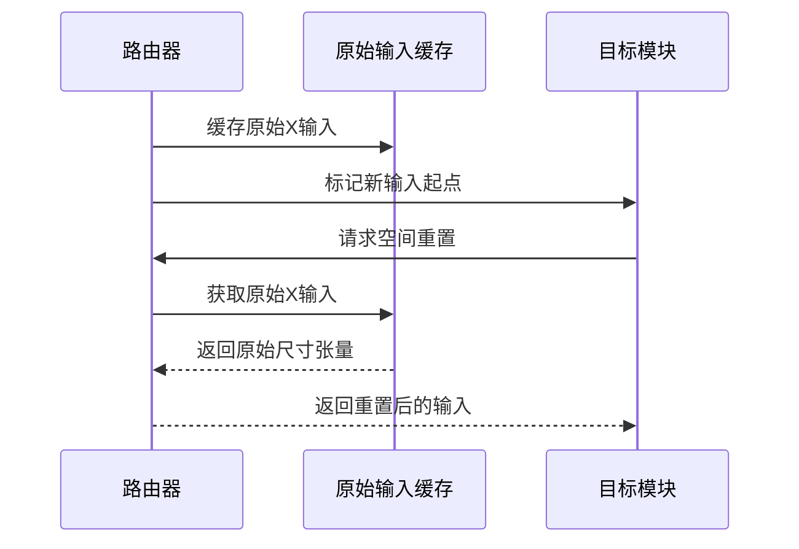
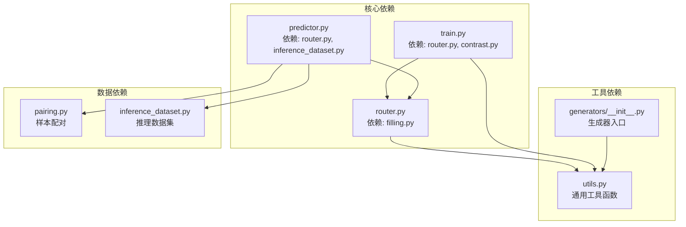

# 核心概念与理论基础

<cite>
**本文档引用的文件**
- [ultralytics\nn\mm\router.py](file://ultralytics\nn\mm\router.py)
- [ultralytics\nn\mm\filling.py](file://ultralytics\nn\mm\filling.py)
- [ultralytics\nn\mm\contrast.py](file://ultralytics\nn\mm\contrast.py)
- [ultralytics\nn\mm\generators\depth_anything_v2.py](file://ultralytics\nn\mm\generators\depth_anything_v2.py)
- [ultralytics\nn\mm\generators\__init__.py](file://ultralytics\nn\mm\generators\__init__.py)
- [ultralytics\nn\mm\utils.py](file://ultralytics\nn\mm\utils.py)
- [ultralytics\models\yolo\multimodal\__init__.py](file://ultralytics\models\yolo\multimodal\__init__.py)
- [ultralytics\models\yolo\multimodal\train.py](file://ultralytics\models\yolo\multimodal\train.py)
- [ultralytics\engine\multimodal\predictor.py](file://ultralytics\engine\multimodal\predictor.py)
- [ultralytics\data\multimodal\inference_dataset.py](file://ultralytics\data\multimodal\inference_dataset.py)
- [ultralytics\data\multimodal\pairing.py](file://ultralytics\data\multimodal\pairing.py)
- [ultralytics\nn\mm\generators\edge.py](file://ultralytics\nn\mm\generators\edge.py)
- [ultralytics\nn\mm\generators\dem_features.py](file://ultralytics\nn\mm\generators\dem_features.py)
</cite>

## 目录
1. [引言](#引言)
2. [项目结构](#项目结构)
3. [核心组件](#核心组件)
4. [架构概览](#架构概览)
5. [详细组件分析](#详细组件分析)
6. [依赖关系分析](#依赖关系分析)
7. [性能考虑](#性能考虑)
8. [故障排除指南](#故障排除指南)
9. [结论](#结论)

## 引言

本文件为多模态检测系统提供核心概念与理论基础文档。系统支持RGB与其他模态（如深度、热红外、激光雷达等）的联合检测，通过模态路由机制、零拷贝优化技术和模态填充策略实现高效稳定的多模态处理。本文档旨在帮助读者建立扎实的理论基础，理解MultiModalRouter的工作原理、模态生成器的设计思想以及对比度控制系统的基础理论。

## 项目结构

多模态检测系统采用模块化设计，核心组件分布如下：

- **路由与数据流**：MultiModalRouter负责RGB+X模态的路由与零拷贝数据流控制
- **模态填充**：ModalityFiller提供多种轻量级填充策略，支持通道适配
- **对比度控制**：ContrastController实现基于ROI的对比学习，提升跨模态特征对齐
- **模态生成器**：DepthGen、EdgeGen、DEMGen等生成器提供离线模态合成能力
- **推理引擎**：MultiModalPredictor实现独立的多模态推理流程
- **数据集与配对**：MultiModalInferenceDataset与PairingResolver负责样本配对与预处理

**图表来源**
- [ultralytics\nn\mm\router.py:11-471](file://ultralytics\nn\mm\router.py#L11-L471)
- [ultralytics\nn\mm\filling.py:14-175](file://ultralytics\nn\mm\filling.py#L14-L175)
- [ultralytics\nn\mm\contrast.py:149-290](file://ultralytics\nn\mm\contrast.py#L149-L290)
- [ultralytics\nn\mm\generators\depth_anything_v2.py:72-520](file://ultralytics\nn\mm\generators\depth_anything_v2.py#L72-L520)
- [ultralytics\engine\multimodal\predictor.py:16-494](file://ultralytics\engine\multimodal\predictor.py#L16-L494)
- [ultralytics\data\multimodal\inference_dataset.py:16-252](file://ultralytics\data\multimodal\inference_dataset.py#L16-L252)
- [ultralytics\data\multimodal\pairing.py:11-203](file://ultralytics\data\multimodal\pairing.py#L11-L203)

**章节来源**
- [ultralytics\models\yolo\multimodal\__init__.py:1-152](file://ultralytics\models\yolo\multimodal\__init__.py#L1-L152)

## 核心组件

### 多模态路由系统（MultiModalRouter）

MultiModalRouter是系统的核心数据流控制器，支持以下特性：
- **模态路由标识**：通过配置文件的第5字段标识RGB、X或Dual输入
- **零拷贝优化**：使用张量视图而非数据复制，显著降低内存占用
- **空间重置机制**：支持X模态新输入起点的空间尺寸重置
- **通道适配**：动态适配不同模态的通道数需求

**图表来源**
- [ultralytics\nn\mm\router.py:11-471](file://ultralytics\nn\mm\router.py#L11-L471)
- [ultralytics\nn\mm\filling.py:14-175](file://ultralytics\nn\mm\filling.py#L14-L175)
- [ultralytics\nn\mm\contrast.py:149-290](file://ultralytics\nn\mm\contrast.py#L149-L290)

### 模态填充策略

模态填充系统提供多种轻量级策略，确保在单模态场景下能够生成合理的缺失模态数据：

- **复制填充**：直接复制源模态数据
- **噪声填充**：在源数据基础上添加高斯噪声
- **通道重复**：将单通道数据重复为3通道
- **边缘模糊**：基于边缘检测的模糊处理
- **混合填充**：多种策略的加权组合

**图表来源**
- [ultralytics\nn\mm\filling.py:35-118](file://ultralytics\nn\mm\filling.py#L35-L118)

### 对比度控制系统

对比度控制系统基于InfoNCE损失函数，通过ROI提取和投影头实现跨模态特征对齐：

- **ROI提取器**：从GT框中提取感兴趣区域特征
- **投影头**：两层MLP网络，输出L2归一化嵌入
- **InfoNCE损失**：对称的负温度交叉熵损失
- **阶段选择**：支持P3/P4/P5等不同特征阶段

**图表来源**
- [ultralytics\nn\mm\contrast.py:189-290](file://ultralytics\nn\mm\contrast.py#L189-L290)

**章节来源**
- [ultralytics\nn\mm\router.py:11-471](file://ultralytics\nn\mm\router.py#L11-L471)
- [ultralytics\nn\mm\filling.py:14-175](file://ultralytics\nn\mm\filling.py#L14-L175)
- [ultralytics\nn\mm\contrast.py:149-290](file://ultralytics\nn\mm\contrast.py#L149-L290)

## 架构概览

系统采用分层架构设计，从底层的模态路由到上层的推理引擎形成完整的处理链路：

**图表来源**
- [ultralytics\engine\multimodal\predictor.py:99-244](file://ultralytics\engine\multimodal\predictor.py#L99-L244)
- [ultralytics\data\multimodal\inference_dataset.py:94-184](file://ultralytics\data\multimodal\inference_dataset.py#L94-L184)
- [ultralytics\data\multimodal\pairing.py:37-126](file://ultralytics\data\multimodal\pairing.py#L37-L126)

## 详细组件分析

### MultiModalRouter工作原理

MultiModalRouter通过以下机制实现高效的模态路由：

#### 零拷贝优化技术

系统通过张量视图而非数据复制实现零拷贝优化：

**图表来源**
- [ultralytics\nn\mm\router.py:335-340](file://ultralytics\nn\mm\router.py#L335-L340)

#### 模态路由机制

路由系统支持三种模态输入模式：

| 模态类型 | 通道数 | 描述 | 使用场景 |
|---------|--------|------|----------|
| RGB | 3 | 可见光彩色图像 | 标准视觉检测 |
| X | 可变 | 其他模态（深度、热红外等） | 特殊环境检测 |
| Dual | 3+X | RGB+X拼接输入 | 早期融合策略 |

#### 空间重置机制

X模态新输入起点支持空间尺寸重置：

**图表来源**
- [ultralytics\nn\mm\router.py:365-404](file://ultralytics\nn\mm\router.py#L365-L404)

**章节来源**
- [ultralytics\nn\mm\router.py:157-404](file://ultralytics\nn\mm\router.py#L157-L404)

### 模态生成器设计思想

模态生成器采用工厂模式设计，支持多种模态的离线生成：

#### 深度生成器（DepthGen）

基于Depth-Anything-V2框架的深度图生成器：

- **编码器支持**：vits/vitb/vitl/vitg多种配置
- **后处理优化**：支持直方图均衡、双边滤波等
- **批量处理**：支持大规模数据集的离线生成

#### 边缘生成器（EdgeGen）

基于传统图像处理的边缘特征提取：

- **多算法支持**：Sobel、Canny、Scharr等边缘检测
- **纹理特征**：LBP纹理描述符
- **梯度分析**：幅度和方向的综合分析

#### 数字高程特征（DEMGen）

专门针对地形特征的模态生成：

- **高程信息提取**：基于数字高程模型
- **坡度分析**：地形坡度和方向计算
- **特征融合**：与RGB图像的多尺度融合

**章节来源**
- [ultralytics\nn\mm\generators\depth_anything_v2.py:72-520](file://ultralytics\nn\mm\generators\depth_anything_v2.py#L72-L520)
- [ultralytics\nn\mm\generators\__init__.py:6-14](file://ultralytics\nn\mm\generators\__init__.py#L6-L14)

### 对比度控制系统理论基础

对比度控制系统基于对比学习理论，通过以下机制实现跨模态对齐：

#### ROI特征提取

基于GT框的感兴趣区域提取机制：

- **坐标转换**：从归一化坐标转换到特征图坐标
- **平均池化**：对ROI区域进行全局平均池化
- **批量处理**：支持多图像、多框的批量特征提取

#### 投影网络设计

两层MLP投影网络的设计考量：

- **第一层**：动态线性层，支持懒初始化
- **激活函数**：ReLU确保非线性特征映射
- **第二层**：输出固定维度的L2归一化嵌入

#### InfoNCE损失函数

对称的负温度交叉熵损失：

- **对称性**：同时考虑RGB→X和X→RGB的双向对齐
- **温度参数**：控制分布的锐利程度
- **数值稳定性**：在FP32环境下计算，避免数值问题

**章节来源**
- [ultralytics\nn\mm\contrast.py:149-290](file://ultralytics\nn\mm\contrast.py#L149-L290)

## 依赖关系分析

系统采用松耦合的模块化设计，各组件间的依赖关系清晰：

**图表来源**
- [ultralytics\nn\mm\router.py:5-9](file://ultralytics\nn\mm\router.py#L5-L9)
- [ultralytics\models\yolo\multimodal\train.py:6-13](file://ultralytics\models\yolo\multimodal\train.py#L6-L13)
- [ultralytics\engine\multimodal\predictor.py:9-13](file://ultralytics\engine\multimodal\predictor.py#L9-L13)

**章节来源**
- [ultralytics\nn\mm\utils.py:8-93](file://ultralytics\nn\mm\utils.py#L8-L93)
- [ultralytics\nn\mm\generators\__init__.py:1-15](file://ultralytics\nn\mm\generators\__init__.py#L1-L15)

## 性能考虑

### 内存优化策略

1. **零拷贝张量视图**：通过张量视图而非数据复制减少内存占用
2. **缓存机制**：原生X模态输入的缓存避免重复计算
3. **通道适配优化**：线性投影的高效通道转换

### 计算效率优化

1. **轻量级填充策略**：避免复杂的深度学习模型依赖
2. **批处理优化**：生成器支持批量处理提升吞吐量
3. **推理加速**：独立推理引擎避免不必要的依赖

### 扩展性设计

1. **配置驱动**：通过配置文件灵活调整模态组合
2. **插件化架构**：新的模态生成器可无缝集成
3. **多架构支持**：同时支持YOLO和RTDETR架构

## 故障排除指南

### 常见问题诊断

#### 模态路由错误

**症状**：路由模块报错或输出异常
**排查步骤**：
1. 检查配置文件第5字段的模态标识
2. 验证输入张量的通道数匹配
3. 确认X模态新输入起点的标记

#### 模态填充异常

**症状**：填充后的模态质量不佳
**排查步骤**：
1. 检查填充策略权重配置
2. 验证输入张量的数据范围
3. 确认通道适配函数的正确性

#### 对比度学习失效

**症状**：对比损失为NaN或不收敛
**排查步骤**：
1. 检查ROI提取的边界有效性
2. 验证特征投影的数值稳定性
3. 确认InfoNCE损失的温度参数设置

**章节来源**
- [ultralytics\nn\mm\utils.py:37-78](file://ultralytics\nn\mm\utils.py#L37-L78)

## 结论

多模态检测系统通过精心设计的路由机制、零拷贝优化技术和智能填充策略，实现了RGB与其他模态的高效融合。MultiModalRouter提供了灵活的模态路由能力，ModalityFiller确保了在单模态场景下的数据完整性，ContrastController则通过对比学习提升了跨模态特征对齐效果。这些核心技术共同构成了系统稳定可靠的理论基础，为后续的工程实现提供了坚实的指导。