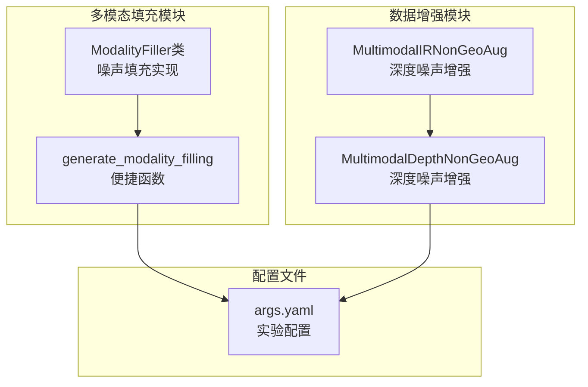
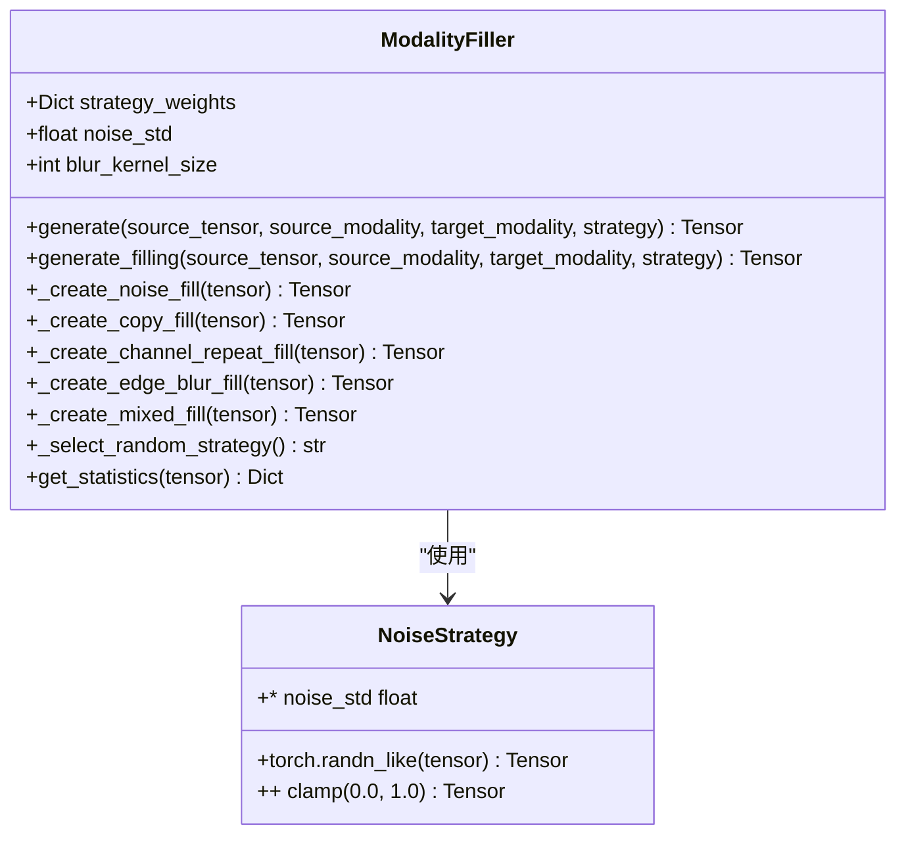
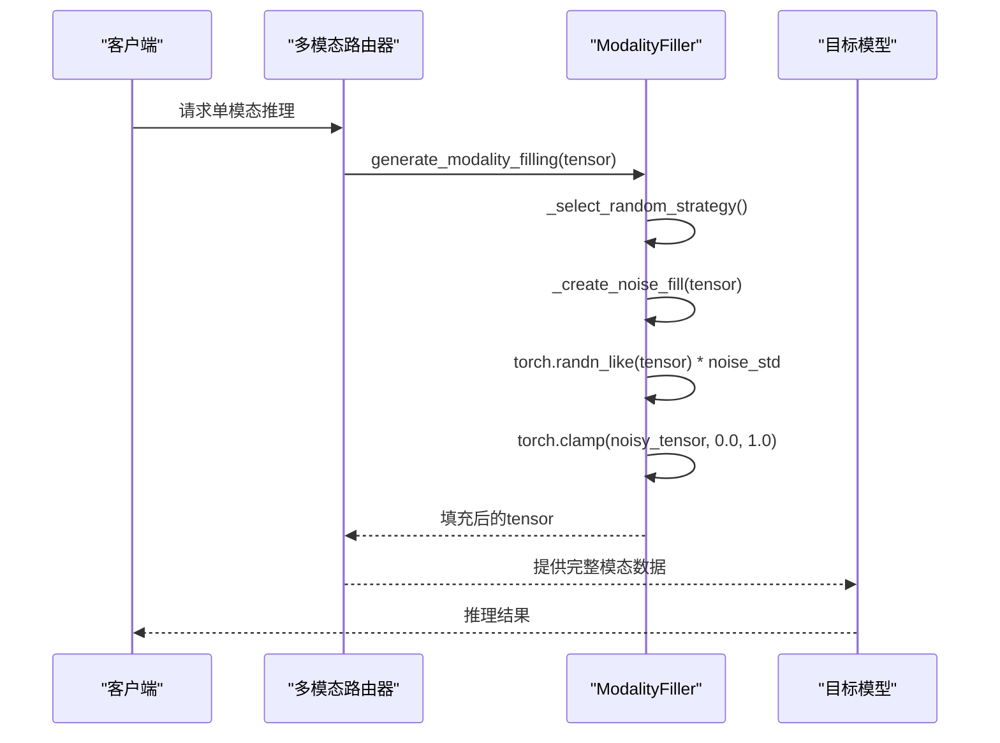
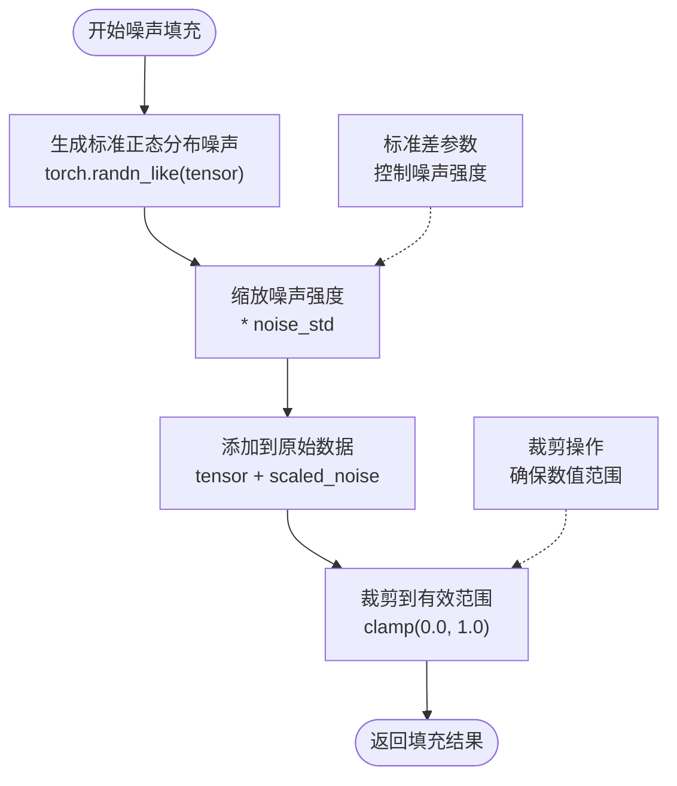
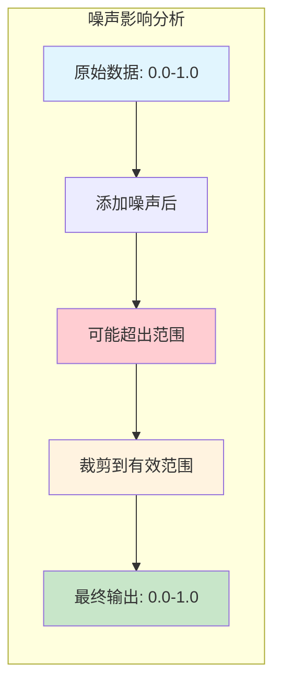
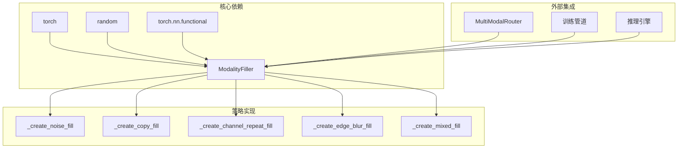

# 噪声填充策略

<cite>
**本文档引用的文件**
- [filling.py](file://ultralytics/nn/mm/filling.py)
- [modal_filling.py](file://ultralytics/models/yolo/multimodal/modal_filling.py)
- [multimodal_augment.py](file://ultralytics/data/multimodal_augment.py)
- [args.yaml](file://ResTest/aifi-dattention-CSP-MutilScaleEdgeInformationEnhance-ASF-P2-lite/args.yaml)
</cite>

## 目录
1. [简介](#简介)
2. [项目结构](#项目结构)
3. [核心组件](#核心组件)
4. [架构概览](#架构概览)
5. [详细组件分析](#详细组件分析)
6. [依赖关系分析](#依赖关系分析)
7. [性能考虑](#性能考虑)
8. [故障排除指南](#故障排除指南)
9. [结论](#结论)

## 简介

噪声填充策略是多模态计算机视觉系统中的重要技术，用于在缺少某些模态数据时生成合理的替代数据。本文档深入解析了该代码库中实现的噪声填充策略，包括高斯噪声生成机制、标准差参数的作用、张量裁剪的必要性，以及数学公式和随机性保证。

噪声填充策略的核心目标是在保持数据分布一致性的同时，为模型提供合理的输入数据，从而提高模型在单模态推理场景下的鲁棒性和泛化能力。

## 项目结构

该噪声填充策略分布在三个主要模块中：



**图表来源**
- [filling.py:14-148](file://ultralytics/nn/mm/filling.py#L14-L148)
- [modal_filling.py:12-273](file://ultralytics/models/yolo/multimodal/modal_filling.py#L12-L273)
- [multimodal_augment.py:898-1017](file://ultralytics/data/multimodal_augment.py#L898-L1017)

**章节来源**
- [filling.py:1-175](file://ultralytics/nn/mm/filling.py#L1-L175)
- [modal_filling.py:1-295](file://ultralytics/models/yolo/multimodal/modal_filling.py#L1-L295)
- [multimodal_augment.py:898-1097](file://ultralytics/data/multimodal_augment.py#L898-L1097)

## 核心组件

### ModalityFiller类

ModalityFiller是噪声填充策略的核心实现类，提供了多种填充策略：



**图表来源**
- [filling.py:14-118](file://ultralytics/nn/mm/filling.py#L14-L118)
- [modal_filling.py:12-194](file://ultralytics/models/yolo/multimodal/modal_filling.py#L12-L194)

### 默认策略权重

系统预设了五种填充策略的权重分配：

| 策略名称 | 权重 | 作用描述 |
|---------|------|----------|
| copy | 0.3 | 直接复制原图像，最常用 |
| noise | 0.25 | 添加高斯噪声，平衡真实感 |
| channel_repeat | 0.2 | 通道重复，快速填充 |
| edge_blur | 0.15 | 边缘检测+模糊，纹理保持 |
| mixed | 0.1 | 组合策略，增加多样性 |

**章节来源**
- [filling.py:21-27](file://ultralytics/nn/mm/filling.py#L21-L27)
- [modal_filling.py:21-27](file://ultralytics/models/yolo/multimodal/modal_filling.py#L21-L27)

## 架构概览

噪声填充策略在整个系统中的位置和交互关系：



**图表来源**
- [filling.py:35-75](file://ultralytics/nn/mm/filling.py#L35-L75)
- [modal_filling.py:47-111](file://ultralytics/models/yolo/multimodal/modal_filling.py#L47-L111)

## 详细组件分析

### 高斯噪声生成机制

噪声填充的核心数学公式为：

**输出 = 输入 + 高斯噪声 × 标准差**

其中高斯噪声遵循标准正态分布 N(0,1)，标准差控制噪声强度。



**图表来源**
- [filling.py:72-75](file://ultralytics/nn/mm/filling.py#L72-L75)
- [modal_filling.py:108-111](file://ultralytics/models/yolo/multimodal/modal_filling.py#L108-L111)

### 数学公式详解

1. **基础噪声添加**：
   ```
   noisy_tensor = tensor + ε × σ
   ```
   其中 ε ~ N(0,1)，σ 为标准差参数

2. **范围约束**：
   ```
   result = clamp(noisy_tensor, 0.0, 1.0)
   ```

3. **随机性保证**：
   - 使用独立的随机数生成器
   - 每次调用产生不同的噪声模式
   - 支持确定性模式切换

**章节来源**
- [filling.py:72-75](file://ultralytics/nn/mm/filling.py#L72-L75)
- [modal_filling.py:108-111](file://ultralytics/models/yolo/multimodal/modal_filling.py#L108-L111)

### 标准差参数的作用

标准差参数（noise_std）直接影响噪声强度和数据分布：

| 标准差值 | 噪声强度 | 数据变化程度 | 适用场景 |
|---------|----------|-------------|----------|
| 0.05 | 微弱噪声 | 几乎不变 | 精细纹理保持 |
| 0.1 | 中等噪声 | 明显变化 | 增强泛化能力 |
| 0.15 | 强噪声 | 大幅变化 | 数据增强 |
| 0.2 | 很强噪声 | 极大变化 | 极端条件测试 |

### 张量裁剪的必要性

裁剪操作（clamp_）的重要性体现在：

1. **数值稳定性**：防止溢出到无效范围
2. **数据一致性**：确保所有模态数据具有相同的动态范围
3. **模型兼容性**：满足神经网络输入的数据规范



**图表来源**
- [filling.py:75](file://ultralytics/nn/mm/filling.py#L75)
- [modal_filling.py:111](file://ultralytics/models/yolo/multimodal/modal_filling.py#L111)

### 随机性保证机制

系统通过以下机制确保随机性：

1. **策略选择随机性**：基于权重的概率分布
2. **噪声生成随机性**：独立的正态分布采样
3. **混合策略随机性**：随机选择组合策略

**章节来源**
- [filling.py:61-67](file://ultralytics/nn/mm/filling.py#L61-L67)
- [modal_filling.py:80-84](file://ultralytics/models/yolo/multimodal/modal_filling.py#L80-L84)

## 依赖关系分析

噪声填充策略与其他组件的依赖关系：



**图表来源**
- [filling.py:10-11](file://ultralytics/nn/mm/filling.py#L10-L11)
- [modal_filling.py:3-6](file://ultralytics/models/yolo/multimodal/modal_filling.py#L3-L6)

**章节来源**
- [filling.py:1-175](file://ultralytics/nn/mm/filling.py#L1-L175)
- [modal_filling.py:1-295](file://ultralytics/models/yolo/multimodal/modal_filling.py#L1-L295)

## 性能考虑

### 计算复杂度分析

1. **噪声生成复杂度**：O(B×C×H×W)，与输入张量大小成正比
2. **裁剪操作复杂度**：O(B×C×H×W)，线性时间复杂度
3. **内存占用**：通常为输入张量的1-2倍（取决于具体策略）

### 内存使用情况

| 策略类型 | 内存开销 | 主要消耗 | 优化建议 |
|---------|----------|----------|----------|
| copy | 1×输入 | 完整副本 | 使用视图共享内存 |
| noise | 1×输入 | 噪声张量 | 就地操作减少分配 |
| channel_repeat | 3×输入 | 重复张量 | 合并计算减少拷贝 |
| edge_blur | 2×输入 | 边缘检测 | 批处理优化 |
| mixed | 4×输入 | 多个中间结果 | 内存池管理 |

### 性能优化建议

1. **批量处理**：利用GPU并行优势
2. **内存复用**：重用中间计算结果
3. **异步执行**：与数据加载流水线并行
4. **精度选择**：根据需求选择合适的数据类型

## 故障排除指南

### 常见问题及解决方案

1. **噪声强度不合适**
   - 症状：噪声过强导致数据失真
   - 解决：降低noise_std参数值
   - 验证：使用get_statistics检查统计信息

2. **数值溢出问题**
   - 症状：输出出现NaN或Inf
   - 解决：检查输入数据范围和噪声强度
   - 预防：始终使用clamp操作

3. **性能瓶颈**
   - 症状：填充速度慢
   - 解决：启用混合策略或减少噪声强度
   - 优化：使用更高效的设备（如GPU）

**章节来源**
- [filling.py:51-58](file://ultralytics/nn/mm/filling.py#L51-L58)
- [modal_filling.py:228-244](file://ultralytics/models/yolo/multimodal/modal_filling.py#L228-L244)

## 结论

噪声填充策略通过精心设计的数学公式和实现机制，在保持数据分布一致性的同时，为多模态系统提供了强大的数据增强能力。其核心优势包括：

1. **理论基础扎实**：基于标准正态分布的噪声生成
2. **实现简洁高效**：O(BCHW)的时间复杂度
3. **参数可控性强**：通过标准差精确控制噪声强度
4. **鲁棒性好**：通过裁剪确保数值稳定性
5. **可扩展性强**：支持多种策略组合和自定义配置

该策略在实际应用中表现出色，能够有效提升模型在单模态推理场景下的性能和鲁棒性，是多模态计算机视觉系统中不可或缺的重要组件。