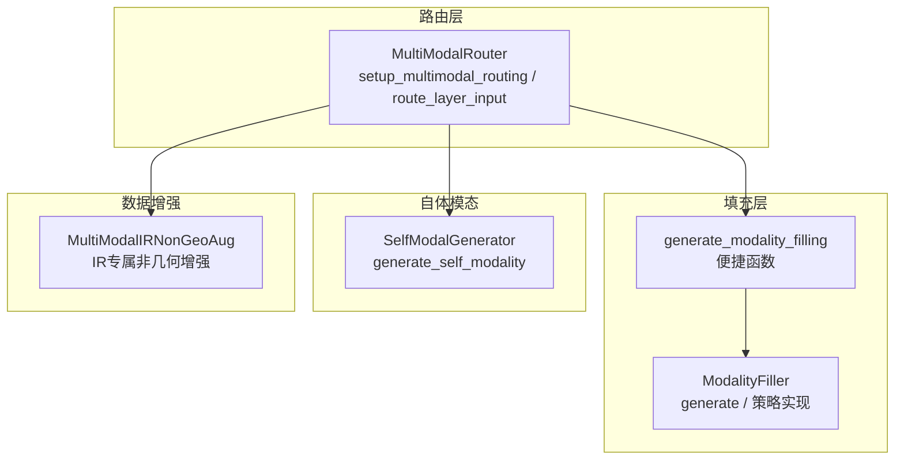
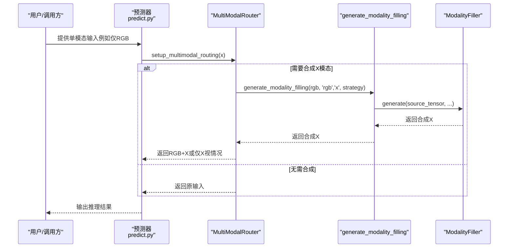
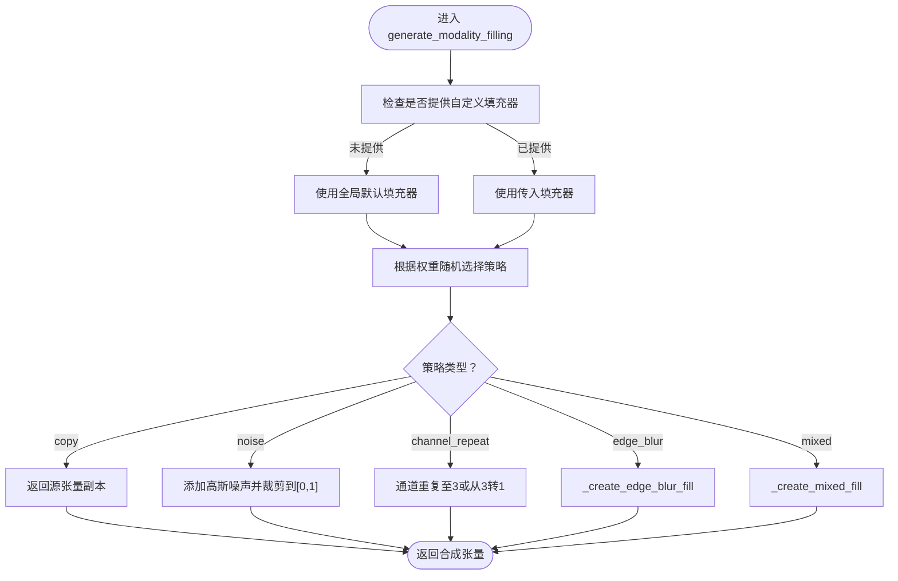
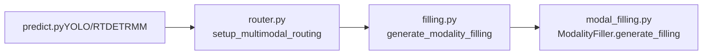

# 模态填充策略理论

<cite>
**本文档引用的文件**
- [filling.py](file://ultralytics/nn/mm/filling.py)
- [modal_filling.py](file://ultralytics/models/yolo/multimodal/modal_filling.py)
- [router.py](file://ultralytics/nn/mm/router.py)
- [predict.py（YOLO）](file://ultralytics/models/yolo/multimodal/predict.py)
- [predict.py（RTDETRMM）](file://ultralytics/models/rtdetrmm/predict.py)
- [self_modal_generator.py](file://ultralytics/models/yolo/multimodal/self_modal_generator.py)
- [multimodal_augment.py](file://ultralytics/data/multimodal_augment.py)
- [data(参考性质).yaml](file://data(参考性质).yaml)
</cite>

## 目录
1. [引言](#引言)
2. [项目结构](#项目结构)
3. [核心组件](#核心组件)
4. [架构总览](#架构总览)
5. [详细组件分析](#详细组件分析)
6. [依赖分析](#依赖分析)
7. [性能考量](#性能考量)
8. [故障排查指南](#故障排查指南)
9. [结论](#结论)
10. [附录](#附录)

## 引言
本文件系统性阐述多模态缺失场景下的数据补全策略理论与工程实现，重点围绕“generate_modality_filling”函数的工作原理、不同填充策略的理论基础与适用场景、训练与推理阶段的差异化需求，以及如何在填充质量与计算效率之间取得平衡。文档同时给出策略优缺点分析与实际应用案例，帮助读者在工程实践中做出合理选择。

## 项目结构
本仓库在多模态路由与填充方面采用分层设计：
- 路由层：MultiModalRouter 负责在前向过程中按运行时参数在 RGB/X 双模态之间进行动态路由与必要时的缺失模态合成。
- 填充层：ModalityFiller 提供轻量、确定性的填充策略，统一在路由层调用 generate_modality_filling 完成缺失模态合成。
- 自体模态生成：SelfModalGenerator 提供从 RGB 图像生成边缘、纹理、梯度等辅助模态的能力，服务于自体多模态场景。
- 数据增强：针对不同模态（如红外）提供非几何增强策略，保障模态一致性与鲁棒性。

图表来源
- [router.py:157-240](file://ultralytics/nn/mm/router.py#L157-L240)
- [filling.py:34-49](file://ultralytics/nn/mm/filling.py#L34-L49)
- [modal_filling.py:47-78](file://ultralytics/models/yolo/multimodal/modal_filling.py#L47-L78)
- [self_modal_generator.py:60-103](file://ultralytics/models/yolo/multimodal/self_modal_generator.py#L60-L103)
- [multimodal_augment.py:584-595](file://ultralytics/data/multimodal_augment.py#L584-L595)

章节来源
- [router.py:11-63](file://ultralytics/nn/mm/router.py#L11-L63)
- [filling.py:14-58](file://ultralytics/nn/mm/filling.py#L14-L58)
- [modal_filling.py:12-46](file://ultralytics/models/yolo/multimodal/modal_filling.py#L12-L46)
- [self_modal_generator.py:10-58](file://ultralytics/models/yolo/multimodal/self_modal_generator.py#L10-L58)
- [multimodal_augment.py:584-595](file://ultralytics/data/multimodal_augment.py#L584-L595)

## 核心组件
- ModalityFiller（统一填充器）
  - 提供 copy、noise、channel_repeat、edge_blur、mixed 等策略，权重可配置，支持随机选择或显式指定。
  - 保证输出与输入同形状，数值范围约束，通道适配（adapt_xch）。
- generate_modality_filling（便捷函数）
  - 统一调用入口，封装 ModalityFiller 的 generate 接口，便于在路由层直接调用。
- MultiModalRouter（多模态路由器）
  - 在 setup_multimodal_routing 中根据运行时参数决定是否进行缺失模态合成，并通过 generate_modality_filling 完成。
- SelfModalGenerator（自体模态生成器）
  - 从 RGB 图像生成边缘、纹理、梯度等辅助模态，服务于自体多模态目标检测。
- MultiModalIRNonGeoAug（IR专属非几何增强）
  - 面向红外模态的白名单算子集合，确保非几何增强不破坏热信号特性。

章节来源
- [filling.py:14-148](file://ultralytics/nn/mm/filling.py#L14-L148)
- [modal_filling.py:12-273](file://ultralytics/models/yolo/multimodal/modal_filling.py#L12-L273)
- [router.py:157-240](file://ultralytics/nn/mm/router.py#L157-L240)
- [self_modal_generator.py:10-504](file://ultralytics/models/yolo/multimodal/self_modal_generator.py#L10-L504)
- [multimodal_augment.py:584-595](file://ultralytics/data/multimodal_augment.py#L584-L595)

## 架构总览
下图展示了从输入到路由与填充的关键流程，强调“在前向中合成缺失模态”的设计原则，避免在预处理阶段进行自动填充。

图表来源
- [predict.py（YOLO）:877-879](file://ultralytics/models/yolo/multimodal/predict.py#L877-L879)
- [predict.py（RTDETRMM）:586-607](file://ultralytics/models/rtdetrmm/predict.py#L586-L607)
- [router.py:157-240](file://ultralytics/nn/mm/router.py#L157-L240)
- [filling.py:140-148](file://ultralytics/nn/mm/filling.py#L140-L148)

## 详细组件分析

### generate_modality_filling 函数工作原理
- 角色定位
  - 作为统一便捷接口，封装 ModalityFiller 的 generate 方法，确保在路由层以一致方式调用。
- 参数与行为
  - 接收 source_tensor、source_modality、target_modality、strategy、filler 等参数。
  - 若未指定策略，内部默认使用随机策略选择；若未提供填充器，使用全局默认填充器。
  - 返回与 source_tensor 同形状的合成张量，满足后续网络层通道与空间要求。
- 与路由层协作
  - MultiModalRouter 在 setup_multimodal_routing 中根据运行时参数调用该函数，完成缺失模态合成与通道适配（adapt_xch）。

图表来源
- [filling.py:34-49](file://ultralytics/nn/mm/filling.py#L34-L49)
- [filling.py:61-67](file://ultralytics/nn/mm/filling.py#L61-L67)
- [filling.py:69-75](file://ultralytics/nn/mm/filling.py#L69-L75)
- [filling.py:77-82](file://ultralytics/nn/mm/filling.py#L77-L82)
- [filling.py:84-97](file://ultralytics/nn/mm/filling.py#L84-L97)
- [filling.py:99-118](file://ultralytics/nn/mm/filling.py#L99-L118)

章节来源
- [filling.py:140-148](file://ultralytics/nn/mm/filling.py#L140-L148)
- [router.py:189-231](file://ultralytics/nn/mm/router.py#L189-L231)

### 模态填充策略的理论基础与适用场景
- 零填充（本实现未直接提供，但可通过通道适配与数值裁剪间接实现）
  - 理论基础：以固定常数（如0）填充，保持张量形状不变。
  - 适用场景：通道数不足时的简单补齐；需配合裁剪或归一化。
  - 优缺点：实现最简，但可能引入边界效应或破坏分布一致性。
- 插值填充（本实现未直接提供，但通道适配与模糊策略可视为广义插值）
  - 理论基础：基于已有通道或边缘信息进行内插，保持局部平滑。
  - 适用场景：单通道到三通道转换；边缘/纹理信息引导的合成。
  - 优缺点：能保留局部结构，但可能引入伪影或过度平滑。
- 语义填充（本实现通过“混合策略”近似实现）
  - 理论基础：融合多种策略（copy/noise/channel_repeat/edge_blur）得到更鲁棒的合成。
  - 适用场景：复杂光照/传感器差异下的稳健合成。
  - 优缺点：质量更高，计算开销略增；需注意权重归一化与数值稳定性。
- copy（复制策略）
  - 理论基础：直接复用源模态作为目标模态。
  - 适用场景：通道数匹配且对称模态（如双目视觉）。
  - 优缺点：最稳定、开销最低，但可能降低泛化能力。
- noise（噪声策略）
  - 理论基础：在源模态基础上叠加高斯噪声，模拟传感器噪声。
  - 适用场景：对抗过拟合、提升鲁棒性。
  - 优缺点：简单高效，但需控制噪声强度，避免破坏语义。
- channel_repeat（通道重复策略）
  - 理论基础：将单通道重复或从三通道降维至单通道。
  - 适用场景：深度图/热红外等单通道模态；RGB↔灰度互转。
  - 优缺点：计算极快，但会丢失跨通道信息。
- edge_blur（边缘+模糊策略）
  - 理论基础：先提取边缘，再进行高斯模糊，形成结构化但平滑的合成。
  - 适用场景：需要保留边缘结构但抑制高频噪声。
  - 优缺点：能保留结构信息，但模糊核大小影响细节保留程度。
- mixed（混合策略）
  - 理论基础：随机选择2-3种策略组合，并进行加权平均。
  - 适用场景：追求鲁棒性与多样性的合成。
  - 优缺点：质量与稳定性较好，计算成本高于单一策略。

章节来源
- [filling.py:21-27](file://ultralytics/nn/mm/filling.py#L21-L27)
- [filling.py:34-49](file://ultralytics/nn/mm/filling.py#L34-L49)
- [filling.py:69-75](file://ultralytics/nn/mm/filling.py#L69-L75)
- [filling.py:77-82](file://ultralytics/nn/mm/filling.py#L77-L82)
- [filling.py:84-97](file://ultralytics/nn/mm/filling.py#L84-L97)
- [filling.py:99-118](file://ultralytics/nn/mm/filling.py#L99-L118)
- [modal_filling.py:20-27](file://ultralytics/models/yolo/multimodal/modal_filling.py#L20-L27)
- [modal_filling.py:47-78](file://ultralytics/models/yolo/multimodal/modal_filling.py#L47-L78)
- [modal_filling.py:162-194](file://ultralytics/models/yolo/multimodal/modal_filling.py#L162-L194)

### 训练与推理阶段的差异化需求
- 训练阶段
  - 目标：提升模型对缺失模态的鲁棒性与泛化能力。
  - 策略：建议使用 mixed 或 noise 策略，结合数据增强（如 IR 专属非几何增强）；可开启随机策略权重以增加多样性。
  - 注意：避免在预处理阶段自动填充，以免掩盖真实缺失情况。
- 推理阶段
  - 目标：在单模态输入下获得稳定、可复现的输出。
  - 策略：固定策略（如 copy 或 channel_repeat），或在严格控制下使用 noise；关闭随机性。
  - 注意：确保通道数与模型期望一致（通过 adapt_xch），并保持数值范围稳定。

章节来源
- [predict.py（YOLO）:877-879](file://ultralytics/models/yolo/multimodal/predict.py#L877-L879)
- [predict.py（RTDETRMM）:586-596](file://ultralytics/models/rtdetrmm/predict.py#L586-L596)
- [router.py:189-231](file://ultralytics/nn/mm/router.py#L189-L231)
- [multimodal_augment.py:584-595](file://ultralytics/data/multimodal_augment.py#L584-L595)

### 如何根据模态类型选择合适策略
- RGB↔深度/热红外（单通道）
  - 推荐：channel_repeat（单通道重复至3）或 edge_blur（边缘+模糊）以保留结构。
- RGB↔纹理/梯度（自体模态）
  - 推荐：edge_blur 或 mixed；结合 SelfModalGenerator 生成的边缘/纹理作为参考。
- 红外（IR）模态
  - 推荐：IR专属非几何增强（如 windowing/clahe/gamma/invert_hot/noise/drift），保持热信号可读性与对比度。
- 多模态融合（RGB+X）
  - 推荐：在路由层按运行时参数合成缺失模态，使用 generate_modality_filling；确保通道数与 X 模态一致。

章节来源
- [self_modal_generator.py:10-504](file://ultralytics/models/yolo/multimodal/self_modal_generator.py#L10-L504)
- [multimodal_augment.py:584-595](file://ultralytics/data/multimodal_augment.py#L584-L595)
- [router.py:189-231](file://ultralytics/nn/mm/router.py#L189-L231)

### 实际应用案例
- 单模态 RGB 推理（仅3通道）
  - 场景：部署环境仅提供可见光图像。
  - 方案：在前向中通过 MultiModalRouter 设置 runtime_modality='rgb'，调用 generate_modality_filling 从 RGB 合成 X 模态，并通过 adapt_xch 适配通道数。
- 红外模态缺失
  - 场景：训练使用 RGB+IR，推理仅提供 RGB。
  - 方案：在 setup_multimodal_routing 中合成 IR 模态，结合 IR 专属非几何增强，提升热信号可读性。
- 自体多模态目标检测
  - 场景：仅提供 RGB，希望利用边缘/纹理信息。
  - 方案：使用 SelfModalGenerator 生成边缘/纹理模态，作为额外通道参与推理。

章节来源
- [router.py:189-231](file://ultralytics/nn/mm/router.py#L189-L231)
- [predict.py（RTDETRMM）:598-607](file://ultralytics/models/rtdetrmm/predict.py#L598-L607)
- [self_modal_generator.py:60-103](file://ultralytics/models/yolo/multimodal/self_modal_generator.py#L60-L103)
- [multimodal_augment.py:584-595](file://ultralytics/data/multimodal_augment.py#L584-L595)

## 依赖分析
- 调用关系
  - predict.py（YOLO/RTDETRMM）在单模态场景下禁用预处理阶段的自动填充，统一通过路由层合成缺失模态。
  - MultiModalRouter 在 setup_multimodal_routing 中调用 generate_modality_filling 完成合成与通道适配。
  - generate_modality_filling 再委托 ModalityFiller 的 generate 方法执行具体策略。
- 关键依赖链
  - predict.py → router.py → filling.py → modal_filling.py（可选）

图表来源
- [predict.py（YOLO）:877-879](file://ultralytics/models/yolo/multimodal/predict.py#L877-L879)
- [predict.py（RTDETRMM）:598-607](file://ultralytics/models/rtdetrmm/predict.py#L598-L607)
- [router.py:157-240](file://ultralytics/nn/mm/router.py#L157-L240)
- [filling.py:140-148](file://ultralytics/nn/mm/filling.py#L140-L148)
- [modal_filling.py:251-273](file://ultralytics/models/yolo/multimodal/modal_filling.py#L251-L273)

章节来源
- [router.py:157-240](file://ultralytics/nn/mm/router.py#L157-L240)
- [filling.py:140-148](file://ultralytics/nn/mm/filling.py#L140-L148)
- [modal_filling.py:251-273](file://ultralytics/models/yolo/multimodal/modal_filling.py#L251-L273)

## 性能考量
- 计算效率
  - copy/noise/channel_repeat 最快；edge_blur/mixed 次之；mixed 的随机组合与加权求和带来额外开销。
- 数值稳定性
  - noise 策略需裁剪至[0,1]；edge_blur 策略需确保通道拼接与模糊核大小合理。
- 通道适配
  - adapt_xch 在 RGB↔单通道间快速转换，避免额外模型层依赖。
- 随机性与可复现
  - 训练阶段可启用随机策略权重；推理阶段建议固定策略以保证可复现。

章节来源
- [filling.py:72-75](file://ultralytics/nn/mm/filling.py#L72-L75)
- [filling.py:84-97](file://ultralytics/nn/mm/filling.py#L84-L97)
- [filling.py:99-118](file://ultralytics/nn/mm/filling.py#L99-L118)
- [router.py:189-231](file://ultralytics/nn/mm/router.py#L189-L231)

## 故障排查指南
- 预处理阶段自动填充被禁用
  - 现象：单模态输入在预处理阶段抛出异常，提示不应在此阶段自动填充。
  - 处理：仅传入3通道RGB，并在前向中通过 MultiModalRouter 与运行时参数处理缺失模态。
- 通道数不匹配
  - 现象：X 模态通道数与模型期望不符。
  - 处理：使用 adapt_xch 进行通道适配；确认 dataset 配置中的 Xch 与 x_modality。
- 策略权重总和不为1
  - 现象：警告提示权重总和异常。
  - 处理：校正策略权重，确保概率分布合法。
- IR 模态质量不佳
  - 现象：热信号对比度低或噪声大。
  - 处理：启用 IR 专属非几何增强；调整 windowing/clahe/gamma 等参数。

章节来源
- [predict.py（RTDETRMM）:586-596](file://ultralytics/models/rtdetrmm/predict.py#L586-L596)
- [router.py:406-446](file://ultralytics/nn/mm/router.py#L406-L446)
- [modal_filling.py:43-45](file://ultralytics/models/yolo/multimodal/modal_filling.py#L43-L45)
- [multimodal_augment.py:584-595](file://ultralytics/data/multimodal_augment.py#L584-L595)

## 结论
本项目通过“路由层合成缺失模态”的设计，在不牺牲工程简洁性的前提下，提供了灵活、可配置且高效的模态填充方案。generate_modality_filling 作为统一入口，结合 ModalityFiller 的多种策略与 MultiModalRouter 的运行时参数，既能满足训练阶段的多样性需求，也能在推理阶段保证稳定性与可复现性。针对不同模态类型（RGB、深度、热红外、自体模态），应选择相应的策略与增强手段，以在填充质量与计算效率之间取得最佳平衡。

## 附录
- 模态类型与典型应用场景
  - RGB：可见光图像，适合 copy/channel_repeat/edge_blur 等策略。
  - 深度/热红外：单通道模态，适合 channel_repeat/edge_blur。
  - 自体模态（边缘/纹理/梯度）：适合 edge_blur/mixed，可结合 SelfModalGenerator。
  - 红外（IR）：适合 IR 专属非几何增强，保持热信号可读性。

章节来源
- [self_modal_generator.py:10-504](file://ultralytics/models/yolo/multimodal/self_modal_generator.py#L10-L504)
- [multimodal_augment.py:584-595](file://ultralytics/data/multimodal_augment.py#L584-L595)
- [data(参考性质).yaml](file://data(参考性质).yaml#L1-L26)