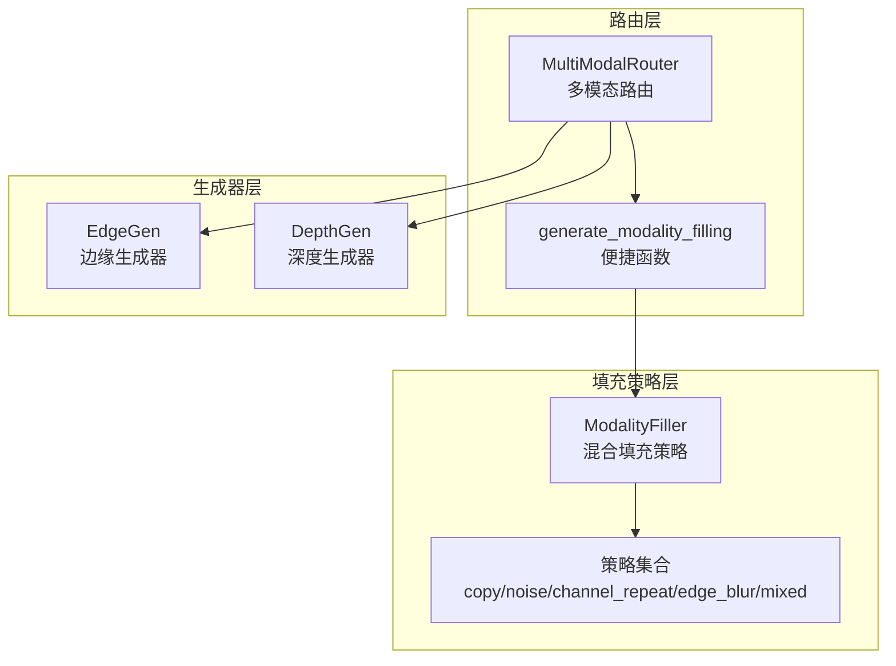
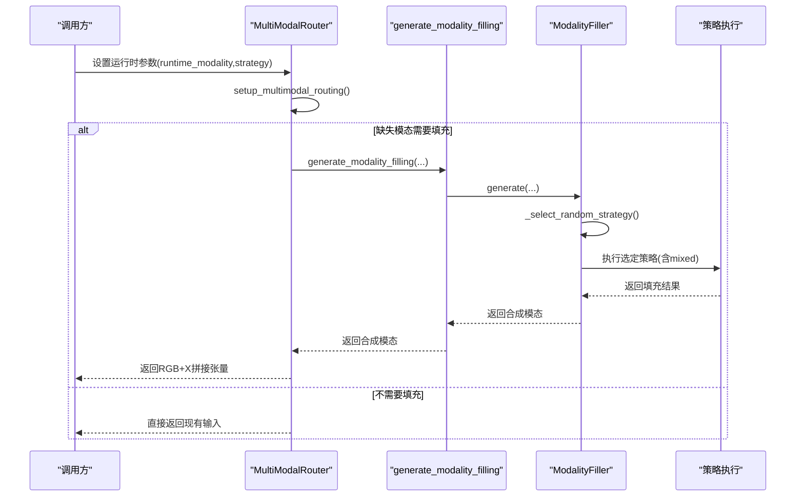
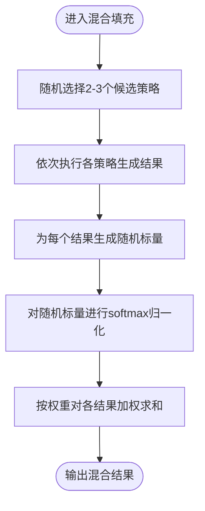
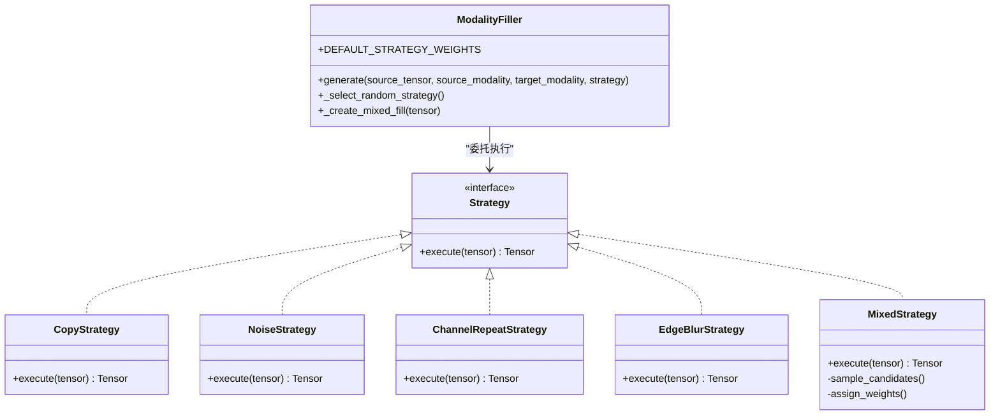
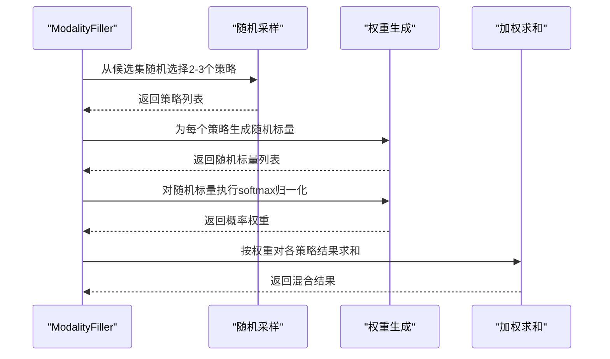
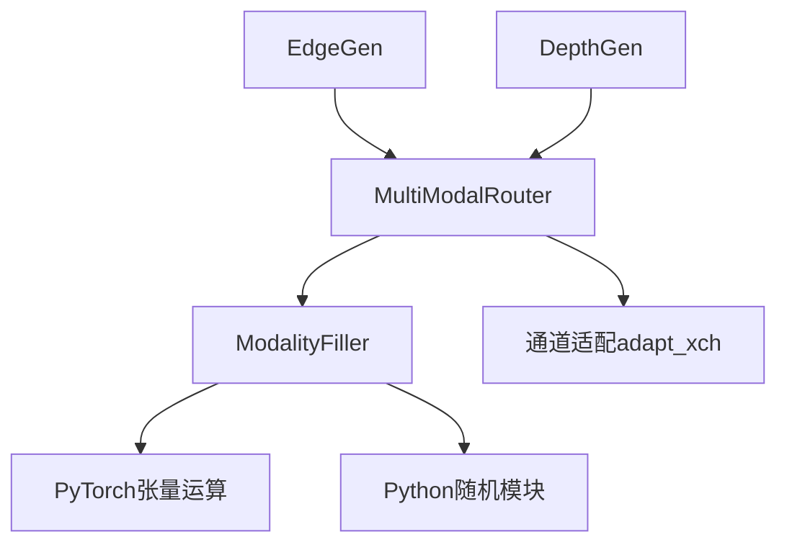

# 混合填充策略

<cite>
**本文档引用的文件**
- [ultralytics/nn/mm/filling.py](file://ultralytics/nn/mm/filling.py)
- [ultralytics/models/yolo/multimodal/modal_filling.py](file://ultralytics/models/yolo/multimodal/modal_filling.py)
- [ultralytics/nn/mm/router.py](file://ultralytics/nn/mm/router.py)
- [ultralytics/nn/mm/generators/edge.py](file://ultralytics/nn/mm/generators/edge.py)
- [ultralytics/nn/mm/generators/depth_anything_v2.py](file://ultralytics/nn/mm/generators/depth_anything_v2.py)
- [ultralytics/models/utils/multimodal/visualize_core/router_adapter.py](file://ultralytics/models/utils/multimodal/visualize_core/router_adapter.py)
</cite>

## 目录
1. [简介](#简介)
2. [项目结构](#项目结构)
3. [核心组件](#核心组件)
4. [架构概览](#架构概览)
5. [详细组件分析](#详细组件分析)
6. [依赖分析](#依赖分析)
7. [性能考虑](#性能考虑)
8. [故障排除指南](#故障排除指南)
9. [结论](#结论)
10. [附录](#附录)

## 简介
本文件系统性阐述混合填充策略（Mixed Filling Strategy）的设计与实现，重点覆盖以下方面：
- 多种填充策略的组合机制与随机采样算法
- 加权融合过程与softmax权重分配
- 候选策略的选择逻辑、随机样本数量的确定
- 混合策略如何提升填充效果的多样性与鲁棒性
- 数学原理与概率分布分析
- 参数调优与性能分析建议

混合填充策略是多模态视觉任务中的关键技术，旨在为缺失模态生成高质量的合成数据，从而在单模态推理场景下保持模型性能稳定。

## 项目结构
围绕混合填充策略的相关代码主要分布在以下模块：
- 填充策略核心实现：`ultralytics/nn/mm/filling.py` 与 `ultralytics/models/yolo/multimodal/modal_filling.py`
- 多模态路由与调用链：`ultralytics/nn/mm/router.py`
- 模态生成器（可选外部生成能力）：`ultralytics/nn/mm/generators/edge.py`、`ultralytics/nn/mm/generators/depth_anything_v2.py`
- 可视化与调试适配器：`ultralytics/models/utils/multimodal/visualize_core/router_adapter.py`

**图表来源**
- [ultralytics/nn/mm/filling.py:14-175](file://ultralytics/nn/mm/filling.py#L14-L175)
- [ultralytics/models/yolo/multimodal/modal_filling.py:12-295](file://ultralytics/models/yolo/multimodal/modal_filling.py#L12-L295)
- [ultralytics/nn/mm/router.py:11-471](file://ultralytics/nn/mm/router.py#L11-L471)

**章节来源**
- [ultralytics/nn/mm/filling.py:1-175](file://ultralytics/nn/mm/filling.py#L1-L175)
- [ultralytics/models/yolo/multimodal/modal_filling.py:1-295](file://ultralytics/models/yolo/multimodal/modal_filling.py#L1-L295)
- [ultralytics/nn/mm/router.py:1-471](file://ultralytics/nn/mm/router.py#L1-L471)

## 核心组件
- ModalityFiller（统一填充器）
  - 提供多种填充策略：复制、加噪、通道重复、边缘模糊、混合
  - 支持策略权重配置与运行时随机选择
  - 混合策略内部随机选择2-3种候选策略，使用随机方向softmax进行加权融合
- MultiModalRouter（多模态路由）
  - 在RGB/X双模态输入或单模态输入场景中，根据运行时参数决定是否进行填充
  - 调用ModalityFiller生成缺失模态数据，并进行通道适配
- 模态生成器（可选）
  - EdgeGen：基于Sobel/Scharr算子的边缘强度生成
  - DepthGen：基于Depth Anything V2的深度估计生成

**章节来源**
- [ultralytics/nn/mm/filling.py:14-175](file://ultralytics/nn/mm/filling.py#L14-L175)
- [ultralytics/models/yolo/multimodal/modal_filling.py:12-295](file://ultralytics/models/yolo/multimodal/modal_filling.py#L12-L295)
- [ultralytics/nn/mm/router.py:11-471](file://ultralytics/nn/mm/router.py#L11-L471)
- [ultralytics/nn/mm/generators/edge.py:190-506](file://ultralytics/nn/mm/generators/edge.py#L190-L506)
- [ultralytics/nn/mm/generators/depth_anything_v2.py:72-520](file://ultralytics/nn/mm/generators/depth_anything_v2.py#L72-L520)

## 架构概览
混合填充策略在多模态系统中的位置如下：

**图表来源**
- [ultralytics/nn/mm/router.py:157-240](file://ultralytics/nn/mm/router.py#L157-L240)
- [ultralytics/nn/mm/filling.py:35-67](file://ultralytics/nn/mm/filling.py#L35-L67)
- [ultralytics/models/yolo/multimodal/modal_filling.py:47-84](file://ultralytics/models/yolo/multimodal/modal_filling.py#L47-L84)

## 详细组件分析

### 混合填充策略实现原理
- 候选策略集合：["copy", "noise", "channel_repeat", "edge_blur"]
- 随机样本数量：从候选集中随机抽取2或3个策略（min(3, len(candidates))）
- 随机样本数量确定：使用random.randint(2, min(3, len(candidates)))，保证至少2个，最多3个或候选总数
- 权重分配：对每个候选结果生成一个随机标量，使用softmax进行归一化，得到概率分布权重
- 加权融合：对所有候选结果按权重求和，得到最终混合输出

**图表来源**
- [ultralytics/nn/mm/filling.py:99-118](file://ultralytics/nn/mm/filling.py#L99-L118)
- [ultralytics/models/yolo/multimodal/modal_filling.py:162-194](file://ultralytics/models/yolo/multimodal/modal_filling.py#L162-L194)

**章节来源**
- [ultralytics/nn/mm/filling.py:99-118](file://ultralytics/nn/mm/filling.py#L99-L118)
- [ultralytics/models/yolo/multimodal/modal_filling.py:162-194](file://ultralytics/models/yolo/multimodal/modal_filling.py#L162-L194)

### 策略组合的数学原理与概率分布
- 随机采样：从候选策略集合中无放回地抽取k个策略（k∈[2,3]），其概率质量函数为均匀分布
- 权重生成：对每个策略生成独立同分布的随机变量，通常为均匀分布或正态分布的随机标量
- softmax归一化：将随机标量转换为概率分布，满足非负性与归一性
- 加权融合：线性组合，保持张量形状一致性

**图表来源**
- [ultralytics/nn/mm/filling.py:14-175](file://ultralytics/nn/mm/filling.py#L14-L175)
- [ultralytics/models/yolo/multimodal/modal_filling.py:12-295](file://ultralytics/models/yolo/multimodal/modal_filling.py#L12-L295)

**章节来源**
- [ultralytics/nn/mm/filling.py:14-175](file://ultralytics/nn/mm/filling.py#L14-L175)
- [ultralytics/models/yolo/multimodal/modal_filling.py:12-295](file://ultralytics/models/yolo/multimodal/modal_filling.py#L12-L295)

### 随机采样算法与加权融合
- 随机采样算法
  - 候选集：["copy", "noise", "channel_repeat", "edge_blur"]
  - 采样数量：min(3, len(candidates))，确保至少2个策略参与
  - 采样方式：random.sample(candidates, k)
- 加权融合
  - 权重生成：torch.rand(len(results))，生成与候选数量相同的随机标量
  - 归一化：torch.softmax(..., dim=0)，得到概率分布
  - 融合：逐项乘加，保持输出张量形状与数值范围

**图表来源**
- [ultralytics/nn/mm/filling.py:99-118](file://ultralytics/nn/mm/filling.py#L99-L118)
- [ultralytics/models/yolo/multimodal/modal_filling.py:162-194](file://ultralytics/models/yolo/multimodal/modal_filling.py#L162-L194)

**章节来源**
- [ultralytics/nn/mm/filling.py:99-118](file://ultralytics/nn/mm/filling.py#L99-L118)
- [ultralytics/models/yolo/multimodal/modal_filling.py:162-194](file://ultralytics/models/yolo/multimodal/modal_filling.py#L162-L194)

### 候选策略选择逻辑
- 策略权重配置：DEFAULT_STRATEGY_WEIGHTS中为每种策略分配初始权重
- 运行时策略选择：_select_random_strategy()根据权重进行带权重的随机选择
- 混合策略内部：忽略外部权重，采用独立的随机采样与随机权重生成

**章节来源**
- [ultralytics/nn/mm/filling.py:21-27](file://ultralytics/nn/mm/filling.py#L21-L27)
- [ultralytics/nn/mm/filling.py:61-67](file://ultralytics/nn/mm/filling.py#L61-L67)
- [ultralytics/models/yolo/multimodal/modal_filling.py:20-27](file://ultralytics/models/yolo/multimodal/modal_filling.py#L20-L27)
- [ultralytics/models/yolo/multimodal/modal_filling.py:80-84](file://ultralytics/models/yolo/multimodal/modal_filling.py#L80-L84)

### 混合策略对多样性和鲁棒性的提升
- 多样性提升
  - 随机采样确保每次填充都可能采用不同的策略组合
  - 随机权重使不同策略的贡献随采样变化，增加输出分布的多样性
- 鲁棒性提升
  - 多策略融合减少单一策略的偏差影响
  - 边缘模糊与通道重复等策略互补，提升对不同缺失模式的适应性
  - 加噪策略引入可控噪声，有助于模型泛化

**章节来源**
- [ultralytics/nn/mm/filling.py:99-118](file://ultralytics/nn/mm/filling.py#L99-L118)
- [ultralytics/models/yolo/multimodal/modal_filling.py:162-194](file://ultralytics/models/yolo/multimodal/modal_filling.py#L162-L194)

### 参数调优与性能分析
- 策略权重调优
  - DEFAULT_STRATEGY_WEIGHTS：可通过构造函数传入自定义权重，平衡各策略使用频率
  - 注意：混合策略内部不使用此权重，而是采用独立的随机采样
- 混合策略参数
  - 候选集规模：当前为4种策略，可根据需求扩展或裁剪
  - 采样数量：2或3，取决于候选集大小
  - 权重生成：随机方向softmax，确保权重分布的多样性
- 性能考量
  - 混合策略的计算开销主要来自多个策略的执行与一次softmax归一化
  - 建议在批处理维度上并行执行各策略，以减少总体延迟
  - 对于实时场景，可考虑降低采样数量或简化策略复杂度

**章节来源**
- [ultralytics/nn/mm/filling.py:29-32](file://ultralytics/nn/mm/filling.py#L29-L32)
- [ultralytics/nn/mm/filling.py:99-118](file://ultralytics/nn/mm/filling.py#L99-L118)
- [ultralytics/models/yolo/multimodal/modal_filling.py:29-41](file://ultralytics/models/yolo/multimodal/modal_filling.py#L29-L41)
- [ultralytics/models/yolo/multimodal/modal_filling.py:162-194](file://ultralytics/models/yolo/multimodal/modal_filling.py#L162-L194)

## 依赖分析
- ModalityFiller依赖于PyTorch张量运算与随机模块
- MultiModalRouter依赖ModalityFiller进行缺失模态合成，并负责通道适配与输入拼接
- 模态生成器（EdgeGen/DepthGen）提供更专业的合成能力，可作为填充策略的补充

**图表来源**
- [ultralytics/nn/mm/filling.py:10-11](file://ultralytics/nn/mm/filling.py#L10-L11)
- [ultralytics/nn/mm/router.py:8](file://ultralytics/nn/mm/router.py#L8)
- [ultralytics/nn/mm/filling.py:138-175](file://ultralytics/nn/mm/filling.py#L138-L175)

**章节来源**
- [ultralytics/nn/mm/filling.py:10-11](file://ultralytics/nn/mm/filling.py#L10-L11)
- [ultralytics/nn/mm/router.py:8](file://ultralytics/nn/mm/router.py#L8)
- [ultralytics/nn/mm/filling.py:138-175](file://ultralytics/nn/mm/filling.py#L138-L175)

## 性能考虑
- 计算复杂度
  - 混合策略的复杂度近似为O(K·C·H·W)，其中K为候选策略数量，C为通道数，H/W为空间维度
  - softmax归一化与加权求和的开销与K成线性关系
- 内存占用
  - 需要缓存所有候选策略的结果，内存占用约为K倍单策略输出
- 实时性
  - 可通过减少候选数量或采用更简单的策略来降低延迟
  - 在批处理中并行执行各策略可显著提升吞吐量

## 故障排除指南
- 策略权重总和不为1
  - 现象：出现警告提示权重总和不等于1
  - 处理：检查自定义权重配置，确保总和为1
- 混合策略输出异常
  - 现象：混合结果超出预期范围或出现NaN
  - 处理：检查各策略输出范围与数值稳定性，必要时在策略内部进行裁剪
- 路由错误
  - 现象：多模态路由失败或通道数不匹配
  - 处理：确认runtime_modality与X通道数配置，检查adapt_xch适配逻辑

**章节来源**
- [ultralytics/models/yolo/multimodal/modal_filling.py:44-45](file://ultralytics/models/yolo/multimodal/modal_filling.py#L44-L45)
- [ultralytics/nn/mm/router.py:190-200](file://ultralytics/nn/mm/router.py#L190-L200)

## 结论
混合填充策略通过“随机采样+随机权重+softmax归一化”的组合机制，在保证计算效率的同时显著提升了填充结果的多样性与鲁棒性。其数学基础清晰、实现简洁，适合在多模态视觉任务中作为缺失模态的通用合成方案。通过合理的参数调优与性能优化，可在不同应用场景中取得良好的效果。

## 附录
- 相关生成器
  - EdgeGen：边缘强度生成，适合纹理丰富的场景
  - DepthGen：深度估计生成，适合距离感知任务
- 可视化与调试
  - RouterAdapter：提供安全的路由访问接口，便于调试与可视化

**章节来源**
- [ultralytics/nn/mm/generators/edge.py:190-506](file://ultralytics/nn/mm/generators/edge.py#L190-L506)
- [ultralytics/nn/mm/generators/depth_anything_v2.py:72-520](file://ultralytics/nn/mm/generators/depth_anything_v2.py#L72-L520)
- [ultralytics/models/utils/multimodal/visualize_core/router_adapter.py:18-103](file://ultralytics/models/utils/multimodal/visualize_core/router_adapter.py#L18-L103)