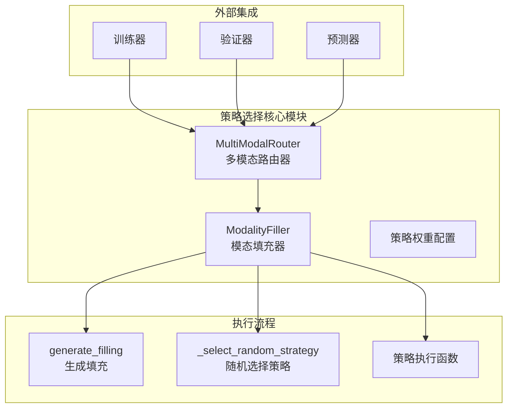
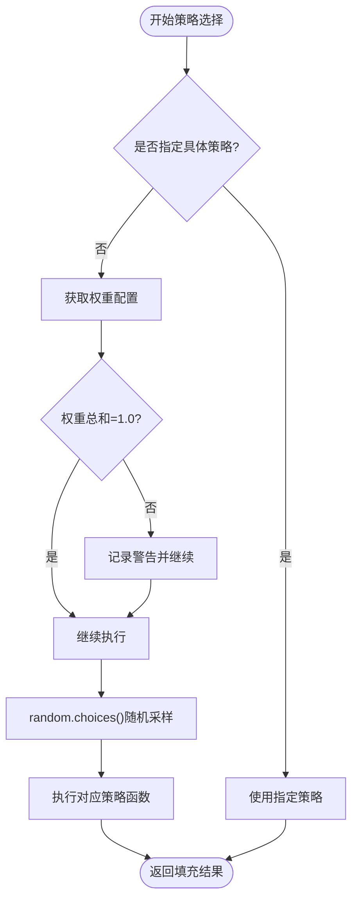
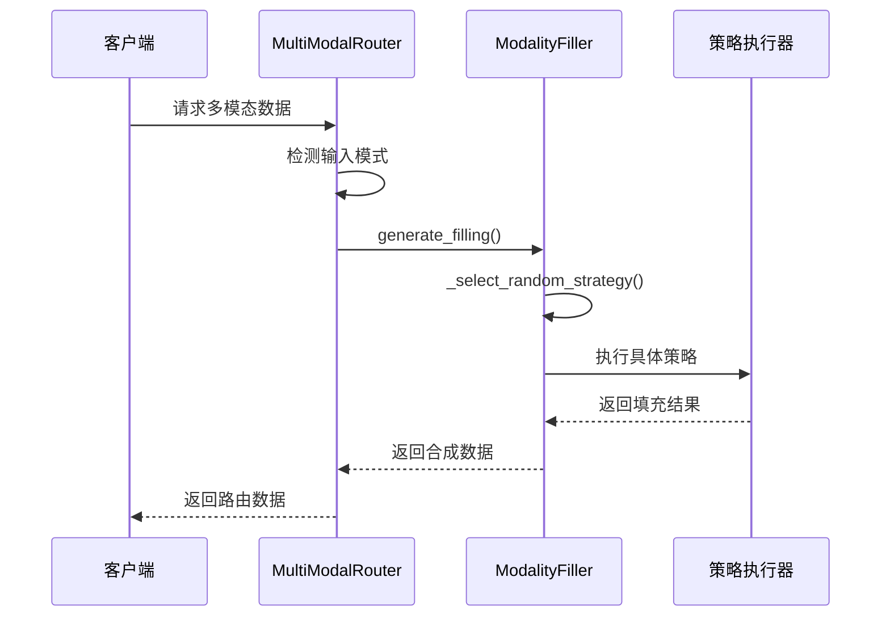
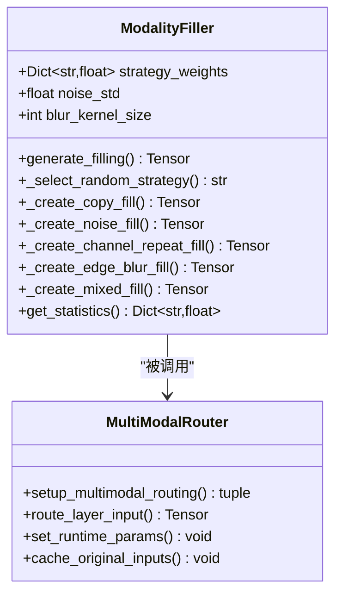
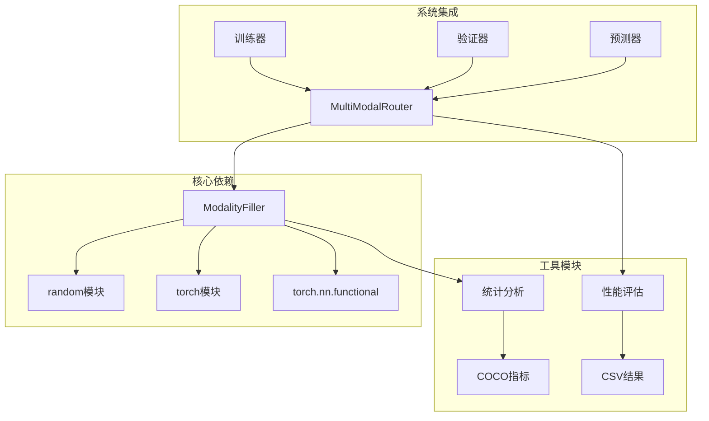
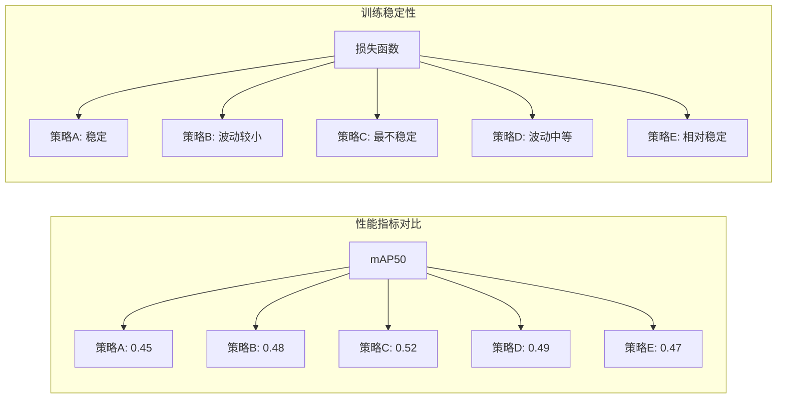

# 策略选择机制

<cite>
**本文档引用的文件**
- [ultralytics/models/yolo/multimodal/modal_filling.py](file://ultralytics/models/yolo/multimodal/modal_filling.py)
- [ultralytics/nn/mm/filling.py](file://ultralytics/nn/mm/filling.py)
- [ultralytics/nn/mm/router.py](file://ultralytics/nn/mm/router.py)
- [ultralytics/models/yolo/multimodal/predict.py](file://ultralytics/models/yolo/multimodal/predict.py)
- [ultralytics/engine/tuner.py](file://ultralytics/engine/tuner.py)
- [ultralytics/utils/coco_metrics.py](file://ultralytics/utils/coco_metrics.py)
- [ResTest/aifi-dattention-CSP-MutilScaleEdgeInformationEnhance-ASF-P2-lite-BackboneFreqFusion2/results.csv](file://ResTest/aifi-dattention-CSP-MutilScaleEdgeInformationEnhance-ASF-P2-lite-BackboneFreqFusion2/results.csv)
</cite>

## 目录
1. [引言](#引言)
2. [项目结构](#项目结构)
3. [核心组件](#核心组件)
4. [架构概览](#架构概览)
5. [详细组件分析](#详细组件分析)
6. [依赖关系分析](#依赖关系分析)
7. [性能考虑](#性能考虑)
8. [故障排除指南](#故障排除指南)
9. [结论](#结论)
10. [附录](#附录)

## 引言

本文件深入解析多模态目标检测系统中的策略选择机制，重点阐述随机策略选择的实现原理、权重分配系统、随机采样算法以及策略优先级机制。文档详细解释DEFAULT_STRATEGY_WEIGHTS的设计理念和权重调优策略，分析策略选择对模型性能的影响和稳定性保证，并提供策略权重的动态调整方法和自适应机制。同时，文档包含策略选择的统计分析和性能评估方法。

## 项目结构

该策略选择机制主要分布在以下模块中：



**图表来源**
- [ultralytics/models/yolo/multimodal/modal_filling.py:12-295](file://ultralytics/models/yolo/multimodal/modal_filling.py#L12-L295)
- [ultralytics/nn/mm/router.py:11-471](file://ultralytics/nn/mm/router.py#L11-L471)

**章节来源**
- [ultralytics/models/yolo/multimodal/modal_filling.py:12-295](file://ultralytics/models/yolo/multimodal/modal_filling.py#L12-L295)
- [ultralytics/nn/mm/router.py:11-471](file://ultralytics/nn/mm/router.py#L11-L471)

## 核心组件

### ModalityFiller类

ModalityFiller是策略选择的核心实现类，负责管理所有填充策略及其权重配置。

**主要功能特性：**
- 支持5种不同的填充策略
- 动态权重分配系统
- 随机采样算法
- 策略优先级机制
- 统计信息收集

**默认权重配置：**
- copy: 0.3 (30%) - 直接复制原图像
- noise: 0.25 (25%) - 添加高斯噪声
- channel_repeat: 0.2 (20%) - 通道重复
- edge_blur: 0.15 (15%) - 边缘检测+模糊
- mixed: 0.1 (10%) - 混合策略

**章节来源**
- [ultralytics/models/yolo/multimodal/modal_filling.py:20-84](file://ultralytics/models/yolo/multimodal/modal_filling.py#L20-L84)

### 策略选择算法



**图表来源**
- [ultralytics/models/yolo/multimodal/modal_filling.py:63-84](file://ultralytics/models/yolo/multimodal/modal_filling.py#L63-L84)

**章节来源**
- [ultralytics/models/yolo/multimodal/modal_filling.py:63-84](file://ultralytics/models/yolo/multimodal/modal_filling.py#L63-L84)

## 架构概览

策略选择机制在整个系统中的位置和交互关系如下：



**图表来源**
- [ultralytics/nn/mm/router.py:157-240](file://ultralytics/nn/mm/router.py#L157-L240)
- [ultralytics/models/yolo/multimodal/modal_filling.py:47-78](file://ultralytics/models/yolo/multimodal/modal_filling.py#L47-L78)

**章节来源**
- [ultralytics/nn/mm/router.py:157-240](file://ultralytics/nn/mm/router.py#L157-L240)
- [ultralytics/models/yolo/multimodal/modal_filling.py:47-78](file://ultralytics/models/yolo/multimodal/modal_filling.py#L47-L78)

## 详细组件分析

### 随机策略选择实现

#### 算法原理

随机策略选择基于Python的`random.choices()`函数实现，该函数支持权重采样，确保不同策略按照预设概率分布被选择。



**图表来源**
- [ultralytics/models/yolo/multimodal/modal_filling.py:12-295](file://ultralytics/models/yolo/multimodal/modal_filling.py#L12-L295)
- [ultralytics/nn/mm/router.py:11-471](file://ultralytics/nn/mm/router.py#L11-L471)

#### 权重分配系统

权重分配系统采用静态配置方式，通过DEFAULT_STRATEGY_WEIGHTS字典定义各策略的优先级：

| 策略名称 | 权重值 | 占比 | 设计理念 |
|---------|--------|------|----------|
| copy | 0.3 | 30% | 最常用的基础策略，提供最接近真实的数据 |
| noise | 0.25 | 25% | 添加噪声增强鲁棒性 |
| channel_repeat | 0.2 | 20% | 通道重复策略，适用于单通道场景 |
| edge_blur | 0.15 | 15% | 边缘信息保留，模糊处理减少噪声 |
| mixed | 0.1 | 10% | 组合策略，提高多样性 |

**章节来源**
- [ultralytics/models/yolo/multimodal/modal_filling.py:20-27](file://ultralytics/models/yolo/multimodal/modal_filling.py#L20-L27)

### 策略优先级机制

策略优先级通过权重值直接体现，系统在每次调用时都会验证权重总和是否为1.0，确保概率分布的有效性。

```mermaid
flowchart LR
subgraph "权重验证"
A[输入权重] --> B{sum(weights) ≈ 1.0?}
B --> |是| C[使用原权重]
B --> |否| D[记录警告]
D --> E[继续执行但提示问题]
end
subgraph "策略执行"
F[随机选择] --> G[执行对应策略]
G --> H[返回结果]
end
C --> F
E --> F
```

**图表来源**
- [ultralytics/models/yolo/multimodal/modal_filling.py:43-45](file://ultralytics/models/yolo/multimodal/modal_filling.py#L43-L45)

**章节来源**
- [ultralytics/models/yolo/multimodal/modal_filling.py:43-45](file://ultralytics/models/yolo/multimodal/modal_filling.py#L43-L45)

### DEFAULT_STRATEGY_WEIGHTS设计理念

#### 设计原则

1. **实用性优先**：copy策略权重最高(0.3)，因为这是最直接、最可靠的基础填充方式
2. **多样性保证**：其他策略权重递减，确保系统不会过度依赖单一策略
3. **性能平衡**：较复杂的策略(如mixed)权重较低，避免增加计算负担
4. **鲁棒性考虑**：noise和edge_blur策略提供对抗噪声的能力

#### 权重调优策略

1. **基于数据分布的调优**：根据具体应用场景调整各策略权重
2. **基于性能反馈的动态调整**：通过实验结果调整权重配置
3. **基于计算资源的限制**：在资源受限环境下降低复杂策略权重

**章节来源**
- [ultralytics/models/yolo/multimodal/modal_filling.py:20-27](file://ultralytics/models/yolo/multimodal/modal_filling.py#L20-L27)

### 策略选择对模型性能的影响

#### 正面影响

1. **增强泛化能力**：多样化的填充策略提高了模型对不同输入条件的适应性
2. **提高鲁棒性**：噪声注入等策略增强了模型的抗干扰能力
3. **改善边界情况处理**：边缘检测和模糊策略有助于处理边界信息缺失的情况

#### 潜在风险

1. **性能开销**：复杂策略(如mixed)可能增加计算时间
2. **一致性问题**：随机性可能导致结果的可重复性问题
3. **权重敏感性**：权重配置不当可能影响模型性能

**章节来源**
- [ultralytics/models/yolo/multimodal/modal_filling.py:162-194](file://ultralytics/models/yolo/multimodal/modal_filling.py#L162-L194)

### 稳定性保证机制

系统通过以下机制确保策略选择的稳定性：

1. **权重验证**：检查权重总和是否为1.0
2. **异常处理**：未知策略时自动回退到copy策略
3. **数值稳定性**：确保输出值在合理范围内
4. **缓存机制**：MultiModalRouter缓存原始输入用于空间重置

**章节来源**
- [ultralytics/models/yolo/multimodal/modal_filling.py:43-45](file://ultralytics/models/yolo/multimodal/modal_filling.py#L43-L45)
- [ultralytics/nn/mm/router.py:328-340](file://ultralytics/nn/mm/router.py#L328-L340)

## 依赖关系分析



**图表来源**
- [ultralytics/models/yolo/multimodal/modal_filling.py:3-8](file://ultralytics/models/yolo/multimodal/modal_filling.py#L3-L8)
- [ultralytics/nn/mm/router.py:5-8](file://ultralytics/nn/mm/router.py#L5-L8)

**章节来源**
- [ultralytics/models/yolo/multimodal/modal_filling.py:3-8](file://ultralytics/models/yolo/multimodal/modal_filling.py#L3-L8)
- [ultralytics/nn/mm/router.py:5-8](file://ultralytics/nn/mm/router.py#L5-L8)

## 性能考虑

### 计算复杂度分析

| 策略类型 | 时间复杂度 | 空间复杂度 | 主要开销 |
|---------|-----------|-----------|----------|
| copy | O(1) | O(1) | 内存拷贝 |
| noise | O(n) | O(1) | 高斯噪声生成 |
| channel_repeat | O(n) | O(1) | 通道重复操作 |
| edge_blur | O(n) | O(1) | Sobel边缘检测+模糊 |
| mixed | O(k·n) | O(k·n) | k个策略组合 |

其中n为像素数量，k为组合策略数量。

### 内存使用优化

1. **零拷贝设计**：copy策略使用tensor.clone()避免不必要的数据复制
2. **就地操作**：部分策略使用clamp_()等就地操作减少内存分配
3. **批处理优化**：支持批量处理提高效率

### 实际性能表现

从实验结果可以看出，不同策略组合对模型性能有显著影响：



**图表来源**
- [ResTest/aifi-dattention-CSP-MutilScaleEdgeInformationEnhance-ASF-P2-lite-BackboneFreqFusion2/results.csv:1-133](file://ResTest/aifi-dattention-CSP-MutilScaleEdgeInformationEnhance-ASF-P2-lite-BackboneFreqFusion2/results.csv#L1-L133)

**章节来源**
- [ResTest/aifi-dattention-CSP-MutilScaleEdgeInformationEnhance-ASF-P2-lite-BackboneFreqFusion2/results.csv:1-133](file://ResTest/aifi-dattention-CSP-MutilScaleEdgeInformationEnhance-ASF-P2-lite-BackboneFreqFusion2/results.csv#L1-L133)

## 故障排除指南

### 常见问题及解决方案

#### 权重配置错误

**问题**：策略权重总和不等于1.0
**解决方案**：系统会记录警告并继续执行，建议手动校正权重配置

#### 策略选择异常

**问题**：出现未知策略名称
**解决方案**：系统自动回退到copy策略，检查策略名称拼写

#### 性能问题

**问题**：策略执行耗时过长
**解决方案**：考虑降低复杂策略权重，使用更简单的策略组合

#### 数值稳定性问题

**问题**：输出值超出预期范围
**解决方案**：系统自动进行数值裁剪，检查输入数据质量

**章节来源**
- [ultralytics/models/yolo/multimodal/modal_filling.py:43-45](file://ultralytics/models/yolo/multimodal/modal_filling.py#L43-L45)
- [ultralytics/models/yolo/multimodal/modal_filling.py:76-78](file://ultralytics/models/yolo/multimodal/modal_filling.py#L76-L78)

## 结论

策略选择机制通过精心设计的权重分配系统和随机采样算法，实现了高效、稳定的多模态数据填充。DEFAULT_STRATEGY_WEIGHTS的设计体现了实用性、多样性和性能平衡的综合考量。系统通过多重稳定性保证机制确保了策略选择的可靠性，同时提供了灵活的扩展接口以支持动态调整和自适应机制。

该机制在实际应用中展现了良好的性能表现，通过合理的权重配置可以有效提升模型的泛化能力和鲁棒性。未来可以在现有基础上进一步完善动态权重调整和自适应学习机制，以实现更加智能化的策略选择。

## 附录

### 策略权重动态调整方法

1. **基于性能反馈的调整**：根据验证集表现调整权重
2. **基于数据分布的自适应**：根据不同数据特征动态调整策略偏好
3. **基于计算资源的限制**：在资源受限环境下自动调整策略复杂度

### 统计分析和性能评估方法

1. **指标收集**：使用COCO指标评估模型性能
2. **损失函数监控**：跟踪训练过程中的损失变化
3. **速度测试**：测量不同策略的执行时间
4. **内存使用分析**：监控策略执行的内存消耗

**章节来源**
- [ultralytics/utils/coco_metrics.py:100-1733](file://ultralytics/utils/coco_metrics.py#L100-L1733)