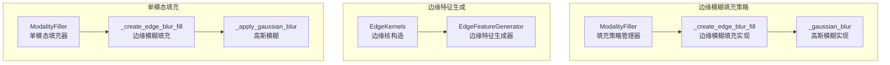
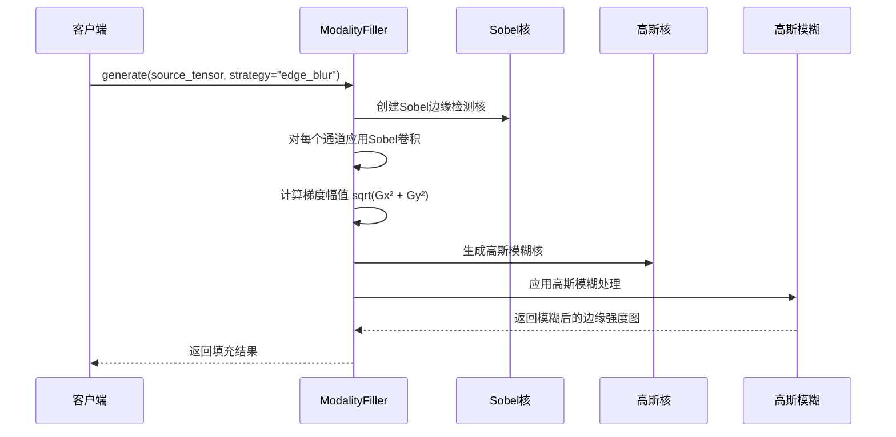
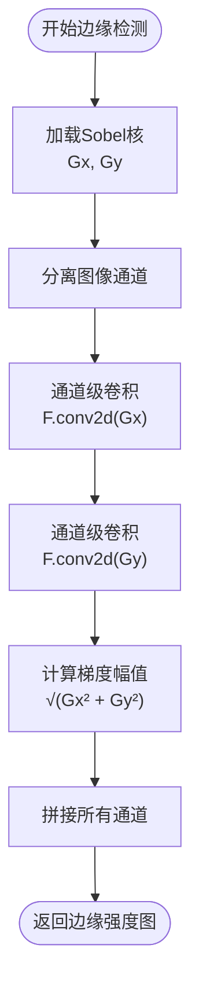
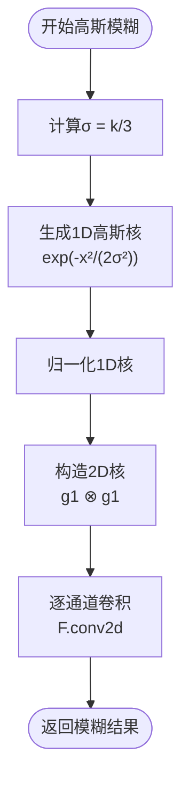

# 边缘模糊填充策略

<cite>
**本文档引用的文件**
- [filling.py](file://ultralytics/nn/mm/filling.py)
- [edge.py](file://ultralytics/nn/mm/generators/edge.py)
- [modal_filling.py](file://ultralytics/models/yolo/multimodal/modal_filling.py)
- [self_modal_generator.py](file://ultralytics/models/yolo/multimodal/self_modal_generator.py)
</cite>

## 目录
1. [简介](#简介)
2. [项目结构](#项目结构)
3. [核心组件](#核心组件)
4. [架构概览](#架构概览)
5. [详细组件分析](#详细组件分析)
6. [依赖关系分析](#依赖关系分析)
7. [性能考量](#性能考量)
8. [故障排除指南](#故障排除指南)
9. [结论](#结论)

## 简介
本文件深入解析边缘模糊填充策略的实现原理，涵盖Sobel算子的数学基础、边缘检测算法设计、高斯模糊滤波器构造以及卷积操作的具体实现。文档特别关注edge_blur填充策略如何通过边缘检测与高斯模糊的组合来生成高质量的缺失模态数据，同时提供参数调优指南和性能优化建议。

## 项目结构
边缘模糊填充策略涉及以下关键模块：
- 填充策略实现：位于 `ultralytics/nn/mm/filling.py`，提供多种填充策略，其中edge_blur策略为核心实现
- 边缘特征生成器：位于 `ultralytics/nn/mm/generators/edge.py`，包含Sobel核构造、高斯核生成等工具
- 单模态填充策略：位于 `ultralytics/models/yolo/multimodal/modal_filling.py`，提供基于Sobel边缘检测的填充实现
- 自体模态生成器：位于 `ultralytics/models/yolo/multimodal/self_modal_generator.py`，包含边缘检测与模糊处理的完整流程



**图表来源**
- [filling.py:84-135](file://ultralytics/nn/mm/filling.py#L84-L135)
- [edge.py:35-84](file://ultralytics/nn/mm/generators/edge.py#L35-L84)
- [modal_filling.py:132-226](file://ultralytics/models/yolo/multimodal/modal_filling.py#L132-L226)

**章节来源**
- [filling.py:14-135](file://ultralytics/nn/mm/filling.py#L14-L135)
- [edge.py:86-187](file://ultralytics/nn/mm/generators/edge.py#L86-L187)
- [modal_filling.py:12-226](file://ultralytics/models/yolo/multimodal/modal_filling.py#L12-L226)

## 核心组件
边缘模糊填充策略的核心组件包括：

### ModalityFiller类
- 策略权重管理：支持copy、noise、channel_repeat、edge_blur、mixed五种策略
- 随机策略选择机制：基于权重分布随机选择填充策略
- 边缘模糊填充实现：通过Sobel边缘检测和高斯模糊生成边缘强度图

### EdgeKernels类
- 高斯核构造：支持任意尺寸的二维高斯核生成
- Sobel核生成：提供3x3和5x5尺寸的Sobel边缘检测核
- Scharr核生成：提供更高精度的边缘检测核

### EdgeFeatureGenerator类
- 边缘强度计算：基于Sobel算子计算梯度幅值
- 高斯平滑：在边缘检测前进行高斯平滑以减少噪声影响
- 归一化处理：支持0-1范围归一化和Gamma校正

**章节来源**
- [filling.py:14-135](file://ultralytics/nn/mm/filling.py#L14-L135)
- [edge.py:35-187](file://ultralytics/nn/mm/generators/edge.py#L35-L187)

## 架构概览
边缘模糊填充策略采用分层架构设计，从底层的卷积核构造到高层的填充策略管理形成完整的处理链路。



**图表来源**
- [filling.py:84-97](file://ultralytics/nn/mm/filling.py#L84-L97)
- [filling.py:121-135](file://ultralytics/nn/mm/filling.py#L121-L135)

## 详细组件分析

### Sobel边缘检测算法
Sobel算子是边缘检测的经典方法，通过计算图像梯度来识别边缘。

#### 数学原理
Sobel算子使用两个3x3卷积核分别计算x方向和y方向的梯度：
- Gx = [-1, 0, 1; -2, 0, 2; -1, 0, 1]
- Gy = [-1, -2, -1; 0, 0, 0; 1, 2, 1]

边缘强度计算公式：Edge = √(Gx² + Gy²)

#### 实现特点
- 支持多通道处理：对每个通道独立进行边缘检测
- GPU加速：使用PyTorch的F.conv2d实现高效的卷积运算
- 内存优化：逐通道处理避免内存峰值过高



**图表来源**
- [filling.py:88-96](file://ultralytics/nn/mm/filling.py#L88-L96)
- [modal_filling.py:142-157](file://ultralytics/models/yolo/multimodal/modal_filling.py#L142-L157)

**章节来源**
- [filling.py:84-97](file://ultralytics/nn/mm/filling.py#L84-L97)
- [modal_filling.py:132-160](file://ultralytics/models/yolo/multimodal/modal_filling.py#L132-L160)

### 高斯模糊滤波器设计
高斯模糊通过高斯核进行空间域平滑，有效减少噪声并增强边缘检测效果。

#### 核心算法
高斯核生成公式：h(x,y) = (1/(2πσ²)) × e^(-((x-μ)²+(y-μ)²)/(2σ²))

其中μ=0，σ为标准差，通常设置为核大小的1/3。

#### 实现细节
- 1D高斯核生成：使用torch.arange创建位置向量
- 2D核构造：通过外积运算生成二维高斯核
- 归一化处理：确保核元素和为1
- 分通道处理：对每个图像通道独立应用模糊



**图表来源**
- [filling.py:121-135](file://ultralytics/nn/mm/filling.py#L121-L135)
- [modal_filling.py:196-226](file://ultralytics/models/yolo/multimodal/modal_filling.py#L196-L226)

**章节来源**
- [filling.py:121-135](file://ultralytics/nn/mm/filling.py#L121-L135)
- [modal_filling.py:196-226](file://ultralytics/models/yolo/multimodal/modal_filling.py#L196-L226)

### 边缘强度聚合过程
边缘强度聚合是将多通道边缘检测结果整合为单一边缘强度图的关键步骤。

#### 处理流程
1. **通道分离**：将多通道图像分解为单通道序列
2. **独立检测**：对每个通道应用Sobel算子
3. **幅度计算**：计算每个通道的梯度幅值
4. **结果拼接**：将所有通道的边缘强度拼接为多通道输出

#### 数学表达
对于多通道图像I = [I₁, I₂, ..., Iₙ]：
- Gxᵢ = Sobel(Iᵢ)
- Gyᵢ = Sobel(Iᵢ)
- Edgeᵢ = √(Gxᵢ² + Gyᵢ²)
- FinalEdge = [Edge₁, Edge₂, ..., Edgeₙ]

**章节来源**
- [filling.py:90-96](file://ultralytics/nn/mm/filling.py#L90-L96)
- [modal_filling.py:148-157](file://ultralytics/models/yolo/multimodal/modal_filling.py#L148-L157)

### 参数调优指南

#### 核大小选择
- **Sobel核大小**：3x3适合一般场景，5x5能检测更宽的边缘但计算成本更高
- **高斯核大小**：通常设置为σ的6倍（约3k），k≥5时效果显著提升

#### 核心参数配置
- **blur_kernel_size**：默认5，平衡边缘锐度与平滑效果
- **noise_std**：默认0.1，控制噪声填充的强度
- **strategy_weights**：edge_blur权重0.15，可根据需求调整

#### 性能优化建议
1. **批处理优化**：利用GPU并行处理多个样本
2. **内存管理**：及时释放中间变量，避免内存泄漏
3. **精度选择**：在保证效果的前提下使用合适的数值精度

**章节来源**
- [filling.py:21-32](file://ultralytics/nn/mm/filling.py#L21-L32)
- [modal_filling.py:21-46](file://ultralytics/models/yolo/multimodal/modal_filling.py#L21-L46)

## 依赖关系分析

```mermaid
graph TB
subgraph "填充策略层"
A[ModalityFiller]
B[ModalityFiller<br/>(单模态)]
end
subgraph "边缘检测层"
C[Sobel算子]
D[高斯核]
E[Scharr算子]
end
subgraph "卷积实现层"
F[F.conv2d]
G[逐通道处理]
H[内存优化]
end
subgraph "数据流层"
I[RGB图像]
J[边缘强度图]
K[模糊边缘图]
end
A --> C
A --> D
B --> C
B --> D
C --> F
D --> F
F --> G
G --> H
I --> A
I --> B
C --> J
D --> J
J --> K
```

**图表来源**
- [filling.py:84-135](file://ultralytics/nn/mm/filling.py#L84-L135)
- [modal_filling.py:132-226](file://ultralytics/models/yolo/multimodal/modal_filling.py#L132-L226)

**章节来源**
- [filling.py:14-135](file://ultralytics/nn/mm/filling.py#L14-L135)
- [modal_filling.py:12-248](file://ultralytics/models/yolo/multimodal/modal_filling.py#L12-L248)

## 性能考量

### 计算复杂度分析
- **Sobel边缘检测**：O(N × k²)，其中N为像素数，k为核大小
- **高斯模糊**：O(N × k²)，与边缘检测相当
- **整体复杂度**：O(N × k²)，主要受核大小影响

### 内存优化策略
1. **逐通道处理**：避免一次性加载所有通道到内存
2. **及时释放**：处理完中间结果立即释放内存
3. **批处理**：利用GPU内存优势，批量处理多个样本

### GPU加速特性
- **CUDA支持**：所有张量操作自动在GPU上执行
- **并行处理**：多通道并行卷积运算
- **内存带宽**：充分利用GPU高带宽特性

## 故障排除指南

### 常见问题及解决方案
1. **边缘检测效果不佳**
   - 检查输入图像是否在0-1范围内
   - 调整高斯核大小以减少噪声影响
   - 尝试使用Scharr算子替代Sobel

2. **性能问题**
   - 减小核大小或批处理大小
   - 确保GPU驱动和CUDA版本兼容
   - 检查内存使用情况，避免内存不足

3. **填充结果异常**
   - 验证策略权重配置是否正确
   - 检查设备设置是否匹配
   - 确认输入张量维度和类型

**章节来源**
- [filling.py:110-116](file://ultralytics/nn/mm/filling.py#L110-L116)
- [modal_filling.py:43-46](file://ultralytics/models/yolo/multimodal/modal_filling.py#L43-L46)

## 结论
边缘模糊填充策略通过Sobel边缘检测与高斯模糊的有机结合，实现了高质量的缺失模态数据生成。该策略具有以下优势：
- **数学基础扎实**：基于成熟的Sobel算子和高斯滤波理论
- **实现高效**：充分利用GPU并行计算能力
- **参数灵活**：支持多种参数配置以适应不同应用场景
- **易于扩展**：模块化设计便于功能扩展和优化

通过合理的参数调优和性能优化，边缘模糊填充策略能够在保持计算效率的同时提供优质的边缘信息，为多模态学习任务提供可靠的模态填充方案。