# 通道重复填充策略

<cite>
**本文档引用的文件**
- [filling.py](file://ultralytics/nn/mm/filling.py)
- [modal_filling.py](file://ultralytics/models/yolo/multimodal/modal_filling.py)
- [router.py](file://ultralytics/nn/mm/router.py)
- [edge.py](file://ultralytics/nv/mm/generators/edge.py)
- [dem_features.py](file://ultralytics/nn/mm/generators/dem_features.py)
</cite>

## 目录
1. [简介](#简介)
2. [项目结构](#项目结构)
3. [核心组件](#核心组件)
4. [架构概览](#架构概览)
5. [详细组件分析](#详细组件分析)
6. [依赖关系分析](#依赖关系分析)
7. [性能考虑](#性能考虑)
8. [故障排除指南](#故障排除指南)
9. [结论](#结论)

## 简介

通道重复填充策略是多模态计算机视觉系统中的关键技术，主要用于在不同模态之间进行通道维度的转换和数据填充。该策略特别适用于RGB图像与深度、热成像等单通道模态之间的相互转换场景。

本策略的核心功能包括：
- **RGB到灰度图的转换**：通过通道维度的平均操作实现颜色空间转换
- **灰度图到RGB的转换**：通过通道重复操作将单通道数据扩展为三通道
- **智能通道适配**：根据目标模态需求自动调整通道数量
- **数学原理保证**：基于严格的数学运算确保转换的准确性和一致性

## 项目结构

通道重复填充策略在项目中的分布和组织如下：

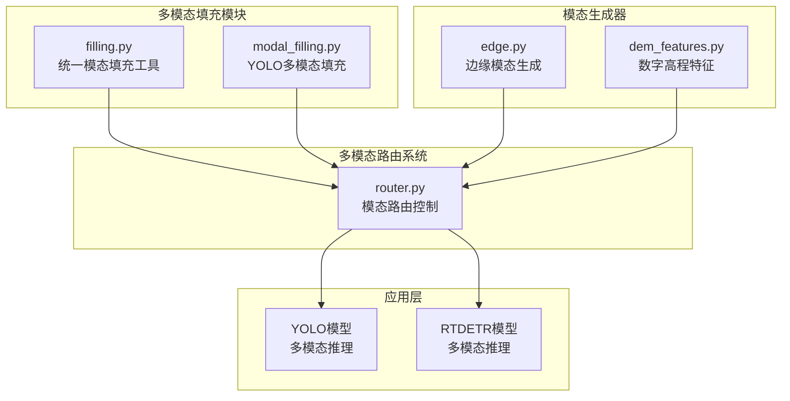

**图表来源**
- [filling.py:1-175](file://ultralytics/nn/mm/filling.py#L1-L175)
- [router.py:157-240](file://ultralytics/nn/mm/router.py#L157-L240)

## 核心组件

### ModalityFiller类

ModalityFiller是通道重复填充策略的核心实现类，提供了多种填充策略的统一接口：

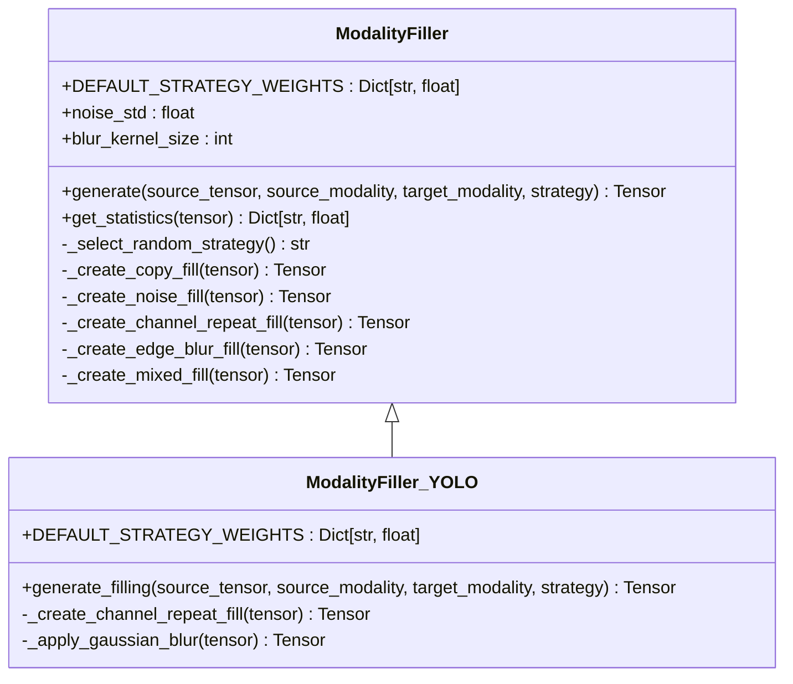

**图表来源**
- [filling.py:14-118](file://ultralytics/nn/mm/filling.py#L14-L118)
- [modal_filling.py:12-194](file://ultralytics/models/yolo/multimodal/modal_filling.py#L12-L194)

### 通道适配函数

`adapt_xch`函数提供了通用的通道数量适配功能：

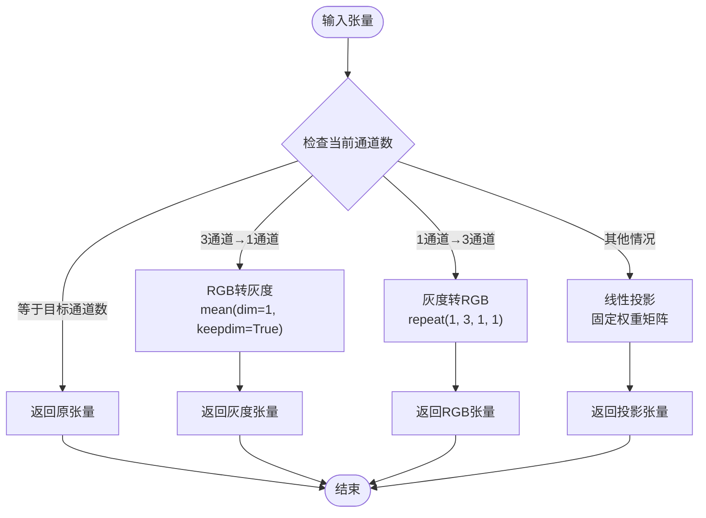

**图表来源**
- [filling.py:151-174](file://ultralytics/nn/mm/filling.py#L151-L174)

**章节来源**
- [filling.py:77-82](file://ultralytics/nn/mm/filling.py#L77-L82)
- [modal_filling.py:113-130](file://ultralytics/models/yolo/multimodal/modal_filling.py#L113-L130)

## 架构概览

通道重复填充策略在整个多模态系统中的工作流程：

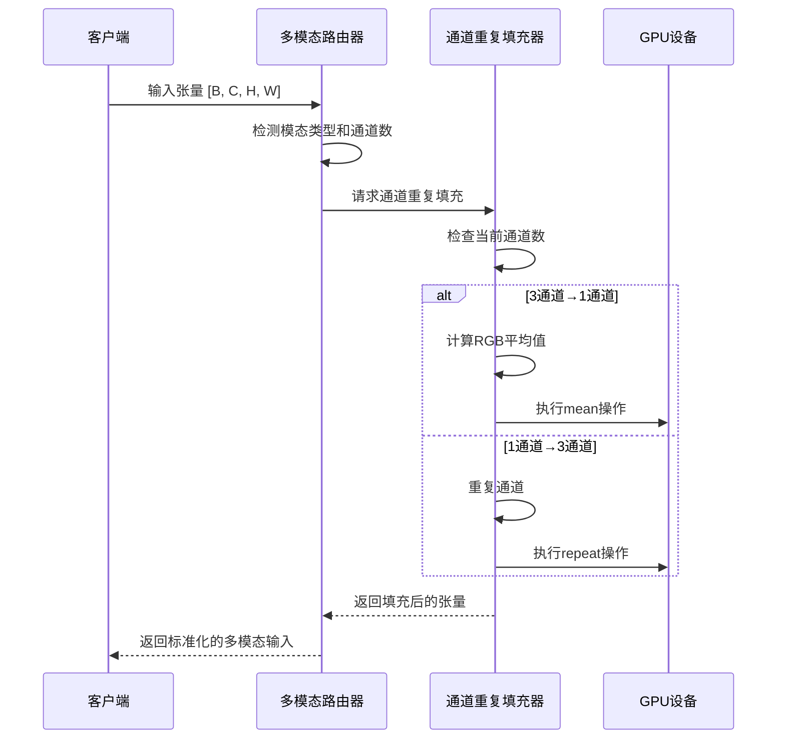

**图表来源**
- [router.py:180-240](file://ultralytics/nn/mm/router.py#L180-L240)
- [filling.py:77-82](file://ultralytics/nn/mm/filling.py#L77-L82)

## 详细组件分析

### RGB到灰度图转换机制

#### 数学原理

RGB到灰度图的转换基于加权平均的数学公式：

```
Gray = 0.299 × R + 0.587 × G + 0.114 × B
```

这个权重系数来源于人眼对不同颜色光谱的敏感度：

- **红色通道权重 (0.299)**：人眼对红光的敏感度相对较低
- **绿色通道权重 (0.587)**：人眼对绿光最敏感
- **蓝色通道权重 (0.114)**：人眼对蓝光敏感度最低

#### 实现细节

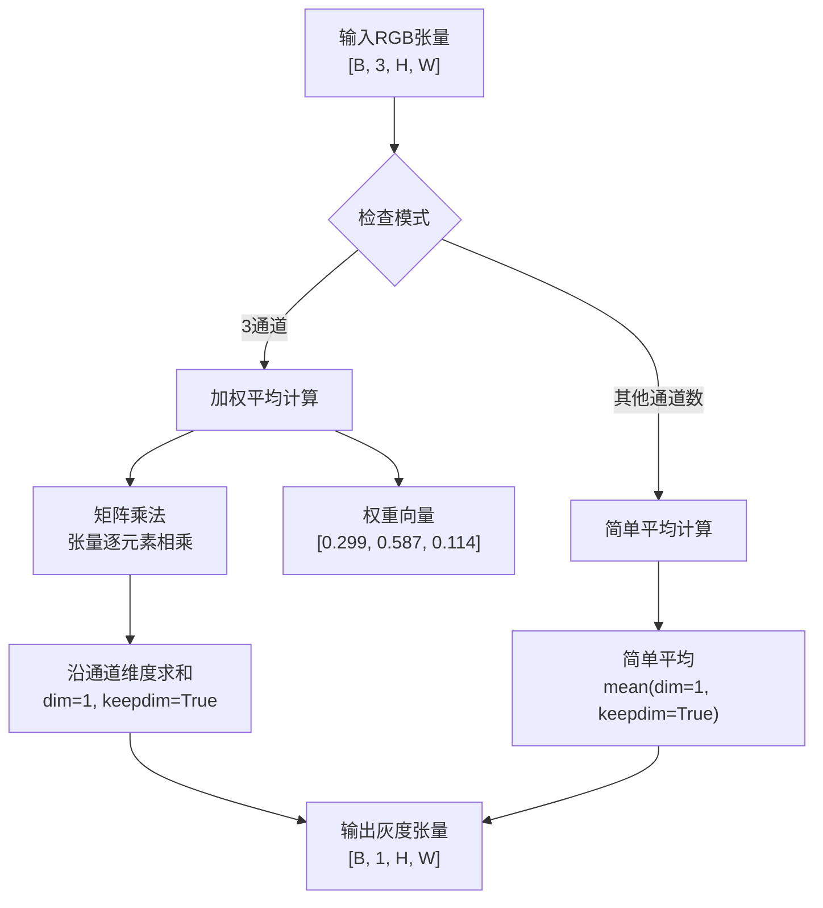

**图表来源**
- [edge.py:144-150](file://ultralytics/nv/mm/generators/edge.py#L144-L150)
- [modal_filling.py:124-127](file://ultralytics/models/yolo/multimodal/modal_filling.py#L124-L127)

**章节来源**
- [edge.py:144-150](file://ultralytics/nv/mm/generators/edge.py#L144-L150)
- [modal_filling.py:123-127](file://ultralytics/models/yolo/multimodal/modal_filling.py#L123-L127)

### 灰度图到RGB转换机制

#### 通道重复操作

灰度图到RGB的转换是最简单的通道扩展操作，通过重复单个通道来填充三个通道：

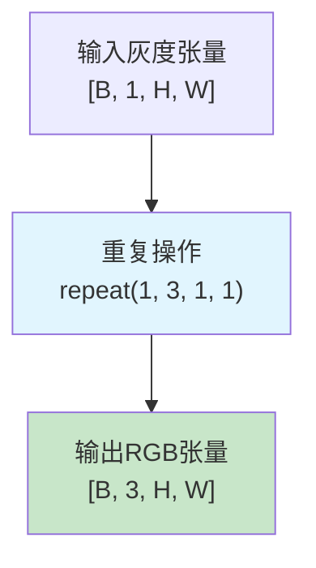

**图表来源**
- [filling.py:81-82](file://ultralytics/nn/mm/filling.py#L81-L82)
- [modal_filling.py:128-130](file://ultralytics/models/yolo/multimodal/modal_filling.py#L128-L130)

#### 数学复杂度分析

- **时间复杂度**：O(B × H × W)，其中B为批量大小，H和W分别为高度和宽度
- **空间复杂度**：O(B × H × W)，因为需要存储重复后的3通道张量
- **内存访问模式**：连续内存访问，具有良好的缓存局部性

**章节来源**
- [filling.py:77-82](file://ultralytics/nn/mm/filling.py#L77-L82)
- [modal_filling.py:113-130](file://ultralytics/models/yolo/multimodal/modal_filling.py#L113-L130)

### mean操作的数学原理

#### 通道维度处理

mean操作在PyTorch中的实现遵循以下数学原理：

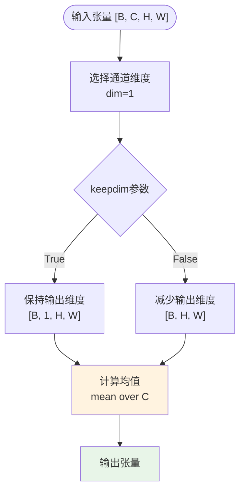

**图表来源**
- [filling.py:79](file://ultralytics/nn/mm/filling.py#L79)
- [modal_filling.py:125](file://ultralytics/models/yolo/multimodal/modal_filling.py#L125)

#### 数学性质

- **线性性质**：mean(a + b) = mean(a) + mean(b)
- **齐次性质**：mean(k × a) = k × mean(a)
- **单调性**：如果 a ≤ b，则 mean(a) ≤ mean(b)
- **保号性**：如果 a ≥ 0，则 mean(a) ≥ 0

**章节来源**
- [filling.py:79](file://ultralytics/nn/mm/filling.py#L79)
- [modal_filling.py:125](file://ultralytics/models/yolo/multimodal/modal_filling.py#L125)

### 不同通道数之间的转换逻辑

#### 3通道转1通道的平均操作

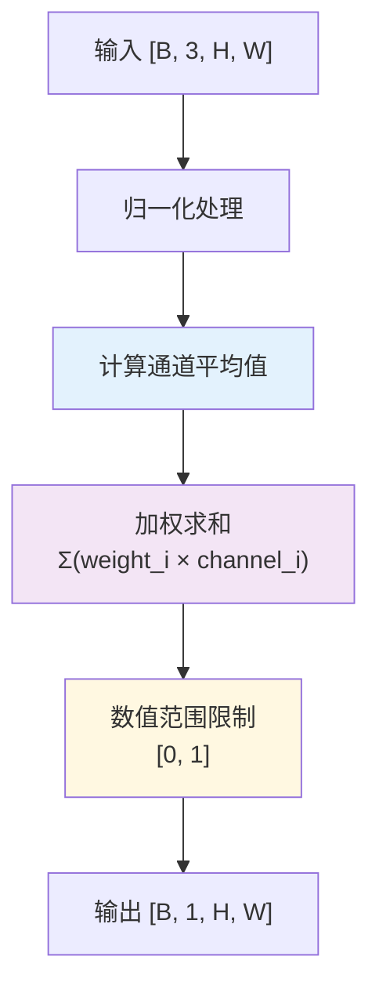

**图表来源**
- [edge.py:144-150](file://ultralytics/nv/mm/generators/edge.py#L144-L150)
- [filling.py:79](file://ultralytics/nn/mm/filling.py#L79)

#### 1通道转3通道的重复操作

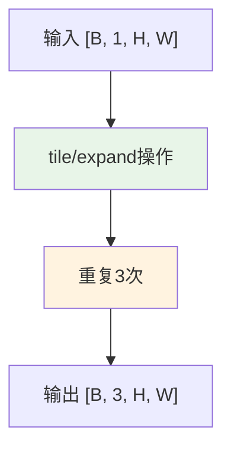

**图表来源**
- [filling.py:82](file://ultralytics/nn/mm/filling.py#L82)
- [modal_filling.py:130](file://ultralytics/models/yolo/multimodal/modal_filling.py#L130)

**章节来源**
- [filling.py:77-82](file://ultralytics/nn/mm/filling.py#L77-L82)
- [modal_filling.py:113-130](file://ultralytics/models/yolo/multimodal/modal_filling.py#L113-L130)

## 依赖关系分析

### 组件耦合关系

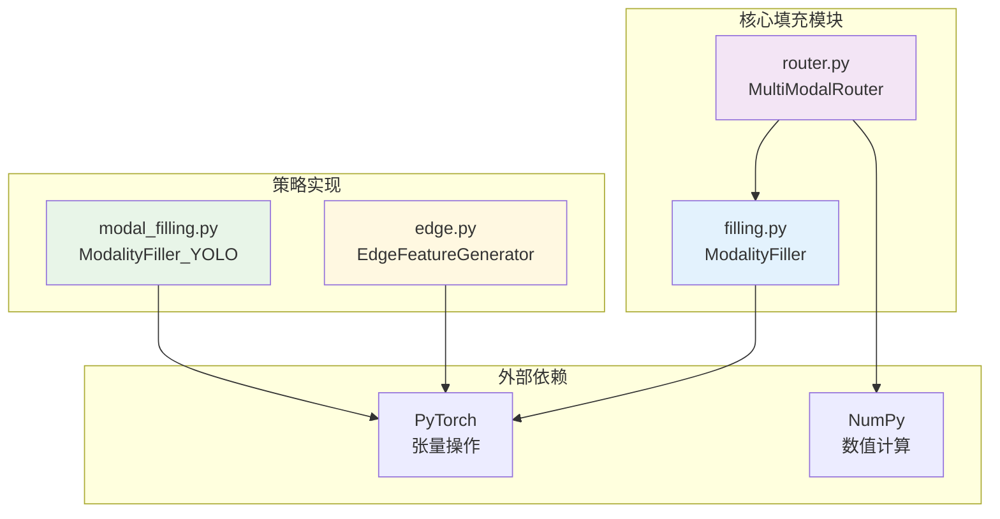

**图表来源**
- [filling.py:10-11](file://ultralytics/nn/mm/filling.py#L10-L11)
- [router.py:180-240](file://ultralytics/nn/mm/router.py#L180-L240)

### 关键依赖链

1. **ModalityFiller** → **torch.Tensor**：依赖PyTorch张量操作
2. **MultiModalRouter** → **ModalityFiller**：路由系统依赖填充策略
3. **EdgeFeatureGenerator** → **ModalityFiller**：边缘生成器使用填充策略
4. **YOLO ModalityFiller** → **torch.nn.functional**：使用PyTorch函数库

**章节来源**
- [filling.py:10-11](file://ultralytics/nn/mm/filling.py#L10-L11)
- [router.py:180-240](file://ultralytics/nn/mm/router.py#L180-L240)

## 性能考虑

### 计算效率优化

#### 内存访问模式

通道重复填充操作具有优秀的内存访问模式：

- **连续内存布局**：张量在内存中按行优先顺序存储
- **缓存友好**：重复操作利用了良好的局部性
- **向量化支持**：现代GPU可以高效执行向量化操作

#### 时间复杂度分析

| 操作类型 | 时间复杂度 | 空间复杂度 | 说明 |
|---------|-----------|-----------|------|
| RGB→灰度 | O(B×H×W×C) | O(B×H×W) | 加权平均计算 |
| 灰度→RGB | O(B×H×W) | O(B×H×W×3) | 通道重复 |
| 通用适配 | O(B×H×W×min(C1,C2)) | O(B×H×W×C2) | 线性投影 |

#### GPU加速特性

- **并行计算**：每个像素的计算都是独立的
- **内存带宽**：主要受限于内存带宽而非计算能力
- **批处理优化**：支持批量张量操作提高吞吐量

### 内存管理策略

#### 张量生命周期

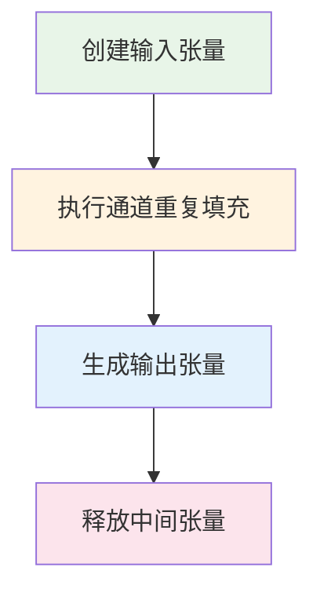

#### 内存峰值估计

对于输入张量[B, C, H, W]：
- **RGB→灰度**：内存峰值约为原始张量的1/3
- **灰度→RGB**：内存峰值约为原始张量的3倍
- **通用适配**：内存峰值约为原始张量的max(C, C')倍

## 故障排除指南

### 常见问题及解决方案

#### 通道数不匹配错误

**问题描述**：目标模态的通道数与期望值不一致

**解决方案**：
1. 检查输入张量的形状
2. 验证目标模态配置
3. 使用`adapt_xch`函数进行自动适配

#### 数值溢出问题

**问题描述**：填充操作导致数值超出有效范围

**解决方案**：
1. 在噪声填充中使用`torch.clamp`限制范围
2. 确保输入数据在[0, 1]范围内
3. 检查dtype设置是否正确

#### 性能问题诊断

**问题描述**：通道重复填充操作运行缓慢

**诊断步骤**：
1. 检查GPU内存使用情况
2. 验证批处理大小设置
3. 确认张量是否在GPU上执行

**章节来源**
- [filling.py:72-75](file://ultralytics/nn/mm/filling.py#L72-L75)
- [modal_filling.py:108-111](file://ultralytics/models/yolo/multimodal/modal_filling.py#L108-L111)

### 调试技巧

#### 日志记录

```python
# 启用详细日志
import logging
logging.basicConfig(level=logging.DEBUG)

# 检查张量形状
print(f"输入形状: {tensor.shape}")
print(f"输出形状: {result.shape}")

# 验证数值范围
print(f"数值范围: [{tensor.min()}, {tensor.max()}]")
```

#### 性能监控

```python
import time
import torch

# 性能计时
start_time = time.time()
result = channel_repeat_fill(tensor)
end_time = time.time()

print(f"执行时间: {end_time - start_time:.4f}秒")
```

## 结论

通道重复填充策略作为多模态计算机视觉系统的核心组件，提供了高效、可靠的通道维度转换能力。该策略的主要优势包括：

### 技术优势

1. **数学严谨性**：基于严格的数学原理，确保转换的准确性
2. **性能高效**：利用GPU并行计算和优化的内存访问模式
3. **灵活适配**：支持任意通道数之间的转换
4. **鲁棒性强**：具有良好的数值稳定性和错误处理机制

### 应用价值

- **多模态融合**：实现RGB与深度、热成像等模态的有效融合
- **模型兼容性**：确保不同架构模型的通道数要求得到满足
- **推理效率**：在推理阶段提供快速的模态转换能力
- **训练稳定性**：通过合理的填充策略提高训练的稳定性

### 发展前景

随着多模态学习技术的不断发展，通道重复填充策略将继续演进，可能的发展方向包括：
- 更智能的填充策略选择机制
- 自适应的权重调整算法
- 更高效的GPU内核实现
- 更广泛的模态支持

该策略为构建高性能的多模态计算机视觉系统奠定了坚实的基础，是实现跨模态数据融合的关键技术之一。